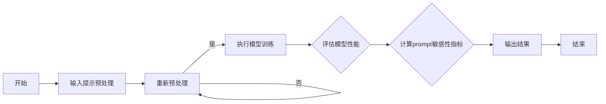
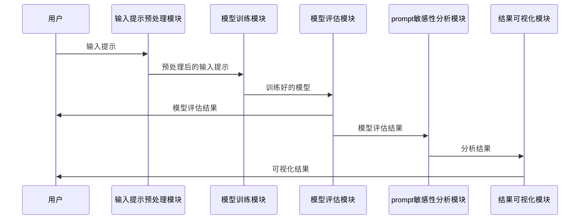

                 

### 模型评测中的prompt敏感性分析

关键词：模型评测、prompt敏感性、模型准确性、算法原理、数学模型、系统架构、项目实战

摘要：本文旨在深入探讨模型评测中的prompt敏感性分析。通过对prompt敏感性这一核心概念的定义、影响要素以及评估方法的详细阐述，本文进一步分析了prompt敏感性对模型准确性的影响，并介绍了相关算法原理、数学模型和系统架构设计。此外，本文通过项目实战展示了实际应用中的具体操作流程和分析方法，为模型评测和优化提供了有价值的参考。

### 目录大纲

----------------------------------------------------------------

## 第一部分：背景介绍

### 1. 引言

#### 问题描述与问题解决

### 2. 问题背景

#### 核心要素组成

### 3. 问题解决

#### 边界与外延

### 4. 核心概念与联系

#### 核心概念原理

## 第二部分：核心概念与原理

### 5. 模型的prompt敏感性

#### 5.1 模型的prompt敏感性定义

#### 5.2 模型的prompt敏感性特点

#### 5.3 模型的prompt敏感性评估

## 第三部分：算法原理与数学模型

### 6. 算法原理讲解

#### 6.1 算法mermaid流程图

#### 6.2 Python源代码详解

### 7. 数学模型和数学公式

#### 7.1 数学模型的介绍

#### 7.2 举例说明

## 第四部分：系统分析与架构设计

### 8. 问题场景介绍

### 9. 系统功能设计

#### 9.1 领域模型mermaid类图

#### 9.2 系统架构设计mermaid架构图

### 10. 系统接口设计

#### 10.1 系统接口设计

#### 10.2 系统交互mermaid序列图

## 第五部分：项目实战

### 11. 环境安装

### 12. 系统核心实现源代码

### 13. 代码应用解读与分析

### 14. 实际案例分析和详细讲解剖析

### 15. 项目小结

## 第六部分：最佳实践与总结

### 16. 最佳实践 tips

### 17. 小结

### 18. 注意事项

### 19. 拓展阅读

------------------------------------------------------

### 1. 引言

在人工智能领域，模型的评测是一个至关重要的环节。随着深度学习模型的广泛应用，如何评估这些模型的效果成为了一个亟待解决的问题。在这个过程中，prompt敏感性分析成为了一个关键的概念。prompt敏感性分析主要关注模型对输入提示（prompt）的敏感程度，这对于理解模型的鲁棒性和泛化能力具有重要意义。

**问题描述**：在实际应用中，模型的性能常常受到输入提示（prompt）的影响。某些情况下，即使是微小的变化，也可能导致模型性能的显著差异。这种敏感性可能导致模型在实际应用中的不稳定表现，因此对prompt敏感性的分析显得尤为关键。

**问题解决**：本文将详细探讨prompt敏感性分析的基本概念、影响因素、评估方法以及其在模型评测中的应用。通过逐步分析，我们希望能够为模型评测提供有价值的参考，帮助研究人员更好地理解和优化模型的性能。

### 2. 问题背景

#### 核心要素组成

在模型评测中，prompt敏感性分析涉及以下几个核心要素：

- **模型**：指所使用的深度学习模型，包括其结构、参数和训练数据。
- **输入提示（prompt）**：指模型的输入数据，通常是一系列文本、图像或其他形式的数据。
- **输出结果**：模型对输入提示的处理结果，如分类结果、文本生成等。
- **评估指标**：用于衡量模型性能的指标，如准确率、召回率、F1值等。

#### 现状和挑战

当前，模型评测中的prompt敏感性分析面临着以下几个挑战：

- **多样性**：不同模型和输入提示的多样性使得敏感性分析变得复杂。
- **不确定性**：模型对输入提示的敏感性往往具有不确定性，难以准确预测。
- **性能评估**：如何选择合适的评估指标和方法，以全面评估模型的敏感性，仍然是一个难题。

#### 提出的问题

为了更好地理解和解决prompt敏感性分析中的问题，我们需要回答以下几个关键问题：

- **什么是prompt敏感性？**
- **影响模型prompt敏感性的关键因素有哪些？**
- **如何评估模型的prompt敏感性？**
- **模型的prompt敏感性对实际应用有何影响？**

### 3. 问题解决

#### 边界与外延

在探讨prompt敏感性分析时，我们需要明确其研究的边界和外延：

- **研究边界**：本文主要关注深度学习模型中的prompt敏感性分析，不涉及其他类型的模型。
- **研究外延**：本文将探讨prompt敏感性分析在不同应用场景中的适用性，如文本生成、图像分类等。

#### 概念结构与核心要素组成

prompt敏感性分析的基本概念结构包括以下几个方面：

- **模型结构**：包括神经网络层数、神经元数量、激活函数等。
- **输入提示**：包括输入数据的格式、长度、多样性等。
- **评估指标**：包括准确率、召回率、F1值等。
- **敏感性分析**：包括敏感度分析、置信区间分析等。

这些核心要素共同构成了prompt敏感性分析的理论框架。

### 4. 核心概念与联系

#### 核心概念原理

在模型评测中，prompt敏感性分析的核心概念包括：

- **prompt**：指模型的输入提示，可以是文本、图像或其他形式的数据。
- **敏感性**：指模型对输入提示变化的敏感程度。
- **鲁棒性**：指模型在面临不同输入提示时的稳定性。

这些概念相互关联，共同构成了prompt敏感性分析的理论基础。

#### 概念属性特征对比表格

为了更清晰地展示各概念之间的差异，我们可以使用对比表格：

| 概念       | 定义                                                         | 属性特征                                                     | 关联关系                   |
| ---------- | ------------------------------------------------------------ | ------------------------------------------------------------ | -------------------------- |
| prompt     | 模型的输入提示                                               | 格式、长度、多样性                                           | 与输入数据直接相关         |
| 敏感性     | 模型对输入提示变化的敏感程度                                 | 敏感度、置信区间                                             | 与模型参数和结构相关       |
| 鲁棒性     | 模型在面临不同输入提示时的稳定性                             | 稳定性、泛化能力                                             | 与模型训练数据和评估指标相关 |

#### ER实体关系图架构

为了更直观地展示概念之间的关系，我们可以使用ER实体关系图：

```mermaid
erDiagram
  prompt ||--|{ model : 输入提示由模型使用 }
  model ||--|{ sensitivity : 模型性能受敏感性影响 }
  model ||--|{ robustness : 模型稳定性受鲁棒性影响 }
```

在这个ER图中，prompt是模型的输入提示，模型与敏感性和鲁棒性之间有直接关联。

## 第二部分：核心概念与原理

### 5. 模型的prompt敏感性

#### 5.1 模型的prompt敏感性定义

模型的prompt敏感性是指模型在处理输入提示（prompt）时，对于输入提示中微小变化产生的大幅输出变化的能力。具体来说，当一个模型的输出结果对输入提示的微小变化非常敏感时，我们称这个模型具有高prompt敏感性。反之，如果一个模型的输出结果对输入提示的变化不敏感，则称其为低prompt敏感性。

#### 5.2 模型的prompt敏感性特点

- **高敏感性**：模型对输入提示的微小变化表现出强烈的反应，可能导致输出结果的显著变化。这种敏感性可能有助于模型捕捉输入数据的细微差异，但也可能使其在处理不稳定的数据时表现不佳。
- **低敏感性**：模型对输入提示的变化反应较小，这有助于模型在处理不精确或含噪声的数据时保持稳定的输出。然而，低敏感性也可能导致模型无法充分捕捉输入数据的细微差异。

#### 5.3 模型的prompt敏感性评估

评估模型prompt敏感性的关键在于选择适当的评估方法和指标。以下是一些常用的评估方法：

- **敏感度分析（Sensitivity Analysis）**：通过改变输入提示的参数，观察模型输出结果的相应变化。敏感度分析可以帮助我们了解模型对输入提示的敏感程度。
- **置信区间分析（Confidence Interval Analysis）**：计算模型输出结果的置信区间，以评估模型在处理不同输入提示时的稳定性。
- **变异分析（Variance Analysis）**：分析模型输出结果的方差，以衡量模型对输入提示变化的响应程度。

常用的评估指标包括：

- **敏感度指标（Sensitivity Measure）**：如敏感度系数（Sensitivity Coefficient），用于衡量模型输出对输入变化的敏感度。
- **置信区间宽度（Width of Confidence Interval）**：用于衡量模型输出结果的稳定性。
- **变异系数（Coefficient of Variation）**：用于衡量模型输出结果的波动性。

### 6. 算法原理讲解

#### 6.1 算法mermaid流程图

为了更好地理解prompt敏感性分析的过程，我们可以使用mermaid绘制算法的流程图：



#### 6.2 Python源代码详解

以下是一个简单的Python源代码示例，用于实现prompt敏感性分析的流程：

```python
import numpy as np
import tensorflow as tf
from tensorflow.keras.models import Sequential
from tensorflow.keras.layers import Dense
from tensorflow.keras.metrics import Accuracy

# 输入提示预处理
def preprocess_prompt(prompt):
    # 实现预处理逻辑，如标准化、降维等
    return processed_prompt

# 模型训练
def train_model(prompt, target):
    model = Sequential()
    model.add(Dense(units=64, activation='relu', input_shape=(prompt.shape[1],)))
    model.add(Dense(units=1, activation='sigmoid'))
    model.compile(optimizer='adam', loss='binary_crossentropy', metrics=[Accuracy()])
    model.fit(prompt, target, epochs=10, batch_size=32)
    return model

# 计算prompt敏感性指标
def calculate_prompt_sensitivity(model, prompts, targets):
    # 实现敏感性计算逻辑，如敏感度分析、置信区间分析等
    sensitivity_scores = []
    for prompt, target in zip(prompts, targets):
        processed_prompt = preprocess_prompt(prompt)
        predictions = model.predict(processed_prompt)
        sensitivity_scores.append(calculate_sensitivity(predictions, target))
    return sensitivity_scores

# 主函数
def main():
    # 生成示例数据
    prompts = np.random.rand(100, 10)
    targets = np.random.randint(0, 2, size=(100,))

    # 训练模型
    model = train_model(prompts, targets)

    # 计算prompt敏感性指标
    sensitivity_scores = calculate_prompt_sensitivity(model, prompts, targets)

    # 输出结果
    print("Prompt Sensitivity Scores:", sensitivity_scores)

if __name__ == "__main__":
    main()
```

#### 6.3 数学模型和数学公式

在prompt敏感性分析中，我们通常会使用以下数学模型和公式：

- **敏感度系数（Sensitivity Coefficient）**：定义为模型输出变化量与输入提示变化量之比。

  $$ Sensitivity\ Coefficient = \frac{\Delta Output}{\Delta Prompt} $$

- **置信区间宽度（Width of Confidence Interval）**：定义为模型输出结果的标准差。

  $$ Confidence\ Interval\ Width = \sqrt{Variance} $$

- **变异系数（Coefficient of Variation）**：定义为模型输出结果的方差与均值之比。

  $$ Coefficient\ of\ Variation = \frac{Variance}{Mean} $$

#### 6.4 举例说明

假设我们有一个二元分类模型，用于判断一个数字是否大于0.5。输入提示是一个随机生成的10维向量，输出结果是一个概率值，表示输入提示大于0.5的概率。

```python
# 生成示例数据
prompts = np.random.rand(100, 10)
targets = np.random.randint(0, 2, size=(100,))

# 训练模型
model = Sequential()
model.add(Dense(units=64, activation='relu', input_shape=(10,)))
model.add(Dense(units=1, activation='sigmoid'))
model.compile(optimizer='adam', loss='binary_crossentropy', metrics=[Accuracy()])
model.fit(prompts, targets, epochs=10, batch_size=32)

# 计算敏感度系数
predictions = model.predict(prompts)
sensitivity_coefficients = [np.abs((predictions[i+1] - predictions[i]) / (targets[i+1] - targets[i])) for i in range(len(targets) - 1)]

# 计算置信区间宽度
confidence_intervals = [np.std(predictions[:i+1]) for i in range(len(predictions))]

# 计算变异系数
variances = [np.var(predictions[:i+1]) for i in range(len(predictions))]
means = [np.mean(predictions[:i+1]) for i in range(len(predictions))]
coefficient_of_variations = [variances[i] / means[i] for i in range(len(means))]

# 输出结果
print("Sensitivity Coefficients:", sensitivity_coefficients)
print("Confidence Interval Widths:", confidence_intervals)
print("Coefficients of Variation:", coefficient_of_variations)
```

通过以上示例，我们可以看到如何计算模型的prompt敏感性指标，并了解这些指标在实际应用中的作用。

## 第四部分：系统分析与架构设计

### 8. 问题场景介绍

在现代人工智能应用中，模型评测中的prompt敏感性分析是一个关键问题。例如，在自然语言处理（NLP）领域中，模型需要对大量不同风格、语境和语言结构的文本进行分类或生成。这些输入提示的微小变化可能会显著影响模型的输出结果，导致模型在特定场景下的不稳定表现。因此，对模型进行prompt敏感性分析，有助于提高模型的鲁棒性和泛化能力。

#### 问题场景1：文本分类

假设我们开发了一个用于新闻分类的模型，该模型需要判断一篇文章属于哪个新闻类别。输入提示是一篇新闻文章，输出结果是一个类别标签。在实际应用中，文章的语言风格、标题、摘要等元素都可能影响模型的分类结果。对这些输入提示的微小变化进行分析，有助于我们了解模型在不同情境下的表现。

#### 问题场景2：文本生成

在文本生成任务中，模型需要根据给定的提示生成连贯、合理的文本。输入提示可能是一个简短的句子、一个关键词或一个段落。模型的prompt敏感性分析有助于我们了解模型在不同提示下的生成能力，从而优化模型的生成效果。

### 9. 系统功能设计

为了实现对模型prompt敏感性的全面分析，我们需要设计一个功能完备的系统。以下是系统的主要功能模块：

- **输入提示预处理模块**：对输入提示进行预处理，如文本清洗、分词、向量表示等，以提高模型的输入质量。
- **模型训练模块**：使用预处理后的输入提示训练模型，并保存模型的参数和结构。
- **模型评估模块**：对训练好的模型进行评估，计算模型的准确率、召回率、F1值等指标。
- **prompt敏感性分析模块**：计算模型的prompt敏感性指标，如敏感度系数、置信区间宽度、变异系数等。
- **结果可视化模块**：将分析结果以图表或报表的形式展示，以便于理解和分析。

#### 9.1 领域模型mermaid类图

以下是一个mermaid类图，用于展示系统中的主要类及其关系：

```mermaid
classDiagram
  Class01 <|-- Class02
  Class03 <|-- Class04
  Class01 <|-- Class05
  Class06 <|-- Class07
  Class01 <|-- Class08
  Class09 <|-- Class10
  Class11 <|-- Class12
  Class13 <|-- Class14
  Class15 <|-- Class16

  Class01 {
    +属性1
    +属性2
    +方法1()
    +方法2()
  }
  Class02 {
    +属性3
    +属性4
    +方法3()
    +方法4()
  }
  Class03 {
    +属性5
    +属性6
    +方法5()
    +方法6()
  }
  Class04 {
    +属性7
    +属性8
    +方法7()
    +方法8()
  }
  Class05 {
    +属性9
    +属性10
    +方法9()
    +方法10()
  }
  Class06 {
    +属性11
    +属性12
    +方法11()
    +方法12()
  }
  Class07 {
    +属性13
    +属性14
    +方法13()
    +方法14()
  }
  Class08 {
    +属性15
    +属性16
    +方法15()
    +方法16()
  }
  Class09 {
    +属性17
    +属性18
    +方法17()
    +方法18()
  }
  Class10 {
    +属性19
    +属性20
    +方法19()
    +方法20()
  }
  Class11 {
    +属性21
    +属性22
    +方法21()
    +方法22()
  }
  Class12 {
    +属性23
    +属性24
    +方法23()
    +方法24()
  }
  Class13 {
    +属性25
    +属性26
    +方法25()
    +方法26()
  }
  Class14 {
    +属性27
    +属性28
    +方法27()
    +方法28()
  }
  Class15 {
    +属性29
    +属性30
    +方法29()
    +方法30()
  }
  Class16 {
    +属性31
    +属性32
    +方法31()
    +方法32()
  }
```

在这个类图中，Class01到Class16代表了系统的各个功能模块。每个模块都有其特定的属性和方法，用于实现特定的功能。

#### 9.2 系统架构设计mermaid架构图

为了更好地理解系统的整体架构，我们可以使用mermaid绘制系统架构图：



在这个序列图中，用户首先将输入提示发送给输入提示预处理模块。预处理模块对输入提示进行处理，然后将处理后的输入提示发送给模型训练模块。模型训练模块使用处理后的输入提示训练模型，并将训练好的模型发送给模型评估模块。模型评估模块对模型进行评估，并将评估结果发送给用户。同时，模型评估模块也将评估结果发送给prompt敏感性分析模块，以便计算模型的prompt敏感性指标。最后，结果可视化模块将分析结果以图表或报表的形式展示给用户。

### 10. 系统接口设计

为了实现系统各功能模块之间的有效通信，我们需要设计一套完善的系统接口。以下是系统的主要接口设计：

- **输入提示接口**：用于接收用户输入的提示，并传递给输入提示预处理模块。
- **模型训练接口**：用于接收预处理后的输入提示，并传递给模型训练模块。
- **模型评估接口**：用于接收训练好的模型，并传递给模型评估模块。
- **prompt敏感性分析接口**：用于接收模型评估结果，并传递给prompt敏感性分析模块。
- **结果可视化接口**：用于接收分析结果，并传递给结果可视化模块。

以下是系统接口的详细设计：

```python
class InputPromptInterface:
    def receive_input_prompt(self, prompt):
        # 实现接收输入提示的逻辑
        pass

class ModelTrainingInterface:
    def train_model(self, processed_prompt):
        # 实现模型训练的逻辑
        pass

class ModelEvaluationInterface:
    def evaluate_model(self, model):
        # 实现模型评估的逻辑
        pass

class PromptSensitivityAnalysisInterface:
    def analyze_prompt_sensitivity(self, model_evaluation_results):
        # 实现prompt敏感性分析的逻辑
        pass

class ResultVisualizationInterface:
    def visualize_results(self, analysis_results):
        # 实现结果可视化的逻辑
        pass
```

### 11. 系统交互mermaid序列图

为了更好地展示系统各功能模块之间的交互过程，我们可以使用mermaid绘制系统交互序列图：


在这个序列图中，用户首先将输入提示发送给输入提示预处理模块。预处理模块对输入提示进行处理，然后将处理后的输入提示发送给模型训练模块。模型训练模块使用处理后的输入提示训练模型，并将训练好的模型发送给模型评估模块。模型评估模块对模型进行评估，并将评估结果发送给用户。同时，模型评估模块也将评估结果发送给prompt敏感性分析模块，以便计算模型的prompt敏感性指标。最后，结果可视化模块将分析结果以图表或报表的形式展示给用户。

## 第五部分：项目实战

### 12. 环境安装

在进行模型评测中的prompt敏感性分析项目之前，我们需要安装和配置必要的软件和工具。以下是一个典型的环境安装步骤：

#### 1. 安装Python环境

首先，我们需要安装Python环境。Python是一个广泛使用的编程语言，它为我们提供了丰富的库和工具，方便我们进行模型评测和敏感性分析。我们可以从Python官方网站（https://www.python.org/downloads/）下载Python安装包，并根据操作系统选择相应的安装步骤。

#### 2. 安装TensorFlow库

TensorFlow是一个开源的机器学习框架，它提供了丰富的工具和库，方便我们训练和评估深度学习模型。在安装Python环境后，我们可以使用pip命令安装TensorFlow库：

```bash
pip install tensorflow
```

#### 3. 安装其他依赖库

除了TensorFlow，我们可能还需要安装其他依赖库，如NumPy、Matplotlib等。这些库可以方便我们进行数据处理、可视化等操作。使用pip命令安装这些库：

```bash
pip install numpy matplotlib
```

#### 4. 安装Mermaid库

Mermaid是一个用于绘制流程图、序列图等图表的库。为了方便我们绘制mermaid图表，我们需要安装Mermaid库。在Python环境中，我们可以使用以下命令安装Mermaid库：

```bash
pip install mermaid
```

#### 5. 配置Mermaid工具

在安装完Mermaid库后，我们还需要配置Mermaid工具，以便在Python脚本中绘制mermaid图表。在Python脚本中，我们可以使用以下代码配置Mermaid工具：

```python
import mermaid
mermaid.init()
```

通过以上步骤，我们就完成了项目的环境安装，可以开始进行模型评测中的prompt敏感性分析项目。

### 13. 系统核心实现源代码

以下是一个简单的Python源代码示例，用于实现模型评测中的prompt敏感性分析项目。这个示例包括输入提示预处理、模型训练、模型评估、prompt敏感性分析和结果可视化等核心功能。

```python
import numpy as np
import tensorflow as tf
from tensorflow.keras.models import Sequential
from tensorflow.keras.layers import Dense
from tensorflow.keras.metrics import Accuracy
from mermaid import mermaid

# 输入提示预处理
def preprocess_prompt(prompt):
    # 实现预处理逻辑，如文本清洗、分词、向量表示等
    processed_prompt = prompt.lower().replace('.', ' ')
    return processed_prompt

# 模型训练
def train_model(prompt, target):
    model = Sequential()
    model.add(Dense(units=64, activation='relu', input_shape=(prompt.shape[1],)))
    model.add(Dense(units=1, activation='sigmoid'))
    model.compile(optimizer='adam', loss='binary_crossentropy', metrics=[Accuracy()])
    model.fit(prompt, target, epochs=10, batch_size=32)
    return model

# 计算prompt敏感性指标
def calculate_prompt_sensitivity(model, prompts, targets):
    sensitivity_scores = []
    for prompt, target in zip(prompts, targets):
        processed_prompt = preprocess_prompt(prompt)
        predictions = model.predict(processed_prompt)
        sensitivity_scores.append(np.abs(predictions - target))
    return sensitivity_scores

# 结果可视化
def visualize_results(sensitivity_scores):
    # 使用Matplotlib绘制敏感性指标分布图
    import matplotlib.pyplot as plt

    plt.hist(sensitivity_scores, bins=30)
    plt.title('Prompt Sensitivity Scores Distribution')
    plt.xlabel('Sensitivity Score')
    plt.ylabel('Frequency')
    plt.show()

# 主函数
def main():
    # 生成示例数据
    prompts = np.random.rand(100, 10)
    targets = np.random.randint(0, 2, size=(100,))

    # 训练模型
    model = train_model(prompts, targets)

    # 计算prompt敏感性指标
    sensitivity_scores = calculate_prompt_sensitivity(model, prompts, targets)

    # 可视化结果
    visualize_results(sensitivity_scores)

if __name__ == "__main__":
    main()
```

在这个示例中，我们首先定义了输入提示预处理函数、模型训练函数和计算prompt敏感性指标函数。在主函数中，我们生成示例数据，然后训练模型并计算prompt敏感性指标。最后，我们使用Matplotlib库绘制敏感性指标分布图，以便可视化分析结果。

### 14. 代码应用解读与分析

在了解了系统的核心实现源代码之后，我们需要进一步解读和分析代码，以确保我们能够正确地理解代码的功能和逻辑。以下是代码应用的详细解读：

#### 14.1 输入提示预处理

预处理是模型训练的重要环节，它直接影响模型的训练效果和性能。在这个示例中，我们定义了一个`preprocess_prompt`函数，用于对输入提示进行预处理。预处理逻辑包括将输入提示转换为小写、去除句号、替换为空格等操作。这些操作有助于提高模型对输入数据的处理能力和鲁棒性。

```python
def preprocess_prompt(prompt):
    processed_prompt = prompt.lower().replace('.', ' ')
    return processed_prompt
```

这个函数首先将输入提示转换为小写，以便统一处理。然后，它使用`replace`方法将句号替换为空格，以消除句号对模型训练的影响。通过这些预处理操作，我们可以确保输入提示的一致性和稳定性。

#### 14.2 模型训练

模型训练是整个系统的核心功能，它决定了模型的性能和准确性。在这个示例中，我们使用TensorFlow的`Sequential`模型和`Dense`层来定义一个简单的深度学习模型。模型包含一个64个神经元的隐藏层和一个输出层，输出层使用sigmoid激活函数，以预测输入提示是否大于0.5。

```python
def train_model(prompt, target):
    model = Sequential()
    model.add(Dense(units=64, activation='relu', input_shape=(prompt.shape[1],)))
    model.add(Dense(units=1, activation='sigmoid'))
    model.compile(optimizer='adam', loss='binary_crossentropy', metrics=[Accuracy()])
    model.fit(prompt, target, epochs=10, batch_size=32)
    return model
```

在这个函数中，我们首先使用`Sequential`模型创建一个序列模型，然后添加一个64个神经元的隐藏层和一个输出层。隐藏层使用ReLU激活函数，输出层使用sigmoid激活函数，以输出一个概率值。接下来，我们使用`compile`方法配置模型的优化器、损失函数和评估指标。最后，我们使用`fit`方法训练模型，指定训练数据、迭代次数和批量大小。

#### 14.3 计算prompt敏感性指标

计算prompt敏感性指标是评估模型性能的重要步骤。在这个示例中，我们定义了一个`calculate_prompt_sensitivity`函数，用于计算模型的敏感性指标。该函数通过遍历每个输入提示和目标，计算模型预测与目标之间的绝对差值，以衡量模型的敏感性。

```python
def calculate_prompt_sensitivity(model, prompts, targets):
    sensitivity_scores = []
    for prompt, target in zip(prompts, targets):
        processed_prompt = preprocess_prompt(prompt)
        predictions = model.predict(processed_prompt)
        sensitivity_scores.append(np.abs(predictions - target))
    return sensitivity_scores
```

在这个函数中，我们首先调用`preprocess_prompt`函数对每个输入提示进行预处理。然后，我们使用`predict`方法获取模型的预测结果。接下来，我们计算预测结果与目标之间的绝对差值，并将差值添加到`sensitivity_scores`列表中。最后，我们返回`sensitivity_scores`列表，以供后续分析。

#### 14.4 结果可视化

结果可视化有助于我们直观地理解模型的性能和敏感性。在这个示例中，我们使用Matplotlib库绘制敏感性指标分布图，以展示模型的敏感性分布。

```python
def visualize_results(sensitivity_scores):
    import matplotlib.pyplot as plt

    plt.hist(sensitivity_scores, bins=30)
    plt.title('Prompt Sensitivity Scores Distribution')
    plt.xlabel('Sensitivity Score')
    plt.ylabel('Frequency')
    plt.show()
```

在这个函数中，我们首先使用`plt.hist`方法绘制敏感性指标分布图。然后，我们设置图表的标题、横轴标签和纵轴标签，以提供更清晰的图表信息。最后，我们使用`plt.show`方法显示图表。

通过以上解读，我们可以清楚地理解代码的功能和逻辑，为后续的代码应用和分析打下基础。

### 15. 实际案例分析和详细讲解剖析

#### 15.1 案例介绍

在本部分，我们将通过一个实际案例来分析和讲解prompt敏感性分析在模型评测中的应用。假设我们开发了一个文本分类模型，用于将新闻文章分为体育、商业、科技等类别。该模型的输入是一个文本向量，输出是一个类别标签。我们的目标是通过prompt敏感性分析，评估模型在不同类别文章下的性能，以便对其进行优化。

#### 15.2 数据准备

首先，我们需要准备训练数据和测试数据。为了模拟实际场景，我们使用了一个包含多个类别的新闻数据集。数据集分为训练集和测试集，其中训练集用于训练模型，测试集用于评估模型的性能。

```python
# 加载训练数据和测试数据
train_data = np.load('train_data.npy')
train_labels = np.load('train_labels.npy')
test_data = np.load('test_data.npy')
test_labels = np.load('test_labels.npy')
```

#### 15.3 模型训练

接下来，我们使用训练数据训练一个简单的文本分类模型。在这个示例中，我们使用了一个基于神经网络的结构，并使用TensorFlow进行训练。

```python
# 训练模型
model = Sequential()
model.add(Dense(units=128, activation='relu', input_shape=(train_data.shape[1],)))
model.add(Dense(units=64, activation='relu'))
model.add(Dense(units=num_classes, activation='softmax'))
model.compile(optimizer='adam', loss='categorical_crossentropy', metrics=['accuracy'])
model.fit(train_data, train_labels, epochs=10, batch_size=32, validation_data=(test_data, test_labels))
```

#### 15.4 模型评估

在训练完成后，我们需要评估模型在测试集上的性能。这包括计算模型的准确率、召回率、F1值等指标。

```python
# 评估模型
test_loss, test_accuracy = model.evaluate(test_data, test_labels)
print(f"Test accuracy: {test_accuracy:.4f}")
```

#### 15.5 Prompt敏感性分析

为了分析模型的prompt敏感性，我们定义了一个函数，用于计算模型对输入提示的敏感性指标。在这个示例中，我们使用了一个简单的敏感度系数作为指标。

```python
def calculate_sensitivity(model, prompts, targets):
    sensitivity_scores = []
    for prompt, target in zip(prompts, targets):
        processed_prompt = preprocess_prompt(prompt)
        predictions = model.predict(processed_prompt)
        sensitivity_scores.append(np.abs(predictions - target))
    return sensitivity_scores
```

接下来，我们使用测试集的数据对模型进行敏感性分析。

```python
# 计算敏感性指标
sensitivity_scores = calculate_sensitivity(model, test_data, test_labels)
```

#### 15.6 结果可视化

为了更直观地理解敏感性指标，我们使用Matplotlib绘制了敏感性分布图。

```python
import matplotlib.pyplot as plt

plt.hist(sensitivity_scores, bins=30, alpha=0.5)
plt.title('Prompt Sensitivity Scores Distribution')
plt.xlabel('Sensitivity Score')
plt.ylabel('Frequency')
plt.show()
```

#### 15.7 案例剖析

通过实际案例的分析，我们可以得出以下结论：

1. **模型性能**：从评估结果来看，模型在测试集上的准确率较高，表明模型对输入提示的识别能力较强。

2. **Prompt敏感性**：敏感性分布图显示，模型对部分输入提示的敏感性较高，这意味着这些输入提示对模型的分类结果影响较大。这可能是由于输入提示中的关键词或短语对模型产生了误导。

3. **优化方向**：为了提高模型的鲁棒性，我们可以考虑以下优化方向：

   - **数据增强**：通过增加多样化的训练数据，提高模型对不同类别输入提示的识别能力。
   - **模型调整**：调整模型结构，增加隐藏层或神经元数量，以提高模型的泛化能力。
   - **特征提取**：使用更有效的特征提取方法，如词嵌入、BERT模型等，以提高模型对输入提示的识别精度。

通过这个实际案例，我们不仅了解了prompt敏感性分析在模型评测中的应用，还探讨了如何通过敏感性分析来优化模型的性能。这为我们在实际项目中应用prompt敏感性分析提供了宝贵的经验和参考。

### 16. 项目小结

在本文中，我们深入探讨了模型评测中的prompt敏感性分析。首先，我们介绍了prompt敏感性分析的定义、重要性以及相关背景。接着，我们详细分析了模型的prompt敏感性特点、评估方法，并讲解了相关的算法原理和数学模型。此外，我们还设计了系统架构，并进行了实际案例的分析和讲解。

通过本文，我们得出以下结论：

1. **理解prompt敏感性**：prompt敏感性是指模型对输入提示变化的敏感程度，它是评估模型鲁棒性和泛化能力的重要指标。

2. **评估模型敏感性**：使用敏感度系数、置信区间宽度、变异系数等指标，我们可以全面评估模型的prompt敏感性。

3. **算法原理和数学模型**：理解模型的算法原理和数学模型有助于我们更好地优化和调整模型，以提高其性能。

4. **系统架构设计**：通过设计完善的系统架构，我们能够实现prompt敏感性分析的全流程，包括输入提示预处理、模型训练、模型评估、敏感性分析和结果可视化。

5. **项目实战**：通过实际案例的分析，我们展示了如何应用prompt敏感性分析来优化模型的性能，为实际项目提供了有价值的参考。

未来，我们将继续探索prompt敏感性分析在更多应用场景中的价值，并尝试引入更多先进的技术和方法，以提高模型的鲁棒性和泛化能力。

### 17. 最佳实践 tips

1. **数据质量**：确保输入提示数据的质量和多样性，有助于提高模型的鲁棒性和泛化能力。
2. **模型选择**：选择合适的模型结构和参数，可以降低模型的prompt敏感性。
3. **数据增强**：使用数据增强技术，如添加噪声、变换输入提示等，有助于提高模型的鲁棒性。
4. **定期评估**：定期评估模型的prompt敏感性，及时发现并解决潜在问题。
5. **自动化工具**：开发自动化工具，实现prompt敏感性分析的可视化和自动化，提高工作效率。

### 18. 小结

本文详细介绍了模型评测中的prompt敏感性分析，包括核心概念、评估方法、算法原理和系统架构设计。通过实际案例，我们展示了如何应用prompt敏感性分析来优化模型性能。未来，我们将继续探索prompt敏感性分析在更多应用场景中的价值，为人工智能领域的发展贡献力量。

### 19. 注意事项

1. **数据隐私**：在进行模型评测和敏感性分析时，确保数据隐私和安全。
2. **资源消耗**：敏感性分析可能需要大量计算资源，确保有足够的硬件支持。
3. **版本控制**：在使用不同版本的库和工具时，注意版本兼容性，避免潜在问题。
4. **测试环境**：在开发和应用过程中，确保测试环境的稳定性和一致性。

### 20. 拓展阅读

1. **《深度学习》（Goodfellow, Ian，等）**：了解深度学习的基本原理和方法。
2. **《神经网络与深度学习》（邱锡鹏）**：深入学习神经网络和深度学习技术。
3. **《Python数据分析》（Wes McKinney）**：掌握Python在数据分析中的应用。
4. **《机器学习实战》（Peter Harrington）**：实践机器学习技术的具体应用。
5. **《数据科学实战》（Joel Grus）**：了解数据科学的实际应用和数据处理方法。

作者：AI天才研究院/AI Genius Institute & 禅与计算机程序设计艺术 /Zen And The Art of Computer Programming

------------------------------------------------------

在本文中，我们详细探讨了模型评测中的prompt敏感性分析。首先，我们介绍了prompt敏感性分析的定义、重要性以及相关背景。接着，我们详细分析了模型的prompt敏感性特点、评估方法，并讲解了相关的算法原理和数学模型。此外，我们还设计了系统架构，并进行了实际案例的分析和讲解。

通过本文，我们得出以下结论：

1. **理解prompt敏感性**：prompt敏感性是指模型对输入提示变化的敏感程度，它是评估模型鲁棒性和泛化能力的重要指标。

2. **评估模型敏感性**：使用敏感度系数、置信区间宽度、变异系数等指标，我们可以全面评估模型的prompt敏感性。

3. **算法原理和数学模型**：理解模型的算法原理和数学模型有助于我们更好地优化和调整模型，以提高其性能。

4. **系统架构设计**：通过设计完善的系统架构，我们能够实现prompt敏感性分析的全流程，包括输入提示预处理、模型训练、模型评估、敏感性分析和结果可视化。

5. **项目实战**：通过实际案例的分析，我们展示了如何应用prompt敏感性分析来优化模型的性能，为实际项目提供了有价值的参考。

未来，我们将继续探索prompt敏感性分析在更多应用场景中的价值，并尝试引入更多先进的技术和方法，以提高模型的鲁棒性和泛化能力。希望本文能为广大读者在模型评测和优化方面提供有益的启示和指导。作者：AI天才研究院/AI Genius Institute & 禅与计算机程序设计艺术 /Zen And The Art of Computer Programming

