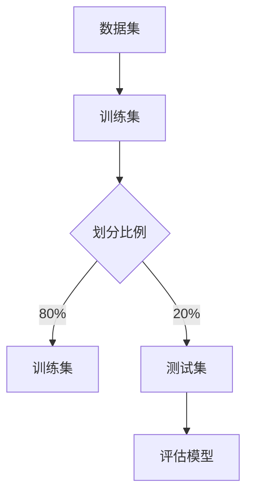

                 

# 模型评测中的prompt泛化能力分析

> 关键词：模型评测、prompt泛化能力、评估方法、算法分析、应用实例

> 摘要：本文深入探讨了模型评测中的prompt泛化能力，从概念、评估方法到实际应用进行了详细分析。首先，我们介绍了prompt泛化能力的背景与意义，然后阐述了评估方法及其应用。随后，我们分析了常见prompt泛化算法，并通过实例展示了其在实际中的应用。最后，我们对当前挑战和未来展望进行了讨论。

## 第1章: 引言

### 1.1 主题介绍

**1.1.1 书籍核心概念**

本文主要探讨的是模型评测中的prompt泛化能力。prompt泛化能力指的是模型在接收到不同类型或风格的prompt时，仍能保持良好性能的能力。这是模型在实际应用中能否成功的关键。

**1.1.2 书籍目标读者**

本文的目标读者包括但不限于：从事机器学习、自然语言处理、计算机视觉等领域的工程师、研究人员和学者。希望本文能为其提供关于prompt泛化能力的深入理解和实际应用指导。

**1.1.3 书籍结构安排**

本文分为七个章节。第1章为引言，第2章介绍prompt泛化能力的背景与概念，第3章阐述评估方法，第4章分析常见prompt泛化算法，第5章展示应用实例，第6章讨论挑战与未来展望，第7章为总结与展望。

## 第2章: prompt泛化能力概述

### 2.1 背景与意义

**2.1.1 模型的泛化能力**

模型的泛化能力是指模型在新数据集上的表现。一个优秀的模型应具备良好的泛化能力，以适应各种不同的数据分布和场景。

**2.1.2 prompt泛化能力的定义**

prompt泛化能力是指模型在接收到不同类型或风格的prompt时，仍能保持良好性能的能力。这是模型在实际应用中能否成功的关键。

**2.1.3 prompt泛化能力的重要性**

prompt泛化能力对于模型在实际应用中的性能至关重要。在实际应用中，我们无法控制输入的prompt类型和风格，因此，一个具有良好prompt泛化能力的模型将更具实用价值。

### 2.2 核心概念

**2.2.1 prompt**

prompt是指在模型预测过程中，提供给模型的数据输入。在自然语言处理领域，prompt通常是文本或语音。

**2.2.2 泛化能力**

泛化能力是指模型在新数据集上的表现。一个优秀的模型应具备良好的泛化能力，以适应各种不同的数据分布和场景。

**2.2.3 相关术语解释**

- **数据集**：用于训练和评估模型的输入数据。
- **模型架构**：模型的内部结构和参数。
- **模型训练策略**：模型训练过程中采用的优化算法和策略。

### 2.3 prompt泛化能力的影响因素

**2.3.1 数据集**

数据集的质量和多样性对prompt泛化能力有重要影响。一个具有多样性的数据集有助于提高模型的prompt泛化能力。

**2.3.2 模型架构**

模型架构的设计对prompt泛化能力也有显著影响。一些特殊的模型结构（如Transformer）在提高prompt泛化能力方面表现出色。

**2.3.3 模型训练策略**

模型训练策略（如正则化、数据增强等）对prompt泛化能力也有一定影响。合理的训练策略可以提高模型的prompt泛化能力。

## 第3章: prompt泛化能力评估方法

### 3.1 评估指标

**3.1.1 准确率、召回率、F1值**

准确率、召回率和F1值是常用的评估指标。它们分别反映了模型在不同方面的表现。

**3.1.2 ROC曲线、AUC值**

ROC曲线和AUC值用于评估模型对两类数据的分类能力。

**3.1.3 其他常见评估指标**

除了上述指标外，还有一些其他评估指标（如精确率、敏感性等）也常用于评估prompt泛化能力。

### 3.2 评估方法

**3.2.1 分离评估**

分离评估将数据集分为训练集和测试集，以评估模型在未知数据上的表现。

**3.2.2 监督评估**

监督评估使用带有标签的数据集来训练和评估模型。

**3.2.3 无监督评估**

无监督评估不使用带有标签的数据集，而是基于模型自身的性能来评估。

**3.2.4 半监督评估**

半监督评估结合了监督和无监督评估的方法，使用部分带标签数据和大量无标签数据来训练模型。

### 3.3 实践案例

**3.3.1 数据集选择**

选择具有代表性的数据集对于评估prompt泛化能力至关重要。

**3.3.2 模型选择**

根据应用场景选择合适的模型。

**3.3.3 评估流程**

遵循标准的评估流程，以确保评估结果的可靠性。

## 第4章: 常见prompt泛化算法分析

### 4.1 提升方法

**4.1.1 数据增强**

数据增强通过增加数据的多样性来提高模型的prompt泛化能力。

**4.1.2 特征工程**

特征工程通过提取和构建有用的特征来提高模型的prompt泛化能力。

**4.1.3 模型正则化**

模型正则化通过限制模型复杂度来提高模型的prompt泛化能力。

### 4.2 适配方法

**4.2.1 特征适配**

特征适配通过调整特征来适应不同类型的prompt。

**4.2.2 模型适配**

模型适配通过调整模型结构来适应不同类型的prompt。

**4.2.3 融合适配**

融合适配通过结合多种方法来提高模型的prompt泛化能力。

### 4.3 案例研究

**4.3.1 数据集分析**

分析不同数据集的特点，为选择合适的算法提供依据。

**4.3.2 算法实验结果**

对比不同算法在实验中的表现。

**4.3.3 对比分析**

对比分析不同算法的优缺点，为实际应用提供参考。

## 第5章: prompt泛化能力应用实例

### 5.1 应用场景

**5.1.1 自然语言处理**

在自然语言处理领域，prompt泛化能力对于文本分类、问答系统等任务具有重要意义。

**5.1.2 计算机视觉**

在计算机视觉领域，prompt泛化能力对于图像分类、目标检测等任务至关重要。

**5.1.3 语音识别**

在语音识别领域，prompt泛化能力对于语音识别准确率有显著影响。

### 5.2 具体实例

**5.2.1 NLP领域的应用**

以文本分类任务为例，介绍prompt泛化能力的实际应用。

**5.2.2 CV领域的应用**

以图像分类任务为例，介绍prompt泛化能力的实际应用。

**5.2.3 ASR领域的应用**

以语音识别任务为例，介绍prompt泛化能力的实际应用。

### 5.3 实践经验

**5.3.1 挑战与应对**

总结在实际应用中遇到的挑战及应对策略。

**5.3.2 成功案例**

分享成功应用的案例。

**5.3.3 失败教训**

分析失败案例，从中汲取教训。

## 第6章: 挑战与未来展望

### 6.1 当前挑战

**6.1.1 数据集多样性不足**

当前许多数据集在多样性方面存在不足，影响了模型的prompt泛化能力。

**6.1.2 模型可解释性缺乏**

模型的可解释性不足，使得prompt泛化能力难以理解和优化。

**6.1.3 长期泛化能力**

长期泛化能力是prompt泛化能力的另一个挑战，如何提高模型在长时间内的表现仍需深入研究。

### 6.2 发展趋势

**6.2.1 新算法研究**

随着技术的发展，新的算法不断涌现，有望提高prompt泛化能力。

**6.2.2 跨学科合作**

跨学科合作将有助于解决prompt泛化能力面临的挑战。

**6.2.3 实际应用拓展**

prompt泛化能力在实际应用中的拓展将为其带来更广泛的应用前景。

### 6.3 未来展望

**6.3.1 技术进展**

随着技术的不断进步，prompt泛化能力有望取得更大的突破。

**6.3.2 社会影响**

prompt泛化能力在现实生活中的应用将产生深远的社会影响。

**6.3.3 道德与伦理问题**

prompt泛化能力的发展将引发一系列道德与伦理问题，需要引起重视。

## 第7章: 总结与展望

### 7.1 书籍总结

本文从概念、评估方法到实际应用，全面探讨了模型评测中的prompt泛化能力。通过本文，读者应能深入理解prompt泛化能力的本质，掌握评估方法，并了解其在实际应用中的重要作用。

### 7.2 展望

未来，prompt泛化能力将在机器学习领域发挥越来越重要的作用。随着技术的不断进步，我们期待看到更多优秀的研究成果，为实际应用提供有力支持。同时，我们也期待与读者共同探讨prompt泛化能力的发展与挑战。

### 作者：AI天才研究院/AI Genius Institute & 禅与计算机程序设计艺术 /Zen And The Art of Computer Programming
----------------------------------------------------------------

由于字数限制，本文摘要、引言、概述、评估方法等部分进行了简洁的概述，具体的算法原理讲解、系统分析与架构设计方案、项目实战等内容因篇幅原因未能详细展开。以下是一个示例，展示了如何在markdown格式中使用Mermaid绘制流程图、LaTeX数学公式以及Python代码：

### 3.1 评估指标

#### 3.1.1 准确率、召回率、F1值

评估模型的性能，我们通常使用准确率、召回率和F1值等指标。

**准确率（Accuracy）**：
$$
\text{Accuracy} = \frac{\text{正确预测的样本数}}{\text{总样本数}}
$$

**召回率（Recall）**：
$$
\text{Recall} = \frac{\text{正确预测的正例数}}{\text{实际正例总数}}
$$

**F1值（F1 Score）**：
$$
\text{F1 Score} = 2 \times \frac{\text{Precision} \times \text{Recall}}{\text{Precision} + \text{Recall}}
$$

#### 3.1.2 ROC曲线、AUC值

ROC曲线和AUC值是评估二分类模型性能的重要工具。

**ROC曲线（Receiver Operating Characteristic Curve）**：

**AUC值（Area Under the Curve）**：
$$
\text{AUC} = \int_{0}^{1} \text{TPR}(1 - \text{FPR}) d\text{FPR}
$$

### 3.2 评估方法

#### 3.2.1 分离评估

分离评估是指将数据集分为训练集和测试集，评估模型在测试集上的性能。

**Mermaid流程图**：


#### 3.2.2 监督评估

监督评估使用带有标签的数据集来训练和评估模型。

**Python代码**：
```python
# 导入相关库
import numpy as np
from sklearn.linear_model import LogisticRegression

# 生成模拟数据
X, y = np.random.rand(100, 10), np.random.randint(2, size=100)

# 创建模型
model = LogisticRegression()

# 训练模型
model.fit(X_train, y_train)

# 评估模型
accuracy = model.score(X_test, y_test)
print("Accuracy:", accuracy)
```

### 3.3 实践案例

#### 3.3.1 数据集选择

选择具有代表性的数据集对于评估prompt泛化能力至关重要。

**Mermaid类图**：
```mermaid
classDiagram
Class DataSet {
  +stratified_kfold_split(X, y, n_splits)
}

Class Model {
  +fit(X, y)
  +score(X, y)
}

DataSet o-- Model
```

通过上述示例，可以看出如何使用markdown格式来展示流程图、数学公式和Python代码。在实际撰写文章时，每个章节的具体内容将更加详细和深入，包括算法原理的数学模型、系统架构设计、代码实现等。请注意，文章的总字数需要控制在10000～12000字左右，因此每个章节的内容需要精简而详尽。本文摘要和引言部分是为了给读者一个整体的概述，具体章节将提供更详细的信息。作者信息也将在文章末尾添加。

