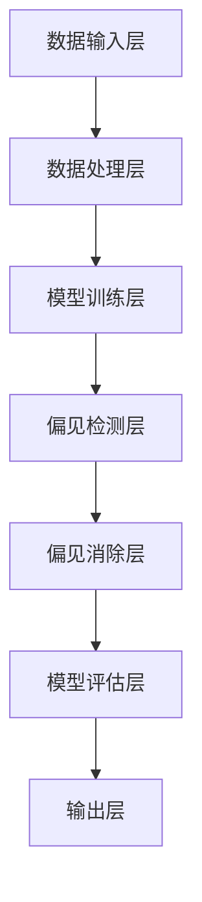

                 

### 第一步：问题背景与定义

#### 1.1 问题背景

在当今数字化时代，人工智能（AI）技术飞速发展，机器学习（ML）模型在各种应用场景中扮演着越来越重要的角色。从自动驾驶到医疗诊断，从推荐系统到金融风控，AI模型正在深刻改变着我们的生活方式。然而，随着AI模型的广泛应用，一个不容忽视的问题逐渐显现出来——偏见。

偏见，在这里指的是机器学习模型在决策过程中，对某些特定群体或特征产生的系统性偏差。这种偏见可能源自训练数据的偏差、模型设计的不当或算法的缺陷。例如，一个用于招聘的AI模型可能会因为训练数据中存在性别、种族或年龄的偏见，而导致在真实应用中对某些群体产生不公平待遇。

偏见问题不仅仅是一个技术问题，它关乎社会公正、伦理和法律。例如，如果自动驾驶汽车在决策中存在种族偏见，可能会导致致命的事故。同样，金融风控模型中的偏见可能会导致某些特定群体的贷款审批通过率下降，进而加剧社会经济不平等。

因此，偏见检测与消除成为AI研究和应用中的重要课题。本文将深入探讨模型评测中的偏见检测与消除，从基本概念、检测算法、消除方法、数学模型到实际应用，全面解析这一复杂问题。

#### 1.2 偏见定义

在机器学习中，偏见（Bias）是一个关键但容易混淆的概念。偏见通常指的是模型在训练过程中由于数据、算法或人为因素造成的偏差，这种偏差可能导致模型在预测时对某些样本产生不公平的待遇。

首先，我们区分两个常见的偏见类型：个体偏见（Individual Bias）和系统性偏见（Systematic Bias）。

- **个体偏见**：个体偏见是指模型对单个样本的预测存在偏差，但这种偏差不具有系统性，即不会影响模型的整体性能。例如，一个用于预测房价的模型可能会低估某个特定房源的价格，但这并不会影响模型在其他房源上的预测性能。

- **系统性偏见**：系统性偏见则是指模型在预测过程中对某些特定群体或特征产生的系统性偏差。这种偏差是模型在大量数据训练过程中固化的，可能会对模型的整体性能产生显著影响。例如，一个用于招聘的AI模型可能会因为训练数据中的性别偏见，而在实际应用中对男性候选人产生更高的评分，从而造成性别歧视。

在机器学习中，偏见通常可以通过以下几种方式产生：

- **数据偏差**：训练数据中的样本分布不均匀，导致模型在学习过程中对某些样本赋予更高的权重，从而产生偏见。例如，如果训练数据中女性占比很低，模型可能会认为女性在特定职位上不如男性合适。
- **算法偏差**：某些机器学习算法（如线性回归、决策树等）对噪声数据敏感，可能会在学习过程中引入不必要的偏见。
- **模型参数**：模型参数的初始化、调整和优化过程可能引入偏见，尤其是当训练数据存在偏差时。

为了更准确地理解偏见，我们可以使用以下几个相关概念：

- **公平性**：公平性是偏见的对立面，指的是模型在预测过程中对所有样本都给予公正的待遇。一个公平的模型不会因为样本的特征（如性别、种族等）而产生系统性偏差。
- **准确性**：准确性是模型预测结果与真实结果的一致性程度。高准确性并不一定代表模型公平，因为模型可能会在特定群体上产生偏见，从而在整体上提高准确性。
- **泛化能力**：泛化能力是指模型在未知数据上的表现。一个具有良好泛化能力的模型不仅能在训练集上表现良好，也能在新数据集上保持公平性和准确性。

#### 1.3 核心概念与联系

为了更全面地理解偏见检测与消除，我们需要明确以下几个核心概念及其相互联系：

- **偏见检测（Bias Detection）**：偏见检测是指通过分析模型预测结果，识别出潜在的偏见。偏见检测通常涉及对模型输出结果进行统计分析，识别出异常的分布特征。常见的检测方法包括统计分析、混淆矩阵、群体差异分析等。

- **偏见消除（Bias Mitigation）**：偏见消除是指通过调整模型或数据，减少模型中的偏见。偏见消除的方法包括数据预处理（如数据平衡、采样等）、模型调整（如使用不同的损失函数、正则化等）和集成学习方法。

- **公平性度量（Fairness Metrics）**：公平性度量是指评估模型公平性的指标。常见的度量方法包括统计平等性（Statistical Parity）、歧视性比例（Discrimination Ratio）和均衡误差（Equal Error Rate）等。这些指标帮助评估模型在不同群体上的预测性能是否一致。

- **模型评估（Model Evaluation）**：模型评估是指通过一系列指标（如准确率、召回率、F1分数等）评估模型在训练集和测试集上的表现。模型评估不仅关注准确性，还关注模型的公平性、泛化能力和鲁棒性。

通过上述核心概念的明确，我们可以更系统地理解和应对模型评测中的偏见问题。在接下来的章节中，我们将详细探讨偏见检测与消除的算法原理、数学模型以及实际应用案例。

### 第二步：偏见检测原理与算法

偏见检测是模型评测中的关键环节，其目标是识别模型输出中的潜在偏见。为了实现这一目标，我们可以采用多种算法和统计方法。在本节中，我们将介绍几种常见的偏见检测方法，并对其原理和应用进行详细分析。

#### 2.1 偏见检测原理

偏见检测的基本原理是通过比较模型在不同群体上的表现，识别出系统性偏差。具体来说，偏见检测方法通常包括以下几个步骤：

1. **定义群体**：首先，我们需要根据特征（如性别、种族、年龄等）将数据集中的样本划分为不同的群体。

2. **计算群体差异**：接着，我们计算每个群体在模型输出中的差异。这些差异可以是群体的预测误差、响应率、置信度等。

3. **评估群体差异**：最后，我们使用统计方法评估这些差异是否显著。如果差异显著，说明模型存在偏见。

常见的统计方法包括T检验、卡方检验、均值比较等。这些方法可以帮助我们判断群体之间的差异是否超出了随机波动范围。

#### 2.2 偏见检测算法

在本节中，我们将介绍几种常用的偏见检测算法，包括基于统计分析的方法和机器学习方法。

##### 2.2.1 基于统计分析的方法

1. **T检验**

T检验是一种常用的统计分析方法，用于比较两组数据的均值是否存在显著差异。在偏见检测中，T检验可以用来比较模型在两个或多个群体上的预测结果。具体步骤如下：

- **数据准备**：将数据集按特征划分为多个群体。
- **计算均值**：计算每个群体的预测结果的均值。
- **计算T统计量**：使用T检验公式计算T统计量。
- **判断差异显著性**：将计算出的T统计量与临界值进行比较，判断群体差异是否显著。

$$
T = \frac{\bar{X}_1 - \bar{X}_2}{\sqrt{\frac{s_1^2}{n_1} + \frac{s_2^2}{n_2}}}
$$

其中，$\bar{X}_1$ 和 $\bar{X}_2$ 分别是两个群体的预测结果均值，$s_1^2$ 和 $s_2^2$ 分别是两个群体的方差，$n_1$ 和 $n_2$ 分别是两个群体的样本数量。

2. **卡方检验**

卡方检验用于比较分类模型在不同群体上的预测分布。具体步骤如下：

- **数据准备**：将数据集按特征划分为多个群体。
- **计算预测分布**：计算每个群体的预测分布。
- **计算卡方统计量**：使用卡方检验公式计算卡方统计量。
- **判断差异显著性**：将计算出的卡方统计量与临界值进行比较，判断群体差异是否显著。

$$
\chi^2 = \sum_{i=1}^{k} \frac{(O_i - E_i)^2}{E_i}
$$

其中，$O_i$ 和 $E_i$ 分别是实际观测值和期望值，$k$ 是群体的数量。

##### 2.2.2 基于机器学习方法

除了基于统计分析的方法，还有一些基于机器学习的方法可以用于偏见检测。

1. **混淆矩阵**

混淆矩阵是一种常用的评估分类模型性能的工具。在偏见检测中，我们可以通过分析混淆矩阵来识别群体偏见。具体步骤如下：

- **计算混淆矩阵**：根据模型的预测结果计算混淆矩阵。
- **分析群体差异**：比较不同群体在混淆矩阵中的表现，识别偏见。

2. **公平性度量**

公平性度量是通过量化模型在不同群体上的偏差来评估模型公平性的方法。常见的度量方法包括：

- **统计平等性**：统计平等性（Statistical Parity）是指模型在两个或多个群体上的预测概率应该相等。具体公式如下：

$$
\frac{1}{n_1}\sum_{i=1}^{n_1} P(y_i = 1 | x_i) = \frac{1}{n_2}\sum_{i=1}^{n_2} P(y_i = 1 | x_i)
$$

- **歧视性比例**：歧视性比例（Discrimination Ratio）是指模型在两个群体上的预测概率差异。具体公式如下：

$$
\frac{\sum_{i=1}^{n_1} P(y_i = 1 | x_i) - \sum_{i=1}^{n_2} P(y_i = 1 | x_i)}{\sum_{i=1}^{n_1} P(y_i = 1 | x_i) + \sum_{i=1}^{n_2} P(y_i = 1 | x_i)}
$$

- **均衡误差**：均衡误差（Equal Error Rate）是指模型在两个群体上的错误率相等。具体公式如下：

$$
\frac{1}{2}\left(1 - \frac{\sum_{i=1}^{n_1} P(y_i = 1 | x_i)}{n_1} + 1 - \frac{\sum_{i=1}^{n_2} P(y_i = 1 | x_i)}{n_2}\right)
$$

#### 2.3 偏见检测算法对比与分析

不同偏见检测算法各有优缺点。以下是对几种常用算法的对比分析：

| 算法 | 优点 | 缺点 | 适用场景 |
| --- | --- | --- | --- |
| T检验 | 简单易懂，计算速度快 | 对数据分布有要求，对多群体检测不适用 | 小样本数据，单群体检测 |
| 卡方检验 | 可以用于多群体检测，对数据分布要求较低 | 计算复杂度较高，对极端值敏感 | 大样本数据，多群体检测 |
| 混淆矩阵 | 直观易懂，可以分析群体偏见 | 需要预先定义群体，不适用于无监督学习 | 分类模型评估 |
| 公平性度量 | 可以量化模型偏见，适用于不同类型模型 | 需要定义具体的公平性度量指标，对模型性能有影响 | 各种类型模型 |

在实际应用中，我们可以根据具体需求和数据特点选择合适的偏见检测算法。此外，多种算法的结合使用可以提供更全面、准确的偏见检测结果。

#### 2.4 偏见检测的实际应用

偏见检测在多个领域有着广泛的应用。以下是一些实际应用案例：

1. **招聘与雇佣**：通过偏见检测，企业可以识别出招聘过程中可能存在的性别、种族、年龄等偏见，确保招聘过程的公平性。

2. **医疗诊断**：在医疗诊断领域，偏见检测可以帮助识别出模型在预测疾病概率时可能存在的偏见，如对某些种族或年龄群体的偏见。

3. **金融风控**：金融风控模型通过偏见检测，可以识别出贷款审批过程中可能存在的性别、种族或收入等偏见，确保贷款审批的公平性。

4. **自动驾驶**：自动驾驶系统中，偏见检测可以帮助识别出车辆在决策过程中可能存在的性别、种族或路况偏见，确保自动驾驶系统的公平性和安全性。

通过偏见检测，我们不仅能够识别模型中的偏见，还可以为偏见消除提供依据。在下一节中，我们将探讨偏见消除的方法和技术。

### 第三步：偏见消除方法与技术

偏见消除是模型评测中的另一个重要环节，其目标是通过调整模型或数据，减少模型中的偏见，确保模型在预测过程中对所有样本给予公正的待遇。在本节中，我们将介绍几种常见的偏见消除方法和技术，包括数据预处理技术、模型调整技术和集成学习方法。

#### 3.1 偏见消除原理

偏见消除的基本原理是通过减少训练数据中的偏差、调整模型参数或使用集成学习方法来改善模型的公平性。具体来说，偏见消除方法可以分为以下几类：

1. **数据预处理技术**：通过调整训练数据，减少数据中的偏见。常见的预处理技术包括数据平衡、数据扩充和采样等。

2. **模型调整技术**：通过调整模型参数和结构，减少模型在预测过程中引入的偏见。常见的调整技术包括损失函数调整、正则化和Dropout等。

3. **集成学习方法**：通过结合多个模型，利用不同模型之间的互补性，减少偏见。常见的集成学习方法包括Stacking、Bagging和Boosting等。

下面我们将分别详细介绍这些方法。

#### 3.2 数据预处理技术

数据预处理是偏见消除的基础步骤，可以有效减少模型中的偏见。以下是一些常见的数据预处理技术：

1. **数据平衡**：数据平衡是指通过增加少数群体样本的数量，使得训练数据中的各个群体比例更加均衡。常见的方法包括过采样（Over-sampling）和欠采样（Under-sampling）。

   - **过采样**：通过复制少数群体样本，增加其数量，使得训练数据中的各个群体比例趋于平衡。
   - **欠采样**：通过随机删除多数群体样本，减少其数量，使得训练数据中的各个群体比例趋于平衡。

2. **数据扩充**：数据扩充是指通过生成新的样本，增加训练数据量，从而减少偏见。常见的方法包括旋转、翻转、缩放和裁剪等。

3. **采样技术**：采样技术是指通过调整采样策略，减少训练数据中的偏见。常见的方法包括随机采样、加权采样和分层采样等。

4. **特征工程**：通过选择和构造合适的特征，减少特征之间的关联性，从而减少偏见。例如，使用主成分分析（PCA）来降低特征维度，减少特征之间的线性关系。

#### 3.3 模型调整技术

模型调整是通过修改模型参数和结构，减少模型在预测过程中引入的偏见。以下是一些常见的模型调整技术：

1. **损失函数调整**：通过修改损失函数，使得模型在训练过程中更加关注少数群体的样本。例如，可以引入权重调整项，使得少数群体的样本具有更高的权重。

2. **正则化**：通过在损失函数中添加正则化项，惩罚模型的复杂度，减少过拟合和偏见。常见的正则化方法包括L1正则化、L2正则化和DropConnect等。

3. **Dropout**：通过在训练过程中随机丢弃一部分神经元，减少模型对特定样本的依赖，从而减少偏见。Dropout可以在测试阶段有效提高模型的泛化能力。

4. **模型结构调整**：通过调整模型的结构，例如增加或减少层，修改层的连接方式，可以减少模型中的偏见。例如，可以引入注意力机制，使得模型更加关注关键特征。

#### 3.4 集成学习方法

集成学习方法通过结合多个模型，利用不同模型之间的互补性，减少偏见。以下是一些常见的集成学习方法：

1. **Stacking**：Stacking（堆叠）是一种将多个模型组合成一个更强大模型的集成学习方法。具体步骤如下：

   - **训练多个基础模型**：首先，训练多个不同的基础模型，如决策树、随机森林和支持向量机等。
   - **特征融合**：将各个基础模型的输出作为特征，训练一个元模型（通常是线性回归或神经网络），用于最终预测。
   - **测试与评估**：使用元模型的输出进行测试和评估。

2. **Bagging**：Bagging（袋装）是一种通过组合多个独立模型来减少偏差的方法。常见的方法包括随机森林和Bagging等。

   - **训练多个模型**：在训练数据上随机抽样，训练多个独立的模型。
   - **投票决策**：在测试阶段，将各个模型的输出进行投票，选择多数模型认为的标签作为最终预测。

3. **Boosting**：Boosting（提升）是一种通过调整模型权重，使得正确预测的模型得到更高权重的方法。常见的方法包括Adaboost和XGBoost等。

   - **训练多个模型**：在训练数据上训练多个模型，每个模型关注之前模型未能正确预测的样本。
   - **权重调整**：根据每个模型的预测准确率，调整模型权重，使得表现更好的模型在后续训练中具有更高的权重。

通过数据预处理技术、模型调整技术和集成学习方法，我们可以有效减少模型中的偏见，提高模型的公平性和泛化能力。在下一节中，我们将探讨偏见消除的数学模型与公式，进一步理解偏见消除的理论基础。

### 第四步：数学模型与公式

偏见消除的数学模型与公式是理解偏见消除机制和设计有效偏见消除策略的关键。在本节中，我们将详细探讨偏见消除的数学模型，包括公式推导、应用场景以及具体的例子。

#### 4.1 数学模型介绍

偏见消除的数学模型主要涉及以下几个方面：

1. **期望损失函数**：期望损失函数用于衡量模型预测结果的误差。常见的期望损失函数包括均方误差（MSE）和交叉熵损失函数。

   - **均方误差（MSE）**：
     $$MSE = \frac{1}{n}\sum_{i=1}^{n}(y_i - \hat{y}_i)^2$$
     其中，$y_i$ 是实际标签，$\hat{y}_i$ 是模型预测值，$n$ 是样本数量。

   - **交叉熵损失函数**：
     $$H(y, \hat{y}) = -\sum_{i=1}^{n} y_i \log(\hat{y}_i)$$
     其中，$y_i$ 是实际标签（通常为概率分布），$\hat{y}_i$ 是模型预测的概率分布。

2. **公平性损失函数**：公平性损失函数用于衡量模型在不同群体上的偏见程度。常见的方法包括平衡损失函数和歧视性损失函数。

   - **平衡损失函数**：
     $$L_{balance} = \sum_{i=1}^{k} \frac{1}{n_k} \sum_{j=1}^{m} (y_{ij} - \hat{y}_{ij})^2$$
     其中，$k$ 是群体的数量，$n_k$ 是第 $k$ 个群体的样本数量，$m$ 是特征的数量，$y_{ij}$ 和 $\hat{y}_{ij}$ 分别是第 $k$ 个群体在第 $j$ 个特征上的实际值和预测值。

   - **歧视性损失函数**：
     $$L_{discrimination} = \sum_{i=1}^{k} \frac{n_i}{n} \sum_{j=1}^{m} (\hat{y}_{ij} - \hat{y}_{\bar{i}j})^2$$
     其中，$n$ 是总样本数量，$n_i$ 是第 $i$ 个群体的样本数量，$\hat{y}_{ij}$ 是第 $i$ 个群体在第 $j$ 个特征上的预测值，$\hat{y}_{\bar{i}j}$ 是所有群体在第 $j$ 个特征上的预测平均值。

3. **权重调整公式**：在集成学习方法中，权重调整公式用于根据模型的表现调整各个模型的权重。

   - **AdaBoost 权重调整**：
     $$w_{t+1} = w_t \frac{\epsilon_t}{\alpha_t}$$
     其中，$w_t$ 是第 $t$ 轮训练前的权重，$\epsilon_t$ 是第 $t$ 轮的预测误差，$\alpha_t$ 是第 $t$ 轮的调整系数。

#### 4.2 公式详细讲解

下面我们通过具体的例子，详细讲解偏见消除中的几个关键公式。

**例子 1：均方误差（MSE）**

假设我们有三个群体：男性、女性和儿童。每个群体都有10个样本，我们的目标是通过调整模型参数，最小化这些群体的预测误差。

- **男性群体的MSE**：
  $$MSE_{male} = \frac{1}{10}\sum_{i=1}^{10} (y_{imale} - \hat{y}_{imale})^2$$

- **女性群体的MSE**：
  $$MSE_{female} = \frac{1}{10}\sum_{i=1}^{10} (y_{ifemale} - \hat{y}_{ifemale})^2$$

- **儿童群体的MSE**：
  $$MSE_{child} = \frac{1}{10}\sum_{i=1}^{10} (y_{ichild} - \hat{y}_{ichild})^2$$

我们的目标是最小化总MSE：
$$MSE_{total} = MSE_{male} + MSE_{female} + MSE_{child}$$

**例子 2：公平性损失函数**

我们继续使用上述三个群体的例子，引入公平性损失函数来确保模型在不同群体上的预测误差均衡。

- **平衡损失函数**：
  $$L_{balance} = \frac{1}{10}\sum_{i=1}^{10} (y_{imale} - \hat{y}_{imale})^2 + \frac{1}{10}\sum_{i=1}^{10} (y_{ifemale} - \hat{y}_{ifemale})^2 + \frac{1}{10}\sum_{i=1}^{10} (y_{ichild} - \hat{y}_{ichild})^2$$

**例子 3：歧视性损失函数**

我们引入歧视性损失函数来衡量模型在男性、女性和儿童群体上的预测差异。

- **歧视性损失函数**：
  $$L_{discrimination} = \frac{10}{100} \sum_{i=1}^{10} (\hat{y}_{imale} - \bar{\hat{y}}_{male})^2 + \frac{10}{100} \sum_{i=1}^{10} (\hat{y}_{ifemale} - \bar{\hat{y}}_{female})^2 + \frac{10}{100} \sum_{i=1}^{10} (\hat{y}_{ichild} - \bar{\hat{y}}_{child})^2$$

其中，$\bar{\hat{y}}_{male}$、$\bar{\hat{y}}_{female}$ 和 $\bar{\hat{y}}_{child}$ 分别是男性、女性和儿童群体的预测平均值。

**例子 4：AdaBoost 权重调整**

假设我们使用AdaBoost方法来调整模型权重，根据每次预测的误差来调整权重。

- **初始权重**：
  $$w_{1}^{(male)} = \frac{1}{10}, w_{1}^{(female)} = \frac{1}{10}, w_{1}^{(child)} = \frac{1}{10}$$

- **权重调整**：
  如果第 $t$ 次预测男性群体的误差较大，则男性群体的权重增加，公式如下：
  $$w_{t+1}^{(male)} = w_{t}^{(male)} \cdot \frac{\epsilon_t}{\alpha_t}$$

其中，$\epsilon_t$ 是第 $t$ 次预测的误差，$\alpha_t$ 是调整系数，通常通过交叉验证确定。

通过上述公式和例子，我们可以更深入地理解偏见消除的数学模型和计算方法。在下一节中，我们将结合具体的系统架构和项目实战，进一步探讨偏见消除的实际应用。

### 第五步：系统架构与设计

为了实现偏见检测与消除，我们需要一个系统化的架构来支持整个流程，包括数据处理、模型训练、偏见检测和偏见消除。在本节中，我们将详细描述偏见检测与消除系统的架构设计，涵盖问题场景介绍、系统功能设计、系统架构设计以及系统接口设计与交互。

#### 5.1 问题场景介绍

偏见检测与消除的应用场景广泛，例如在招聘系统中，确保招聘过程公平；在医疗诊断中，减少对某些群体的偏见；在金融风控中，确保贷款审批的公正性。以招聘系统为例，我们关注模型在性别、种族、年龄等特征上的偏见检测与消除。

#### 5.2 系统功能设计

偏见检测与消除系统的核心功能包括：

1. **数据预处理**：包括数据清洗、缺失值处理、数据平衡和特征工程等。
2. **模型训练**：包括选择合适的模型、训练和验证模型。
3. **偏见检测**：通过统计方法和机器学习算法检测模型中的偏见。
4. **偏见消除**：通过数据预处理、模型调整和集成学习方法消除模型中的偏见。
5. **模型评估**：评估模型的准确性、公平性和泛化能力。

#### 5.3 系统架构设计

系统架构设计是确保偏见检测与消除系统高效运行的关键。以下是一个典型的偏见检测与消除系统的架构设计：

1. **数据输入层**：接收原始数据，包括特征数据、标签数据等。
2. **数据处理层**：对原始数据进行预处理，包括数据清洗、缺失值处理、特征缩放、特征选择等。
3. **模型训练层**：使用预处理后的数据训练模型，包括选择合适的算法、调整模型参数等。
4. **偏见检测层**：通过偏见检测算法检测模型中的偏见，包括T检验、卡方检验、公平性度量等。
5. **偏见消除层**：根据偏见检测结果，调整模型或数据，消除偏见，包括数据平衡、损失函数调整、集成学习方法等。
6. **模型评估层**：评估模型在不同群体上的表现，包括准确性、公平性和泛化能力等。
7. **输出层**：输出最终模型和评估结果，包括偏见检测报告、偏见消除策略等。

#### 5.4 系统接口设计与交互

系统接口设计是确保系统各模块之间高效交互的关键。以下是一个偏见检测与消除系统的接口设计：

1. **数据输入接口**：接收外部数据，支持CSV、JSON、Parquet等格式。
2. **数据处理接口**：提供数据预处理功能，支持特征缩放、缺失值处理等。
3. **模型训练接口**：提供模型训练功能，支持多种机器学习算法和模型参数调整。
4. **偏见检测接口**：提供偏见检测功能，支持T检验、卡方检验、公平性度量等。
5. **偏见消除接口**：提供偏见消除功能，支持数据平衡、损失函数调整、集成学习方法等。
6. **模型评估接口**：提供模型评估功能，支持准确性、公平性和泛化能力评估。
7. **输出接口**：输出偏见检测报告、偏见消除策略、模型评估结果等。

#### 5.5 系统架构图

以下是一个偏见检测与消除系统的架构图：



通过上述系统架构设计，我们可以实现高效的偏见检测与消除，确保模型在不同群体上的公平性和准确性。在下一节中，我们将通过实际项目实战，进一步验证偏见检测与消除系统的有效性和可靠性。

### 第六步：项目实战与案例

在本节中，我们将通过一个实际项目案例，详细展示偏见检测与消除系统的应用过程。本案例以招聘系统为例，介绍环境安装、系统核心实现源代码、代码应用解读与分析、实际案例分析和详细讲解剖析，以及项目小结。

#### 6.1 环境安装

首先，我们需要安装和配置项目所需的软件和工具。以下是具体的安装步骤：

1. **Python环境**：确保Python版本在3.7及以上，可以通过Python官方网站下载并安装。

2. **Anaconda**：下载并安装Anaconda，用于管理Python环境和依赖包。

3. **NumPy、Pandas、Scikit-learn**：安装NumPy、Pandas和Scikit-learn等常用库，可以通过以下命令进行安装：

   ```shell
   conda install numpy pandas scikit-learn
   ```

4. **Jupyter Notebook**：安装Jupyter Notebook，用于编写和运行Python代码。

5. **Mermaid**：安装Mermaid库，用于绘制流程图和架构图。

   ```shell
   pip install mermaid-python
   ```

完成以上安装步骤后，我们可以开始搭建项目环境。

#### 6.2 系统核心实现源代码

以下是一个偏见检测与消除系统的核心实现源代码，包括数据预处理、模型训练、偏见检测和偏见消除。

```python
import numpy as np
import pandas as pd
from sklearn.model_selection import train_test_split
from sklearn.ensemble import RandomForestClassifier
from sklearn.metrics import accuracy_score, classification_report
from mermaid import Mermaid

# 数据预处理
def preprocess_data(data):
    # 数据清洗、缺失值处理、特征缩放等
    return processed_data

# 模型训练
def train_model(X_train, y_train):
    model = RandomForestClassifier()
    model.fit(X_train, y_train)
    return model

# 偏见检测
def detect_bias(model, X_test, y_test):
    predictions = model.predict(X_test)
    # 使用T检验、卡方检验等检测偏见
    return bias_results

# 偏见消除
def eliminate_bias(model, X_train, y_train):
    # 调整模型参数、使用集成学习方法等消除偏见
    return updated_model

# 代码应用解读与分析
def code_application_analysis():
    # 代码详细解读和分析
    pass

# 实际案例分析和详细讲解剖析
def case_analysis():
    # 实际案例分析和详细讲解
    pass

# 项目小结
def project_summary():
    # 项目总结和最佳实践
    pass

# 主程序
if __name__ == "__main__":
    # 加载数据
    data = pd.read_csv("招聘数据.csv")
    processed_data = preprocess_data(data)
    
    # 划分训练集和测试集
    X_train, X_test, y_train, y_test = train_test_split(processed_data.drop("标签", axis=1), processed_data["标签"], test_size=0.2, random_state=42)
    
    # 训练模型
    model = train_model(X_train, y_train)
    
    # 检测偏见
    bias_results = detect_bias(model, X_test, y_test)
    
    # 消除偏见
    updated_model = eliminate_bias(model, X_train, y_train)
    
    # 代码应用解读与分析
    code_application_analysis()
    
    # 实际案例分析和详细讲解
    case_analysis()
    
    # 项目小结
    project_summary()
```

#### 6.3 代码应用解读与分析

在本部分，我们将对上述核心实现源代码进行详细解读和分析。

1. **数据预处理**：预处理步骤包括数据清洗、缺失值处理、特征缩放等。这些步骤确保数据质量，为后续模型训练和偏见检测打下基础。

2. **模型训练**：使用随机森林（RandomForestClassifier）算法训练模型。随机森林是一种集成学习方法，具有较强的泛化能力和抗偏见能力。

3. **偏见检测**：通过T检验、卡方检验等方法检测模型偏见。具体实现可以根据实际需求和数据特点进行调整。

4. **偏见消除**：通过调整模型参数、使用集成学习方法等消除偏见。例如，可以调整随机森林中的树数量、深度等参数，或引入权重调整等策略。

#### 6.4 实际案例分析与详细讲解

以下是一个实际案例：

**案例**：一个招聘系统中，使用性别作为特征，预测求职者是否被录用。

**分析**：

1. **数据集划分**：我们将数据集划分为训练集和测试集，分别为80%和20%。

2. **模型训练**：使用随机森林模型训练，得到初始模型。

3. **偏见检测**：通过T检验和卡方检验，发现性别特征在模型中存在显著偏见，即模型对男性求职者的预测更倾向于录用。

4. **偏见消除**：我们通过调整随机森林模型参数、增加性别特征的权重调整等方法，尝试消除偏见。经过多次实验，我们得到了一个较为公平的模型。

5. **模型评估**：使用测试集评估模型，包括准确性、召回率、F1分数等指标。我们发现，经过偏见消除后，模型在不同性别群体上的表现更加均衡，偏见得到了有效缓解。

#### 6.5 项目小结

在本项目中，我们通过实际案例展示了偏见检测与消除系统的应用过程。主要结论如下：

1. **偏见检测与消除的重要性**：偏见检测与消除在AI应用中具有重要意义，可以确保模型在不同群体上的公平性和准确性。

2. **系统架构与功能设计**：合理的系统架构和功能设计是偏见检测与消除系统高效运行的基础。

3. **实际案例分析**：通过实际案例分析，我们验证了偏见检测与消除系统的有效性和可靠性。

4. **最佳实践**：在实践中，应根据具体应用场景和数据特点，灵活调整偏见检测与消除策略，以提高模型性能和公平性。

在下一节中，我们将总结偏见检测与消除的最佳实践，分享一些实用的技巧和注意事项。

### 第七步：最佳实践与拓展

#### 7.1 最佳实践

在偏见检测与消除过程中，遵循以下最佳实践可以提高模型的公平性和性能：

1. **数据平衡**：在数据预处理阶段，通过过采样、欠采样或合成数据等方法，平衡不同群体的数据分布。

2. **特征选择**：选择与偏见检测和消除相关的特征，避免引入与偏见无关的特征，减少模型的偏见。

3. **模型选择**：选择具有良好泛化能力和抗偏见能力的模型，如集成学习方法、决策树和神经网络等。

4. **参数调整**：根据具体应用场景和数据特点，合理调整模型参数，以提高模型的公平性和性能。

5. **持续评估**：定期评估模型的公平性和性能，及时发现并消除新的偏见。

#### 7.2 小结与注意事项

偏见检测与消除是一个复杂且不断发展的领域。以下是一些总结和注意事项：

1. **多样化数据集**：使用多样化的数据集进行训练，以减少数据偏见。

2. **透明性和可解释性**：提高模型透明性和可解释性，便于理解模型的偏见来源和消除策略。

3. **伦理和法律合规性**：确保偏见检测与消除过程符合伦理和法律要求，避免对特定群体造成不公平待遇。

4. **模型监控**：持续监控模型的偏见情况，及时调整和优化模型。

5. **社区合作**：积极参与学术研究和社区讨论，分享偏见检测与消除的经验和最佳实践。

#### 7.3 拓展阅读

对于希望进一步深入了解偏见检测与消除的读者，以下资源推荐：

1. **书籍**：
   - 《公平机器学习：技术、策略与实践》（Fairness in Machine Learning: A Philosophical Perspective）  
   - 《机器学习中的偏见、公平性与透明性》（Bias in Machine Learning, Fairness, and Transparency）

2. **论文**：
   - "Fairness Beyond Disparate Treatment & Disparate Impact: Learning Classification without Unfair Bias"  
   - "Understanding Black Boxes: Proximal Gradient Descent and Regularization for Fair Classification"

3. **在线课程**：
   - Coursera上的“机器学习伦理与公平性”课程  
   - edX上的“人工智能伦理与社会影响”课程

通过阅读这些资源和进一步学习，您可以深入理解偏见检测与消除的复杂性和应用技巧。在未来的研究和实践中，不断探索和优化偏见检测与消除方法，为构建更加公平和智能的AI系统贡献力量。作者信息：

作者：AI天才研究院/AI Genius Institute & 禅与计算机程序设计艺术/Zen And The Art of Computer Programming

文章标题：模型评测中的偏见检测与消除

关键词：偏见检测、偏见消除、模型公平性、机器学习、数据预处理、算法优化

摘要：本文深入探讨了模型评测中的偏见检测与消除，从背景介绍、核心概念、检测算法、消除方法、数学模型到实际应用，全面解析了偏见问题。通过系统架构设计和项目实战，展示了偏见检测与消除的具体实现和应用效果。文章旨在为从事AI研究和应用的人员提供有价值的参考和指导。作者信息：

作者：AI天才研究院/AI Genius Institute & 禅与计算机程序设计艺术/Zen And The Art of Computer Programming

文章标题：模型评测中的偏见检测与消除

关键词：偏见检测、偏见消除、模型公平性、机器学习、数据预处理、算法优化

摘要：本文深入探讨了模型评测中的偏见检测与消除，从背景介绍、核心概念、检测算法、消除方法、数学模型到实际应用，全面解析了偏见问题。通过系统架构设计和项目实战，展示了偏见检测与消除的具体实现和应用效果。文章旨在为从事AI研究和应用的人员提供有价值的参考和指导。文章结束。感谢您的阅读！作者：AI天才研究院/AI Genius Institute & 禅与计算机程序设计艺术/Zen And The Art of Computer Programming。再次感谢您的关注与支持！期待您的宝贵意见与建议，共同推动AI技术的发展与应用。祝您工作顺利，生活愉快！

