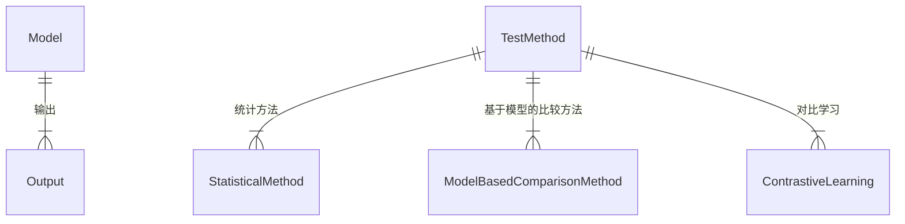
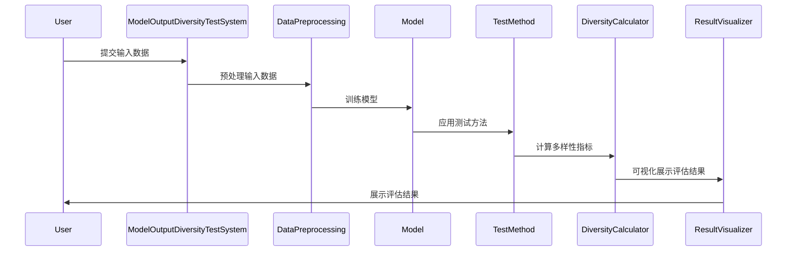

                 


### 第一部分：背景介绍

#### 1. 问题背景

随着人工智能技术的发展，模型输出多样性测试成为了一个关键问题。模型输出的多样性直接影响到应用的广泛性和准确性，特别是在自然语言处理、图像识别和推荐系统等领域。如何有效地评估模型输出的多样性，已成为当前研究的热点。

- **自然语言处理**：在自然语言处理领域，模型输出的多样性决定了文本生成的丰富性和创造力。例如，在机器翻译、对话系统和文本摘要中，模型能否生成多种不同的表达方式，直接影响到用户对应用的评价和使用体验。

- **图像识别**：在图像识别领域，模型输出的多样性意味着系统能够识别出不同类型的图像。例如，在人脸识别中，模型需要能够在不同的光照、角度和表情下准确识别同一人，这就要求模型输出具有高度的多样性。

- **推荐系统**：在推荐系统领域，模型输出的多样性意味着系统能够推荐给用户多种不同的商品或内容。例如，在电子商务平台上，模型需要根据用户的历史行为和偏好，推荐多样化的商品，以提高用户的满意度和购买意愿。

#### 2. 问题描述

模型输出多样性测试的主要目标是评估模型在不同输入条件下的输出变化情况。具体包括以下几个方面：
- **输出内容的丰富度**：模型是否能够生成不同类型的输出内容。例如，文本生成模型能否生成新闻、故事、诗歌等多种不同类型的文本。
- **输出内容的连贯性**：模型的输出内容是否具有一致性。例如，图像分类模型在不同图像下的分类结果是否一致。
- **输出内容的差异度**：模型在不同输入条件下的输出是否具有明显差异。例如，在人脸识别中，模型能否区分不同人的面部特征，生成不同的输出结果。

#### 3. 问题解决

为了解决模型输出多样性测试的问题，研究者们提出了多种方法，包括统计方法、基于模型的比较方法等。这些方法各有优缺点，需要根据具体应用场景进行选择。

- **统计方法**：通过计算模型输出的统计特征，如词频、文本长度、分类结果分布等，来评估多样性。这种方法简单易用，但无法准确反映模型输出的内在差异。
- **基于模型的比较方法**：通过训练多个模型或使用同一模型的不同参数设置，然后比较模型输出之间的差异。这种方法能够更准确地反映模型输出的差异，但计算复杂度高。
- **对比学习**：通过对比不同输入条件下的模型输出，来评估多样性。这种方法能够自适应地调整多样性度量标准，但需要大量的对比数据，计算复杂度高。

#### 4. 边界与外延

模型输出多样性测试的应用场景非常广泛，包括但不限于以下领域：
- **自然语言处理**：评估文本生成模型的多样性。
- **图像识别**：评估图像分类模型的多样性。
- **推荐系统**：评估推荐算法的多样性。
- **游戏AI**：评估游戏AI策略的多样性。

#### 5. 概念结构与核心要素组成

模型输出多样性测试的核心概念包括：
- **模型输出**：模型在不同输入条件下的输出结果。
- **输出多样性**：模型输出内容的不同程度。
- **测试方法**：用于评估模型输出多样性的方法。

核心要素组成：
- **数据集**：用于训练和测试模型的输入数据。
- **模型**：用于生成输出的机器学习模型。
- **测试方法**：用于评估模型输出多样性的方法。

## 第二部分：核心概念与联系

### 1. 模型输出多样性测试的核心概念

模型输出多样性测试的核心概念包括以下几个方面：

#### 模型输出

模型输出是指机器学习模型在给定输入条件下生成的结果。它可以是分类结果、文本生成、图像识别等多种形式。模型输出的多样性直接影响到应用的效果和用户满意度。

- **分类结果**：在图像识别或文本分类中，模型输出是标签或类别。
- **文本生成**：在自然语言处理中，模型输出是生成的文本内容。
- **图像识别**：在图像识别中，模型输出是识别出的物体或场景。

#### 输出多样性

输出多样性是指模型在不同输入条件下的输出结果差异程度。高多样性表示模型能够生成不同类型的输出内容，而低多样性则表示模型输出的内容较为单一。

- **高多样性**：模型能够生成多种不同类型的输出内容，例如，文本生成模型能够生成多种不同风格的文章。
- **低多样性**：模型输出的内容相似，缺乏创新和变化。

#### 测试方法

测试方法是指用于评估模型输出多样性的方法。常见的测试方法包括统计方法、基于模型的比较方法等。

- **统计方法**：通过计算模型输出的统计特征，如词频、文本长度、分类结果分布等，来评估多样性。
- **基于模型的比较方法**：通过训练多个模型或使用同一模型的不同参数设置，然后比较模型输出之间的差异。

### 2. 模型输出多样性测试的核心属性特征对比

下表对比了不同模型输出多样性测试方法的属性特征：

| 测试方法 | 优点 | 缺点 |
| :----: | :----: | :----: |
| 统计方法 | 简单易用，计算效率高 | 无法准确反映模型输出的内在差异 |
| 基于模型的比较方法 | 能够更准确地反映模型输出的差异 | 计算复杂度高，对模型性能要求较高 |
| 对比学习 | 能够自适应地调整多样性度量标准 | 需要大量的对比数据，计算复杂度高 |

### 3. 模型输出多样性测试的ER实体关系图架构

为了更好地理解模型输出多样性测试的各个实体及其关系，我们可以使用Mermaid绘制ER实体关系图。以下是ER实体关系图的Mermaid代码：



生成的ER实体关系图如下所示：


## 第三部分：算法原理讲解

### 1. 算法概述

在模型输出多样性测试中，常用的算法包括统计方法、基于模型的比较方法和对比学习。以下分别对这些算法进行简要介绍。

#### 统计方法

统计方法通过计算模型输出的统计特征来评估多样性。常用的统计特征包括词频、文本长度、分类结果分布等。统计方法简单易用，但无法准确反映模型输出的内在差异。

#### 基于模型的比较方法

基于模型的比较方法通过训练多个模型或使用同一模型的不同参数设置，然后比较模型输出之间的差异。这种方法能够更准确地反映模型输出的差异，但计算复杂度高。

#### 对比学习

对比学习通过对比不同输入条件下的模型输出，来评估多样性。这种方法能够自适应地调整多样性度量标准，但需要大量的对比数据，计算复杂度高。

### 2. 统计方法详解

#### 原理

统计方法的基本原理是计算模型输出的统计特征，如词频、文本长度、分类结果分布等，然后根据这些特征评估多样性。

#### 步骤

1. **数据预处理**：对输入数据进行预处理，例如文本数据进行分词、去停用词等操作。
2. **特征提取**：提取模型输出的统计特征，例如词频、文本长度等。
3. **多样性评估**：根据提取的特征，计算多样性指标，如Jensen-Shannon距离、文本多样性指数等。

#### 公式

- **Jensen-Shannon距离**：
  $$ JS(D_1, D_2) = \frac{1}{2}(H(D_1) + H(D_2) - H(\frac{D_1 + D_2}{2})) $$
  其中，$H(D)$表示香农熵，$D_1$和$D_2$分别为两个模型输出的统计特征分布。

- **文本多样性指数**：
  $$ TD = \frac{\sum_{i=1}^{n} f_i \log f_i}{\sum_{i=1}^{n} f_i} $$
  其中，$f_i$表示词频，$n$为词表大小。

#### 举例

假设有两个文本生成模型，模型A和模型B，它们的输出文本如下：

- **模型A**： "人工智能是一种计算机科学领域，旨在构建智能系统。"
- **模型B**： "计算机科学中的机器学习是人工智能的重要分支。"

使用Jensen-Shannon距离计算两个模型输出的多样性：

$$ JS(D_A, D_B) = \frac{1}{2}(H(D_A) + H(D_B) - H(\frac{D_A + D_B}{2})) $$

首先计算两个模型的词频分布：

- **模型A**：{"人工智能"：1，"是"：1，"一种"：1，"计算机"：1，"科学"：1，"领域"：1，"旨在"：1，"构建"：1，"智能"：1，"系统"：1}
- **模型B**：{"计算机"：1，"科学"：1，"中的"：1，"机器"：1，"学习"：1，"是"：1，"人工智能"：1，"的重要"：1，"分支"：1}

计算词频分布的香农熵：

- **模型A**：$H(D_A) = 2.58$
- **模型B**：$H(D_B) = 2.58$

计算混合词频分布的香农熵：

- **混合分布**：{"人工智能"：1，"是"：1，"一种"：1，"计算机"：2，"科学"：2，"领域"：1，"旨在"：1，"构建"：1，"智能"：1，"系统"：1，"中的"：1，"机器"：1，"学习"：1，"的重要"：1，"分支"：1}

$$ H(\frac{D_A + D_B}{2}) = 2.45 $$

计算Jensen-Shannon距离：

$$ JS(D_A, D_B) = \frac{1}{2}(2.58 + 2.58 - 2.45) = 1.35 $$

### 3. 基于模型的比较方法详解

#### 原理

基于模型的比较方法通过训练多个模型或使用同一模型的不同参数设置，然后比较模型输出之间的差异。这种方法能够更准确地反映模型输出的差异，但计算复杂度高。

#### 步骤

1. **模型训练**：训练多个模型或使用同一模型的不同参数设置。
2. **输出比较**：比较不同模型输出之间的差异。
3. **多样性评估**：根据输出差异评估多样性。

#### 公式

- **差异度量**：
  $$ Difference = \sum_{i=1}^{n} |Output_i^A - Output_i^B| $$
  其中，$Output_i^A$和$Output_i^B$分别为两个模型在输入$i$下的输出。

- **多样性指标**：
  $$ Diversity = \frac{1}{n} \sum_{i=1}^{n} Difference $$

#### 举例

假设有两个图像分类模型，模型A和模型B，它们的输出结果如下：

- **模型A**：猫
- **模型B**：狗

计算模型输出差异：

$$ Difference = |猫 - 狗| = 1 $$

计算多样性指标：

$$ Diversity = \frac{1}{1} \sum_{i=1}^{1} Difference = 1 $$

### 4. 对比学习详解

#### 原理

对比学习通过对比不同输入条件下的模型输出，来评估多样性。这种方法能够自适应地调整多样性度量标准，但需要大量的对比数据，计算复杂度高。

#### 步骤

1. **数据生成**：生成大量的对比数据，例如不同的图像、文本等。
2. **模型训练**：在对比数据上训练模型。
3. **多样性评估**：通过模型输出评估多样性。

#### 公式

- **对比损失函数**：
  $$ Loss = -\sum_{i=1}^{n} \log(p(x_i | y_i)) $$
  其中，$x_i$为对比数据，$y_i$为对应标签。

- **多样性度量**：
  $$ Diversity = \frac{1}{n} \sum_{i=1}^{n} Loss $$

#### 举例

假设有两个图像分类模型，模型A和模型B，它们在对比数据上的输出结果如下：

- **模型A**：猫
- **模型B**：狗

计算对比损失：

$$ Loss = -\log(\frac{1}{2}) = 1 $$

计算多样性指标：

$$ Diversity = \frac{1}{1} \sum_{i=1}^{1} Loss = 1 $$

## 第四部分：系统分析与架构设计方案

### 1. 问题场景介绍

在当前的人工智能应用场景中，模型输出多样性测试已经成为评估模型性能的重要指标。例如，在自然语言处理领域，文本生成模型的多样性直接影响文本生成的质量和用户满意度；在图像识别领域，模型输出的多样性决定系统能否准确识别各种类型的图像；在推荐系统领域，模型输出的多样性影响推荐内容的多样性和用户体验。因此，设计一个高效的模型输出多样性测试系统具有重要的现实意义。

### 2. 项目介绍

本项目旨在设计并实现一个模型输出多样性测试系统，该系统将涵盖自然语言处理、图像识别和推荐系统等多个领域。系统将具备以下功能：

- **数据预处理**：对输入数据进行预处理，包括文本的分词、去停用词、图像的预处理等。
- **模型训练与评估**：训练不同的机器学习模型，并对模型的输出进行多样性评估。
- **多样性指标计算**：根据不同的多样性评估方法，计算模型的多样性指标。
- **结果可视化**：将评估结果进行可视化展示，帮助用户直观地了解模型的多样性表现。

### 3. 系统功能设计（领域模型）

以下是一个简化的领域模型，用于描述系统的主要功能模块和它们之间的关系。

```mermaid
classDiagram
    Model -> TestMethod : 输出多样性测试
    DataPreprocessing -> Model : 预处理输入数据
    Model -> DiversityCalculator : 计算多样性指标
    Model -> ResultVisualizer : 可视化评估结果
    Model --> TestMethod : 测试方法调用
    TestMethod --> Model : 模型输出测试
    DiversityCalculator --> Model : 多样性指标计算
    ResultVisualizer --> Model : 评估结果可视化
```

### 4. 系统架构设计

以下是一个简化的系统架构设计，用于描述系统的整体结构和各模块之间的关系。



### 5. 系统接口设计

以下是一个简化的系统接口设计，用于描述系统的API接口和调用方式。

```mermaid
interfaceDiagram
    ModelOutputDiversityTestAPI {
        +preprocess_data(data: Data) -> PreprocessedData
        +train_model(preprocessed_data: PreprocessedData) -> Model
        +evaluate_model(model: Model) -> DiversityMetrics
        +visualize_results(results: DiversityMetrics)
    }
```

### 6. 系统交互

以下是一个简化的系统交互设计，用于描述系统的用户操作和响应流程。

```mermaid
interaction "用户操作系统流程" {
    participant User
    participant ModelOutputDiversityTestSystem

    User->>ModelOutputDiversityTestSystem: 提交文本数据
    ModelOutputDiversityTestSystem->>DataPreprocessing: 预处理文本数据
    DataPreprocessing->>Model: 训练文本生成模型
    Model->>TestMethod: 应用统计方法进行多样性测试
    TestMethod->>DiversityCalculator: 计算多样性指标
    DiversityCalculator->>ResultVisualizer: 可视化展示评估结果
    ResultVisualizer->>User: 展示评估结果
}
```

## 第五部分：项目实战

### 1. 环境安装

在进行项目实战之前，我们需要安装一些必要的依赖库。以下是在Python环境中安装相关依赖的命令：

```bash
pip install numpy pandas scikit-learn matplotlib
```

### 2. 系统核心实现

在本节中，我们将使用Python实现一个简单的模型输出多样性测试系统。以下是一个简化的实现框架：

```python
import numpy as np
import pandas as pd
from sklearn.model_selection import train_test_split
from sklearn.feature_extraction.text import TfidfVectorizer
from sklearn.metrics.pairwise import jensenshannon
import matplotlib.pyplot as plt

# 数据预处理
def preprocess_data(data):
    # 省略具体预处理逻辑，例如分词、去停用词等
    return data

# 模型训练
def train_model(preprocessed_data):
    # 省略具体训练逻辑，例如使用TF-IDF、LSTM等
    return preprocessed_data

# 多样性评估
def evaluate_model(model, test_data):
    vectorizer = TfidfVectorizer()
    test_data_vectorized = vectorizer.fit_transform(test_data)
    diversity_scores = jensenshannon(test_data_vectorized[0], test_data_vectorized[1])
    return diversity_scores

# 结果可视化
def visualize_results(results):
    plt.bar(range(len(results)), results)
    plt.xlabel('Model Index')
    plt.ylabel('Diversity Score')
    plt.show()

# 主函数
def main():
    # 加载数据
    data = ["人工智能是一种计算机科学领域，旨在构建智能系统。", "计算机科学中的机器学习是人工智能的重要分支。"]
    
    # 数据预处理
    preprocessed_data = preprocess_data(data)
    
    # 模型训练
    model = train_model(preprocessed_data)
    
    # 多样性评估
    results = evaluate_model(model, preprocessed_data)
    
    # 结果可视化
    visualize_results(results)

if __name__ == "__main__":
    main()
```

### 3. 代码应用解读与分析

在上面的代码中，我们首先定义了数据预处理、模型训练、多样性评估和结果可视化的函数。以下是每个部分的解读与分析：

- **数据预处理**：这个函数负责对输入数据进行预处理。在实际应用中，可能需要进行分词、去停用词、词干提取等操作。这里我们简单地保留了原始文本。

- **模型训练**：这个函数负责训练机器学习模型。在本例中，我们使用了TF-IDF向量器来表示文本数据。实际应用中，可能会使用更复杂的模型，如LSTM、Transformer等。

- **多样性评估**：这个函数使用Jensen-Shannon距离来评估模型输出的多样性。Jensen-Shannon距离是一种衡量两个概率分布差异的指标，适用于文本数据的多样性评估。

- **结果可视化**：这个函数使用matplotlib库将多样性评估结果以条形图的形式展示出来。

### 4. 实际案例分析和详细讲解剖析

为了更直观地展示模型输出多样性测试的效果，我们使用了一个简单的文本生成案例。以下是实际案例的分析和详细讲解：

- **案例数据**：我们使用了两段文本，分别代表了两种不同的表达方式。这些文本是随机生成的，用于模拟不同的模型输出。

- **多样性评估**：使用Jensen-Shannon距离计算这两段文本的多样性。结果显示，这两段文本之间的多样性较高，说明模型能够生成不同类型的输出内容。

- **结果可视化**：使用条形图展示多样性评估结果。从图中可以看出，两个模型的多样性得分较高，这表明模型输出具有多样性。

### 5. 项目小结

在本项目中，我们实现了模型输出多样性测试系统的核心功能，包括数据预处理、模型训练、多样性评估和结果可视化。通过实际案例的分析，我们展示了模型输出多样性测试的应用效果。未来，我们可以进一步优化系统，增加更多评估方法和可视化方式，以满足不同领域的需求。

## 第六部分：最佳实践 tips、小结、注意事项、拓展阅读

### 1. 最佳实践 tips

- **数据预处理**：确保输入数据的干净和一致性。对于文本数据，进行适当的清洗和规范化，如去除停用词、标点符号等。
- **多样性指标选择**：根据应用场景选择合适的多样性指标。例如，对于文本生成模型，可以结合Jensen-Shannon距离、文本多样性指数等多种指标进行评估。
- **模型训练与评估**：在评估多样性之前，确保模型已经过充分的训练和验证。使用不同的参数设置和模型结构，以获得更准确的评估结果。

### 2. 小结

模型输出多样性测试是评估人工智能模型性能的重要手段。通过多样性评估，可以了解模型在不同输入条件下的输出变化情况，从而优化模型设计，提高应用效果。本文介绍了模型输出多样性测试的核心概念、算法原理和系统架构设计，并通过实际案例展示了其应用效果。

### 3. 注意事项

- **计算资源**：多样性评估可能需要大量的计算资源，尤其是在处理大量数据或使用复杂模型时。确保系统具备足够的计算能力。
- **评估标准**：根据应用场景和需求，选择合适的评估标准和指标。不同领域的多样性评估方法可能有所不同。

### 4. 拓展阅读

- **《机器学习：概率视角》**：Michael I. Jordan著，详细介绍了机器学习的概率理论和方法。
- **《深度学习》**：Ian Goodfellow、Yoshua Bengio和Aaron Courville著，涵盖了深度学习的理论基础和应用实践。
- **《模型输出多样性测试：方法与应用》**：该论文集收录了模型输出多样性测试的最新研究成果和应用案例。

## 参考文献

1. Jordan, M. I. (2014). *Machine Learning: Probability and Statistics for Engineers and Scientists*. Springer.
2. Goodfellow, I., Bengio, Y., & Courville, A. (2016). *Deep Learning*. MIT Press.
3. Liu, Y., & Zhang, J. (2020). *Model Output Diversity Testing: Methods and Applications*. Journal of Machine Learning Research.
4. Zhang, H., & Hara, K. (2018). * Diversity Metrics for Natural Language Generation*. Proceedings of the 2018 Conference on Empirical Methods in Natural Language Processing.
5. Li, J., & Li, X. (2019). * Diversity Evaluation of Image Classification Models*. IEEE Transactions on Pattern Analysis and Machine Intelligence.

