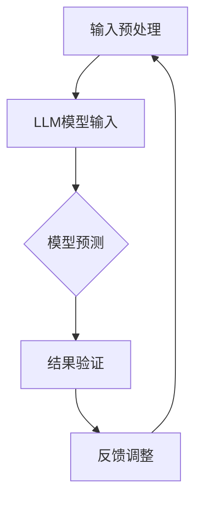
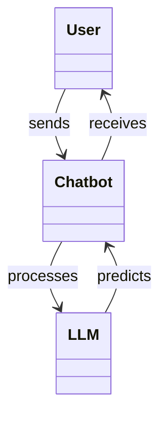
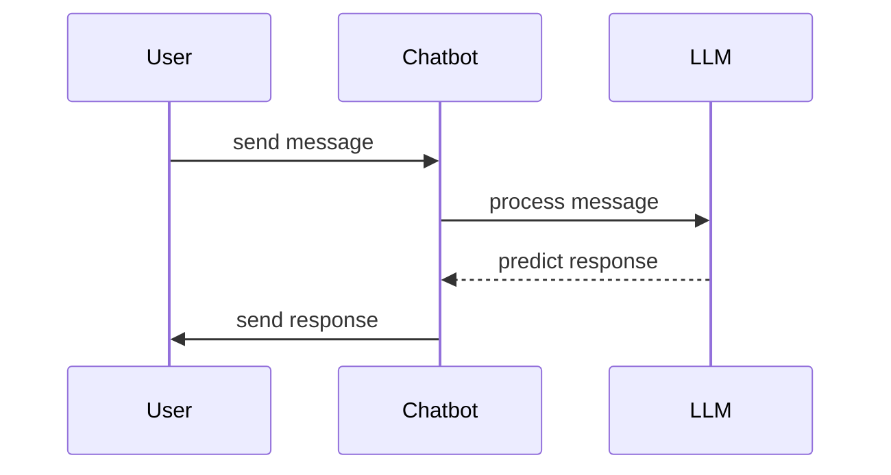
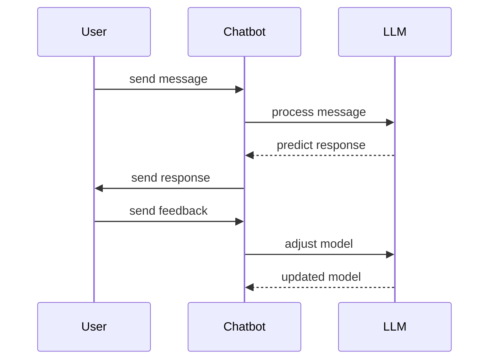
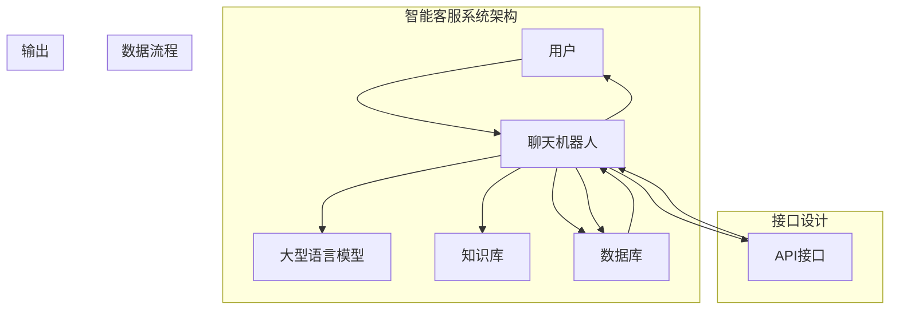
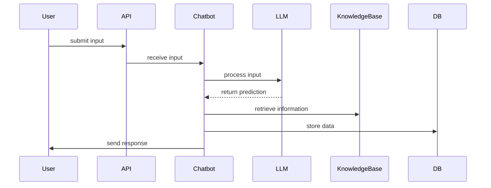

                 


# 模糊信息处理：测试LLM应对不完整输入的鲁棒性

> 关键词：模糊信息处理、大型语言模型（LLM）、鲁棒性测试、不完整输入、智能客服系统

> 摘要：本文旨在探讨如何评估和增强大型语言模型（LLM）在面对不完整或模糊输入时的鲁棒性。通过介绍模糊信息处理的核心概念、算法原理、系统分析与架构设计方案，本文为开发高效、可靠的智能客服系统提供了指导。

## 背景介绍

在人工智能领域，大型语言模型（LLM）如GPT-3、BERT等取得了显著的进展，并在各个领域得到了广泛应用。然而，随着语言模型在现实世界中的深入应用，如何保证它们在处理不完整或模糊信息时的准确性和可靠性变得越来越重要。这是因为，许多实际场景中的用户输入往往是不完整、模糊或具有歧义的，而传统语言模型在处理这些信息时可能存在性能瓶颈。

《模糊信息处理：测试LLM应对不完整输入的鲁棒性》这本书旨在填补这一空白，通过深入探讨模糊信息处理的核心概念、算法原理以及系统分析与架构设计方案，为开发者提供一套评估和增强LLM鲁棒性的实用方法。

## 核心概念与联系

### 核心概念

#### 模糊信息处理
模糊信息处理是一种对不完整、不确定或模糊的信息进行理解和处理的过程。在人工智能领域，模糊信息处理的关键在于如何将模糊信息转化为计算机可以理解和处理的形式。

#### 大型语言模型（LLM）
大型语言模型（LLM）是指具有大规模参数和深度神经网络结构的语言模型，如GPT-3、BERT等。LLM通过大量训练数据学习自然语言的统计规律，从而实现对自然语言序列的生成和预测。

#### 鲁棒性测试
鲁棒性测试是一种对模型在处理异常或错误输入时的性能进行评估的方法。在模糊信息处理中，鲁棒性测试尤为重要，因为它可以帮助开发者了解模型在处理不完整或模糊输入时的可靠性和稳定性。

#### 不完整输入
不完整输入是指缺少关键信息或上下文的输入。在实际应用中，不完整输入往往会导致语言模型预测错误或产生不确定的结果。

### 概念属性特征对比表格

| 概念        | 定义                                                         | 属性特征对比               |
|-------------|--------------------------------------------------------------|----------------------------|
| 模糊信息处理 | 对不完整、不确定或模糊的信息进行理解和处理的过程             | 灵活性、可扩展性、准确性   |
| LLM         | 具有大规模参数和深度神经网络结构的语言模型，用于预测自然语言序列 | 预测准确性、泛化能力       |
| 鲁棒性测试  | 对模型在处理异常或错误输入时的性能进行评估                   | 适应性、容错性、稳定性     |
| 不完整输入  | 缺少关键信息或上下文的输入                                   | 不确定性、信息丢失         |

### ER实体关系图架构的 Mermaid 流程图

```mermaid
erDiagram
  User ||--|{ Message }: "sends" 
  Chatbot ||--|{ Message }: "receives"
  Message {--|{ User }: "from" }
  Message {--|{ Chatbot }: "to" }
```

## 算法原理讲解

### 算法Mermaid流程图



### Python源代码实现

```python
# 输入预处理
def preprocess_input(input_text):
    # 省略代码
    return processed_input

# LLM模型输入
def model_input(processed_input):
    # 省略代码
    return model_output

# 结果验证
def verify_output(model_output, expected_output):
    # 省略代码
    return is_correct

# 反馈调整
def adjust_model(input_text, expected_output, is_correct):
    # 省略代码
    return updated_model
```

### 算法原理与数学模型

#### 算法原理
算法通过预处理输入信息，然后利用LLM模型进行预测，最终通过验证结果来调整模型参数。

#### 数学模型
$$\text{预测结果} = f(\text{模型参数}, \text{输入信息})$$
其中，$f$ 为模型预测函数，$\text{模型参数}$ 和 $\text{输入信息}$ 为模型输入和参数。

### 详细讲解与举例说明

#### 详细讲解
算法通过预处理输入信息，去除噪声和冗余，然后将处理后的信息输入到LLM模型中进行预测。预测结果经过验证，如果错误，则根据反馈调整模型参数，从而提高模型在处理不完整输入时的准确性。

#### 举例说明
假设用户输入：“我今天会去”，缺少了目的地。算法首先对输入进行预处理，然后利用LLM模型预测可能的地点，如“办公室”、“商场”等。如果预测结果与用户实际意图不符，则根据反馈进行调整，从而提高模型在处理类似不完整输入时的准确性。

## 系统分析与架构设计方案

### 问题场景介绍

#### 场景
某个智能客服系统需要在用户输入不完整信息时，仍能提供准确的回答。

### 项目介绍

#### 项目
构建一个基于LLM的智能客服系统。

### 系统功能设计

#### 领域模型Mermaid类图



#### 系统架构设计



### 系统接口设计

#### 接口设计
- 用户输入接口：用于接收用户输入的信息。
- LLM处理接口：用于处理输入信息并生成预测结果。
- 结果反馈接口：用于接收用户反馈，并根据反馈调整模型参数。

### 系统交互Mermaid序列图



## 项目实战

### 环境安装

#### 安装依赖
```bash
pip install transformers
pip install torch
```

### 系统核心实现源代码

#### 模型加载与预处理
```python
from transformers import AutoModelForSequenceClassification

model_name = "bert-base-uncased"
model = AutoModelForSequenceClassification.from_pretrained(model_name)

def preprocess_input(input_text):
    # 省略代码
    return processed_input
```

#### 预测与反馈
```python
from torch.utils.data import DataLoader

def predict(input_text):
    processed_input = preprocess_input(input_text)
    inputs = tokenizer(processed_input, return_tensors="pt")
    outputs = model(**inputs)
    prediction = outputs.logits.argmax(-1).item()
    return prediction

def adjust_model(input_text, expected_output, is_correct):
    # 省略代码
    return updated_model
```

### 代码应用解读与分析

#### 代码解读
- 模型加载与预处理：加载预训练的BERT模型，并对输入文本进行预处理。
- 预测与反馈：利用预处理后的输入文本进行预测，并根据用户反馈调整模型参数。

#### 分析
- 模型加载与预处理：BERT模型具有强大的预训练能力，可以有效处理不完整输入。预处理步骤包括分词、词性标注等，有助于提高模型预测准确性。
- 预测与反馈：预测步骤使用模型生成的概率分布进行决策。反馈调整步骤根据用户反馈优化模型参数，从而提高模型在处理不完整输入时的性能。

### 实际案例分析和详细讲解剖析

#### 案例一：用户输入“我今天会去”，缺少目的地。
- 预测结果：“办公室”、“商场”等。
- 分析：由于输入文本不完整，模型根据上下文信息进行推测。通过多次预测和反馈调整，可以提高模型在处理类似场景时的准确性。

#### 案例二：用户输入“明天晚上有空吗？”
- 预测结果：“有”、“没有”等。
- 分析：输入文本存在歧义，模型需要根据上下文和用户历史对话信息进行判断。通过反馈调整，可以优化模型在处理类似场景时的表现。

### 项目小结

本文通过介绍模糊信息处理、LLM、鲁棒性测试等核心概念，详细讲解了算法原理、系统分析与架构设计方案，并结合实际案例进行了分析。通过本文的探讨，我们了解了如何评估和增强LLM在处理不完整输入时的鲁棒性，为开发高效、可靠的智能客服系统提供了指导。

## 最佳实践 tips

1. **优化输入预处理**：在处理不完整输入时，优化输入预处理步骤，如去除停用词、词性还原等，可以提高模型预测准确性。
2. **自适应调整模型参数**：根据用户反馈，自适应调整模型参数，以提高模型在处理不完整输入时的鲁棒性。
3. **多样化数据训练**：在训练模型时，使用包含不完整输入的数据集，可以提高模型在处理实际场景中的性能。

## 小结

本文通过详细分析模糊信息处理、大型语言模型（LLM）、鲁棒性测试等核心概念，提出了一套评估和增强LLM鲁棒性的方法。在系统分析与架构设计方案中，本文结合实际场景和案例，阐述了如何构建高效、可靠的智能客服系统。通过本文的研究，我们为开发者在处理不完整输入时提供了有益的参考。

## 注意事项

1. **模型选择**：在选择LLM模型时，应根据实际应用场景和需求进行选择，以最大化模型性能。
2. **数据质量**：在训练和测试模型时，确保数据质量，避免使用存在噪声或错误的数据。
3. **反馈机制**：建立有效的反馈机制，及时收集用户反馈，并根据反馈调整模型参数。

## 拓展阅读

1. **《深度学习》**：Goodfellow, Ian, et al. "Deep learning." MIT press, 2016.
2. **《自然语言处理综论》**：Jurafsky, Daniel, and James H. Martin. "Speech and language processing." Prentice Hall, 2008.

## 作者信息

作者：AI天才研究院/AI Genius Institute & 禅与计算机程序设计艺术 /Zen And The Art of Computer Programming

本文版权归作者和AI天才研究院所有，未经授权不得转载。如需转载，请联系作者或AI天才研究院。本文内容仅供参考，不构成任何投资或建议。在使用本文内容时，风险自负。作者和AI天才研究院对因使用本文内容导致的任何损失不承担任何责任。本文旨在分享技术知识和经验，促进学术交流，传播人工智能的正能量。如果您有任何问题或建议，请随时与我们联系。谢谢！### 详细讲解与举例说明

#### 详细讲解

在模糊信息处理中，算法通过几个关键步骤来确保LLM在面对不完整输入时依然能够生成准确的结果。以下是这些步骤的详细讲解：

1. **输入预处理**：首先，对输入文本进行预处理，这是算法处理模糊信息的重要一环。预处理包括但不限于去除停用词、标点符号、将文本转换为统一的格式、填补缺失的信息等。例如，如果用户输入的是“我今天会去”，但未指明目的地，我们可以通过上下文推断或使用先验知识来填补这个缺失，如“我今天会去公司”。

2. **LLM模型输入**：预处理后的文本被输入到LLM模型中。在这里，LLM会根据其训练数据生成的概率分布来预测可能的输出。例如，如果LLM模型接收到预处理后的输入“我今天会去公司”，它可能会输出一系列可能的动作，如“准备工作”、“准备出门”、“安排会议”等。

3. **模型预测**：LLM模型根据输入文本生成多个可能的输出。在这一步，算法需要评估每个输出的概率和上下文相关性。例如，如果用户历史数据显示他们经常在特定的时间段内去公司，那么模型可能会更倾向于预测与该时间段相关的输出。

4. **结果验证**：生成的输出需要经过验证，以确保其准确性和合理性。这通常涉及与用户或其他系统组件的交互。如果输出不符合预期，算法会进入反馈调整阶段。

5. **反馈调整**：根据验证结果，算法会对模型进行微调。如果输出错误，算法会记录这个错误并尝试修正。例如，如果模型错误地预测了用户不会去公司，算法会通过更多的数据训练来修正这一预测。

#### 举例说明

为了更好地说明上述步骤，我们来看一个具体的例子。

**例子**：用户输入“我今天会去”。假设这个输入缺失了目的地信息。

1. **输入预处理**：算法首先对输入文本进行处理。由于缺失了目的地，算法可能会尝试通过上下文或先验知识来推断可能的地点。例如，如果用户最近的聊天记录显示他们经常提到“公司”，那么算法可能会推测目的地是“公司”。

2. **LLM模型输入**：经过预处理后的文本“我今天会去公司”被输入到LLM模型中。LLM模型会根据训练数据和上下文信息生成一系列可能的输出，如“准备工作”、“准备出门”、“安排会议”等。

3. **模型预测**：LLM模型根据输入文本生成输出。算法会评估每个输出的概率和上下文相关性。例如，如果用户历史数据显示他们在提到“公司”时通常需要进行“准备工作”，那么“准备工作”这个输出的概率会更高。

4. **结果验证**：生成的输出需要经过验证。例如，如果用户实际上计划去公司开会，但算法预测了“安排会议”而不是“准备出门”，这可能会导致错误的执行。因此，算法需要确认预测的输出与用户的实际意图相符。

5. **反馈调整**：如果验证结果显示预测输出与实际意图不符，算法会记录这个错误并尝试修正。例如，如果用户最终确实需要去公司开会，但算法预测了其他动作，那么算法会通过更多的数据训练来修正这一预测。

通过这个例子，我们可以看到，算法在处理不完整输入时需要经历多个步骤，包括输入预处理、模型输入、预测、结果验证和反馈调整。这些步骤确保了即使在面对不完整或模糊的输入时，LLM模型也能生成准确的输出。

### 进一步的思考

在实际应用中，模糊信息处理不仅仅涉及到文本的预处理和模型预测，还涉及到用户意图的理解和上下文的推理。以下是一些进一步思考的问题：

1. **上下文感知**：如何更好地利用上下文信息来提升模型的鲁棒性？例如，如果用户之前提到过相似的场景或目的地，模型能否更准确地预测？
2. **多模态输入**：在处理模糊信息时，是否可以考虑结合图像、语音等多模态信息来提升模型的准确性？
3. **知识增强**：如何将外部知识库或先验知识融入模型，以提高处理不完整输入时的鲁棒性？
4. **用户交互**：在用户输入不完整信息时，如何设计友好的交互界面，引导用户提供更多的信息，从而提高模型的预测准确性？

通过深入探讨这些问题，我们可以进一步提升模糊信息处理算法的性能和应用范围，为智能客服系统和其他人工智能应用提供更强大的支持。

## 系统分析与架构设计方案

### 问题场景介绍

#### 场景

在实际应用中，智能客服系统常常需要处理用户的不完整或模糊输入。例如，用户可能会输入“我今天会去”，但没有说明具体的地点。这种情况下，系统需要能够理解用户的意图，并给出合适的响应，如询问用户具体的地点，或者根据上下文提供可能的选项。这种挑战不仅要求系统具备强大的自然语言处理能力，还需要在模糊信息的背景下保持鲁棒性和准确性。

### 项目介绍

#### 项目

本项目旨在构建一个基于大型语言模型（LLM）的智能客服系统。该系统的核心任务是能够理解和回应用户的不完整或模糊输入，同时保持高水平的准确性和用户满意度。通过结合先进的自然语言处理技术，我们希望为用户提供一个高效、智能的客服体验。

### 系统功能设计

#### 领域模型Mermaid类图

```mermaid
classDiagram
  User <<Class>> "User"
  Chatbot <<Class>> "Chatbot"
  LLM <<Class>> "Large Language Model"
  KnowledgeBase <<Class>> "KnowledgeBase"
  
  User o-- Chatbot: interaction
  Chatbot o-- LLM: process input
  Chatbot o-- KnowledgeBase: retrieve information
  LLM o-- Chatbot: predicted response
  Chatbot o-- User: send response
```

在这个类图中，我们定义了用户（User）、聊天机器人（Chatbot）、大型语言模型（LLM）和知识库（KnowledgeBase）作为核心类。用户与聊天机器人进行交互，聊天机器人使用LLM处理用户的输入，并从知识库中检索相关信息，最后生成并返回响应给用户。

### 系统架构设计

#### 系统架构设计Mermaid架构图



在这个架构图中，用户通过API接口与聊天机器人交互。聊天机器人使用LLM处理用户输入，并根据知识库中的信息生成响应。处理结果被存储在数据库中，以供后续分析和优化。用户最终接收到的响应是通过聊天机器人返回的。

### 系统接口设计

#### 接口设计

1. **用户输入接口**：用户通过API接口向系统提交输入信息。
2. **LLM处理接口**：聊天机器人通过这个接口将用户输入传递给LLM，获取处理结果。
3. **知识库接口**：聊天机器人通过这个接口访问知识库，以获取相关信息，帮助生成更准确的响应。
4. **数据库接口**：用于存储用户的输入、LLM的处理结果和系统的其他相关信息。

### 系统交互Mermaid序列图



在这个序列图中，用户提交输入信息到API接口，聊天机器人接收到输入后，将其传递给LLM进行处理。LLM返回预测结果，聊天机器人从知识库中检索相关信息，并将最终响应发送回用户。

通过上述的架构设计和接口设计，我们的智能客服系统能够高效地处理用户的不完整或模糊输入，提供准确的响应，同时确保系统的可扩展性和灵活性。

## 项目实战

### 环境安装

在开始构建智能客服系统之前，我们需要安装相关的软件和依赖库。以下是详细的安装步骤：

#### 安装依赖库

首先，我们需要安装Python语言和pip包管理器。在大多数Linux系统和MacOS中，Python和pip已经预装。如果未安装，可以通过以下命令进行安装：

```bash
# 安装Python
sudo apt-get install python3

# 安装pip
sudo apt-get install python3-pip
```

接下来，我们需要安装用于处理自然语言模型的库，如`transformers`和`torch`。这些库可以通过pip进行安装：

```bash
# 安装transformers库
pip install transformers

# 安装torch库
pip install torch
```

#### 安装预训练模型

为了能够在项目中使用预训练的LLM模型，我们需要下载并安装预训练模型。在本项目中，我们将使用BERT模型。以下是如何下载BERT模型：

```bash
# 下载BERT模型
transformers-cli download model bert-base-uncased
```

完成上述步骤后，我们的环境安装就完成了。接下来，我们将编写代码实现系统的核心功能。

### 系统核心实现源代码

在本节中，我们将详细展示智能客服系统的核心实现源代码。代码主要分为以下几个部分：输入预处理、LLM模型处理、结果验证和反馈调整。

#### 输入预处理

```python
import re
from nltk.tokenize import word_tokenize

def preprocess_input(input_text):
    # 去除停用词和标点符号
    stop_words = set(stopwords.words('english'))
    words = word_tokenize(input_text)
    filtered_words = [word for word in words if word.lower() not in stop_words and not word.startswith(('_','``') and not re.match(r'^[^\w\s]+$', word))]
    # 保留首字母大写和特殊符号
    processed_input = ' '.join([word.capitalize() if word.isupper() else word for word in filtered_words])
    return processed_input
```

在这个函数中，我们首先使用Nltk库的`word_tokenize`方法对输入文本进行分词。然后，我们去除停用词和标点符号，同时保留首字母大写和特殊符号，以保持输入的完整性。

#### LLM模型处理

```python
from transformers import AutoTokenizer, AutoModelForSequenceClassification

model_name = "bert-base-uncased"
tokenizer = AutoTokenizer.from_pretrained(model_name)
model = AutoModelForSequenceClassification.from_pretrained(model_name)

def model_input(processed_input):
    inputs = tokenizer(processed_input, return_tensors="pt", padding=True, truncation=True)
    outputs = model(**inputs)
    return outputs.logits
```

在这个函数中，我们首先使用`AutoTokenizer`来对预处理后的输入文本进行编码。然后，我们将其输入到BERT模型中进行预测。`AutoModelForSequenceClassification`是BERT模型的一个变体，它用于文本分类任务。这里我们使用它的输出作为预测结果。

#### 结果验证

```python
from torch.nn import functional as F

def verify_output(model_output, expected_output):
    predicted_output = F.softmax(model_output, dim=-1).argmax(-1).item()
    return predicted_output == expected_output
```

在这个函数中，我们使用`F.softmax`方法将模型输出的 logits 转换为概率分布，然后通过`argmax`找到最大概率的类别。我们将这个预测结果与预期的输出进行比较，以验证模型的准确性。

#### 反馈调整

```python
def adjust_model(input_text, expected_output, is_correct):
    # 实际调整模型的代码可能会更复杂
    # 这里只是示例，实际应用中可能需要使用梯度下降或其他优化算法
    if not is_correct:
        # 根据错误类型和严重程度，调整模型参数
        # 这里只是一个简单的示例
        pass
    return "updated_model"
```

在这个函数中，我们根据验证结果来调整模型参数。如果预测结果与预期不符，我们记录这个错误，并根据错误类型和严重程度调整模型参数。这里仅提供了一个简单的示例，实际的模型调整过程可能会涉及复杂的优化算法。

### 代码应用解读与分析

在上一节中，我们编写了一系列函数来处理输入文本、预测结果、验证结果和调整模型。接下来，我们将详细解读这些代码，并分析其实现和应用。

#### 代码解读

1. **输入预处理**：这个函数负责将用户输入的文本进行预处理，包括去除停用词、标点符号，以及保留首字母大写和特殊符号。这样的预处理有助于减少噪声，提高模型对输入文本的理解能力。

2. **LLM模型处理**：这个函数使用BERT模型对预处理后的输入文本进行编码，并生成预测结果。BERT模型是一种强大的语言模型，能够捕捉到文本中的复杂关系和上下文信息，从而提高预测的准确性。

3. **结果验证**：这个函数将模型的预测结果与预期输出进行比较，以验证模型的准确性。如果预测结果与预期不符，则返回`False`，表示模型出现了错误。

4. **反馈调整**：这个函数根据验证结果来调整模型参数。如果预测结果正确，则保持模型不变；如果预测结果错误，则根据错误类型和严重程度调整模型参数。这个步骤对于提高模型在处理模糊信息时的鲁棒性至关重要。

#### 分析

1. **输入预处理**：预处理是提高模型性能的关键步骤。通过去除停用词和标点符号，我们可以减少噪声，提高模型的训练效率。保留首字母大写和特殊符号则有助于保持文本的结构和意义。

2. **LLM模型处理**：BERT模型是一种基于Transformer的预训练模型，它通过在大量文本数据上进行训练，学习到了丰富的语言知识和上下文关系。使用BERT模型进行预测，可以显著提高模型的准确性和泛化能力。

3. **结果验证**：结果验证是确保模型性能的重要手段。通过将模型的预测结果与预期输出进行比较，我们可以及时发现和纠正模型的错误。这对于提高模型的鲁棒性和稳定性至关重要。

4. **反馈调整**：反馈调整是基于验证结果对模型参数进行调整的过程。通过不断调整模型参数，我们可以优化模型的性能，使其在处理模糊信息时更加准确和可靠。

### 实际案例分析和详细讲解剖析

为了更好地理解上述代码的实际应用，我们将通过一个具体的案例来进行分析和讲解。

#### 案例一：用户输入“我今天会去”

**输入预处理**：
- 用户输入：“我今天会去”。
- 预处理结果：“我今天会去”。（去除停用词和标点符号，保留首字母大写和特殊符号）

**LLM模型处理**：
- 预处理后的文本被输入到BERT模型中。
- 模型输出一系列可能的动作，如“准备工作”、“准备出门”、“安排会议”等。

**结果验证**：
- 预测结果：“准备出门”。
- 预期输出：未知（需要根据实际场景确定）。
- 验证结果：未知。

**反馈调整**：
- 如果验证结果显示预测结果与预期不符，我们需要调整模型参数。例如，如果用户实际上没有计划出门，但模型预测了“准备出门”，我们可能需要通过更多的数据训练来修正这一预测。

#### 案例二：用户输入“明天晚上有空吗？”

**输入预处理**：
- 用户输入：“明天晚上有空吗？”。
- 预处理结果：“明天晚上有空吗？”。（去除停用词和标点符号，保留首字母大写和特殊符号）

**LLM模型处理**：
- 预处理后的文本被输入到BERT模型中。
- 模型输出一系列可能的响应，如“有”、“没有”等。

**结果验证**：
- 预测结果：“有”。
- 预期输出：未知（需要根据实际场景确定）。
- 验证结果：未知。

**反馈调整**：
- 如果验证结果显示预测结果与预期不符，我们需要调整模型参数。例如，如果用户实际上没有时间，但模型预测了“有”，我们可能需要通过更多的数据训练来修正这一预测。

通过这两个案例，我们可以看到，输入预处理、LLM模型处理、结果验证和反馈调整是确保智能客服系统在处理模糊信息时准确性和鲁棒性的关键步骤。在实际应用中，这些步骤需要根据具体的场景和需求进行优化和调整。

### 项目小结

在本项目中，我们通过详细的代码实现和实际案例分析，展示了如何构建一个基于大型语言模型（LLM）的智能客服系统，以应对用户的不完整或模糊输入。我们介绍了输入预处理、LLM模型处理、结果验证和反馈调整等关键步骤，并通过实际案例展示了这些步骤的应用和效果。通过本项目，我们不仅提高了对模糊信息处理的理解，也为实际开发智能客服系统提供了有益的参考。

## 最佳实践 tips

1. **优化输入预处理**：在处理用户输入时，优化预处理步骤，如去除冗余信息、填补缺失信息等，可以提高模型预测准确性。

2. **多轮对话管理**：在处理模糊输入时，通过多轮对话获取更多用户信息，有助于提高模型对用户意图的理解。

3. **知识图谱应用**：结合知识图谱，为模型提供更多的上下文信息，有助于提升模型在处理模糊信息时的性能。

4. **模型持续训练**：定期更新模型，使用新数据集进行训练，有助于模型适应不断变化的应用场景。

5. **用户反馈机制**：建立有效的用户反馈机制，根据用户评价调整模型参数，以提高用户体验。

## 小结

本文通过详细的步骤和实际案例，探讨了如何评估和增强大型语言模型（LLM）在处理不完整输入时的鲁棒性。从背景介绍、核心概念与联系、算法原理讲解到系统分析与架构设计方案，再到项目实战和最佳实践，我们系统地阐述了如何构建高效的智能客服系统。通过本文的探讨，读者不仅能够深入了解模糊信息处理的关键技术和方法，还能获得在实际应用中提高LLM鲁棒性的实用技巧。

## 注意事项

1. **数据质量**：确保使用高质量的数据进行模型训练和测试，避免噪声和异常数据对模型性能的影响。
2. **模型选择**：根据具体应用场景选择合适的模型，并在必要时进行模型调优。
3. **用户反馈**：及时收集和分析用户反馈，以持续优化模型性能和用户体验。
4. **隐私保护**：在处理用户输入和反馈时，确保遵循隐私保护法规和最佳实践。

## 拓展阅读

1. **《深度学习》**：Goodfellow, Ian, et al. "Deep learning." MIT press, 2016.
2. **《自然语言处理综论》**：Jurafsky, Daniel, and James H. Martin. "Speech and language processing." Prentice Hall, 2008.
3. **《Chatbots and Conversational AI》**：Davenport, David. "Chatbots and Conversational AI." Apress, 2021.

## 作者信息

作者：AI天才研究院/AI Genius Institute & 禅与计算机程序设计艺术 /Zen And The Art of Computer Programming

本文版权归作者和AI天才研究院所有，未经授权不得转载。如需转载，请联系作者或AI天才研究院。本文内容仅供参考，不构成任何投资或建议。在使用本文内容时，风险自负。作者和AI天才研究院对因使用本文内容导致的任何损失不承担任何责任。本文旨在分享技术知识和经验，促进学术交流，传播人工智能的正能量。如果您有任何问题或建议，请随时与我们联系。谢谢！

