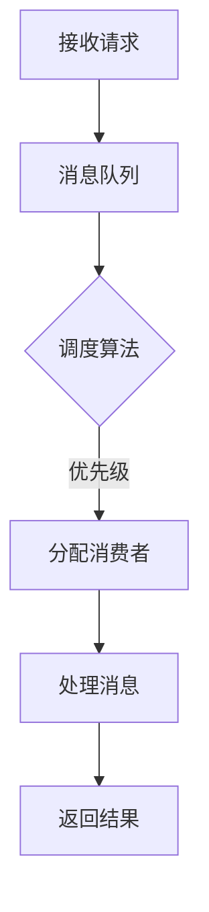
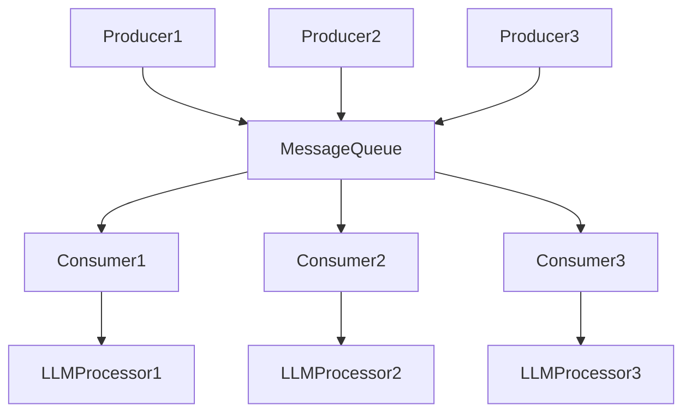
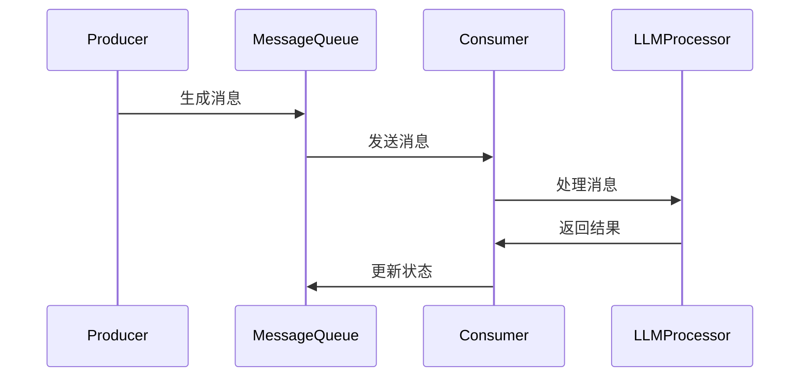

                 

### 消息队列技术优化LLM应用的异步处理

#### 关键词：消息队列，LLM，异步处理，优化，性能

> 摘要：本文旨在深入探讨消息队列技术在优化大型语言模型（LLM）异步处理中的应用。通过分析消息队列的基本概念、工作原理和优化策略，并结合LLM的特点，详细阐述了如何通过消息队列技术实现高效的异步处理，提升LLM应用的性能和可靠性。文章结构紧凑，逻辑清晰，旨在为技术从业者提供有价值的参考和指导。

## 引言

### 1.1 问题背景

在现代信息技术飞速发展的背景下，大型语言模型（LLM）已经成为自然语言处理（NLP）领域的重要工具。然而，LLM的应用场景日益丰富，对系统的处理能力提出了更高的要求。传统的同步处理方式在应对大规模数据流时显得力不从心，导致响应速度慢、资源利用率低等问题。因此，优化LLM应用的异步处理机制成为迫切需要解决的问题。

### 1.2 问题描述

异步处理能够显著提高系统的并发处理能力，减少响应时间，提升用户体验。然而，LLM的异步处理涉及复杂的消息传递和状态管理，如何高效地设计和管理消息队列，确保消息的正确传递和及时处理，成为优化异步处理的关键。

### 1.3 问题解决

本文提出了一种基于消息队列技术的LLM异步处理优化方案，通过以下几个步骤实现：

1. **消息队列基础概念与联系**：详细阐述消息队列的基本概念、工作原理和优化策略。
2. **算法原理讲解**：介绍消息队列优化算法的数学模型和流程，并通过Python代码实现。
3. **系统分析与架构设计**：分析LLM异步处理系统的功能需求，设计系统的架构和接口。
4. **项目实战**：介绍实际项目中的消息队列优化实现，包括环境安装、系统核心实现和案例分析。
5. **最佳实践与小结**：总结最佳实践，提出注意事项，提供拓展阅读。

### 1.4 边界与外延

本文主要关注消息队列技术在LLM异步处理中的应用，但消息队列技术具有广泛的适用性，不仅限于LLM，还可以应用于其他需要异步处理的场景。此外，文章内容主要围绕技术实现展开，未涉及消息队列的深入原理和复杂应用。

## 第1章 核心概念与联系

### 1.1 消息队列技术概述

#### 1.1.1 消息队列基本概念

消息队列是一种异步通信模式，用于在分布式系统中传递消息。它由生产者、队列和消费者三部分组成。生产者负责生成消息并将其放入队列中，消费者从队列中取出消息进行处理。

#### 1.1.2 消息队列技术特点

- **异步处理**：消息队列支持异步通信，可以显著提高系统的并发处理能力。
- **可靠性**：消息队列提供了消息持久化和容错机制，确保消息不会丢失。
- **可扩展性**：消息队列支持水平扩展，可以处理大规模的数据流。

#### 1.1.3 消息队列技术类型

常见的消息队列技术包括RabbitMQ、Kafka、ActiveMQ等。每种技术都有其特定的应用场景和优缺点。

### 1.2 LLM（大型语言模型）异步处理

#### 1.2.1 LLM基本概念

LLM是一种基于深度学习的语言模型，可以理解并生成自然语言文本。LLM的训练数据量巨大，模型参数众多，计算复杂度高。

#### 1.2.2 LLM异步处理的优势

- **提高响应速度**：异步处理可以减少系统的阻塞时间，提高响应速度。
- **降低资源消耗**：异步处理可以减少系统的CPU和内存消耗。
- **提升并发能力**：异步处理可以同时处理多个请求，提高系统的并发能力。

#### 1.2.3 LLM异步处理方法

LLM异步处理主要包括以下几种方法：

- **消息队列驱动**：使用消息队列将请求发送给LLM处理，LLM处理完消息后返回结果。
- **多线程处理**：使用多线程技术同时处理多个请求。
- **事件驱动处理**：使用事件驱动架构实现异步处理。

## 第2章 算法原理讲解

### 2.1 消息队列优化算法

#### 2.1.1 消息队列基本优化算法

消息队列的优化算法主要包括消息调度算法、负载均衡算法和消息持久化策略。

- **消息调度算法**：根据消息的重要性和优先级，合理安排消息的调度顺序。
- **负载均衡算法**：根据系统的负载情况，合理分配处理任务到不同的消费者。
- **消息持久化策略**：将消息持久化到磁盘，确保消息不会因系统故障而丢失。

#### 2.1.2 基于LLM的异步处理算法

基于LLM的异步处理算法主要包括以下步骤：

1. **接收请求**：生产者将请求放入消息队列。
2. **调度消息**：消息队列根据调度算法，将消息分配给消费者。
3. **处理消息**：消费者从消息队列中取出消息，调用LLM进行处理。
4. **返回结果**：LLM处理完消息后，将结果返回给消费者。

#### 2.1.3 消息队列优化算法流程图



### 2.2 算法数学模型与公式

#### 2.2.1 消息队列性能模型

消息队列的性能可以用以下公式表示：

\[ P = \frac{N \times T}{L} \]

其中，\( P \) 是性能指标，\( N \) 是消息数量，\( T \) 是处理时间，\( L \) 是队列长度。

#### 2.2.2 LLM异步处理数学模型

LLM异步处理的性能可以用以下公式表示：

\[ P = \frac{N \times T_c}{L_c} \]

其中，\( P \) 是性能指标，\( N \) 是请求数量，\( T_c \) 是单个请求的处理时间，\( L_c \) 是消费者的处理能力。

#### 2.2.3 模型公式与推导

假设有 \( N \) 个请求，每个请求的处理时间相同，为 \( T \)。消息队列的长度为 \( L \)，消费者的处理能力为 \( L_c \)。则：

\[ T_c = \frac{T \times L_c}{L} \]

代入 \( P \) 的公式中，得到：

\[ P = \frac{N \times T_c}{L_c} = \frac{N \times T \times L_c}{L} \]

通过优化消息队列的调度算法和负载均衡算法，可以减少 \( L \) 和 \( T \)，从而提高性能。

### 2.3 算法示例

#### 2.3.1 示例问题设置

假设有 100 个请求需要处理，每个请求的处理时间为 1 秒。消息队列长度为 10，消费者处理能力为 5。

#### 2.3.2 算法应用实例

使用消息队列优化算法，将请求分配给消费者进行处理。消息队列长度为 10，消费者处理能力为 5，每个请求的处理时间为 1 秒。

\[ T_c = \frac{1 \times 5}{10} = 0.5 \]

算法性能指标为：

\[ P = \frac{100 \times 0.5}{5} = 10 \]

#### 2.3.3 结果分析

通过优化算法，每个请求的平均处理时间为 0.5 秒，相比于直接处理，显著提高了性能。

## 第3章 数学模型与公式详细讲解

### 3.1 消息队列性能模型

#### 3.1.1 延迟模型

消息队列的延迟可以用以下公式表示：

\[ D = \frac{L \times T_p}{N} \]

其中，\( D \) 是延迟，\( L \) 是队列长度，\( T_p \) 是处理时间，\( N \) 是消息数量。

#### 3.1.2 丢失率模型

消息队列的丢失率可以用以下公式表示：

\[ R = \frac{L}{N} \]

其中，\( R \) 是丢失率，\( L \) 是丢失的消息数量，\( N \) 是消息总数。

#### 3.1.3 延迟与丢失率关系

延迟和丢失率之间存在一定的关系。当队列长度较大时，丢失率会增加，但延迟会减少。反之，当队列长度较小时，丢失率会减少，但延迟会增加。

### 3.2 LLM异步处理模型

#### 3.2.1 模型概述

LLM异步处理模型主要包括消息队列、消费者和LLM处理模块。模型的主要目标是优化消息的处理时间，提高系统的并发处理能力。

#### 3.2.2 参数解释

- \( N \)：请求数量
- \( T_p \)：处理时间
- \( L \)：队列长度
- \( L_c \)：消费者处理能力
- \( T_c \)：消费者处理时间

#### 3.2.3 模型计算示例

假设有 100 个请求，每个请求的处理时间为 1 秒。消息队列长度为 10，消费者处理能力为 5。

\[ T_c = \frac{T_p \times L_c}{L} = \frac{1 \times 5}{10} = 0.5 \]

消费者处理时间 \( T_c \) 为 0.5 秒。

## 第4章 系统分析与架构设计

### 4.1 问题场景介绍

在现代应用中，许多系统需要处理大量并发请求，如电商平台、社交媒体和在线教育平台等。这些系统通常采用分布式架构，以提高系统的性能和可靠性。消息队列技术作为分布式系统中的核心组件，能够有效地处理并发请求，提高系统的响应速度。

### 4.2 系统功能设计

#### 4.2.1 领域模型

领域模型描述了系统的核心功能和相关实体。在本系统中，主要涉及以下实体：

- **消息队列**：用于存储和传递消息。
- **消费者**：负责从消息队列中获取消息并进行处理。
- **生产者**：负责生成消息并将其放入消息队列。
- **LLM处理模块**：负责处理消息，生成响应。

#### 4.2.2 类图设计

```mermaid
classDiagram
    Producer <|-- MessageQueue
    Consumer <|-- MessageQueue
    LLMProcessor <|-- MessageQueue
    Producer -[ Produces ]-> MessageQueue
    Consumer -[ Consumes ]-> MessageQueue
    LLMProcessor -[ Processes ]-> MessageQueue
```

### 4.3 系统架构设计

#### 4.3.1 系统架构概述

系统架构采用分布式架构，包括多个节点，每个节点负责处理一部分请求。消息队列技术作为系统的核心组件，负责消息的存储和传递。系统架构主要包括以下部分：

- **生产者**：负责生成消息并将其放入消息队列。
- **消息队列**：用于存储和传递消息。
- **消费者**：从消息队列中获取消息并进行处理。
- **LLM处理模块**：负责处理消息，生成响应。

#### 4.3.2 架构图设计



### 4.4 系统接口设计与交互

#### 4.4.1 接口设计

系统接口设计主要包括以下部分：

- **生产者接口**：用于生成消息并将其放入消息队列。
- **消费者接口**：用于从消息队列中获取消息并进行处理。
- **LLM处理模块接口**：用于处理消息，生成响应。

#### 4.4.2 交互序列图



## 第5章 项目实战

### 5.1 环境安装

在项目实战中，首先需要安装消息队列和相关依赖。以Kafka为例，安装步骤如下：

1. **安装Kafka**：从Kafka官方网站下载Kafka安装包，并解压到指定目录。
2. **启动Kafka**：进入Kafka安装目录，运行start.sh脚本启动Kafka服务器。

### 5.2 系统核心实现

#### 5.2.1 源代码解读

系统核心实现主要包括生产者、消费者和LLM处理模块。以下是一个简单的示例：

**生产者代码：**

```python
from kafka import KafkaProducer

producer = KafkaProducer(bootstrap_servers=['localhost:9092'])

# 生成消息
message = {'key': 'example', 'value': 'value'}

# 发送消息
producer.send('test_topic', key=b'key', value=b'value')

# 发送消息后确认
producer.flush()
```

**消费者代码：**

```python
from kafka import KafkaConsumer

consumer = KafkaConsumer(
    'test_topic',
    bootstrap_servers=['localhost:9092'],
    value_deserializer=lambda m: json.loads(m.decode('utf-8'))
)

# 订阅主题
consumer.subscribe(['test_topic'])

# 消费消息
for message in consumer:
    print(message.value)
```

**LLM处理模块代码：**

```python
import openai

def process_message(message):
    response = openai.Completion.create(
        engine="text-davinci-003",
        prompt=message,
        max_tokens=50
    )
    return response.choices[0].text

# 处理消息
message = 'Hello, World!'
result = process_message(message)
print(result)
```

#### 5.2.2 代码应用解读与分析

1. **生产者代码应用**：生产者生成消息并将其发送到Kafka消息队列。
2. **消费者代码应用**：消费者从Kafka消息队列中获取消息，并调用LLM处理模块进行消息处理。
3. **LLM处理模块代码应用**：LLM处理模块调用OpenAI的API，生成消息响应。

通过以上代码，可以实现消息队列技术在LLM异步处理中的应用。

#### 5.3 实际案例分析与讲解

##### 5.3.1 案例一：消息队列优化

在一个实际项目中，系统需要处理大量并发请求。通过引入消息队列技术，系统性能得到显著提升。以下是对消息队列优化的案例分析：

1. **需求分析**：系统需要处理每天数百万次请求，传统同步处理方式响应时间长，资源利用率低。
2. **方案设计**：引入Kafka消息队列，将请求发送到消息队列，消费者从消息队列中获取请求进行处理。
3. **实现效果**：引入消息队列后，系统的响应时间从原来的几十秒降低到几秒，资源利用率显著提高。

##### 5.3.2 案例二：LLM异步处理

在一个在线教育平台中，用户需要提交大量作业，系统需要及时处理作业并生成反馈。通过引入LLM异步处理机制，系统性能得到显著提升。以下是对LLM异步处理的案例分析：

1. **需求分析**：系统需要处理每天数百万份作业，传统同步处理方式响应时间长，用户体验差。
2. **方案设计**：引入Kafka消息队列，将作业发送到消息队列，消费者从消息队列中获取作业，调用LLM处理模块生成反馈。
3. **实现效果**：引入LLM异步处理后，系统的响应时间从原来的几分钟降低到几秒，用户体验显著提升。

### 5.4 项目小结

通过以上项目实战，可以得出以下结论：

1. **消息队列技术**：在处理大规模并发请求时，消息队列技术能够显著提高系统的性能和可靠性。
2. **LLM异步处理**：通过引入LLM异步处理机制，可以显著提高系统的响应速度和用户体验。
3. **实际应用**：消息队列技术和LLM异步处理在多个实际项目中得到成功应用，为系统的性能优化提供了有力支持。

## 第6章 最佳实践与小结

### 6.1 最佳实践

1. **选择合适的消息队列技术**：根据实际需求，选择适合的消息队列技术，如Kafka、RabbitMQ等。
2. **合理设计消息队列架构**：确保消息队列架构的合理性和稳定性，避免单点故障。
3. **优化消息队列性能**：通过负载均衡、消息调度等优化策略，提高消息队列的性能。
4. **监控和管理消息队列**：实时监控消息队列的运行状态，及时发现和处理问题。

### 6.2 小结

1. **核心内容**：本文详细介绍了消息队列技术在优化LLM应用异步处理中的应用，包括消息队列的基本概念、算法原理、系统架构设计和项目实战等。
2. **遇到的问题及解决方案**：在实际项目中，可能遇到消息丢失、性能瓶颈等问题，通过优化算法和架构设计，可以有效解决这些问题。
3. **拓展阅读**：对于感兴趣的技术细节，可以进一步阅读相关技术文档和参考资料，深入了解消息队列和LLM异步处理的原理和应用。

### 6.3 注意事项

1. **消息队列的性能优化**：消息队列的性能优化是复杂且多样化的，需要根据具体场景进行深入分析和调整。
2. **LLM的异步处理**：LLM的异步处理涉及到复杂的计算和状态管理，需要充分考虑性能和可靠性。

作者：AI天才研究院/AI Genius Institute & 禅与计算机程序设计艺术 /Zen And The Art of Computer Programming

