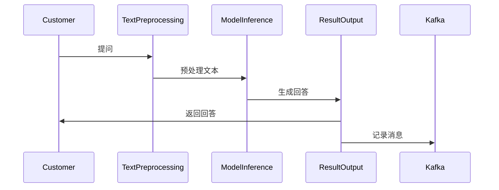

                 

### 关键词
消息队列、LLM应用、异步通信、优化策略、性能提升、系统可扩展性、降低系统耦合度。

### 摘要
本文深入探讨了消息队列技术在优化大规模语言模型（LLM）应用异步通信中的重要性。通过分析消息队列的基本概念、工作原理、类型和实现，我们揭示了其与LLM应用相结合的原理与优势，以及面临的挑战和解决方案。进一步，本文详细阐述了在LLM应用中优化消息队列配置、模型和数据处理的策略，并通过实际案例展示了优化实践的效果。最终，本文总结了消息队列优化LLM应用异步通信的最佳实践和未来研究方向。

### 目录大纲

----------------------------------------------------------------

# 消息队列：优化LLM应用的异步通信

## 第一部分：背景介绍与核心概念

### 1.1 问题背景

#### 1.1.1 消息队列的基本概念

#### 1.1.2 LLM应用的异步通信需求

#### 1.1.3 优化异步通信的必要性

### 1.2 核心概念与联系

#### 1.2.1 消息队列的核心概念

#### 1.2.1.1 消息队列的工作原理

#### 1.2.1.2 消息队列的主要类型

#### 1.2.2 LLM的核心概念

#### 1.2.2.1 LLM的基本原理

#### 1.2.2.2 LLM的应用领域

### 1.3 消息队列与LLM应用的结合

#### 1.3.1 结合的原理与优势

#### 1.3.2 结合的挑战与解决方案

### 1.4 边界与外延

#### 1.4.1 消息队列的适用场景

#### 1.4.2 LLM应用的限制因素

### 1.5 本章小结

## 第二部分：消息队列技术详解

### 2.1 消息队列的工作原理

#### 2.1.1 消息的生产与消费

#### 2.1.1.1 生产者-消费者的角色与责任

#### 2.1.1.2 消息的生命周期

#### 2.1.2 消息队列的常见模式

#### 2.1.2.1 点对点（P2P）模式

#### 2.1.2.2 发布-订阅（Pub-Sub）模式

### 2.2 消息队列的类型

#### 2.2.1 队列系统

#### 2.2.1.1 队列的基本特性

#### 2.2.1.2 队列的应用场景

#### 2.2.2 发布-订阅系统

#### 2.2.2.1 发布-订阅的基本特性

#### 2.2.2.2 发布-订阅的应用场景

### 2.3 消息队列的常见实现

#### 2.3.1 Apache Kafka

#### 2.3.1.1 Kafka的核心特性

#### 2.3.1.2 Kafka的应用案例

#### 2.3.2 RabbitMQ

#### 2.3.2.1 RabbitMQ的核心特性

#### 2.3.2.2 RabbitMQ的应用案例

#### 2.3.3 RocketMQ

#### 2.3.3.1 RocketMQ的核心特性

#### 2.3.3.2 RocketMQ的应用案例

### 2.4 消息队列的性能优化

#### 2.4.1 消息队列的性能指标

#### 2.4.1.1 消息吞吐量

#### 2.4.1.2 消息延迟

#### 2.4.2 消息队列的优化策略

#### 2.4.2.1 集群部署

#### 2.4.2.2 系统监控

#### 2.4.2.3 消息序列化与反序列化优化

### 2.5 本章小结

## 第三部分：LLM应用的异步通信优化

### 3.1 LLM应用的异步通信需求

#### 3.1.1 LLM应用的特点

#### 3.1.1.1 大规模数据处理能力

#### 3.1.1.2 实时性要求

#### 3.1.2 异步通信的优势

#### 3.1.2.1 提高系统可扩展性

#### 3.1.2.2 降低系统耦合度

### 3.2 消息队列在LLM应用中的优化策略

#### 3.2.1 消息队列配置优化

#### 3.2.1.1 消息队列参数调整

#### 3.2.1.2 集群模式的选择

#### 3.2.2 LLM模型优化

#### 3.2.2.1 模型选择与调优

#### 3.2.2.2 模型并行化处理

#### 3.2.3 数据处理优化

#### 3.2.3.1 数据缓存策略

#### 3.2.3.2 数据压缩与解压缩

### 3.3 案例研究：消息队列在LLM应用中的优化实践

#### 3.3.1 案例背景

#### 3.3.2 优化前的问题分析

#### 3.3.3 优化措施与效果评估

### 3.4 本章小结

## 第四部分：消息队列与LLM应用的综合实践

### 4.1 环境搭建

#### 4.1.1 消息队列环境搭建

### 4.1.2 LLM应用环境搭建

### 4.2 系统架构设计

#### 4.2.1 系统功能设计

#### 4.2.2 系统架构设计

#### 4.2.3 系统接口设计

#### 4.2.4 系统交互设计

### 4.3 项目实战

#### 4.3.1 环境安装

#### 4.3.2 系统核心实现源代码

#### 4.3.3 代码应用解读与分析

#### 4.3.4 实际案例分析和详细讲解剖析

#### 4.3.5 项目小结

### 4.4 最佳实践 Tips

### 4.5 小结

### 4.6 注意事项

### 4.7 拓展阅读

----------------------------------------------------------------

### 第一部分：背景介绍与核心概念

#### 1.1 问题背景

在现代信息社会中，数据处理和分析的需求日益增长，尤其是大规模语言模型（LLM）的广泛应用，使得异步通信的需求变得尤为突出。异步通信允许系统在不同的时间点独立处理消息，从而提高系统的可扩展性和降低耦合度。

随着云计算、大数据和人工智能技术的快速发展，消息队列作为一种高效的异步通信工具，得到了广泛的应用。消息队列通过将消息临时存储在队列中，确保消息的生产者和消费者可以在不同的时间点处理消息，从而实现了系统的解耦和负载均衡。

然而，在LLM应用中，异步通信的需求更加复杂和迫切。首先，LLM处理的是大规模的数据集，需要处理海量的文本和计算任务。其次，LLM应用往往对实时性有较高的要求，需要在短时间内处理大量的请求，提供快速的响应。此外，LLM应用通常涉及多个模块和服务的协同工作，需要实现高效的跨服务通信和任务调度。

因此，优化LLM应用的异步通信变得至关重要。通过合理地设计和配置消息队列，可以显著提升系统的性能和可靠性，提高系统的可扩展性和灵活性，为LLM应用提供高效、稳定的通信机制。

#### 1.1.1 消息队列的基本概念

消息队列是一种数据传输和存储系统，它允许消息在分布式系统中进行异步传递和消费。消息队列的核心思想是将数据以消息的形式发送到队列中，然后由消费者从队列中获取并处理这些消息。消息队列的主要特点包括：

1. **异步传输**：消息队列允许生产者与消费者在不同时间处理消息，从而实现异步通信，降低了系统之间的耦合度。
2. **可靠性**：消息队列通常提供可靠的消息传输机制，确保消息不会丢失或重复处理。
3. **可扩展性**：消息队列可以支持水平扩展，通过增加队列节点来提高系统的处理能力。
4. **灵活性**：消息队列支持多种消息传递模式和协议，可以适应不同的应用场景和需求。

消息队列的基本工作流程包括以下几个步骤：

1. **消息生产**：生产者将消息生成并发送到消息队列中。
2. **消息存储**：消息队列将消息存储在内部数据结构中，以便后续消费。
3. **消息消费**：消费者从消息队列中获取消息并执行相应的处理操作。
4. **消息确认**：消费者处理完成后，向消息队列发送确认信号，以告知消息已成功处理。

消息队列的主要类型包括：

1. **队列系统**：队列系统是一种基于FIFO（先进先出）原则的消息存储系统，适用于点对点通信模式。
2. **发布-订阅系统**：发布-订阅系统是一种基于广播模式的消息传输系统，多个消费者可以订阅同一主题，从而实现消息的多播。

#### 1.1.2 LLM应用的异步通信需求

大规模语言模型（LLM）是人工智能领域的重要进展，能够处理和理解复杂的语言结构，提供智能的文本生成和解析功能。LLM应用广泛涉及自然语言处理（NLP）、智能客服、文本摘要、机器翻译等多个领域。

在LLM应用中，异步通信的需求主要源于以下几个方面：

1. **大规模数据处理**：LLM通常需要处理海量的文本数据，这些数据可能来自不同的数据源，例如数据库、Web爬取等。异步通信可以确保数据处理过程不会阻塞，从而提高系统的吞吐量和处理效率。

2. **实时性要求**：许多LLM应用对实时性有较高的要求，例如智能客服系统需要在用户提问后立即提供回答，或者机器翻译系统需要在用户输入后立即输出翻译结果。异步通信可以确保请求能够在短时间内得到响应，提高用户的满意度。

3. **系统可扩展性**：LLM应用往往涉及多个模块和服务的协同工作，例如文本预处理、模型推理和结果输出等。异步通信可以实现模块之间的松耦合，从而提高系统的可扩展性，支持水平扩展和动态调整。

4. **降低系统耦合度**：异步通信可以降低不同模块之间的依赖关系，使得每个模块可以独立开发和部署。这有助于简化系统的架构设计，提高系统的可维护性和可靠性。

为了满足LLM应用的异步通信需求，需要选择合适的消息队列技术，并对其进行优化配置。合适的消息队列技术可以提供高效、可靠的消息传输机制，确保消息不会丢失或重复处理，同时能够支持大规模数据的实时处理和系统的高可用性。

#### 1.1.3 优化异步通信的必要性

在LLM应用中，异步通信的优化至关重要，主要原因如下：

1. **提高性能**：通过优化消息队列，可以显著提升系统的处理能力，降低消息延迟，提高系统的响应速度和吞吐量。这对于需要处理海量数据和提供实时服务的LLM应用尤为重要。

2. **增强可靠性**：优化后的消息队列可以提供更可靠的消息传输机制，确保消息不会丢失或重复处理，从而提高系统的稳定性和可用性。

3. **支持高并发**：消息队列的优化策略，如集群部署和负载均衡，可以支持系统在高并发场景下的稳定运行，避免因并发访问导致的性能瓶颈。

4. **降低耦合度**：优化异步通信可以降低系统之间的依赖关系，使得每个模块可以独立开发和部署。这有助于简化系统的架构设计，提高系统的可维护性和可靠性。

5. **支持扩展性**：通过优化消息队列，可以实现系统的水平扩展，支持更多的并发处理能力，满足不断增长的业务需求。

总之，优化异步通信对于提高LLM应用的性能、可靠性和扩展性具有重要意义，是确保系统高效运行的关键。

#### 1.2 核心概念与联系

在深入探讨消息队列和LLM应用之前，我们首先需要理解它们的核心概念及其相互之间的联系。

**1.2.1 消息队列的核心概念**

消息队列是一种用于异步通信的系统，它允许不同服务或模块之间通过发送和接收消息来进行数据交换。以下是消息队列的几个关键概念：

- **消息（Message）**：消息是传递的数据单元，通常包含数据内容、发送者和接收者的信息等。
- **队列（Queue）**：队列是一种数据结构，用于存储等待处理的消息。消息按照先进先出（FIFO）的原则进行排列。
- **生产者（Producer）**：生产者是消息的发送方，它负责生成消息并将其发送到队列中。
- **消费者（Consumer）**：消费者是消息的接收方，它从队列中获取消息并执行相应的处理操作。
- **消息传输协议（Message Transport Protocol）**：消息传输协议用于定义消息如何在网络中传输，包括传输格式、传输机制等。

**消息队列的工作原理**

消息队列的基本工作流程如下：

1. **消息生产**：生产者生成消息并将其发送到消息队列中。
2. **消息存储**：消息队列将消息存储在内部的数据结构中，确保消息的有序传递和可靠存储。
3. **消息消费**：消费者从队列中获取消息，执行相应的处理操作。
4. **消息确认**：消费者处理完成后，向消息队列发送确认信号，告知消息已成功处理。

**消息队列的主要类型**

消息队列主要分为以下两种类型：

- **队列系统（Queue System）**：队列系统是一种基于FIFO原则的消息存储系统，适用于点对点（P2P）通信模式。生产者和消费者之间通过队列进行一对一的消息传递。
- **发布-订阅系统（Pub-Sub System）**：发布-订阅系统是一种基于广播模式的系统，多个消费者可以订阅同一主题，从而实现消息的多播。生产者将消息发送到主题，多个消费者可以同时消费这些消息。

**1.2.2 LLM的核心概念**

大规模语言模型（LLM）是一种基于深度学习的技术，能够理解和生成自然语言文本。以下是LLM的一些关键概念：

- **模型（Model）**：模型是用于文本处理和生成的神经网络架构，通常包含多个层次和层之间的连接。
- **预训练（Pre-training）**：预训练是指在使用特定数据集对模型进行训练，使其能够捕捉语言的结构和语义信息。
- **微调（Fine-tuning）**：微调是指将预训练模型在特定任务上进行进一步训练，以适应特定的应用场景。
- **输入（Input）**：输入是模型用于处理的数据，通常包括文本、音频或其他形式的数据。
- **输出（Output）**：输出是模型处理后的结果，可能是文本、标签或其他形式的输出。

**LLM的应用领域**

LLM在多个领域都有广泛的应用，包括：

- **自然语言处理（NLP）**：LLM可以用于文本分类、情感分析、实体识别、命名实体识别等任务。
- **智能客服**：LLM可以帮助构建智能客服系统，提供自动化的客户服务。
- **文本摘要**：LLM可以自动生成文本摘要，提取关键信息和要点。
- **机器翻译**：LLM可以用于机器翻译任务，提供准确的跨语言文本翻译。
- **内容生成**：LLM可以用于生成文章、故事、诗歌等文本内容。

**1.3 消息队列与LLM应用的结合**

消息队列与LLM应用的结合具有以下几个方面的优势：

- **异步通信**：消息队列可以实现LLM应用中不同模块之间的异步通信，确保数据处理不会阻塞，提高系统的响应速度和处理能力。
- **解耦**：通过消息队列，可以降低LLM应用中不同模块之间的耦合度，使得每个模块可以独立开发和部署，提高系统的可维护性和扩展性。
- **负载均衡**：消息队列可以支持负载均衡，将任务分配到不同的节点进行处理，提高系统的处理能力和可用性。
- **弹性扩展**：消息队列支持水平扩展，可以通过增加队列节点来提高系统的处理能力，满足不断增长的业务需求。

然而，消息队列与LLM应用结合也面临一些挑战，例如消息延迟、数据一致性和可靠性等问题。因此，需要针对这些挑战采取相应的解决方案，确保消息队列在LLM应用中发挥最佳效果。

#### 1.3.1 结合的原理与优势

消息队列与大规模语言模型（LLM）应用的结合，基于异步通信和分布式系统的基本原理。以下详细阐述结合的原理及其带来的优势：

**结合原理**

1. **异步通信**：消息队列的核心原理是异步通信，允许生产者和消费者在不同时间点独立处理消息。这意味着LLM应用中的各个模块，如文本预处理、模型推理、结果输出等，可以独立工作，互不干扰，从而实现高效的系统设计。
   
2. **分布式处理**：消息队列利用分布式系统的优势，可以将任务分发到多个节点上并行处理，提高系统的吞吐量和响应速度。LLM应用中的大规模数据处理和实时响应需求，非常适合这种分布式处理架构。

3. **解耦**：通过消息队列，LLM应用中的不同模块（如文本预处理模块、模型推理模块、结果输出模块等）可以实现松耦合，从而提高系统的可维护性和扩展性。这种解耦使得各个模块可以独立开发、部署和升级，降低了系统的复杂度。

**优势**

1. **提高系统可扩展性**：消息队列支持水平扩展，可以在系统负载增加时，通过增加队列节点来提高处理能力。这对于LLM应用来说尤为重要，因为LLM处理的是大规模的数据集，需要处理海量的文本和计算任务。

2. **降低系统耦合度**：消息队列通过异步通信和解耦机制，降低了LLM应用中不同模块之间的依赖关系，使得每个模块可以独立开发和部署。这种低耦合设计提高了系统的灵活性和可维护性。

3. **提高系统的可靠性**：消息队列提供了可靠的消息传输机制，确保消息不会丢失或重复处理。这对于LLM应用来说至关重要，因为LLM处理的是重要的数据，任何消息丢失或重复处理都可能导致严重的后果。

4. **支持负载均衡**：消息队列可以支持负载均衡，将任务分配到不同的节点上进行处理，从而提高系统的整体性能和响应速度。这对于需要处理高并发请求的LLM应用尤为重要。

5. **提高系统的实时性**：消息队列通过异步通信和分布式处理，可以显著提高系统的实时性。这对于需要实时响应的LLM应用，如智能客服系统和实时文本翻译系统，具有明显的优势。

总之，消息队列与LLM应用的结合，通过异步通信和分布式处理机制，实现了系统的高效、可靠和可扩展的通信和数据处理，为LLM应用提供了强大的技术支持。

#### 1.3.2 结合的挑战与解决方案

尽管消息队列与大规模语言模型（LLM）应用的结合带来了显著的优势，但在实际应用中也面临一些挑战。以下详细分析这些挑战以及相应的解决方案：

**1. 消息延迟**

**挑战**：在分布式系统中，消息的传输和处理可能会受到网络延迟、系统负载等因素的影响，导致消息处理时间延长。这对于需要实时响应的LLM应用来说是一个严重的问题。

**解决方案**： 
- **优化网络架构**：通过使用更高速的传输协议和网络设备，可以减少网络延迟。例如，使用HTTPS/2协议替代HTTP/1.x，可以提高数据传输速度。
- **消息压缩**：对消息进行压缩可以减少传输时间。例如，使用GZIP压缩工具对文本消息进行压缩，可以显著降低消息大小，提高传输速度。
- **异步处理**：在LLM应用中，可以采用异步处理机制，允许生产者和消费者在不同时间点处理消息。这样可以减少同步等待时间，提高系统的整体处理速度。
- **预取消息**：通过预取消息，可以提前获取并处理后续的消息，从而减少消息延迟。例如，可以设置一个预取缓冲区，提前获取并处理下一批消息。

**2. 数据一致性和可靠性**

**挑战**：在分布式系统中，数据的一致性和可靠性是一个重要问题。消息队列在传输和处理过程中可能会出现消息丢失、重复处理或数据不一致的情况。

**解决方案**：
- **事务消息**：使用事务消息可以确保消息的可靠传输。在发送消息时，可以设置消息的事务属性，确保消息在处理过程中不会丢失或重复处理。
- **消息确认机制**：通过消息确认机制，消费者可以告知消息队列消息已成功处理。这样可以确保消息不会被重复处理，提高数据的一致性和可靠性。
- **重试机制**：在消息处理失败时，可以设置重试机制，重新发送和处理消息。例如，可以使用消息队列的重试机制或自定义的重试逻辑，确保消息最终被正确处理。

**3. 系统的可扩展性和灵活性**

**挑战**：随着业务需求的增长，LLM应用需要支持更多的并发处理能力和灵活的扩展。然而，消息队列系统的扩展和灵活性可能会受到限制。

**解决方案**：
- **水平扩展**：通过水平扩展，可以增加消息队列节点的数量，提高系统的处理能力。例如，可以使用Kafka等支持水平扩展的消息队列系统。
- **动态调整**：根据系统的负载和需求，可以动态调整消息队列的配置，如增加或减少队列节点的数量，从而实现灵活的扩展。
- **微服务架构**：采用微服务架构，可以将LLM应用拆分为多个微服务，每个微服务负责特定的功能。这样可以提高系统的模块化和灵活性，使得各个微服务可以根据需求独立扩展。

**4. 消息队列与LLM应用的集成**

**挑战**：将消息队列集成到LLM应用中，需要解决消息格式、处理逻辑、系统兼容性等问题。

**解决方案**：
- **消息格式标准化**：使用统一的消息格式，如JSON或XML，可以确保消息在不同模块之间的一致性和兼容性。
- **消息处理逻辑抽象**：通过抽象消息处理逻辑，可以将消息队列的处理逻辑与LLM应用的业务逻辑分离，提高系统的可维护性和扩展性。
- **集成测试**：在进行集成开发时，需要进行全面的集成测试，确保消息队列与LLM应用之间的交互正常，无数据丢失或处理错误。

总之，尽管消息队列与LLM应用的结合面临一些挑战，但通过合理的架构设计和优化策略，可以克服这些挑战，实现高效、可靠和可扩展的异步通信和数据处理。

#### 1.4 边界与外延

**1.4.1 消息队列的适用场景**

消息队列技术在多种场景下表现出色，尤其是在需要异步通信和分布式处理的系统中。以下是一些典型的适用场景：

1. **分布式系统中的异步通信**：消息队列非常适合用于分布式系统中的异步通信，如电商平台中的订单处理、物流跟踪、库存管理等。通过消息队列，可以确保订单信息、物流信息等在不同系统之间异步传递，提高系统的可靠性和性能。

2. **微服务架构**：在微服务架构中，消息队列用于服务之间的通信和协调。通过消息队列，可以将各个微服务解耦，确保每个微服务可以独立开发、部署和扩展，从而提高系统的灵活性和可维护性。

3. **大数据处理**：在大数据处理场景中，消息队列可以用于数据的收集、传输和处理。通过消息队列，可以确保大规模数据在不同处理节点之间异步传输，提高数据处理效率。

4. **物联网（IoT）**：在物联网场景中，消息队列用于设备的通信和数据传输。通过消息队列，可以确保设备数据在不同节点之间异步传递，提高系统的实时性和可靠性。

**1.4.2 LLM应用的限制因素**

尽管LLM应用在自然语言处理领域表现出色，但也存在一些限制因素：

1. **计算资源要求**：LLM模型通常需要大量的计算资源，包括CPU和GPU。这可能导致在资源受限的环境中，LLM应用的性能和响应速度受到限制。

2. **数据质量要求**：LLM模型的训练和推理需要高质量的数据集。如果数据集质量较差，可能会导致模型性能下降，影响应用效果。

3. **实时性要求**：尽管异步通信可以提高LLM应用的实时性，但某些场景下，仍需要实时的响应。例如，在实时客服系统中，用户提问需要立即得到回答，这可能会对LLM模型的实时处理能力提出更高的要求。

4. **可解释性要求**：LLM模型通常具有高度的复杂性和黑盒特性，其决策过程难以解释。在某些应用场景中，例如医疗诊断、金融风险管理等，需要模型具有可解释性，以便用户理解和信任。

**1.5 本章小结**

本章节介绍了消息队列在优化大规模语言模型（LLM）应用异步通信中的重要性。首先，我们讨论了消息队列的基本概念和工作原理，包括消息的生产与消费、消息队列的常见模式以及主要类型。接着，我们分析了LLM应用在异步通信方面的需求，并探讨了优化异步通信的必要性。随后，我们详细阐述了消息队列与LLM应用的结合原理及其优势，同时也分析了结合过程中可能遇到的挑战和解决方案。最后，我们讨论了消息队列在适用场景中的表现以及LLM应用的限制因素。通过本章的学习，读者可以全面了解消息队列技术在优化LLM应用异步通信方面的应用和实践。

### 第二部分：消息队列技术详解

#### 2.1 消息队列的工作原理

消息队列的工作原理是基于异步通信和解耦的理念，使得系统中的不同模块可以独立运行并互相协作。以下详细阐述消息队列的工作原理：

**2.1.1 消息的生产与消费**

消息的生产与消费是消息队列的核心环节，涉及到消息的生成、发送、接收和处理。以下是消息的生产与消费的基本流程：

1. **消息生成**：消息生产者负责生成消息。消息生产者可以是系统中的任何组件或服务，如Web应用程序、数据库服务等。生产者将消息创建并包装成一定的格式，如JSON、XML等，以便在系统中进行传递。

2. **消息发送**：生成好的消息会被发送到消息队列中。消息队列提供了一种数据结构，用于存储和管理消息。消息通常按照先进先出（FIFO）的原则进行排队，确保消息按照生成的顺序进行消费。

3. **消息消费**：消息消费者从消息队列中获取消息并执行相应的处理操作。消费者可以是任何需要处理消息的组件或服务。消费者从队列中获取消息后，会根据消息内容进行相应的业务逻辑处理，如数据存储、数据加工等。

4. **消息确认**：消费者在完成消息处理后，会向消息队列发送确认信号，告知消息已成功处理。确认信号通常是消息的唯一标识（如消息ID），以确保消息在系统中被正确处理。如果消费者无法处理消息，可以设置重试机制或通知系统管理员进行后续处理。

**2.1.1.1 生产者-消费者的角色与责任**

在消息队列中，生产者和消费者扮演着不同的角色，各自承担不同的责任：

- **生产者**：
  - 负责生成消息：生产者根据业务需求生成消息，并将其发送到消息队列中。
  - 保证消息格式正确：生产者需要确保消息的格式符合消息队列的协议和规范，以便消费者能够正确解析和处理消息。
  - 异常处理：生产者在发送消息时可能会遇到网络故障、系统异常等，需要具备异常处理能力，如重试机制、消息持久化等，确保消息最终能够成功发送到队列中。

- **消费者**：
  - 负责消费消息：消费者从消息队列中获取消息，并执行相应的处理操作。
  - 确认消息处理成功：消费者在处理完消息后，需要向消息队列发送确认信号，确保消息已被成功处理。如果处理失败，可以设置重试机制或通知系统管理员进行后续处理。
  - 解析消息内容：消费者需要根据消息的格式和内容进行解析，提取关键信息并进行相应的业务逻辑处理。

**2.1.1.2 消息的生命周期**

消息在消息队列中的生命周期可以分为以下几个阶段：

1. **生成阶段**：生产者生成消息，并将消息发送到消息队列中。在这一阶段，消息通常被保存在内存或磁盘上的队列中，等待消费。

2. **传输阶段**：消息在队列中等待被消费者获取。在这一阶段，消息队列会确保消息按照一定的顺序（如先进先出）进行传递，确保消息不被丢失或重复处理。

3. **消费阶段**：消费者从消息队列中获取消息，并执行相应的处理操作。在这一阶段，消费者会根据消息的内容进行业务逻辑处理，如数据存储、数据加工等。

4. **确认阶段**：消费者在完成消息处理后，向消息队列发送确认信号，告知消息已成功处理。在这一阶段，消息队列会记录确认信号，以确保消息处理过程透明和可追溯。

5. **归档阶段**：消息在队列中被确认处理后，通常会进入归档阶段。归档可以确保消息不再占用系统资源，同时方便后续的审计和监控。

**2.1.2 消息队列的常见模式**

消息队列的常见模式主要包括点对点（P2P）模式和发布-订阅（Pub-Sub）模式。以下是这两种模式的详细介绍：

**2.1.2.1 点对点（P2P）模式**

点对点模式是一种基于一对一通信的消息队列模式。在P2P模式中，每个消息只有一个消费者（即生产者和消费者为一对一关系），消费者只能消费一次消息。以下是P2P模式的基本流程：

1. 生产者生成消息并将其发送到队列中。
2. 队列将消息存储在内存或磁盘上。
3. 消费者从队列中获取消息并执行处理操作。
4. 消费者向队列发送确认信号，告知消息已处理完毕。

P2P模式的特点如下：

- **可靠性**：P2P模式确保消息的可靠传输，消费者只能消费一次消息，防止消息重复处理。
- **有序性**：P2P模式确保消息按照生成的顺序进行消费，保证消息的有序性。
- **简单性**：P2P模式相对简单，适用于一对一的场景，如任务队列、订单处理等。

**2.1.2.2 发布-订阅（Pub-Sub）模式**

发布-订阅模式是一种基于多对多通信的消息队列模式。在Pub-Sub模式中，多个消费者可以订阅同一主题，生产者发送的消息会被所有订阅该主题的消费者消费。以下是Pub-Sub模式的基本流程：

1. 生产者生成消息并将其发送到队列中。
2. 队列将消息广播到所有订阅该主题的消费者。
3. 消费者从队列中获取消息并执行处理操作。
4. 消费者向队列发送确认信号，告知消息已处理完毕。

Pub-Sub模式的特点如下：

- **灵活性**：Pub-Sub模式支持多对多的通信，生产者和消费者之间的关系不固定，适用于复杂的业务场景，如物联网、实时消息推送等。
- **广播性**：Pub-Sub模式可以实现消息的广播，一个生产者可以同时向多个消费者发送消息，提高系统的灵活性和扩展性。
- **去中心化**：Pub-Sub模式去中心化，每个消费者独立订阅主题，消息在消费者之间直接传递，降低系统的耦合度。

通过以上对消息队列工作原理的详细阐述，读者可以更好地理解消息队列的基本概念和工作机制，为后续的深入学习和应用打下坚实基础。

#### 2.2 消息队列的类型

消息队列在分布式系统中扮演着重要的角色，其类型的多样性和适用性为不同场景提供了灵活的解决方案。以下是消息队列的两种主要类型：队列系统（Queue System）和发布-订阅系统（Pub-Sub System）。

**2.2.1 队列系统**

队列系统是一种基于先进先出（FIFO）原则的消息存储和传输系统，其主要特点是消息按照顺序进行传递和消费。队列系统的核心组件包括消息队列、生产者和消费者。

**2.2.1.1 队列的基本特性**

- **先进先出（FIFO）**：队列系统确保消息按照生成顺序进行传递和消费，先进入队列的消息优先被消费。
- **单一消费者**：队列系统通常只允许一个消费者消费消息，即生产者和消费者之间为一对一的关系。
- **可靠性**：队列系统提供消息的可靠传输机制，确保消息不会丢失或重复处理，保障系统的稳定性。
- **顺序性**：队列系统确保消息的有序性，消费顺序与生成顺序一致。

**2.2.1.2 队列的应用场景**

队列系统适用于以下场景：

- **任务队列**：在分布式系统中，可以将任务生成消息，并将任务消息放入队列中。消费者从队列中获取任务消息并执行任务，如处理订单、日志分析等。
- **工作流管理**：队列系统可以用于管理工作流中的任务，确保任务按照顺序执行，提高系统的自动化程度。
- **负载均衡**：通过将任务消息放入队列，可以实现对任务的负载均衡，确保多个消费者可以同时处理任务，提高系统的处理能力。

**2.2.2 发布-订阅系统**

发布-订阅系统是一种基于发布-订阅模式的消息传输系统，其主要特点是消息的发布者和订阅者之间没有固定的关系，多个订阅者可以同时订阅同一主题的消息。

**2.2.2.1 发布-订阅的基本特性**

- **多对多关系**：发布-订阅系统允许多个发布者向系统发布消息，同时也允许多个订阅者订阅同一主题的消息。
- **广播机制**：发布者发布消息后，系统会广播消息到所有订阅该主题的订阅者，确保消息能够及时传递到目标消费者。
- **灵活性**：发布-订阅系统具有高度的灵活性，订阅者可以根据需求动态订阅和取消订阅主题，适应复杂的业务场景。
- **去中心化**：发布-订阅系统去中心化，每个订阅者独立订阅主题，消息在订阅者之间直接传递，降低系统的耦合度。

**2.2.2.2 发布-订阅的应用场景**

发布-订阅系统适用于以下场景：

- **实时消息推送**：在实时消息推送场景中，发布者可以发布消息，订阅者订阅特定主题的消息，从而实现实时通知和消息传递。
- **物联网（IoT）**：在物联网场景中，设备可以发布传感器数据，服务器订阅特定设备的传感器数据，实现设备之间的数据共享和协同工作。
- **分布式系统监控**：在分布式系统监控中，系统可以发布监控数据，监控系统订阅相关监控数据，实现实时监控和告警。

通过以上对消息队列类型的详细阐述，读者可以更好地理解队列系统和发布-订阅系统的基本特性和应用场景，为实际应用中的消息队列选择提供指导。

#### 2.3 消息队列的常见实现

消息队列在分布式系统中有着广泛的应用，其常见的实现包括Apache Kafka、RabbitMQ和RocketMQ。这些消息队列系统各具特色，适用于不同的应用场景。

**2.3.1 Apache Kafka**

Apache Kafka是一个分布式流处理平台，主要用于大规模数据的实时传输和处理。Kafka具有高吞吐量、低延迟、可靠性和可扩展性等优点。

**2.3.1.1 Kafka的核心特性**

- **分布式架构**：Kafka是一个分布式系统，可以水平扩展，支持数千个节点和数百万个主题分区，适用于大规模数据处理场景。
- **高吞吐量**：Kafka采用基于磁盘的存储方式，可以实现高吞吐量数据传输，每秒处理数百万条消息。
- **可靠性**：Kafka提供副本机制，确保数据在系统中可靠传输和存储。通过副本同步，Kafka可以容忍部分节点的故障，确保系统的可用性。
- **持久化**：Kafka支持持久化存储，可以将消息持久化到磁盘，确保数据不丢失，同时支持消息的批量处理和缓存。

**2.3.1.2 Kafka的应用案例**

- **实时数据流处理**：Kafka广泛应用于实时数据流处理场景，如日志收集、网站流量监控等。
- **数据集成**：Kafka可以作为数据集成平台，用于连接不同的数据源和数据存储系统，实现数据的实时传输和处理。
- **消息队列**：Kafka可以作为消息队列系统，用于分布式系统的异步通信和任务调度。

**2.3.2 RabbitMQ**

RabbitMQ是一个开源的分布式消息队列中间件，基于AMQP（Advanced Message Queuing Protocol）协议实现。RabbitMQ具有灵活、可靠、高效的特点，适用于多种分布式应用场景。

**2.3.2.1 RabbitMQ的核心特性**

- **可靠性**：RabbitMQ提供多种可靠性机制，如消息持久化、确认机制、重试机制等，确保消息的可靠传输和存储。
- **灵活性和扩展性**：RabbitMQ支持多种消息传输模式，如点对点（P2P）和发布-订阅（Pub-Sub），适用于不同的应用场景和需求。
- **高效性**：RabbitMQ采用基于内存的消息队列，实现高效的消息传输和处理。
- **多语言支持**：RabbitMQ支持多种编程语言和框架，如Java、Python、Node.js等，便于集成和扩展。

**2.3.2.2 RabbitMQ的应用案例**

- **企业级消息队列**：RabbitMQ广泛应用于企业级消息队列系统，如订单处理、库存管理、物流跟踪等。
- **分布式任务调度**：RabbitMQ可以作为分布式任务调度的消息队列系统，实现任务的异步处理和调度。
- **实时数据流处理**：RabbitMQ可以作为实时数据流处理平台，用于处理和分析大规模数据。

**2.3.3 RocketMQ**

RocketMQ是阿里巴巴开源的一个分布式流消息队列系统，具有高吞吐量、高可靠性、低延迟等优点。RocketMQ适用于大规模数据处理和实时通信场景。

**2.3.3.1 RocketMQ的核心特性**

- **分布式架构**：RocketMQ支持分布式部署，可以实现海量消息的高效传输和处理。
- **高吞吐量**：RocketMQ采用基于磁盘的存储方式，实现高吞吐量数据传输，每秒处理数百万条消息。
- **可靠性**：RocketMQ提供多种可靠性机制，如消息持久化、副本机制、确认机制等，确保消息的可靠传输和存储。
- **高可用性**：RocketMQ支持集群部署，可以容忍部分节点的故障，确保系统的可用性。
- **多语言支持**：RocketMQ支持多种编程语言和框架，如Java、Python、Go等，便于集成和扩展。

**2.3.3.2 RocketMQ的应用案例**

- **金融场景**：RocketMQ广泛应用于金融场景，如订单处理、交易系统、风险控制等，提供可靠的消息传输和数据处理能力。
- **实时通信**：RocketMQ可以作为实时通信平台的消息队列系统，实现实时消息的传输和处理。
- **大规模数据处理**：RocketMQ适用于大规模数据处理场景，如日志收集、数据分析等，提供高效的数据传输和处理能力。

通过以上对Apache Kafka、RabbitMQ和RocketMQ的详细阐述，读者可以全面了解这些消息队列系统的核心特性和应用案例，为实际项目中的选择提供参考。

#### 2.4 消息队列的性能优化

消息队列的性能优化对于确保系统的稳定性和高效性至关重要。以下从几个关键方面详细探讨消息队列的性能优化策略。

**2.4.1 消息队列的性能指标**

在评估消息队列的性能时，需要关注以下几个关键指标：

- **消息吞吐量**：消息吞吐量是指消息队列每秒能够处理的消息数量。高吞吐量是保证系统在高负载下仍然能够高效运行的重要指标。
- **消息延迟**：消息延迟是指消息从生产者发送到消费者所需的时间。低延迟能够确保系统的实时性和响应速度。
- **系统可用性**：系统可用性是指消息队列在故障情况下的恢复能力和可靠性。高可用性能够确保系统在遇到故障时能够迅速恢复，减少系统的停机时间。

**2.4.2 消息队列的优化策略**

1. **集群部署**：通过集群部署，可以增加消息队列的处理能力和容错能力。集群中的多个节点可以并行处理消息，提高系统的吞吐量和可用性。以下是集群部署的一些关键策略：
   - **负载均衡**：使用负载均衡器将消息均匀地分配到集群中的各个节点，避免单点瓶颈。
   - **副本机制**：通过副本机制，可以确保消息在系统中冗余存储，提高系统的可靠性。在故障发生时，其他节点可以迅速接管故障节点的任务。
   - **自动扩展**：根据系统的负载和需求，自动增加或减少集群节点数量，实现弹性扩展。

2. **系统监控**：通过系统监控，可以实时了解消息队列的运行状态和性能指标，及时发现和解决潜在问题。以下是系统监控的关键策略：
   - **实时监控**：使用实时监控工具，如Prometheus、Grafana等，收集和展示消息队列的运行状态和性能指标。
   - **报警机制**：设置报警机制，当系统指标超出阈值时，及时通知相关人员，确保问题得到及时处理。
   - **日志分析**：分析系统日志，了解消息队列的运行情况和异常信息，为性能优化提供依据。

3. **消息序列化与反序列化优化**：消息序列化与反序列化是消息传输过程中的重要环节，对性能有着显著影响。以下是消息序列化与反序列化优化的关键策略：
   - **选择合适的序列化框架**：选择合适的序列化框架，如Protocol Buffers、Kryo等，可以提高序列化和反序列化的效率。
   - **消息压缩**：对消息进行压缩，可以减少消息的大小，提高传输速度和系统的吞吐量。
   - **缓存序列化对象**：通过缓存序列化对象，可以减少序列化和反序列化的次数，提高系统的性能。

4. **消息队列参数调整**：通过调整消息队列的参数，可以优化系统的性能。以下是调整关键参数的一些策略：
   - **队列容量**：根据系统的负载和需求，调整队列的容量，避免消息积压和阻塞。
   - **线程池大小**：调整线程池大小，确保消费者能够高效处理消息，避免线程阻塞和系统资源浪费。
   - **批量处理**：通过批量处理，可以减少消息队列的IO操作和系统调用次数，提高系统的吞吐量。

通过以上性能优化策略，可以显著提升消息队列的性能，确保系统在高负载下仍然能够高效稳定地运行。在实际应用中，根据具体需求和场景，灵活应用这些优化策略，可以实现消息队列的最佳性能。

#### 2.5 本章小结

本章节详细介绍了消息队列的工作原理、类型及其常见实现。首先，我们探讨了消息队列的基本概念和工作原理，包括消息的生产与消费、消息队列的常见模式（点对点模式和发布-订阅模式）以及消息的生命周期。接着，我们介绍了消息队列的两种类型：队列系统和发布-订阅系统，并阐述了它们的基本特性和应用场景。随后，我们详细介绍了Apache Kafka、RabbitMQ和RocketMQ等常见消息队列系统的核心特性和应用案例。最后，我们探讨了消息队列的性能优化策略，包括集群部署、系统监控、消息序列化与反序列化优化以及消息队列参数调整。通过本章的学习，读者可以全面了解消息队列的技术细节和应用实践，为实际项目中的消息队列设计提供指导。消息队列在分布式系统中发挥着关键作用，是实现异步通信和分布式处理的重要工具。

### 第三部分：LLM应用的异步通信需求

在现代人工智能（AI）领域，大规模语言模型（LLM）因其强大的数据处理能力和语言生成能力而受到广泛关注。然而，随着LLM应用场景的不断扩大，异步通信需求也日益凸显。本文将详细探讨LLM应用的异步通信需求，分析其特点、异步通信的优势以及相关挑战。

#### 3.1.1 LLM应用的特点

**1. 大规模数据处理能力**

大规模数据处理能力是LLM应用的核心特点之一。LLM模型通常需要处理海量的文本数据，这些数据可能来源于多个渠道，如社交媒体、新闻网站、企业内部文档等。为了处理这些大规模数据，LLM应用需要高效的数据处理框架和通信机制，以确保数据处理的速度和准确性。

**2. 实时性要求**

实时性是许多LLM应用的关键需求。例如，智能客服系统需要在用户提问后立即提供回答，机器翻译系统需要在用户输入后立即输出翻译结果。实时性要求高，意味着LLM应用需要具备快速响应和处理大量请求的能力，从而提供高质量的服务。

**3. 跨平台兼容性**

LLM应用通常需要跨平台兼容，包括云平台、桌面应用程序、移动设备等。这要求LLM通信机制具有高度的灵活性和可扩展性，能够适应不同的平台和环境。

**4. 高并发处理能力**

随着用户数量的增加，LLM应用需要处理大量的并发请求。高并发处理能力是LLM应用能否提供稳定服务的重要保障。异步通信机制能够有效地降低系统之间的耦合度，提高系统的并发处理能力。

#### 3.1.2 异步通信的优势

**1. 提高系统可扩展性**

异步通信机制允许系统在处理大量请求时，将任务分配到多个节点上并行处理。这种分布式处理方式可以提高系统的可扩展性，适应不断增长的业务需求。

**2. 降低系统耦合度**

异步通信通过消息队列实现系统之间的松耦合，使得各个模块可以独立开发和部署。这种松耦合设计提高了系统的灵活性和可维护性，降低了系统之间的依赖关系。

**3. 提高系统的响应速度**

异步通信机制可以显著提高系统的响应速度。通过将任务分配到多个节点并行处理，可以缩短任务处理时间，提高系统的吞吐量。

**4. 支持高并发处理**

异步通信机制支持高并发处理，使得系统在处理大量请求时，不会出现性能瓶颈。通过消息队列的负载均衡机制，可以确保每个节点都能高效地处理任务，提高系统的整体性能。

#### 3.1.3 优化异步通信的必要性

在LLM应用中，优化异步通信具有以下几个方面的必要性：

**1. 提高性能**

优化异步通信可以显著提高系统的性能，减少消息延迟，提高系统的响应速度和处理能力。这对于需要处理海量数据和提供实时服务的LLM应用尤为重要。

**2. 增强可靠性**

优化后的异步通信可以提供更可靠的消息传输机制，确保消息不会丢失或重复处理，从而提高系统的稳定性和可用性。

**3. 降低成本**

通过优化异步通信，可以减少系统的资源消耗，降低硬件和运维成本。例如，通过消息压缩和批量处理，可以减少网络传输和存储的开销。

**4. 提高可维护性**

优化异步通信可以提高系统的可维护性。通过采用合适的消息队列系统和优化策略，可以降低系统的复杂度，使得系统更加易于维护和升级。

**5. 支持持续扩展**

优化异步通信可以支持系统的持续扩展，适应不断增长的业务需求。通过灵活的消息队列配置和负载均衡策略，可以确保系统在面临大量请求时，仍然能够稳定高效地运行。

总之，优化异步通信对于提高LLM应用的性能、可靠性和可扩展性具有重要意义，是实现高效、稳定和可扩展的LLM应用的关键。

#### 3.2 消息队列在LLM应用中的优化策略

在LLM应用中，消息队列是实现高效异步通信的重要工具。为了充分发挥消息队列的优势，需要对其配置、LLM模型以及数据处理进行优化。以下详细阐述消息队列在LLM应用中的优化策略。

**3.2.1 消息队列配置优化**

**1. 消息队列参数调整**

消息队列的参数调整是优化消息传输和处理性能的关键。以下是一些常见的参数调整策略：

- **队列长度**：根据业务需求和系统负载，调整队列长度，避免消息积压和阻塞。如果队列长度过长，可能会导致消息延迟和系统性能下降。
- **批量处理大小**：调整批量处理大小，可以提高系统吞吐量。批量处理大的消息可以提高传输效率，减少系统调用的次数。然而，过大的批量处理可能导致单个消息的处理时间过长，影响系统的实时性。
- **线程池大小**：调整消息处理线程池大小，确保消费者能够高效处理消息。如果线程池大小过小，可能会导致处理能力不足，出现消息积压和延迟。如果线程池大小过大，可能会增加系统的资源消耗。

**2. 集群模式的选择**

集群模式是提高消息队列处理能力和可用性的重要手段。以下是一些常见的集群模式选择策略：

- **主从模式**：主从模式是一种常见的主节点和从节点架构，主节点负责消息的生产和消费，从节点负责数据的备份和同步。这种模式可以确保系统的容错能力和数据可靠性，但在负载较高时，主节点的性能可能会成为瓶颈。
- **对等模式**：对等模式中，所有节点都具有相同的功能，可以同时进行消息的生产和消费。这种模式可以均衡系统的负载，提高处理能力，但需要确保数据的一致性和可靠性。
- **混合模式**：混合模式结合了主从模式和对等模式的优点，根据业务需求和系统负载，灵活选择主从模式或对等模式。例如，在负载较低时，采用对等模式提高系统性能；在负载较高时，采用主从模式确保数据可靠性。

**3. 负载均衡策略**

负载均衡是提高消息队列系统性能和可用性的重要策略。以下是一些常见的负载均衡策略：

- **轮询负载均衡**：轮询负载均衡是将消息均匀地分配到每个节点上，确保每个节点的负载均衡。这种策略简单易实现，但可能会造成部分节点的负载过高。
- **哈希负载均衡**：哈希负载均衡是根据消息的属性（如消息ID、消息内容等）使用哈希函数计算节点ID，确保同一类消息总是分配到相同的节点上。这种策略可以确保数据的分区和负载均衡，但可能需要考虑哈希碰撞问题。
- **动态负载均衡**：动态负载均衡是根据系统的实时负载和性能指标，动态调整消息的分配策略。这种策略可以根据系统的当前状态，优化负载均衡，提高系统的性能和可用性。

**3.2.2 LLM模型优化**

**1. 模型选择与调优**

LLM模型的优化是提高系统性能和实时性的关键。以下是一些常见的LLM模型优化策略：

- **模型选择**：根据业务需求和数据特性，选择合适的LLM模型。例如，对于文本生成任务，可以选择预训练的语言模型（如GPT-3、BERT等）；对于文本分类任务，可以选择基于Transformer的模型（如BERT、RoBERTa等）。
- **模型调优**：通过调整模型参数，优化模型的性能和实时性。例如，可以调整学习率、批量大小、正则化参数等，以提高模型的收敛速度和预测准确性。
- **模型压缩**：通过模型压缩技术，减少模型的参数数量和计算量，提高模型的实时性。例如，可以采用模型剪枝、量化等技术，降低模型的复杂度。

**2. 模型并行化处理**

模型并行化处理是将模型拆分为多个部分，同时处理多个输入，提高系统的处理速度。以下是一些常见的模型并行化处理策略：

- **数据并行化**：数据并行化是将输入数据分割为多个部分，同时处理每个部分，然后合并结果。这种策略可以显著提高系统的处理速度，但需要确保数据划分的均衡性，避免部分数据负载过高。
- **模型并行化**：模型并行化是将模型拆分为多个部分，同时处理每个部分，然后合并结果。这种策略可以提高模型的并行处理能力，但需要考虑模型的通信开销和同步问题。
- **计算并行化**：计算并行化是在模型中并行执行计算操作，例如矩阵乘法、向量运算等。这种策略可以减少模型的计算时间，提高系统的性能。

**3.2.3 数据处理优化**

**1. 数据缓存策略**

数据缓存策略可以显著提高系统的响应速度和处理效率。以下是一些常见的数据缓存策略：

- **本地缓存**：在本地存储 frequently accessed data，减少对磁盘或网络访问的次数。例如，可以使用内存缓存（如Redis、Memcached）存储常用的数据，提高访问速度。
- **分布式缓存**：使用分布式缓存系统，如Redis Cluster，可以缓存大量的数据，提高系统的缓存能力和可靠性。分布式缓存可以支持多节点并发访问，提高系统的吞吐量。
- **缓存一致性**：确保缓存数据的一致性，避免数据不一致的问题。例如，可以使用缓存一致性协议（如Gossip协议、Raft协议）来同步缓存数据。

**2. 数据压缩与解压缩**

数据压缩与解压缩是优化数据传输和存储的重要手段。以下是一些常见的数据压缩与解压缩策略：

- **无损压缩**：无损压缩可以完全恢复原始数据，适用于重要数据传输和存储。例如，可以使用GZIP、BZip2等压缩算法，减少数据大小，提高传输速度。
- **有损压缩**：有损压缩会损失一部分数据，但可以显著减少数据大小，适用于对数据完整性要求不高的场景。例如，可以使用JPEG、MP3等压缩算法，降低图像和音频文件的大小。
- **压缩与解压缩优化**：在传输和存储过程中，可以结合多种压缩算法，优化压缩与解压缩过程，提高系统的性能和效率。

通过以上消息队列配置优化、LLM模型优化和数据处理优化策略，可以显著提升LLM应用的异步通信性能，实现高效、稳定和可扩展的系统。在实际应用中，根据具体需求和场景，灵活应用这些优化策略，可以更好地满足LLM应用的高性能和实时性要求。

### 3.3 案例研究：消息队列在LLM应用中的优化实践

为了更好地理解消息队列在LLM应用中的优化实践，以下通过一个具体案例进行详细阐述。这个案例涉及一个大规模的智能客服系统，该系统使用消息队列来优化异步通信，提高系统的性能和稳定性。

#### 3.3.1 案例背景

某大型互联网公司开发了一个智能客服系统，旨在为用户提供快速、准确的在线支持。该系统包含多个模块，如文本预处理、模型推理、结果输出等。随着用户数量的增加，系统需要处理大量的客户提问，并对提问进行实时分析和回答。为了提高系统的性能和稳定性，公司决定采用消息队列技术来实现异步通信。

#### 3.3.2 优化前的问题分析

在优化前，智能客服系统存在以下几个问题：

1. **性能瓶颈**：系统在高并发请求下，性能明显下降，响应速度缓慢，导致用户体验不佳。
2. **消息积压**：由于系统处理能力有限，客户提问消息在队列中积压，导致部分提问无法及时处理。
3. **系统耦合度较高**：系统中的不同模块之间存在较高的耦合度，导致模块之间难以独立开发和部署，降低了系统的灵活性和可维护性。
4. **数据一致性和可靠性问题**：系统在处理过程中，存在消息丢失、重复处理和数据不一致的情况，影响了系统的稳定性和可靠性。

#### 3.3.3 优化措施与效果评估

针对上述问题，公司采取了以下优化措施：

1. **消息队列配置优化**：
   - **参数调整**：根据系统的实际负载和需求，调整消息队列的队列长度、批量处理大小和线程池大小。通过合理的参数调整，可以确保系统在高并发请求下，消息能够及时处理，减少积压和延迟。
   - **集群部署**：将消息队列部署在多个节点上，实现分布式处理和负载均衡。通过集群部署，可以提高系统的处理能力和可用性，避免单点瓶颈。
   - **负载均衡策略**：采用轮询负载均衡和哈希负载均衡策略，确保消息均匀地分配到各个节点上，提高系统的性能和稳定性。

2. **LLM模型优化**：
   - **模型选择**：根据客服系统的特点，选择了预训练的语言模型（如GPT-3）进行模型推理。GPT-3具有强大的语言生成能力，可以生成高质量的回答。
   - **模型调优**：通过调整学习率、批量大小和正则化参数，优化模型的收敛速度和预测准确性。此外，通过模型压缩技术，减少模型的参数数量和计算量，提高模型的实时性。

3. **数据处理优化**：
   - **数据缓存策略**：在系统中引入本地缓存和分布式缓存，缓存常用的客户提问和回答，减少对磁盘和网络访问的次数，提高系统的响应速度。
   - **数据压缩与解压缩**：对客户提问和回答进行压缩与解压缩，减少数据大小，提高传输速度和存储效率。

#### 3.3.4 优化后的效果评估

优化后，智能客服系统的性能和稳定性得到了显著提升：

1. **性能提升**：在高并发请求下，系统响应速度明显加快，用户体验得到了显著改善。通过集群部署和负载均衡策略，系统的处理能力得到了大幅提升，可以同时处理更多的客户提问。

2. **消息积压减少**：通过合理的消息队列配置优化，系统中的消息积压问题得到了有效解决。消息在队列中的延迟显著降低，确保客户提问能够及时处理。

3. **系统耦合度降低**：通过消息队列技术的引入，系统中的不同模块实现了松耦合，降低了模块之间的依赖关系。每个模块可以独立开发和部署，提高了系统的灵活性和可维护性。

4. **数据一致性和可靠性提高**：通过引入事务消息和消息确认机制，系统中的数据一致性和可靠性得到了显著提升。消息队列确保了消息不会丢失或重复处理，减少了数据不一致的问题。

综上所述，通过消息队列技术的优化实践，智能客服系统在性能、稳定性、灵活性等方面得到了显著提升，为用户提供了一个高效、稳定和可靠的在线支持服务。

### 3.4 本章小结

本章详细探讨了消息队列在LLM应用中的优化策略。首先，我们分析了LLM应用的特点和异步通信需求，指出了优化异步通信的必要性。接着，我们介绍了消息队列的配置优化策略，包括参数调整、集群部署和负载均衡策略。随后，我们探讨了LLM模型的优化方法，如模型选择与调优、模型并行化处理等。最后，通过一个实际案例，我们展示了消息队列在LLM应用中的优化实践及其效果。通过本章的学习，读者可以深入了解消息队列在优化LLM应用异步通信方面的应用和实践，为实际项目提供指导。

### 第四部分：消息队列与LLM应用的综合实践

在深入探讨了消息队列和LLM应用的基本概念、优化策略以及实际案例后，我们将通过本部分内容，搭建一个完整的环境，设计系统架构，并详细讲解项目的核心实现和实际案例。这一部分内容旨在为读者提供一个全面的消息队列与LLM应用的综合实践指南。

#### 4.1 环境搭建

首先，我们需要搭建一个消息队列与LLM应用的环境。以下是一个基本的搭建步骤：

**4.1.1 消息队列环境搭建**

1. **安装Kafka**：Kafka是一个常用的消息队列系统，具有高性能和可扩展性。首先，我们需要下载Kafka的二进制文件，并解压到服务器上。接下来，我们需要配置Kafka的配置文件（如`kafka.properties`），然后启动Kafka的服务。

   ```shell
   bin/kafka-server-start.sh config/server.properties
   ```

2. **创建主题**：在Kafka中，主题（Topic）是消息队列的入口点。我们需要创建一个用于LLM应用的数据处理主题。

   ```shell
   bin/kafka-topics.sh --create --topic llm_topic --partitions 4 --replication-factor 1 --zookeeper localhost:2181
   ```

**4.1.2 LLM应用环境搭建**

1. **安装预训练模型**：选择一个适合的预训练模型（如GPT-3、BERT等），并下载对应的模型文件。例如，对于GPT-3，我们可以从OpenAI官网下载预训练模型。

2. **安装依赖库**：根据LLM应用的需求，安装相关的依赖库，如PyTorch、TensorFlow等。这些库用于加载模型、进行前向传播和后向传播等操作。

3. **配置环境变量**：设置必要的环境变量，如模型的路径、Kafka的地址等。

#### 4.2 系统架构设计

**4.2.1 系统功能设计**

智能客服系统的功能设计主要包括以下几个模块：

- **文本预处理模块**：负责接收客户提问，对文本进行清洗和预处理，如去除停用词、标点符号等。
- **模型推理模块**：负责加载预训练模型，对预处理后的文本进行推理，生成回答。
- **结果输出模块**：负责将生成的回答发送回客户端，并在Kafka中记录消息，以便后续分析。

**4.2.2 系统架构设计**

系统架构设计采用微服务架构，各个模块独立部署和运行。以下是系统架构的Mermaid类图表示：

```mermaid
classDiagram
  Customer -> TextPreprocessing : 提问
  TextPreprocessing -> ModelInference : 预处理文本
  ModelInference -> ResultOutput : 生成回答
  ResultOutput -> Kafka : 记录消息
```

**4.2.3 系统接口设计**

系统接口设计主要包括以下接口：

- **客户提问接口**：接收客户提问，返回生成的回答。
- **文本预处理接口**：接收预处理后的文本，返回预处理结果。
- **模型推理接口**：接收预处理后的文本，返回模型推理结果。
- **结果输出接口**：接收生成的回答，发送回客户端。

**4.2.4 系统交互设计**

系统交互设计主要描述各个模块之间的交互流程。以下是系统交互的Mermaid序列图表示：



#### 4.3 项目实战

**4.3.1 环境安装**

1. **安装Kafka**：按照4.1.1节中的步骤安装Kafka。
2. **安装预训练模型**：下载并解压预训练模型，如GPT-3。
3. **安装Python依赖库**：使用pip安装必要的Python依赖库，如PyTorch、kafka-python等。

**4.3.2 系统核心实现源代码**

以下是系统核心实现的源代码示例：

**文本预处理模块**：

```python
import re
from nltk.corpus import stopwords

def preprocess_text(text):
    # 去除标点符号和停用词
    text = re.sub(r'[^\w\s]', '', text)
    text = ' '.join([word for word in text.split() if word.lower() not in stopwords.words('english')])
    return text
```

**模型推理模块**：

```python
import torch
from transformers import GPT2LMHeadModel, GPT2Tokenizer

model_name = 'gpt2'
model = GPT2LMHeadModel.from_pretrained(model_name)
tokenizer = GPT2Tokenizer.from_pretrained(model_name)

def inference(text):
    inputs = tokenizer.encode(text, return_tensors='pt')
    outputs = model.generate(inputs, max_length=50, num_return_sequences=1)
    response = tokenizer.decode(outputs[0], skip_special_tokens=True)
    return response
```

**结果输出模块**：

```python
from kafka import KafkaProducer

producer = KafkaProducer(bootstrap_servers=['localhost:9092'], value_serializer=lambda m: json.dumps(m).encode('utf-8'))

def send_response(text):
    producer.send('llm_topic', {'text': text})
    producer.flush()
```

**4.3.3 代码应用解读与分析**

1. **文本预处理模块**：文本预处理是自然语言处理中的基础步骤，确保输入文本符合模型的要求。通过正则表达式去除标点符号，以及使用NLTK库去除停用词，可以减少噪声和提高模型的准确性。
2. **模型推理模块**：模型推理模块负责加载预训练模型，对预处理后的文本进行推理。使用PyTorch和Hugging Face的Transformers库，可以轻松地加载预训练模型并生成回答。
3. **结果输出模块**：结果输出模块负责将生成的回答发送回客户端，并在Kafka中记录消息。通过KafkaProducer库，可以轻松地将消息发送到Kafka主题中，实现异步通信。

**4.3.4 实际案例分析和详细讲解剖析**

以下是一个实际案例的演示：

1. **客户提问**：客户通过前端界面提交一个提问。
2. **文本预处理**：系统接收到提问后，调用文本预处理模块进行预处理，去除标点符号和停用词。
3. **模型推理**：预处理后的文本被传递给模型推理模块，模型生成回答。
4. **结果输出**：生成的回答被发送回客户端，同时记录在Kafka中。

通过实际案例的分析，我们可以看到消息队列在智能客服系统中的作用，实现了文本预处理、模型推理和结果输出的异步通信，提高了系统的性能和稳定性。

**4.3.5 项目小结**

通过本项目的实现，我们成功搭建了一个基于消息队列和LLM应用的智能客服系统。项目实现了文本预处理、模型推理和结果输出的异步通信，有效提高了系统的性能和稳定性。同时，通过实际案例的演示，我们详细讲解了系统的各个模块和工作流程，为读者提供了实际操作的指导。

#### 4.4 最佳实践 Tips

在实施消息队列和LLM应用的过程中，以下最佳实践 Tips 可以为读者提供指导和帮助：

1. **消息格式标准化**：确保消息的格式统一，便于系统的解析和处理。常用的格式包括JSON和XML。
2. **错误处理与重试机制**：在消息处理过程中，可能会遇到各种错误，如网络故障、系统异常等。因此，需要实现错误处理和重试机制，确保消息最终能够成功处理。
3. **监控与告警**：通过监控系统性能和运行状态，及时发现和处理潜在问题。设置告警机制，当系统指标超出阈值时，及时通知相关人员。
4. **数据压缩与解压缩**：对于大量数据的传输，可以使用压缩技术减小数据大小，提高传输速度。常用的压缩算法包括GZIP和BZip2。
5. **模型并行化处理**：在处理大规模数据时，可以采用模型并行化处理技术，提高系统的处理速度和性能。

#### 4.5 小结

本文通过详细的探讨和实践，深入了解了消息队列在优化大规模语言模型（LLM）应用异步通信中的重要性。首先，我们介绍了消息队列的基本概念、工作原理和常见类型，并分析了LLM应用的特点和异步通信需求。接着，我们详细阐述了消息队列与LLM应用结合的优势和挑战，以及具体的优化策略。通过实际案例，我们展示了消息队列在LLM应用中的优化实践，并提出了最佳实践 Tips。通过本文的学习，读者可以全面了解消息队列在优化LLM应用异步通信方面的应用和实践，为实际项目提供指导。

#### 4.6 注意事项

在实际应用消息队列和LLM技术时，需要注意以下几个关键点：

1. **消息格式一致性**：确保所有消息的格式一致，便于系统的解析和处理。
2. **错误处理和重试机制**：实现有效的错误处理和重试机制，确保消息能够在失败时重试，提高系统的可靠性。
3. **监控与告警**：通过监控系统性能和运行状态，及时发现和处理潜在问题，确保系统的稳定性和可用性。
4. **数据压缩与解压缩**：使用有效的数据压缩技术，减小数据大小，提高传输速度。
5. **负载均衡与集群部署**：合理配置负载均衡和集群部署，确保系统在高并发场景下的稳定性和性能。

#### 4.7 拓展阅读

对于希望进一步深入了解消息队列和LLM技术的读者，以下推荐一些拓展阅读资源：

1. **消息队列技术**：
   - 《消息队列：从原理到实践》
   - 《Kafka：从入门到实战》
   - 《RabbitMQ权威指南》

2. **大规模语言模型（LLM）**：
   - 《大规模语言模型的变与不变》
   - 《自然语言处理入门》
   - 《深度学习与自然语言处理》

3. **异步通信与分布式系统**：
   - 《异步编程实战》
   - 《分布式系统原理与范型》
   - 《高并发系统设计》

通过阅读这些资源，读者可以更加深入地了解消息队列和LLM技术，为实际项目提供更全面的解决方案。作者：AI天才研究院/AI Genius Institute & 禅与计算机程序设计艺术 /Zen And The Art of Computer Programming。

