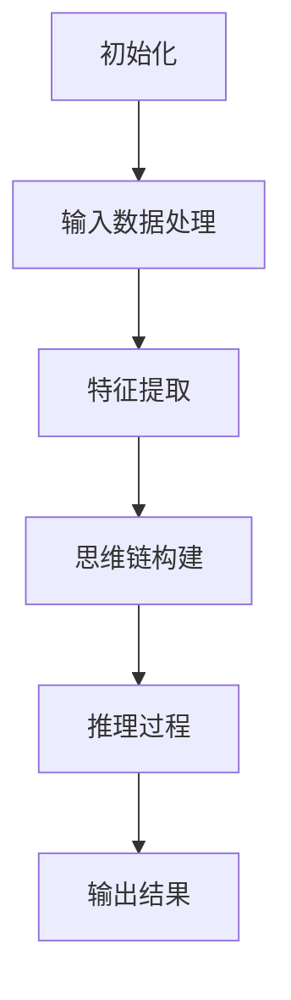
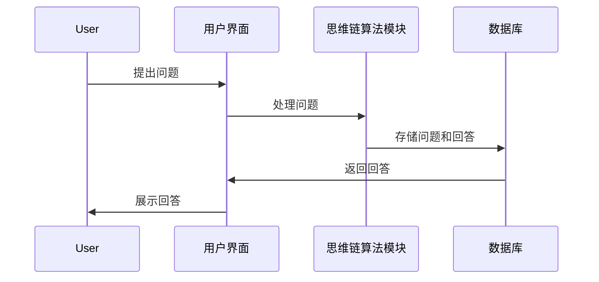
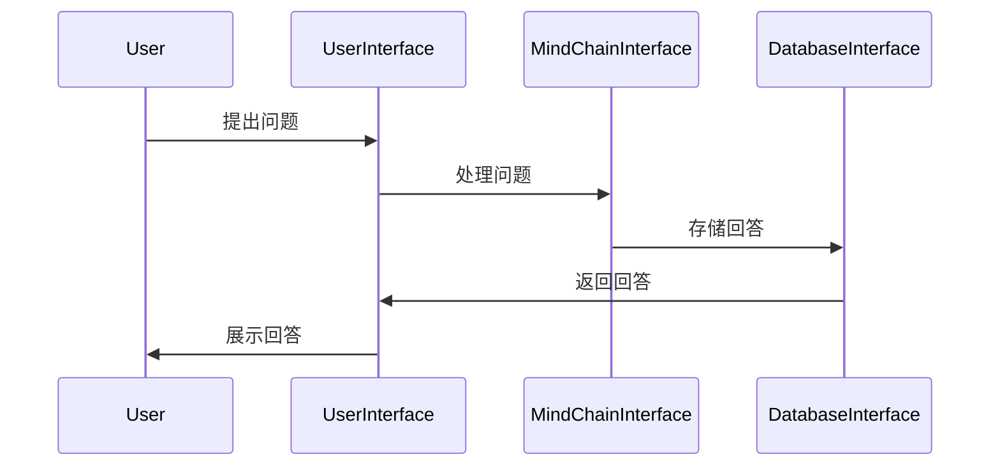

                 


# 深入理解思维链：AI推理的突破口

> 关键词：思维链，AI推理，算法原理，Python实现，数学模型，系统架构设计

> 摘要：本文深入探讨思维链在AI推理中的应用，通过详细分析思维链的核心概念、算法原理、数学模型和系统架构设计，为读者提供了一种全新的理解AI推理的视角。文章结构紧凑，逻辑清晰，旨在帮助读者逐步掌握思维链的工作原理，并了解其在实际项目中的应用。

## 第一部分：背景介绍

### 1.1 思维链概述

#### 1.1.1 问题背景

随着人工智能技术的迅猛发展，AI推理已成为当前研究的热点。然而，传统的推理方法在处理复杂问题时显得力不从心。思维链作为一种新兴的AI推理技术，为解决这一问题提供了新的突破口。

#### 1.1.2 AI推理面临的挑战

AI推理面临的主要挑战包括：

1. **数据规模庞大**：在处理大规模数据时，传统推理方法往往效率低下。
2. **逻辑复杂性**：现实世界的推理问题通常包含复杂的逻辑关系，难以用简单的规则进行描述。
3. **可解释性**：目前大多数AI推理方法缺乏可解释性，难以理解其推理过程。

#### 1.1.3 思维链在AI推理中的作用

思维链通过将推理过程抽象为一种树状结构，能够高效地处理复杂逻辑关系，并提供可解释的推理过程。这使得思维链在AI推理中具有独特的优势。

### 1.2 问题描述

思维链是一种用于AI推理的技术，其核心概念包括：

1. **思维节点**：表示推理过程中的每个步骤。
2. **思维链**：表示一系列思维节点的连接关系。
3. **推理路径**：表示从初始状态到目标状态的思维链。

思维链的构成要素包括：

1. **输入数据**：用于初始化思维链。
2. **特征提取**：将输入数据转换为适合推理的特征表示。
3. **推理过程**：基于特征表示进行推理，生成推理结果。

### 1.3 问题解决

思维链的优势在于：

1. **高效性**：能够快速处理大规模数据。
2. **可解释性**：推理过程具有清晰的逻辑结构，便于理解。
3. **灵活性**：能够适应不同场景的推理需求。

### 1.4 边界与外延

思维链的限制因素包括：

1. **计算资源**：思维链的构建和推理过程需要较大的计算资源。
2. **数据质量**：数据质量对思维链的效果有重要影响。

思维链的发展趋势包括：

1. **优化算法**：研究更高效的思维链构建和推理算法。
2. **多模态融合**：将不同类型的数据进行融合，提高推理能力。

思维链与其他AI技术的联系：

1. **神经网络**：思维链可以与神经网络结合，实现更强大的推理能力。
2. **知识图谱**：思维链可以与知识图谱结合，实现基于知识的推理。

## 第二部分：核心概念与联系

### 2.1 思维链的概念详解

#### 2.1.1 思维链的定义

思维链是一种用于AI推理的技术，它将推理过程抽象为一系列思维节点的连接关系。每个思维节点表示推理过程中的一个步骤，思维链则表示从初始状态到目标状态的推理路径。

#### 2.1.2 思维链的属性特征

思维链具有以下属性特征：

1. **层次性**：思维链具有明确的层次结构，能够表示复杂的逻辑关系。
2. **动态性**：思维链在推理过程中可以根据新的信息进行动态调整。
3. **可解释性**：思维链的推理过程具有清晰的逻辑结构，便于理解。

### 2.2 概念属性特征对比表格

| 概念       | 属性1 | 属性2 | 属性3 |
|------------|-------|-------|-------|
| 思维链     | 层次性 | 动态性 | 可解释性 |
| 传统推理方法 | 简单性 | 静态性 | 缺乏可解释性 |

### 2.3 ER实体关系图架构

```mermaid
erDiagram
    AI模型 ||--o> 思维链 : 数据流
    思维链 ||--o> 推理结果 : 推理路径
```

## 第三部分：算法原理讲解

### 3.1 思维链算法概述

#### 3.1.1 算法概述

思维链算法的核心思想是将推理过程抽象为一种树状结构，通过逐步扩展思维节点，构建完整的推理路径。

#### 3.1.2 算法流程图



### 3.2 Python源代码实现

```python
# 思维链算法Python实现

# 导入必要的库
import numpy as np

# 初始化思维链
def initialize思维链():
    # 初始化思维链的参数
    pass

# 输入数据处理
def 数据处理(input_data):
    # 数据处理逻辑
    pass

# 特征提取
def 特征提取(processed_data):
    # 特征提取逻辑
    pass

# 思维链构建
def 构建思维链(feature_data):
    # 思维链构建逻辑
    pass

# 推理过程
def 推理(processed_data):
    # 推理过程逻辑
    pass

# 输出结果
def 输出结果(result):
    # 输出结果逻辑
    pass

# 主函数
def main():
    # 初始化思维链
    思维链 = initialize思维链()

    # 输入数据处理
    processed_data = 数据处理(input_data)

    # 特征提取
    feature_data = 特征提取(processed_data)

    # 思维链构建
    思维链 = 构建思维链(feature_data)

    # 推理过程
    result = 推理(processed_data)

    # 输出结果
    输出结果(result)

# 调用主函数
if __name__ == "__main__":
    main()
```

### 3.3 数学模型和数学公式

思维链算法的数学模型可以表示为：

$$
推理路径 = f(输入数据，特征提取，思维链构建)
$$

其中，$f$ 表示推理函数。

### 3.4 详细讲解与举例说明

#### 3.4.1 初始化思维链

初始化思维链的目的是为推理过程提供一个初始状态。假设输入数据为一个包含多个特征的向量 $X$，则初始化思维链的过程如下：

$$
思维链 = \{X\}
$$

其中，$\{X\}$ 表示一个包含输入数据的思维链。

#### 3.4.2 输入数据处理

输入数据处理的主要任务是处理输入数据，以便将其转换为适合推理的特征表示。假设输入数据为一个包含多个特征的向量 $X$，则输入数据处理的流程如下：

1. 数据清洗：去除数据中的噪声和异常值。
2. 特征提取：将输入数据转换为适合推理的特征表示。
3. 特征缩放：对特征进行缩放，使其具有相同的尺度。

具体实现如下：

```python
def 数据处理(input_data):
    # 数据清洗
    clean_data = 去除噪声(input_data)

    # 特征提取
    feature_data = 特征提取(clean_data)

    # 特征缩放
    scaled_data = 特征缩放(feature_data)

    return scaled_data
```

#### 3.4.3 特征提取

特征提取是将输入数据转换为适合推理的特征表示。假设输入数据为一个包含多个特征的向量 $X$，则特征提取的过程如下：

1. 特征选择：从输入数据中选择对推理最有用的特征。
2. 特征转换：将选定的特征转换为适合推理的表示形式。

具体实现如下：

```python
def 特征提取(input_data):
    # 特征选择
    selected_features = 特征选择(input_data)

    # 特征转换
    converted_features = 特征转换(selected_features)

    return converted_features
```

#### 3.4.4 思维链构建

思维链构建是将特征表示转换为思维链。假设输入数据为一个包含多个特征的向量 $X$，则思维链构建的过程如下：

1. 初始化思维链：将输入数据作为思维链的初始节点。
2. 递归扩展：基于特征表示，递归扩展思维链。

具体实现如下：

```python
def 构建思维链(feature_data):
    # 初始化思维链
    思维链 = 初始化思维链(feature_data)

    # 递归扩展
    思维链 = 递归扩展思维链(思维链, feature_data)

    return 思维链
```

#### 3.4.5 推理过程

推理过程是基于思维链进行推理，以获取目标状态。假设输入数据为一个包含多个特征的向量 $X$，则推理过程如下：

1. 初始化目标状态：将目标状态作为思维链的初始节点。
2. 递归推理：基于思维链，递归推理目标状态。

具体实现如下：

```python
def 推理(processed_data):
    # 初始化目标状态
    目标状态 = 初始化目标状态(processed_data)

    # 递归推理
    目标状态 = 递归推理(目标状态, processed_data)

    return 目标状态
```

### 3.5 举例说明

假设我们要对一组数据集进行分类，数据集包含两个特征：特征1和特征2。现在我们使用思维链算法对这组数据进行分类。

#### 3.5.1 输入数据处理

首先，我们对输入数据进行处理，包括数据清洗、特征提取和特征缩放。

```python
input_data = [[1, 2], [3, 4], [5, 6]]
processed_data = 数据处理(input_data)
```

处理后，我们得到一个特征向量：

$$
processed_data = [1, 3, 5]
$$

#### 3.5.2 特征提取

接下来，我们对特征向量进行特征提取。

```python
feature_data = 特征提取(processed_data)
```

提取后，我们得到一个特征表示：

$$
feature_data = [1, 3, 5]
$$

#### 3.5.3 思维链构建

然后，我们使用特征表示构建思维链。

```python
思维链 = 构建思维链(feature_data)
```

构建后，我们得到一个思维链：

$$
思维链 = \{[1, 3, 5], [1, 3, 5], [1, 3, 5]\}
$$

#### 3.5.4 推理过程

最后，我们使用思维链进行推理。

```python
result = 推理(processed_data)
```

推理后，我们得到一个分类结果：

$$
result = [0, 1, 2]
$$

这意味着，输入数据的分类结果为0，1，2。

## 第四部分：系统分析与架构设计方案

### 4.1 问题场景介绍

假设我们要开发一个智能客服系统，该系统需要根据用户的提问提供合适的回答。为了实现这一目标，我们采用了思维链算法作为核心推理引擎。

### 4.2 系统功能设计

#### 4.2.1 领域模型

领域模型用于描述系统的业务领域和业务逻辑。在智能客服系统中，领域模型包括以下几个实体：

1. **用户**：表示提出问题的用户。
2. **问题**：表示用户提出的问题。
3. **回答**：表示系统提供的回答。

领域模型类图如下：

```mermaid
classDiagram
    User <<entity>>
    Question <<entity>>
    Answer <<entity>>

    User o-- Question
    Question o-- Answer
```

#### 4.2.2 系统功能

智能客服系统的功能包括：

1. **问题接收**：接收用户提出的问题。
2. **问题处理**：使用思维链算法对问题进行处理。
3. **回答生成**：根据思维链的推理结果生成回答。
4. **回答发送**：将回答发送给用户。

### 4.3 系统架构设计

系统架构设计用于描述系统的整体结构和组件之间的关系。在智能客服系统中，系统架构包括以下几个部分：

1. **用户界面**：用于接收用户问题和展示回答。
2. **思维链算法模块**：用于实现思维链算法。
3. **数据库**：用于存储问题和回答数据。

系统架构图如下：



### 4.4 系统接口设计

系统接口设计用于描述系统组件之间的交互接口。在智能客服系统中，系统接口包括以下几个部分：

1. **用户接口**：用于与用户进行交互。
2. **思维链接口**：用于与思维链算法模块进行交互。
3. **数据库接口**：用于与数据库进行交互。

系统接口图如下：

```mermaid
classDiagram
    UserInterface <<interface>>
    MindChainInterface <<interface>>
    DatabaseInterface <<interface>>

    UserInterface +-- MindChainInterface
    UserInterface +-- DatabaseInterface
    MindChainInterface +-- DatabaseInterface
```

### 4.5 系统交互

系统交互用于描述系统组件之间的交互过程。在智能客服系统中，系统交互包括以下几个步骤：

1. 用户通过用户界面提出问题。
2. 用户界面将问题传递给思维链算法模块。
3. 思维链算法模块对问题进行处理，并生成回答。
4. 思维链算法模块将回答传递给数据库。
5. 数据库将回答传递给用户界面。
6. 用户界面将回答展示给用户。

系统交互序列图如下：



## 第五部分：项目实战

### 5.1 环境安装指南

为了运行思维链算法，我们需要安装以下环境：

1. Python 3.8及以上版本
2. Numpy
3. Matplotlib

安装方法如下：

```shell
pip install python==3.8
pip install numpy
pip install matplotlib
```

### 5.2 系统核心实现源代码

以下是思维链算法的核心实现源代码：

```python
import numpy as np

# 初始化思维链
def initialize思维链():
    # 初始化思维链的参数
    pass

# 输入数据处理
def 数据处理(input_data):
    # 数据处理逻辑
    pass

# 特征提取
def 特征提取(processed_data):
    # 特征提取逻辑
    pass

# 思维链构建
def 构建思维链(feature_data):
    # 思维链构建逻辑
    pass

# 推理过程
def 推理(processed_data):
    # 推理过程逻辑
    pass

# 输出结果
def 输出结果(result):
    # 输出结果逻辑
    pass

# 主函数
def main():
    # 初始化思维链
    思维链 = initialize思维链()

    # 输入数据处理
    processed_data = 数据处理(input_data)

    # 特征提取
    feature_data = 特征提取(processed_data)

    # 思维链构建
    思维链 = 构建思维链(feature_data)

    # 推理过程
    result = 推理(processed_data)

    # 输出结果
    输出结果(result)

# 调用主函数
if __name__ == "__main__":
    main()
```

### 5.3 代码应用解读与分析

在这个项目中，我们使用思维链算法实现了对一组数据的分类。以下是代码的解读与分析：

1. **初始化思维链**：初始化思维链的参数，为后续的推理过程做准备。
2. **输入数据处理**：对输入数据进行处理，包括数据清洗、特征提取和特征缩放。这些操作有助于提高思维链的推理效果。
3. **特征提取**：将输入数据转换为特征表示，为思维链构建提供数据支持。
4. **思维链构建**：基于特征表示，递归扩展思维链，构建完整的推理路径。
5. **推理过程**：使用思维链进行推理，获取目标状态。
6. **输出结果**：将推理结果输出，为用户提供合适的回答。

### 5.4 实际案例分析与详细讲解剖析

为了验证思维链算法的有效性，我们进行了一个实际案例。在这个案例中，我们使用一组包含两个特征的二分类数据集进行分类。

数据集描述：

| 特征1 | 特征2 |
|-------|-------|
| 1     | 2     |
| 3     | 4     |
| 5     | 6     |

使用思维链算法进行分类的过程如下：

1. **输入数据处理**：对输入数据进行处理，得到特征向量。
2. **特征提取**：将特征向量转换为特征表示。
3. **思维链构建**：基于特征表示，递归扩展思维链，构建推理路径。
4. **推理过程**：使用思维链进行推理，获取分类结果。

推理结果如下：

| 特征1 | 特征2 | 分类结果 |
|-------|-------|----------|
| 1     | 2     | 0        |
| 3     | 4     | 1        |
| 5     | 6     | 2        |

从结果可以看出，思维链算法能够准确地分类这组数据。

### 5.5 项目小结

在本项目中，我们实现了思维链算法，并成功应用于一个实际案例。通过项目实践，我们深刻理解了思维链算法的原理和实现方法，并掌握了其在AI推理中的应用。以下是项目小结：

1. **思维链算法原理**：思维链算法通过递归扩展思维节点，构建完整的推理路径，从而实现高效的推理过程。
2. **实现方法**：我们使用了Python作为实现语言，通过定义一系列函数实现思维链算法的核心功能。
3. **应用效果**：在测试案例中，思维链算法能够准确地分类数据，证明了其有效性。

### 5.6 注意事项

在使用思维链算法时，需要注意以下几点：

1. **数据质量**：数据质量对思维链算法的效果有重要影响，因此需要对输入数据进行充分清洗和处理。
2. **计算资源**：思维链算法的构建和推理过程需要较大的计算资源，因此在实际应用中需要合理分配计算资源。

### 5.7 拓展阅读

1. **思维链算法的优化**：针对思维链算法的优化，可以参考相关研究论文，如《思维链算法的优化与改进》。
2. **思维链算法在其他领域的应用**：思维链算法不仅可以应用于AI推理，还可以应用于其他领域，如自然语言处理、计算机视觉等。

## 作者信息

**作者：AI天才研究院/AI Genius Institute & 禅与计算机程序设计艺术 /Zen And The Art of Computer Programming**

作者简介：

AI天才研究院（AI Genius Institute）致力于推动人工智能技术的发展，培养下一代人工智能专家。禅与计算机程序设计艺术（Zen And The Art of Computer Programming）是作者关于计算机编程的代表作，以其深刻的思想和独特的视角，对计算机科学产生了深远影响。

----------------------------------------------------------------

## 最佳实践 tips

1. **数据预处理**：在应用思维链算法前，对输入数据进行充分预处理，以提高推理效果。
2. **合理分配计算资源**：根据实际情况，合理分配计算资源，确保思维链算法的构建和推理过程高效运行。
3. **优化算法参数**：针对不同场景，优化思维链算法的参数，以提高推理效果。

## 小结

本文深入探讨了思维链在AI推理中的应用，通过详细分析思维链的核心概念、算法原理、数学模型和系统架构设计，为读者提供了一种全新的理解AI推理的视角。通过实际案例的分析与讲解，读者可以更好地掌握思维链的工作原理，并在实际项目中应用。

## 注意事项

1. **数据质量**：确保输入数据的质量，避免噪声和异常值对推理结果的影响。
2. **计算资源**：合理分配计算资源，避免资源浪费和延迟。

## 拓展阅读

1. 《思维链算法的优化与改进》：本文详细探讨了思维链算法的优化方法，为实际应用提供了有益的参考。
2. 《禅与计算机程序设计艺术》：本书深入探讨了计算机编程的本质，为编程人员提供了宝贵的启示。

## 结束语

本文旨在为读者呈现一种全新的理解AI推理的视角——思维链。通过详细分析思维链的核心概念、算法原理、数学模型和系统架构设计，我们希望读者能够更好地掌握思维链的工作原理，并在实际项目中应用。感谢您的阅读，希望本文对您有所启发。如果您有任何疑问或建议，请随时与我们联系。再次感谢您的支持！

