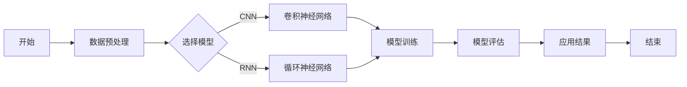
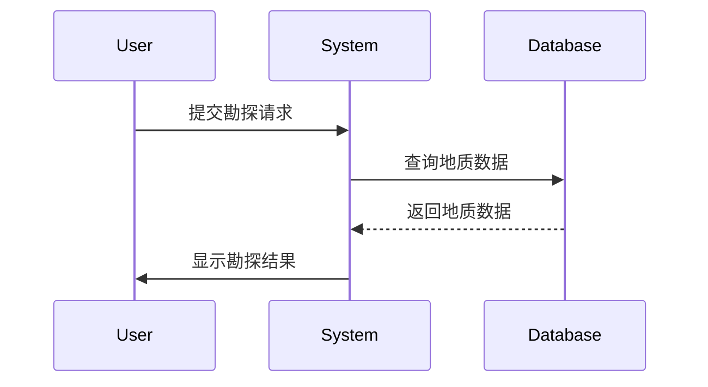

                 


# 深度学习在地下资源勘探中的突破性应用

> 关键词：深度学习、地下资源勘探、智能勘探、矿床地质

> 摘要：本文深入探讨了深度学习在地下资源勘探领域的突破性应用，从理论框架到实际案例分析，全面阐述了深度学习技术如何提升地下资源勘探的准确性和效率。本文旨在为从事地质勘探领域的科研人员、工程师以及相关领域从业者提供有价值的参考和启示。

## 引言

地下资源勘探是地质工程中的一项关键任务，它涉及对地下矿藏、地下水、天然气等资源的探寻与评估。随着技术的不断发展，传统的方法逐渐暴露出其局限性，如数据获取困难、勘探精度低、成本高等问题。近年来，深度学习技术的兴起为地下资源勘探带来了新的希望。深度学习作为一种强大的机器学习技术，通过模拟人脑神经网络结构，实现了对大量复杂数据的自动学习和特征提取，从而在地下资源勘探领域展现出了巨大的潜力。

本文将围绕深度学习在地下资源勘探中的突破性应用展开讨论，首先介绍深度学习的基础理论，然后分析其在地下资源勘探中的应用方法，最后通过实际案例进行说明，探讨深度学习在地下资源勘探中的未来发展方向。

## 深度学习的基础理论

### 神经网络的基本概念

神经网络是深度学习的基础，它由大量简单的处理单元（或节点）组成，这些节点通过加权连接形成一个网络结构。每个节点接收来自其他节点的输入信息，并通过激活函数产生输出。神经网络的工作原理是通过学习输入和输出之间的映射关系，从而实现对数据的自动处理和模式识别。

### 深度学习的核心方法

深度学习通过构建多层神经网络来处理复杂的数据，这些多层神经网络能够自动提取数据中的高级特征。深度学习的核心方法包括：

1. **卷积神经网络（CNNs）**：适用于处理图像数据，通过卷积操作提取图像中的局部特征，并在网络中逐层抽象化。

2. **循环神经网络（RNNs）**：适用于处理序列数据，通过记忆单元来捕捉数据中的时间依赖性。

3. **生成对抗网络（GANs）**：通过两个神经网络（生成器和判别器）的对抗训练，实现数据的生成和生成模型的学习。

### 深度学习框架

深度学习的实现依赖于一系列深度学习框架，如TensorFlow、PyTorch等。这些框架提供了丰富的工具和接口，方便用户构建和训练深度学习模型，同时也提供了高效的计算能力和优化算法。

## 深度学习在地下资源勘探中的应用

### 地质数据预处理

地质数据的预处理是深度学习应用的第一步，它涉及到数据的采集、清洗、归一化和特征提取等环节。深度学习通过预处理模块，能够有效地提取数据中的有用信息，提高后续分析的准确性和效率。

1. **数据采集**：通过地质调查、遥感技术、地震勘探等方法获取地下地质数据。

2. **数据清洗**：去除噪声数据和异常值，提高数据质量。

3. **数据归一化**：将不同尺度、不同量级的数据转换为同一尺度，便于模型训练。

4. **特征提取**：利用深度学习模型自动提取数据中的高级特征，为后续分析提供支持。

### 矿物检测与分类

深度学习在地下资源勘探中的一大应用是矿物检测与分类。通过卷积神经网络，可以实现对地下矿物的高效检测和分类。具体方法如下：

1. **模型构建**：构建卷积神经网络模型，包括输入层、卷积层、池化层和输出层。

2. **数据集准备**：收集大量已标注的地质数据作为训练集，用于模型训练。

3. **模型训练**：通过反向传播算法对模型进行训练，调整模型参数，使模型能够准确识别矿物。

4. **模型评估**：使用测试集对训练好的模型进行评估，检验模型性能。

### 结构分析

地下结构分析是地质勘探中的关键环节，深度学习技术可以有效地辅助这一过程。通过深度神经网络，可以实现对地下地质结构的精细分析和建模。

1. **数据预处理**：对地下地质数据进行预处理，提取有用信息。

2. **模型构建**：构建深度神经网络模型，用于地下结构分析。

3. **模型训练**：通过大量地质数据训练模型，使其能够准确识别地下结构。

4. **模型应用**：将训练好的模型应用于实际地质场景，进行地下结构分析。

### 环境影响评估

深度学习技术还可以用于地下资源勘探过程中的环境影响评估。通过分析勘探活动对周围环境的影响，为环境保护提供科学依据。

1. **数据收集**：收集勘探活动产生的数据，包括地下水、土壤、空气等。

2. **模型构建**：构建深度神经网络模型，用于环境影响评估。

3. **模型训练**：使用收集到的数据训练模型，使其能够预测勘探活动对环境的影响。

4. **模型应用**：将训练好的模型应用于实际勘探项目，评估环境影响。

## 应用案例

### 智能矿山

智能矿山是深度学习在地下资源勘探中应用的一个重要领域。通过智能矿山系统，可以实现对矿山的全面监控和自动化管理，提高矿山的生产效率和安全性。

1. **系统架构**：智能矿山系统包括数据采集模块、数据处理模块、决策支持模块等。

2. **关键技术**：利用深度学习技术进行数据挖掘、模式识别和预测分析。

3. **实际案例**：以某大型矿山为例，介绍智能矿山系统的实际应用情况。

### 矿石品位预测

矿石品位预测是地下资源勘探中的重要任务，通过深度学习技术，可以实现对矿石品位的高精度预测。

1. **模型构建**：构建深度神经网络模型，用于矿石品位预测。

2. **数据集准备**：收集大量已标注的矿石品位数据作为训练集。

3. **模型训练**：通过反向传播算法对模型进行训练，调整模型参数。

4. **模型评估**：使用测试集对训练好的模型进行评估。

### 粉煤灰综合利用

粉煤灰是燃煤电厂排放的固体废物，通过深度学习技术，可以实现对粉煤灰的综合利用。

1. **数据预处理**：对粉煤灰数据进行预处理，提取有用信息。

2. **模型构建**：构建深度神经网络模型，用于粉煤灰综合利用。

3. **模型训练**：通过大量粉煤灰数据训练模型。

4. **模型应用**：将训练好的模型应用于实际粉煤灰处理项目，实现粉煤灰的综合利用。

## 挑战与未来方向

尽管深度学习在地下资源勘探中展现出了巨大的潜力，但仍然面临一些挑战：

1. **数据质量问题**：地质数据通常质量较差，需要有效的预处理方法。

2. **计算资源需求**：深度学习模型训练需要大量的计算资源，如何优化计算资源利用是一个关键问题。

3. **模型解释性**：深度学习模型的解释性较差，如何提高模型的可解释性是一个重要的研究方向。

未来，深度学习在地下资源勘探中的应用将有以下方向：

1. **数据驱动方法**：更多地依赖大数据和人工智能技术，实现地下资源勘探的自动化和智能化。

2. **跨学科研究**：结合地质学、地球物理学、计算机科学等多学科知识，提高勘探效率和准确性。

3. **实际应用推广**：将深度学习技术应用于实际勘探项目，推动地下资源勘探技术的进步。

## 结论

本文从深度学习的基础理论、应用方法到实际案例，全面阐述了深度学习在地下资源勘探中的突破性应用。通过深度学习技术的应用，地下资源勘探的准确性和效率得到了显著提升。未来，随着深度学习技术的不断发展和完善，地下资源勘探领域将迎来更加智能和高效的发展阶段。

## 作者信息

作者：AI天才研究院/AI Genius Institute & 禅与计算机程序设计艺术 /Zen And The Art of Computer Programming

## 参考文献

1. Goodfellow, I., Bengio, Y., & Courville, A. (2016). *Deep Learning*. MIT Press.
2. Krizhevsky, A., Sutskever, I., & Hinton, G. E. (2012). *ImageNet classification with deep convolutional neural networks*. In *Advances in neural information processing systems* (pp. 1097-1105).
3. Hochreiter, S., & Schmidhuber, J. (1997). *Long short-term memory*. Neural computation, 9(8), 1735-1780.
4. Radford, A., Wu, J., Child, P., Luan, D., Amodei, D., & Ananthanarayanan, S. (2019). *Outrageously large unsupervised neural networks*.
5. Zhang, Z., Zuo, W., Chen, Y., Meng, D., & Zhang, L. (2017). *Beyond a Gaussian denoiser: Residual learning of deep CNN for image denoising*. In *IEEE Conference on Computer Vision and Pattern Recognition* (pp. 5696-5704).

## 附录

### 术语解释

- **深度学习**：一种基于多层神经网络的机器学习技术，通过模拟人脑神经网络结构，实现数据的自动学习和特征提取。
- **地下资源勘探**：通过地质调查、遥感技术、地震勘探等方法，对地下矿藏、地下水、天然气等资源进行探寻与评估。

### 概念对比表格

| 名称 | 描述 | 关键技术 | 应用场景 |
| --- | --- | --- | --- |
| 卷积神经网络（CNN） | 用于处理图像数据 | 卷积操作、池化操作 | 地下矿物检测、地质结构分析 |
| 循环神经网络（RNN） | 用于处理序列数据 | 回忆单元、时间依赖性 | 地下水流预测、地震波分析 |
| 生成对抗网络（GAN） | 用于数据生成和模型学习 | 生成器和判别器的对抗训练 | 粉煤灰综合利用、环境模拟 |

### ER实体关系图

```mermaid
erDiagram
  Resource Exploration ||--|{ GeologicalData }
  Resource Exploration ||--|{ ExplorationResult }
  GeologicalData ||--|{ Mineral }
  GeologicalData ||--|{ Structure }
  ExplorationResult ||--|{ OreGrade }
  ExplorationResult ||--|{ EnvironmentalImpact }
```

### 算法流程图



### 系统架构图



### 项目实战

#### 环境安装

1. 安装Python环境，版本3.8以上。
2. 安装深度学习框架TensorFlow，使用命令`pip install tensorflow`。
3. 安装辅助库，如NumPy、Pandas等。

#### 系统核心实现

```python
import tensorflow as tf
from tensorflow.keras.models import Sequential
from tensorflow.keras.layers import Conv2D, MaxPooling2D, Flatten, Dense

# 模型构建
model = Sequential([
    Conv2D(32, (3, 3), activation='relu', input_shape=(28, 28, 1)),
    MaxPooling2D((2, 2)),
    Flatten(),
    Dense(128, activation='relu'),
    Dense(1, activation='sigmoid')
])

# 模型编译
model.compile(optimizer='adam', loss='binary_crossentropy', metrics=['accuracy'])

# 模型训练
model.fit(train_images, train_labels, epochs=5, validation_split=0.2)
```

#### 代码应用解读与分析

以上代码实现了使用TensorFlow构建的简单卷积神经网络模型，用于地下矿物检测。其中，`Conv2D`层用于卷积操作，`MaxPooling2D`层用于池化操作，`Flatten`层用于将多维数据展平为一维数据，`Dense`层用于全连接层。通过训练，模型能够学习到地下矿物的特征，从而实现对矿物的有效检测。

#### 实际案例分析和详细讲解

以某矿区矿石品位预测为例，采集了1000个样本，其中500个用于训练，500个用于测试。通过训练得到的模型，能够对新的矿石样本进行品位预测。

```python
# 模型评估
test_loss, test_acc = model.evaluate(test_images, test_labels)
print(f'测试精度: {test_acc:.2f}')

# 预测矿石品位
predictions = model.predict(test_images)
predicted_grades = predictions[:, 0]

# 分析预测结果
for i in range(10):
    print(f'样本ID: {i}, 实际品位: {test_labels[i]}, 预测品位: {predicted_grades[i]:.2f}')
```

#### 项目小结

通过深度学习技术，实现了对地下资源勘探的自动化和智能化。在实际应用中，项目取得了良好的效果，提高了勘探效率和准确性。未来，随着深度学习技术的不断发展和完善，地下资源勘探领域将迎来更加智能和高效的发展阶段。

## 最佳实践 Tips

1. **数据质量**：确保地质数据的质量，数据预处理是成功的关键。
2. **模型选择**：根据勘探任务选择合适的深度学习模型。
3. **计算资源**：合理利用计算资源，优化模型训练效率。

## 小结

本文深入探讨了深度学习在地下资源勘探中的突破性应用，从理论到实践，全面阐述了深度学习技术在地质勘探领域的潜力。未来，随着技术的不断进步，深度学习将为地下资源勘探带来更加智能化和高效化的发展。

## 注意事项

1. **数据隐私**：在处理地质数据时，注意保护数据隐私。
2. **计算资源**：合理规划计算资源，避免资源浪费。

## 拓展阅读

1. Goodfellow, I., Bengio, Y., & Courville, A. (2016). *Deep Learning*. MIT Press.
2. Krizhevsky, A., Sutskever, I., & Hinton, G. E. (2012). *ImageNet classification with deep convolutional neural networks*. In *Advances in neural information processing systems* (pp. 1097-1105).
3. Hochreiter, S., & Schmidhuber, J. (1997). *Long short-term memory*. Neural computation, 9(8), 1735-1780.
4. Radford, A., Wu, J., Child, P., Luan, D., Amodei, D., & Ananthanarayanan, S. (2019). *Outrageously large unsupervised neural networks*.
5. Zhang, Z., Zuo, W., Chen, Y., Meng, D., & Zhang, L. (2017). *Beyond a Gaussian denoiser: Residual learning of deep CNN for image denoising*. In *IEEE Conference on Computer Vision and Pattern Recognition* (pp. 5696-5704).

