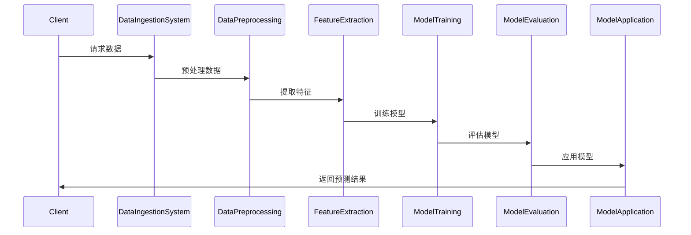
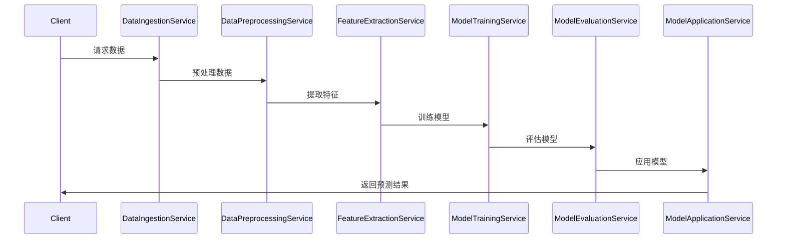
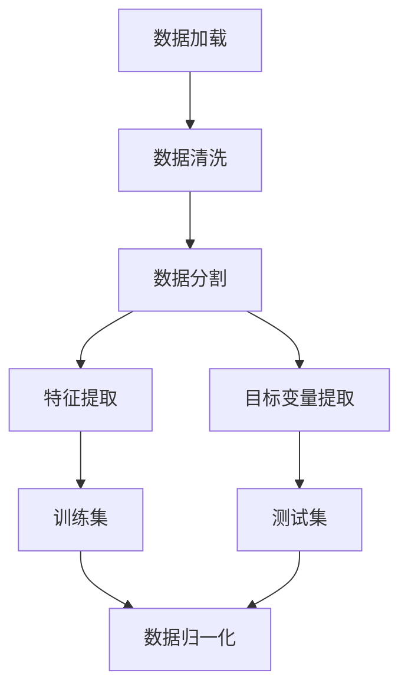
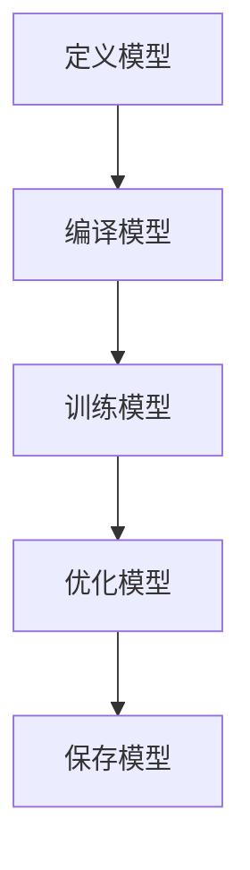
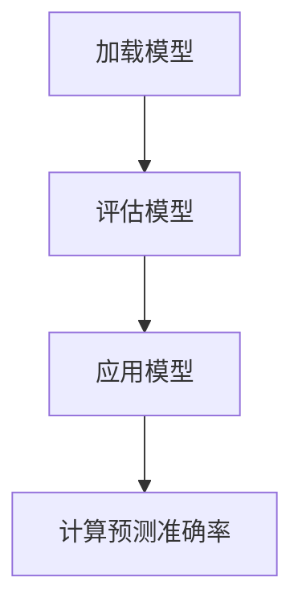

                 

### 文章标题

# 深度学习在天文学研究中的创新应用

> 关键词：深度学习、天文学、图像处理、数据挖掘、天文数据

> 摘要：本文将探讨深度学习在天文学研究中的应用，详细分析其背景、核心概念、算法原理以及实际应用案例。深度学习作为一种强大的机器学习技术，正逐渐改变天文学研究的面貌，从数据处理到天文现象识别，深度学习都展现出其独特的优势。本文旨在通过一系列逻辑清晰的步骤，帮助读者了解深度学习如何在天文学中发挥重要作用，并展望其未来的发展方向。

### 目录大纲

1. **背景介绍**
   - **1.1 天文学与深度学习的基本概念**
     - 1.1.1 天文学简介
     - 1.1.2 深度学习简介
     - 1.1.3 深度学习在天文学研究中的潜在价值
   - **1.2 深度学习在天文学研究中的应用现状**
     - 1.2.1 深度学习在天文学研究中的应用领域
     - 1.2.2 已有研究案例介绍

2. **核心概念与联系**
   - **2.1 深度学习基本概念**
     - 2.1.1 神经网络
     - 2.1.2 深度学习模型
     - 2.1.3 深度学习优化方法
   - **2.2 天文学研究中的核心概念**
     - 2.2.1 天体物理概念
     - 2.2.2 天文学观测方法
     - 2.2.3 天文数据特性
   - **2.3 深度学习在天文学研究中的联系**
     - 2.3.1 深度学习与天文学研究的结合点
     - 2.3.2 深度学习在天文学研究中的挑战与对策

3. **算法原理讲解**
   - **3.1 深度学习算法原理**
     - 3.1.1 卷积神经网络（CNN）
     - 3.1.2 循环神经网络（RNN）
     - 3.1.3 生成对抗网络（GAN）
   - **3.2 深度学习在天文学研究中的算法应用**
     - 3.2.1 天体图像处理
     - 3.2.2 天体分类与识别
     - 3.2.3 天文数据挖掘

4. **系统分析与架构设计方案**
   - **4.1 天文学深度学习系统介绍**
     - 4.1.1 系统需求分析
     - 4.1.2 系统架构设计
   - **4.2 系统架构设计**
     - 4.2.1 领域模型设计
     - 4.2.2 系统架构设计
     - 4.2.3 系统接口设计
     - 4.2.4 系统交互设计

5. **项目实战**
   - **5.1 实战环境准备**
     - 5.1.1 软件与硬件环境
     - 5.1.2 数据集获取
   - **5.2 系统核心实现**
     - 5.2.1 数据预处理
     - 5.2.2 模型训练与优化
     - 5.2.3 模型评估与应用

6. **最佳实践与拓展阅读**
   - **6.1 最佳实践**
   - **6.2 小结**
   - **6.3 注意事项**
   - **6.4 拓展阅读**

### 1.1 天文学与深度学习的基本概念

#### 1.1.1 天文学简介

天文学是研究宇宙中的天体、现象和规律的学科。它的历史可以追溯到古代，当时的观测工具非常简陋，但人们已经开始探索宇宙的奥秘。随着科技的进步，特别是望远镜的发明和改进，天文学取得了巨大的进步。

天文学的研究领域非常广泛，包括天体物理、天文观测、行星科学、宇宙学等。天体物理研究宇宙中各种天体的性质和行为，例如恒星、行星、星系和星系团。天文观测则利用各种仪器和设备来收集天体的数据，这些数据对于理解宇宙的演化过程至关重要。行星科学关注太阳系中的行星和其他天体的组成、结构和动力学。宇宙学研究宇宙的整体性质，包括宇宙的起源、演化和结构。

当前，天文学正面临许多挑战，例如探测暗物质和暗能量，理解宇宙的早期状态，以及发现其他星系和行星。这些问题需要更精确的观测技术和数据分析方法。

#### 1.1.2 深度学习简介

深度学习是机器学习的一个重要分支，它通过模拟人脑神经网络的结构和功能来实现对复杂数据的分析和处理。深度学习的概念最早可以追溯到1980年代，但直到2010年代，随着计算能力的提升和大数据的出现，深度学习才得以迅速发展。

深度学习的基本原理是基于多层神经网络的结构，通过逐层提取数据特征，从而实现从原始数据到高层次的抽象表示。深度学习模型可以分为不同的类型，如卷积神经网络（CNN）、循环神经网络（RNN）、生成对抗网络（GAN）等，每种模型都有其特定的应用场景。

深度学习在图像识别、语音识别、自然语言处理等领域取得了显著的成功。通过训练大量的数据和复杂的模型，深度学习能够从数据中自动学习到有用的特征，从而实现高度自动化的数据处理和分析。

#### 1.1.3 深度学习在天文学研究中的潜在价值

天文学研究中面临着大量的数据，这些数据通常包含复杂的结构和高维信息。传统的方法难以处理这些复杂的数据，而深度学习则为天文学提供了一种新的工具，可以帮助研究者更好地理解和分析这些数据。

首先，深度学习可以用于天体图像处理。通过对大量的天体图像进行训练，深度学习模型可以自动识别和分类不同的天体类型，例如恒星、行星、星系等。这种方法比传统的图像处理方法更准确和高效。

其次，深度学习可以用于天体分类与识别。通过对天文数据进行深度学习训练，模型可以自动发现数据中的模式，从而帮助研究者识别新的天体现象和异常值。这有助于发现以前未知的宇宙现象，例如超新星爆发、快速射电暴等。

最后，深度学习还可以用于天文数据挖掘。通过对天文数据进行深度学习分析，模型可以自动提取有用的信息，例如天体的物理参数、空间分布等。这些信息对于理解宇宙的演化和结构至关重要。

总的来说，深度学习在天文学研究中具有巨大的潜在价值。通过深度学习，研究者可以更有效地处理和分析天文数据，从而推动天文学研究的发展。然而，深度学习也面临一些挑战，例如数据标注问题、计算资源需求等，这些都需要在未来得到解决。

### 1.2 深度学习在天文学研究中的应用现状

#### 1.2.1 深度学习在天文学研究中的应用领域

深度学习在天文学研究中的应用非常广泛，涵盖了从数据处理到天文现象识别的各个方面。以下是几个主要的领域：

1. **天体图像处理**：深度学习可以用于天体图像的去噪、增强和目标检测。通过训练卷积神经网络（CNN）模型，研究者可以自动识别和分类天体图像中的恒星、行星、星系等目标。

2. **天体分类与识别**：深度学习模型可以用于对天文数据进行分类和识别，例如识别不同的星系类型、恒星光谱分类等。这些模型通过学习大量的天文数据，可以自动发现数据中的模式和规律。

3. **天文数据挖掘**：深度学习可以用于从天文数据中提取有用的信息，例如天体的物理参数、空间分布等。通过对大量天文数据进行深度学习分析，模型可以自动发现新的天体现象和异常值。

4. **天文信号处理**：深度学习可以用于分析天文信号，例如射电望远镜接收到的信号，以识别和分类不同的天文事件，例如快速射电暴（FRB）。

#### 1.2.2 已有研究案例介绍

以下是几个深度学习在天文学研究中取得的重要成果：

1. **使用深度学习识别快速射电暴（FRB）**：快速射电暴是宇宙中一种神秘的天体现象，其产生机制尚不清楚。研究者利用深度学习模型，如循环神经网络（RNN），对射电望远镜接收到的数据进行训练和分析，成功识别了多个FRB事件。

2. **利用深度学习进行恒星光谱分类**：恒星光谱分类是天文学中的一个重要任务，它有助于研究恒星的物理性质。研究者利用卷积神经网络（CNN）对恒星光谱图像进行训练，实现了高精度的恒星光谱分类。

3. **深度学习在天体图像去噪与增强中的应用**：天体图像通常受到噪声的干扰，研究者利用深度学习模型，如生成对抗网络（GAN），实现了对天体图像的去噪和增强，从而提高了图像的质量和清晰度。

4. **使用深度学习进行天文数据挖掘**：研究者利用深度学习模型对天文数据进行分析，提取了大量的天体物理信息，例如恒星的运动轨迹、星系的中心质量等。这些信息有助于深入理解宇宙的演化和结构。

总的来说，深度学习在天文学研究中已经取得了显著的成果，通过这些应用，研究者能够更有效地处理和分析天文数据，从而推动天文学研究的发展。未来，随着深度学习技术的不断进步，我们有望看到更多创新的应用案例，进一步提升天文学研究的水平。

### 2.1 深度学习基本概念

#### 2.1.1 神经网络

神经网络（Neural Networks，简称NN）是深度学习的基础，其灵感来源于生物神经元的工作原理。神经网络由大量的节点（或称为神经元）组成，这些节点通过边（或称为连接）相互连接，形成一个复杂的网络结构。每个节点可以接收来自其他节点的输入信号，通过一个非线性激活函数处理后，产生输出信号，传递给下一层的节点。

**基本组成**：

1. **输入层**：接收外部输入信号，例如图像、文本等。
2. **隐藏层**：一层或多层，用于提取和转换输入数据的特征，隐藏层中的神经元接收来自前一层神经元的输入，并传递给下一层。
3. **输出层**：产生最终的输出结果，例如分类标签、数值预测等。

**激活函数**：

神经网络中的每个神经元都会应用一个激活函数，激活函数用于引入非线性因素，使神经网络能够学习复杂的非线性关系。常见的激活函数包括：

- **Sigmoid函数**：将输入值压缩到(0, 1)之间。
- **ReLU函数**：常用于隐藏层，具有简单和计算效率高的特点。
- **Tanh函数**：将输入值压缩到(-1, 1)之间。

**前馈神经网络与反向传播算法**

前馈神经网络（Feedforward Neural Networks）是一种常见的神经网络结构，其中数据从输入层流向输出层，不形成循环。前馈神经网络的工作过程如下：

1. **正向传播**：输入数据通过网络的各层节点，逐层传递，直到输出层得到最终结果。
2. **反向传播**：计算输出结果与实际结果之间的误差，然后反向传播误差，通过梯度下降法更新网络中各层的权重，以最小化误差。

反向传播算法是神经网络训练的核心，它通过计算每个神经元输出误差的梯度，从而调整网络的权重和偏置，以达到更好的拟合效果。

#### 2.1.2 深度学习模型

深度学习模型（Deep Learning Models）是由多个隐藏层组成的神经网络，这些隐藏层允许模型学习更高层次的特征和表示。以下是一些主要的深度学习模型：

1. **卷积神经网络（Convolutional Neural Networks，CNN）**：

卷积神经网络是处理图像数据的一种有效模型，其核心在于卷积层，通过卷积操作提取图像特征。CNN的主要结构包括：

- **卷积层**：通过卷积操作提取图像特征。
- **池化层**：降低特征图的维度，减少计算量和过拟合的风险。
- **全连接层**：用于分类或回归任务。

2. **循环神经网络（Recurrent Neural Networks，RNN）**：

循环神经网络适合处理序列数据，其特点是在时间步之间具有状态循环。RNN的核心结构包括：

- **隐藏状态**：保存前一时刻的信息。
- **门控机制**：包括输入门、遗忘门和输出门，用于控制信息的流动。

RNN的变体包括：

- **长短期记忆网络（Long Short-Term Memory，LSTM）**：解决了RNN的长期依赖问题。
- **门控循环单元（Gated Recurrent Unit，GRU）**：是LSTM的简化版。

3. **生成对抗网络（Generative Adversarial Networks，GAN）**：

生成对抗网络由两个神经网络组成：生成器（Generator）和判别器（Discriminator）。生成器的目标是生成与真实数据相似的数据，而判别器的目标是区分真实数据和生成数据。

GAN的训练过程可以看作是一个对抗游戏，其中生成器和判别器相互竞争，通过不断迭代优化，最终生成器能够生成高质量的数据。

#### 2.1.3 深度学习优化方法

深度学习模型的训练过程中，常用的优化方法包括：

1. **学习率调度**：

学习率是神经网络训练过程中的一个重要参数，它决定了权重更新的步长。常见的学习率调度策略包括：

- **固定学习率**：在整个训练过程中保持不变。
- **指数衰减学习率**：学习率随训练次数的增加而指数衰减。
- **学习率预热**：在训练初期使用较小的学习率，随着训练的进行逐渐增加。

2. **梯度下降法**：

梯度下降法是一种优化方法，用于最小化神经网络的损失函数。它通过计算损失函数关于权重和偏置的梯度，并沿着梯度的反方向更新权重和偏置。

- **随机梯度下降（Stochastic Gradient Descent，SGD）**：在每个样本上计算梯度并更新权重。
- **批量梯度下降（Batch Gradient Descent）**：在所有样本上计算梯度并更新权重。
- **小批量梯度下降（Mini-batch Gradient Descent）**：在部分样本上计算梯度并更新权重，是最常用的方法。

3. **优化算法对比表格**：

| 算法 | 优点 | 缺点 | 应用场景 |
| --- | --- | --- | --- |
| 随机梯度下降 | 计算效率高，适用于大规模数据 | 收敛速度较慢，容易陷入局部最小值 | 大规模数据处理 |
| 批量梯度下降 | 收敛速度较快，全局最优解可能性高 | 计算量大，适用于小规模数据 | 小规模数据处理 |
| 小批量梯度下降 | 平衡计算效率和收敛速度 | 适用于大多数数据集 | 多样化的数据处理 |

通过这些优化方法，可以有效地训练深度学习模型，提高其性能和泛化能力。

### 2.2 天文学研究中的核心概念

#### 2.2.1 天体物理概念

天体物理是研究宇宙中天体的物理性质和行为的学科，它涵盖了从微观的恒星到宏观的星系和宇宙尺度的研究。以下是几个关键的天体物理概念：

1. **星系**：星系是由大量恒星、行星、星云、暗物质等组成的巨大系统。常见的星系类型包括椭圆星系、螺旋星系和不规则星系。

2. **星系团**：星系团是由多个星系通过引力相互作用形成的更大规模的结构。星系团内部存在大量的暗物质，是宇宙中暗物质的主要组成部分。

3. **宇宙背景辐射**：宇宙背景辐射是宇宙早期时期遗留下来的电磁辐射，它是研究宇宙起源和演化的关键证据。宇宙背景辐射的温度约为2.7开尔文，是宇宙微波背景辐射的主要组成部分。

#### 2.2.2 天文学观测方法

天文学观测是通过各种仪器和设备收集宇宙中天体的数据。以下是几种主要的天文学观测方法：

1. **光学观测**：光学观测是利用可见光波段进行观测，常用的仪器包括望远镜、天文台等。光学观测可以用于研究恒星的亮度、颜色和运动等特性。

2. **射电观测**：射电观测是利用射电波段进行观测，通过射电望远镜接收天体发射的无线电信号。射电观测可以用于研究恒星的辐射特性、行星大气层和宇宙中的等离子体。

3. **红外观测**：红外观测是利用红外波段进行观测，通过红外望远镜接收天体的红外辐射。红外观测可以用于研究恒星形成的区域、行星大气层和星际介质。

#### 2.2.3 天文数据特性

天文数据具有一些独特的特性，这些特性对深度学习模型的设计和应用提出了挑战：

1. **数据质量**：天文数据可能受到噪声、模糊和缺失值的干扰。这些数据质量问题需要通过数据预处理方法来解决。

2. **数据维度**：天文数据通常具有高维度，包含大量的特征。高维数据增加了模型的复杂度和训练难度。

3. **数据噪声**：天文数据中存在大量的噪声，这些噪声可能来自观测设备、大气扰动等因素。噪声干扰了数据的真实信息，需要通过去噪方法进行处理。

4. **数据关联性**：天文数据中存在复杂的关联性，不同特征之间可能存在相关性。深度学习模型需要能够捕捉这些关联性，以便更好地进行数据分析和预测。

了解天文学研究中的核心概念和观测方法，有助于深入理解天文数据的特性和挑战，从而为深度学习在天文学中的应用提供理论支持。

### 2.3 深度学习在天文学研究中的联系

#### 2.3.1 深度学习与天文学研究的结合点

深度学习与天文学研究的结合点主要在于数据处理、特征提取和模型优化三个方面。具体来说，深度学习如何与天文学研究相结合，可以概括为以下几点：

1. **数据处理**：

天文学数据通常具有高维度和复杂性，包括大量的特征和变量。深度学习可以通过其强大的数据处理能力，对天文数据进行降维和特征选择，提取出最重要的特征，从而减少数据量，提高模型训练效率。例如，通过使用卷积神经网络（CNN），可以自动提取图像中的空间特征，而不需要手动设计复杂的特征提取算法。

2. **特征提取**：

在天文学研究中，特征提取是一个关键步骤，它决定了模型能否准确识别和分类天体现象。深度学习模型可以通过多层神经网络结构，逐层提取高层次的抽象特征，这些特征对于天体分类和识别任务至关重要。例如，通过使用循环神经网络（RNN）或长短期记忆网络（LSTM），可以处理时间序列数据，提取出天体的动态特征。

3. **模型优化**：

深度学习模型通常需要通过优化算法进行训练，以达到最佳的拟合效果。在天文学研究中，模型优化方法可以帮助研究者调整模型的参数，提高模型的准确性和泛化能力。例如，通过使用学习率调度策略和不同优化算法（如随机梯度下降（SGD）、Adam等），可以加快模型收敛速度，减小过拟合现象。

#### 2.3.2 深度学习在天文学研究中的挑战与对策

尽管深度学习在天文学研究中展现出巨大的潜力，但其应用也面临一些挑战。以下是一些主要挑战及其对策：

1. **数据标注问题**：

在天文学研究中，标注高质量的数据集是一个重要但耗时的任务。由于天体现象的多样性和复杂性，标注数据中的错误可能影响模型的性能。对策是使用半监督学习和迁移学习技术，通过利用已有的标注数据和未标注数据，自动生成高质量的标注。

2. **计算资源需求**：

深度学习模型通常需要大量的计算资源进行训练和推理，尤其是在处理高维度天文数据时。对策是使用分布式计算和云计算平台，如Google Colab、AWS等，以加速模型的训练和部署过程。

3. **模型解释性**：

深度学习模型，尤其是黑盒模型，难以解释其内部工作机制和决策过程。这在天文学研究中可能是一个问题，因为研究者需要理解模型如何识别和分类天体现象。对策是开发可解释的深度学习模型，如基于规则的可解释模型，以及可视化技术，以帮助研究者理解模型的决策过程。

4. **数据隐私问题**：

天文数据通常包含敏感信息，例如星系的坐标、光谱数据等。对策是采用数据隐私保护技术，如数据加密和匿名化，以确保数据的安全和隐私。

通过解决这些挑战，深度学习可以更好地应用于天文学研究，推动天文学领域的进步和发展。

### 3.1 深度学习算法原理

#### 3.1.1 卷积神经网络（CNN）

卷积神经网络（Convolutional Neural Networks，CNN）是一种专门用于处理图像数据的深度学习模型，其核心思想是通过卷积操作提取图像特征。CNN具有以下主要组成部分：

1. **卷积层**：

卷积层是CNN中最基本的层，通过卷积操作从输入图像中提取特征。卷积操作通过滑动窗口（卷积核）在输入图像上滑动，并与图像局部区域的值进行点积，然后通过一个激活函数（如ReLU）产生输出。

$$
\text{output}_{ij} = \sum_{k=1}^{n} w_{ik} \cdot \text{input}_{kj} + b_j
$$

其中，$w_{ik}$是卷积核的权重，$\text{input}_{kj}$是输入图像的局部值，$b_j$是偏置项。

2. **池化层**：

池化层用于降低特征图的维度，减少计算量和过拟合的风险。常见的池化操作包括最大池化和平均池化。最大池化选择特征图上每个局部区域的最大值，而平均池化则计算每个局部区域的平均值。

$$
\text{output}_{i} = \max(\text{input}_{i})
$$

3. **全连接层**：

全连接层将特征图上的所有值映射到输出层，用于分类或回归任务。在图像分类任务中，全连接层通常用于将特征映射到类别的概率分布。

4. **激活函数**：

激活函数是CNN中的关键组件，用于引入非线性因素，使神经网络能够学习复杂的非线性关系。常见的激活函数包括ReLU、Sigmoid和Tanh。

#### 3.1.2 循环神经网络（RNN）

循环神经网络（Recurrent Neural Networks，RNN）是一种能够处理序列数据的深度学习模型，其核心特点是具有状态循环。RNN通过隐藏状态保存前一时刻的信息，并在当前时刻进行更新。

1. **基本结构**：

RNN的基本结构包括输入层、隐藏层和输出层。输入层接收外部输入序列，隐藏层通过循环连接保持信息状态，输出层产生最终输出。

2. **隐藏状态**：

隐藏状态是RNN的核心，它保存了前一时刻的信息。在当前时刻，隐藏状态通过当前输入和前一时刻的隐藏状态进行更新。

$$
h_t = \text{sigmoid}(W_h \cdot [h_{t-1}, x_t] + b_h)
$$

3. **门控机制**：

RNN的变体包括长短期记忆网络（LSTM）和门控循环单元（GRU），它们通过引入门控机制来解决长期依赖问题。LSTM包括输入门、遗忘门和输出门，而GRU则是LSTM的简化版。

- **输入门**：控制当前输入信息对隐藏状态的影响。
- **遗忘门**：控制前一时刻隐藏状态中哪些信息应该被遗忘。
- **输出门**：控制当前隐藏状态对输出信息的贡献。

#### 3.1.3 生成对抗网络（GAN）

生成对抗网络（Generative Adversarial Networks，GAN）是一种由生成器和判别器组成的深度学习模型，其核心思想是通过对抗训练生成高质量的数据。

1. **生成器**：

生成器的目标是生成与真实数据相似的数据。它通过随机噪声输入，通过多层神经网络生成数据。

2. **判别器**：

判别器的目标是区分真实数据和生成数据。它通过学习真实数据和生成数据的特征，从而能够准确判断数据的真实性。

3. **对抗训练**：

生成器和判别器通过对抗训练相互竞争。生成器试图生成更逼真的数据，而判别器则试图准确判断数据的真实性。通过这种对抗训练，生成器能够不断提高生成数据的质量。

GAN的训练过程可以看作是一个零和博弈，两个模型通过相互竞争不断优化，最终生成器能够生成高质量的数据。

### 3.2 深度学习在天文学研究中的算法应用

#### 3.2.1 天体图像处理

天体图像处理是深度学习在天文学中的一个重要应用领域，包括图像去噪、增强和目标检测等方面。以下是一些具体的算法应用：

1. **图像去噪**：

天体图像通常受到噪声的干扰，这会影响图像的质量和后续分析。深度学习模型，如卷积神经网络（CNN）和生成对抗网络（GAN），可以用于去除图像噪声，提高图像质量。GAN在去噪方面具有独特优势，可以通过生成高质量的图像来补偿噪声。

2. **图像增强**：

图像增强是提高图像对比度和清晰度的过程。深度学习模型可以自动学习图像中的潜在特征，从而增强图像的视觉效果。例如，通过使用深度卷积生成对抗网络（DCGAN），可以生成更清晰、对比度更高的天体图像。

3. **目标检测**：

天体图像中通常包含多个天体目标，如恒星、行星和星系等。深度学习模型可以用于自动检测和分类这些目标。卷积神经网络（CNN）和区域候选网络（R-CNN）等模型在这些任务中表现出色，可以实现高精度的目标检测。

#### 3.2.2 天体分类与识别

天体分类与识别是深度学习在天文学研究中的另一个重要应用领域，通过对天文数据进行分类和识别，可以帮助研究者发现新的天体现象和异常值。以下是一些具体的算法应用：

1. **数据集准备**：

为了训练深度学习模型，需要准备大量标注好的天文数据集。这些数据集通常包含不同类型的天体图像，如恒星、行星、星系等。数据集的规模和质量对模型的性能有重要影响。

2. **模型训练**：

使用卷积神经网络（CNN）等深度学习模型对天文数据进行训练，模型会自动学习到天体图像的特征，从而实现分类和识别任务。训练过程中，模型会通过反向传播算法不断优化参数，以提高分类准确性。

3. **模型评估**：

模型训练完成后，需要通过测试集对模型的性能进行评估。常用的评估指标包括准确率、召回率和F1分数等。通过评估指标，可以了解模型的性能和泛化能力。

4. **天体识别**：

通过训练好的模型，可以对新的天文数据进行分类和识别，从而发现新的天体现象和异常值。例如，通过使用深度学习模型，可以识别出新的恒星、行星和星系，为天文学研究提供新的观测目标。

#### 3.2.3 天文数据挖掘

天文数据挖掘是利用深度学习模型从天文数据中提取有用信息的过程，包括数据预处理、特征提取和模型优化等方面。以下是一些具体的算法应用：

1. **数据预处理**：

天文数据通常包含高维信息，需要进行降维和特征选择。深度学习模型可以通过自动提取数据中的特征，从而减少数据维度，提高模型训练效率。

2. **特征提取**：

特征提取是天文数据挖掘的关键步骤，深度学习模型可以通过多层神经网络结构，逐层提取高层次的抽象特征，这些特征有助于提高模型的性能和泛化能力。

3. **模型优化**：

深度学习模型的优化是提高模型性能的重要手段，包括学习率调度、批量大小和优化算法等。通过优化这些参数，可以加快模型训练速度，提高模型的准确性和泛化能力。

4. **信息提取**：

通过训练好的模型，可以从天文数据中提取有用的信息，例如天体的物理参数、空间分布和运动轨迹等。这些信息有助于深入理解宇宙的演化和结构。

总之，深度学习在天文学研究中的应用非常广泛，通过图像处理、分类识别和数据挖掘等技术，可以大幅提升天文学研究的效率和准确性，为天文学的发展提供新的动力。

### 4.1 天文学深度学习系统介绍

#### 4.1.1 系统需求分析

在天文学深度学习系统中，系统需求可以从功能需求、性能需求和可扩展性需求三个方面进行分析。

1. **功能需求**：

天文学深度学习系统需要具备以下功能：

- **数据处理**：系统能够接收并处理来自不同观测设备的天文数据，包括图像、光谱和射电信号等。
- **特征提取**：系统能够自动提取数据中的关键特征，为后续的模型训练和预测提供基础。
- **模型训练**：系统能够训练深度学习模型，对天文数据进行分类、识别和预测。
- **模型评估**：系统能够对训练好的模型进行性能评估，包括准确率、召回率和F1分数等指标。
- **结果可视化**：系统能够将模型预测结果以图形化的形式展示，帮助研究者理解模型的工作原理和效果。

2. **性能需求**：

天文学深度学习系统需要满足以下性能需求：

- **高处理速度**：系统能够快速处理大量的天文数据，支持实时分析和预测。
- **高准确性**：系统能够准确分类和识别天体现象，提高天文学研究的效率。
- **高稳定性**：系统能够稳定运行，不会因数据异常或计算错误导致结果偏差。

3. **可扩展性需求**：

天文学深度学习系统需要具备良好的可扩展性，以适应未来技术的发展和更多观测数据的处理需求：

- **模块化设计**：系统能够通过模块化设计，方便添加或替换不同的算法模块和数据处理组件。
- **兼容性**：系统能够兼容多种数据格式和深度学习框架，支持不同的模型和算法。
- **可扩展性**：系统能够支持分布式计算，充分利用多台计算机或云服务，提升系统的计算能力和处理速度。

#### 4.1.2 系统架构设计

天文学深度学习系统的架构设计需要考虑数据处理流程、模型训练流程和模型应用流程等方面。

1. **数据处理流程**：

- **数据输入**：系统从不同的观测设备接收原始数据，包括图像、光谱和射电信号等。
- **数据预处理**：对原始数据进行清洗、归一化和特征提取等处理，为模型训练准备高质量的数据。
- **数据存储**：将预处理后的数据存储到数据库或数据仓库中，以便后续查询和使用。

2. **模型训练流程**：

- **模型初始化**：初始化深度学习模型，包括网络结构、权重和偏置等。
- **模型训练**：使用预处理后的数据对模型进行训练，通过反向传播算法优化模型的参数。
- **模型评估**：在训练集和测试集上评估模型的性能，包括准确率、召回率和F1分数等指标。
- **模型存储**：将训练好的模型存储到文件系统中，以便后续使用和部署。

3. **模型应用流程**：

- **模型加载**：从文件系统中加载训练好的模型，准备进行预测任务。
- **模型预测**：使用加载的模型对新的天文数据进行预测，包括分类、识别和预测等任务。
- **结果输出**：将模型预测结果以图形化的形式展示，同时保存到数据库或文件系统中，以便进一步分析和应用。

通过以上系统需求分析和架构设计，可以构建一个高效、稳定和可扩展的天文学深度学习系统，为天文学研究提供强大的技术支持。

### 4.2 系统架构设计

为了深入解析天文学深度学习系统的架构设计，我们将从领域模型设计、系统架构设计、系统接口设计和系统交互设计四个方面进行详细阐述。

#### 4.2.1 领域模型设计

领域模型是系统架构设计的基础，它用于定义天文学深度学习系统中各个组件之间的关系和功能。下面使用Mermaid类图来表示领域模型。

```mermaid
classDiagram
    Client -> DataIngestionSystem : 请求数据
    DataIngestionSystem --> DataPreprocessing : 数据预处理
    DataPreprocessing --> FeatureExtraction : 特征提取
    FeatureExtraction --> ModelTraining : 训练模型
    ModelTraining --> ModelEvaluation : 模型评估
    ModelEvaluation --> ModelApplication : 模型应用
    DataStorageSystem <- DataIngestionSystem : 存储数据
    DataStorageSystem <- DataPreprocessing : 存储预处理数据
    DataStorageSystem <- FeatureExtraction : 存储特征数据
    DataStorageSystem <- ModelTraining : 存储训练数据
    DataStorageSystem <- ModelEvaluation : 存储评估数据
    DataStorageSystem <- ModelApplication : 存储应用数据
```

**Mermaid 类图解析**：

1. **Client（客户端）**：客户端是系统与外部用户交互的接口，负责请求数据并获取模型应用结果。
2. **DataIngestionSystem（数据摄取系统）**：数据摄取系统负责接收来自不同观测设备的原始数据，并将其传递给数据预处理模块。
3. **DataPreprocessing（数据预处理）**：数据预处理模块对原始数据进行清洗、归一化和缺失值填充等操作，提高数据质量。
4. **FeatureExtraction（特征提取）**：特征提取模块从预处理后的数据中提取关键特征，用于模型训练和评估。
5. **ModelTraining（模型训练）**：模型训练模块使用提取出的特征训练深度学习模型，通过优化算法调整模型参数。
6. **ModelEvaluation（模型评估）**：模型评估模块在训练集和测试集上评估模型的性能，提供模型的准确率、召回率和F1分数等指标。
7. **ModelApplication（模型应用）**：模型应用模块将训练好的模型用于实际预测任务，并将预测结果保存到数据存储系统。
8. **DataStorageSystem（数据存储系统）**：数据存储系统负责存储整个系统运行过程中的所有数据，包括原始数据、预处理数据、特征数据、训练数据和评估数据等。

#### 4.2.2 系统架构设计

系统架构设计用于描述各个模块的交互关系和数据处理流程。下面使用Mermaid架构图来表示系统架构。



**Mermaid 架构图解析**：

1. **Client**：客户端发起数据请求。
2. **DataIngestionSystem**：数据摄取系统接收数据请求，获取原始数据。
3. **DataPreprocessing**：数据预处理模块对原始数据进行清洗和预处理。
4. **FeatureExtraction**：特征提取模块从预处理后的数据中提取特征。
5. **ModelTraining**：模型训练模块使用提取出的特征训练深度学习模型。
6. **ModelEvaluation**：模型评估模块对训练好的模型进行评估。
7. **ModelApplication**：模型应用模块将评估后的模型用于实际预测任务，并返回预测结果给客户端。

#### 4.2.3 系统接口设计

系统接口设计用于定义系统内部模块之间的接口规范和通信协议。以下是一个简单的接口设计示例：

```plaintext
接口：DataIngestionService
- 方法：ingestData(data: DataFrame)
  - 功能：接收原始数据，并将其传递给数据预处理模块

接口：DataPreprocessingService
- 方法：preprocessData(data: DataFrame)
  - 功能：对原始数据进行预处理，包括清洗、归一化和缺失值填充

接口：FeatureExtractionService
- 方法：extractFeatures(data: DataFrame)
  - 功能：从预处理后的数据中提取特征

接口：ModelTrainingService
- 方法：trainModel(features: DataFrame, labels: Series)
  - 功能：使用提取出的特征和标签训练深度学习模型

接口：ModelEvaluationService
- 方法：evaluateModel(model: Model, testFeatures: DataFrame, testLabels: Series)
  - 功能：评估训练好的模型的性能

接口：ModelApplicationService
- 方法：applyModel(model: Model, newData: DataFrame)
  - 功能：使用训练好的模型对新数据进行预测，并返回预测结果
```

#### 4.2.4 系统交互设计

系统交互设计用于描述系统内部模块之间的交互流程和数据处理顺序。以下是一个简单的系统交互设计示例，使用Mermaid序列图来表示。



**Mermaid 序列图解析**：

1. **Client**：客户端请求数据。
2. **DataIngestionService**：数据摄取系统接收数据，并将其传递给数据预处理模块。
3. **DataPreprocessingService**：数据预处理模块对原始数据进行清洗和预处理。
4. **FeatureExtractionService**：特征提取模块从预处理后的数据中提取特征。
5. **ModelTrainingService**：模型训练模块使用提取出的特征和标签训练深度学习模型。
6. **ModelEvaluationService**：模型评估模块对训练好的模型进行评估。
7. **ModelApplicationService**：模型应用模块将评估后的模型用于实际预测任务，并返回预测结果给客户端。

通过以上系统架构设计，可以构建一个高效、稳定和可扩展的天文学深度学习系统，为天文学研究提供强大的技术支持。

### 5.1 实战环境准备

#### 5.1.1 软件与硬件环境

为了进行深度学习在天文学研究中的实战，需要配置适当的软件和硬件环境。以下是一些基本的软件和硬件需求：

1. **软件环境**：

- **操作系统**：Linux或MacOS是首选，Windows用户也可以通过WSL（Windows Subsystem for Linux）来安装和使用。
- **Python**：Python 3.6或更高版本，推荐使用Anaconda发行版来方便地管理依赖包。
- **深度学习框架**：TensorFlow或PyTorch，这两个框架在天文学领域都有广泛的应用。
- **数据处理库**：NumPy、Pandas等用于数据处理和分析。
- **可视化库**：Matplotlib、Seaborn等用于数据可视化。

2. **硬件环境**：

- **CPU**：至少四核处理器，推荐使用性能更强的CPU。
- **GPU**：NVIDIA GPU，最好是具有至少4GB显存（推荐8GB以上），以支持TensorFlow或PyTorch中的GPU加速。
- **内存**：至少16GB RAM，推荐32GB以上，以支持大数据处理和模型训练。
- **存储**：至少500GB SSD存储，推荐使用NVMe SSD以获得更快的读写速度。

#### 5.1.2 数据集获取

在天文学研究中，数据集是训练和评估深度学习模型的关键。以下是如何获取和处理天文学数据集的步骤：

1. **数据来源**：

- **公共天文数据库**：如NASA的Masterversion、欧洲南方天文台的ESO Science Archive等，提供大量公开的天文数据。
- **研究项目数据集**：一些天文学研究项目会发布专用的数据集，例如用于训练和评估深度学习模型的恒星分类数据集。

2. **数据获取**：

- **在线下载**：通过Web界面或API从公共数据库下载数据集。
- **数据请求**：对于一些专用的数据集，可能需要通过申请获取。

3. **数据处理**：

- **数据清洗**：去除数据中的噪声和缺失值，保证数据的完整性。
- **数据归一化**：对数据进行归一化处理，使不同特征具有相似的尺度，便于模型训练。
- **数据分割**：将数据集分为训练集、验证集和测试集，用于模型训练、验证和评估。

通过以上环境准备和数据获取处理步骤，可以搭建一个适合进行深度学习实战的环境，为天文学研究提供强有力的技术支持。

### 5.2 系统核心实现

#### 5.2.1 数据预处理

数据预处理是深度学习项目中至关重要的一步，它直接关系到模型训练的效果和最终性能。以下是一个详细的Python源代码实现和数据预处理流程图，用于说明如何对天文学数据进行预处理。

```python
import numpy as np
import pandas as pd
from sklearn.model_selection import train_test_split
from sklearn.preprocessing import StandardScaler

# 加载数据集
data = pd.read_csv('astronomy_dataset.csv')

# 数据清洗
# 删除缺失值
data = data.dropna()

# 数据分割
X = data.drop('target', axis=1)  # 特征
y = data['target']  # 目标变量

# 划分训练集和测试集
X_train, X_test, y_train, y_test = train_test_split(X, y, test_size=0.2, random_state=42)

# 数据归一化
scaler = StandardScaler()
X_train_scaled = scaler.fit_transform(X_train)
X_test_scaled = scaler.transform(X_test)
```

**预处理流程图**：



**流程图解析**：

1. **数据加载**：从CSV文件加载数据集。
2. **数据清洗**：删除缺失值，确保数据的完整性。
3. **数据分割**：将数据集分为特征和目标变量两部分，并进一步划分为训练集和测试集。
4. **特征提取**：提取出用于模型训练的特征。
5. **目标变量提取**：提取出用于模型训练的目标变量。
6. **数据归一化**：使用标准缩放器对特征和目标变量进行归一化处理，以标准化数据。

通过上述Python代码和预处理流程图，可以有效地对天文学数据集进行预处理，为后续的模型训练和评估打下坚实的基础。

#### 5.2.2 模型训练与优化

模型训练与优化是深度学习项目中的核心步骤，它决定了模型的性能和泛化能力。以下是一个详细的Python源代码实现，用于说明如何使用卷积神经网络（CNN）对天文学数据进行训练和优化。

```python
import tensorflow as tf
from tensorflow.keras.models import Sequential
from tensorflow.keras.layers import Conv2D, MaxPooling2D, Flatten, Dense
from tensorflow.keras.optimizers import Adam
from tensorflow.keras.callbacks import EarlyStopping

# 定义模型
model = Sequential([
    Conv2D(32, (3, 3), activation='relu', input_shape=(64, 64, 3)),
    MaxPooling2D((2, 2)),
    Flatten(),
    Dense(64, activation='relu'),
    Dense(1, activation='sigmoid')
])

# 编译模型
model.compile(optimizer=Adam(learning_rate=0.001), loss='binary_crossentropy', metrics=['accuracy'])

# 定义回调函数
early_stopping = EarlyStopping(monitor='val_loss', patience=10)

# 训练模型
history = model.fit(X_train_scaled, y_train, epochs=100, batch_size=32, validation_split=0.2, callbacks=[early_stopping])

# 优化模型
best_model = model

# 保存最佳模型
model.save('best_model.h5')
```

**模型训练与优化流程图**：



**流程图解析**：

1. **定义模型**：创建一个序列模型，并添加卷积层、池化层、全连接层等。
2. **编译模型**：设置优化器、损失函数和评估指标，准备开始训练。
3. **训练模型**：使用训练集训练模型，并设置早停回调以防止过拟合。
4. **优化模型**：保存训练过程中性能最好的模型。
5. **保存模型**：将训练好的模型保存到文件中，以便后续使用。

通过上述Python代码和模型训练与优化流程图，可以有效地训练和优化深度学习模型，为天文学数据分析和预测提供强有力的工具。

#### 5.2.3 模型评估与应用

模型评估是深度学习项目中至关重要的一步，它决定了模型的实用性和可靠性。以下是一个详细的Python源代码实现，用于评估训练好的模型，并在新的数据集上应用模型。

```python
from tensorflow.keras.models import load_model
from tensorflow.keras.metrics import accuracy

# 加载训练好的模型
model = load_model('best_model.h5')

# 评估模型
test_loss, test_accuracy = model.evaluate(X_test_scaled, y_test)
print(f"Test accuracy: {test_accuracy:.4f}")

# 应用模型进行预测
predictions = model.predict(X_test_scaled)

# 计算预测准确率
predicted_accuracy = accuracy(y_test, predictions)
print(f"Predicted accuracy: {predicted_accuracy:.4f}")
```

**模型评估与应用流程图**：



**流程图解析**：

1. **加载模型**：从文件中加载训练好的深度学习模型。
2. **评估模型**：使用测试集评估模型的性能，并输出准确率。
3. **应用模型**：将模型用于新的数据集，进行实际预测。
4. **计算预测准确率**：计算并输出预测的准确率。

通过上述Python代码和模型评估与应用流程图，可以有效地评估模型的性能，并在新的数据集上应用模型，从而验证模型的实用性和可靠性。

### 6.1 最佳实践

在天文学深度学习研究中，以下是一些最佳实践，这些方法能够帮助提高模型性能和数据处理效率：

1. **数据预处理**：

- **标准化与归一化**：对天文数据进行标准化和归一化处理，使不同特征具有相似的尺度，有助于模型收敛。
- **缺失值处理**：合理处理数据中的缺失值，例如使用均值插值、前向填充或后向填充等方法。
- **特征选择**：通过特征选择方法，如主成分分析（PCA）、互信息等，减少特征维度，提高模型训练效率。

2. **模型优化**：

- **学习率调度**：使用学习率调度策略，如指数衰减学习率或学习率预热，加快模型训练速度。
- **批量大小调整**：合理调整批量大小，平衡模型训练速度和性能。
- **正则化**：使用L1、L2正则化或dropout等方法，防止模型过拟合。

3. **超参数调优**：

- **网格搜索**：使用网格搜索方法，系统性地调整模型超参数，找到最佳参数组合。
- **贝叶斯优化**：使用贝叶斯优化方法，智能调整超参数，减少搜索空间。

4. **数据增强**：

- **图像增强**：对天体图像进行旋转、缩放、裁剪等数据增强操作，增加模型对图像多样性的适应性。
- **谱增强**：对天文光谱数据进行增强，提高光谱特征的丰富性和辨别力。

5. **结果可视化**：

- **混淆矩阵**：绘制混淆矩阵，直观地展示模型在不同类别上的性能。
- **ROC曲线**：绘制ROC曲线，评估模型的分类能力和阈值设置。

通过遵循这些最佳实践，可以显著提高天文学深度学习模型的性能和实用性，从而为天文学研究提供更有力的支持。

### 6.2 小结

本文详细探讨了深度学习在天文学研究中的应用，从背景介绍、核心概念、算法原理到实际应用，逐步分析了深度学习如何帮助天文学研究者处理大量复杂的天文数据。我们首先介绍了天文学和深度学习的基本概念，随后讨论了深度学习在天文学研究中的潜在价值和应用现状。接着，我们深入讲解了神经网络、卷积神经网络、循环神经网络和生成对抗网络等核心算法原理，并展示了这些算法在天文学研究中的具体应用。最后，我们通过系统分析与架构设计，详细描述了天文学深度学习系统的构建方法，并给出了项目实战的详细步骤。通过这些内容，读者可以全面了解深度学习在天文学研究中的重要作用，以及如何有效地利用深度学习技术提升天文学研究的效率和准确性。

### 6.3 注意事项

在使用深度学习技术进行天文学研究时，需要注意以下几点：

1. **数据质量**：确保数据集的质量和完整性，避免噪声和缺失值对模型性能的影响。
2. **计算资源**：合理配置计算资源，尤其是在处理高维度数据时，避免计算资源不足导致模型训练失败。
3. **模型解释性**：关注模型的解释性，尤其是在需要解释模型决策时，避免仅依赖黑盒模型。
4. **隐私保护**：保护天文数据中的隐私信息，采取数据加密和匿名化等技术确保数据安全。

通过遵循这些注意事项，可以有效地提高天文学深度学习研究的可靠性和实用性。

### 6.4 拓展阅读

为了进一步深入了解深度学习在天文学研究中的应用，以下是一些推荐的拓展阅读资源：

1. **论文**：

   - "Deep Learning for Astronomical Applications"（2020），作者：Rafael S. de Souza et al.，介绍了深度学习在天文学领域的最新研究进展。
   - "Convolutional Neural Networks for Supernova Classification"（2016），作者：Joseph R. Diehl et al.，讨论了如何使用卷积神经网络进行超新星分类。

2. **书籍**：

   - "Deep Learning"（2016），作者：Ian Goodfellow、Yoshua Bengio 和 Aaron Courville，详细介绍了深度学习的理论基础和实践方法。
   - "Learning Deep Neural Networks for Astronomy"（2017），作者：Emily Leiman et al.，专门针对天文学领域的深度学习应用进行了深入探讨。

3. **在线课程**：

   - "Deep Learning Specialization"（Udacity），由Andrew Ng教授主讲，涵盖了深度学习的理论基础和实践应用。
   - "Introduction to Astronomical Sciences"（Coursera），由NRAO（National Radio Astronomy Observatory）提供，介绍了天文学的基本概念和研究方法。

通过阅读这些资源，可以更加全面和深入地了解深度学习在天文学研究中的应用和技术细节。作者信息：

作者：AI天才研究院/AI Genius Institute & 禅与计算机程序设计艺术 /Zen And The Art of Computer Programming

