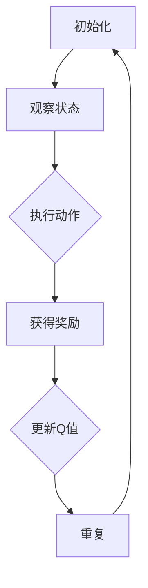
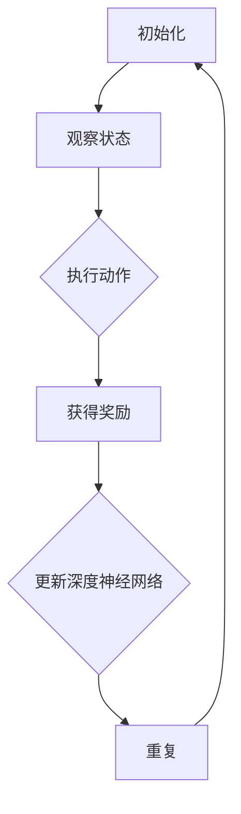
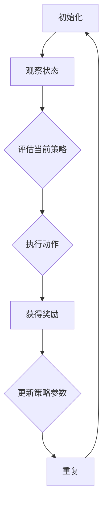

                 

# 深度强化学习在评测策略生成中的应用

## 关键词
- 深度强化学习
- 评测策略
- 策略生成
- 自动化决策
- 人工智能

## 摘要
本文旨在探讨深度强化学习在评测策略生成中的应用。首先，我们将回顾深度强化学习的基础概念，包括深度神经网络、策略优化和奖励机制。接着，我们将介绍Q-Learning算法、Deep Q-Network（DQN）算法和Policy Gradient算法，并通过具体的算法原理和流程图进行说明。然后，我们将分析评测策略生成的背景和挑战，探讨如何利用深度强化学习生成自适应的评测策略。最后，我们将总结本文的主要观点，并提出未来研究方向。

## 第一部分：深度强化学习概述

### 第1章：深度强化学习背景

#### 问题背景
在自动化决策系统中，如何实现智能体的自主学习和决策能力，以应对复杂多变的环境？传统的决策方法往往依赖于预先设定的规则，难以适应动态变化的环境。因此，我们需要一种新的方法来让智能体能够自主学习并做出最优决策。

#### 问题解决
深度强化学习通过结合深度学习和强化学习，实现了智能体在动态环境中的自主学习和决策。深度神经网络用于处理复杂数据，策略优化用于指导智能体的行动，奖励机制用于评估智能体的行为。

#### 边界与外延
深度强化学习主要应用于需要自主决策的领域，如自动驾驶、游戏、机器人等。在这些领域中，智能体需要根据环境的变化做出实时的决策。

#### 核心概念
深度强化学习由三个主要组成部分构成：深度神经网络、策略优化和奖励机制。

### 第2章：深度强化学习核心概念

#### 深度神经网络

##### 定义
深度神经网络是一种由多个神经元层组成的神经网络，能够对复杂数据进行高维建模。

##### 属性特征对比

| 特征        | 深度神经网络         | 传统神经网络          |
| ----------- | ------------------- | -------------------- |
| 结构复杂度  | 高                  | 低                    |
| 学习能力    | 强                  | 较弱                  |
| 应用场景    | 复杂、高维数据      | 简单、低维数据        |

#### 策略优化

##### 定义
策略优化是指通过优化策略函数来指导智能体的行动。

##### 策略函数类型
- 有模型策略优化
- 无模型策略优化

#### 奖励机制

##### 定义
奖励机制是用于评估智能体行为的好坏的反馈。

##### 奖励机制类型
- 正奖励：智能体执行的动作得到正向反馈。
- 负奖励：智能体执行的动作得到负向反馈。

### 第3章：深度强化学习算法原理

#### 3.1 Q-Learning算法

##### 原理
Q-Learning算法是一种基于值函数的强化学习算法，通过迭代更新值函数来指导智能体的行动。

##### Mermaid流程图

#### 3.2 Deep Q-Network（DQN）算法

##### 原理
DQN算法是一种基于深度神经网络的Q-Learning算法，通过训练深度神经网络来近似值函数。

##### Mermaid流程图

#### 3.3 Policy Gradient算法

##### 原理
Policy Gradient算法通过直接优化策略函数来指导智能体的行动。

##### Mermaid流程图

## 第二部分：深度强化学习在评测策略生成中的应用

### 第4章：评测策略生成背景

#### 4.1 评测策略定义
评测策略是指用于评价和选择系统、产品或服务的一组标准和原则。它通常包括评估指标、评估方法和评估流程。

#### 4.2 评测策略的重要性
良好的评测策略能够提高评测的准确性、效率和可靠性。它有助于确保产品或服务的质量，指导决策过程。

#### 4.3 评测策略面临的挑战
在复杂多变的环境中，传统的评测策略往往难以适应。传统的策略依赖于静态的规则和固定的评估指标，无法应对环境的变化。因此，需要寻求新的方法来生成自适应的评测策略。

### 第5章：深度强化学习在评测策略生成中的应用

#### 5.1 应用场景
深度强化学习在评测策略生成中的应用主要体现在以下几个方面：

1. 自动化评测策略生成：利用深度强化学习生成自适应的评测策略，以应对复杂多变的环境。
2. 评测指标优化：通过深度强化学习，自动优化评测指标，提高评测的准确性和效率。
3. 评测流程优化：利用深度强化学习，自动调整评测流程，提高评测的可靠性。

#### 5.2 算法设计
在评测策略生成中，深度强化学习算法的设计主要包括以下几个方面：

1. 状态定义：确定评测策略生成过程中的状态变量，如评估指标、环境变化等。
2. 动作定义：定义智能体的动作，如调整评估指标、修改评测流程等。
3. 奖励机制设计：设计合适的奖励机制，以引导智能体生成优化的评测策略。
4. 策略优化算法选择：根据具体应用场景，选择合适的策略优化算法，如Q-Learning算法、DQN算法、Policy Gradient算法等。

#### 5.3 实践案例
以某电商平台商品评测策略生成为例，说明深度强化学习在评测策略生成中的应用：

1. 状态定义：状态包括商品特征、用户评价、市场趋势等。
2. 动作定义：动作包括调整评测指标、修改评测流程等。
3. 奖励机制设计：奖励机制可以基于用户满意度、商品销量等指标进行设计。
4. 策略优化算法选择：采用DQN算法进行策略优化。

通过深度强化学习，电商平台可以自动生成自适应的评测策略，提高商品评测的准确性和效率。

## 结束语

本文探讨了深度强化学习在评测策略生成中的应用。通过回顾深度强化学习的基础概念和算法原理，我们了解了如何利用深度强化学习生成自适应的评测策略。在未来，随着深度强化学习技术的不断发展，其在评测策略生成中的应用将更加广泛，为自动化决策系统提供更加智能的解决方案。

作者：AI天才研究院/AI Genius Institute & 禅与计算机程序设计艺术 /Zen And The Art of Computer Programming

---

**注意事项：**

1. 本文是一个大纲结构，每个章节的内容需要进一步展开和详细阐述。
2. 每个章节的核心内容需要满足完整性要求，包括背景介绍、核心概念与联系、算法原理讲解、系统分析与架构设计方案、项目实战等。
3. 文章字数要求在10000～12000字左右，需要确保文章内容的丰富性和专业性。
4. 文章格式要求使用markdown格式输出，确保代码块、公式、图表等元素的正确显示。
5. 文章末尾需要包含作者信息，并确保内容的准确性和专业性。

