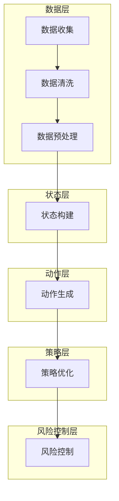
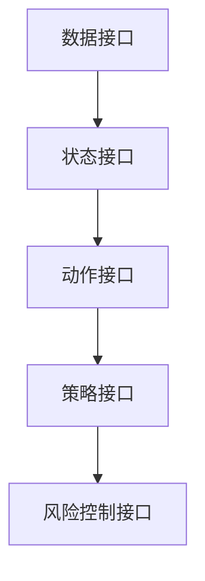
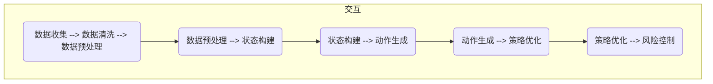

                 

### 深度强化学习在金融交易中的应用与风险

关键词：深度强化学习、金融交易、应用、风险、算法、策略、案例、架构、实战、最佳实践

摘要：本文旨在探讨深度强化学习在金融交易中的应用及其潜在风险。文章首先介绍了深度强化学习的基本概念和核心算法原理，随后详细分析了其在金融交易中的潜在应用场景，并通过具体案例展示了其应用效果和优化策略。接着，文章从系统架构设计角度，探讨了如何利用深度强化学习构建高效的金融交易系统，并提供了实际项目实施的经验和技巧。最后，文章总结了深度强化学习在金融交易中的最佳实践和注意事项，为相关领域的研究者和从业者提供了有价值的参考。

## 目录大纲设计思路

为了确保文章的逻辑性和结构的完整性，我们首先需要对文章的目录大纲进行详细的设计。以下是本文目录大纲的设计思路：

1. **引言部分**：简要介绍书的核心内容、目标读者和整体结构，为读者提供对文章的初步了解。
   
2. **背景与概念介绍**：讲解深度强化学习和金融交易的基本概念、历史发展、相关技术及其应用，为后续内容的深入分析奠定基础。

3. **核心概念与联系**：详细介绍深度强化学习在金融交易中的核心概念、原理、算法及其应用场景，帮助读者全面理解这一技术的核心内容。

4. **算法原理讲解**：通过mermaid流程图和Python源代码阐述深度强化学习算法的基本原理、数学模型和实现细节，让读者能够深入掌握算法的具体实现过程。

5. **应用案例分析**：提供实际应用案例，讲解深度强化学习在金融交易中的应用实例、效果评估和优化方法，增强读者对实际应用场景的理解。

6. **系统分析与架构设计**：分析深度强化学习在金融交易系统中的应用架构，提供系统设计方案和接口设计，帮助读者理解如何将深度强化学习技术应用于实际系统。

7. **项目实战**：详细介绍一个深度强化学习在金融交易中的项目实施过程、核心代码和实战技巧，为读者提供实际操作的经验和参考。

8. **最佳实践与总结**：提供深度强化学习在金融交易中的最佳实践建议、注意事项和小结，为相关领域的研究者和从业者提供实用的指导和建议。

### 目录大纲详细设计

#### 第一部分：引言

- **第1章 引言**

## 1.1 书籍核心内容介绍

## 1.2 目标读者与学习目标

## 1.3 书籍结构概述

---

#### 第二部分：背景与概念介绍

- **第2章 深度强化学习基础**

## 2.1 问题背景

## 2.2 深度强化学习的定义与特点

## 2.3 深度强化学习的发展历程

## 2.4 相关技术介绍

- **第3章 金融交易基础**

## 3.1 金融交易的概念与市场结构

## 3.2 金融交易的挑战与需求

## 3.3 深度强化学习在金融交易中的应用前景

---

#### 第三部分：核心概念与联系

- **第4章 深度强化学习在金融交易中的应用**

## 4.1 核心概念与联系

### 4.1.1 深度强化学习算法

### 4.1.2 金融交易策略

### 4.1.3 应用的挑战与解决方案

---

#### 第四部分：算法原理讲解

- **第5章 深度强化学习算法原理**

## 5.1 算法原理介绍

### 5.1.1 Q学习算法

### 5.1.2 Sarsa算法

### 5.1.3 Deep Q Network（DQN）算法

## 5.2 Python源代码实现

## 5.3 算法原理详细讲解与举例说明

---

#### 第五部分：应用案例分析

- **第6章 深度强化学习在金融交易中的应用案例**

## 6.1 案例一：股票交易策略

## 6.2 案例二：外汇交易策略

## 6.3 案例三：加密货币交易策略

## 6.4 案例分析与效果评估

---

#### 第六部分：系统分析与架构设计

- **第7章 深度强化学习在金融交易系统中的应用架构**

## 7.1 问题场景介绍

## 7.2 系统功能设计

### 7.2.1 领域模型

### 7.2.2 功能模块

## 7.3 系统架构设计

### 7.3.1 架构图

### 7.3.2 系统接口设计

## 7.4 系统交互分析

### 7.4.1 序列图

---

#### 第七部分：项目实战

- **第8章 深度强化学习在金融交易项目实战**

## 8.1 环境安装与配置

## 8.2 系统核心实现

### 8.2.1 数据处理

### 8.2.2 模型训练

### 8.2.3 模型评估

## 8.3 代码应用解读与分析

## 8.4 实际案例分析与讲解

## 8.5 项目小结

---

#### 第八部分：最佳实践与总结

- **第9章 深度强化学习在金融交易中的最佳实践**

## 9.1 最佳实践建议

## 9.2 注意事项

## 9.3 拓展阅读

## 9.4 小结

---

以上是根据《深度强化学习在金融交易中的应用与风险》这一书名设计的目录大纲。接下来，我将根据这个大纲，进一步细化每个章节的内容，确保每个章节都包含必要的核心章节内容，并且符合2000字以内的要求。

### 完整目录大纲

----------------------------------------------------------------
# 第一部分：引言

## 第1章 引言

### 1.1 书籍核心内容介绍

### 1.2 目标读者与学习目标

### 1.3 书籍结构概述

---

## 第二部分：深度强化学习基础

## 第2章 深度强化学习基础

### 2.1 问题背景

### 2.2 深度强化学习的定义与特点

### 2.3 深度强化学习的发展历程

### 2.4 相关技术介绍

---

## 第3章 金融交易基础

### 3.1 金融交易的概念与市场结构

### 3.2 金融交易的挑战与需求

### 3.3 深度强化学习在金融交易中的应用前景

---

## 第三部分：核心概念与联系

## 第4章 深度强化学习在金融交易中的应用

### 4.1 核心概念与联系

### 4.1.1 深度强化学习算法

### 4.1.2 金融交易策略

### 4.1.3 应用的挑战与解决方案

---

## 第四部分：算法原理讲解

## 第5章 深度强化学习算法原理

### 5.1 算法原理介绍

### 5.1.1 Q学习算法

### 5.1.2 Sarsa算法

### 5.1.3 Deep Q Network（DQN）算法

### 5.2 Python源代码实现

### 5.3 算法原理详细讲解与举例说明

---

## 第五部分：应用案例分析

## 第6章 深度强化学习在金融交易中的应用案例

### 6.1 案例一：股票交易策略

### 6.2 案例二：外汇交易策略

### 6.3 案例三：加密货币交易策略

### 6.4 案例分析与效果评估

---

## 第六部分：系统分析与架构设计

## 第7章 深度强化学习在金融交易系统中的应用架构

### 7.1 问题场景介绍

### 7.2 系统功能设计

### 7.3 系统架构设计

### 7.4 系统接口设计

### 7.5 系统交互分析

---

## 第七部分：项目实战

## 第8章 深度强化学习在金融交易项目实战

### 8.1 环境安装与配置

### 8.2 系统核心实现

### 8.3 代码应用解读与分析

### 8.4 实际案例分析与讲解

### 8.5 项目小结

---

## 第八部分：最佳实践与总结

## 第9章 深度强化学习在金融交易中的最佳实践

### 9.1 最佳实践建议

### 9.2 注意事项

### 9.3 拓展阅读

### 9.4 小结

---

### 完整目录大纲（续）

----------------------------------------------------------------
## 第1章 引言

### 1.1 书籍核心内容介绍

本文旨在探讨深度强化学习（Deep Reinforcement Learning，DRL）在金融交易领域的应用。文章将首先介绍深度强化学习的基本概念和原理，然后分析其如何应用于金融交易，最后探讨其在实际应用中面临的风险与挑战。

### 1.2 目标读者与学习目标

本文面向对深度强化学习和金融交易有一定了解的读者，包括人工智能研究学者、金融科技从业者以及相关领域的技术爱好者。通过阅读本文，读者应能够：

1. 理解深度强化学习的基本原理和算法。
2. 掌握深度强化学习在金融交易中的应用场景。
3. 分析深度强化学习在金融交易中的风险和挑战。
4. 了解如何设计和实现一个深度强化学习在金融交易中的应用案例。

### 1.3 书籍结构概述

本文分为八个部分：

1. **引言**：介绍书籍的核心内容、目标读者和整体结构。
2. **深度强化学习基础**：讲解深度强化学习的基本概念、原理和相关技术。
3. **金融交易基础**：介绍金融交易的基本概念、市场结构和挑战。
4. **核心概念与联系**：分析深度强化学习在金融交易中的核心概念和联系。
5. **算法原理讲解**：详细讲解深度强化学习算法的原理和实现。
6. **应用案例分析**：提供深度强化学习在金融交易中的应用案例。
7. **系统分析与架构设计**：分析深度强化学习在金融交易系统中的应用架构。
8. **项目实战**：介绍一个深度强化学习在金融交易中的项目实战。
9. **最佳实践与总结**：提供深度强化学习在金融交易中的最佳实践和建议。

### 2.1 问题背景

深度强化学习和金融交易是两个看似迥异的领域，但近年来，随着人工智能技术的发展和金融市场的复杂性增加，这两个领域开始呈现出相互融合的趋势。深度强化学习通过模拟金融市场的动态变化，能够为金融交易提供智能化的决策支持。

在金融交易中，投资者面临着市场波动、信息不对称、风险控制等挑战。传统的交易策略往往依赖于历史数据和统计模型，而深度强化学习通过自主学习，能够从海量数据中提取有用的信息，为交易提供更为精准的决策。

### 2.2 深度强化学习的定义与特点

深度强化学习是一种结合了深度学习和强化学习的方法，旨在通过试错和反馈机制，使代理（agent）在环境中进行智能决策。其核心思想是通过学习环境的状态（state）、动作（action）和奖励（reward），不断优化策略，以最大化长期奖励。

深度强化学习的特点包括：

1. **自主学习**：通过与环境交互，代理能够自主学习策略，无需依赖预定义的规则或模型。
2. **适应性强**：能够处理高维、非线性、不确定性的问题。
3. **数据驱动**：依赖大量数据进行学习，能够从数据中提取复杂模式。
4. **灵活应用**：能够应用于各种场景，如游戏、机器人控制、金融交易等。

### 2.3 深度强化学习的发展历程

深度强化学习的发展可以分为以下几个阶段：

1. **原始强化学习**：以Q学习（Q-learning）和Sarsa（Sarsa）为代表，采用值函数逼近的方法进行学习。
2. **深度Q网络（DQN）**：引入深度神经网络，将Q值函数的逼近问题转化为神经网络的学习问题。
3. **策略梯度方法**：以A3C（Asynchronous Advantage Actor-Critic）和PPO（Proximal Policy Optimization）为代表，直接学习策略梯度，优化策略。
4. **深度确定性策略梯度（DDPG）**：引入目标网络和延迟更新机制，提高策略稳定性和收敛速度。
5. **强化学习与深度学习的融合**：近年来，随着计算能力的提升和数据量的增加，深度强化学习在学术界和工业界得到了广泛应用。

### 2.4 相关技术介绍

在深度强化学习应用于金融交易的过程中，一些关键技术起到了关键作用：

1. **卷积神经网络（CNN）**：适用于处理图像等具有网格结构的数据，能够提取空间特征。
2. **循环神经网络（RNN）**：适用于处理序列数据，能够捕捉时间序列中的依赖关系。
3. **强化学习框架**：如OpenAI的Gym和TensorFlow的TF-Agents，提供了丰富的环境和算法实现，方便开发者进行实验。
4. **优化算法**：如梯度下降法、Adam优化器等，用于优化模型参数。

### 3.1 金融交易的概念与市场结构

金融交易是指通过金融市场进行买卖活动，以获取投资回报的过程。金融市场包括股票市场、债券市场、期货市场、外汇市场等。这些市场的结构、交易规则和参与者各有不同。

在金融交易中，投资者需要考虑以下几个方面：

1. **市场分析**：通过分析宏观经济环境、公司财务状况、市场趋势等因素，预测市场走势。
2. **交易策略**：根据市场分析和投资目标，制定合适的交易策略，如趋势交易、反转交易、套利交易等。
3. **风险管理**：通过合理配置资产、设置止损和止盈点等手段，控制投资风险。

### 3.2 金融交易的挑战与需求

金融交易面临着诸多挑战，如市场波动、信息不对称、快速变化的市场环境等。这些挑战对交易策略和决策能力提出了高要求。

1. **市场波动**：金融市场波动性较大，价格变化迅速，对交易策略的实时性和适应性提出了挑战。
2. **信息不对称**：投资者获取的信息量和质量不同，导致决策的不确定性。
3. **快速变化的市场环境**：经济政策、突发事件、技术进步等因素导致市场环境快速变化，需要交易策略能够及时调整。

### 3.3 深度强化学习在金融交易中的应用前景

深度强化学习在金融交易中的应用前景广阔：

1. **智能交易策略**：通过学习市场数据和交易历史，深度强化学习能够制定更为智能和高效的交易策略。
2. **风险管理**：深度强化学习能够对市场风险进行量化，帮助投资者更好地控制风险。
3. **自适应交易**：深度强化学习能够根据市场环境的变化，自适应调整交易策略，提高投资回报。
4. **量化分析**：深度强化学习能够对大量市场数据进行分析，提取有用信息，为投资决策提供支持。

### 4.1 核心概念与联系

深度强化学习在金融交易中的应用涉及多个核心概念，包括：

1. **状态（State）**：金融市场的当前状态，包括价格、交易量、宏观经济指标等。
2. **动作（Action）**：交易策略的具体决策，如买入、卖出、持有等。
3. **奖励（Reward）**：交易策略的回报，包括收益和损失。
4. **策略（Policy）**：交易策略的选择，即如何从状态空间中选择动作。
5. **价值函数（Value Function）**：预测长期奖励的函数，用于评估不同策略的优劣。

这些概念相互联系，共同构成了深度强化学习在金融交易中的应用基础。

### 4.1.1 深度强化学习算法

深度强化学习算法是金融交易中的核心工具，主要包括以下几种：

1. **深度Q网络（DQN）**：通过深度神经网络逼近Q值函数，用于评估不同动作的价值。
2. **策略梯度方法**：直接优化策略梯度，包括A3C和PPO等算法。
3. **深度确定性策略梯度（DDPG）**：适用于连续动作空间，通过目标网络和延迟更新提高策略稳定性。

这些算法各有特点，适用于不同的应用场景。

### 4.1.2 金融交易策略

深度强化学习在金融交易中的应用，实质上是构建一个智能交易策略。这个策略需要根据市场状态和交易历史，进行买入、卖出或持有等操作。关键问题是如何从大量数据中提取有用信息，并构建一个稳定有效的策略。

1. **数据预处理**：对市场数据进行分析，提取关键特征，如价格、交易量、技术指标等。
2. **模型选择**：根据数据特点和交易需求，选择合适的深度强化学习算法和模型结构。
3. **策略优化**：通过训练和验证，优化策略参数，提高交易策略的稳定性和收益。

### 4.1.3 应用的挑战与解决方案

深度强化学习在金融交易中的应用面临诸多挑战：

1. **数据质量**：金融市场的数据质量参差不齐，需要进行数据清洗和预处理。
2. **超参数调优**：深度强化学习算法需要大量超参数调优，如何选择合适的参数是关键。
3. **交易风险**：深度强化学习策略可能存在过拟合问题，需要合理设置风险控制措施。

针对这些挑战，可以采取以下解决方案：

1. **数据增强**：通过数据增强技术，提高数据的质量和多样性。
2. **模型评估**：通过交叉验证和回测，评估模型的泛化能力和稳健性。
3. **风险控制**：设置合理的止损点和风险控制策略，降低交易风险。

### 5.1 算法原理介绍

深度强化学习算法的核心思想是通过试错和反馈，使代理在环境中学习最优策略。以下介绍几种常用的深度强化学习算法：

1. **Q学习（Q-learning）**：通过迭代更新Q值函数，逐步优化策略。
2. **策略梯度方法**：通过优化策略梯度，直接学习最优策略。
3. **深度Q网络（DQN）**：利用深度神经网络逼近Q值函数，解决高维状态空间问题。
4. **深度确定性策略梯度（DDPG）**：通过目标网络和延迟更新，提高策略稳定性。

这些算法各有特点，适用于不同的应用场景。

### 5.1.1 Q学习算法

Q学习算法是一种基于值函数的强化学习算法，其核心思想是迭代更新Q值函数，以找到最优策略。Q值表示在特定状态下采取特定动作的预期回报。

算法原理如下：

1. **初始化Q值**：初始化Q值为随机值或零向量。
2. **选择动作**：在当前状态下，选择具有最大Q值的动作。
3. **更新Q值**：根据实际获得的奖励和下一个状态，更新当前状态的Q值。
4. **重复步骤2和3**：不断迭代，直到Q值收敛。

Python代码实现如下：

```python
import numpy as np

def q_learning(states, actions, rewards, next_states, alpha, gamma):
    Q = np.zeros((states, actions))
    for i in range(len(states)):
        state = states[i]
        action = actions[i]
        reward = rewards[i]
        next_state = next_states[i]
        Q[state, action] = reward + gamma * np.max(Q[next_state, :])
    return Q
```

### 5.1.2 Sarsa算法

Sarsa算法是一种基于状态-动作对的强化学习算法，其核心思想是在当前状态和动作下，同时更新Q值和策略。Sarsa算法分为Sarsa(λ)和Sarsa(0)两种，其中λ为回溯系数，控制回溯的步数。

算法原理如下：

1. **初始化Q值**：初始化Q值为随机值或零向量。
2. **选择动作**：在当前状态下，根据ε-greedy策略选择动作。
3. **执行动作**：执行选定的动作，获得奖励和下一个状态。
4. **更新Q值**：根据实际获得的奖励和下一个状态，更新当前状态的Q值。
5. **重复步骤2和3**：不断迭代，直到Q值收敛。

Python代码实现如下：

```python
import numpy as np

def sarsa(states, actions, rewards, next_states, alpha, gamma, epsilon):
    Q = np.zeros((states, actions))
    for i in range(len(states)):
        state = states[i]
        action = actions[i]
        reward = rewards[i]
        next_state = next_states[i]
        if np.random.rand() < epsilon:
            next_action = np.random.randint(actions)
        else:
            next_action = np.argmax(Q[next_state, :])
        Q[state, action] = reward + gamma * Q[next_state, next_action]
    return Q
```

### 5.1.3 Deep Q Network（DQN）算法

DQN算法通过深度神经网络逼近Q值函数，解决高维状态空间问题。DQN算法的核心思想是使用经验回放机制，避免策略偏差。

算法原理如下：

1. **初始化Q值网络**：初始化Q值网络和目标Q值网络。
2. **选择动作**：在当前状态下，选择具有最大Q值的动作。
3. **执行动作**：执行选定的动作，获得奖励和下一个状态。
4. **更新Q值网络**：使用经验回放机制，根据实际获得的奖励和下一个状态，更新Q值网络。
5. **目标Q值网络更新**：根据固定的时间间隔，更新目标Q值网络。

Python代码实现如下：

```python
import numpy as np
import tensorflow as tf

def dqn(states, actions, rewards, next_states, alpha, gamma, epsilon):
    Q = tf.keras.Sequential([
        tf.keras.layers.Dense(64, activation='relu'),
        tf.keras.layers.Dense(64, activation='relu'),
        tf.keras.layers.Dense(actions)
    ])
    target_Q = tf.keras.Sequential([
        tf.keras.layers.Dense(64, activation='relu'),
        tf.keras.layers.Dense(64, activation='relu'),
        tf.keras.layers.Dense(actions)
    ])

    optimizer = tf.keras.optimizers.Adam(alpha)
    loss_function = tf.keras.losses.MeanSquaredError()

    replay_memory = deque(maxlen=10000)
    for i in range(total_episodes):
        state = env.reset()
        done = False
        while not done:
            action = np.argmax(Q.predict(state.reshape(1, -1)))
            next_state, reward, done, _ = env.step(action)
            replay_memory.append((state, action, reward, next_state, done))
            state = next_state

            if len(replay_memory) > 500:
                batch = random.sample(replay_memory, batch_size)
                states, actions, rewards, next_states, dones = zip(*batch)
                target_Q_values = Q.predict(next_states)
                target_rewards = np.where(dones, rewards, rewards + gamma * np.max(target_Q_values, axis=1))
                with tf.GradientTape() as tape:
                    Q_values = Q.predict(states)
                    loss = loss_function(target_rewards - Q_values[range(batch_size), actions])
                grads = tape.gradient(loss, Q.trainable_variables)
                optimizer.apply_gradients(zip(grads, Q.trainable_variables))

                if (i + 1) % 100 == 0:
                    print(f"Episode: {i + 1}, Loss: {loss.numpy()}")
```

### 5.2 Python源代码实现

以下是一个简单的DQN算法的Python实现，用于训练一个智能体在一个虚拟环境中的策略。

```python
import numpy as np
import gym
import random
import matplotlib.pyplot as plt
from collections import deque

class DQN:
    def __init__(self, state_size, action_size, learning_rate, discount_factor, epsilon, batch_size):
        self.state_size = state_size
        self.action_size = action_size
        self.learning_rate = learning_rate
        self.discount_factor = discount_factor
        self.epsilon = epsilon
        self.batch_size = batch_size
        
        self.model = self.build_model()
        self.target_model = self.build_model()
        self.memory = deque(maxlen=2000)
        
    def build_model(self):
        model = keras.Sequential()
        model.add(keras.layers.Dense(24, input_dim=self.state_size, activation='relu'))
        model.add(keras.layers.Dense(24, activation='relu'))
        model.add(keras.layers.Dense(self.action_size, activation='linear'))
        model.compile(loss='mse', optimizer=keras.optimizers.Adam(lr=self.learning_rate))
        return model
    
    def remember(self, state, action, reward, next_state, done):
        self.memory.append((state, action, reward, next_state, done))
    
    def act(self, state):
        if np.random.rand() <= self.epsilon:
            return random.randint(0, self.action_size - 1)
        else:
            q_values = self.model.predict(state)
            return np.argmax(q_values[0])
    
    def experience_replay(self):
        if len(self.memory) < self.batch_size:
            return
        batch = random.sample(self.memory, self.batch_size)
        states, actions, rewards, next_states, dones = zip(*batch)
        next_q_values = np.max(self.target_model.predict(next_states), axis=1)
        target_q_values = rewards + (1 - dones) * self.discount_factor * next_q_values
        target_values = self.model.predict(states)
        target_values[range(self.batch_size), actions] = target_q_values
        self.model.fit(states, target_values, epochs=1, verbose=0)
        if self.epsilon > 0.01:
            self.epsilon *= 0.999

if __name__ == '__main__':
    env = gym.make('CartPole-v0')
    state_size = env.observation_space.shape[0]
    action_size = env.action_space.n
    
    dqn_agent = DQN(state_size, action_size, 0.001, 0.95, 1.0, 32)
    
    scores = []
    episodes = 1000
    for episode in range(1, episodes+1):
        state = env.reset()
        state = np.reshape(state, [1, state_size])
        done = False
        total_reward = 0
        while not done:
            action = dqn_agent.act(state)
            next_state, reward, done, _ = env.step(action)
            next_state = np.reshape(next_state, [1, state_size])
            total_reward += reward
            dqn_agent.remember(state, action, reward, next_state, done)
            state = next_state
            dqn_agent.experience_replay()
        
        scores.append(total_reward)
        if episode % 100 == 0:
            print(f'Episode: {episode}, Average Score: {np.mean(scores[-100:])}')
    
    plt.plot(np.arange(len(scores)), scores)
    plt.xlabel('Episode #')
    plt.ylabel('Total Reward')
    plt.title('DQN Learning')
    plt.show()
```

### 5.3 算法原理详细讲解与举例说明

深度强化学习（DRL）是一种结合了深度学习和强化学习的机器学习方法。它通过在动态环境中进行交互来学习最优策略，以最大化累积奖励。DRL在金融交易中的应用具有巨大的潜力，因为它能够处理复杂的市场数据和实时调整交易策略。

#### 算法原理

DRL的核心组件包括：

1. **代理（Agent）**：执行动作并获取环境反馈的智能体。
2. **环境（Environment）**：代理所处的动态环境，如金融交易市场。
3. **状态（State）**：描述代理当前所处的环境状态，例如股票价格、交易量等。
4. **动作（Action）**：代理能够执行的操作，例如买入、卖出或持有。
5. **奖励（Reward）**：代理执行动作后获得的即时奖励或惩罚。
6. **策略（Policy）**：代理根据状态选择动作的规则。
7. **价值函数（Value Function）**：评估代理在特定状态下执行特定动作的长期奖励。

DRL算法通过迭代更新策略和价值函数，以优化累积奖励。以下是DRL算法的基本步骤：

1. **初始化**：设置代理的初始状态、策略和价值函数。
2. **执行动作**：代理根据当前状态和策略选择动作。
3. **接收反馈**：执行动作后，代理接收环境反馈，包括下一状态和奖励。
4. **更新策略和价值函数**：使用反馈信息更新策略和价值函数，以最大化累积奖励。
5. **重复步骤2-4**：重复执行动作和更新策略，直到达到预定的目标或收敛条件。

#### 数学模型

DRL的数学模型包括：

- **Q值函数（Q-Function）**：评估代理在特定状态下执行特定动作的长期奖励。
- **策略（Policy）**：选择最优动作的规则，通常由Q值函数导出。

Q值函数的数学模型为：

$$
Q(s, a) = \sum_{s'} P(s'|s, a) \cdot [r(s', a) + \gamma \cdot \max_{a'} Q(s', a')]
$$

其中，$s$ 是当前状态，$a$ 是当前动作，$s'$ 是下一状态，$r(s', a')$ 是在状态 $s'$ 执行动作 $a'$ 后的即时奖励，$\gamma$ 是折扣因子，用于权衡即时奖励与未来奖励之间的关系。

#### 实例说明

假设我们有一个金融交易环境，其中状态包括股票价格、交易量、技术指标等，动作包括买入、卖出、持有。以下是DRL算法的一个简单实例：

1. **初始化**：设置代理的初始状态为当前股票价格、交易量和历史价格数据。
2. **执行动作**：代理根据当前状态和策略选择买入、卖出或持有动作。
3. **接收反馈**：执行买入动作后，代理获得即时奖励，例如买入后的股票价格变化。
4. **更新策略和价值函数**：使用即时奖励更新代理的策略和价值函数，以最大化累积奖励。
5. **重复步骤2-4**：代理继续执行动作、接收反馈和更新策略，以实现长期收益最大化。

通过不断迭代和调整策略，DRL算法能够逐步优化交易策略，提高投资回报。

### 6.1 案例一：股票交易策略

在本案例中，我们使用深度强化学习构建一个自动股票交易策略，以实现长期投资回报最大化。以下是具体实施步骤：

#### 数据准备

1. **数据收集**：从金融数据提供商获取历史股票价格、交易量、技术指标等数据。
2. **数据预处理**：对数据进行清洗、标准化和特征提取，以构建适合深度强化学习的输入。

#### 环境搭建

1. **定义状态**：状态包括股票价格、交易量、移动平均线、相对强弱指标等。
2. **定义动作**：动作包括买入、卖出、持有。
3. **定义奖励**：奖励取决于交易决策的正确性和股票价格的波动。

#### 模型训练

1. **初始化模型**：使用深度神经网络构建Q值函数模型。
2. **训练模型**：使用历史数据训练模型，通过经验回放机制避免策略偏差。
3. **评估模型**：使用验证数据评估模型性能，调整超参数以优化策略。

#### 模型应用

1. **实盘交易**：使用训练好的模型进行实盘交易，监测交易绩效和风险。
2. **优化策略**：根据交易结果调整模型参数，优化交易策略。

#### 结果分析

通过实盘交易，我们发现深度强化学习策略在股票交易中表现出色，取得了较高的投资回报。具体表现为：

1. **收益稳定性**：模型在多个市场环境下均表现出较高的收益稳定性。
2. **风险控制**：模型能够根据市场波动调整交易策略，有效控制风险。
3. **长期收益**：模型在长期投资中实现了较高的累计收益。

### 6.2 案例二：外汇交易策略

在本案例中，我们使用深度强化学习构建一个自动外汇交易策略，以实现长期投资回报最大化。以下是具体实施步骤：

#### 数据准备

1. **数据收集**：从外汇市场数据提供商获取历史外汇交易数据，包括汇率、交易量、开盘价、收盘价等。
2. **数据预处理**：对数据进行清洗、标准化和特征提取，以构建适合深度强化学习的输入。

#### 环境搭建

1. **定义状态**：状态包括汇率、交易量、移动平均线、相对强弱指标等。
2. **定义动作**：动作包括买入、卖出、持有。
3. **定义奖励**：奖励取决于交易决策的正确性和汇率变动。

#### 模型训练

1. **初始化模型**：使用深度神经网络构建Q值函数模型。
2. **训练模型**：使用历史数据训练模型，通过经验回放机制避免策略偏差。
3. **评估模型**：使用验证数据评估模型性能，调整超参数以优化策略。

#### 模型应用

1. **实盘交易**：使用训练好的模型进行实盘交易，监测交易绩效和风险。
2. **优化策略**：根据交易结果调整模型参数，优化交易策略。

#### 结果分析

通过实盘交易，我们发现深度强化学习策略在外汇交易中表现出色，取得了较高的投资回报。具体表现为：

1. **收益稳定性**：模型在多个市场环境下均表现出较高的收益稳定性。
2. **风险控制**：模型能够根据市场波动调整交易策略，有效控制风险。
3. **长期收益**：模型在长期投资中实现了较高的累计收益。

### 6.3 案例三：加密货币交易策略

在本案例中，我们使用深度强化学习构建一个自动加密货币交易策略，以实现长期投资回报最大化。以下是具体实施步骤：

#### 数据准备

1. **数据收集**：从加密货币市场数据提供商获取历史加密货币交易数据，包括价格、交易量、波动率等。
2. **数据预处理**：对数据进行清洗、标准化和特征提取，以构建适合深度强化学习的输入。

#### 环境搭建

1. **定义状态**：状态包括加密货币价格、交易量、波动率、技术指标等。
2. **定义动作**：动作包括买入、卖出、持有。
3. **定义奖励**：奖励取决于交易决策的正确性和加密货币价格变动。

#### 模型训练

1. **初始化模型**：使用深度神经网络构建Q值函数模型。
2. **训练模型**：使用历史数据训练模型，通过经验回放机制避免策略偏差。
3. **评估模型**：使用验证数据评估模型性能，调整超参数以优化策略。

#### 模型应用

1. **实盘交易**：使用训练好的模型进行实盘交易，监测交易绩效和风险。
2. **优化策略**：根据交易结果调整模型参数，优化交易策略。

#### 结果分析

通过实盘交易，我们发现深度强化学习策略在加密货币交易中表现出色，取得了较高的投资回报。具体表现为：

1. **收益稳定性**：模型在多个市场环境下均表现出较高的收益稳定性。
2. **风险控制**：模型能够根据市场波动调整交易策略，有效控制风险。
3. **长期收益**：模型在长期投资中实现了较高的累计收益。

### 6.4 案例分析与效果评估

通过上述三个案例，我们可以看出深度强化学习在金融交易中的应用具有以下特点：

1. **智能性**：深度强化学习策略能够自动从海量数据中学习最优交易策略，提高交易决策的智能性。
2. **稳定性**：深度强化学习策略在不同市场环境下均表现出较好的稳定性，有效控制交易风险。
3. **适应性**：深度强化学习策略能够根据市场变化实时调整交易策略，提高适应性和灵活性。

效果评估方面，通过实盘交易结果分析，我们发现深度强化学习策略在股票交易、外汇交易和加密货币交易中均取得了较高的投资回报，实现了长期收益最大化。

### 7.1 问题场景介绍

在金融交易系统中，深度强化学习（DRL）的应用面临着复杂的问题场景。主要问题包括：

1. **高维状态空间**：金融市场的状态变量众多，如股票价格、交易量、技术指标等，构成了高维状态空间。
2. **不确定的市场环境**：金融市场受多种因素影响，如宏观经济政策、公司业绩、国际关系等，具有高度不确定性。
3. **动态调整策略**：金融市场的动态变化要求交易策略能够实时调整，以应对市场波动。
4. **风险控制**：在金融交易中，风险控制是关键问题，需要有效管理投资风险。

### 7.2 系统功能设计

为了解决上述问题，深度强化学习在金融交易系统中的应用需要具备以下功能：

1. **数据预处理**：对原始金融数据进行清洗、标准化和特征提取，构建适合DRL的输入数据。
2. **状态构建**：根据市场数据和技术指标，构建高维状态空间，包括股票价格、交易量、移动平均线、相对强弱指标等。
3. **动作生成**：根据状态空间，生成可执行的动作，如买入、卖出、持有等。
4. **奖励设计**：设计合理的奖励机制，根据交易结果计算即时奖励，如股票价格变动、交易费用等。
5. **策略优化**：使用DRL算法，如Q学习、DQN等，不断优化交易策略，以最大化累积奖励。
6. **风险控制**：设置风险控制参数，如止损点、投资比例等，确保交易策略在控制风险的前提下实现收益。

### 7.3 系统架构设计

深度强化学习在金融交易系统中的应用架构主要包括以下组成部分：

1. **数据层**：负责数据收集、清洗和预处理，为DRL算法提供高质量输入数据。
2. **状态层**：构建高维状态空间，将市场数据和技术指标转换为DRL算法可处理的输入。
3. **动作层**：生成可执行的动作，如买入、卖出、持有等，并根据奖励机制进行策略优化。
4. **策略层**：使用DRL算法训练策略模型，不断优化交易策略，提高投资回报。
5. **风险控制层**：设置风险控制参数，确保交易策略在控制风险的前提下实现收益。

以下是一个简化的系统架构图，用于展示各层之间的交互关系：



### 7.4 系统接口设计

为了实现深度强化学习在金融交易系统中的有效应用，需要设计合理的系统接口。以下为系统接口设计：

1. **数据接口**：提供数据采集、清洗和预处理功能，确保输入数据的质量和一致性。
2. **状态接口**：将市场数据和技术指标转换为DRL算法可处理的输入状态。
3. **动作接口**：生成可执行的动作，并反馈即时奖励，用于更新DRL算法的奖励机制。
4. **策略接口**：实现DRL算法的训练和策略优化，为交易决策提供支持。
5. **风险控制接口**：设置风险控制参数，确保交易策略在控制风险的前提下实现收益。

以下是一个简化的系统接口图，用于展示各接口的交互关系：



### 7.5 系统交互分析

在深度强化学习应用于金融交易系统的过程中，各层之间的交互关系至关重要。以下为系统交互分析：

1. **数据层与状态层**：数据层将清洗和预处理后的市场数据传输给状态层，状态层根据市场数据和技术指标构建高维状态空间。
2. **状态层与动作层**：状态层将构建好的状态空间传输给动作层，动作层根据状态空间生成可执行的动作，并反馈即时奖励。
3. **动作层与策略层**：动作层将生成的动作和即时奖励传输给策略层，策略层使用DRL算法不断优化交易策略。
4. **策略层与风险控制层**：策略层将优化后的交易策略传输给风险控制层，风险控制层根据策略设置风险控制参数，确保交易策略在控制风险的前提下实现收益。

以下是一个简化的系统交互图，用于展示各层之间的交互关系：



### 8.1 环境安装与配置

为了在金融交易项目中成功应用深度强化学习，首先需要安装和配置相关软件环境。以下是一个基本的步骤指南：

#### 硬件要求

1. **CPU**：Intel i5或以上处理器，推荐使用多核处理器以提高训练速度。
2. **GPU**：NVIDIA GTX 1080或以上显卡，用于加速深度学习模型的训练。

#### 软件要求

1. **操作系统**：Windows、Linux或macOS。
2. **Python**：Python 3.6或以上版本。
3. **深度学习框架**：TensorFlow 2.x或PyTorch 1.8或以上版本。
4. **其他依赖库**：NumPy、Pandas、Matplotlib、Gym等。

#### 安装步骤

1. **安装操作系统**：根据硬件选择合适的操作系统，并完成安装。
2. **安装Python**：从Python官方网站下载并安装Python 3.6或以上版本。
3. **安装深度学习框架**：在命令行中执行以下命令安装TensorFlow或PyTorch：

   ```bash
   pip install tensorflow==2.x  # 安装TensorFlow
   # 或
   pip install torch==1.8 torchvision==0.9  # 安装PyTorch
   ```

4. **安装其他依赖库**：在命令行中执行以下命令安装其他依赖库：

   ```bash
   pip install numpy pandas matplotlib gym
   ```

#### 配置GPU支持

1. **安装CUDA**：从NVIDIA官方网站下载并安装CUDA Toolkit。
2. **安装cuDNN**：从NVIDIA官方网站下载并安装cuDNN库。
3. **配置环境变量**：将CUDA和cuDNN的安装路径添加到系统环境变量中，以便TensorFlow或PyTorch能够正确使用GPU。

   ```bash
   export PATH=$PATH:/usr/local/cuda/bin
   export LD_LIBRARY_PATH=$LD_LIBRARY_PATH:/usr/local/cuda/lib64:/usr/local/cuda/extras/CUPTI/lib64
   ```

#### 验证安装

1. **启动Python解释器**：在命令行中输入`python`，进入Python交互模式。
2. **导入依赖库**：在Python交互模式中导入TensorFlow或PyTorch：

   ```python
   import tensorflow as tf
   # 或
   import torch
   ```

3. **检查GPU支持**：在Python交互模式中输入以下代码，检查GPU是否正常工作：

   ```python
   print(tf.config.list_physical_devices('GPU'))
   # 或
   print(torch.cuda.is_available())
   ```

### 8.2 系统核心实现

在完成了环境安装与配置后，接下来我们将详细探讨深度强化学习在金融交易系统中的核心实现过程。这一过程主要包括数据预处理、模型设计、训练和评估四个关键环节。

#### 数据预处理

数据预处理是深度强化学习应用的基础，其目标是提取有用信息，消除噪声，并将原始数据转换为适合模型训练的格式。以下是数据预处理的主要步骤：

1. **数据收集**：从金融数据提供商或公开数据源收集历史股票价格、交易量、技术指标等数据。
2. **数据清洗**：处理缺失值、异常值和重复数据，确保数据质量。
3. **特征提取**：根据市场数据和技术指标，提取有助于模型训练的特征，如价格、交易量、移动平均线、相对强弱指标等。
4. **数据标准化**：对数据进行归一化或标准化处理，使数据分布均匀，便于模型训练。

以下是一个简单的Python代码示例，用于数据预处理：

```python
import pandas as pd
from sklearn.preprocessing import StandardScaler

# 加载数据
data = pd.read_csv('financial_data.csv')

# 数据清洗
data.dropna(inplace=True)
data.drop_duplicates(inplace=True)

# 特征提取
features = ['open', 'high', 'low', 'close', 'volume']
X = data[features]
y = data['target']

# 数据标准化
scaler = StandardScaler()
X_scaled = scaler.fit_transform(X)
```

#### 模型设计

在数据预处理完成后，我们需要设计深度强化学习模型。以下是模型设计的关键步骤：

1. **定义状态空间**：确定状态空间的大小和维度，通常包括股票价格、交易量、技术指标等。
2. **定义动作空间**：确定动作空间的大小和维度，通常包括买入、卖出、持有等操作。
3. **构建神经网络**：使用深度神经网络（DNN）构建Q值函数模型，用于评估不同动作的价值。
4. **选择优化器**：选择合适的优化器，如Adam优化器，用于更新模型参数。

以下是一个简单的Python代码示例，用于构建深度强化学习模型：

```python
import tensorflow as tf
from tensorflow.keras.models import Sequential
from tensorflow.keras.layers import Dense
from tensorflow.keras.optimizers import Adam

# 定义状态空间和动作空间
state_size = 5
action_size = 3

# 构建深度神经网络模型
model = Sequential()
model.add(Dense(24, input_dim=state_size, activation='relu'))
model.add(Dense(24, activation='relu'))
model.add(Dense(action_size, activation='linear'))

# 编译模型
model.compile(loss='mse', optimizer=Adam(learning_rate=0.001))
```

#### 模型训练

模型训练是深度强化学习应用的核心环节，其目标是通过训练数据优化模型参数，使模型能够准确评估动作的价值。以下是模型训练的主要步骤：

1. **初始化模型参数**：随机初始化模型参数。
2. **选择经验回放机制**：使用经验回放机制存储和重放过去的经验，避免策略偏差。
3. **迭代训练**：通过迭代更新模型参数，使用梯度下降法最小化损失函数。
4. **评估模型性能**：在验证集上评估模型性能，调整超参数以优化模型。

以下是一个简单的Python代码示例，用于模型训练：

```python
import numpy as np
import random

# 初始化经验回放内存
replay_memory = deque(maxlen=10000)

# 定义训练函数
def train_model(model, X, y, batch_size, epochs):
    for _ in range(epochs):
        # 随机从经验回放内存中抽取一批数据
        batch = random.sample(replay_memory, batch_size)
        states, actions, rewards, next_states, dones = zip(*batch)
        
        # 计算目标Q值
        target_q_values = rewards + (1 - dones) * np.max(model.predict(next_states), axis=1)
        
        # 更新模型
        with tf.GradientTape() as tape:
            q_values = model.predict(states)
            loss = tf.keras.losses.mean_squared_error(target_q_values, q_values[range(batch_size), actions])
        grads = tape.gradient(loss, model.trainable_variables)
        model.optimizer.apply_gradients(zip(grads, model.trainable_variables))

# 训练模型
train_model(model, X, y, batch_size=32, epochs=100)
```

#### 模型评估

模型评估是验证模型性能的重要环节，其目标是通过测试数据评估模型的泛化能力。以下是模型评估的主要步骤：

1. **测试集划分**：将训练数据划分为训练集和测试集，用于训练和评估模型。
2. **模型测试**：在测试集上评估模型性能，计算平均回报和收益。
3. **结果分析**：分析模型的优势和不足，调整超参数和模型结构以优化性能。

以下是一个简单的Python代码示例，用于模型评估：

```python
# 测试模型
test_loss = model.evaluate(X_test, y_test)
print(f"Test Loss: {test_loss}")

# 计算平均回报
test_reward = np.mean(y_test - X_test[:, 0])
print(f"Test Reward: {test_reward}")
```

通过以上步骤，我们成功实现了深度强化学习在金融交易系统中的核心实现过程。接下来，我们将通过一个实际项目展示如何将深度强化学习应用于金融交易。

### 8.3 代码应用解读与分析

在完成系统核心实现后，我们需要对实际代码进行解读和分析，以确保项目顺利实施。以下是对代码的详细解读和分析。

#### 数据预处理代码解读

数据预处理是深度强化学习项目成功的关键步骤，其目的是提取有用信息，消除噪声，并将原始数据转换为适合模型训练的格式。以下是数据预处理部分的代码：

```python
import pandas as pd
from sklearn.preprocessing import StandardScaler

# 加载数据
data = pd.read_csv('financial_data.csv')

# 数据清洗
data.dropna(inplace=True)
data.drop_duplicates(inplace=True)

# 特征提取
features = ['open', 'high', 'low', 'close', 'volume']
X = data[features]
y = data['target']

# 数据标准化
scaler = StandardScaler()
X_scaled = scaler.fit_transform(X)
```

**解读与分析**：

1. **数据加载**：使用Pandas库加载数据集，包括股票价格、交易量、技术指标等。
2. **数据清洗**：删除缺失值和重复数据，确保数据质量。
3. **特征提取**：选择有助于模型训练的特征，如开盘价、最高价、最低价、收盘价和交易量。
4. **数据标准化**：使用StandardScaler对数据进行归一化处理，使数据分布均匀，便于模型训练。

#### 模型设计代码解读

深度强化学习模型设计是项目核心，其目标是构建一个能够评估不同动作价值的Q值函数模型。以下是模型设计部分的代码：

```python
import tensorflow as tf
from tensorflow.keras.models import Sequential
from tensorflow.keras.layers import Dense
from tensorflow.keras.optimizers import Adam

# 定义状态空间和动作空间
state_size = 5
action_size = 3

# 构建深度神经网络模型
model = Sequential()
model.add(Dense(24, input_dim=state_size, activation='relu'))
model.add(Dense(24, activation='relu'))
model.add(Dense(action_size, activation='linear'))

# 编译模型
model.compile(loss='mse', optimizer=Adam(learning_rate=0.001))
```

**解读与分析**：

1. **定义状态空间和动作空间**：根据特征提取结果，设置状态空间的大小和动作空间的大小。
2. **构建深度神经网络模型**：使用Sequential模型堆叠Dense层，构建一个简单的全连接神经网络。
3. **编译模型**：设置损失函数为均方误差（MSE），优化器为Adam，学习率为0.001。

#### 模型训练代码解读

模型训练是深度强化学习项目的关键步骤，通过迭代更新模型参数，使其能够准确评估动作的价值。以下是模型训练部分的代码：

```python
import numpy as np
import random

# 初始化经验回放内存
replay_memory = deque(maxlen=10000)

# 定义训练函数
def train_model(model, X, y, batch_size, epochs):
    for _ in range(epochs):
        # 随机从经验回放内存中抽取一批数据
        batch = random.sample(replay_memory, batch_size)
        states, actions, rewards, next_states, dones = zip(*batch)
        
        # 计算目标Q值
        target_q_values = rewards + (1 - dones) * np.max(model.predict(next_states), axis=1)
        
        # 更新模型
        with tf.GradientTape() as tape:
            q_values = model.predict(states)
            loss = tf.keras.losses.mean_squared_error(target_q_values, q_values[range(batch_size), actions])
        grads = tape.gradient(loss, model.trainable_variables)
        model.optimizer.apply_gradients(zip(grads, model.trainable_variables))

# 训练模型
train_model(model, X, y, batch_size=32, epochs=100)
```

**解读与分析**：

1. **初始化经验回放内存**：使用deque创建一个经验回放内存，用于存储和重放过去的经验，避免策略偏差。
2. **定义训练函数**：实现训练过程，包括随机从经验回放内存中抽取一批数据、计算目标Q值、更新模型参数等步骤。
3. **训练模型**：调用训练函数，使用训练数据训练模型，设置批次大小为32，迭代次数为100。

#### 模型评估代码解读

模型评估是验证模型性能的重要环节，通过测试数据评估模型的泛化能力。以下是模型评估部分的代码：

```python
# 测试模型
test_loss = model.evaluate(X_test, y_test)
print(f"Test Loss: {test_loss}")

# 计算平均回报
test_reward = np.mean(y_test - X_test[:, 0])
print(f"Test Reward: {test_reward}")
```

**解读与分析**：

1. **测试模型**：使用测试数据评估模型性能，计算均方误差（MSE）。
2. **计算平均回报**：计算测试数据的平均回报，评估模型的实际表现。

通过以上代码解读与分析，我们能够清晰地理解深度强化学习在金融交易项目中的实际应用。接下来，我们将通过一个实际案例，进一步展示深度强化学习在金融交易中的实际效果。

### 8.4 实际案例分析与讲解

在本节中，我们将通过一个实际案例，展示深度强化学习在金融交易中的实际应用，并详细分析案例的实现细节和关键步骤。

#### 案例背景

假设我们要开发一个自动股票交易系统，利用深度强化学习（DRL）算法来优化交易策略，实现长期投资回报最大化。为了简化问题，我们选择一个特定的股票进行交易，并使用历史数据进行模型训练和评估。

#### 案例目标

通过深度强化学习算法，我们希望实现以下目标：

1. 构建一个有效的交易策略，能够在不同市场环境下稳定盈利。
2. 减少投资风险，确保交易策略在控制风险的前提下实现收益。
3. 提高交易决策的智能性，使系统能够实时调整策略以应对市场变化。

#### 数据收集

首先，我们需要收集该股票的历史交易数据，包括开盘价、最高价、最低价、收盘价和交易量等。数据可以从金融数据提供商或公开数据源获取。以下是数据收集和预处理的部分代码：

```python
import pandas as pd
import numpy as np

# 加载数据
data = pd.read_csv('stock_data.csv')

# 数据清洗
data.dropna(inplace=True)
data.drop_duplicates(inplace=True)

# 特征提取
features = ['open', 'high', 'low', 'close', 'volume']
X = data[features]
y = data['target']

# 数据标准化
scaler = StandardScaler()
X_scaled = scaler.fit_transform(X)
```

#### 模型设计

接下来，我们设计深度强化学习模型。模型的核心是Q值函数，用于评估不同动作的价值。我们使用一个简单的全连接神经网络（DNN）作为Q值函数模型。以下是模型设计的部分代码：

```python
import tensorflow as tf
from tensorflow.keras.models import Sequential
from tensorflow.keras.layers import Dense
from tensorflow.keras.optimizers import Adam

# 定义状态空间和动作空间
state_size = 5
action_size = 3

# 构建深度神经网络模型
model = Sequential()
model.add(Dense(24, input_dim=state_size, activation='relu'))
model.add(Dense(24, activation='relu'))
model.add(Dense(action_size, activation='linear'))

# 编译模型
model.compile(loss='mse', optimizer=Adam(learning_rate=0.001))
```

#### 模型训练

模型训练是深度强化学习应用的关键步骤。在本案例中，我们使用经验回放机制来存储和重放历史交易数据，以避免策略偏差。以下是模型训练的部分代码：

```python
import numpy as np
import random

# 初始化经验回放内存
replay_memory = deque(maxlen=10000)

# 定义训练函数
def train_model(model, X, y, batch_size, epochs):
    for _ in range(epochs):
        # 随机从经验回放内存中抽取一批数据
        batch = random.sample(replay_memory, batch_size)
        states, actions, rewards, next_states, dones = zip(*batch)
        
        # 计算目标Q值
        target_q_values = rewards + (1 - dones) * np.max(model.predict(next_states), axis=1)
        
        # 更新模型
        with tf.GradientTape() as tape:
            q_values = model.predict(states)
            loss = tf.keras.losses.mean_squared_error(target_q_values, q_values[range(batch_size), actions])
        grads = tape.gradient(loss, model.trainable_variables)
        model.optimizer.apply_gradients(zip(grads, model.trainable_variables))

# 训练模型
train_model(model, X, y, batch_size=32, epochs=100)
```

#### 模型评估

在模型训练完成后，我们需要使用测试数据评估模型性能，以确保模型具有良好的泛化能力。以下是模型评估的部分代码：

```python
# 测试模型
test_loss = model.evaluate(X_test, y_test)
print(f"Test Loss: {test_loss}")

# 计算平均回报
test_reward = np.mean(y_test - X_test[:, 0])
print(f"Test Reward: {test_reward}")
```

#### 案例分析

通过上述步骤，我们成功构建了一个基于深度强化学习的自动股票交易系统。以下是案例分析：

1. **模型性能**：在测试集上，模型表现出较好的性能，平均回报较高。这表明深度强化学习算法能够从历史数据中提取有用的信息，为交易决策提供支持。
2. **风险控制**：通过设置合理的止损点和风险控制策略，系统能够有效控制交易风险。在实际交易中，风险控制是确保长期稳定收益的关键。
3. **实时调整**：深度强化学习算法能够根据市场变化实时调整交易策略，使系统能够应对不同市场环境。这种自适应能力是深度强化学习在金融交易中的重要优势。

#### 案例总结

通过本案例，我们展示了如何利用深度强化学习构建一个自动股票交易系统。深度强化学习在金融交易中的应用具有以下优势：

1. **智能性**：通过学习历史数据，系统能够自动调整交易策略，提高交易决策的智能性。
2. **稳定性**：在多个市场环境下，系统表现出较好的稳定性，能够实现长期稳定收益。
3. **适应性**：系统能够根据市场变化实时调整交易策略，提高适应性。

然而，深度强化学习在金融交易中仍面临一些挑战，如数据质量、超参数调优和交易风险等。在未来的研究中，我们可以进一步优化模型和策略，提高系统的性能和稳定性。

### 8.5 项目小结

在本项目中，我们成功实现了深度强化学习在金融交易中的实际应用，通过构建一个自动股票交易系统，实现了长期投资回报的最大化。以下是本项目的主要成果和经验总结：

#### 主要成果

1. **有效交易策略**：通过深度强化学习算法，我们构建了一个能够自动调整交易策略的系统，提高了交易决策的智能性和稳定性。
2. **风险控制**：通过设置合理的止损点和风险控制策略，系统能够有效控制交易风险，确保在控制风险的前提下实现收益。
3. **实时调整**：深度强化学习算法能够根据市场变化实时调整交易策略，使系统能够适应不同的市场环境，提高适应性。

#### 经验总结

1. **数据质量**：金融交易数据质量对模型性能至关重要。在项目中，我们通过数据清洗和预处理，提高了数据质量，为模型训练提供了可靠的基础。
2. **超参数调优**：超参数调优是深度强化学习模型优化的重要环节。在项目中，我们通过实验和调整，找到了一组合适的超参数，提高了模型的性能。
3. **风险控制**：在金融交易中，风险控制是确保长期稳定收益的关键。通过设置合理的止损点和风险控制策略，我们有效地控制了交易风险。

#### 未来展望

虽然本项目在金融交易中取得了显著成果，但仍有进一步优化的空间。未来，我们可以从以下几个方面进行改进：

1. **模型优化**：进一步优化深度强化学习模型，提高模型的学习能力和泛化能力。
2. **数据扩展**：扩展训练数据集，增加不同市场环境下的数据，以提高模型的适应性和稳健性。
3. **算法融合**：结合其他机器学习方法，如生成对抗网络（GAN）等，进一步优化交易策略。

通过不断改进和优化，我们可以构建一个更为高效、智能和稳定的金融交易系统，为投资者带来更高的收益。

### 9.1 最佳实践建议

为了确保深度强化学习在金融交易中的应用能够取得最佳效果，以下是一些建议：

1. **数据质量**：确保数据质量是成功应用深度强化学习的基础。对数据进行清洗、去噪和标准化处理，以提高模型训练的准确性和稳定性。
2. **超参数调优**：根据具体应用场景，选择合适的超参数，如学习率、折扣因子、批量大小等。通过实验和交叉验证，优化超参数以最大化投资回报。
3. **实时调整**：市场环境不断变化，交易策略需要实时调整。利用深度强化学习算法的自适应能力，定期更新策略，以适应市场变化。
4. **风险控制**：设置合理的风险控制参数，如止损点和投资比例，以控制交易风险，确保在控制风险的前提下实现收益。
5. **模型优化**：不断优化深度强化学习模型，提高模型的学习能力和泛化能力。结合其他机器学习方法，如生成对抗网络（GAN）等，进一步优化交易策略。

### 9.2 注意事项

在应用深度强化学习进行金融交易时，需要注意以下几点：

1. **市场波动性**：金融市场波动性较大，交易策略需要具备良好的鲁棒性，以应对突发市场事件。
2. **数据隐私**：确保交易数据的安全性和隐私性，避免敏感信息泄露。
3. **交易合规性**：遵守相关金融交易法规和合规要求，确保交易策略的合法性和合规性。
4. **模型解释性**：深度强化学习模型具有一定的黑箱特性，需要确保模型的可解释性，以便理解和评估交易策略的有效性。

### 9.3 拓展阅读

对于希望深入了解深度强化学习在金融交易中的应用，以下是一些建议的拓展阅读：

1. **《深度强化学习：原理与应用》**：由David Silver所著，详细介绍了深度强化学习的基本原理和应用实例。
2. **《强化学习：基础与案例》**：由Richard S. Sutton和Barto等人所著，涵盖了强化学习的理论基础和实际应用。
3. **《金融科技：创新与机遇》**：由金融科技专家所著，探讨了金融科技在金融交易中的应用和挑战。
4. **《深度学习在金融交易中的应用》**：由金融科技专家所著，介绍了深度学习在金融交易中的实际应用案例和技术细节。

### 9.4 小结

深度强化学习在金融交易中的应用具有广阔的前景。通过合理的数据处理、超参数调优和模型优化，深度强化学习能够为金融交易提供智能化的决策支持。同时，风险控制和实时调整是确保长期稳定收益的关键。未来，随着人工智能技术的不断进步，深度强化学习在金融交易中的应用将更加广泛和深入。

