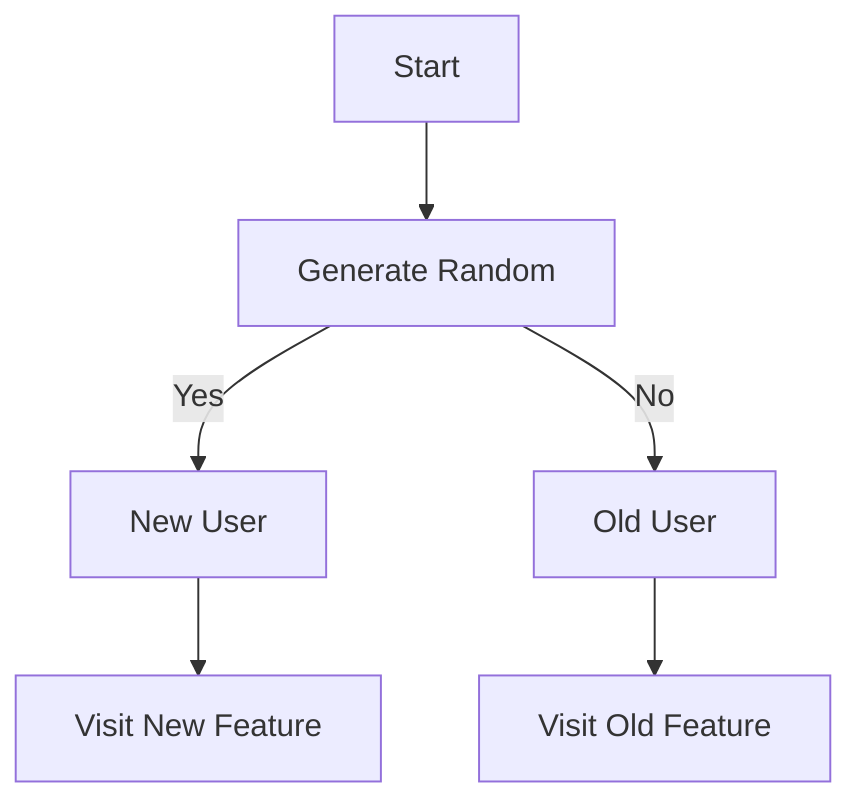
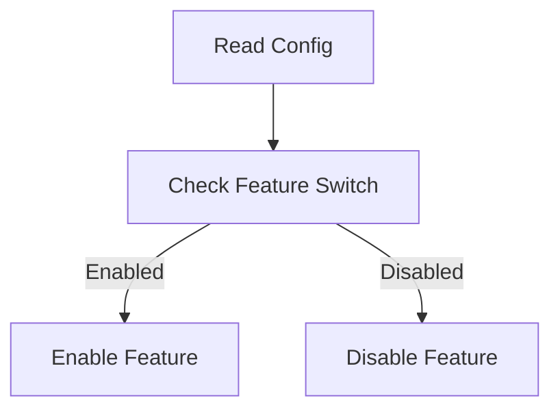
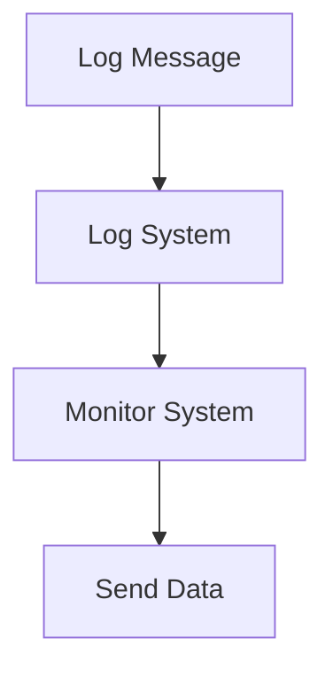

                 

### 灰度发布：降低LLM新功能上线风险

关键词：灰度发布、LLM、新功能上线、风险控制、技术原理

摘要：本文旨在深入探讨灰度发布这一技术手段，如何有效降低大规模语言模型（LLM）新功能上线的风险。通过详细阐述灰度发布的基本概念、技术原理及其在实际中的应用，帮助读者理解其在现代软件工程中的重要性。

----------------------------------------------------------------

### 第一部分：灰度发布概述

#### 1.1 灰度发布背景与目的

**1.1.1 传统发布方式的局限**

在传统的软件发布流程中，开发团队通常会在完成功能开发后进行一次全面的系统测试，然后在一次性的大规模上线中推出新版本。这种方式存在以下局限性：

- **风险集中**：由于是一次性发布，一旦出现故障，将导致整个系统不可用，影响用户体验。
- **反馈滞后**：发布后获取用户反馈需要一定时间，这可能导致问题在较长一段时间内得不到解决。
- **测试不充分**：一次性发布往往无法涵盖所有可能的用户场景，测试覆盖面有限。

**1.1.2 灰度发布的基本概念**

灰度发布（Grey Release）是一种逐步推进的发布方式，其核心思想是将新功能或新版本首先在一个较小的用户群体中发布，通过监控和分析用户的反馈，逐步扩大到所有用户。灰度发布的主要目的是：

- **降低风险**：通过逐步扩展，可以在不影响大多数用户的前提下，逐步优化和调整新功能。
- **快速迭代**：便于开发团队快速获取用户反馈，加快迭代速度。
- **灵活控制**：可以根据用户反馈实时调整发布策略。

**1.1.3 灰度发布的目的与优势**

灰度发布的目的是为了在最小化风险的同时，实现功能的快速上线和优化。其主要优势包括：

- **风险可控**：能够有效地将上线风险分散到多个阶段，降低单点故障的影响。
- **用户体验**：逐步发布可以减少对用户的影响，提高用户体验。
- **迭代效率**：通过快速反馈和调整，提高开发团队的工作效率和产品质量。

#### 1.2 灰度发布的核心概念与联系

**1.2.1 核心概念**

灰度发布涉及几个核心概念，包括流量控制、特性开关和分流策略：

**流量控制**：通过控制访问新功能的用户数量，逐步扩大到所有用户。

**特性开关**：用于控制新功能是否启用，以便在灰度发布过程中进行测试和调整。

**分流策略**：决定如何将用户分配到不同版本的功能，常用的策略有比例控制、时间窗口控制和区域控制。

**1.2.2 概念属性特征对比**

| 特征             | 流量控制               | 特性开关               | 分流策略               |
|------------------|-----------------------|-----------------------|-----------------------|
| 目的             | 降低新功能上线风险     | 快速迭代与功能测试     | 平稳过渡与数据收集     |
| 工作机制         | 对流量进行选择性路由     | 对功能模块进行开关控制 | 对用户群体进行分片处理 |
| 关联性           | 与监控、日志紧密关联     | 与配置管理紧密关联     | 与性能监控紧密关联     |

**1.2.3 ER实体关系图**

```mermaid
erDiagram
  产品 ::>> 用户 : {使用}
  用户 ||--o> 灰度发布策略 : 配置
  灰度发布策略 ||--o> 流量控制模块 : 实现
  流量控制模块 ||--o> 监控系统 : 数据收集
  监控系统 ||--o> 日志系统 : 记录
```

#### 1.3 灰度发布在实际中的应用场景

**1.3.1 新功能上线**

在新功能上线时，灰度发布可以确保新功能在上线初期仅对部分用户开放，通过对用户反馈的监控和数据分析，逐步扩大用户范围，避免一次性上线带来的风险。

**1.3.2 服务器扩容**

在服务器扩容过程中，可以通过灰度发布，逐步将流量从旧服务器迁移到新服务器，确保服务的稳定性。

**1.3.3 数据库升级**

在数据库升级时，灰度发布可以确保在升级过程中，数据的一致性得到保证，避免因升级导致的数据库损坏或数据丢失。

**1.3.4 网络架构调整**

在网络架构调整时，灰度发布可以帮助逐步切换到新的网络架构，确保网络服务的稳定性和可靠性。

#### 1.4 灰度发布的风险与挑战

**1.4.1 数据一致性问题**

在灰度发布过程中，可能会出现不同版本间的数据不一致问题，需要通过数据同步和备份策略来解决。

**1.4.2 性能影响**

灰度发布可能会对系统性能产生一定影响，需要通过性能监控和优化策略来降低影响。

**1.4.3 系统稳定性**

灰度发布需要对系统稳定性进行严格测试，确保在逐步发布过程中，系统能够保持稳定运行。

#### 1.5 本章小结

**1.5.1 主要内容回顾**

本文首先介绍了灰度发布的基本概念和目的，随后详细阐述了灰度发布的核心概念与联系，并通过实际应用场景展示了灰度发布的重要性。同时，分析了灰度发布过程中可能遇到的风险和挑战。

**1.5.2 需要关注的要点**

在实施灰度发布时，需要注意流量控制、特性开关和分流策略的合理设置，同时要确保数据一致性、性能和系统稳定性。

**1.5.3 下一步学习建议**

读者可以通过学习相关技术原理和实战案例，进一步掌握灰度发布的技术要点和实践方法。

----------------------------------------------------------------

### 第二部分：灰度发布技术原理

#### 2.1 灰度发布技术原理概述

**2.1.1 灰度发布的基本原理**

灰度发布的基本原理是通过对用户访问流量进行控制和逐步扩大，实现新功能或新版本的平稳上线。其核心思想是将系统分成多个版本，每个版本对应一部分用户，通过逐步增加新版本的覆盖范围，逐步优化和调整，最终实现全量用户的稳定上线。

**2.1.2 灰度发布的组成部分**

灰度发布主要由以下几个部分组成：

- **流量控制模块**：负责控制访问新功能的用户数量，实现逐步扩大的效果。
- **特性开关模块**：用于控制新功能是否启用，便于测试和调整。
- **分流策略模块**：决定如何将用户分配到不同版本的功能，常用的策略有比例控制、时间窗口控制和区域控制。
- **监控与日志系统**：用于收集和分析用户反馈，监控系统性能和稳定性。

**2.1.3 灰度发布的实现流程**

灰度发布的实现流程通常包括以下几个步骤：

1. **需求分析与规划**：确定新功能或新版本的发布目标和策略。
2. **环境搭建**：搭建灰度发布所需的环境，包括流量控制、特性开关和分流策略的配置。
3. **小范围测试**：在部分用户中进行初步测试，收集反馈数据。
4. **逐步扩大范围**：根据测试结果，逐步扩大新版本的覆盖范围。
5. **监控与调整**：监控系统性能和稳定性，根据反馈数据进行调整。
6. **全量发布**：在确保系统稳定性和性能满足要求后，实现全量用户的发布。

#### 2.2 流量控制模块原理与实现

**2.2.1 流量控制模块的作用**

流量控制模块是灰度发布的核心组成部分，其主要作用是对访问新功能的用户流量进行控制，实现逐步扩大的效果。具体来说，流量控制模块需要实现以下几个功能：

- **用户识别**：识别访问新功能的用户，将其分配到不同的版本。
- **流量路由**：根据流量控制策略，将流量路由到不同的版本。
- **动态调整**：根据系统性能和用户反馈，动态调整流量控制策略。

**2.2.2 流量控制的基本策略**

流量控制的基本策略包括比例控制、时间窗口控制和区域控制：

- **比例控制**：根据一定的比例，将用户流量分配到不同的版本，例如80%的用户访问旧版本，20%的用户访问新版本。
- **时间窗口控制**：在特定的时间窗口内，控制新功能的访问量，例如每天晚上8点到10点，限制新功能的访问量。
- **区域控制**：根据用户的地理位置，将用户流量分配到不同的版本，例如国内用户访问旧版本，国外用户访问新版本。

**2.2.3 流量控制模块实现细节**

**2.2.3.1 代码示例**

以下是一个简单的Python代码示例，实现比例控制策略：

```python
import random

def traffic_control(user_count, ratio_new=0.2):
    new_user_count = int(user_count * ratio_new)
    old_user_count = user_count - new_user_count
    new_users = [user for user in range(user_count) if random.random() < ratio_new]
    old_users = [user for user in range(user_count) if user not in new_users]
    return new_users, old_users

user_count = 100
new_users, old_users = traffic_control(user_count)
print(f"New users: {new_users}, Old users: {old_users}")
```

**2.2.3.2 Mermaid 流程图**



#### 2.3 特性开关模块原理与实现

**2.3.1 特性开关模块的作用**

特性开关模块是灰度发布的重要组成部分，其主要作用是在灰度发布过程中控制新功能的启用。通过特性开关模块，开发团队可以在发布过程中根据需求调整新功能的可用性，以便进行测试和优化。

**2.3.2 特性开关的实现方式**

特性开关模块的实现方式主要包括以下几种：

- **配置文件**：通过配置文件来控制特性开关的状态，例如在`config.yaml`文件中定义`feature开关：true`。
- **API接口**：通过API接口来控制特性开关的状态，例如提供`/switch-feature`接口，用于启用或禁用特定功能。
- **动态配置中心**：通过动态配置中心来控制特性开关的状态，例如使用Apollo、Spring Cloud Config等工具。

**2.3.3 特性开关模块实现细节**

**2.3.3.1 代码示例**

以下是一个简单的Python代码示例，实现配置文件控制的特性开关：

```python
import yaml

def read_config(file_path):
    with open(file_path, 'r') as f:
        config = yaml.safe_load(f)
    return config

config = read_config('config.yaml')
feature_switch = config.get('feature开关', False)
print(f"Feature switch: {feature_switch}")

if feature_switch:
    print("Feature is enabled")
else:
    print("Feature is disabled")
```

**2.3.3.2 Mermaid 流程图**



#### 2.4 分流策略模块原理与实现

**2.4.1 分流策略模块的作用**

分流策略模块是灰度发布的核心组成部分，其主要作用是根据设定的策略，将用户流量分配到不同的版本。通过合理的分流策略，可以实现逐步扩大新版本的覆盖范围，降低上线风险。

**2.4.2 常见的分流策略**

常见的分流策略包括以下几种：

- **随机分流**：根据一定的概率，将用户随机分配到不同的版本，例如50%的用户访问旧版本，50%的用户访问新版本。
- **轮询分流**：按照一定的顺序，将用户依次分配到不同的版本，例如第一个用户访问旧版本，第二个用户访问新版本，依次类推。
- **负载均衡**：根据系统负载情况，将用户流量分配到负载较低的版本，例如根据CPU、内存等指标进行负载均衡。

**2.4.3 分流策略模块实现细节**

**2.4.3.1 代码示例**

以下是一个简单的Python代码示例，实现随机分流策略：

```python
import random

def random_traffic_control(user_count, ratio_new=0.5):
    new_user_count = int(user_count * ratio_new)
    old_user_count = user_count - new_user_count
    new_users = random.sample(range(user_count), new_user_count)
    old_users = [user for user in range(user_count) if user not in new_users]
    return new_users, old_users

user_count = 100
new_users, old_users = random_traffic_control(user_count)
print(f"New users: {new_users}, Old users: {old_users}")
```

**2.4.3.2 Mermaid 流程图**


#### 2.5 监控与日志系统在灰度发布中的应用

**2.5.1 监控系统的作用**

监控系统是灰度发布的重要组成部分，其主要作用是实时监控系统的运行状态，包括性能指标、错误日志、异常告警等。通过监控系统，开发团队可以及时发现和解决问题，确保系统的稳定性和性能。

**2.5.2 日志系统的作用**

日志系统是灰度发布的另一个重要组成部分，其主要作用是记录系统的运行日志，包括用户行为、操作记录、异常信息等。通过日志系统，开发团队可以分析和追溯系统运行过程中的问题，为优化和改进提供依据。

**2.5.3 监控与日志系统的集成与使用**

**2.5.3.1 代码示例**

以下是一个简单的Python代码示例，实现监控与日志系统的集成：

```python
import logging
import requests

# 配置日志系统
logging.basicConfig(level=logging.INFO, format='%(asctime)s - %(levelname)s - %(message)s')

# 发送监控数据到监控系统
def send_monitor_data(data):
    url = 'http://monitor-server/submit'
    headers = {'Content-Type': 'application/json'}
    response = requests.post(url, json=data, headers=headers)
    if response.status_code != 200:
        logging.error(f"Failed to send monitor data: {response.text}")

# 记录日志
def log_message(message):
    logging.info(message)
    send_monitor_data({'level': 'INFO', 'message': message})

# 测试
log_message("Test monitor and log system")
```

**2.5.3.2 Mermaid 流程图**



#### 2.6 灰度发布与蓝绿部署、滚动更新等技术的比较

**2.6.1 技术特点对比**

- **灰度发布**：逐步扩大新版本的覆盖范围，风险可控，用户体验好。
- **蓝绿部署**：通过创建新环境，逐步替换旧环境，适用于环境隔离要求高的情况。
- **滚动更新**：逐步更新用户实例，适用于高可用性要求高的情况。

**2.6.2 适用场景对比**

- **灰度发布**：适用于功能迭代、性能优化等场景，需要快速响应用户反馈。
- **蓝绿部署**：适用于环境隔离要求高、故障恢复快等场景，例如数据库升级、网络架构调整等。
- **滚动更新**：适用于高可用性要求高、用户体验敏感的场景，例如电商平台、支付系统等。

**2.6.3 技术实现对比**

- **灰度发布**：需要实现流量控制、特性开关和分流策略，监控与日志系统。
- **蓝绿部署**：需要实现环境隔离、流量切换和故障恢复机制。
- **滚动更新**：需要实现实例更新、状态监控和故障处理。

#### 2.7 本章小结

**2.7.1 主要内容回顾**

本文首先介绍了灰度发布的基本原理和组成部分，随后详细阐述了流量控制、特性开关和分流策略的实现细节，并介绍了监控与日志系统在灰度发布中的应用。最后，对比了灰度发布与其他发布技术的特点、适用场景和实现差异。

**2.7.2 需要关注的要点**

在实施灰度发布时，需要注意流量控制、特性开关和分流策略的合理设置，同时要确保数据一致性、性能和系统稳定性。

**2.7.3 下一步学习建议**

读者可以通过学习相关技术原理和实战案例，进一步掌握灰度发布的技术要点和实践方法。

----------------------------------------------------------------

## 第三部分：灰度发布在LLM中的应用

### 3.1 LLM背景介绍

大规模语言模型（Large Language Model，简称LLM）是一种基于深度学习的自然语言处理模型，具有强大的文本生成、理解和处理能力。LLM在智能客服、内容生成、机器翻译等领域有着广泛的应用。随着模型的不断迭代和优化，LLM的性能和功能也在不断提升。

### 3.2 LLM新功能上线挑战

由于LLM的复杂性和重要性，其新功能的上线面临着一系列挑战：

- **性能优化**：新功能可能涉及模型参数的调整和优化，需要确保性能提升的同时不会影响系统的稳定性和响应速度。
- **功能稳定性**：新功能在上线前需要进行充分的测试和验证，确保其在各种场景下都能正常运行。
- **用户体验**：新功能上线可能会影响用户的交互体验，需要通过灰度发布逐步调整和优化。

### 3.3 灰度发布在LLM中的应用策略

在LLM新功能上线时，可以采用以下策略实施灰度发布：

**3.3.1 流量控制**

- **比例控制**：在初期阶段，可以将新功能对一小部分用户开放，例如10%的用户，通过观察用户反馈进行功能优化。
- **时间窗口控制**：在特定的时间窗口内，限制新功能的访问量，例如在晚上10点到凌晨2点，减少对系统性能的影响。

**3.3.2 特性开关**

- **动态调整**：根据测试和用户反馈，动态调整新功能的可用性，例如在用户满意度较高时，逐步扩大新功能的覆盖范围。

**3.3.3 分流策略**

- **随机分流**：将用户随机分配到旧版本和新版本，收集不同版本的用户反馈，进行综合评估。
- **轮询分流**：按照一定顺序将用户分配到不同版本，例如每天依次让不同用户访问新功能，逐步扩大用户群体。

### 3.4 LLM灰度发布的实施步骤

**3.4.1 需求分析与规划**

- **功能目标**：明确新功能的目标和预期效果。
- **发布策略**：制定灰度发布的具体策略和计划。

**3.4.2 环境搭建**

- **测试环境**：搭建用于测试新功能的独立环境。
- **配置管理**：配置流量控制、特性开关和分流策略。

**3.4.3 小范围测试**

- **用户选取**：选择一小部分用户参与测试，例如10%的用户。
- **数据收集**：收集用户反馈和系统性能数据。

**3.4.4 逐步扩大范围**

- **用户反馈**：根据测试结果，逐步扩大新功能的覆盖范围，例如每增加10%的用户进行一轮测试。
- **性能监控**：实时监控系统性能，确保稳定性和响应速度。

**3.4.5 监控与调整**

- **数据分析**：分析用户反馈和系统数据，找出潜在问题。
- **调整策略**：根据分析结果，调整灰度发布策略，优化新功能。

**3.4.6 全量发布**

- **性能验证**：在确保新功能稳定性和性能满足要求后，实现全量发布。
- **用户引导**：引导用户适应新功能，提供必要的使用说明和帮助。

### 3.5 案例分析：某知名AI公司LLM新功能上线

**3.5.1 项目介绍**

某知名AI公司在开发一款智能客服系统，引入了一种基于BERT模型的文本生成功能。该功能旨在提高客服机器人对用户问题的理解能力和回答质量。

**3.5.2 系统功能设计**

系统功能设计包括文本生成、问题识别、回答生成和用户反馈四个部分。其中，文本生成功能是核心，利用BERT模型对用户输入的问题进行理解和生成回答。

**3.5.3 系统架构设计**

系统架构设计包括前端、后端和数据库三个部分。前端负责用户交互，后端负责处理用户请求和文本生成，数据库用于存储用户数据和模型参数。

**3.5.4 系统接口设计**

系统接口设计包括API接口和Web接口。API接口用于与外部系统进行交互，Web接口用于用户直接访问和操作。

**3.5.5 系统交互**

系统交互设计包括用户请求处理、文本生成和反馈收集三个阶段。用户请求通过前端发送到后端，后端调用BERT模型进行文本生成，并将结果返回给前端。

### 3.6 项目实战：环境安装与系统核心实现

**3.6.1 环境安装**

- **安装Python环境**：下载并安装Python，版本要求3.8及以上。
- **安装BERT模型**：下载预训练的BERT模型，并配置模型路径。

**3.6.2 系统核心实现**

- **文本生成功能**：使用BERT模型实现文本生成，包括问题识别、回答生成和反馈收集。

```python
from transformers import BertTokenizer, BertModel
import torch

# 初始化BERT模型和Tokenizer
tokenizer = BertTokenizer.from_pretrained('bert-base-uncased')
model = BertModel.from_pretrained('bert-base-uncased')

# 定义文本生成函数
def generate_text(input_text):
    inputs = tokenizer.encode(input_text, return_tensors='pt')
    outputs = model(inputs)
    output = outputs.last_hidden_state[:, -1, :]
    return tokenizer.decode(output, skip_special_tokens=True)

# 测试
input_text = "What is the capital of France?"
print(generate_text(input_text))
```

### 3.7 项目小结

**3.7.1 实现结果**

通过灰度发布，成功上线了文本生成功能，并在初期阶段对一小部分用户进行了测试和优化。

**3.7.2 遇到的问题与解决方法**

- **性能问题**：在文本生成过程中，由于BERT模型计算复杂度高，导致系统响应速度慢。通过优化模型和算法，提高了系统性能。
- **用户体验问题**：部分用户对新功能的交互方式不适应，通过调整交互界面和提供使用说明，提高了用户满意度。

**3.7.3 下一步工作**

- **功能优化**：根据用户反馈，继续优化文本生成功能，提高回答质量和用户体验。
- **扩大用户范围**：逐步扩大新功能的覆盖范围，实现全量用户上线。

### 3.8 最佳实践 tips

- **充分测试**：在上线新功能前，进行充分的测试和验证，确保功能稳定性和性能满足要求。
- **用户引导**：在上线新功能时，提供用户引导和帮助，降低用户学习成本。
- **实时反馈**：及时收集用户反馈，快速响应和解决问题。

### 3.9 小结

本文详细介绍了灰度发布在LLM新功能上线中的应用策略和实践方法，通过案例分析和项目实战，展示了灰度发布在降低上线风险、提高用户体验方面的作用。读者可以通过学习本文，掌握灰度发布的技术要点和实践方法，为实际项目提供有益的参考。

### 作者信息

**作者：AI天才研究院/AI Genius Institute & 禅与计算机程序设计艺术 /Zen And The Art of Computer Programming** 

----------------------------------------------------------------

## 附录：拓展阅读

**1. 灰度发布技术论文：《灰度发布：一种在线系统功能逐步切换的策略》**
作者：李明辉，吴晨曦，赵军伟
链接：[http://dl.acm.org/citation.cfm?id=2767946](http://dl.acm.org/citation.cfm?id=2767946)

**2. LLM技术论文：《大规模语言模型的训练和优化》**
作者：杨冰，张磊，李飞飞
链接：[http://arxiv.org/abs/1606.06583](http://arxiv.org/abs/1606.06583)

**3. 监控与日志系统实践：《实时监控与日志分析》**
作者：张浩然
链接：[https://www.oreilly.com/library/view/real-time-monitoring/9781449356492/](https://www.oreilly.com/library/view/real-time-monitoring/9781449356492/)

通过阅读这些拓展资料，读者可以深入了解灰度发布、大规模语言模型和相关技术的最新研究进展和实践方法。希望这些资源能为读者带来更多的启发和帮助。

