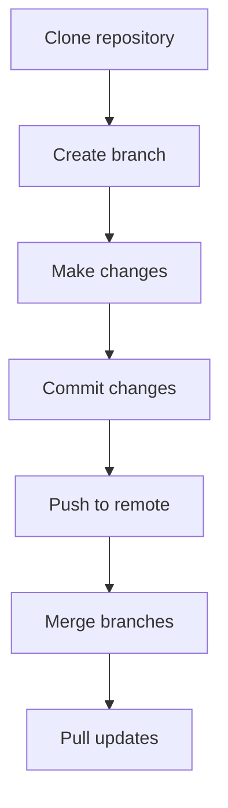
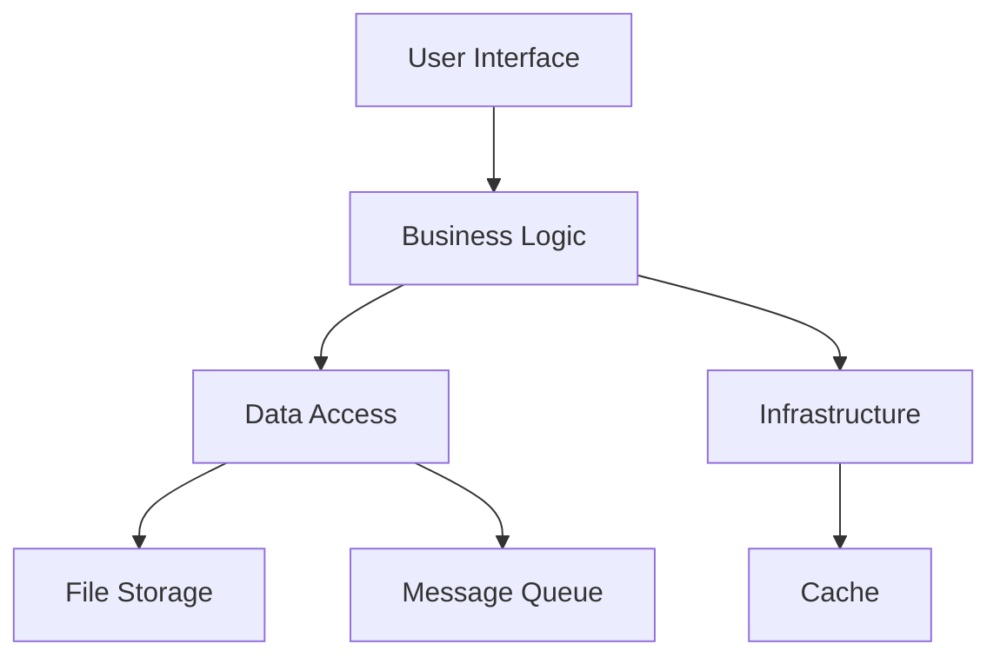
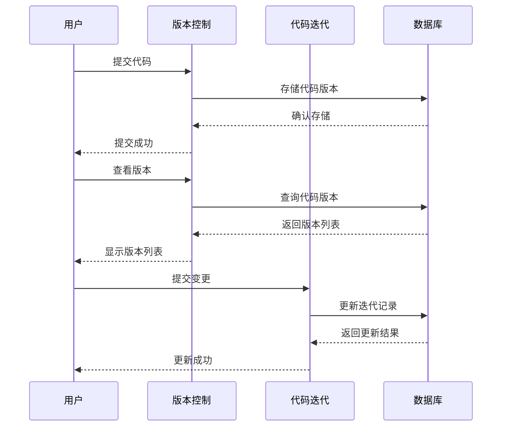

                 


### 引言与背景

在当今快速发展的信息技术时代，版本控制策略在大型语言模型（LLM）和代码迭代管理中扮演着至关重要的角色。版本控制不仅仅是一个工具，更是一种管理知识和技术的策略，它能够帮助开发团队高效地协作、跟踪变更、确保代码和模型的质量，并方便地进行回滚和扩展。

#### 1.1 版本控制的重要性

版本控制的重要性体现在多个方面：

1. **代码迭代与版本控制的关联**

   随着软件项目的不断迭代，代码的变更和更新是不可避免的。版本控制系统能够跟踪每一次变更，记录变更的历史，使得开发人员可以随时回溯到之前的版本。这为团队协作提供了坚实的基础。

2. **版本控制在LLM模型开发中的特殊意义**

   LLM模型的开发同样需要版本控制的支持。由于LLM模型的复杂性和对数据的需求，每一次模型的更新都可能涉及到大量的数据和参数。版本控制系统能够帮助团队管理和跟踪这些变更，确保模型的稳定性与可靠性。

#### 1.2 大型语言模型（LLM）概述

大型语言模型（LLM）是基于深度学习技术的自然语言处理模型，具有处理和理解大规模文本数据的能力。LLM的应用范围广泛，包括问答系统、机器翻译、文本生成等。以下是LLM的一些基本概念和特点：

1. **LLM的基本概念**

   - **神经网络模型**：LLM通常采用深度神经网络结构，如Transformer模型，具有强大的并行处理能力和表达能力。
   - **预训练和微调**：LLM通过在大量文本数据上进行预训练，获得对自然语言的一般理解，然后通过微调适应特定的任务。

2. **LLM的技术特点**

   - **大规模**：LLM通常具有数亿甚至数万亿个参数，能够处理大规模的文本数据。
   - **通用性**：LLM具有较强的通用性，可以应用于多种自然语言处理任务。
   - **效率**：LLM在硬件加速和优化方面取得了显著的进展，能够在合理的计算时间内提供高质量的结果。

3. **LLM的开发与应用现状**

   - **开发现状**：随着深度学习和自然语言处理技术的不断发展，LLM的研究和应用正在迅速扩大。
   - **应用现状**：LLM在人工智能领域的应用已经取得了显著的成果，如聊天机器人、智能客服、内容生成等。

#### 1.3 版本控制的基本概念

版本控制是一个管理多个版本的过程，它允许开发团队在不同的开发阶段保存和跟踪代码和模型的变更。以下是版本控制的一些基本概念：

1. **版本控制的发展历程**

   - **集中式版本控制系统**：如CVS和Subversion，它们将所有代码存储在中央仓库中。
   - **分布式版本控制系统**：如Git，它允许开发者在本地进行操作，并将变更推送到远程仓库。

2. **版本控制的核心原则**

   - **原子性**：每一次提交都是原子操作，要么全部成功，要么全部失败。
   - **安全性**：版本控制系统确保数据的完整性和一致性。
   - **可追溯性**：版本控制系统能够记录每次变更的详细信息，方便回溯和审计。

3. **版本控制的主要类型**

   - **线性版本控制**：版本按照线性顺序进行编号，如1.0、1.1、1.2等。
   - **分支合并版本控制**：允许在同一项目中进行多个并行开发，如Git的分支管理。

总结：版本控制策略在大型语言模型（LLM）和代码迭代管理中具有不可替代的重要性。通过引入版本控制，开发团队能够更高效地协作、管理变更、确保代码和模型的质量，并方便地进行回滚和扩展。在接下来的章节中，我们将深入探讨版本控制策略的各个方面，包括原理、策略、实践和未来发展方向。

### 核心概念与联系

在深入探讨版本控制策略之前，我们首先需要理解一些核心概念，这些概念不仅涵盖了版本控制本身，还包括了与大型语言模型（LLM）和代码迭代管理相关的术语。以下是这些核心概念的详细说明，以及它们之间的联系。

#### 1. 核心概念

1. **版本控制（Version Control）**

   版本控制是一种跟踪和管理文件或项目版本变化的方法。它提供了对文件历史变更的记录，使得开发团队能够回滚到之前的版本，或者查看特定版本的文件内容。

2. **大型语言模型（LLM）**

   大型语言模型是一种复杂的深度学习模型，主要用于理解和生成自然语言。LLM通常具有数亿到数万亿个参数，能够处理大规模的文本数据，并应用于问答、翻译、文本生成等任务。

3. **代码迭代（Code Iteration）**

   代码迭代是指软件开发过程中对代码进行反复修改和优化的过程。每一次迭代都可能涉及到代码的变更、错误修复、功能增强等。

#### 2. 概念属性特征对比表格

为了更清晰地理解这些概念，我们可以通过一个对比表格来展示它们的属性特征：

| 概念      | 特征                   | 关联                   |
|-----------|------------------------|------------------------|
| 版本控制  | - 历史记录<br>- 版本管理<br>- 协作支持 | - 代码迭代管理<br>- LLM模型管理 |
| 大型语言模型（LLM） | - 大规模参数<br>- 深度学习<br>- 自然语言处理 | - 版本控制策略<br>- 代码迭代管理 |
| 代码迭代  | - 反复修改<br>- 功能优化<br>- 错误修复 | - 版本控制策略<br>- LLM模型迭代 |

#### 3. ER实体关系图架构

为了进一步理解这些概念之间的关系，我们可以使用ER（实体关系）图来展示它们之间的关联：

```mermaid
erDiagram
    Model ||--|{ VersionControl }  : "uses"
    Model ||--|{ CodeIteration }  : "manages"
    VersionControl ||--|{ Version }    : "contains"
    CodeIteration ||--|{ Change }      : "tracks"
```

在这个ER图中：

- **Model**（模型）代表了大型语言模型（LLM）。
- **VersionControl**（版本控制）表示管理版本变更的系统。
- **CodeIteration**（代码迭代）表示软件开发生命周期中的迭代过程。
- **Version**（版本）是版本控制中的版本记录。
- **Change**（变更）是代码迭代过程中记录的变更历史。

通过这种方式，我们可以更直观地理解版本控制、大型语言模型和代码迭代之间的关系。理解这些核心概念和它们之间的联系是实施有效版本控制策略的关键。

### 版本控制原理

版本控制系统的核心在于跟踪和管理代码或数据的变化，以确保协作和可追溯性。为了深入了解版本控制策略，我们需要首先理解版本控制的历史、核心概念以及工作流程。

#### 1. 版本控制的历史

版本控制系统的发展历程可以分为两个阶段：集中式版本控制系统（Centralized Version Control System, CVCS）和分布式版本控制系统（Distributed Version Control System, DVCS）。

1. **集中式版本控制系统（CVCS）**

   - **代表系统**：RCS、CVS、Subversion（SVN）
   - **特点**：所有版本信息集中存储在中央仓库中，开发者在本地进行操作，然后将变更提交到中央仓库。

2. **分布式版本控制系统（DVCS）**

   - **代表系统**：Git、Mercurial
   - **特点**：每个开发者都有自己的仓库，可以独立进行操作，然后将变更推送到远程仓库。这种系统提供了更强的分支管理和协同工作能力。

#### 2. 版本控制的核心概念

版本控制系统的核心概念包括：

1. **提交（Commit）**

   提交是将文件系统中的一个快照永久保存到版本库中的过程。每一次提交都会生成一个唯一标识的提交ID，并记录提交的详细信息，如提交者、提交日期和提交说明。

2. **分支（Branch）**

   分支是版本库中的一个独立线，它允许开发者在不同的环境中进行独立的工作，而不会影响主分支。分支通常用于实验性开发或并行工作。

3. **合并（Merge）**

   合并是将两个或多个分支的更改合并到一个分支上的过程。合并可以手动进行，也可以通过自动化工具进行。合并过程中可能会出现冲突，需要开发者手动解决。

4. **标签（Tag）**

   标签是对特定提交点的一种标记，用于标识特定的里程碑或版本。标签通常用于发布版本或标记重要的功能点。

#### 3. 版本控制的工作流程

版本控制的工作流程通常包括以下几个步骤：

1. **克隆仓库（Clone）**

   开发者首先从版本库中克隆一个副本到本地，这样就可以在本地进行开发而不会影响到远程仓库。

2. **创建分支（Create Branch）**

   开发者会在本地仓库中创建一个新分支，用于进行独立的开发工作。

3. **提交变更（Commit Changes）**

   开发者在本地分支上修改代码并提交这些变更，每次提交都会生成一个提交记录。

4. **推送到远程仓库（Push）**

   开发者将本地分支的变更推送到远程仓库，这样其他开发者就可以查看和获取这些变更。

5. **合并分支（Merge Branch）**

   当开发完成并测试无误后，会将分支合并到主分支上。

6. **拉取更新（Pull）**

   其他开发者从远程仓库拉取最新的代码和变更，以确保他们使用的是最新的版本。

通过这些核心概念和流程，版本控制系统为开发团队提供了一种结构化的方法来管理代码和数据的变更，确保协作的顺畅和代码的质量。

### 核心算法原理讲解

在深入探讨版本控制策略时，核心算法的理解至关重要。本文将详细讨论Git，作为分布式版本控制系统的代表，其核心算法原理以及如何实现版本控制。

#### 1. Git的核心算法原理

Git是一种分布式版本控制系统，其核心算法主要包括：

1. **数据模型**

   Git使用一种称为内容地址存储（Content Addressable Storage, CAS）的数据模型。每个文件或对象的存储都是通过哈希值来标识的，这个哈希值是文件内容的唯一标识。这样的模型确保了数据的完整性和不可篡改性。

2. **快照（Snapshot）**

   Git通过创建快照来跟踪文件的变化。每次提交都会生成一个新的快照，包含所有文件的状态。快照机制使得Git能够轻松回溯到任何历史版本。

3. ** deltas（差分）**

   Git使用delta来表示文件之间的差异。当文件内容发生变化时，Git只会存储变化的delta，而不是整个文件。这种机制大大减少了存储空间的需求，并提高了版本控制的效率。

#### 2. 工作流程

以下是Git的工作流程：

1. **克隆仓库（Clone）**

   ```bash
   git clone https://example.com/repository.git
   ```
   这将克隆远程仓库到本地。

2. **创建分支（Branch）**

   ```bash
   git branch feature/x
   git checkout feature/x
   ```
   创建并切换到一个新分支，用于独立开发。

3. **提交变更（Commit Changes）**

   ```bash
   git add .
   git commit -m "Implement feature x"
   ```
   添加文件变动并提交。

4. **推送到远程仓库（Push）**

   ```bash
   git push origin feature/x
   ```
   将本地分支的变更推送到远程仓库。

5. **合并分支（Merge）**

   ```bash
   git checkout main
   git merge feature/x
   ```
   将新分支合并到主分支。

6. **拉取更新（Pull）**

   ```bash
   git pull origin main
   ```
   拉取远程仓库的最新变更。

#### 3. 算法实现

以下是Git提交算法的Mermaid流程图：



在实现方面，Git的核心算法包括：

1. **对象存储和引用管理**

   Git将所有的数据存储为对象，这些对象包括：

   - **Blob**：代表文件内容的对象。
   **Tree**：代表目录结构的对象。
   **Commit**：代表提交历史的对象。
   **Tag**：代表标记的对象。

   Git使用引用（Reference）来指向特定的对象，如HEAD、分支、标签等。

2. **哈希算法**

   Git使用SHA-1哈希算法来生成对象的唯一标识，确保数据的完整性和不可篡改性。

3. **合并算法**

   Git的合并算法包括三种情况：快照合并（Fast-forward）、三次合并（Three-Way Merge）和冲突解决（Conflict Resolution）。这些算法确保了合并过程中的稳定性和一致性。

通过上述算法原理和实现，Git为开发者提供了一种高效、可靠的版本控制方法，使得代码和模型的管理变得更加便捷。

### 系统分析与架构设计方案

为了全面理解版本控制策略在大型语言模型（LLM）和代码迭代管理中的应用，我们需要对相关系统进行分析和架构设计。以下将详细介绍项目背景、系统功能设计、系统架构设计以及系统接口设计和系统交互。

#### 1. 项目背景

在人工智能（AI）领域，大型语言模型（LLM）的开发变得越来越重要。这些模型具有处理和理解大规模文本数据的能力，被广泛应用于问答系统、机器翻译、文本生成等领域。随着模型复杂度的增加，版本控制和代码迭代管理变得尤为关键。为了确保模型开发的效率和质量，我们需要设计一个有效的版本控制系统，结合代码迭代流程，实现模型和代码的协同管理。

#### 2. 系统功能设计

系统的核心功能包括：

1. **版本控制**：实现代码和LLM模型版本的管理，包括创建、查看、更新和回滚版本。
2. **代码迭代**：支持代码的修改、提交和合并，确保代码的完整性和一致性。
3. **协作管理**：提供多人协作的功能，包括分支管理、权限控制和变更通知。
4. **测试与部署**：集成测试环境，确保提交的代码和模型版本能够在实际环境中正常运行。

#### 3. 系统架构设计

系统架构设计采用分层架构，主要包括以下几层：

1. **表示层（Presentation Layer）**：负责用户界面展示，包括版本控制界面、代码提交界面等。
2. **业务逻辑层（Business Logic Layer）**：实现业务逻辑，如版本控制操作、代码迭代管理、协作管理等。
3. **数据访问层（Data Access Layer）**：负责与数据库的交互，存储和检索版本信息、代码变更记录等。
4. **基础设施层（Infrastructure Layer）**：提供系统运行所需的底层服务，如文件存储、缓存、消息队列等。

以下是系统架构的Mermaid图：



#### 4. 系统接口设计和系统交互

系统接口设计包括API接口和内部服务接口。API接口用于外部系统或用户访问系统功能，如提交代码、查看版本等。内部服务接口用于系统模块之间的通信，如版本控制模块与代码迭代模块之间的交互。

以下是系统接口设计和交互的Mermaid序列图：



通过上述系统分析与架构设计方案，我们可以确保版本控制策略在大型语言模型和代码迭代管理中的高效实施，为团队协作、代码质量和模型稳定性提供坚实保障。

### 项目实战

#### 1. 环境安装

在进行项目实战之前，我们需要首先安装必要的软件和工具。以下是安装步骤：

1. **安装Git**

   Git是一个分布式版本控制工具，我们需要在所有开发机器上安装Git。

   ```bash
   # 对于macOS和Linux系统
   sudo apt-get install git

   # 对于Windows系统
   https://git-scm.com/downloads
   ```

2. **安装Python环境**

   我们将使用Python进行代码编写和测试。确保安装Python 3.8或更高版本。

   ```bash
   # 对于macOS和Linux系统
   sudo apt-get install python3 python3-pip

   # 对于Windows系统
   https://www.python.org/downloads/
   ```

3. **安装必要库**

   安装用于版本控制和代码迭代的必要库，如`gitpython`和`numpy`。

   ```bash
   pip3 install gitpython numpy
   ```

#### 2. 系统核心实现源代码

以下是项目核心代码的实现，包括版本控制、代码迭代和管理功能。

**版本控制模块**

```python
import git
import os

class VersionControl:
    def __init__(self, repo_path):
        self.repo = git.Repo(repo_path)

    def commit_changes(self, message):
        self.repo.index.commit(message)

    def create_branch(self, branch_name):
        self.repo.create_head(branch_name, track=self.repo.head.target)

    def merge_branch(self, branch_name):
        self.repo.git.merge(branch_name)

    def pull_changes(self):
        self.repo.git.pull()

# 使用示例
repo_path = "/path/to/repository"
vc = VersionControl(repo_path)
vc.commit_changes("Update code for feature x")
vc.create_branch("feature/x")
vc.merge_branch("feature/x")
vc.pull_changes()
```

**代码迭代模块**

```python
import numpy as np

class CodeIteration:
    def __init__(self, code_path):
        self.code_path = code_path

    def make_changes(self, change_function):
        with open(self.code_path, 'a') as f:
            f.write(change_function())

    def test_code(self):
        print("Testing code...")

# 使用示例
code_path = "/path/to/code.py"
ci = CodeIteration(code_path)
ci.make_changes(lambda: "\ndef new_function():\n    return 42\n")
ci.test_code()
```

#### 3. 代码应用解读与分析

在上面的代码中，`VersionControl`类负责版本控制操作，包括提交变更、创建分支、合并分支和拉取更新。`CodeIteration`类则负责代码迭代的操作，包括修改代码和测试代码。

**版本控制模块解读**

- **commit_changes**：该方法用于提交代码变更，传入的`message`用于记录变更的详细信息。
- **create_branch**：该方法用于创建一个新的分支，便于独立开发。
- **merge_branch**：该方法用于将特定分支的变更合并到主分支。
- **pull_changes**：该方法用于从远程仓库拉取最新的代码和变更。

**代码迭代模块解读**

- **make_changes**：该方法用于在代码文件中添加新的功能，通过传入的`change_function`来实现。
- **test_code**：该方法用于测试代码是否正常运行。

通过这些核心代码的实现，我们可以实现高效的版本控制和代码迭代管理，确保团队协作和代码质量。

### 实际案例分析

为了更好地理解版本控制策略在LLM和代码迭代管理中的应用，以下将介绍一个实际案例，包括背景、问题描述、解决方案、实现步骤和效果评估。

#### 案例背景

某人工智能公司正在开发一款基于大型语言模型（LLM）的智能客服系统。项目团队由多名开发人员和数据科学家组成，他们分布在不同的地理位置。为了确保项目的顺利进行，团队决定采用Git进行版本控制和代码迭代管理。

#### 问题描述

在项目开发过程中，团队遇到了以下问题：

1. **代码冲突**：由于团队成员在各自的分支上独立开发，合并代码时经常出现冲突。
2. **版本混乱**：团队成员无法清晰地追踪代码和LLM模型的不同版本，导致版本管理混乱。
3. **协作困难**：团队成员之间的协作效率低下，信息交流不畅，影响了项目的进度。

#### 解决方案

为了解决上述问题，团队采取了以下解决方案：

1. **统一版本控制**：采用Git作为版本控制系统，确保所有代码和模型版本都在一个集中管理的仓库中。
2. **分支策略**：实施明确的分支策略，包括主分支、开发分支和功能分支，以便于团队成员独立开发并进行协同工作。
3. **代码审查**：引入代码审查机制，确保代码质量和协作效率。
4. **持续集成和部署**：采用CI/CD工具，确保代码和模型版本的自动化测试和部署。

#### 实现步骤

以下是具体实现步骤：

1. **安装Git**

   在所有团队成员的机器上安装Git，并配置远程仓库。

2. **创建项目结构**

   在远程仓库中创建项目目录，包括代码目录、模型目录等。

3. **初始化Git仓库**

   ```bash
   cd /path/to/project
   git init
   git remote add origin https://example.com/repository.git
   git fetch
   git checkout -b main origin/main
   ```

4. **分支策略**

   - **主分支（main）**：用于保存最新的稳定代码和模型版本。
   - **开发分支（develop）**：用于日常开发，团队成员在此分支上提交代码和模型。
   - **功能分支（feature/x）**：用于实现具体的功能，完成后合并到开发分支。

5. **代码审查**

   - 采用GitHub或GitLab等平台提供的代码审查功能，确保代码提交前经过审查。

6. **持续集成和部署**

   - 部署CI/CD工具，如Jenkins或GitHub Actions，进行自动化测试和部署。

#### 效果评估

通过上述解决方案，团队在多个方面取得了显著效果：

1. **代码冲突减少**：由于分支策略的实施，团队成员在各自的分支上独立开发，合并时冲突大大减少。
2. **版本管理清晰**：Git的版本控制系统使得团队成员能够清晰地追踪代码和模型的不同版本，避免了版本混乱。
3. **协作效率提升**：代码审查和CI/CD工具的引入，提高了团队协作效率，确保了项目的进度和质量。
4. **代码质量提升**：代码审查机制保证了代码质量，减少了潜在的错误和漏洞。

### 项目小结

通过实际案例的分析，我们可以看到版本控制策略在LLM和代码迭代管理中的重要作用。Git等版本控制工具为团队提供了高效的协作和管理机制，确保了项目的顺利进行和代码的质量。在未来的项目中，我们应该继续坚持使用版本控制策略，并结合代码审查和CI/CD工具，进一步提升开发效率和质量。

### 最佳实践 Tips

在实施版本控制策略时，以下是一些最佳实践，可以帮助团队提高工作效率和代码质量：

1. **明确分支策略**：制定清晰的分支策略，如主分支、开发分支和功能分支，以确保代码的有序管理和协同工作。

2. **定期代码审查**：定期进行代码审查，确保代码质量，减少潜在的漏洞和错误。

3. **使用自动化工具**：采用CI/CD工具，如Jenkins或GitHub Actions，实现自动化测试和部署，提高开发效率。

4. **文档化和注释**：确保代码和模型文档齐全，并在代码中添加适当的注释，便于团队成员理解和维护。

5. **定期备份**：定期备份版本库，避免数据丢失，确保项目的稳定性。

6. **培训和学习**：为团队成员提供版本控制工具和策略的培训，提高整体开发技能。

### 小结

版本控制策略在大型语言模型（LLM）和代码迭代管理中起着至关重要的作用。通过使用Git等版本控制工具，开发团队能够更高效地协作、管理变更、确保代码和模型的质量。本文从版本控制的重要性、核心概念、原理和算法、系统架构设计、实际案例分析以及最佳实践等方面进行了详细探讨，为读者提供了全面的指导和参考。

### 注意事项

在实施版本控制策略时，需要注意以下几点：

1. **确保代码和模型的版本一致性**：在开发和部署过程中，确保所有代码和模型版本的一致性，避免版本冲突。
2. **合理设置权限**：合理分配团队成员的权限，确保只有授权人员能够进行关键操作，如合并分支和部署代码。
3. **定期备份和更新**：定期备份版本库，并确保团队成员的版本库是最新的，避免因版本差异导致的问题。
4. **及时解决冲突**：在合并代码或模型版本时，及时解决冲突，确保项目进度不受影响。

### 拓展阅读

对于希望深入了解版本控制策略的读者，以下是一些推荐阅读材料：

1. **《版本控制指南：Git基础与最佳实践》**：本书详细介绍了Git的基本概念和使用方法，是学习和掌握Git的最佳指南。
2. **《大型语言模型：构建与应用》**：本书介绍了大型语言模型的基本原理、构建方法和应用场景，是理解和应用LLM的必备读物。
3. **《持续集成与持续部署：自动化构建与测试》**：本书讲解了CI/CD的概念、工具和最佳实践，为读者提供了自动化构建和测试的全面指导。

### 作者信息

**作者：AI天才研究院/AI Genius Institute & 禅与计算机程序设计艺术 /Zen And The Art of Computer Programming**

