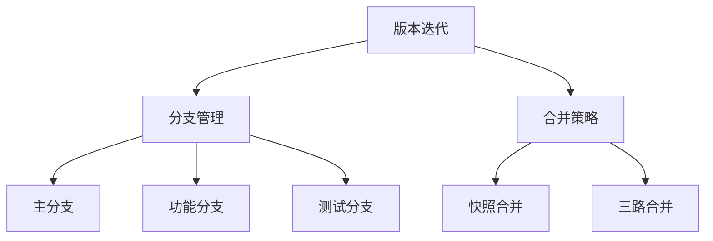
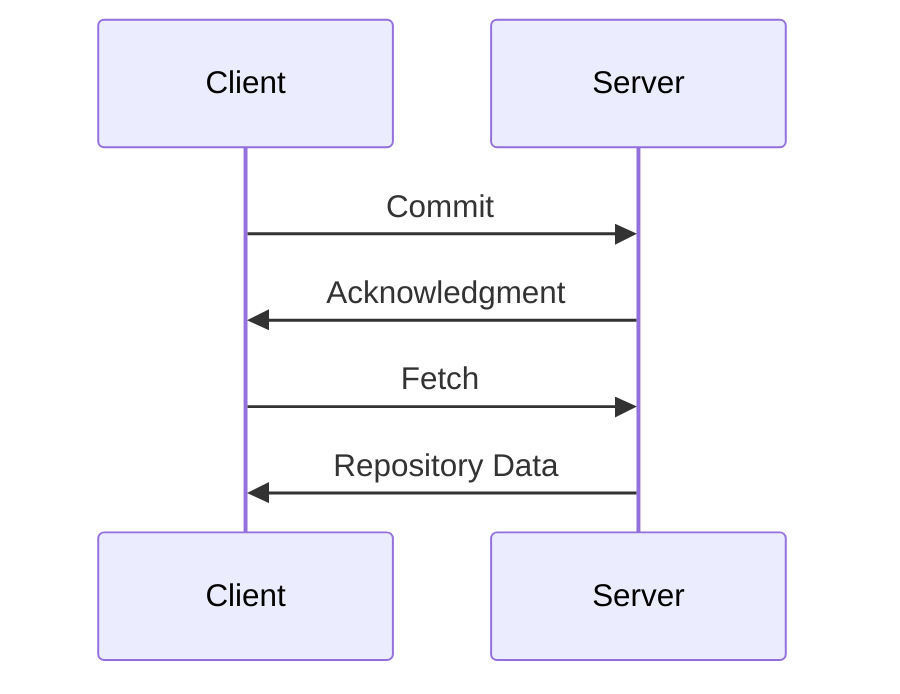

                 

### 深度剖析《版本控制：提示词迭代和管理》

#### 文章标题：《版本控制：提示词迭代和管理》

#### 关键词：版本控制、迭代、管理、提示词、算法、系统架构、项目实战

#### 摘要：

本文将深入探讨版本控制的核心概念，特别是提示词的迭代和管理。通过细致的分析和实例讲解，我们将了解版本控制的基本原理、算法实现、系统架构，以及在实际项目中的应用和最佳实践。文章旨在为IT专业人士提供全面而实用的指南，帮助他们在复杂的项目管理中游刃有余。

## 一、背景介绍

### 1.1 问题背景

随着软件项目的规模和复杂性不断增加，版本控制已成为软件开发过程中的关键环节。版本控制不仅仅是一个工具，它更是项目协作、代码管理和系统演进的核心机制。然而，在版本控制中，提示词的迭代和管理显得尤为重要。提示词是人工智能和自然语言处理领域的重要工具，其准确性和鲁棒性直接影响到系统的性能和用户体验。

### 1.2 版本控制的需求

版本控制的需求源自以下几个关键点：
- **代码管理**：确保代码的完整性和一致性。
- **协作效率**：支持多人在同一项目上协同工作。
- **历史记录**：保留项目的发展轨迹，便于回溯和故障排查。
- **迭代优化**：通过版本的迭代，持续优化和提升系统的功能。

### 1.3 版本控制的历史与发展

版本控制的历史可以追溯到1960年代，当时软件开发的规模相对较小。随着软件项目的复杂性增加，版本控制工具如RCS和CVS逐渐出现，它们为版本管理提供了基本的功能。进入21世纪，Git等分布式版本控制系统的崛起，为版本控制带来了革命性的变化。Git的分布式特性、快速分支合并、强大的变更跟踪功能，使其成为当前最受欢迎的版本控制工具之一。

## 二、核心概念与联系

### 2.1 版本迭代

版本迭代是版本控制的基础，它代表了软件从初始状态到最终状态的演变过程。每一次迭代都会带来功能增强、错误修复或性能优化。

### 2.2 分支管理

分支管理是版本控制的另一个重要组成部分。通过分支，开发人员可以在不影响主分支的情况下独立工作，实现并行开发。

### 2.3 合并策略

合并策略决定了不同分支之间的变更如何合并。正确的合并策略可以避免冲突和代码质量问题。

### 2.4 ER图展示核心概念关系

## 三、算法原理讲解

### 3.1 基本版本管理算法

基本版本管理算法主要包括增删查改操作，这些操作确保了版本库中的数据一致性和完整性。

### 3.2 合并算法详解

合并算法是版本控制系统的核心，Git中的快速合并算法和三路合并算法是其中最具代表性的实现。

### 3.3 数学模型与公式讲解

版本控制中的数学模型主要涉及图论和集合论。例如，版本间的依赖关系可以用有向图表示，而合并过程中的冲突检测和解决可以用集合论中的并集和交集操作来描述。

$$
LCS(A, B) = \begin{cases}
A[i] & \text{if } A[i] = B[i] \\
\min(\max(LCS(A[i-1], B), LCS(A, B[i-1])), LCS(A[i-1], B[i-1])) & \text{otherwise}
\end{cases}
$$

## 四、系统分析与架构设计

### 4.1 版本控制系统工作原理

版本控制系统的工作原理包括版本库的初始化、变更的记录和存储、以及分支和合并操作。

### 4.2 系统架构设计

系统架构设计涉及客户端和服务端的设计，以及版本库和用户交互的接口。

### 4.3 系统接口与交互

系统接口设计决定了用户如何与版本控制系统交互，包括命令行接口和图形用户界面。

## 五、项目实战

### 5.1 环境安装

在实战部分，我们将介绍如何在不同的操作系统上安装版本控制工具。

### 5.2 系统实现

系统实现部分将涵盖从初始化版本库到分支管理，再到合并操作的详细步骤。

### 5.3 代码解读与分析

代码解读与分析将帮助我们理解版本控制工具的内部工作机制。

### 5.4 实际案例剖析

通过实际案例剖析，我们将展示如何应对复杂的版本控制和合并挑战。

### 5.5 项目小结

项目小结部分将对项目实现进行总结，并提出改进建议。

## 六、最佳实践 tips

### 6.1 团队协作最佳实践

团队协作的最佳实践包括代码审查、代码规范和版本命名规范。

### 6.2 项目管理最佳实践

项目管理的最佳实践涉及任务分配、进度控制和风险管理。

### 6.3 安全管理最佳实践

安全管理的最佳实践包括数据备份、权限控制和漏洞修复。

## 七、注意事项

### 7.1 常见问题与解决方案

我们将讨论版本控制中常见的问题，并提供相应的解决方案。

### 7.2 风险评估与防范

风险评估与防范是确保版本控制系统稳定运行的重要环节。

## 八、拓展阅读与资源推荐

### 8.1 相关书籍推荐

推荐一些关于版本控制和软件工程的经典书籍。

### 8.2 在线资源和工具推荐

介绍一些实用的在线资源和工具，帮助读者深入了解版本控制。

### 8.3 学术论文和报告推荐

推荐一些关于版本控制的研究论文和报告，以拓展读者的知识面。

## 九、作者信息

作者：AI天才研究院/AI Genius Institute & 禅与计算机程序设计艺术 /Zen And The Art of Computer Programming

---

通过上述九个章节的深入分析，本文旨在为读者提供一部全面而系统的版本控制指南，帮助他们在实际工作中更好地管理和迭代提示词，确保软件项目的顺利进行。

