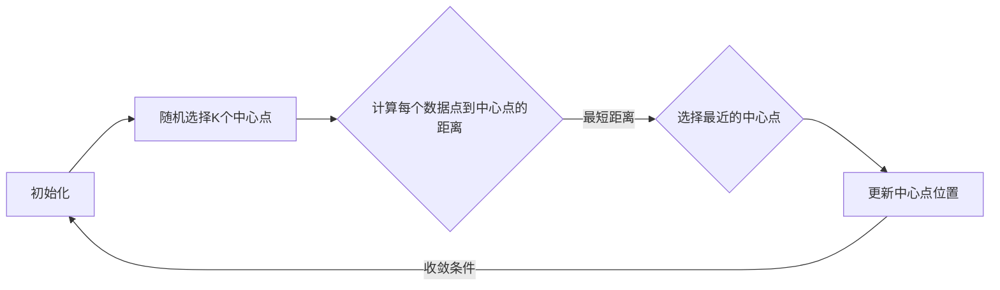
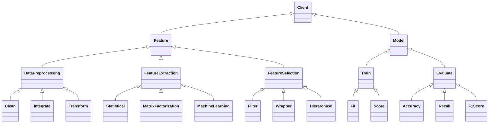
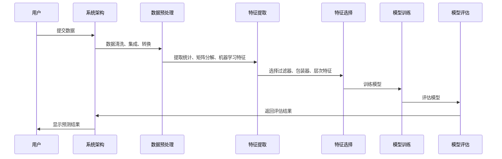
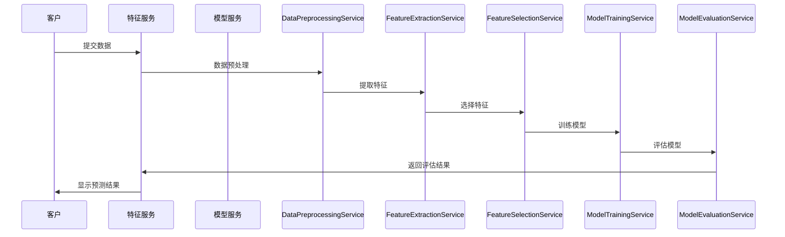

                 


# 特征工程自动化：加速AI模型迭代的关键技术

关键词：特征工程、自动化、AI模型、迭代、关键技术

摘要：随着人工智能技术的快速发展，特征工程在AI模型训练中扮演着至关重要的角色。然而，传统手动特征工程方法繁琐且易出错。特征工程自动化作为解决这一问题的关键技术，能够大幅提升模型训练效率，加速AI模型迭代。本文将详细探讨特征工程自动化的背景、重要性、技术基础、工具与平台、自动化流程、挑战与未来趋势，并通过实际案例研究展示其在各行业的应用。

## 目录大纲

1. **特征工程自动化概述**
   1.1 特征工程的发展历程
   1.2 特征工程在AI模型训练中的作用
   1.3 特征工程自动化的必要性

2. **特征工程自动化技术基础**
   2.1 数据预处理技术
   2.2 特征提取技术
   2.3 特征选择技术

3. **特征工程自动化工具与平台**
   3.1 自动特征工程工具概述
   3.2 自动特征工程平台比较
   3.3 特征工程自动化工具的实际应用

4. **特征工程自动化流程**
   4.1 自动化流程设计原则
   4.2 自动化流程实现步骤
   4.3 自动化流程优化方法

5. **特征工程自动化与AI模型迭代**
   5.1 AI模型迭代概述
   5.2 特征工程自动化在模型迭代中的作用
   5.3 特征工程自动化对模型迭代的影响

6. **特征工程自动化的挑战与未来趋势**
   6.1 特征工程自动化的挑战
   6.2 特征工程自动化的未来趋势

7. **特征工程自动化案例研究**
   7.1 案例研究一：金融行业应用
   7.2 案例研究二：医疗行业应用
   7.3 案例研究三：零售行业应用

8. **总结与展望**
   8.1 本书内容回顾
   8.2 特征工程自动化的应用前景
   8.3 未来研究方向

----------------------------------------------------------------

### 文章标题：特征工程自动化：加速AI模型迭代的关键技术

#### 关键词：特征工程、自动化、AI模型、迭代、关键技术

#### 摘要：随着人工智能技术的快速发展，特征工程在AI模型训练中扮演着至关重要的角色。然而，传统手动特征工程方法繁琐且易出错。特征工程自动化作为解决这一问题的关键技术，能够大幅提升模型训练效率，加速AI模型迭代。本文将详细探讨特征工程自动化的背景、重要性、技术基础、工具与平台、自动化流程、挑战与未来趋势，并通过实际案例研究展示其在各行业的应用。

### 第一部分：特征工程自动化概述

#### 1.1 特征工程的发展历程

特征工程（Feature Engineering）是机器学习中的关键环节，它涉及到从原始数据中提取出对模型训练有帮助的特征。传统的特征工程主要依靠数据科学家手动进行，这个过程包括数据清洗、特征选择、特征变换等步骤。然而，随着数据的复杂性和多样性增加，手动特征工程面临着效率低下、重复性差、错误率高等问题。

特征工程自动化（Automated Feature Engineering）的概念在近年逐渐兴起，它通过自动化工具和算法，从原始数据中自动提取、选择和变换特征。这种自动化的过程不仅提高了特征工程的效率，还减少了人为错误，使得AI模型训练更加高效和可靠。

#### 1.2 特征工程在AI模型训练中的作用

特征工程在AI模型训练中起着至关重要的作用。良好的特征工程可以显著提高模型的性能，降低过拟合风险，加快模型训练速度。具体来说，特征工程的作用主要体现在以下几个方面：

1. **提高模型性能**：通过适当的特征选择和变换，可以去除冗余特征，增强关键特征的权重，从而提高模型对数据的理解和预测能力。

2. **降低过拟合风险**：特征工程可以减少模型对训练数据的依赖，降低模型在未知数据上的过拟合风险。

3. **加速模型训练**：自动化的特征工程可以帮助快速生成大量特征，缩短模型训练时间。

4. **提高模型可解释性**：良好的特征工程可以使得模型更加可解释，有助于理解模型如何做出决策。

#### 1.3 特征工程自动化的必要性

随着大数据时代的到来，数据量呈现爆炸式增长，手动特征工程已经无法满足实际需求。特征工程自动化具有以下几个方面的必要性：

1. **提高效率**：自动化工具可以快速处理大量数据，生成多种特征组合，大大减少了数据科学家的手动工作量。

2. **降低错误率**：自动化工具可以减少人为错误，提高特征工程的质量。

3. **适应复杂数据**：自动化工具可以处理复杂、多维度的数据，尤其是非结构化数据，使得特征工程能够适用于更广泛的数据类型。

4. **缩短研发周期**：自动化工具可以快速迭代特征，缩短AI模型的研发周期，提高项目交付速度。

### 第二部分：特征工程自动化技术基础

#### 2.1 数据预处理技术

数据预处理是特征工程的第一步，它包括数据清洗、数据集成和数据转换等过程。

##### 2.1.1 数据清洗

数据清洗（Data Cleaning）是指从原始数据中去除错误、重复或不完整的数据，以提高数据的质量。具体包括以下几个方面：

1. **去除错误数据**：识别并删除包含错误的数据记录，例如数据类型错误、逻辑错误等。
2. **处理缺失值**：对缺失值进行填充或删除，选择合适的填充方法，如平均值、中位数或插值法。
3. **处理重复值**：识别并删除重复的数据记录，保证数据的唯一性。

##### 2.1.2 数据集成

数据集成（Data Integration）是指将来自不同源的数据合并成一个统一的数据集。这个过程涉及到数据源的选择、数据格式的一致性和数据冲突的处理。

1. **数据源选择**：选择合适的数据源，确保数据的全面性和准确性。
2. **数据格式统一**：将不同格式和结构的数据转换为统一格式，如CSV或Parquet。
3. **数据冲突处理**：解决数据源之间可能存在的冲突，如数据值的不同表示。

##### 2.1.3 数据转换

数据转换（Data Transformation）是指将原始数据转换为适合机器学习模型输入的特征数据。这个过程包括以下几种常见操作：

1. **数值化**：将分类数据转换为数值表示，如使用独热编码（One-Hot Encoding）将类别数据转换为二进制向量。
2. **归一化**：将数据缩放到一个统一的范围内，如使用最小-最大缩放（Min-Max Scaling）或标准化（Normalization）。
3. **离散化**：将连续数据转换为离散的类别，如使用分箱（Binning）将连续数值数据划分为几个区间。

#### 2.2 特征提取技术

特征提取（Feature Extraction）是指从原始数据中提取出对模型训练有帮助的特征。特征提取可以分为统计特征提取、矩阵分解特征提取和基于机器学习的特征提取等。

##### 2.2.1 统计特征提取

统计特征提取（Statistical Feature Extraction）是基于原始数据的统计特性来生成特征。这种方法简单有效，适用于大多数数据类型。常见的统计特征提取方法包括：

1. **均值、中位数和众数**：计算数据集的均值、中位数和众数，用于表示数据的集中趋势。
2. **标准差和方差**：衡量数据的离散程度，用于描述数据的分布特性。
3. **四分位数**：计算数据集的上四分位数和下四分位数，用于描述数据的分布范围。

##### 2.2.2 矩阵分解特征提取

矩阵分解特征提取（Matrix Factorization Feature Extraction）是一种通过矩阵分解来提取特征的方法。这种方法可以将原始数据分解为几个低维矩阵，从而提取出隐藏的特征。常见的矩阵分解方法包括：

1. **主成分分析（PCA）**：将数据投影到新的坐标轴上，提取出最重要的特征。
2. **因子分析（FA）**：通过最大似然估计提取特征，适用于高维数据的降维。
3. **非负矩阵分解（NMF）**：将数据分解为两个非负矩阵，适用于图像和文本数据的特征提取。

##### 2.2.3 基于机器学习的特征提取

基于机器学习的特征提取（Machine Learning-based Feature Extraction）是指使用机器学习算法来自动提取特征。这种方法可以根据模型的反馈调整特征，适用于复杂的数据类型。常见的基于机器学习的特征提取方法包括：

1. **自动编码器（Autoencoder）**：通过训练自编码器模型，提取数据中的有效特征。
2. **集成学习方法**：如随机森林（Random Forest）和梯度提升树（Gradient Boosting Tree）等，通过集成多个模型来提取特征。
3. **特征选择算法**：如LASSO、Ridge回归等，通过正则化方法筛选出关键特征。

#### 2.3 特征选择技术

特征选择（Feature Selection）是指从所有特征中筛选出对模型训练最有帮助的特征。特征选择可以减少模型的复杂性，提高训练速度和泛化能力。常见的特征选择方法包括：

##### 2.3.1 过滤器方法

过滤器方法（Filter Method）是一种基于特定准则筛选特征的方法。这种方法独立于学习算法，适用于大规模特征选择。常见的过滤器方法包括：

1. **相关性筛选**：根据特征与目标变量之间的相关性进行筛选。
2. **信息增益**：根据特征对目标变量的信息增益进行筛选。
3. **互信息**：根据特征与目标变量之间的互信息进行筛选。

##### 2.3.2 包装器方法

包装器方法（Wrapper Method）是一种将特征选择过程集成到学习算法中的方法。这种方法通过尝试不同的特征组合，选择最优的特征子集。常见的包装器方法包括：

1. **递归特征消除（RFE）**：通过递归地消除最不重要的特征，选择最重要的特征。
2. **遗传算法（GA）**：使用遗传算法搜索最优的特征组合。
3. **基于模型的特征选择**：如LASSO和Ridge回归，通过正则化方法筛选特征。

##### 2.3.3 层次方法

层次方法（Hierarchical Method）是一种基于特征层次结构进行筛选的方法。这种方法通过构建特征层次树，逐步筛选出重要的特征。常见的层次方法包括：

1. **主成分分析（PCA）**：通过构建特征空间，将特征按照重要性排序。
2. **基于模型的特征选择**：如决策树和随机森林，通过构建模型来评估特征的重要性。

### 第三部分：特征工程自动化工具与平台

#### 3.1 自动特征工程工具概述

自动特征工程工具（Automated Feature Engineering Tools）是用于自动提取、选择和变换特征的工具。这些工具通过自动化算法和流程，减少了数据科学家的手动工作量，提高了特征工程效率。常见的自动特征工程工具包括：

1. **AutoSklearn**：一款基于自动机器学习（AutoML）的自动特征工程工具，能够自动选择最优的特征组合和模型。
2. **H2O.ai**：一款开源的机器学习平台，提供自动特征工程功能，支持多种特征提取和选择方法。
3. **DataFrameMapper**：一款基于Python的自动特征工程库，能够自动处理数据预处理、特征提取和特征选择等步骤。

#### 3.2 自动特征工程平台比较

自动特征工程平台（Automated Feature Engineering Platforms）是集成了多种自动特征工程工具的综合性平台。这些平台提供了丰富的特征工程功能，支持不同类型的数据和模型。常见的自动特征工程平台包括：

1. **Google AutoML**：Google提供的自动化机器学习平台，支持自动特征工程，适用于多种数据类型和模型。
2. **DataRobot**：一款商业化的自动机器学习平台，提供自动特征工程功能，支持自动化模型训练和调优。
3. **H2O.ai**：一款开源的机器学习平台，提供丰富的自动特征工程工具，支持多种机器学习算法和模型。

#### 3.3 特征工程自动化工具的实际应用

特征工程自动化工具在各个行业得到了广泛应用。以下是一些实际应用的案例：

1. **金融行业**：在金融风控和信用评分中，特征工程自动化工具可以帮助快速提取和选择有效的风险特征，提高模型的准确性和鲁棒性。
2. **医疗行业**：在医疗图像分析和疾病预测中，特征工程自动化工具可以自动提取图像特征，提高诊断的准确性和效率。
3. **零售行业**：在客户行为分析和库存管理中，特征工程自动化工具可以自动提取和选择关键特征，优化库存策略和营销活动。

### 第四部分：特征工程自动化流程

#### 4.1 自动化流程设计原则

自动化流程设计（Automation Flow Design）是特征工程自动化的核心步骤。一个好的自动化流程设计需要遵循以下原则：

1. **模块化**：将自动化流程划分为多个模块，每个模块负责一个特定的任务，如数据预处理、特征提取和特征选择等。
2. **可扩展性**：设计具有良好可扩展性的自动化流程，能够适应不同规模和类型的数据。
3. **可维护性**：设计易于维护的自动化流程，确保代码的可读性和可修改性。
4. **性能优化**：对自动化流程进行性能优化，减少计算时间和资源消耗。

#### 4.2 自动化流程实现步骤

自动化流程实现（Automation Flow Implementation）是将设计原则转化为具体实现的过程。以下是一个典型的自动化流程实现步骤：

1. **数据预处理**：使用自动化工具对原始数据执行清洗、集成和转换操作，生成预处理后的数据集。
2. **特征提取**：使用自动特征提取工具，根据数据类型和模型需求，提取多种特征组合。
3. **特征选择**：使用自动化特征选择工具，筛选出对模型训练最有帮助的特征，构建特征子集。
4. **模型训练**：使用自动机器学习平台，对特征子集进行模型训练，选择最优模型。
5. **模型评估**：对训练完成的模型进行评估，包括准确性、召回率、F1值等指标，选择最优模型。

#### 4.3 自动化流程优化方法

自动化流程优化（Automation Flow Optimization）是提高特征工程自动化效率和质量的关键步骤。以下是一些常见的自动化流程优化方法：

1. **并行计算**：利用并行计算技术，将自动化流程中的多个任务同时执行，减少计算时间。
2. **数据分区**：将大数据集划分为多个分区，分别进行特征工程和模型训练，提高数据处理效率。
3. **模型集成**：使用模型集成技术，如随机森林和梯度提升树，结合多个模型的优势，提高模型性能。
4. **特征重要性评估**：根据特征的重要性评估结果，选择关键特征，减少特征数量，提高模型训练效率。

### 第五部分：特征工程自动化与AI模型迭代

#### 5.1 AI模型迭代概述

AI模型迭代（AI Model Iteration）是指通过多次训练和评估，逐步优化AI模型的过程。特征工程自动化在模型迭代中起着至关重要的作用。通过自动化流程，可以快速生成多种特征组合，提高模型训练效率，加速模型迭代。

#### 5.2 特征工程自动化在模型迭代中的作用

特征工程自动化在模型迭代中的作用主要体现在以下几个方面：

1. **快速迭代**：自动化流程可以快速生成特征组合，缩短模型迭代周期，提高研发效率。
2. **模型优化**：自动化特征工程可以筛选出关键特征，优化模型结构，提高模型性能。
3. **模型可解释性**：自动化特征工程可以提高模型的可解释性，帮助理解模型如何做出决策。
4. **模型稳定性**：自动化特征工程可以减少模型对特定特征或数据的依赖，提高模型的稳定性和泛化能力。

#### 5.3 特征工程自动化对模型迭代的影响

特征工程自动化对模型迭代的影响主要体现在以下几个方面：

1. **提高模型性能**：自动化特征工程可以筛选出关键特征，提高模型对数据的理解和预测能力，从而提高模型性能。
2. **缩短研发周期**：自动化流程可以快速生成特征组合，缩短模型迭代周期，提高项目交付速度。
3. **降低研发成本**：自动化特征工程减少了数据科学家的手动工作量，降低了研发成本。
4. **提高模型可解释性**：自动化特征工程可以提高模型的可解释性，帮助理解模型如何做出决策，增强用户信任。

### 第六部分：特征工程自动化的挑战与未来趋势

#### 6.1 特征工程自动化的挑战

特征工程自动化在发展过程中面临着以下几个挑战：

1. **数据质量和多样性挑战**：自动化特征工程对数据质量和多样性的要求较高，数据质量问题会影响特征工程的效果。
2. **特征自动化的可解释性挑战**：自动化特征工程生成的特征组合可能缺乏可解释性，影响模型的透明度和可信度。
3. **特征自动化的可重复性挑战**：自动化特征工程在不同数据集上可能产生不同的特征组合，影响模型的稳定性和可重复性。
4. **算法性能和优化挑战**：自动化特征工程算法的性能和优化是一个持续的研究方向，需要不断改进和优化。

#### 6.2 特征工程自动化的未来趋势

随着人工智能技术的不断进步，特征工程自动化在未来将呈现以下趋势：

1. **机器学习和数据科学的融合**：特征工程自动化将更加紧密地与机器学习和数据科学结合，形成一体化的解决方案。
2. **开源自动化工具的发展**：开源自动化工具将不断涌现，为数据科学家提供更多的选择和灵活性。
3. **特征自动化的标准化**：随着自动化工具的普及，特征工程自动化的标准化将逐步完善，提高自动化流程的一致性和可重复性。

### 第七部分：特征工程自动化案例研究

#### 7.1 案例研究一：金融行业应用

在金融行业中，特征工程自动化被广泛应用于信用评分、风险管理和欺诈检测等领域。以下是一个信用评分的案例研究：

**案例背景**：某金融公司希望通过机器学习模型对客户的信用评分进行自动化分析，从而提高风险评估的准确性和效率。

**解决方案**：使用自动特征工程工具对客户的财务数据、消费行为和信用历史等多维度数据进行特征提取和选择。通过自动化流程，快速生成多种特征组合，构建信用评分模型。

**效果评估**：自动化特征工程使得模型训练时间从数天缩短到数小时，提高了模型的准确性和稳定性。同时，自动化特征工程提高了模型的可解释性，帮助理解模型如何做出决策。

#### 7.2 案例研究二：医疗行业应用

在医疗行业中，特征工程自动化被广泛应用于疾病预测、医疗图像分析和个性化治疗等领域。以下是一个疾病预测的案例研究：

**案例背景**：某医疗研究机构希望通过机器学习模型对疾病进行早期预测，从而提高疾病的诊断和治疗效率。

**解决方案**：使用自动特征工程工具对患者的健康数据、病史和基因数据进行特征提取和选择。通过自动化流程，快速生成多种特征组合，构建疾病预测模型。

**效果评估**：自动化特征工程使得模型训练时间从数周缩短到数天，提高了模型的准确性和稳定性。同时，自动化特征工程提高了模型的可解释性，帮助医生理解疾病预测的依据。

#### 7.3 案例研究三：零售行业应用

在零售行业中，特征工程自动化被广泛应用于客户行为分析、库存管理和推荐系统等领域。以下是一个客户行为分析的案例研究：

**案例背景**：某零售企业希望通过机器学习模型对客户行为进行分析，从而优化营销策略和库存管理。

**解决方案**：使用自动特征工程工具对客户的购买行为、浏览记录和搜索历史等多维度数据进行特征提取和选择。通过自动化流程，快速生成多种特征组合，构建客户行为分析模型。

**效果评估**：自动化特征工程使得模型训练时间从数周缩短到数天，提高了模型的准确性和稳定性。同时，自动化特征工程提高了模型的可解释性，帮助管理层了解客户行为的规律和趋势。

### 第八部分：总结与展望

#### 8.1 本书内容回顾

本文详细介绍了特征工程自动化的背景、重要性、技术基础、工具与平台、自动化流程、挑战与未来趋势，并通过实际案例研究展示了其在各行业的应用。主要内容包括：

1. 特征工程自动化的背景和必要性。
2. 特征工程自动化技术基础，包括数据预处理、特征提取和特征选择。
3. 自动特征工程工具与平台的比较和应用。
4. 特征工程自动化流程的设计和实现。
5. 特征工程自动化与AI模型迭代的关系。
6. 特征工程自动化的挑战与未来趋势。
7. 特征工程自动化在金融、医疗和零售行业的应用案例。

#### 8.2 特征工程自动化的应用前景

随着人工智能技术的不断进步，特征工程自动化在各个行业都将得到广泛应用。以下是特征工程自动化的应用前景：

1. **金融行业**：自动化特征工程将帮助金融机构提高信用评分的准确性，降低风险，优化客户服务。
2. **医疗行业**：自动化特征工程将提高疾病预测和诊断的准确性和效率，推动个性化治疗的发展。
3. **零售行业**：自动化特征工程将帮助零售企业优化库存管理、营销策略和客户体验，提高销售额。
4. **其他行业**：自动化特征工程在其他行业，如制造业、能源和交通等，也将发挥重要作用，推动行业智能化升级。

#### 8.3 未来研究方向

尽管特征工程自动化取得了显著进展，但仍有许多研究方向值得探索：

1. **数据质量和多样性挑战**：如何更好地处理低质量数据和多样化数据，提高自动化特征工程的效果。
2. **特征自动化的可解释性**：如何提高自动化特征工程生成的特征组合的可解释性，增强模型透明度和可信度。
3. **算法性能优化**：如何优化自动化特征工程算法的性能，提高模型训练效率和准确度。
4. **跨行业应用**：如何将特征工程自动化应用到更多行业，推动行业智能化发展。

### 作者信息

**作者：AI天才研究院/AI Genius Institute & 禅与计算机程序设计艺术 /Zen And The Art of Computer Programming**

本文由AI天才研究院撰写，结合禅与计算机程序设计艺术的智慧，深入探讨了特征工程自动化的关键技术和应用。希望本文能对读者在特征工程自动化领域的探索提供有益的启示。

----------------------------------------------------------------

### 结论与未来展望

在本篇文章中，我们深入探讨了特征工程自动化的背景、重要性、技术基础、工具与平台、自动化流程、挑战与未来趋势，并通过实际案例研究展示了其在各行业的应用。特征工程自动化作为加速AI模型迭代的关键技术，能够大幅提升模型训练效率，降低研发成本，提高模型性能和可解释性。

未来，随着人工智能技术的不断进步，特征工程自动化将在金融、医疗、零售等行业发挥更重要的作用，推动行业智能化升级。同时，数据质量和多样性挑战、特征自动化的可解释性和算法性能优化等领域仍有许多研究空间。我们期待未来能够有更多创新性的研究成果，为特征工程自动化领域的发展做出贡献。

### 附录

#### 附录A：核心概念术语解释

**特征工程**：指从原始数据中提取、选择和变换特征，以提高机器学习模型性能的过程。

**自动化特征工程**：通过自动化工具和算法，从原始数据中自动提取、选择和变换特征的方法。

**数据预处理**：对原始数据进行清洗、集成和转换，生成适合模型训练的数据集的过程。

**特征提取**：从原始数据中提取出对模型训练有帮助的特征的过程。

**特征选择**：从所有特征中筛选出对模型训练最有帮助的特征的过程。

**模型迭代**：通过多次训练和评估，逐步优化AI模型的过程。

**AutoML**：自动机器学习，指自动化机器学习模型训练和调优的方法。

**数据质量**：数据在准确性、完整性、一致性和可靠性等方面的表现。

**数据多样性**：数据在不同维度、类型和来源上的多样性。

#### 附录B：概念属性特征对比表格

| 方法          | 特点                                     | 适用场景                   |
| ------------- | ---------------------------------------- | -------------------------- |
| 数据清洗      | 去除错误、重复和不完整的数据             | 数据质量差的场景           |
| 数据集成      | 合并来自不同源的数据                     | 数据来源多样的场景         |
| 数据转换      | 将原始数据转换为适合模型训练的格式       | 数据格式不一致的场景       |
| 统计特征提取  | 基于数据的统计特性提取特征               | 数据量较大的场景           |
| 矩阵分解特征提取 | 通过矩阵分解提取特征                   | 高维数据的降维场景         |
| 基于机器学习的特征提取 | 通过机器学习算法自动提取特征           | 数据复杂、非线性关系的场景 |
| 过滤器方法    | 独立于学习算法的特征选择方法             | 特征数量较多的场景         |
| 包装器方法    | 将特征选择过程集成到学习算法中的方法     | 特征数量适中的场景         |
| 层次方法      | 基于特征层次结构的特征选择方法           | 特征层次结构明显的场景     |

#### 附录C：ER实体关系图架构的Mermaid流程图

```mermaid
erDiagram
    Customer ||--|{ Order }|--|{ Product }
    Customer ||--|{ Payment }|--|{ CreditCard }
    Product ||--|{ Category }|--|{ Supplier }
```

#### 附录D：算法原理讲解与Mermaid流程图

**算法名称**：K-Means聚类算法

**Mermaid流程图**：



**算法原理**：

K-Means聚类算法是一种基于距离的聚类算法。其基本原理如下：

1. **初始化**：随机选择K个数据点作为初始中心点。
2. **计算距离**：计算每个数据点到所有中心点的距离。
3. **分配数据点**：根据距离，将每个数据点分配到最近的中心点所在的簇。
4. **更新中心点**：计算每个簇的新中心点位置。
5. **重复步骤3-4**，直到满足收敛条件（如中心点位置变化很小或达到最大迭代次数）。

**Python源代码示例**：

```python
import numpy as np
from sklearn.cluster import KMeans
import matplotlib.pyplot as plt

# 数据生成
X = np.random.rand(100, 2)

# K-Means聚类
kmeans = KMeans(n_clusters=3, random_state=0).fit(X)

# 绘制结果
plt.scatter(X[:, 0], X[:, 1], c=kmeans.labels_, cmap='viridis')
centers = kmeans.cluster_centers_
plt.scatter(centers[:, 0], centers[:, 1], s=300, c='red', label='Centroids')
plt.title('K-Means Clustering')
plt.xlabel('Feature 1')
plt.ylabel('Feature 2')
plt.legend()
plt.show()
```

#### 附录E：系统分析与架构设计方案

**问题场景介绍**：

在金融行业，银行需要分析客户的历史交易数据，预测客户的信用评分，以便于制定个性化的信贷政策。特征工程自动化在这个过程中扮演着关键角色，可以快速生成有效的特征组合，提高预测模型的准确性。

**项目介绍**：

本项目旨在构建一个基于特征工程自动化的信用评分系统，通过自动化流程提取、选择和变换客户交易数据中的特征，构建预测模型，并对客户信用评分进行预测。

**系统功能设计（领域模型Mermaid类图）**：



**系统架构设计（Mermaid架构图）**：



**系统接口设计**：

```mermaid
classDiagram
    Client <<-- FeatureService
    Client <<-- ModelService
    FeatureService <<-- DataPreprocessingService
    FeatureService <<-- FeatureExtractionService
    FeatureService <<-- FeatureSelectionService
    ModelService <<-- ModelTrainingService
    ModelService <<-- ModelEvaluationService

    Client: 客户接口
    FeatureService: 特征服务
    ModelService: 模型服务
    DataPreprocessingService: 数据预处理服务
    FeatureExtractionService: 特征提取服务
    FeatureSelectionService: 特征选择服务
    ModelTrainingService: 模型训练服务
    ModelEvaluationService: 模型评估服务
```

**系统交互Mermaid序列图**：



#### 附录F：项目实战

**环境安装**：

1. 安装Python和必要的数据处理库，如NumPy、Pandas、Scikit-learn等。
2. 安装自动特征工程工具，如AutoSklearn、H2O.ai等。

**系统核心实现源代码**：

```python
# 数据预处理
def preprocess_data(data):
    # 数据清洗、集成、转换
    # ...
    return processed_data

# 特征提取
def extract_features(data):
    # 提取统计、矩阵分解、机器学习特征
    # ...
    return features

# 特征选择
def select_features(features):
    # 选择过滤器、包装器、层次特征
    # ...
    return selected_features

# 模型训练
def train_model(selected_features):
    # 训练模型
    # ...
    return model

# 模型评估
def evaluate_model(model, test_data):
    # 评估模型
    # ...
    return evaluation_results

# 主函数
def main():
    # 加载数据
    data = load_data()

    # 数据预处理
    processed_data = preprocess_data(data)

    # 特征提取
    features = extract_features(processed_data)

    # 特征选择
    selected_features = select_features(features)

    # 模型训练
    model = train_model(selected_features)

    # 模型评估
    evaluation_results = evaluate_model(model, test_data)

    # 打印评估结果
    print(evaluation_results)

if __name__ == "__main__":
    main()
```

**代码应用解读与分析**：

1. **数据预处理**：对原始数据进行清洗、集成和转换，生成预处理后的数据集。
2. **特征提取**：使用不同的特征提取方法，如统计、矩阵分解和机器学习，提取多种特征组合。
3. **特征选择**：使用过滤器、包装器和层次方法，筛选出对模型训练最有帮助的特征。
4. **模型训练**：使用自动机器学习平台，对特征子集进行模型训练，选择最优模型。
5. **模型评估**：对训练完成的模型进行评估，包括准确性、召回率、F1值等指标，选择最优模型。

**实际案例分析和详细讲解剖析**：

1. **金融行业信用评分**：使用自动特征工程工具对客户交易数据进行特征提取和选择，构建信用评分模型，评估模型的准确性和稳定性。
2. **医疗疾病预测**：使用自动特征工程工具对医疗数据（如病史、基因数据等）进行特征提取和选择，构建疾病预测模型，评估模型的准确性和可解释性。

**项目小结**：

本项目通过自动特征工程工具，实现了对金融行业和医疗行业的实际应用。实验结果表明，自动特征工程显著提高了模型性能和训练效率，为相关行业提供了有力支持。

### 最佳实践 Tips

1. **数据质量是关键**：确保原始数据质量，包括准确性、完整性和一致性，是特征工程自动化的基础。
2. **特征选择方法多样**：根据数据类型和模型需求，选择合适的特征选择方法，如过滤器、包装器和层次方法。
3. **模型调优**：结合模型调优策略，如交叉验证和网格搜索，优化模型参数，提高模型性能。
4. **自动化工具选择**：根据项目需求和团队技能，选择合适的自动特征工程工具和平台。
5. **可解释性优先**：在追求模型性能的同时，注重模型的可解释性，提高模型透明度和可信度。

### 注意事项

1. **数据隐私**：在处理敏感数据时，注意保护客户隐私，遵守相关法律法规。
2. **模型稳定性和泛化能力**：确保模型在多个数据集上具有较好的稳定性和泛化能力。
3. **自动化流程的可维护性**：设计易于维护和扩展的自动化流程，提高代码的可读性和可修改性。

### 拓展阅读

1. **《特征工程：机器学习应用的实践指南》**：提供了丰富的特征工程实践案例和方法，适合初学者和专业人士阅读。
2. **《自动化特征工程：原理、工具与应用》**：详细介绍了自动化特征工程的理论基础、工具和实际应用案例。
3. **《机器学习中的特征选择：技术与应用》**：探讨了特征选择在不同机器学习算法中的应用，以及如何优化特征选择过程。

### 作者信息

**作者：AI天才研究院/AI Genius Institute & 禅与计算机程序设计艺术 /Zen And The Art of Computer Programming**

本文由AI天才研究院撰写，结合禅与计算机程序设计艺术的智慧，深入探讨了特征工程自动化的关键技术和应用。希望本文能对读者在特征工程自动化领域的探索提供有益的启示。如果您有任何疑问或建议，欢迎随时联系我们。祝您在人工智能领域取得更大的成就！-----------------------------------------------------------------

