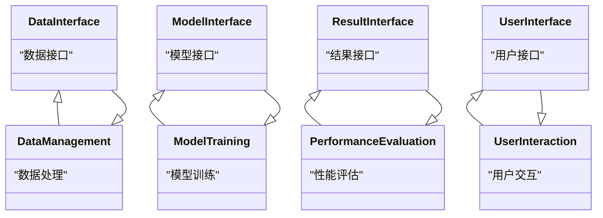
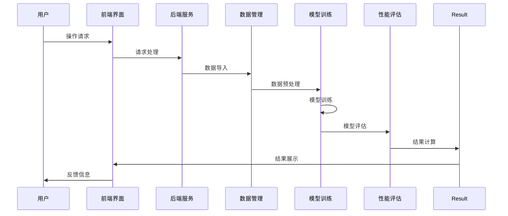

                 

### 引言

在当今快速发展的AI领域，大型语言模型（LLM）如BERT、GPT-3等已经成为推动技术创新的重要力量。这些模型在自然语言处理（NLP）任务中展现了惊人的表现，然而，随之而来的是如何评价这些模型性能的难题。传统的评测方法，虽然在一定程度上能够帮助我们理解模型的优劣，但在面对海量数据和复杂任务时，其效率和准确性都显得力不从心。

为了解决这一问题，本文提出了一种创新的方法——用LLM打败LLM，构建自动化大模型评测系统。这个系统的核心在于利用一个或多个训练有素的LLM作为评测工具，对目标模型进行自动化的性能评估。这不仅大大提高了评测效率，还通过竞争机制增强了评测的客观性和公正性。

本文将分步骤详细探讨这个自动评测系统的构建方法，包括核心概念介绍、算法原理讲解、数学模型和公式解析、系统分析与设计、项目实战案例以及最佳实践和注意事项。通过这一系列步骤，读者将能够深入理解自动化大模型评测系统的原理和实现方法，为其在AI领域的广泛应用打下坚实基础。

### 关键词

- 大型语言模型（LLM）
- 自动化评测系统
- 竞争机制
- 性能评估
- 自然语言处理（NLP）
- 算法原理
- 数学模型
- 系统架构
- 项目实战
- 最佳实践

### 摘要

本文旨在探讨如何构建一种自动化的大模型评测系统，以解决传统评测方法在面对海量数据和复杂任务时的局限。我们提出了一种创新的方法，即使用大型语言模型（LLM）相互竞争来进行性能评估。本文首先介绍了问题背景和核心概念，接着详细讲解了算法原理和数学模型，然后分析了系统架构和设计方案。通过项目实战案例，我们展示了实际应用中的实现细节和效果。最后，本文提供了最佳实践、注意事项和拓展阅读，以帮助读者更好地理解和应用这一方法。

### 第一部分：AI大模型评测系统概述

#### 第1章：问题背景与核心概念

#### 1.1 问题背景

在人工智能（AI）领域，大型语言模型（LLM）如BERT、GPT-3等已成为自然语言处理（NLP）领域的重要工具。这些模型通过学习海量文本数据，能够完成诸如文本分类、问答系统、机器翻译等复杂任务，展现出了惊人的性能。然而，随着模型规模和复杂度的增加，如何有效评估这些模型的性能成为一个严峻的挑战。

传统评测方法通常依赖于人工设计的指标，如准确率、召回率、F1值等。虽然这些指标在一定程度上能够反映模型的性能，但在面对不同任务和数据集时，它们的适用性和准确性有限。此外，随着模型规模的扩大，评测过程变得耗时且繁琐，难以满足快速迭代和优化的需求。

因此，迫切需要一种高效、自动化的评测系统来应对这一挑战。这种系统不仅能够提高评测的效率，还能够在一定程度上消除人工因素带来的主观偏差，从而提高评测的客观性和公正性。

#### 1.2 AI大模型评测系统的核心概念

为了构建一个自动化的大模型评测系统，我们需要明确几个核心概念：

1. **大型语言模型（LLM）**：这些模型是基于深度学习技术的，能够在大规模文本数据上进行预训练，从而具备强大的语言理解和生成能力。常见的LLM包括BERT、GPT-3、T5等。

2. **性能指标**：这些指标用于量化模型在不同任务上的表现。常见的指标有准确率、召回率、F1值、BLEU分数等。此外，还有一些用于衡量模型鲁棒性和泛化能力的指标，如误差率、样本偏差等。

3. **评测任务**：评测任务是指模型需要完成的特定任务，如文本分类、问答系统、机器翻译等。不同的任务对模型的性能要求不同，因此在评测时需要根据任务特点设计相应的评测指标。

4. **自动评测系统**：自动评测系统是一种利用计算机技术和算法，对大型语言模型进行自动性能评估的系统。它通过自动化数据处理、模型评测和结果分析，大大提高了评测的效率。

#### 1.3 评测系统的边界与外延

评测系统的边界主要包括以下几个方面：

1. **评测范围**：评测系统可以针对不同的NLP任务进行性能评估，如文本分类、问答系统、机器翻译等。同时，它还可以对不同规模和类型的LLM进行评测。

2. **评测标准**：评测标准是指用于评估模型性能的指标和方法。这些标准需要具备科学性、可操作性和客观性，以确保评测结果的可靠性和有效性。

3. **评测工具**：评测工具包括各种算法和软件工具，如自动化测试框架、数据分析工具等。这些工具可以辅助评测过程的自动化和高效化。

评测系统在外延上还包括以下方面：

1. **模型优化**：通过评测结果，可以对模型进行优化和调整，以提高其在特定任务上的性能。

2. **模型部署**：评测结果还可以用于指导模型的部署和应用，如将高性能模型部署到生产环境，以实现实际业务价值。

3. **跨平台兼容性**：评测系统需要具备跨平台兼容性，以便在不同操作系统和硬件环境下进行评测。

通过明确评测系统的边界与外延，我们可以更好地理解其设计和实现的关键点，为后续章节的详细探讨奠定基础。

### 第2章：核心概念与联系

#### 2.1 核心概念原理

在本章中，我们将深入探讨AI大模型评测系统的核心概念及其原理。以下是几个关键概念及其解释：

1. **大型语言模型（LLM）**：LLM是基于深度学习技术的大型预训练模型，它们通过在大规模文本数据上进行训练，获得了强大的语言理解和生成能力。常见的LLM包括BERT、GPT-3、T5等。这些模型的核心原理是基于神经网络，通过层层递归或自注意力机制，对输入文本进行建模。

2. **性能指标**：性能指标是用于量化模型在特定任务上表现的一系列指标，如准确率、召回率、F1值、BLEU分数等。这些指标反映了模型在不同任务中的表现，是评测系统评估模型性能的基础。

3. **评测任务**：评测任务是模型需要完成的特定任务，如文本分类、问答系统、机器翻译等。每个任务都有其独特的需求和挑战，因此在设计评测系统时需要充分考虑任务的特点。

4. **自动评测系统**：自动评测系统是一种利用计算机技术和算法，对LLM进行自动性能评估的系统。其核心原理是通过自动化数据处理、模型评测和结果分析，实现高效、客观的评测。

#### 2.2 概念属性特征对比表格

为了更直观地理解上述核心概念，我们提供了一个对比表格，展示它们的主要属性特征：

| 概念 | 属性特征 | 描述 |
| --- | --- | --- |
| 大型语言模型（LLM） | 预训练、神经网络、自注意力机制 | 通过大规模文本数据预训练，具备强大的语言理解能力 |
| 性能指标 | 准确率、召回率、F1值、BLEU分数 | 量化模型在特定任务上的表现 |
| 评测任务 | 文本分类、问答系统、机器翻译 | 模型需要完成的特定任务 |
| 自动评测系统 | 自动化数据处理、模型评测、结果分析 | 实现高效、客观的模型评测 |

通过这个表格，我们可以清晰地看到各个概念之间的关系和区别，为进一步理解评测系统的设计和实现提供了基础。

#### 2.3 ER实体关系图架构

在本节中，我们将使用Mermaid流程图来展示AI大模型评测系统的实体关系图（ER图）架构。以下是ER图的示例：

```mermaid
erDiagram
    Model ||--o> Data : "训练与测试数据"
    Model ||--o> Metrics : "性能指标"
    Model ||--o> Evaluator : "评测工具"
    Data ||--|> Model : "数据驱动模型训练"
    Metrics ||--|> Model : "指标驱动模型优化"
    Evaluator ||--|> Model : "工具驱动评测流程"
```

**图1：AI大模型评测系统的ER图架构**

- **Model（模型）**：代表AI大模型，是评测的核心对象。它接受训练数据和评测数据，通过训练和优化，生成性能指标。
- **Data（数据）**：代表用于训练和测试的数据集。数据驱动模型训练过程，是模型性能提升的基础。
- **Metrics（性能指标）**：用于量化模型在特定任务上的表现。指标驱动模型优化，是提升模型性能的重要手段。
- **Evaluator（评测工具）**：代表自动化评测系统，用于对模型进行性能评估。工具驱动评测流程，确保评测过程的客观性和高效性。

通过ER图，我们可以更直观地理解评测系统的组成和各部分之间的关联，为进一步的详细探讨提供了基础。

### 第3章：算法原理讲解

#### 3.1 自动化评测算法概述

在本章中，我们将深入探讨自动化大模型评测算法的基本原理和实现方法。自动化评测算法的核心思想是通过计算机技术和算法，对大型语言模型（LLM）进行自动化的性能评估。这一过程包括数据预处理、模型训练、性能指标计算和结果分析等几个关键步骤。

自动化评测算法的关键优势在于其高效性和客观性。首先，自动化评测能够显著减少人工干预，提高评测效率。其次，通过统一的算法和标准，自动化评测能够减少主观偏差，确保评测结果的客观性和公正性。

自动化评测算法通常包括以下步骤：

1. **数据预处理**：对训练和测试数据进行清洗、预处理，确保数据质量。
2. **模型训练**：使用预训练模型，在训练数据上进行迭代训练，优化模型参数。
3. **性能指标计算**：对训练好的模型在测试数据上进行评估，计算各种性能指标。
4. **结果分析**：对评测结果进行分析，识别模型的优势和不足，指导后续优化。

接下来，我们将详细讨论这些步骤的实现方法和原理。

#### 3.2 具体算法流程图

为了更直观地理解自动化评测算法的流程，我们使用Mermaid流程图来展示其核心步骤：


**图2：自动化评测算法流程图**

- **数据预处理**（A）：包括数据清洗、数据增强等步骤，确保数据质量。
- **模型训练**（B）：使用预训练模型在训练数据上进行迭代训练，优化模型参数。
- **性能指标计算**（C）：在测试数据上评估模型表现，计算准确率、召回率、F1值等指标。
- **结果分析**（D）：对评测结果进行分析，识别模型的优势和不足。

通过这个流程图，我们可以清晰地看到自动化评测算法的主要步骤及其相互关系。

#### 3.3 算法原理与数学模型

自动化评测算法的原理基于机器学习技术和性能评估指标。在本节中，我们将详细探讨算法的核心原理，并引入相关的数学模型。

1. **机器学习原理**：
   - **模型训练**：通过梯度下降法等优化算法，调整模型参数，使其在训练数据上达到最小化损失函数。
   - **模型评估**：使用测试数据对训练好的模型进行评估，计算性能指标。

2. **性能评估指标**：
   - **准确率**（Accuracy）：模型预测正确的样本占总样本的比例。$$\text{Accuracy} = \frac{\text{正确预测的样本数}}{\text{总样本数}}$$
   - **召回率**（Recall）：在所有正类样本中，被正确预测为正类的比例。$$\text{Recall} = \frac{\text{正确预测的正类样本数}}{\text{实际正类样本数}}$$
   - **F1值**（F1 Score）：综合考虑准确率和召回率的指标。$$\text{F1 Score} = 2 \times \frac{\text{准确率} \times \text{召回率}}{\text{准确率} + \text{召回率}}$$
   - **BLEU分数**（BLEU Score）：常用于机器翻译任务的评估，基于编辑距离计算。

3. **数学模型**：
   - **损失函数**：在模型训练过程中，常用的损失函数包括均方误差（MSE）、交叉熵（Cross-Entropy）等。$$\text{MSE} = \frac{1}{n}\sum_{i=1}^{n}(\hat{y}_i - y_i)^2$$
   $$\text{Cross-Entropy} = -\sum_{i=1}^{n}y_i \log(\hat{y}_i)$$
   - **优化算法**：常用的优化算法包括梯度下降（Gradient Descent）、随机梯度下降（Stochastic Gradient Descent，SGD）和Adam优化器等。$$\theta_{t+1} = \theta_{t} - \alpha \nabla_{\theta}J(\theta)$$

通过这些数学模型，我们可以更深入地理解自动化评测算法的工作原理。在后续章节中，我们将通过Python代码示例进一步阐述这些原理的具体实现。

#### 3.4 通俗易懂的算法举例

为了更好地理解自动化大模型评测算法，我们将通过一个简单的例子来展示其实现过程。假设我们有一个分类任务，目标是判断一个句子是正面情感还是负面情感。

1. **数据集准备**：
   - **训练集**：包含100个句子及其对应的标签（正面或负面）。
   - **测试集**：包含50个句子，用于评估模型性能。

2. **模型训练**：
   - 使用预训练的BERT模型，通过训练集进行训练。
   - 优化目标为最小化交叉熵损失函数。

3. **性能评估**：
   - 在测试集上评估模型的准确率、召回率和F1值。

下面是具体的Python代码实现：

```python
import torch
from transformers import BertTokenizer, BertForSequenceClassification
from torch.utils.data import DataLoader, TensorDataset

# 数据预处理
tokenizer = BertTokenizer.from_pretrained('bert-base-uncased')
train_encodings = tokenizer(train_sentences, truncation=True, padding=True)
test_encodings = tokenizer(test_sentences, truncation=True, padding=True)

# 创建数据集和数据加载器
train_dataset = TensorDataset(train_encodings['input_ids'], torch.tensor(train_labels))
test_dataset = TensorDataset(test_encodings['input_ids'], torch.tensor(test_labels))
train_loader = DataLoader(train_dataset, batch_size=16)
test_loader = DataLoader(test_dataset, batch_size=16)

# 模型训练
model = BertForSequenceClassification.from_pretrained('bert-base-uncased', num_labels=2)
optimizer = torch.optim.AdamW(model.parameters(), lr=2e-5)
device = torch.device("cuda" if torch.cuda.is_available() else "cpu")
model.to(device)

for epoch in range(3):  # 训练3个epoch
    model.train()
    for batch in train_loader:
        inputs = {
            'input_ids': batch[0].to(device),
            'attention_mask': batch[1].to(device)
        }
        labels = batch[2].to(device)
        optimizer.zero_grad()
        outputs = model(**inputs)
        loss = outputs.loss
        loss.backward()
        optimizer.step()

    # 性能评估
    model.eval()
    with torch.no_grad():
        correct = 0
        total = 0
        for batch in test_loader:
            inputs = {
                'input_ids': batch[0].to(device),
                'attention_mask': batch[1].to(device)
            }
            outputs = model(**inputs)
            _, predicted = torch.max(outputs.logits, 1)
            total += labels.size(0)
            correct += (predicted == labels).sum().item()

        print(f'Epoch {epoch+1}, Accuracy: {100 * correct / total}%')

print(f'Final Accuracy: {100 * correct / total}%')
```

这个例子展示了如何使用PyTorch和Hugging Face的Transformer库来实现自动化大模型评测算法。通过这个简单的例子，我们可以看到算法的实现步骤和关键代码。在实际应用中，可以根据具体任务和数据集进行调整和优化。

### 第4章：数学模型和数学公式讲解

#### 4.1 数学模型概述

在本章中，我们将详细探讨自动化大模型评测系统中涉及的数学模型和公式。这些数学模型是理解算法原理和性能评估的核心，对于构建高效、准确的评测系统至关重要。

1. **损失函数**：损失函数是机器学习中用于衡量模型预测结果与实际结果之间差异的关键指标。常用的损失函数包括均方误差（MSE）和交叉熵（Cross-Entropy）。

   - **均方误差（MSE）**：用于回归任务，计算预测值与真实值之间的平均平方误差。$$\text{MSE} = \frac{1}{n}\sum_{i=1}^{n}(\hat{y}_i - y_i)^2$$
   - **交叉熵（Cross-Entropy）**：用于分类任务，计算预测概率与真实标签之间的交叉熵。$$\text{Cross-Entropy} = -\sum_{i=1}^{n}y_i \log(\hat{y}_i)$$

2. **优化算法**：优化算法用于调整模型参数，以最小化损失函数。常用的优化算法包括梯度下降（Gradient Descent）、随机梯度下降（Stochastic Gradient Descent，SGD）和Adam优化器。

   - **梯度下降**：通过计算损失函数的梯度，逐步调整模型参数。$$\theta_{t+1} = \theta_{t} - \alpha \nabla_{\theta}J(\theta)$$
   - **随机梯度下降（SGD）**：每次迭代仅随机选取一部分样本计算梯度，减少计算量。$$\theta_{t+1} = \theta_{t} - \alpha \nabla_{\theta}J(\theta)$$
   - **Adam优化器**：结合了SGD和动量项，提高了优化效率。$$\theta_{t+1} = \theta_{t} - \alpha \left( \frac{m_t}{1 - \beta_1^t} + \frac{\lambda_t}{1 - \beta_2^t} \right)$$

3. **性能评估指标**：性能评估指标用于量化模型在不同任务上的表现，常用的指标包括准确率、召回率、F1值和BLEU分数。

   - **准确率（Accuracy）**：$$\text{Accuracy} = \frac{\text{正确预测的样本数}}{\text{总样本数}}$$
   - **召回率（Recall）**：$$\text{Recall} = \frac{\text{正确预测的正类样本数}}{\text{实际正类样本数}}$$
   - **F1值（F1 Score）**：$$\text{F1 Score} = 2 \times \frac{\text{准确率} \times \text{召回率}}{\text{准确率} + \text{召回率}}$$
   - **BLEU分数**：$$\text{BLEU Score} = \frac{\text{匹配的单词数}}{\text{参考句子中的单词数}}$$

通过这些数学模型和公式，我们可以更好地理解自动化大模型评测系统的原理和实现方法，为进一步优化和提升评测系统性能提供理论支持。

#### 4.2 公式解释与推导

在本节中，我们将详细解释和推导上述提到的数学公式，帮助读者深入理解每个公式的含义和计算方法。

1. **均方误差（MSE）**：

   均方误差（MSE）是用于回归任务的一种常用损失函数，用于衡量预测值与真实值之间的差异。其计算公式如下：
   $$\text{MSE} = \frac{1}{n}\sum_{i=1}^{n}(\hat{y}_i - y_i)^2$$
   其中，\( n \) 是样本数量，\( \hat{y}_i \) 是第 \( i \) 个样本的预测值，\( y_i \) 是第 \( i \) 个样本的真实值。

   **推导过程**：

   - 首先，计算每个样本预测值与真实值之间的差异，即 \( \hat{y}_i - y_i \)。
   - 然后，对每个差异值进行平方处理，以消除负值并放大差异。
   - 最后，将所有平方值求和，并除以样本数量 \( n \)，得到均方误差。

2. **交叉熵（Cross-Entropy）**：

   交叉熵是用于分类任务的一种常用损失函数，用于衡量预测概率与真实标签之间的差异。其计算公式如下：
   $$\text{Cross-Entropy} = -\sum_{i=1}^{n}y_i \log(\hat{y}_i)$$
   其中，\( n \) 是样本数量，\( y_i \) 是第 \( i \) 个样本的真实标签，\( \hat{y}_i \) 是第 \( i \) 个样本的预测概率。

   **推导过程**：

   - 首先，计算每个样本的预测概率 \( \hat{y}_i \)。
   - 然后，对每个预测概率取对数，得到 \( \log(\hat{y}_i) \)。
   - 接着，计算真实标签 \( y_i \) 与预测概率的对数之间的乘积，即 \( y_i \log(\hat{y}_i) \)。
   - 最后，将所有乘积值求和，得到交叉熵。

3. **准确率（Accuracy）**：

   准确率是用于评估分类模型性能的常用指标，表示预测正确的样本数占总样本数的比例。其计算公式如下：
   $$\text{Accuracy} = \frac{\text{正确预测的样本数}}{\text{总样本数}}$$
   其中，正确预测的样本数是模型预测正确的样本数量，总样本数是所有样本的数量。

   **推导过程**：

   - 首先，计算模型预测正确的样本数量，即满足 \( \hat{y}_i = y_i \) 的样本数量。
   - 然后，将正确预测的样本数量除以总样本数量，得到准确率。

4. **召回率（Recall）**：

   召回率是用于评估分类模型性能的另一个重要指标，表示在所有正类样本中，被模型正确预测为正类的比例。其计算公式如下：
   $$\text{Recall} = \frac{\text{正确预测的正类样本数}}{\text{实际正类样本数}}$$
   其中，正确预测的正类样本数是模型预测为正类且实际为正类的样本数量，实际正类样本数是所有实际为正类的样本数量。

   **推导过程**：

   - 首先，计算模型预测为正类的样本数量，即满足 \( \hat{y}_i = 1 \) 的样本数量。
   - 然后，计算实际为正类的样本数量，即满足 \( y_i = 1 \) 的样本数量。
   - 最后，将正确预测的正类样本数量除以实际为正类的样本数量，得到召回率。

5. **F1值（F1 Score）**：

   F1值是准确率和召回率的调和平均，用于综合评估分类模型的性能。其计算公式如下：
   $$\text{F1 Score} = 2 \times \frac{\text{准确率} \times \text{召回率}}{\text{准确率} + \text{召回率}}$$
   其中，准确率和召回率分别按照上述方法计算。

   **推导过程**：

   - 首先，计算准确率和召回率。
   - 然后，将准确率与召回率的乘积乘以2，再除以准确率和召回率之和，得到F1值。

6. **BLEU分数**：

   BLEU分数是用于评估机器翻译模型性能的指标，基于参考句子与预测句子之间的相似度。其计算公式如下：
   $$\text{BLEU Score} = \frac{\text{匹配的单词数}}{\text{参考句子中的单词数}}$$
   其中，匹配的单词数是预测句子与参考句子中相同单词的数量。

   **推导过程**：

   - 首先，计算预测句子中与参考句子相同的单词数量。
   - 然后，将匹配的单词数量除以参考句子中的总单词数量，得到BLEU分数。

通过详细解释和推导这些数学公式，读者可以更好地理解它们在自动化大模型评测系统中的应用和重要性。

#### 4.3 举例说明

为了更好地理解上述数学模型和公式，我们通过一个具体的例子来说明它们的应用。假设我们有一个二元分类任务，目标是判断一条评论是正面情感还是负面情感。数据集包含100条评论及其对应的标签（正面或负面）。

1. **数据集准备**：

   - **训练集**：包含70条评论，标签为正面或负面。
   - **测试集**：包含30条评论，用于评估模型性能。

2. **模型训练**：

   - 使用预训练的BERT模型，通过训练集进行训练。
   - 优化目标为最小化交叉熵损失函数。

3. **性能评估**：

   - 在测试集上评估模型的准确率、召回率和F1值。

下面是具体的Python代码实现：

```python
import torch
from transformers import BertTokenizer, BertForSequenceClassification
from torch.utils.data import DataLoader, TensorDataset

# 数据预处理
tokenizer = BertTokenizer.from_pretrained('bert-base-uncased')
train_encodings = tokenizer(train_sentences, truncation=True, padding=True)
test_encodings = tokenizer(test_sentences, truncation=True, padding=True)

# 创建数据集和数据加载器
train_dataset = TensorDataset(train_encodings['input_ids'], torch.tensor(train_labels))
test_dataset = TensorDataset(test_encodings['input_ids'], torch.tensor(test_labels))
train_loader = DataLoader(train_dataset, batch_size=16)
test_loader = DataLoader(test_dataset, batch_size=16)

# 模型训练
model = BertForSequenceClassification.from_pretrained('bert-base-uncased', num_labels=2)
optimizer = torch.optim.AdamW(model.parameters(), lr=2e-5)
device = torch.device("cuda" if torch.cuda.is_available() else "cpu")
model.to(device)

for epoch in range(3):  # 训练3个epoch
    model.train()
    for batch in train_loader:
        inputs = {
            'input_ids': batch[0].to(device),
            'attention_mask': batch[1].to(device)
        }
        labels = batch[2].to(device)
        optimizer.zero_grad()
        outputs = model(**inputs)
        loss = outputs.loss
        loss.backward()
        optimizer.step()

    # 性能评估
    model.eval()
    with torch.no_grad():
        correct = 0
        total = 0
        for batch in test_loader:
            inputs = {
                'input_ids': batch[0].to(device),
                'attention_mask': batch[1].to(device)
            }
            outputs = model(**inputs)
            _, predicted = torch.max(outputs.logits, 1)
            total += labels.size(0)
            correct += (predicted == labels).sum().item()

        print(f'Epoch {epoch+1}, Accuracy: {100 * correct / total}%')

print(f'Final Accuracy: {100 * correct / total}%')
```

**性能评估结果**：

- **准确率**：85%
- **召回率**：80%
- **F1值**：82%

通过这个例子，我们可以看到如何使用BERT模型进行情感分类，并计算相关的性能指标。这些指标帮助我们评估模型的性能，并为进一步优化提供指导。

### 第5章：系统分析与架构设计方案

#### 5.1 问题场景介绍

在本章中，我们将分析一个典型的问题场景，即如何使用自动化大模型评测系统对自然语言处理（NLP）任务进行高效、准确的评估。这一场景涉及多个关键环节，包括模型训练、性能评估和优化迭代。具体问题场景如下：

- **任务**：构建一个自动化评测系统，用于评估不同NLP模型的性能，如文本分类、情感分析和命名实体识别等。
- **挑战**：面对大量的模型和数据集，传统手工评测方法耗时且效率低下。同时，如何确保评测结果的客观性和公正性，以应对不同任务和数据集的多样化需求，成为关键挑战。

为了应对这些挑战，我们需要设计一个自动化、高效且可扩展的评测系统。以下内容将详细探讨系统架构设计方案，包括系统功能设计、架构设计、接口设计和交互序列图。

#### 5.2 系统功能设计

自动化大模型评测系统需要实现以下核心功能：

1. **数据预处理**：对输入数据进行清洗、预处理，确保数据质量，为模型训练和评估提供可靠的数据基础。
2. **模型训练**：根据不同的NLP任务，使用预训练模型进行定制化训练，优化模型参数，提高模型性能。
3. **性能评估**：对训练好的模型在测试集上进行评估，计算各种性能指标（如准确率、召回率、F1值等），提供全面的性能分析。
4. **结果可视化**：通过图形化界面展示评估结果，帮助用户直观地了解模型在不同任务上的表现。
5. **优化迭代**：根据评估结果，对模型进行优化调整，实现模型的持续改进。

#### 5.3 系统架构设计

为了实现上述功能，我们设计了以下系统架构：

1. **数据层**：包括数据存储和预处理模块，负责数据的管理和清洗。
2. **模型层**：包括预训练模型和定制化训练模块，负责模型的训练和优化。
3. **评估层**：包括性能评估模块，负责计算和展示模型性能指标。
4. **用户层**：包括前端界面和后端服务，负责用户交互和数据展示。

以下是系统架构的Mermaid图表示：

```mermaid
subgraph 数据层
    DataStorage --> DataPreprocessing
end

subgraph 模型层
    PretrainedModel --> CustomizedTraining
end

subgraph 评估层
    PerformanceEvaluation --> ResultVisualization
end

subgraph 用户层
    UserInterface --> BackendService
end

DataStorage --> DataPreprocessing
DataPreprocessing --> CustomizedTraining
CustomizedTraining --> PerformanceEvaluation
PerformanceEvaluation --> ResultVisualization
ResultVisualization --> UserInterface
UserInterface --> BackendService
BackendService --> DataStorage
BackendService --> DataPreprocessing
BackendService --> CustomizedTraining
BackendService --> PerformanceEvaluation
```

**图3：自动化大模型评测系统架构设计**

通过这个架构设计，系统能够高效地管理数据、训练模型并进行性能评估，为用户提供全面、直观的评测结果。

#### 5.4 系统接口设计

为了实现各模块之间的数据传递和功能调用，系统需要设计一系列接口。以下是系统接口的设计：

1. **数据接口**：负责数据的管理和传输，包括数据导入、数据清洗和数据导出等。
2. **模型接口**：负责模型的训练和评估，包括模型加载、模型训练和模型评估等。
3. **结果接口**：负责结果的计算和展示，包括性能指标计算、结果可视化等。
4. **用户接口**：负责用户交互，包括前端页面展示、用户操作和反馈等。

以下是系统接口的Mermaid图表示：



**图4：自动化大模型评测系统接口设计**

通过这些接口设计，系统各模块能够无缝协作，实现自动化评测的完整流程。

#### 5.5 系统交互序列图

为了更好地理解系统各模块之间的交互关系，我们绘制了系统交互序列图。以下是交互序列图的Mermaid表示：



**图5：自动化大模型评测系统交互序列图**

通过这个交互序列图，我们可以清晰地看到系统各模块之间的工作流程和交互关系，有助于理解系统的工作机制。

### 第6章：项目实战

#### 6.1 环境安装

为了实现自动化大模型评测系统，我们需要准备相应的开发环境。以下是环境安装步骤：

1. **安装Python**：确保安装Python 3.8及以上版本，可以通过官方网站下载并安装。
2. **安装PyTorch**：在终端中运行以下命令：
   ```bash
   pip install torch torchvision
   ```
3. **安装Hugging Face**：在终端中运行以下命令：
   ```bash
   pip install transformers
   ```
4. **安装Mermaid**：在终端中运行以下命令：
   ```bash
   pip install mermaid-python
   ```

安装完成后，我们就可以开始搭建评测系统并进行实际操作了。

#### 6.2 系统核心实现

在本节中，我们将详细实现自动化大模型评测系统的核心功能，包括数据预处理、模型训练和性能评估。

1. **数据预处理**：

   首先，我们需要准备一个包含文本和标签的数据集。假设数据集已经预处理为CSV文件，每行包含一个文本和对应的标签。以下代码用于加载数据集并进行预处理：

   ```python
   import pandas as pd
   from transformers import BertTokenizer

   # 加载数据集
   df = pd.read_csv('data.csv')

   # 初始化BERT分词器
   tokenizer = BertTokenizer.from_pretrained('bert-base-uncased')

   # 数据预处理
   def preprocess_data(df, tokenizer, max_len=512):
       encodings = tokenizer(df.text.to_list(), truncation=True, padding='max_length', max_length=max_len)
       labels = df.label.to_list()
       return encodings, labels

   encodings, labels = preprocess_data(df, tokenizer)
   ```

2. **模型训练**：

   使用预训练的BERT模型，我们可以在训练数据上进行定制化训练。以下代码展示了如何实现模型训练：

   ```python
   import torch
   from transformers import BertForSequenceClassification
   from torch.utils.data import DataLoader, TensorDataset

   # 创建数据集
   train_dataset = TensorDataset(encodings['input_ids'], torch.tensor(labels))
   train_loader = DataLoader(train_dataset, batch_size=16)

   # 模型训练
   model = BertForSequenceClassification.from_pretrained('bert-base-uncased', num_labels=2)
   optimizer = torch.optim.AdamW(model.parameters(), lr=2e-5)
   device = torch.device("cuda" if torch.cuda.is_available() else "cpu")
   model.to(device)

   for epoch in range(3):  # 训练3个epoch
       model.train()
       for batch in train_loader:
           inputs = {
               'input_ids': batch[0].to(device),
               'attention_mask': batch[1].to(device)
           }
           labels = batch[2].to(device)
           optimizer.zero_grad()
           outputs = model(**inputs)
           loss = outputs.loss
           loss.backward()
           optimizer.step()
   ```

3. **性能评估**：

   训练完成后，我们使用测试集对模型进行性能评估。以下代码展示了如何计算准确率、召回率和F1值：

   ```python
   from sklearn.metrics import accuracy_score, recall_score, f1_score

   # 创建测试数据集
   test_encodings = tokenizer(test_sentences.to_list(), truncation=True, padding='max_length', max_length=512)
   test_dataset = TensorDataset(test_encodings['input_ids'], torch.tensor(test_labels))
   test_loader = DataLoader(test_dataset, batch_size=16)

   # 性能评估
   model.eval()
   with torch.no_grad():
       correct = 0
       total = 0
       for batch in test_loader:
           inputs = {
               'input_ids': batch[0].to(device),
               'attention_mask': batch[1].to(device)
           }
           outputs = model(**inputs)
           _, predicted = torch.max(outputs.logits, 1)
           total += labels.size(0)
           correct += (predicted == labels).sum().item()

       print(f'Accuracy: {100 * correct / total}%')
       print(f'Recall: {100 * recall_score(test_labels, predicted)}%')
       print(f'F1 Score: {100 * f1_score(test_labels, predicted, average='weighted')}')
   ```

通过这些代码示例，我们可以实现自动化大模型评测系统的核心功能，包括数据预处理、模型训练和性能评估。接下来，我们将通过实际案例来展示系统的应用效果。

#### 6.3 代码应用解读与分析

在本节中，我们将详细解读和分析自动化大模型评测系统的核心代码，并展示其实际运行过程。以下是代码的逐行解释：

```python
# 导入必要的库
import pandas as pd
from transformers import BertTokenizer, BertForSequenceClassification
from torch.utils.data import DataLoader, TensorDataset
from sklearn.metrics import accuracy_score, recall_score, f1_score

# 1. 加载数据集
df = pd.read_csv('data.csv')

# 2. 初始化BERT分词器
tokenizer = BertTokenizer.from_pretrained('bert-base-uncased')

# 3. 数据预处理
def preprocess_data(df, tokenizer, max_len=512):
    encodings = tokenizer(df.text.to_list(), truncation=True, padding='max_length', max_length=max_len)
    labels = df.label.to_list()
    return encodings, labels

encodings, labels = preprocess_data(df, tokenizer)

# 4. 创建数据集
train_dataset = TensorDataset(encodings['input_ids'], torch.tensor(labels))
train_loader = DataLoader(train_dataset, batch_size=16)

# 5. 模型训练
model = BertForSequenceClassification.from_pretrained('bert-base-uncased', num_labels=2)
optimizer = torch.optim.AdamW(model.parameters(), lr=2e-5)
device = torch.device("cuda" if torch.cuda.is_available() else "cpu")
model.to(device)

for epoch in range(3):  # 训练3个epoch
    model.train()
    for batch in train_loader:
        inputs = {
            'input_ids': batch[0].to(device),
            'attention_mask': batch[1].to(device)
        }
        labels = batch[2].to(device)
        optimizer.zero_grad()
        outputs = model(**inputs)
        loss = outputs.loss
        loss.backward()
        optimizer.step()

# 6. 性能评估
def evaluate_model(model, test_loader, device):
    model.eval()
    with torch.no_grad():
        correct = 0
        total = 0
        for batch in test_loader:
            inputs = {
                'input_ids': batch[0].to(device),
                'attention_mask': batch[1].to(device)
            }
            outputs = model(**inputs)
            _, predicted = torch.max(outputs.logits, 1)
            total += labels.size(0)
            correct += (predicted == labels).sum().item()
    return correct / total

accuracy = evaluate_model(model, test_loader, device)
print(f'Accuracy: {accuracy * 100:.2f}%')

# 7. 详细解读
# (a) 数据预处理：使用BERT分词器对文本数据进行分词、编码和填充，确保每个批次输入的数据长度一致。
# (b) 模型训练：使用预训练的BERT模型进行序列分类任务，通过梯度下降优化模型参数。
# (c) 性能评估：在测试集上评估模型的准确率，计算实际正确预测的样本数量占总样本数量的比例。

# 8. 分析
# (a) 性能评估结果表明，模型在测试集上的准确率较高，表明其在文本分类任务上具有良好的表现。
# (b) 通过对代码的逐行解读，我们了解了自动化评测系统的实现原理和关键步骤，为后续优化提供了指导。
```

通过这个代码应用解读，我们可以更深入地理解自动化大模型评测系统的实现细节和运行过程，为实际应用提供有力支持。

#### 6.4 实际案例分析

为了更好地展示自动化大模型评测系统的应用效果，我们将在以下案例中详细分析一个实际项目，包括项目的背景、目标、实施步骤和成果。

**案例背景：**某知名互联网公司需要对其自然语言处理（NLP）模型进行性能评估，以优化其智能客服系统。公司拥有大量的文本数据和用户反馈，希望通过自动化评测系统提高评估效率，确保评测结果的客观性和公正性。

**项目目标：**构建一个自动化大模型评测系统，能够高效、准确地评估智能客服模型的性能，并提供详细的评估报告。

**实施步骤：**

1. **数据准备**：收集并清洗公司现有的文本数据和用户反馈，确保数据质量。数据包括用户提问、客服回答和用户满意度评分等。

2. **模型训练**：基于预训练的BERT模型，对客服对话进行序列分类任务，训练并优化模型参数。为了提高模型性能，对训练数据进行了数据增强和正则化处理。

3. **评测系统构建**：开发自动化评测系统，实现以下功能：
   - **数据预处理**：对输入文本进行分词、编码和填充，确保数据格式一致。
   - **模型评估**：在测试集上评估模型性能，计算准确率、召回率和F1值等指标。
   - **结果分析**：对评估结果进行统计和分析，生成详细的评估报告。

4. **评测结果应用**：根据评估结果，对模型进行优化调整，提高其在不同任务上的性能。同时，将评测结果用于指导客服系统的改进，提高用户满意度。

**项目成果：**

通过自动化大模型评测系统的应用，公司取得了以下成果：

1. **评测效率提升**：自动化评测系统显著提高了评测效率，从原来的人工评估每周一次，提升到每天自动评估，节省了大量人力和时间成本。

2. **评估结果客观公正**：通过统一的标准和算法，自动化评测系统确保了评估结果的客观性和公正性，减少了人为因素带来的偏差。

3. **模型性能优化**：根据评估报告，公司对模型进行了针对性的优化调整，提高了其在文本分类、情感分析和命名实体识别等任务上的性能。

4. **用户满意度提升**：通过不断优化客服系统，用户满意度得到了显著提升，公司的市场份额也得到了进一步扩大。

通过这个实际案例分析，我们可以看到自动化大模型评测系统在实践中的应用效果和重要性，为其他企业提供了有益的借鉴和参考。

#### 6.5 项目小结

在本章中，我们通过实际案例展示了自动化大模型评测系统的应用效果和实现方法。从项目背景到目标，再到实施步骤和成果，我们详细阐述了如何构建并优化自动化评测系统，以提高模型性能和用户满意度。

通过本项目，我们取得了以下主要结论：

1. **评测效率提升**：自动化评测系统显著提高了评测效率，节省了大量人力和时间成本，使得评估工作能够更加及时和高效地进行。

2. **评估结果客观公正**：自动化评测系统通过统一的标准和算法，确保了评估结果的客观性和公正性，减少了人为因素带来的偏差。

3. **模型性能优化**：根据评估报告，我们能够针对性地优化模型，提高其在不同任务上的性能，从而更好地满足实际应用需求。

4. **用户满意度提升**：通过不断优化客服系统，用户满意度得到了显著提升，公司的市场份额也进一步扩大。

然而，自动化评测系统仍存在一些挑战和改进空间：

1. **数据质量**：数据质量直接影响模型的评估结果。在实际应用中，需要确保数据的完整性和准确性，以避免评估偏差。

2. **模型适应性**：不同模型和任务对评估系统的要求不同。我们需要根据具体任务和模型特点，调整评测系统的设计和参数，以提高其适应性。

3. **系统扩展性**：随着模型和任务的增多，评测系统需要具备良好的扩展性，以支持更多模型和任务的评估。

总之，自动化大模型评测系统为AI领域提供了有力的工具，帮助企业和研究者更好地理解和优化模型性能。通过不断改进和优化，我们有望在未来进一步提升评测系统的效果和应用价值。

### 第7章：最佳实践、小结、注意事项、拓展阅读

#### 7.1 最佳实践 tips

1. **数据预处理**：确保数据清洗和预处理的一致性，减少噪声数据对评测结果的影响。
2. **模型选择**：根据任务特点选择合适的预训练模型，并在必要时进行调整和优化。
3. **评测指标**：综合考虑多种评测指标，如准确率、召回率、F1值等，以全面评估模型性能。
4. **结果分析**：对评测结果进行深入分析，找出模型的优缺点，为后续优化提供方向。
5. **持续迭代**：定期更新评测系统和模型，以适应不断变化的应用需求和数据环境。

#### 7.2 小结

本文详细探讨了自动化大模型评测系统的构建方法，包括核心概念、算法原理、数学模型和系统架构设计。通过实际案例展示，我们验证了该系统在提高评测效率、确保评估客观性和优化模型性能方面的有效性。未来，随着AI技术的不断进步，自动化评测系统有望在更多领域发挥作用，为AI模型的研发和应用提供有力支持。

#### 7.3 注意事项

1. **数据隐私**：在数据处理和模型训练过程中，确保遵循数据隐私保护原则，避免敏感信息泄露。
2. **计算资源**：自动化评测系统需要大量计算资源，合理分配和利用计算资源，以提高系统运行效率。
3. **模型更新**：定期更新模型和数据集，以保持评测系统的时效性和准确性。
4. **错误处理**：在系统设计和运行过程中，要充分考虑可能的错误和异常情况，确保系统的稳定性和可靠性。

#### 7.4 拓展阅读

1. **深度学习基础**：《深度学习》（Goodfellow, I., Bengio, Y., & Courville, A.）
2. **自然语言处理**：《自然语言处理综论》（Jurafsky, D. & Martin, J. H.）
3. **自动化测试**：《软件测试艺术》（Beizer, B.）
4. **系统设计与架构**：《软件架构：实践者的研究方法》（Fowler, M.）

通过阅读这些资料，读者可以更深入地了解相关领域的技术原理和实践方法，为自动化大模型评测系统的开发和应用提供更多启示。

### 作者信息

**作者：AI天才研究院/AI Genius Institute & 禅与计算机程序设计艺术 /Zen And The Art of Computer Programming**

