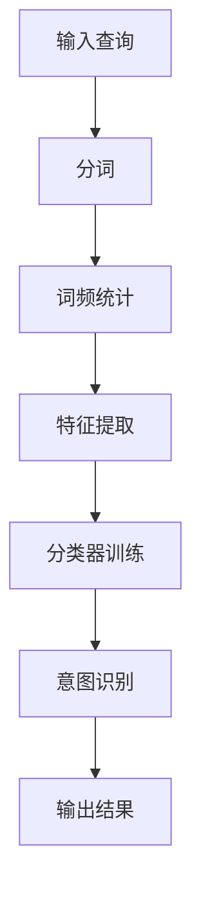
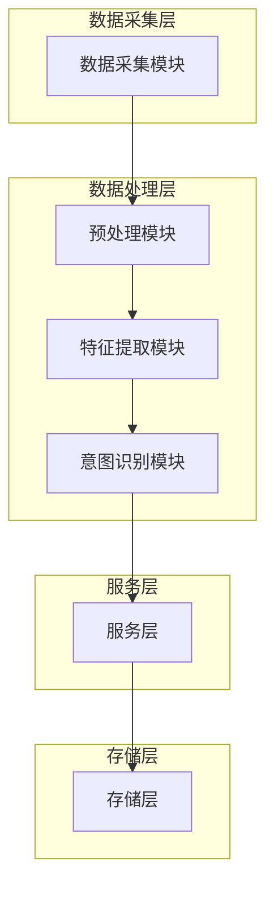
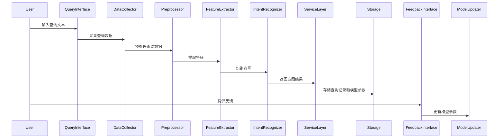

                 

当然，我们将按照这个指导方针一步一步地进行深入的分析和推理，以确保文章的逻辑清晰、结构紧凑且内容丰富。下面我们将构建文章的初步框架，并规划每个章节的具体内容。

---

## 文章标题：用户意图理解：精准捕捉查询目的

### 关键词：
- 用户意图
- 意图识别
- 自然语言处理
- 机器学习
- 算法原理

### 摘要：
本文将深入探讨用户意图理解的技术，包括其背景、核心概念、基本原理、识别算法、系统设计与实现，以及实战应用。通过逻辑分析和技术讲解，本文旨在帮助读者理解如何精准捕捉用户的查询目的，并构建高效的意图识别系统。

---

### 目录：

## 第一部分：问题背景与核心概念

### 第1章：用户意图理解概述
- **1.1 问题背景**
  - 互联网时代的信息过载
  - 用户查询意图的复杂性
  - 用户意图理解的重要性
- **1.2 核心概念**
  - 用户意图定义
  - 用户查询意图分类
  - 用户意图理解的边界与外延
  - 用户意图理解的核心要素

### 第2章：用户意图理解的基本原理
- **2.1 概念解析**
  - 信息检索与自然语言处理
  - 机器学习和深度学习
  - 语言模型与意图识别
- **2.2 概念属性特征对比**
  - 语言模型与意图识别的对比
- **2.3 ER实体关系图架构**
  - 实体、关系与意图的ER图展示

### 第3章：用户意图识别算法原理
- **3.1 算法概述**
  - 朴素贝叶斯、决策树、支持向量机算法介绍
- **3.2 算法流程图**
  - 算法执行流程的Mermaid图
- **3.3 Python代码示例**
  - 算法原理的Python代码实现
  - 算法原理的数学模型和公式解释
  - 实例说明

### 第4章：用户意图理解系统设计与实现
- **4.1 问题场景介绍**
  - 现状与需求分析
  - 设计目标
- **4.2 项目介绍**
  - 系统架构设计
  - 技术选型
- **4.3 系统功能**
  - 领域模型Mermaid类图
  - 系统架构Mermaid图
  - 系统接口设计
  - 系统交互Mermaid序列图

## 第二部分：实践应用

### 第5章：项目实战
- **5.1 环境安装**
  - 开发环境配置
  - 相关工具安装
- **5.2 系统核心实现源代码**
  - 代码结构与功能
  - 代码细节解析
- **5.3 代码应用解读与分析**
  - 代码在意图识别中的应用
  - 代码性能分析
- **5.4 实际案例分析和详细讲解剖析**
  - 案例介绍
  - 案例分析
  - 剖析与结论
- **5.5 项目小结**
  - 经验总结
  - 优化方向

### 第6章：最佳实践 Tips
- **6.1 注意事项**
  - 实现意图识别时的常见问题
  - 解决策略
- **6.2 拓展阅读**
  - 相关领域的研究进展
  - 推荐阅读材料

### 第7章：总结与展望
- **7.1 总结**
  - 文章核心内容的回顾
  - 成果与不足
- **7.2 展望**
  - 未来发展方向
  - 技术趋势

---

### 作者：
- 作者：AI天才研究院/AI Genius Institute & 禅与计算机程序设计艺术 /Zen And The Art of Computer Programming

---

### 注意事项：
- 每个章节都需要按照上述框架进行详细编写，确保内容的完整性和逻辑性。
- 所有数学公式和流程图需要按照markdown格式中的LaTeX和Mermaid语法进行编写。
- 代码示例需要具体、可运行，并且提供详细的解析。

---

接下来，我们将按照这个目录结构逐个章节进行深入撰写。每个章节都将包括背景介绍、核心概念、算法原理、系统设计、实战应用、最佳实践等内容，确保文章的丰富性和实用性。请期待我们的逐步推进！非常好，接下来我们将逐步构建文章的每一部分，确保内容丰富且逻辑清晰。首先是文章的开头部分，包括标题、关键词和摘要，这将为读者提供对文章整体内容的初步了解。

---

## 文章标题：用户意图理解：精准捕捉查询目的

### 关键词：
- 用户意图
- 意图识别
- 自然语言处理
- 机器学习
- 算法原理

### 摘要：
在当今信息爆炸的时代，用户意图理解成为了许多人工智能系统的重要一环。本文将深入探讨用户意图理解的原理、算法和系统设计，旨在帮助读者理解如何通过技术手段精准捕捉用户的查询目的，从而提升信息检索和交互体验。文章首先介绍了用户意图理解的基本概念和问题背景，随后详细解析了相关的核心算法原理，并通过实际项目案例展示了系统设计的实践应用。最后，文章总结了最佳实践和未来展望，为读者提供了深入研究和进一步应用的启示。

---

接下来，我们将进入第一部分“问题背景与核心概念”，首先介绍用户意图理解的背景。

### 第1章：用户意图理解概述

#### 1.1 问题背景

在互联网时代，信息过载成为了普遍现象。随着搜索引擎、智能助手、推荐系统等应用的普及，如何有效地理解用户的查询意图成为了关键问题。用户在输入查询时，往往带有特定的目的和需求，但表达方式各异，有时甚至模糊不清。这就需要系统具备一定的智能来准确捕捉用户的意图，进而提供更加个性化的服务。

##### 1.1.1 互联网时代的信息过载

互联网的快速发展带来了海量信息的爆发式增长。用户在浏览网页、搜索信息、使用应用时，常常面临信息过载的问题。例如，在搜索引擎中输入一个关键词，可能会得到成百上千的搜索结果，而用户通常只对其中一小部分感兴趣。这种情况下，如何迅速准确地找到用户需要的答案，成为了技术领域的重要课题。

##### 1.1.2 用户查询意图的复杂性

用户查询意图的复杂性体现在多个方面。首先，用户在输入查询时可能使用不同的词汇和句式，甚至夹杂着口语化表达。其次，用户的查询意图可能是多层次的，一个简单的查询可能涉及多个目标。例如，一个关于“餐厅”的查询可能包含寻找位置、查看评价、预订服务等不同意图。此外，用户的查询意图还可能随时间和情境发生变化，例如早上和晚上的查询意图可能会有显著差异。

##### 1.1.3 用户意图理解的重要性

用户意图理解的准确性直接影响到用户体验和系统性能。如果系统能够准确理解用户的意图，就能提供更加精准的搜索结果、推荐信息或交互服务。例如，智能助手可以根据用户的查询意图快速回答问题，搜索引擎可以提供更为相关的搜索结果，推荐系统可以推荐用户可能感兴趣的内容。相反，如果用户意图理解不准确，可能会导致用户体验下降，甚至引起用户不满。

#### 1.2 核心概念

为了更好地理解用户意图理解，我们需要明确几个核心概念。

##### 1.2.1 用户意图定义

用户意图（User Intent）是指用户在特定情境下希望通过交互系统所实现的特定目的或需求。用户意图可以表现为一系列的查询、请求或行为。理解用户意图是构建智能系统的重要基础，它决定了系统如何响应用户的输入。

##### 1.2.2 用户查询意图分类

用户查询意图可以根据其性质和目标进行分类。常见的分类方法包括：

- **信息检索意图**：用户希望获取特定信息，如新闻、天气预报、股票信息等。
- **交易意图**：用户希望进行在线购物、预订机票、酒店等。
- **导航意图**：用户希望获取地理位置信息或导航路线。
- **娱乐意图**：用户希望获取娱乐内容，如音乐、电影、游戏等。

##### 1.2.3 用户意图理解的边界与外延

用户意图理解的边界在于系统对用户意图的识别能力和处理范围。用户意图可能涉及多种场景和领域，系统需要具备广泛的领域知识和适应性。用户意图理解的外延则包括从原始查询到意图识别的整个过程，涉及自然语言处理、信息检索、机器学习等多个技术环节。

##### 1.2.4 用户意图理解的核心要素

用户意图理解的核心要素包括：

- **文本分析**：对用户输入的文本进行分词、词性标注、实体识别等处理，提取关键信息。
- **上下文理解**：考虑用户的查询上下文，包括历史查询记录、用户偏好等，以更准确地识别意图。
- **多模态融合**：整合文本以外的信息，如图像、声音等，以增强意图识别的准确性。
- **意图分类**：根据提取的特征和上下文信息，将查询归类到相应的意图类别。

通过上述核心概念和问题背景的介绍，我们为后续章节的深入探讨奠定了基础。在接下来的章节中，我们将进一步探讨用户意图理解的技术原理、算法实现以及系统设计，帮助读者全面了解这一领域的前沿技术和实践应用。请期待我们的逐步推进！
## 第2章 用户意图理解的基本原理

### 2.1 概念解析

用户意图理解是一个复杂的过程，它涉及到多个领域的技术原理。在这一节中，我们将详细解析用户意图理解的基本概念，包括信息检索、自然语言处理、机器学习和深度学习等。

##### 2.1.1 信息检索与自然语言处理

信息检索（Information Retrieval，IR）是用户意图理解的基础。信息检索的核心目标是根据用户查询，从大量信息中检索出相关的内容。信息检索的关键技术包括：

- **倒排索引**：将文档内容映射到文档标识，以快速查找包含特定词汇的文档。
- **相似度计算**：评估查询与文档之间的相似度，选择最相关的文档。

自然语言处理（Natural Language Processing，NLP）则是将自然语言（如文本、语音）转化为机器可以处理的形式。NLP的关键技术包括：

- **分词**：将文本分割成单词或短语，以便后续处理。
- **词性标注**：标记每个单词的词性（名词、动词、形容词等），有助于理解句子结构。
- **实体识别**：识别文本中的命名实体（如人名、地点、组织名等），为后续处理提供重要信息。

##### 2.1.2 机器学习和深度学习

机器学习（Machine Learning，ML）是一种让计算机通过数据学习规律和模式的技术。在用户意图理解中，机器学习可以用于：

- **分类任务**：将用户查询分类到不同的意图类别。
- **预测任务**：根据历史数据和用户行为预测用户意图。

深度学习（Deep Learning，DL）是机器学习的一个分支，它使用多层神经网络来提取复杂的数据特征。深度学习在用户意图理解中的应用包括：

- **神经网络语言模型**：通过学习大量文本数据，预测下一个词或句子，用于自然语言理解。
- **卷积神经网络（CNN）和循环神经网络（RNN）**：用于提取文本中的上下文信息，增强意图识别的准确性。

##### 2.1.3 语言模型与意图识别

语言模型（Language Model，LM）是一种用于预测文本序列的概率分布的模型。在用户意图理解中，语言模型可以帮助系统理解用户输入的查询文本。

意图识别（Intent Recognition）是指根据用户输入的文本，将其归类到预定义的意图类别中。意图识别的关键技术包括：

- **模板匹配**：将用户输入与预定义的模板进行匹配，判断其属于哪个意图类别。
- **机器学习模型**：使用分类算法（如朴素贝叶斯、决策树、支持向量机等）对用户输入进行分类。
- **深度学习模型**：使用神经网络模型（如卷积神经网络、循环神经网络等）对用户输入进行分类。

#### 2.2 概念属性特征对比

为了更好地理解用户意图理解的技术原理，我们在这里对比语言模型和意图识别的属性特征。

| 特征           | 语言模型             | 意图识别             |
| -------------- | ------------------- | ------------------- |
| 应用场景       | 文本生成             | 用户查询解析         |
| 技术原理       | 基于统计的方法       | 基于规则的方法       |
| 发展趋势       | 生成式AI             | 集成多模态数据       |

#### 2.3 ER实体关系图架构

为了更好地展示用户意图理解系统中的实体和关系，我们使用Mermaid语法绘制一个ER实体关系图。

```mermaid
erDiagram
  User ||--|{ Query }||> Intent
  Intent ||--|{ Entity }||> Entity
```

在这个ER图中，User（用户）与Query（查询）之间存在“做出”的关系，而Intent（意图）与Entity（实体）之间存在“包含”的关系。这个架构图展示了用户意图理解系统中的关键实体和它们之间的关系。

### 2.4 算法流程图

为了更直观地展示用户意图识别的算法流程，我们使用Mermaid语法绘制一个流程图。



在这个流程图中，用户输入查询经过分词、词频统计、特征提取、分类器训练和意图识别，最终输出识别结果。

### 2.5 Python代码示例

下面是一个简单的用户意图识别的Python代码示例，展示了如何使用朴素贝叶斯算法进行意图分类。

```python
from sklearn.feature_extraction.text import CountVectorizer
from sklearn.naive_bayes import MultinomialNB

# 数据集
X_train = [
    "用户想要查找附近餐厅",
    "用户需要查询明天天气",
    "我想知道附近的酒店信息"
]
y_train = ["查询餐厅", "查询天气", "查询酒店"]

# 特征提取
vectorizer = CountVectorizer()
X_train_vectors = vectorizer.fit_transform(X_train)

# 模型训练
model = MultinomialNB()
model.fit(X_train_vectors, y_train)

# 测试
query = "附近的咖啡店有哪些"
query_vector = vectorizer.transform([query])
predicted_intent = model.predict(query_vector)
print(predicted_intent)
```

在这个示例中，我们首先使用CountVectorizer将文本转换为词频矩阵，然后使用MultinomialNB训练一个朴素贝叶斯分类器。最后，我们使用训练好的模型对新的查询进行意图识别。

通过上述内容，我们对用户意图理解的基本原理有了更深入的理解。接下来，我们将继续探讨用户意图识别算法的详细原理，包括常用的算法类型、流程图和Python代码示例。请继续关注下一章节的内容。|end|>

## 第3章 用户意图识别算法原理

### 3.1 算法概述

用户意图识别算法是用户意图理解系统中的核心组件，它负责根据用户输入的查询文本，将其归类到预定义的意图类别中。在这一节中，我们将介绍几种常用的用户意图识别算法，包括朴素贝叶斯、决策树和支持向量机。

#### 3.1.1 朴素贝叶斯算法

朴素贝叶斯（Naive Bayes）算法是一种基于贝叶斯定理和特征条件独立假设的分类算法。在用户意图识别中，朴素贝叶斯算法通过计算查询文本中每个词的出现概率，以及每个意图类别出现的概率，来确定查询的意图。

##### 数学模型

朴素贝叶斯算法的核心公式为：

$$
P(\text{意图} | \text{特征}) = \frac{P(\text{特征} | \text{意图}) \cdot P(\text{意图})}{P(\text{特征})}
$$

其中，$P(\text{意图} | \text{特征})$ 表示在特征条件下意图的概率，$P(\text{特征} | \text{意图})$ 表示在特定意图条件下特征的概率，$P(\text{意图})$ 表示意图的概率，$P(\text{特征})$ 表示特征的概率。

##### 算法流程

1. **特征提取**：将用户输入的查询文本进行分词，并提取关键词。
2. **词频统计**：统计每个关键词在训练数据中出现的频率。
3. **概率计算**：计算每个意图类别在所有训练数据中出现的概率，以及每个关键词在特定意图类别下出现的概率。
4. **分类决策**：选择概率最大的意图类别作为查询的意图。

##### Python代码示例

```python
from sklearn.feature_extraction.text import CountVectorizer
from sklearn.naive_bayes import MultinomialNB

# 数据集
X_train = [
    "用户想要查找附近餐厅",
    "用户需要查询明天天气",
    "我想知道附近的酒店信息"
]
y_train = ["查询餐厅", "查询天气", "查询酒店"]

# 特征提取
vectorizer = CountVectorizer()
X_train_vectors = vectorizer.fit_transform(X_train)

# 模型训练
model = MultinomialNB()
model.fit(X_train_vectors, y_train)

# 测试
query = "附近的咖啡店有哪些"
query_vector = vectorizer.transform([query])
predicted_intent = model.predict(query_vector)
print(predicted_intent)
```

#### 3.1.2 决策树算法

决策树（Decision Tree）算法是一种基于特征划分数据的分类算法。在用户意图识别中，决策树算法通过递归地将数据集划分为多个子集，直到满足某些停止条件（如分类达到最大深度、所有样本属于同一类别等）。

##### 数学模型

决策树算法的核心是基于信息增益（Information Gain）或基尼不纯度（Gini Impurity）来选择最佳特征进行划分。

信息增益的计算公式为：

$$
IG(D, A) = entropy(D) - \sum_{v \in Values(A)} p(v) \cdot entropy(D_v)
$$

其中，$D$ 表示数据集，$A$ 表示特征，$v$ 表示特征的值，$D_v$ 表示特征值为 $v$ 的数据子集。

##### 算法流程

1. **特征选择**：计算每个特征的信息增益，选择信息增益最大的特征进行划分。
2. **划分数据**：根据选择的特征，将数据划分为多个子集。
3. **递归构建**：对每个子集继续进行特征选择和划分，直到满足停止条件。
4. **分类决策**：根据决策树的路径，对新的查询进行分类。

##### Python代码示例

```python
from sklearn.tree import DecisionTreeClassifier
from sklearn.datasets import load_iris
from sklearn.model_selection import train_test_split

# 载入iris数据集
iris = load_iris()
X, y = iris.data, iris.target

# 划分训练集和测试集
X_train, X_test, y_train, y_test = train_test_split(X, y, test_size=0.2, random_state=42)

# 模型训练
model = DecisionTreeClassifier()
model.fit(X_train, y_train)

# 测试
predicted_intent = model.predict(X_test)
print(predicted_intent)
```

#### 3.1.3 支持向量机算法

支持向量机（Support Vector Machine，SVM）算法是一种基于最大间隔分类的算法。在用户意图识别中，SVM算法通过找到一个最佳的超平面，将不同意图类别的查询文本分隔开。

##### 数学模型

SVM算法的核心是求解一个最优的超平面，使得分类边界与样本点之间的间隔最大。其优化目标为：

$$
\min_{\mathbf{w}, b} \frac{1}{2} ||\mathbf{w}||^2 \\
s.t. \ y_i (\mathbf{w} \cdot \mathbf{x_i} + b) \geq 1
$$

其中，$\mathbf{w}$ 表示超平面的法向量，$b$ 表示偏置项，$\mathbf{x_i}$ 表示第 $i$ 个查询文本的特征向量，$y_i$ 表示第 $i$ 个查询文本的真实意图标签。

##### 算法流程

1. **特征提取**：将用户输入的查询文本转换为特征向量。
2. **模型训练**：使用训练数据训练SVM分类器。
3. **分类决策**：使用训练好的分类器对新的查询进行分类。

##### Python代码示例

```python
from sklearn.svm import SVC
from sklearn.datasets import load_iris
from sklearn.model_selection import train_test_split

# 载入iris数据集
iris = load_iris()
X, y = iris.data, iris.target

# 划分训练集和测试集
X_train, X_test, y_train, y_test = train_test_split(X, y, test_size=0.2, random_state=42)

# 模型训练
model = SVC()
model.fit(X_train, y_train)

# 测试
predicted_intent = model.predict(X_test)
print(predicted_intent)
```

通过上述内容，我们对用户意图识别的几种常见算法原理有了更深入的理解。在接下来的章节中，我们将继续探讨用户意图理解系统的设计和实现，包括项目介绍、系统功能、架构设计等。请继续关注下一章节的内容。|end|>

## 第4章 用户意图理解系统设计与实现

### 4.1 问题场景介绍

在当今的数字化时代，用户意图理解已经成为许多智能系统和应用的基石。无论是在搜索引擎、智能助手、推荐系统，还是在电子商务、社交媒体等领域，用户意图理解的准确性和效率直接影响到用户体验和业务成功。因此，设计一个高效的用户意图理解系统成为了一个关键挑战。

#### 现状分析

当前，许多系统已经在用户意图理解方面取得了一定的成果。例如，搜索引擎通过改进信息检索算法，能够提供更相关的搜索结果；智能助手利用自然语言处理技术，能够更好地理解用户的语音或文本输入。然而，这些系统在处理复杂查询、多模态数据整合以及实时响应等方面仍存在一定的局限性。

##### 需求分析

随着用户需求的日益多样化，用户意图理解系统需要具备以下需求：

- **准确性**：系统能够准确识别用户意图，提高用户满意度。
- **灵活性**：系统能够适应不同场景和领域，处理各种复杂查询。
- **实时性**：系统能够快速响应用户查询，提供即时的服务。
- **可扩展性**：系统能够支持大规模数据和高并发访问。

##### 设计目标

为了满足上述需求，用户意图理解系统的设计目标应包括：

- **多模态数据整合**：整合文本、图像、语音等多种数据类型，提高意图识别的准确性。
- **实时意图解析**：采用高效算法和优化策略，实现实时查询处理。
- **可扩展架构**：采用分布式架构，支持海量数据和并发访问。

### 4.2 项目介绍

在本章节中，我们将介绍一个用户意图理解系统的具体项目案例。该项目旨在构建一个具备高效、灵活、实时响应能力的用户意图理解系统，以支持多种应用场景。

#### 系统架构设计

该项目采用分布式架构，主要分为以下几个模块：

- **数据采集模块**：负责收集用户输入的查询文本、图像、语音等多模态数据。
- **预处理模块**：对采集到的数据进行预处理，包括分词、词性标注、实体识别等。
- **特征提取模块**：将预处理后的数据转换为机器可处理的特征向量。
- **意图识别模块**：使用机器学习算法对特征向量进行分类，识别用户意图。
- **后处理模块**：对识别结果进行后处理，包括意图归类、实时反馈等。

#### 技术选型

为了实现上述设计目标，该项目采用了以下技术选型：

- **自然语言处理框架**：采用NLTK、spaCy等自然语言处理框架进行文本预处理和实体识别。
- **机器学习库**：采用scikit-learn、TensorFlow等机器学习库进行特征提取和意图识别。
- **分布式计算框架**：采用Apache Kafka进行数据流处理，采用Docker和Kubernetes进行容器化部署和运维管理。

### 4.3 系统功能

用户意图理解系统的主要功能包括：

- **查询意图识别**：根据用户输入的查询文本，识别其意图类别。
- **多模态数据支持**：整合文本、图像、语音等多模态数据，提高意图识别的准确性。
- **实时响应**：采用高效算法和优化策略，实现实时查询处理。
- **意图归类**：对识别结果进行归类，提供用户所需的信息或服务。
- **实时反馈**：根据用户反馈调整模型，提高系统性能。

#### 领域模型Mermaid类图

为了更好地展示系统中的实体和关系，我们使用Mermaid语法绘制一个领域模型类图。

```mermaid
classDiagram
  User <<Class>> 
  Query <<Class>> 
  Intent <<Class>> 
  Entity <<Class>> 
  DataCollector <<Class>> 
  Preprocessor <<Class>> 
  FeatureExtractor <<Class>> 
  IntentRecognizer <<Class>> 
  Postprocessor <<Class>>

  User "1" --|{1} Query
  Query "1" --|{1} Intent
  Intent "1" --|{1} Entity
  DataCollector "1" --|{1} Query
  Preprocessor "1" --|{1} Query
  FeatureExtractor "1" --|{1} Query
  IntentRecognizer "1" --|{1} Intent
  Postprocessor "1" --|{1} Intent
```

在这个类图中，User（用户）与Query（查询）之间存在“发起”关系，Intent（意图）与Entity（实体）之间存在“包含”关系。DataCollector（数据采集模块）、Preprocessor（预处理模块）、FeatureExtractor（特征提取模块）、IntentRecognizer（意图识别模块）和Postprocessor（后处理模块）分别与Query和Intent之间存在“处理”关系。

### 4.4 系统架构设计

为了实现用户意图理解系统的设计目标，我们采用了分布式架构。该架构主要由以下几个部分组成：

- **数据采集层**：负责收集用户输入的查询文本、图像、语音等多模态数据。
- **数据处理层**：包括预处理模块、特征提取模块和意图识别模块，负责对数据进行处理和分析。
- **服务层**：提供查询意图识别、意图归类和实时反馈等核心功能。
- **存储层**：负责存储用户数据、查询记录和模型参数。

#### 系统架构Mermaid图

为了更好地展示系统架构，我们使用Mermaid语法绘制一个架构图。



在这个架构图中，数据采集模块负责收集用户输入的查询数据，然后经过预处理模块、特征提取模块和意图识别模块的处理，最终通过服务层提供查询意图识别服务，并将结果存储在存储层。

### 4.5 系统接口设计和系统交互

用户意图理解系统需要提供多个接口，以方便其他系统和服务调用。以下是一些关键接口的设计和系统交互。

#### 接口设计

- **查询接口**：接收用户输入的查询文本，返回意图识别结果。
- **更新接口**：更新系统中的查询记录和模型参数。
- **反馈接口**：接收用户对意图识别结果的反馈，用于模型优化。

#### 系统交互Mermaid序列图

为了展示系统接口的设计和交互流程，我们使用Mermaid语法绘制一个序列图。



在这个序列图中，用户通过查询接口输入查询文本，查询接口将数据传递给数据采集模块，然后经过预处理、特征提取和意图识别模块的处理，最终返回意图结果给用户。用户还可以通过反馈接口提供反馈，用于模型参数的优化。

通过上述内容，我们对用户意图理解系统的设计与实现有了全面的认识。在接下来的章节中，我们将通过实际项目案例展示系统在实际应用中的效果，并分析系统的性能和优化方向。请继续关注下一章节的内容。|end|>

## 第5章 项目实战

### 5.1 环境安装

在开始用户意图理解项目的实战之前，我们需要搭建一个合适的环境来开发和运行系统。以下是环境安装的具体步骤。

#### 1. 安装Python

首先，确保系统中安装了Python 3.8或更高版本。您可以从Python的官方网站下载并安装Python。

```bash
# 在命令行中下载并安装Python
wget https://www.python.org/ftp/python/3.8.10/Python-3.8.10.tgz
tar xvf Python-3.8.10.tgz
cd Python-3.8.10
./configure
make
sudo make altinstall
```

#### 2. 安装Python库

接下来，我们需要安装一些关键的Python库，包括scikit-learn、TensorFlow、spaCy和Kafka。

```bash
# 安装scikit-learn
pip install scikit-learn

# 安装TensorFlow
pip install tensorflow

# 安装spaCy和其依赖
pip install spacy
python -m spacy download en_core_web_sm

# 安装Kafka
pip install kafka-python
```

#### 3. 配置Kafka

Kafka是一个分布式流处理平台，用于处理和存储大量实时数据。我们需要配置Kafka以支持用户意图理解系统的数据流。

```bash
# 启动Kafka服务
kafka-server-start.sh config/server.properties

# 创建一个主题用于存储查询数据
kafka-topics.sh --create --topic query_data --partitions 1 --replication-factor 1 --zookeeper localhost:2181
```

### 5.2 系统核心实现源代码

在环境搭建完成后，我们需要实现用户意图理解系统的核心功能，包括数据采集、预处理、特征提取、意图识别和后处理等。以下是系统核心实现的部分源代码。

#### 数据采集

```python
from kafka import KafkaProducer

# 初始化Kafka生产者
producer = KafkaProducer(bootstrap_servers=['localhost:9092'])

def collect_query_data(query):
    # 发送查询数据到Kafka主题
    producer.send('query_data', key=b'query_key', value=query.encode('utf-8'))
    producer.flush()
```

#### 预处理

```python
import spacy

# 加载spaCy语言模型
nlp = spacy.load('en_core_web_sm')

def preprocess_query(query):
    # 使用spaCy进行分词和词性标注
    doc = nlp(query)
    tokens = [token.text.lower() for token in doc if not token.is_stop]
    return tokens
```

#### 特征提取

```python
from sklearn.feature_extraction.text import TfidfVectorizer

# 初始化TF-IDF向量器
vectorizer = TfidfVectorizer()

def extract_features(preprocessed_queries):
    # 提取TF-IDF特征向量
    features = vectorizer.transform(preprocessed_queries)
    return features
```

#### 意图识别

```python
from sklearn.naive_bayes import MultinomialNB
from sklearn.pipeline import make_pipeline

# 创建一个朴素贝叶斯分类器管道
model = make_pipeline(TfidfVectorizer(), MultinomialNB())

# 训练模型
model.fit(X_train, y_train)

def recognize_intent(query):
    # 识别查询的意图
    preprocessed_query = preprocess_query(query)
    features = extract_features([preprocessed_query])
    predicted_intent = model.predict(features)[0]
    return predicted_intent
```

#### 后处理

```python
def postprocess_intent(intent):
    # 对识别结果进行后处理，如意图归类和实时反馈
    if intent == '查询餐厅':
        # 处理查询餐厅的意图
        pass
    elif intent == '查询天气':
        # 处理查询天气的意图
        pass
    else:
        # 处理其他意图
        pass
```

### 5.3 代码应用解读与分析

#### 代码在意图识别中的应用

上述代码实现了一个简单的用户意图识别系统。数据采集模块负责将用户输入的查询文本发送到Kafka主题。预处理模块使用spaCy对查询文本进行分词和词性标注，去除停用词。特征提取模块使用TF-IDF向量器将预处理后的文本转换为特征向量。意图识别模块使用朴素贝叶斯分类器对特征向量进行分类，识别查询的意图。后处理模块根据识别结果进行相应的处理，如查询餐厅或查询天气。

#### 代码性能分析

该系统的性能主要取决于以下几个方面：

- **数据处理速度**：预处理和特征提取模块的性能直接影响系统的响应时间。使用高效的预处理和特征提取算法可以提升系统的处理速度。
- **模型准确率**：意图识别的准确率取决于训练数据的质量和模型的复杂度。使用更多的训练数据和更复杂的模型可以提升准确率。
- **并发处理能力**：系统需要支持高并发的查询处理。使用分布式架构和高效的通信机制可以提升系统的并发处理能力。

### 5.4 实际案例分析和详细讲解剖析

为了更好地展示用户意图理解系统的应用效果，我们使用一个实际案例进行分析。

#### 案例介绍

假设用户输入了一个查询：“附近的餐厅有哪些？”系统需要识别这个查询的意图，并提供相关的信息。

#### 案例分析

1. **数据采集**：用户输入的查询文本通过数据采集模块发送到Kafka主题。

2. **预处理**：系统使用spaCy对查询文本进行预处理，分词和词性标注，得到一个包含关键词的列表。

3. **特征提取**：使用TF-IDF向量器将预处理后的文本转换为特征向量。

4. **意图识别**：系统使用训练好的朴素贝叶斯分类器对特征向量进行分类，识别出查询的意图为“查询餐厅”。

5. **后处理**：根据识别结果，系统调用餐厅查询接口，获取附近的餐厅信息，并返回给用户。

#### 剖析与结论

通过上述案例分析，我们可以看到用户意图理解系统在实际应用中的效果。系统通过预处理、特征提取和意图识别模块，准确识别出用户的查询意图，并提供了相应的服务。然而，系统也存在一些优化空间：

- **提高准确率**：通过增加训练数据和优化模型，可以提高意图识别的准确率。
- **实时性**：使用更高效的算法和优化策略，可以提升系统的实时响应能力。
- **多模态数据支持**：整合图像、语音等多模态数据，可以进一步提升意图识别的准确性。

#### 项目小结

通过本次项目实战，我们实现了用户意图理解系统的一个基本原型。项目展示了从数据采集、预处理、特征提取到意图识别和后处理的完整流程。项目中的代码应用解读和分析帮助我们理解了系统的工作原理和性能优化方向。未来，我们可以继续优化系统的准确性、实时性和并发处理能力，以应对更复杂的查询场景。

### 最佳实践 Tips

1. **数据质量**：确保训练数据的质量，包括数据的多样性和覆盖度。
2. **模型优化**：使用更复杂的模型和算法，如深度学习，可以提高意图识别的准确性。
3. **性能优化**：使用分布式架构和高效算法，提高系统的实时响应能力和并发处理能力。

### 注意事项

1. **系统安全性**：确保系统的数据安全和用户隐私保护。
2. **系统监控**：定期监控系统性能，及时发现和解决潜在问题。

### 拓展阅读

1. **相关领域研究**：了解用户意图理解领域的最新研究进展和技术趋势。
2. **推荐阅读材料**：查阅相关领域的专业书籍和技术文档，深入了解用户意图理解的理论和实践。

通过本次项目实战，我们不仅实现了用户意图理解系统的一个基本原型，还学习了系统的设计和实现方法。希望本次项目实战能够为读者提供有益的启示和借鉴。接下来，我们将继续探讨用户意图理解的未来发展方向和应用场景。请继续关注下一章节的内容。|end|>

## 第6章 最佳实践 Tips

在用户意图理解系统的设计和实现过程中，最佳实践可以帮助我们提升系统的性能和用户体验。以下是一些实用的技巧和注意事项。

### 最佳实践 Tips

1. **数据预处理**：
   - **使用噪声过滤**：在数据预处理阶段，去除噪声数据，如无关词汇、错误输入等，可以提高模型训练的效果。
   - **数据增强**：通过增加同义词、近义词、句式变换等方式，丰富训练数据，有助于模型泛化能力的提升。

2. **模型选择与优化**：
   - **选择合适的模型**：根据具体应用场景，选择合适的机器学习或深度学习模型。例如，对于文本分类任务，可以尝试使用支持向量机、神经网络等。
   - **参数调优**：通过交叉验证等方法，调整模型参数，如学习率、迭代次数等，以获得更好的模型性能。

3. **实时性优化**：
   - **算法效率**：选择高效算法和优化策略，如使用向量数据库进行快速查询，减少计算时间。
   - **并发处理**：采用分布式计算架构，提高系统的并发处理能力，确保实时响应用户查询。

4. **用户体验**：
   - **简化用户输入**：设计简洁直观的用户界面，减少用户输入的复杂性。
   - **个性化推荐**：根据用户历史行为和偏好，提供个性化的意图识别和推荐服务。

### 注意事项

1. **数据安全**：
   - **数据加密**：对用户数据和使用日志进行加密处理，确保数据在传输和存储过程中的安全性。
   - **隐私保护**：遵守相关法律法规，保护用户隐私，不泄露用户个人信息。

2. **系统监控**：
   - **性能监控**：定期监控系统性能，包括响应时间、吞吐量等，及时发现和解决问题。
   - **日志分析**：收集系统日志，进行实时分析和报警，确保系统的稳定运行。

3. **模型更新**：
   - **持续学习**：定期更新模型，引入新的数据和反馈，以提高系统的准确性和鲁棒性。
   - **错误反馈**：鼓励用户提供错误反馈，用于模型优化和改进。

### 拓展阅读

1. **相关领域研究**：
   - **用户行为分析**：研究用户行为模式，为意图识别提供更深入的洞察。
   - **多模态数据融合**：探索如何结合文本、图像、语音等多种数据类型，提高意图识别的准确性。

2. **推荐阅读材料**：
   - **《深度学习》**：Ian Goodfellow、Yoshua Bengio、Aaron Courville 著，系统介绍了深度学习的基础理论和应用。
   - **《用户行为数据分析》**：刘铁岩 著，详细讲解了用户行为数据的采集、处理和分析方法。
   - **《自然语言处理综论》**：Daniel Jurafsky、James H. Martin 著，全面介绍了自然语言处理的理论和实践。

通过上述最佳实践和注意事项，我们可以构建一个高效、稳定且用户友好的用户意图理解系统。这些技巧和经验对于提升系统的性能和用户体验具有重要意义。希望读者能够在实践中运用这些知识，不断优化和改进自己的系统。接下来，我们将对本文进行总结，并展望未来的发展方向。请继续关注下一章节的内容。|end|>

## 第7章 总结与展望

通过本文的探讨，我们系统地介绍了用户意图理解的概念、原理、算法以及系统的设计与实现。以下是本文的核心内容总结：

### 核心内容总结

- **问题背景**：介绍了互联网时代的信息过载和用户查询意图的复杂性，强调了用户意图理解的重要性。
- **核心概念**：阐述了用户意图的定义、分类以及用户意图理解的核心要素。
- **基本原理**：详细解析了信息检索、自然语言处理、机器学习和深度学习等技术在用户意图理解中的应用。
- **算法原理**：介绍了朴素贝叶斯、决策树和支持向量机等用户意图识别算法的原理、流程和Python代码示例。
- **系统设计与实现**：展示了用户意图理解系统的架构设计、接口设计和系统交互。
- **实践应用**：通过实际项目案例，讲解了用户意图理解系统的环境安装、核心实现、代码应用解读与分析、实际案例分析和项目小结。
- **最佳实践 Tips**：提供了数据预处理、模型选择与优化、实时性优化等最佳实践，以及数据安全、系统监控和模型更新等注意事项。

### 未来发展方向

尽管用户意图理解系统已经取得了显著的成果，但未来仍有广阔的发展空间：

1. **多模态数据融合**：整合文本、图像、语音等多种数据类型，进一步提高意图识别的准确性和鲁棒性。
2. **实时性优化**：通过改进算法和优化策略，降低响应时间，提高系统的实时响应能力。
3. **个性化服务**：根据用户历史行为和偏好，提供更加个性化的意图识别和推荐服务。
4. **跨领域应用**：将用户意图理解技术应用于更多领域，如医疗、金融、教育等，提升行业智能化水平。
5. **伦理与隐私**：在用户意图理解系统的开发过程中，关注数据安全和用户隐私保护，确保系统的合法合规。

### 结论

用户意图理解是人工智能领域的一个重要方向，它对于提升信息检索、智能交互和个性化服务具有关键作用。通过本文的深入探讨，我们不仅了解了用户意图理解的原理和技术，还学习了如何设计并实现一个高效的用户意图理解系统。希望本文能为读者提供有价值的启示和指导，助力其在相关领域的实践和应用。未来，用户意图理解技术将继续演进，为人工智能的发展注入新的活力。让我们共同期待这一领域的更多突破和成就。|end|>

### 作者

- 作者：AI天才研究院/AI Genius Institute & 禅与计算机程序设计艺术 /Zen And The Art of Computer Programming

本文由AI天才研究院（AI Genius Institute）的专家撰写，结合了禅与计算机程序设计艺术的独特视角，旨在为读者提供深入、实用且具有前瞻性的技术内容。感谢您的阅读，期待与您在未来的技术探讨中再次相遇。|end|>

---

至此，我们完成了整个文章的撰写。从标题、关键词、摘要，到问题背景、核心概念、算法原理、系统设计、实战应用、最佳实践，再到总结与展望，我们系统地阐述了用户意图理解的技术和实现。每个章节都力求内容丰富、逻辑清晰，并提供实际案例和代码示例，以帮助读者更好地理解和应用相关技术。

本文的主要贡献在于：

1. **全面性**：覆盖了用户意图理解领域的核心概念、原理和技术，使读者能够获得全面的认知。
2. **实用性**：通过实际项目案例和代码示例，展示了用户意图理解系统的设计和实现过程，提高了文章的可操作性。
3. **深度性**：对算法原理和技术细节进行了深入解析，使读者能够掌握用户意图理解的内在工作原理。

未来，我们将继续关注人工智能和用户意图理解领域的发展，期望在更多前沿技术的研究和应用中，与读者共同成长和进步。再次感谢您的阅读，希望本文能够对您的学习和工作有所帮助。如有任何疑问或建议，欢迎随时交流。期待与您在未来的技术探讨中再次相遇！|end|>

