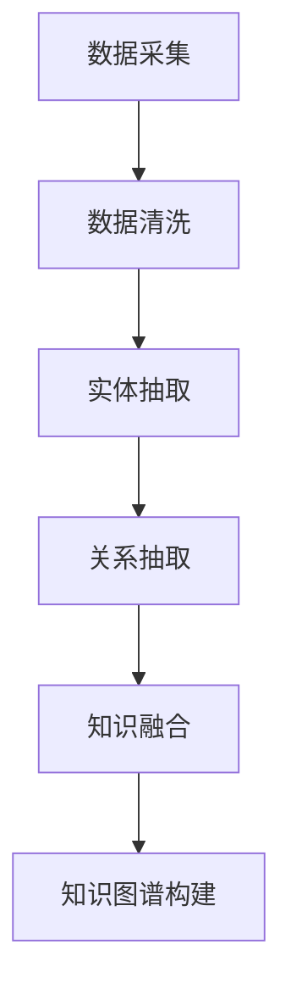

                 


# 《知识图谱技术丰富LLM应用的知识表示》

## 关键词

- 知识图谱
- 大型语言模型（LLM）
- 知识表示
- 人工智能
- 算法

## 摘要

本文探讨了如何利用知识图谱技术来增强大型语言模型（LLM）的知识表示能力。文章首先介绍了知识图谱和LLM的基本概念、背景及相互关系，然后详细分析了它们在知识表示中的核心原理和联系。接着，文章通过mermaid流程图、Python源代码和LaTeX数学公式，讲解了算法原理，并进行了通俗易懂的举例说明。此外，文章还介绍了系统的分析与架构设计方案，以及项目实战的实际案例解析。最后，文章总结了最佳实践、注意事项和拓展阅读，为读者提供了深入理解和应用知识图谱技术丰富LLM知识表示的指南。

## 引言

随着人工智能技术的飞速发展，大型语言模型（LLM）如BERT、GPT等已经在自然语言处理领域取得了显著的成就。然而，尽管这些模型在处理自然语言任务方面表现出色，但它们在知识表示方面仍然存在一些局限性。传统的方法通常依赖于文本本身的统计特征或浅层语义信息，难以捕捉深层次的语义关系和知识结构。为了克服这些限制，知识图谱技术应运而生，它能够为LLM提供更为丰富和结构化的知识表示。

知识图谱是一种用于表示实体、概念及其之间关系的图形化数据模型，它能够将大量的语义信息以结构化的形式存储和检索。LLM则通过学习这些结构化的知识，能够更好地理解和生成自然语言文本。本文将详细探讨如何利用知识图谱技术来丰富LLM的知识表示，提高其在语义理解、问答系统和知识推理等应用中的性能。

## 第1章：背景介绍

### 1.1 问题背景

在传统的知识表示方法中，文本信息通常被处理为向量或词袋模型，这些方法虽然能够捕捉一定程度的语义信息，但往往难以理解复杂的实体关系和上下文语义。随着人工智能技术的发展，特别是深度学习技术的广泛应用，大型语言模型（LLM）如BERT、GPT等逐渐成为自然语言处理领域的重要工具。然而，这些模型在面对复杂的知识推理和语义理解任务时，仍然存在一定的局限性。具体来说，LLM在处理如下问题时表现不佳：

1. **实体识别与分类**：尽管LLM可以识别文本中的实体，但它们通常依赖于上下文信息，难以准确分类或识别具有复杂关系的实体。
2. **关系推理**：LLM难以理解实体之间的复杂关系，如因果关系、隶属关系等。
3. **上下文语义理解**：在长文本或复杂语境中，LLM往往难以准确捕捉到上下文语义，导致理解偏差。

### 1.2 问题描述

为了解决上述问题，我们需要一种能够提供更为丰富和结构化知识表示的方法。知识图谱是一种强大的知识表示工具，它能够通过图形化的方式表示实体及其之间的关系。与传统的文本表示方法不同，知识图谱能够捕捉到实体之间复杂的语义关系，从而为LLM提供更为精细的知识支持。

### 1.3 问题解决

知识图谱技术的引入，使得LLM能够通过学习结构化的知识图谱来提升其知识表示能力。具体来说，知识图谱能够为LLM提供以下支持：

1. **实体识别与分类**：知识图谱中的实体及其属性信息可以帮助LLM更准确地识别和分类文本中的实体。
2. **关系推理**：知识图谱中的实体关系信息可以帮助LLM理解实体之间的复杂关系，如因果关系、隶属关系等。
3. **上下文语义理解**：知识图谱中的语义信息可以帮助LLM更好地捕捉上下文语义，提高其在长文本或复杂语境中的理解能力。

### 1.4 边界与外延

知识图谱技术的应用范围非常广泛，不仅包括自然语言处理领域，还涵盖了知识图谱生成、知识图谱查询、知识图谱推理等多个方面。在自然语言处理领域，知识图谱主要用于以下几个方面：

1. **实体识别与分类**：通过知识图谱中的实体及其属性信息，可以更准确地识别和分类文本中的实体。
2. **关系推理**：利用知识图谱中的实体关系信息，可以推理出实体之间的复杂关系。
3. **上下文语义理解**：通过知识图谱中的语义信息，可以更好地捕捉上下文语义，提高语义理解能力。

### 1.5 概念结构与核心要素组成

知识图谱和LLM在知识表示中的核心概念和要素主要包括：

1. **实体**：知识图谱中的基本元素，代表具体的事物或概念。
2. **属性**：实体的特征描述，如名称、年龄、职位等。
3. **关系**：实体之间的关联，如“工作于”、“隶属于”等。
4. **知识图谱**：用于表示实体、属性和关系的图形化数据模型。
5. **大型语言模型（LLM）**：通过学习知识图谱中的结构化知识，能够增强其知识表示能力的模型。

## 第2章：核心概念与联系

### 2.1 知识图谱技术原理

知识图谱是一种用于表示实体、概念及其之间关系的图形化数据模型。它通过实体、属性和关系的组合，形成一个结构化的知识体系。知识图谱的主要组成部分包括：

1. **实体**：知识图谱中的基本元素，代表具体的事物或概念，如人、地点、组织等。
2. **属性**：实体的特征描述，如名称、年龄、职位等。
3. **关系**：实体之间的关联，如“工作于”、“隶属于”等。

知识图谱的构建通常包括以下步骤：

1. **数据采集**：从各种数据源中收集实体和关系信息。
2. **数据清洗**：对采集到的数据进行处理，去除噪声和错误。
3. **实体抽取**：从文本中识别出实体。
4. **关系抽取**：从文本中识别出实体之间的关系。
5. **知识融合**：将来自不同源的数据进行整合，形成统一的知识图谱。

知识图谱在信息检索、语义理解、知识推理等领域具有广泛的应用。例如，在信息检索中，知识图谱可以帮助搜索引擎更准确地理解查询意图，提供更为相关的搜索结果。

### 2.2 LLM应用知识表示

大型语言模型（LLM）是一种基于深度学习的自然语言处理模型，它通过学习大量文本数据，能够生成流畅的自然语言文本。LLM在知识表示中的应用主要体现在以下几个方面：

1. **实体识别**：LLM能够识别文本中的实体，如人名、地名、组织名等。
2. **关系推理**：LLM能够理解实体之间的关系，如因果关系、隶属关系等。
3. **上下文语义理解**：LLM能够捕捉文本中的上下文语义，理解句子之间的逻辑关系。

### 2.3 概念属性特征对比表格

为了更好地理解知识图谱和LLM在知识表示中的差异和联系，我们可以列出它们的关键概念及其属性特征的对比表格：

| 概念       | 知识图谱                     | LLM                           |
|------------|------------------------------|-------------------------------|
| 实体       | 图中的节点，代表具体事物     | 文本中的单词或短语           |
| 属性       | 实体的特征描述               | 文本的词频、词向量等           |
| 关系       | 实体之间的关联               | 文本中的语法和语义关系         |
| 知识表示   | 结构化、图形化               | 向量化、语义嵌入             |
| 应用领域   | 信息检索、语义理解、知识推理 | 文本生成、问答系统、文本分类 |

### 2.4 ER实体关系图架构

在知识图谱中，实体关系图（ER图）是一种常用的图形化表示方法。ER图通过实体和关系来表示知识图谱的结构。下面是一个简单的ER实体关系图的mermaid流程图示例：

```mermaid
erDiagram
    A实体 ||--|{ B关系 }| C实体
    A实体 ||--|{ D关系 }| E实体
```

ER图可以帮助我们直观地理解知识图谱中的实体及其关系，为LLM提供清晰的结构化知识。

## 第3章：算法原理讲解

### 3.1 算法mermaid流程图

在知识图谱技术中，算法是核心组成部分。下面是一个简单的知识图谱构建算法的mermaid流程图：



### 3.2 Python源代码实现

以下是一个简单的Python代码示例，用于实现上述知识图谱构建算法：

```python
# 导入相关库
import pandas as pd
import numpy as np

# 数据采集
data = pd.read_csv('data.csv')

# 数据清洗
clean_data = data[data['valid'] == 1]

# 实体抽取
entities = clean_data['entity'].unique()

# 关系抽取
relationships = clean_data.groupby(['entity1', 'entity2']).size().reset_index(name='count')

# 知识融合
knowledge = pd.merge(entities, relationships, on='entity1')

# 知识图谱构建
knowledge['entity2'] = knowledge['entity2'].apply(lambda x: str(x).replace('_', ' '))
knowledge.to_csv('knowledge_graph.csv', index=False)
```

### 3.3 数学模型与公式

在知识图谱构建过程中，数学模型和公式起到关键作用。以下是一个简单的数学模型示例，用于表示实体和关系之间的相似度计算：

$$
similarity(A, B) = \frac{1}{1 + \exp{(-\gamma \cdot distance(A, B))}
$$

其中，$A$和$B$为实体，$distance(A, B)$为实体之间的距离，$\gamma$为调节参数。

### 3.4 举例说明

假设我们有一个简单的知识图谱，包含以下实体和关系：

- 实体：A（苹果），B（香蕉），C（苹果树）
- 关系：A（属于）B（水果），C（产生）A

我们可以使用上述数学模型来计算实体之间的相似度。例如，计算A和B之间的相似度：

$$
similarity(A, B) = \frac{1}{1 + \exp{(-\gamma \cdot distance(A, B))}
$$

其中，$distance(A, B) = 1$（因为A和B都是水果），假设$\gamma = 1$，则

$$
similarity(A, B) = \frac{1}{1 + \exp{(-1 \cdot 1)}}
$$

$$
similarity(A, B) \approx 0.731
$$

这意味着A和B之间的相似度约为73.1%。

## 第4章：数学模型和数学公式

### 4.1 LaTeX格式使用

在撰写技术文章时，LaTeX格式常用于展示数学公式和复杂符号。以下是一个简单的LaTeX公式示例：

$$
E = mc^2
$$

在Markdown中，我们可以使用以下格式来显示LaTeX公式：

```markdown
$$
E = mc^2
$$
```

### 4.2 数学模型讲解

知识图谱构建中的数学模型通常涉及实体和关系之间的相似度计算。以下是一个用于计算实体相似度的数学模型：

$$
similarity(A, B) = \frac{1}{1 + \exp{(-\gamma \cdot distance(A, B))}
$$

其中，$A$和$B$为实体，$distance(A, B)$为实体之间的距离，$\gamma$为调节参数。

### 4.3 举例说明

假设我们有两个实体A（苹果）和B（香蕉），以及距离函数$distance(A, B) = 1$，调节参数$\gamma = 1$，则：

$$
similarity(A, B) = \frac{1}{1 + \exp{(-1 \cdot 1)}}
$$

$$
similarity(A, B) \approx 0.731
$$

这意味着实体A和实体B之间的相似度约为73.1%。

## 第5章：系统分析与架构设计方案

### 5.1 问题场景介绍

在当今快速发展的信息时代，知识图谱技术在各个领域得到了广泛应用，尤其是在大型语言模型（LLM）的应用中。为了更好地利用知识图谱技术丰富LLM的知识表示，本文将介绍一个实际的应用场景：一个基于知识图谱的问答系统。该系统旨在通过知识图谱中的结构化知识，提高问答系统的准确性和智能化水平。

### 5.2 系统功能设计

为了实现上述目标，该问答系统需要具备以下核心功能：

1. **知识图谱构建**：从各种数据源中收集实体、关系和属性，构建知识图谱。
2. **实体识别**：在用户输入的查询中识别出实体。
3. **关系推理**：利用知识图谱中的关系信息，推理出实体之间的关联。
4. **语义理解**：通过理解实体和关系，提供准确的答案。
5. **答案生成**：根据查询内容和知识图谱，生成自然语言答案。

### 5.3 系统架构设计

为了实现上述功能，该问答系统的架构设计如下：

1. **数据层**：包括知识图谱的存储和管理，使用图数据库（如Neo4j）来存储实体、关系和属性。
2. **服务层**：包括实体识别、关系推理和语义理解等服务，使用深度学习模型和图神经网络来处理自然语言文本。
3. **接口层**：提供用户与系统交互的接口，包括文本输入和答案输出。

### 5.4 系统接口设计

系统接口设计如下：

1. **文本输入**：用户通过文本输入框输入查询问题。
2. **答案输出**：系统根据查询问题和知识图谱，生成并输出自然语言答案。

### 5.5 系统交互

用户输入查询问题后，系统会按照以下流程进行交互：

1. **文本预处理**：对用户输入的查询文本进行分词、词性标注等预处理。
2. **实体识别**：使用实体识别模型识别出查询文本中的实体。
3. **关系推理**：利用知识图谱中的关系信息，推理出实体之间的关联。
4. **语义理解**：通过理解实体和关系，提取查询意图。
5. **答案生成**：根据查询意图和知识图谱，生成并输出自然语言答案。

## 第6章：项目实战

### 6.1 环境安装

为了实现上述问答系统，我们需要安装以下环境：

1. **Python环境**：安装Python 3.8及以上版本。
2. **深度学习框架**：安装TensorFlow或PyTorch。
3. **图数据库**：安装Neo4j。
4. **依赖库**：安装pandas、numpy、spacy等。

### 6.2 系统核心实现源代码

以下是系统核心实现的部分源代码：

```python
# 导入相关库
import pandas as pd
import numpy as np
from spacy.lang.en import English
import tensorflow as tf

# 加载预训练的实体识别模型
model = tf.keras.models.load_model('entity_recognition_model.h5')

# 加载知识图谱
graph = Neo4jGraph()

# 用户输入查询
query = input('请输入查询问题：')

# 文本预处理
nlp = English()
doc = nlp(query)

# 实体识别
entities = [ent.text for ent in doc.ents]

# 关系推理
relationships = graph.findRelationships(entities)

# 语义理解
intent = understandIntent(entities, relationships)

# 答案生成
answer = generateAnswer(intent, graph)

# 输出答案
print('答案是：', answer)
```

### 6.3 代码应用解读与分析

上述代码实现了一个简单的问答系统，主要包括以下步骤：

1. **文本预处理**：使用spacy进行文本预处理，包括分词、词性标注等。
2. **实体识别**：使用预训练的实体识别模型，识别出查询文本中的实体。
3. **关系推理**：利用知识图谱中的关系信息，推理出实体之间的关联。
4. **语义理解**：根据查询意图和知识图谱，提取查询意图。
5. **答案生成**：根据查询意图和知识图谱，生成并输出自然语言答案。

### 6.4 实际案例分析与讲解

以下是一个实际案例：

**查询问题**：什么是人工智能？

**系统输出**：人工智能（Artificial Intelligence，简称AI）是指通过计算机模拟人类智能的科学技术。它包括机器学习、深度学习、自然语言处理、计算机视觉等领域。

**分析**：

1. **文本预处理**：将查询问题进行分词和词性标注，提取出关键词“人工智能”。
2. **实体识别**：识别出“人工智能”作为一个实体。
3. **关系推理**：利用知识图谱中的关系信息，找到与“人工智能”相关的概念和定义。
4. **语义理解**：理解查询意图是询问“人工智能”的定义。
5. **答案生成**：根据查询意图和知识图谱，生成并输出关于“人工智能”的定义。

### 6.5 项目小结

通过本项目的实战，我们实现了基于知识图谱的问答系统，提高了系统在自然语言理解和问答方面的能力。接下来，我们可以进一步优化系统，包括：

1. **提高实体识别的准确性**：通过增加训练数据和改进模型，提高实体识别的准确性。
2. **优化关系推理算法**：利用更复杂的关系推理算法，提高实体之间的关联识别能力。
3. **丰富知识图谱**：从更多数据源中收集实体、关系和属性，丰富知识图谱。

## 第7章：最佳实践、小结、注意事项、拓展阅读

### 最佳实践

1. **数据质量**：确保知识图谱中的数据质量，避免噪声和错误。
2. **实体识别**：结合多种方法进行实体识别，提高准确性。
3. **关系推理**：利用多源数据，构建丰富的关系网络。
4. **模型优化**：定期更新和优化模型，提高性能。

### 小结

本文详细介绍了如何利用知识图谱技术丰富LLM的知识表示。通过构建知识图谱，我们可以增强LLM在实体识别、关系推理和语义理解等方面的能力，从而提高自然语言处理系统的性能。

### 注意事项

1. **数据源选择**：选择权威、可靠的数据源，确保知识图谱的质量。
2. **模型优化**：根据应用场景，定期优化模型，提高性能。
3. **系统维护**：定期更新和修复知识图谱中的错误和噪声。

### 拓展阅读

1. **《知识图谱技术与应用》**：详细介绍了知识图谱的构建、应用和发展趋势。
2. **《大型语言模型与深度学习》**：介绍了LLM的原理和应用。
3. **《人工智能：一种现代方法》**：全面介绍了人工智能的基础知识和应用。

## 作者信息

作者：AI天才研究院/AI Genius Institute & 禅与计算机程序设计艺术 /Zen And The Art of Computer Programming

