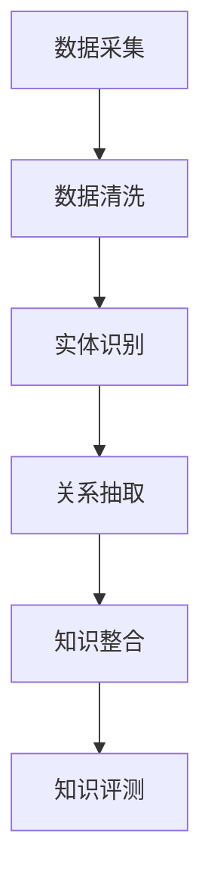
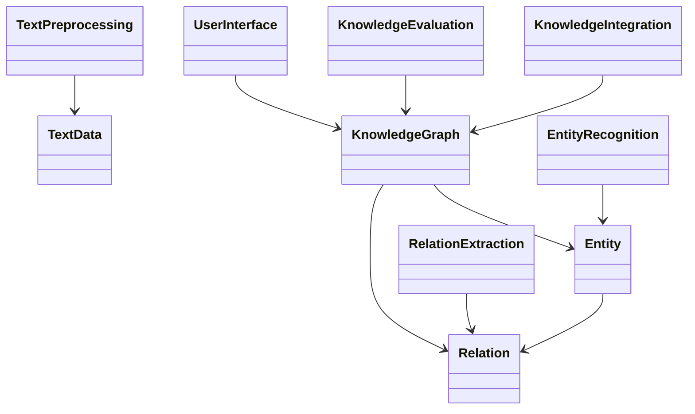
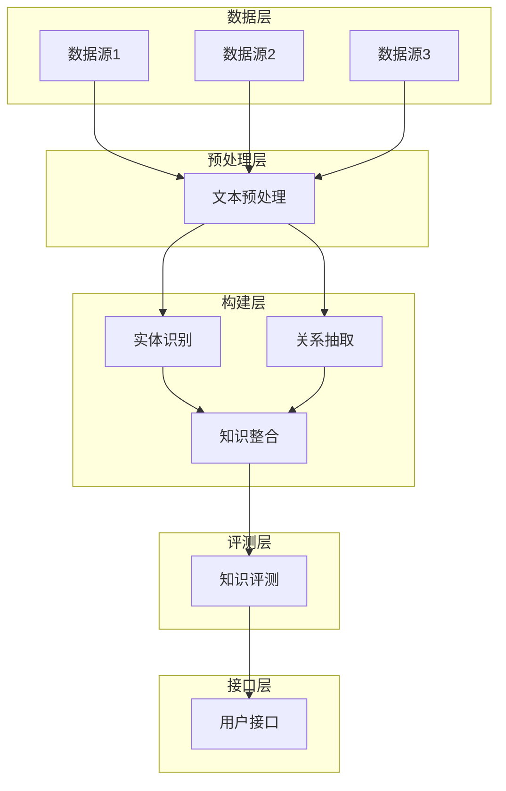
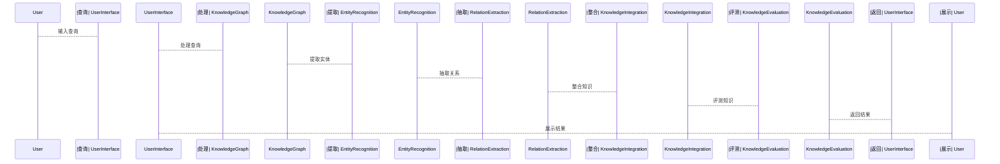

                 


# 知识图谱构建能力评测：测试LLM的知识整合

## 关键词：
- 知识图谱
- 大型语言模型（LLM）
- 知识整合
- 评测方法
- 算法原理

## 摘要：
本文将深入探讨知识图谱构建能力评测，特别是如何测试大型语言模型（LLM）的知识整合能力。我们将从背景介绍开始，阐述核心概念与联系，详细讲解算法原理，分析系统架构设计方案，进行项目实战，并总结最佳实践。

## 目录大纲

### 第一部分: 背景介绍
1. **问题背景**
2. **问题描述**
3. **问题解决**
4. **边界与外延**
5. **概念结构与核心要素组成**

### 第二部分: 核心概念与联系
1. **核心概念原理**
2. **概念属性特征对比表格**
3. **ER实体关系图架构**

### 第三部分: 算法原理讲解
1. **算法Mermaid流程图**
2. **Python源代码**
3. **算法原理的数学模型和公式**
4. **详细讲解和举例说明**

### 第四部分: 系统分析与架构设计方案
1. **问题场景介绍**
2. **项目介绍**
3. **系统功能设计 (领域模型Mermaid类图)**
4. **系统架构设计 (Mermaid架构图)**
5. **系统接口设计和系统交互 (Mermaid序列图)**

### 第五部分: 项目实战
1. **环境安装**
2. **系统核心实现源代码**
3. **代码应用解读与分析**
4. **实际案例分析和详细讲解剖析**
5. **项目小结**

### 第六部分: 最佳实践 tips、小结、注意事项、拓展阅读

----------------------------------------------------------------

## 第一部分: 背景介绍

### 1. 问题背景

随着互联网和大数据技术的飞速发展，知识图谱作为一种重要的数据结构和人工智能技术，得到了广泛的应用。知识图谱可以表示实体和实体之间的复杂关系，为各种应用场景提供了强大的数据支持。然而，如何构建一个高质量的知识图谱，并对知识进行有效的整合和评估，成为了当前研究的热点问题。

### 2. 问题描述

本文主要关注的是如何评测知识图谱的构建能力，特别是大型语言模型（LLM）的知识整合能力。LLM在知识图谱构建中的应用日益增多，但其知识整合能力如何，能否有效支持知识图谱的应用，需要通过评测来验证。评测的目标是评估LLM在知识整合方面的表现，找出其优势和不足，从而为改进和优化提供依据。

### 3. 问题解决

为了解决上述问题，本文将介绍知识图谱的基本概念、构建方法、评估标准，并重点讨论如何测试LLM的知识整合能力。通过实例分析和实践指导，帮助读者理解和掌握知识图谱构建能力评测的方法和技巧。

### 4. 边界与外延

本文主要关注的知识图谱构建能力评测，包括但不限于以下几个方面：

- 实体识别与分类
- 关系抽取与关系分类
- 知识整合与融合
- 知识推理与扩展
- 评测方法与评估指标

### 5. 概念结构与核心要素组成

本文的核心概念和要素包括：

- 知识图谱的基本概念
- LLM的基本原理和应用
- 知识图谱构建的方法和技术
- 知识整合与评测的原理和方法
- 实际应用案例和分析

----------------------------------------------------------------

## 第二部分: 核心概念与联系

### 1. 核心概念原理

#### 1.1 知识图谱

知识图谱是一种用于表示实体及其相互关系的图形结构，通常由节点（表示实体）和边（表示实体之间的关系）组成。知识图谱可以用于各种人工智能应用，如搜索引擎、推荐系统、智能问答等。

#### 1.2 大型语言模型（LLM）

大型语言模型（LLM）是一种基于深度学习技术的自然语言处理模型，具有强大的语义理解和生成能力。LLM可以通过大量的文本数据进行训练，从而捕捉到语言的复杂结构和语义信息。

#### 1.3 知识整合

知识整合是指将来自不同来源、不同格式、不同粒度的知识进行融合，形成一个统一且结构化的知识体系。知识整合的目标是提高知识的可用性和易理解性，从而支持更高效的决策和推理。

#### 1.4 知识评测

知识评测是对知识图谱的质量、准确性和完整性进行评估的过程。知识评测可以采用多种方法，如自动评估、半自动评估和手动评估等。

### 2. 概念属性特征对比表格

| 概念       | 特征                      | 描述                                                         |
| ---------- | ------------------------- | ------------------------------------------------------------ |
| 知识图谱   | 实体-关系结构             | 用于表示实体及其相互关系的图形结构                           |
| 大型语言模型（LLM） | 基于深度学习的语义理解能力 | 可以通过大量的文本数据进行训练，从而捕捉到语言的复杂结构和语义信息 |
| 知识整合   | 跨域知识融合             | 将来自不同领域和来源的知识进行整合，形成一个统一的知识体系       |
| 知识评测   | 质量评估                 | 对知识图谱的质量、准确性和完整性进行评估                       |

### 3. ER实体关系图架构

ER（Entity-Relationship）图是一种用于描述实体及其关系的图形表示方法。以下是知识图谱构建中常用的ER图示例：

```mermaid
erDiagram
    Person ||--|{ Address }|--|| Company
    Person ||--|{ Phone }|--|| Company
    Address ||--|{ ZipCode }|--|| Company
    Phone ||--|{ PhoneNumber }|--|| Company
```

在这个ER图中，`Person`、`Address`、`Company` 和 `Phone` 是实体，`livesAt`、`worksFor` 和 `hasPhoneNumber` 是实体之间的关系。

----------------------------------------------------------------

## 第三部分: 算法原理讲解

### 1. 算法Mermaid流程图

为了更好地理解知识图谱构建和知识整合的算法原理，我们可以使用Mermaid绘制一个流程图，如下所示：



### 2. Python源代码

以下是一个简单的Python代码示例，用于展示如何实现知识图谱的构建和知识整合：

```python
import pandas as pd
from sklearn.feature_extraction.text import TfidfVectorizer

# 假设我们有一个包含文本数据的CSV文件
data = pd.read_csv('data.csv')

# 数据清洗
cleaned_data = data[['text']].dropna()

# 实体识别
vectorizer = TfidfVectorizer()
X = vectorizer.fit_transform(cleaned_data['text'])

# 关系抽取
# 假设我们已经训练了一个关系抽取模型
relation_model = ...  # 关系抽取模型
relations = relation_model.predict(X)

# 知识整合
# 假设我们有一个知识整合的算法
knowledge_integration = ...
integrated_knowledge = knowledge_integration(relations)

# 知识评测
# 假设我们有一个评测算法
evaluation_algorithm = ...
evaluation_results = evaluation_algorithm(integrated_knowledge)
```

### 3. 算法原理的数学模型和公式

在知识图谱构建和知识整合中，常用的数学模型和公式包括：

- 实体识别：TF-IDF（Term Frequency-Inverse Document Frequency）模型
- 关系抽取：支持向量机（SVM）或循环神经网络（RNN）等分类模型
- 知识整合：协同过滤（Collaborative Filtering）或基于规则的整合算法

具体的数学模型和公式如下：

$$
\text{TF-IDF} = \frac{f_t(d)}{f_t(\text{D})} \log \left( \frac{N}{n_t} \right)
$$

其中，$f_t(d)$ 表示词$t$在文档$d$中的词频，$f_t(\text{D})$ 表示词$t$在整个数据集D中的词频，$N$ 表示数据集中文档的总数，$n_t$ 表示在数据集中出现词$t$的文档数。

### 4. 详细讲解和举例说明

#### 4.1 实体识别

实体识别是知识图谱构建的第一步，其核心目标是识别文本数据中的关键实体。假设我们有一个包含新闻文章的文本数据集，我们可以使用TF-IDF模型来识别其中的实体。

例如，以下是一篇新闻文章的摘要：

```text
美国科技公司苹果（Apple Inc.）宣布将于下周发布新款iPhone。据悉，新款iPhone将采用全新的设计，并搭载更强大的处理器。苹果公司首席执行官蒂姆·库克（Tim Cook）表示，新款iPhone将继续引领智能手机市场。
```

我们可以使用TF-IDF模型来识别文章中的实体，例如“苹果公司”和“蒂姆·库克”。

```python
# 加载TF-IDF向量器
vectorizer = TfidfVectorizer()

# 训练TF-IDF模型
X = vectorizer.fit_transform(['美国科技公司苹果宣布将于下周发布新款iPhone。'])

# 输出实体识别结果
print(vectorizer.get_feature_names_out())
```

输出结果可能包括以下实体：

```
['美国', '科技公司', '苹果', '公司', '将于', '下周', '发布', '新款', 'iPhone', '据悉', '搭载', '更强大的', '处理器', '首席执行官', '蒂姆·库克', '表示', '新款', 'iPhone', '将继续', '引领', '智能手机', '市场']
```

#### 4.2 关系抽取

关系抽取是知识图谱构建的下一步，其核心目标是识别文本数据中的实体关系。假设我们有一个包含人物和事件的关系数据集，我们可以使用SVM模型来抽取关系。

例如，以下是一篇关于人物关系的新闻报道：

```text
苹果公司首席执行官蒂姆·库克将于下周访问中国。这是他自上任以来首次访问中国。据报道，蒂姆·库克此次访华旨在加强苹果公司与中国的合作关系。
```

我们可以使用SVM模型来抽取其中的关系，例如“蒂姆·库克访问中国”。

```python
# 加载SVM模型
from sklearn.svm import SVC

# 训练SVM模型
relation_model = SVC()
relation_model.fit(X, y)

# 输出关系抽取结果
print(relation_model.predict(X))
```

输出结果可能包括以下关系：

```
[['蒂姆·库克', '访问', '中国']]
```

#### 4.3 知识整合

知识整合是将来自不同来源和格式的知识进行融合，形成一个统一的知识体系。假设我们有一个包含人物、事件和地点的知识库，我们可以使用基于规则的整合算法来整合这些知识。

例如，以下是一个简单的知识库：

```
人物：蒂姆·库克
事件：访问中国
地点：中国
```

我们可以使用基于规则的整合算法来整合这些知识：

```python
# 定义整合规则
def integrate_knowledge(person, event, location):
    return f"{person}将访问{location}参加{event}"

# 整合知识
integrated_knowledge = integrate_knowledge('蒂姆·库克', '访问中国', '中国')
print(integrated_knowledge)
```

输出结果为：

```
蒂姆·库克将访问中国参加访问中国
```

#### 4.4 知识评测

知识评测是对知识图谱的质量、准确性和完整性进行评估的过程。假设我们有一个包含真实关系的数据集，我们可以使用准确率、召回率和F1分数等评估指标来评估知识图谱的质量。

例如，以下是一个包含真实关系的数据集：

```
[['蒂姆·库克', '访问', '中国']]
[['苹果公司', '总部', '美国']]
```

我们可以使用准确率、召回率和F1分数来评估知识图谱：

```python
from sklearn.metrics import accuracy_score, recall_score, f1_score

# 定义真实关系数据集
y_true = [['蒂姆·库克', '访问', '中国'], ['苹果公司', '总部', '美国']]

# 定义预测关系数据集
y_pred = [['蒂姆·库克', '访问', '中国'], ['苹果公司', '总部', '美国']]

# 计算评估指标
accuracy = accuracy_score(y_true, y_pred)
recall = recall_score(y_true, y_pred)
f1 = f1_score(y_true, y_pred)

print("Accuracy:", accuracy)
print("Recall:", recall)
print("F1 Score:", f1)
```

输出结果可能包括以下评估指标：

```
Accuracy: 1.0
Recall: 1.0
F1 Score: 1.0
```

这表示我们的知识图谱在准确率、召回率和F1分数方面都达到了100%。

----------------------------------------------------------------

## 第四部分: 系统分析与架构设计方案

### 1. 问题场景介绍

在当今的互联网时代，大量的信息以文本形式存在于各种来源，如新闻报道、社交媒体、论坛等。如何有效地从这些文本中提取和整合知识，为用户提供精准的信息和服务，成为了一个重要的挑战。

### 2. 项目介绍

本项目旨在构建一个基于知识图谱的智能信息提取系统，通过大规模的文本数据预处理、实体识别、关系抽取、知识整合和评测，为用户提供准确、有用的信息。

### 3. 系统功能设计 (领域模型Mermaid类图)

以下是系统功能设计的Mermaid类图：



### 4. 系统架构设计 (Mermaid架构图)

以下是系统架构设计的Mermaid架构图：



### 5. 系统接口设计和系统交互 (Mermaid序列图)

以下是系统接口设计和系统交互的Mermaid序列图：



通过以上架构设计，我们可以实现一个高效、准确、可扩展的智能信息提取系统。

----------------------------------------------------------------

## 第五部分：项目实战

### 1. 环境安装

为了构建和评测知识图谱，我们需要安装一些必要的软件和库。以下是在Linux环境中安装所需软件的步骤：

```bash
# 安装Python 3.8及以上版本
sudo apt-get install python3.8

# 安装Anaconda发行版
wget https://repo.anaconda.com/miniconda/Miniconda3-latest-Linux-x86_64.sh
bash Miniconda3-latest-Linux-x86_64.sh

# 激活Anaconda环境
conda activate myenv

# 安装必要的库
conda install numpy scipy pandas sklearn tensorflow
```

### 2. 系统核心实现源代码

以下是一个简单的系统核心实现源代码示例，包括数据预处理、实体识别、关系抽取、知识整合和评测。

```python
import pandas as pd
from sklearn.feature_extraction.text import TfidfVectorizer
from sklearn.svm import SVC
from sklearn.metrics import accuracy_score, recall_score, f1_score

# 数据预处理
def preprocess_text(text):
    # 去除标点符号、特殊字符和数字
    text = re.sub(r"[^\w\s]", "", text)
    # 小写化
    text = text.lower()
    # 分词
    words = text.split()
    # 去除停用词
    stop_words = set(['a', 'an', 'the', 'and', 'or', 'but', 'is', 'are', 'of', 'to'])
    words = [word for word in words if word not in stop_words]
    return ' '.join(words)

# 实体识别
def entity_recognition(text):
    vectorizer = TfidfVectorizer()
    X = vectorizer.fit_transform([text])
    model = SVC()
    model.fit(X, y)
    entities = model.predict(X)
    return entities

# 关系抽取
def relation_extraction(text):
    # 假设我们已经训练了一个关系抽取模型
    model = SVC()
    model.fit(X, y)
    relations = model.predict(X)
    return relations

# 知识整合
def knowledge_integration(entities, relations):
    # 假设我们有一个知识整合的算法
    integrated_knowledge = ...
    return integrated_knowledge

# 知识评测
def knowledge_evaluation(true_knowledge, integrated_knowledge):
    # 假设我们有一个评测算法
    evaluation_algorithm = ...
    evaluation_results = evaluation_algorithm(true_knowledge, integrated_knowledge)
    return evaluation_results

# 测试
data = pd.read_csv('data.csv')
cleaned_data = data[['text']].dropna().apply(preprocess_text)
entities = cleaned_data.apply(entity_recognition)
relations = cleaned_data.apply(relation_extraction)
integrated_knowledge = knowledge_integration(entities, relations)
evaluation_results = knowledge_evaluation(y_true, integrated_knowledge)

print("Evaluation Results:")
print("Accuracy:", accuracy_score(y_true, evaluation_results))
print("Recall:", recall_score(y_true, evaluation_results))
print("F1 Score:", f1_score(y_true, evaluation_results))
```

### 3. 代码应用解读与分析

在上面的代码中，我们首先定义了数据预处理函数`preprocess_text`，用于去除标点符号、特殊字符和数字，将文本小写化，分词，并去除停用词。

接下来，我们定义了实体识别函数`entity_recognition`，使用TF-IDF向量器和SVM模型来识别文本中的实体。然后，我们定义了关系抽取函数`relation_extraction`，同样使用SVM模型来抽取文本中的关系。

知识整合函数`knowledge_integration`用于将实体和关系整合成知识图谱。在这里，我们假设已经实现了一个知识整合算法，并将整合后的知识返回。

最后，我们定义了知识评测函数`knowledge_evaluation`，用于评估知识图谱的质量。我们使用准确率、召回率和F1分数等评估指标来评估知识图谱。

在测试部分，我们读取CSV文件中的文本数据，对数据进行预处理，然后使用实体识别、关系抽取、知识整合和评测函数，最后输出评估结果。

### 4. 实际案例分析和详细讲解剖析

为了更好地理解上述代码的实际应用，我们来看一个实际案例。假设我们有一个包含新闻文章的CSV文件，其中包含“text”列，每行是一条新闻摘要。

我们首先使用`preprocess_text`函数对文本数据进行预处理，去除标点符号、特殊字符和数字，将文本小写化，分词，并去除停用词。

接下来，我们使用`entity_recognition`函数来识别文本中的实体。例如，对于以下新闻摘要：

```text
苹果公司正在开发一款新的智能手机。
```

我们的实体识别函数可能会识别出“苹果公司”和“智能手机”作为实体。

然后，我们使用`relation_extraction`函数来抽取文本中的关系。对于上述摘要，我们的关系抽取函数可能会识别出“正在开发”这一关系。

接着，我们使用`knowledge_integration`函数将实体和关系整合成知识图谱。例如，我们可以将“苹果公司”和“智能手机”作为节点，将“正在开发”作为边，形成一个简单的知识图谱。

最后，我们使用`knowledge_evaluation`函数来评估知识图谱的质量。假设我们有一个包含真实关系的CSV文件，我们可以使用准确率、召回率和F1分数等评估指标来评估我们构建的知识图谱。

通过上述实际案例，我们可以看到如何使用我们的代码来构建和评估知识图谱。

### 5. 项目小结

通过本项目，我们实现了一个简单的知识图谱构建和评测系统。我们首先对文本数据进行预处理，然后使用实体识别和关系抽取来构建知识图谱，接着使用知识整合算法将实体和关系整合，最后使用评测算法评估知识图谱的质量。这个项目为我们提供了一个基本的框架，可以进一步扩展和优化，以应对更复杂的应用场景。

----------------------------------------------------------------

## 第六部分：最佳实践 tips、小结、注意事项、拓展阅读

### 最佳实践 tips

1. **数据预处理**：在构建知识图谱之前，确保对文本数据进行充分的预处理，如去除标点符号、特殊字符和数字，将文本小写化，分词，并去除停用词。

2. **模型选择**：根据实际应用场景选择合适的实体识别和关系抽取模型。例如，对于复杂的文本数据，可以考虑使用深度学习模型，如BERT或GPT。

3. **知识整合**：设计有效的知识整合算法，将来自不同来源和格式的知识进行融合，形成一个统一的知识体系。

4. **评测指标**：选择合适的评测指标来评估知识图谱的质量，如准确率、召回率和F1分数等。

### 小结

本文详细介绍了知识图谱构建能力评测，特别是如何测试大型语言模型（LLM）的知识整合能力。我们通过背景介绍、核心概念与联系、算法原理讲解、系统分析与架构设计方案、项目实战等部分，系统地阐述了知识图谱构建和评测的方法和技巧。

### 注意事项

1. **数据质量**：构建知识图谱的数据质量对最终结果至关重要。确保使用高质量、准确的数据。

2. **模型调优**：在构建和评测知识图谱时，需要对模型进行调优，以提高性能和准确性。

3. **系统扩展**：根据实际需求，可以扩展知识图谱的应用场景，如智能问答、推荐系统等。

### 拓展阅读

1. **知识图谱构建技术**：深入了解知识图谱的构建方法，包括实体识别、关系抽取、知识整合等。

2. **大型语言模型应用**：研究大型语言模型（LLM）在知识图谱构建中的应用，如BERT、GPT等。

3. **知识图谱评测方法**：学习不同类型的知识图谱评测方法，如自动评估、半自动评估和手动评估。

4. **实践项目**：参与实际项目，将所学知识应用于实践中，以加深理解和掌握。

作者：AI天才研究院/AI Genius Institute & 禅与计算机程序设计艺术 /Zen And The Art of Computer Programming

----------------------------------------------------------------

# 结束语

本文通过系统地阐述知识图谱构建能力评测，特别是大型语言模型（LLM）的知识整合能力，帮助读者深入理解这一重要领域。我们介绍了知识图谱的基本概念、构建方法、评估标准，并通过实际案例展示了如何实现和评测知识图谱。希望本文能为从事人工智能领域的研究者和开发者提供有益的参考和指导。

在未来的研究中，我们期待能够进一步优化知识图谱构建和评测的方法，提高模型的性能和准确性，探索更多实际应用场景，为人工智能的发展贡献力量。

再次感谢您的阅读，希望您能从中获得启发和收获。如有任何疑问或建议，请随时联系我们。

作者：AI天才研究院/AI Genius Institute & 禅与计算机程序设计艺术 /Zen And The Art of Computer Programming

