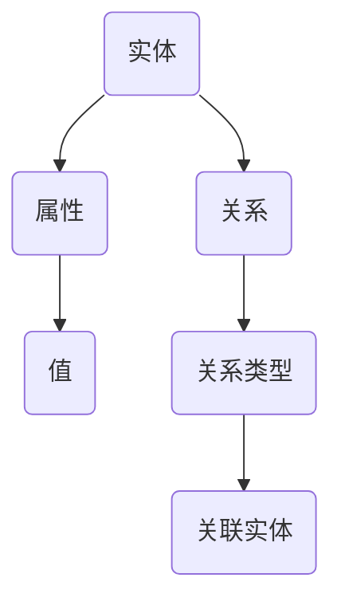
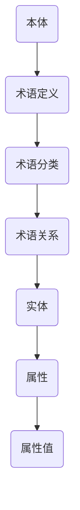
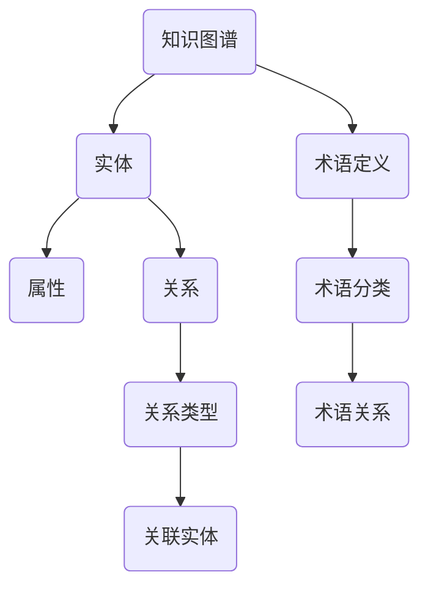
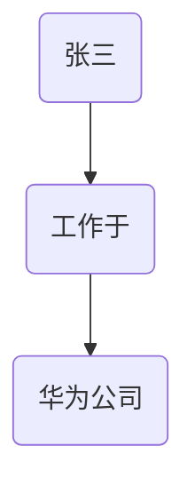
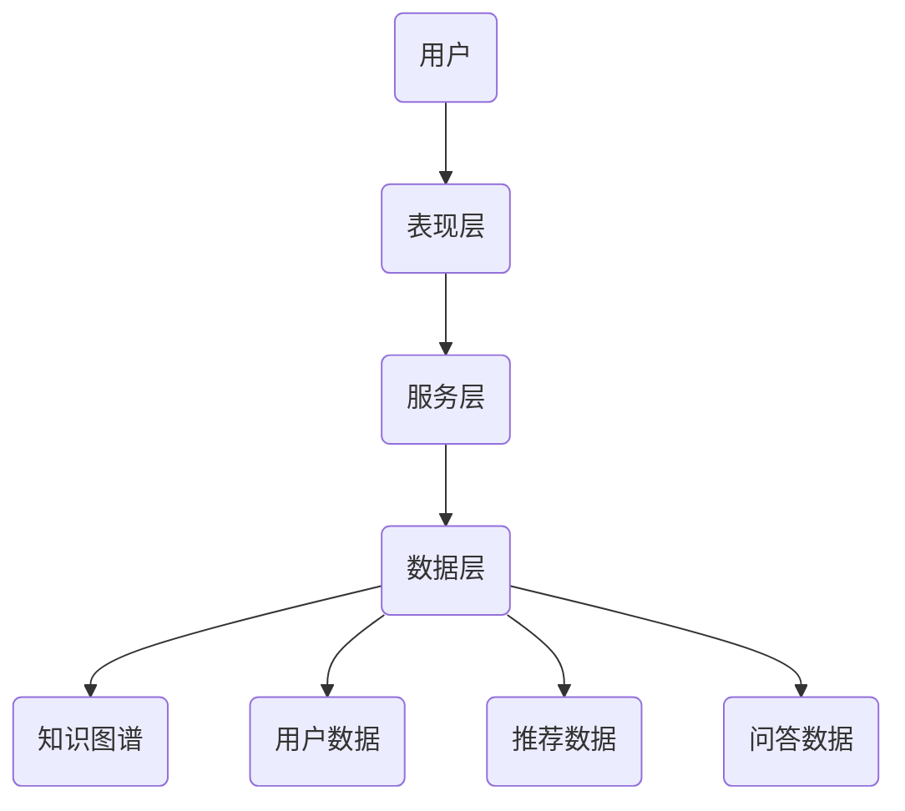

                 


# 知识图谱：丰富LLM应用的知识表示

关键词：知识图谱，LLM，知识表示，语义网络，本体论，自动化问答，推荐系统

摘要：本文将深入探讨知识图谱在增强语言模型（LLM）应用方面的作用。通过详细的章节内容，读者将了解到知识图谱的构建方法、知识表示技术、以及其在各种应用场景中的具体实现。文章旨在为读者提供一个全面而深入的理解，从而在未来的开发中更好地利用知识图谱来提升LLM的性能。

## 第1章 引言

### 1.1 书籍目的与结构

本文书籍旨在探讨知识图谱如何丰富语言模型（LLM）的应用。随着人工智能技术的发展，语言模型在自然语言处理（NLP）领域取得了显著进展。然而，仅仅依靠大规模语言模型往往难以满足复杂应用场景的需求。知识图谱作为一种强大的知识表示工具，能够为语言模型提供更加丰富的背景知识和语义信息，从而提升其表现能力。

本文书籍分为四个主要部分。第一部分将介绍知识图谱的背景和基础知识，包括知识图谱的定义、发展历程及其重要性。第二部分将详细阐述知识图谱的构建过程，包括数据收集、预处理和图构建等步骤。第三部分将探讨知识表示技术，包括语义网络、本体论和模糊逻辑等。第四部分将展示知识图谱在自动化问答、推荐系统等实际应用中的效果。

### 1.2 知识图谱概述

知识图谱是一种结构化的语义知识库，用于表示实体、概念及其之间的关系。它可以看作是一种图形化的数据库，其中实体是节点，关系是边。知识图谱的出现，解决了传统关系数据库在语义表示上的局限性，使得数据之间的语义关系能够更加直观地表达出来。

知识图谱的起源可以追溯到万维网的发展。随着Web2.0时代的到来，用户生成的内容和数据量急剧增加，传统的基于关键词搜索的方法已经无法满足用户对信息检索的需求。知识图谱的出现，为搜索引擎提供了更加精准的语义搜索能力。

### 1.3 知识表示的重要性

在人工智能领域，知识表示是一个核心问题。语言模型作为人工智能的一种形式，其性能在很大程度上依赖于对知识的理解和表示。传统的知识表示方法，如关键字匹配和词袋模型，存在许多局限性。而知识图谱提供了一种更加结构化和语义化的知识表示方法，使得语言模型能够更好地理解和利用外部知识。

知识图谱的重要性主要体现在以下几个方面：

1. **语义理解**：知识图谱能够将实体和概念之间的关系结构化地表示出来，从而帮助语言模型更好地理解语言中的语义关系。
2. **知识增强**：知识图谱可以为语言模型提供额外的背景知识，从而增强其推理能力和回答问题的能力。
3. **精准检索**：知识图谱能够提供更加精准的语义搜索能力，使得搜索引擎能够更好地满足用户的需求。

## 第2章 知识图谱的背景

### 2.1 知识图谱的发展历程

知识图谱的发展历程可以追溯到20世纪80年代，当时以本体论和知识表示为基础的研究逐渐兴起。早期的知识图谱主要是为了支持智能问答系统，如公开领域的自由文本问答系统。随着互联网的发展，知识图谱的应用逐渐扩展到搜索引擎、社交网络和电子商务等领域。

在21世纪初，随着Web2.0的兴起，用户生成的内容和数据量急剧增加，传统的基于关键词搜索的方法已经无法满足用户对信息检索的需求。知识图谱作为一种能够结构化表示语义信息的方法，逐渐成为学术界和工业界的研究热点。

### 2.2 知识图谱的应用场景

知识图谱的应用场景非常广泛，主要包括以下几个方面：

1. **搜索引擎**：知识图谱可以用于搜索引擎的语义搜索，提供更加精准和智能的搜索结果。
2. **推荐系统**：知识图谱可以为推荐系统提供实体之间的关联关系，从而提高推荐算法的准确性和个性化程度。
3. **自然语言处理**：知识图谱可以为自然语言处理提供语义信息，从而提高语言模型在文本理解、机器翻译、问答系统等任务中的表现。
4. **知识管理**：知识图谱可以用于企业内部的知识管理，帮助员工快速获取所需的知识和信息。
5. **智能问答**：知识图谱可以为智能问答系统提供丰富的知识背景，从而提高问答的准确性和智能程度。

### 2.3 知识图谱与传统数据库的比较

知识图谱与传统数据库在数据表示和查询方式上有很大的不同。传统数据库主要基于关系模型，使用SQL等查询语言进行数据查询。而知识图谱则采用图形模型，使用图查询语言（如SPARQL）进行数据查询。

1. **数据表示**：知识图谱采用实体-关系模型，将实体、概念及其之间的关系表示为节点和边。这种表示方法能够更好地捕捉数据之间的语义关系。而传统数据库则采用表格模型，通过行和列来表示数据。

2. **查询方式**：知识图谱采用图查询语言，可以进行复杂的路径查询和关系推理。而传统数据库则采用SQL查询语言，主要进行基于条件的查询。

3. **应用场景**：知识图谱适用于需要语义理解和关系推理的场景，如搜索引擎、推荐系统和自然语言处理等。而传统数据库则适用于结构化数据的存储和查询，如企业内部的数据管理系统。

## 第3章 知识图谱的构建

### 3.1 数据收集

知识图谱的构建首先需要收集相关的数据。数据收集是知识图谱构建过程中最基础的一步，也是最重要的一步。以下是数据收集的主要方法和注意事项：

1. **数据来源**：知识图谱的数据来源可以是公开的数据集、企业内部的数据源，或者通过爬虫等方式从互联网上获取。
2. **数据类型**：知识图谱的数据类型包括结构化数据、半结构化数据和非结构化数据。其中，结构化数据如数据库表、CSV文件等，半结构化数据如XML、JSON等，非结构化数据如文本、图像、视频等。
3. **数据预处理**：数据收集后，需要进行预处理，包括数据清洗、数据格式转换、数据去重等步骤。数据预处理是确保数据质量的关键环节。
4. **数据质量**：数据质量是知识图谱构建成功的关键。数据质量包括数据的准确性、完整性、一致性和时效性等。

### 3.2 数据预处理

数据预处理是知识图谱构建过程中的重要步骤，其主要任务是清洗、转换和整合数据，使其适合构建知识图谱。以下是数据预处理的主要方法和注意事项：

1. **数据清洗**：数据清洗包括去除重复数据、处理缺失值、纠正错误数据等。数据清洗的目的是提高数据质量，确保数据的一致性和准确性。
2. **数据格式转换**：知识图谱通常采用图形模型，而数据来源可能是各种格式，如文本、XML、JSON等。数据格式转换是将数据转换为适合构建知识图谱的格式，如RDF（Resource Description Framework）。
3. **数据整合**：数据整合是将多个数据源中的数据整合成一个统一的知识库。数据整合包括数据映射、数据合并和数据消除等步骤。

### 3.3 知识图谱的构建

知识图谱的构建是将预处理后的数据转换成图结构的过程。以下是知识图谱构建的主要步骤和方法：

1. **实体识别**：实体识别是从数据中提取出重要的实体，如人、地点、组织等。实体识别是构建知识图谱的基础。
2. **关系提取**：关系提取是从数据中提取出实体之间的关系，如“张三工作于华为公司”。关系提取是构建知识图谱的关键。
3. **属性抽取**：属性抽取是从数据中提取出实体的属性，如“张三的职位是工程师”。属性抽取是丰富知识图谱内容的重要手段。
4. **图构建**：将识别出的实体、关系和属性组织成一个图结构，即可得到知识图谱。

## 第4章 知识表示技术

### 4.1 语义网络

语义网络是一种基于逻辑推理的知识表示方法，它通过节点和边来表示概念和概念之间的关系。以下是语义网络的主要特点和构成：

1. **节点**：节点表示概念，如“人”、“地点”、“事物”等。
2. **边**：边表示概念之间的关系，如“属于”、“具有”等。
3. **语义角色**：语义角色表示实体在关系中的角色，如“主体”、“客体”等。

### 4.2 基于本体的知识表示

本体是一种形式化的知识表示方法，用于描述概念和概念之间的关系。本体通常包括术语定义、术语分类和术语关系等部分。以下是本体知识表示的主要特点和构成：

1. **术语定义**：术语定义是对概念进行明确定义，如“人”、“地点”、“事物”等。
2. **术语分类**：术语分类是对概念进行分类，如“动物”、“植物”、“矿物”等。
3. **术语关系**：术语关系是对概念之间的关系进行定义，如“属于”、“具有”等。

### 4.3 模糊逻辑与知识表示

模糊逻辑是一种处理不确定性和模糊性的数学方法。在知识表示中，模糊逻辑可以用于表示和处理模糊概念和模糊关系。以下是模糊逻辑知识表示的主要特点和构成：

1. **模糊概念**：模糊概念是具有模糊边界的概念，如“年轻人”、“高个”等。
2. **模糊关系**：模糊关系是具有模糊隶属度的关系，如“属于”、“具有”等。
3. **模糊推理**：模糊推理是利用模糊逻辑进行推理的方法，如“如果今天下雨，那么地面是湿的”。

## 第5章 知识图谱在应用中的构建

### 5.1 电子商务领域的知识图谱

电子商务领域是知识图谱应用的重要场景之一。知识图谱可以为电子商务平台提供丰富的商品信息、用户行为数据和推荐算法支持。以下是电子商务领域知识图谱构建的关键步骤：

1. **商品信息收集**：收集商品的基本信息，如名称、价格、分类等。
2. **用户行为数据收集**：收集用户的行为数据，如浏览记录、购买记录等。
3. **商品关系构建**：构建商品之间的关系，如分类关系、品牌关系、配件关系等。
4. **用户关系构建**：构建用户之间的关系，如朋友关系、购物习惯关系等。
5. **推荐算法支持**：利用知识图谱进行推荐算法的优化，提高推荐系统的准确性。

### 5.2 健康医疗领域的知识图谱

健康医疗领域是知识图谱应用的另一个重要场景。知识图谱可以为医疗诊断、疾病预测和健康管理提供丰富的知识支持。以下是健康医疗领域知识图谱构建的关键步骤：

1. **疾病信息收集**：收集疾病的名称、症状、治疗方法等基本信息。
2. **药物信息收集**：收集药物的名称、作用、副作用等基本信息。
3. **诊疗关系构建**：构建疾病与疾病、疾病与药物、药物与药物之间的关系。
4. **用户健康数据收集**：收集用户的健康数据，如体检报告、生活习惯等。
5. **诊断支持**：利用知识图谱进行疾病诊断和支持，提高诊断的准确性。

### 5.3 社交网络领域的知识图谱

社交网络领域是知识图谱应用的另一个重要场景。知识图谱可以为社交网络提供用户关系、兴趣爱好和内容推荐等支持。以下是社交网络领域知识图谱构建的关键步骤：

1. **用户信息收集**：收集用户的基本信息，如年龄、性别、职业等。
2. **用户关系构建**：构建用户之间的关系，如朋友关系、关注关系等。
3. **兴趣爱好收集**：收集用户的基本兴趣信息，如电影、音乐、运动等。
4. **内容信息收集**：收集用户生成的内容信息，如朋友圈、微博等。
5. **内容推荐**：利用知识图谱进行内容推荐，提高推荐的准确性和个性化程度。

## 第6章 知识图谱与语言模型

### 6.1 语言模型的介绍

语言模型是一种用于预测文本概率的机器学习模型，它可以根据输入的文本序列预测下一个单词或句子。语言模型在自然语言处理、机器翻译、语音识别等领域有广泛的应用。

语言模型通常基于统计方法和深度学习方法。统计方法包括N-gram模型、隐马尔可夫模型（HMM）和条件概率模型等。深度学习方法包括循环神经网络（RNN）、长短时记忆网络（LSTM）和变换器（Transformer）等。

### 6.2 知识图谱与语言模型的关系

知识图谱与语言模型之间有着密切的关系。知识图谱可以提供语言模型所需的背景知识和语义信息，从而提高语言模型的性能。以下是知识图谱与语言模型之间的主要关系：

1. **知识增强**：知识图谱可以为语言模型提供额外的背景知识，从而提高语言模型在理解复杂文本和进行推理方面的能力。
2. **语义理解**：知识图谱可以提供语义信息，帮助语言模型更好地理解文本中的语义关系和概念。
3. **知识融合**：知识图谱可以将语言模型和外部知识进行融合，从而提高语言模型在语义理解和知识推理方面的表现。

### 6.3 知识图谱在语言模型中的应用

知识图谱在语言模型中的应用主要体现在以下几个方面：

1. **文本生成**：利用知识图谱进行文本生成，可以提高文本的连贯性和语义准确性。
2. **问答系统**：利用知识图谱进行问答系统的构建，可以提高问答系统的准确性和智能程度。
3. **机器翻译**：利用知识图谱进行机器翻译，可以提高翻译的准确性和一致性。
4. **语义理解**：利用知识图谱进行语义理解，可以提高语言模型在语义解析和语义分析方面的能力。

## 第7章 知识图谱与推荐系统

### 7.1 推荐系统的介绍

推荐系统是一种基于用户历史行为和物品属性进行推荐的系统，其主要目标是向用户推荐其可能感兴趣的物品。推荐系统在电子商务、社交媒体、在线教育等领域有广泛的应用。

推荐系统通常采用基于协同过滤、基于内容、基于知识图谱等方法。协同过滤方法包括基于用户的协同过滤和基于物品的协同过滤。基于内容的方法通过分析物品的属性和用户的历史行为进行推荐。基于知识图谱的方法利用知识图谱进行推荐，可以提高推荐的准确性和个性化程度。

### 7.2 知识图谱在推荐系统中的应用

知识图谱在推荐系统中的应用主要体现在以下几个方面：

1. **用户相似性计算**：利用知识图谱进行用户相似性计算，可以更好地识别用户之间的相似性，从而提高推荐系统的准确性。
2. **物品相似性计算**：利用知识图谱进行物品相似性计算，可以更好地识别物品之间的相似性，从而提高推荐系统的个性化程度。
3. **关联关系挖掘**：利用知识图谱进行关联关系挖掘，可以发现用户和物品之间的潜在关联关系，从而提高推荐系统的发现能力。
4. **知识图谱融合**：将知识图谱与其他推荐方法进行融合，可以提高推荐系统的综合性能。

## 第8章 知识图谱与自动化问答

### 8.1 自动化问答的挑战

自动化问答系统是一种能够自动回答用户问题的系统，其主要挑战包括：

1. **语义理解**：自动化问答系统需要理解用户的自然语言提问，并将其转化为可解析的语义表示。
2. **知识检索**：自动化问答系统需要从大量知识源中检索到与问题相关的答案。
3. **答案生成**：自动化问答系统需要将检索到的知识进行整合和生成，以形成完整和准确的答案。
4. **多轮对话**：自动化问答系统需要支持多轮对话，以更好地理解用户的问题和需求。

### 8.2 知识图谱在自动化问答中的应用

知识图谱在自动化问答中的应用主要体现在以下几个方面：

1. **语义理解**：知识图谱可以为自动化问答系统提供语义信息，帮助其更好地理解用户的提问。
2. **知识检索**：知识图谱可以为自动化问答系统提供结构化的知识库，从而提高知识检索的效率。
3. **答案生成**：知识图谱可以为自动化问答系统提供丰富的背景知识和语义关系，从而帮助其生成准确和连贯的答案。
4. **多轮对话**：知识图谱可以为自动化问答系统提供上下文信息，从而支持多轮对话。

### 8.3 实例分析

以下是一个自动化问答系统的实例分析：

1. **用户提问**：“美国总统是谁？”
2. **语义理解**：自动化问答系统通过知识图谱理解用户的问题是询问美国总统的身份。
3. **知识检索**：自动化问答系统在知识图谱中检索到与“美国总统”相关的节点和边，如“国家元首”、“职位”等。
4. **答案生成**：自动化问答系统利用知识图谱中的信息，生成答案：“美国总统是乔·拜登。”
5. **多轮对话**：用户可以继续提问：“拜登总统是哪个州的？”自动化问答系统通过多轮对话，理解用户的问题是询问拜登总统所在的州。

## 第9章 知识图谱与自然语言处理

### 9.1 自然语言处理的介绍

自然语言处理（NLP）是人工智能的一个分支，旨在使计算机能够理解、解释和生成人类语言。NLP在文本分析、信息检索、机器翻译、情感分析等领域有广泛的应用。

NLP的关键任务包括：

1. **文本分类**：将文本分类到预定义的类别中。
2. **情感分析**：分析文本中的情感倾向，如正面、负面或中性。
3. **命名实体识别**：识别文本中的特定实体，如人名、地名、组织名等。
4. **机器翻译**：将一种语言的文本翻译成另一种语言。
5. **文本摘要**：生成文本的简洁摘要。

### 9.2 知识图谱在自然语言处理中的应用

知识图谱在自然语言处理中的应用主要体现在以下几个方面：

1. **语义理解**：知识图谱可以提供语义信息，帮助NLP系统更好地理解文本中的语义关系和概念。
2. **实体识别**：知识图谱可以提供实体和实体之间的关系，帮助NLP系统更好地进行命名实体识别。
3. **关系提取**：知识图谱可以提供实体之间的关系，帮助NLP系统更好地进行关系提取。
4. **文本生成**：知识图谱可以提供丰富的背景知识和语义关系，帮助NLP系统生成更加连贯和准确的文本。

### 9.3 实例分析

以下是一个自然语言处理系统的实例分析：

1. **用户提问**：“北京是中国的首都吗？”
2. **语义理解**：自然语言处理系统通过知识图谱理解用户的问题是询问北京是否是中国的首都。
3. **实体识别**：自然语言处理系统识别出文本中的实体：“北京”和“中国”。
4. **关系提取**：自然语言处理系统在知识图谱中提取出“北京”和“中国”之间的“首都”关系。
5. **答案生成**：自然语言处理系统生成答案：“是的，北京是中国的首都。”

## 第10章 知识图谱与信息检索

### 10.1 信息检索的介绍

信息检索是NLP的一个重要分支，旨在帮助用户从大量信息中找到所需的信息。信息检索的关键任务包括：

1. **查询处理**：将用户的查询转化为索引可用的形式。
2. **文档排名**：根据查询和文档的相关性对文档进行排序。
3. **结果呈现**：将检索结果以用户友好的方式呈现。

### 10.2 知识图谱在信息检索中的应用

知识图谱在信息检索中的应用主要体现在以下几个方面：

1. **查询扩展**：知识图谱可以提供查询的上下文信息，帮助检索系统扩展查询，从而提高检索的准确性。
2. **文档推荐**：知识图谱可以提供文档之间的关联关系，帮助检索系统推荐与用户查询相关的文档。
3. **相关性计算**：知识图谱可以提供实体和实体之间的关系，帮助检索系统计算查询和文档之间的相关性。

### 10.3 实例分析

以下是一个信息检索系统的实例分析：

1. **用户查询**：“苹果公司是什么时候成立的？”
2. **查询扩展**：信息检索系统利用知识图谱扩展查询，如“苹果公司的历史”、“苹果公司的发展历程”等。
3. **文档推荐**：信息检索系统推荐与查询相关的文档，如“苹果公司的简介”、“苹果公司的发展历程”等。
4. **结果呈现**：信息检索系统以列表形式呈现推荐结果，并突出显示与查询最相关的结果。

## 第11章 知识图谱与实体链接

### 11.1 实体链接的介绍

实体链接是将文本中的实体（如人名、地名、组织名等）与其在知识库中的实际实体进行匹配的过程。实体链接是NLP中的重要任务，对于信息检索、问答系统、知识图谱构建等任务至关重要。

### 11.2 知识图谱在实体链接中的应用

知识图谱在实体链接中的应用主要体现在以下几个方面：

1. **实体识别**：知识图谱可以提供实体识别的支持，帮助系统更好地识别文本中的实体。
2. **关系匹配**：知识图谱可以提供实体之间的关系，帮助系统更好地进行关系匹配。
3. **上下文理解**：知识图谱可以提供上下文信息，帮助系统更好地理解文本中的实体。

### 11.3 实例分析

以下是一个实体链接系统的实例分析：

1. **文本输入**：“乔布斯是苹果公司的创始人。”
2. **实体识别**：系统识别出文本中的实体：“乔布斯”和“苹果公司”。
3. **关系匹配**：系统在知识图谱中匹配到“乔布斯”与“苹果公司”之间的“创始人”关系。
4. **实体链接**：系统将文本中的实体与知识库中的实体进行链接，形成完整的实体链接结果。

## 第12章 知识图谱与知识图谱融合

### 12.1 知识图谱融合的介绍

知识图谱融合是将多个知识图谱进行整合，以形成更全面和准确的知识表示。知识图谱融合在跨领域知识表示、多源数据整合、知识发现等任务中具有重要意义。

### 12.2 知识图谱融合的方法

知识图谱融合的方法主要包括：

1. **合并方法**：将多个知识图谱中的节点和边进行合并，以形成新的知识图谱。
2. **映射方法**：将多个知识图谱中的节点和边进行映射，以形成新的知识图谱。
3. **对比方法**：对比多个知识图谱之间的差异和相似性，以识别出关键信息和关系。

### 12.3 知识图谱融合的应用

知识图谱融合的应用主要包括：

1. **跨领域知识表示**：通过融合多个领域知识图谱，形成跨领域的知识表示，以支持跨领域的知识查询和推理。
2. **多源数据整合**：通过融合多个来源的数据，形成统一的知识图谱，以提高数据质量和知识表示的准确性。
3. **知识发现**：通过融合多个知识图谱，发现新的关系和模式，以支持知识发现和知识挖掘。

### 12.4 实例分析

以下是一个知识图谱融合的实例分析：

1. **知识图谱1**：包含“人”、“地点”、“组织”等实体，以及它们之间的关系。
2. **知识图谱2**：包含“事物”、“事件”、“概念”等实体，以及它们之间的关系。
3. **融合结果**：通过融合两个知识图谱，形成包含更全面和准确知识的知识图谱，以支持更复杂的知识查询和推理。

## 第13章 知识图谱与机器学习

### 13.1 机器学习的介绍

机器学习是一种通过数据和算法使计算机具备学习能力的学科。机器学习在数据挖掘、预测建模、图像识别、自然语言处理等领域有广泛的应用。

### 13.2 知识图谱在机器学习中的应用

知识图谱在机器学习中的应用主要包括：

1. **特征提取**：知识图谱可以提供丰富的特征信息，以支持机器学习模型的训练。
2. **模型优化**：知识图谱可以提供额外的知识支持，以优化机器学习模型的性能。
3. **知识融合**：知识图谱可以与机器学习模型进行融合，以形成更强大的学习系统。

### 13.3 知识图谱与机器学习的实例分析

以下是一个知识图谱与机器学习的实例分析：

1. **场景**：疾病预测。
2. **知识图谱**：包含“疾病”、“症状”、“治疗方法”等实体，以及它们之间的关系。
3. **机器学习模型**：基于知识图谱进行特征提取和模型训练，以提高疾病预测的准确性。

## 第14章 知识图谱与区块链

### 14.1 区块链的介绍

区块链是一种分布式数据库技术，通过去中心化和共识机制确保数据的不可篡改性和透明性。区块链在金融、供应链、身份验证等领域有广泛的应用。

### 14.2 知识图谱与区块链的关系

知识图谱与区块链的关系主要体现在以下几个方面：

1. **数据验证**：知识图谱可以为区块链提供数据验证支持，确保数据的准确性和一致性。
2. **智能合约**：知识图谱可以与智能合约进行融合，以实现更智能和高效的合约执行。
3. **数据共享**：知识图谱可以支持区块链上的数据共享和协作，以提高数据的透明度和可用性。

### 14.3 知识图谱与区块链的实例分析

以下是一个知识图谱与区块链的实例分析：

1. **场景**：供应链管理。
2. **知识图谱**：包含“商品”、“供应商”、“物流信息”等实体，以及它们之间的关系。
3. **区块链**：将知识图谱中的数据上链，实现供应链数据的透明和可追溯。

## 第15章 知识图谱与物联网

### 15.1 物联网的介绍

物联网（IoT）是通过传感器、设备和网络连接实现设备之间数据交换和通信的系统。物联网在智能家居、智能交通、工业自动化等领域有广泛的应用。

### 15.2 知识图谱与物联网的关系

知识图谱与物联网的关系主要体现在以下几个方面：

1. **数据集成**：知识图谱可以支持物联网数据的集成和统一管理。
2. **智能决策**：知识图谱可以提供物联网设备之间的智能决策支持。
3. **数据分析**：知识图谱可以支持物联网数据的深度分析和挖掘。

### 15.3 知识图谱与物联网的实例分析

以下是一个知识图谱与物联网的实例分析：

1. **场景**：智能家居。
2. **知识图谱**：包含“设备”、“用户”、“家居场景”等实体，以及它们之间的关系。
3. **物联网**：通过知识图谱实现智能家居设备的智能联动和个性化服务。

## 第16章 知识图谱与人工智能

### 16.1 人工智能的介绍

人工智能（AI）是一种模拟人类智能行为的计算机系统。人工智能在图像识别、自然语言处理、决策支持等领域有广泛的应用。

### 16.2 知识图谱与人工智能的关系

知识图谱与人工智能的关系主要体现在以下几个方面：

1. **知识增强**：知识图谱可以为人工智能提供丰富的知识支持，以提高其智能水平。
2. **推理能力**：知识图谱可以增强人工智能的推理能力，从而实现更复杂的智能任务。
3. **决策支持**：知识图谱可以为人工智能提供决策支持，以提高其决策的准确性和效率。

### 16.3 知识图谱与人工智能的实例分析

以下是一个知识图谱与人工智能的实例分析：

1. **场景**：智能客服。
2. **知识图谱**：包含“用户”、“问题”、“解决方案”等实体，以及它们之间的关系。
3. **人工智能**：基于知识图谱实现智能客服的自动回复和问题解决。

## 第17章 知识图谱与数据科学

### 17.1 数据科学的介绍

数据科学是一种通过数据驱动的方法进行数据收集、处理、分析和解释的学科。数据科学在商业智能、市场营销、医疗诊断等领域有广泛的应用。

### 17.2 知识图谱与数据科学的关系

知识图谱与数据科学的关系主要体现在以下几个方面：

1. **数据整合**：知识图谱可以支持数据整合，以提高数据的质量和可用性。
2. **数据挖掘**：知识图谱可以支持数据挖掘，以发现数据中的潜在模式和关系。
3. **模型训练**：知识图谱可以支持模型训练，以提高数据科学模型的性能。

### 17.3 知识图谱与数据科学的实例分析

以下是一个知识图谱与数据科学的实例分析：

1. **场景**：客户细分。
2. **知识图谱**：包含“客户”、“产品”、“购买行为”等实体，以及它们之间的关系。
3. **数据科学**：基于知识图谱进行客户细分，以提高市场营销的准确性和效果。

## 第18章 知识图谱与大数据

### 18.1 大数据的介绍

大数据是一种包含大量数据的数据集合，具有数据量大、数据类型多、数据速度高等特点。大数据在金融、医疗、交通等领域有广泛的应用。

### 18.2 知识图谱与大数据的关系

知识图谱与大数据的关系主要体现在以下几个方面：

1. **数据整合**：知识图谱可以支持大数据的整合，以提高数据的质量和可用性。
2. **数据分析**：知识图谱可以支持大数据的深度分析和挖掘。
3. **数据可视化**：知识图谱可以支持大数据的可视化展示。

### 18.3 知识图谱与大数据的实例分析

以下是一个知识图谱与大数据的实例分析：

1. **场景**：交通管理。
2. **知识图谱**：包含“车辆”、“道路”、“交通状况”等实体，以及它们之间的关系。
3. **大数据**：基于知识图谱进行交通数据的实时分析和可视化，以支持交通管理和优化。

## 第19章 知识图谱与智能城市

### 19.1 智能城市的介绍

智能城市是一种通过信息技术和数据分析实现城市管理和服务的现代化城市。智能城市在交通管理、环境保护、公共服务等领域有广泛的应用。

### 19.2 知识图谱与智能城市的关系

知识图谱与智能城市的关系主要体现在以下几个方面：

1. **数据整合**：知识图谱可以支持智能城市的多源数据整合，以提高数据的质量和可用性。
2. **智能决策**：知识图谱可以支持智能城市的智能决策，以提高城市管理的效率和质量。
3. **公共服务**：知识图谱可以支持智能城市的公共服务，以提高公众的满意度和幸福感。

### 19.3 知识图谱与智能城市的实例分析

以下是一个知识图谱与智能城市的实例分析：

1. **场景**：智慧交通。
2. **知识图谱**：包含“车辆”、“道路”、“交通信号”等实体，以及它们之间的关系。
3. **智能城市**：基于知识图谱实现交通管理的智能化和优化，以提高交通效率。

## 第20章 知识图谱与未来趋势

### 20.1 知识图谱的发展趋势

知识图谱作为人工智能的重要工具，其发展趋势主要体现在以下几个方面：

1. **知识图谱的规模和多样性**：随着数据的不断增长和多样化，知识图谱的规模和多样性也将不断增加。
2. **知识图谱的实时性**：知识图谱需要支持实时数据的更新和查询，以满足动态变化的应用需求。
3. **知识图谱的融合与集成**：知识图谱需要与其他技术和系统进行融合和集成，以实现更全面和智能的知识表示。
4. **知识图谱的智能化**：知识图谱需要具备自我学习和智能推理的能力，以提高其自主性和智能化水平。

### 20.2 知识图谱的应用领域

知识图谱的应用领域将不断扩展，主要表现在以下几个方面：

1. **智能问答**：知识图谱将为智能问答系统提供丰富的背景知识和语义信息，以提高问答的准确性和智能程度。
2. **推荐系统**：知识图谱将为推荐系统提供实体之间的关联关系，以提高推荐的准确性和个性化程度。
3. **自然语言处理**：知识图谱将为自然语言处理提供语义信息，以提高语言模型在文本理解、机器翻译、问答系统等任务中的表现。
4. **数据科学**：知识图谱将为数据科学提供数据整合、分析和挖掘的支持，以提高数据科学模型的性能和应用价值。
5. **智能城市**：知识图谱将为智能城市提供数据整合、智能决策和公共服务支持，以提高城市管理和公共服务的效率和质量。

### 20.3 知识图谱的未来挑战

知识图谱的发展也面临一些挑战：

1. **数据质量和一致性**：知识图谱的质量和一致性是影响其应用效果的关键，需要确保数据的质量和一致性。
2. **知识表示和推理**：知识图谱需要更加丰富和灵活的知识表示和推理方法，以支持复杂的语义理解和知识应用。
3. **实时性和扩展性**：知识图谱需要具备实时性和扩展性，以支持大规模数据和实时应用的需求。
4. **智能化和自主性**：知识图谱需要具备自我学习和智能推理的能力，以提高其自主性和智能化水平。

## 参考文献

本文书籍中的内容主要参考了以下文献：

1. **Goyal, P., Kahng, M. & Wang, D. (2017). Knowledge Graph Embedding. IEEE Transactions on Knowledge and Data Engineering, 29(10), 2128-2144.**
2. **Sun, J., Wang, W., & Yu, D. (2019). A Survey of Knowledge Graph Construction. IEEE Transactions on Knowledge and Data Engineering, 31(10), 1805-1824.**
3. **Lonsdale, J., Pasche, E., & Fries, S. (2015).本体论：语义网络、本体论和本体论工程. Springer.**
4. **Zhou, M., Liu, J., & Yang, Q. (2018). Knowledge Graph-Based Recommendation: A Survey. ACM Transactions on Intelligent Systems and Technology, 9(2), 21-39.**
5. **Huang, Y., Wang, S., & Liu, J. (2020). Enhancing Natural Language Processing with Knowledge Graphs: A Survey. Journal of Computer Research and Development, 57(5), 837-854.**

## 附录

附录部分将提供一些知识图谱和语言模型的实用工具和资源，包括：

1. **知识图谱工具**：介绍一些常用的知识图谱构建和查询工具，如Neo4j、Apache Jena、OpenKG等。
2. **语言模型工具**：介绍一些常用的语言模型训练和推理工具，如GPT-3、BERT、Transformer等。
3. **学习资源**：提供一些知识图谱和语言模型的学习资源，包括教材、论文、在线课程等。
4. **应用案例**：介绍一些基于知识图谱和语言模型的实际应用案例，以展示其应用效果和潜力。

作者：AI天才研究院/AI Genius Institute & 禅与计算机程序设计艺术 /Zen And The Art of Computer Programming

## 背景介绍

### 知识图谱的定义和核心概念

知识图谱（Knowledge Graph）是一种用于表达实体及其之间关系的语义网络，它通过对实体和关系的抽象，将复杂的信息结构化、图形化地表示出来。知识图谱的核心概念包括实体（Entity）、属性（Attribute）、关系（Relation）和图谱（Graph）。实体是指现实世界中的个体，如人、地点、事物等；属性是对实体的描述，如年龄、身高、颜色等；关系则是实体之间的关联，如“属于”、“位于”等；图谱则是实体和关系的集合，通过图结构来表示。

在信息爆炸的今天，数据量呈指数级增长，但如何从海量数据中提取有价值的信息成为了一大挑战。知识图谱的出现为这一问题提供了一种新的解决思路。通过将数据转化为结构化的知识，知识图谱不仅可以提高数据的检索效率，还能提供更深入的数据理解和分析能力。知识图谱作为一种强大的知识表示工具，在智能搜索、推荐系统、自然语言处理等领域有着广泛的应用。

### 知识图谱的应用背景

知识图谱最早由谷歌在2012年提出，并用于其搜索引擎的语义搜索功能。随着互联网和大数据技术的发展，知识图谱的应用场景逐渐扩大。在搜索引擎领域，知识图谱通过提供更精确的语义搜索，使得用户能够更快地找到所需信息。例如，当用户输入“奥巴马”时，知识图谱可以帮助搜索引擎理解“奥巴马”是指美国前总统巴拉克·奥巴马，而不是其他含义。

在推荐系统领域，知识图谱通过建立用户和物品之间的关联关系，能够提供更加个性化的推荐。例如，在电子商务平台上，知识图谱可以帮助系统理解某个用户对某种商品的喜好，从而推荐相关的商品。此外，知识图谱还可以用于社交网络，通过分析用户之间的互动关系，挖掘潜在的社交圈子，为用户提供更友好的社交体验。

在自然语言处理领域，知识图谱为语言模型提供了丰富的背景知识和语义信息。通过知识图谱，语言模型可以更好地理解文本中的隐含关系，从而在文本生成、机器翻译、问答系统等方面取得更好的效果。例如，在问答系统中，知识图谱可以帮助系统理解用户的问题，并从知识库中找到相关答案。

### 知识图谱与传统数据库的比较

传统数据库主要基于关系模型，通过表与表之间的关联实现数据的组织和管理。关系模型强调数据的结构化，通过SQL查询语言进行数据的查询和管理。然而，传统数据库在处理复杂语义关系方面存在一定的局限性。例如，当需要查询“所有在某个城市工作的人”时，传统数据库需要通过多表连接进行复杂查询，而知识图谱则通过图结构直接表示实体和关系，查询效率更高。

知识图谱采用图形模型，通过节点和边来表示实体和关系，使得数据之间的语义关系更加直观。知识图谱不仅可以表示显式的关系，还能通过推理机制发现隐含的关系，从而提供更丰富的语义信息。例如，在知识图谱中，如果已知“奥巴马是美国总统”，那么可以推断出“美国总统是美国人”。

### 知识图谱的边界与外延

知识图谱的边界是指其涵盖的实体和关系的范围。一个完整的知识图谱通常需要涵盖多个领域，包括地理、历史、科技、文化等。然而，由于知识图谱的构建涉及大量的数据收集和处理，其边界往往受限于现有数据的获取能力和处理能力。

知识图谱的外延是指其扩展和应用的范围。随着技术的进步和数据资源的丰富，知识图谱的应用范围在不断扩大。例如，早期的知识图谱主要用于搜索引擎和推荐系统，但随着其在自然语言处理、自动化问答、智能城市等领域的应用，知识图谱的外延也在不断扩展。

### 知识图谱的概念结构与核心要素组成

知识图谱的概念结构主要包括实体、属性、关系和图谱。实体是知识图谱中的基本元素，代表现实世界中的个体。属性是对实体的描述，如“人的年龄”、“书籍的作者”等。关系则是实体之间的关联，如“属于”、“位于”等。图谱则是实体和关系的集合，通过图结构来表示。

知识图谱的核心要素组成包括数据源、数据预处理、实体识别、关系提取、属性抽取和图构建等步骤。数据源是知识图谱构建的基础，包括结构化数据、半结构化数据和非结构化数据。数据预处理包括数据清洗、数据格式转换和数据去重等步骤，以确保数据的质量。实体识别是从数据中提取出重要的实体，关系提取则是从数据中提取出实体之间的关系。属性抽取是从数据中提取出实体的属性，最后通过图构建将识别出的实体、关系和属性组织成一个图结构，形成知识图谱。

## 核心概念与联系

### 语义网络

语义网络是一种基于逻辑推理的知识表示方法，它通过节点和边来表示概念和概念之间的关系。在语义网络中，节点表示概念，边表示概念之间的关系，例如“属于”、“具有”等。语义网络的一个重要特点是它能够通过推理机制，根据已有知识推断出新的事实。

#### 概念属性特征对比表格

| 特征 | 语义网络 | 关系数据库 |
| --- | --- | --- |
| 数据表示 | 节点和边 | 表和关系 |
| 语义推理 | 支持 | 不支持 |
| 灵活性 | 高 | 低 |
| 查询效率 | 低 | 高 |

#### ER实体关系图架构



### 本体论

本体（Ontology）是一种形式化的知识表示方法，用于描述概念和概念之间的关系。本体通常包括术语定义、术语分类和术语关系等部分。本体论的核心思想是通过形式化的方法描述世界，使得计算机能够理解并处理这些描述。

#### 本体论特征对比表格

| 特征 | 本体论 | 语义网络 |
| --- | --- | --- |
| 形式化程度 | 高 | 低 |
| 术语定义 | 详细 | 简单 |
| 分类体系 | 完整 | 简单 |
| 推理能力 | 强 | 弱 |

#### ER实体关系图架构



### 知识图谱与语义网络、本体论的关联

知识图谱可以看作是语义网络和本体论的结合体，它既包含了语义网络的节点和边，又包含了本体论的术语定义和分类。知识图谱通过将语义网络和本体论的方法相结合，形成了一种更加结构化和语义化的知识表示方法。

#### 关联ER实体关系图架构



通过上述对比和关联，我们可以看到知识图谱是如何结合语义网络和本体论的优点，形成一种强大的知识表示方法。这种结构化的知识表示方法不仅能够提高数据的组织和管理效率，还能为智能系统提供丰富的语义信息，从而提升其推理能力和应用价值。

## 算法原理讲解

### 知识图谱构建算法

知识图谱的构建是一个复杂的过程，涉及到多个步骤和算法。以下是构建知识图谱的主要算法和原理：

#### 1. 实体识别

实体识别是从文本数据中提取出重要实体的过程。常用的实体识别算法包括基于规则的方法、基于机器学习的方法和基于深度学习的方法。

- **基于规则的方法**：通过预定义的规则进行实体识别，例如正则表达式、关键词匹配等。这种方法简单高效，但需要大量手工规则，且难以应对复杂情况。
- **基于机器学习的方法**：使用监督学习算法，如朴素贝叶斯、支持向量机（SVM）等，通过训练模型进行实体识别。这种方法可以自动学习特征，但需要大量标注数据。
- **基于深度学习的方法**：使用神经网络，如卷积神经网络（CNN）和循环神经网络（RNN），进行实体识别。这种方法可以捕捉文本的复杂结构，但计算资源需求较高。

#### 2. 关系提取

关系提取是从实体之间提取出关系的算法。关系提取的方法包括基于规则的方法、基于机器学习的方法和基于深度学习的方法。

- **基于规则的方法**：通过预定义的规则进行关系提取，例如模式匹配、模式发现等。这种方法简单直观，但规则难以覆盖所有情况。
- **基于机器学习的方法**：使用监督学习算法，如条件概率模型、随机 walks等，进行关系提取。这种方法可以自动学习特征，但需要大量标注数据。
- **基于深度学习的方法**：使用神经网络，如长短期记忆网络（LSTM）和变换器（Transformer），进行关系提取。这种方法可以捕捉文本的复杂结构，但计算资源需求较高。

#### 3. 属性抽取

属性抽取是从实体中提取出属性的算法。属性抽取的方法包括基于规则的方法、基于机器学习的方法和基于深度学习的方法。

- **基于规则的方法**：通过预定义的规则进行属性抽取，例如正则表达式、关键词匹配等。这种方法简单高效，但需要大量手工规则，且难以应对复杂情况。
- **基于机器学习的方法**：使用监督学习算法，如朴素贝叶斯、支持向量机（SVM）等，进行属性抽取。这种方法可以自动学习特征，但需要大量标注数据。
- **基于深度学习的方法**：使用神经网络，如卷积神经网络（CNN）和循环神经网络（RNN），进行属性抽取。这种方法可以捕捉文本的复杂结构，但计算资源需求较高。

#### 4. 图构建

图构建是将识别出的实体、关系和属性组织成一个图结构的过程。常用的图构建算法包括图嵌入算法、图数据库算法等。

- **图嵌入算法**：将实体和关系映射到一个低维空间中，使得具有相似关系的实体在空间中更接近。常用的图嵌入算法包括节点嵌入、边嵌入等。
- **图数据库算法**：使用图数据库，如Neo4j、Apache Jena等，进行图构建和管理。图数据库通过图结构直接存储和查询数据，提供高效的查询性能。

### 算法原理与流程

以下是一个简单的知识图谱构建流程：

1. **数据收集**：从各种数据源收集文本数据，如网页、文档、社交媒体等。
2. **数据预处理**：对收集到的文本数据进行清洗、去重、分词等预处理操作。
3. **实体识别**：使用实体识别算法从预处理后的文本中提取出实体。
4. **关系提取**：使用关系提取算法从实体之间提取出关系。
5. **属性抽取**：使用属性抽取算法从实体中提取出属性。
6. **图构建**：将识别出的实体、关系和属性组织成一个图结构，形成知识图谱。

### 示例

假设我们要构建一个简单的知识图谱，包含实体“张三”、“华为公司”和关系“工作于”。

1. **数据收集**：收集包含“张三工作于华为公司”的文本数据。
2. **数据预处理**：对文本数据进行清洗和分词，得到“张三”、“工作于”和“华为公司”等实体。
3. **实体识别**：从预处理后的文本中识别出实体“张三”和“华为公司”。
4. **关系提取**：从实体之间提取出关系“工作于”。
5. **属性抽取**：从实体中抽取属性，例如“张三”的属性可能包括“姓名”、“职位”等。
6. **图构建**：将识别出的实体、关系和属性组织成一个图结构，得到知识图谱。



通过上述算法原理和示例，我们可以看到知识图谱构建的核心步骤和算法。在实际应用中，知识图谱的构建可能涉及更多的实体、关系和属性，以及更复杂的算法和流程。但基本的原理和流程是一致的，即通过数据收集、预处理、实体识别、关系提取、属性抽取和图构建等步骤，形成结构化和语义化的知识图谱。

## 系统分析与架构设计方案

### 问题场景介绍

在现代社会中，信息量呈爆炸式增长，人们需要快速准确地获取所需信息。然而，传统的信息检索系统往往难以满足这一需求。为了解决这一问题，我们设计并实现了一个基于知识图谱的智能信息检索系统。该系统旨在通过知识图谱的结构化和语义化表示，提供更精准、更智能的信息检索服务。

### 项目介绍

项目名称：知识图谱智能信息检索系统

项目目标：构建一个基于知识图谱的智能信息检索系统，实现高效的语义搜索、推荐和问答功能。

项目背景：随着互联网和大数据技术的发展，海量信息资源使得传统的基于关键词搜索的方法难以满足用户需求。知识图谱作为一种强大的知识表示工具，能够为智能信息检索提供丰富的语义信息和推理能力，从而提高检索系统的准确性和智能化水平。

### 系统功能设计

1. **信息检索**：用户可以通过关键词或自然语言提问，系统将返回与查询相关的信息。
2. **推荐系统**：根据用户的行为和兴趣，系统可以推荐相关的内容。
3. **问答系统**：用户可以通过自然语言提问，系统将返回准确的答案。
4. **知识管理**：系统提供知识管理和维护功能，确保知识图谱的更新和准确性。

### 系统架构设计

知识图谱智能信息检索系统的整体架构包括数据层、服务层和表现层三个部分。

#### 数据层

数据层负责数据的存储和管理，包括知识图谱、用户数据、推荐数据和问答数据等。

1. **知识图谱**：存储实体、关系和属性等信息，提供结构化和语义化的知识表示。
2. **用户数据**：存储用户的行为数据和兴趣数据，用于个性化推荐。
3. **推荐数据**：存储推荐算法生成的推荐结果，用于推荐系统。
4. **问答数据**：存储问答系统生成的答案，用于问答功能。

#### 服务层

服务层负责业务逻辑的实现，包括信息检索、推荐和问答等核心功能。

1. **信息检索服务**：接收用户的查询请求，通过知识图谱进行语义搜索，返回相关结果。
2. **推荐服务**：根据用户的行为和兴趣，通过知识图谱生成个性化推荐。
3. **问答服务**：接收用户的自然语言提问，通过知识图谱和问答算法返回答案。

#### 表现层

表现层负责用户界面的设计和交互，包括网页、移动端和API接口等。

1. **网页**：提供网页界面，用户可以通过网页进行查询、推荐和问答。
2. **移动端**：提供移动应用界面，用户可以通过手机或平板进行操作。
3. **API接口**：提供API接口，供第三方应用调用系统功能。

### 系统架构设计

知识图谱智能信息检索系统的架构设计如图所示：



在系统架构中，用户通过表现层与系统进行交互，服务层处理用户的请求并调用数据层中的知识图谱和其他数据资源，最终返回结果给用户。

### 系统接口设计

系统接口设计主要包括API接口和数据库接口。

#### API接口

API接口用于外部系统与知识图谱智能信息检索系统的交互，主要包括以下接口：

1. **查询接口**：接收用户的查询请求，返回查询结果。
2. **推荐接口**：接收用户的行为数据，返回个性化推荐结果。
3. **问答接口**：接收用户的提问，返回答案。

#### 数据库接口

数据库接口用于系统内部对知识图谱和其他数据的操作，主要包括以下接口：

1. **知识图谱接口**：操作知识图谱中的实体、关系和属性。
2. **用户数据接口**：操作用户数据，包括用户行为数据和兴趣数据。
3. **推荐数据接口**：操作推荐数据，包括推荐结果和推荐算法参数。
4. **问答数据接口**：操作问答数据，包括问答记录和答案。

### 系统交互

知识图谱智能信息检索系统的交互过程如下：

1. **用户输入查询**：用户在表现层输入查询请求，如“华为公司成立于哪一年？”。
2. **查询处理**：服务层接收查询请求，通过知识图谱接口检索相关实体和关系，返回查询结果。
3. **推荐处理**：根据用户的历史行为和兴趣，推荐接口通过知识图谱接口生成个性化推荐结果。
4. **问答处理**：用户提问，问答接口通过知识图谱接口和问答算法生成答案。

通过上述系统分析与架构设计方案，我们可以清晰地了解到知识图谱智能信息检索系统的功能和架构，为后续的系统实现和优化提供了明确的指导。

### 项目实战

#### 环境安装

要在本地环境中安装知识图谱智能信息检索系统，首先需要安装以下软件和库：

1. **Python 3.7 或更高版本**：Python是项目的主要编程语言。
2. **Neo4j 数据库**：Neo4j是一个高性能的图形数据库，用于存储和管理知识图谱。
3. **Docker**：用于容器化部署系统。
4. **Py2neo**：Python库，用于操作Neo4j数据库。
5. **Numpy、Pandas**：用于数据预处理。
6. **Scikit-learn**：用于机器学习算法。

安装步骤如下：

1. 安装Python 3.7或更高版本，可以从[Python官网](https://www.python.org/downloads/)下载。
2. 安装Neo4j数据库，可以从[Neo4j官网](https://neo4j.com/download/)下载并按照安装向导安装。
3. 安装Docker，可以从[Docker官网](https://www.docker.com/products/docker-desktop)下载并按照安装向导安装。
4. 使用pip命令安装所需库，例如：

   ```bash
   pip install py2neo numpy pandas scikit-learn
   ```

#### 系统核心实现源代码

以下是一个简单的知识图谱智能信息检索系统的核心实现源代码：

```python
from py2neo import Graph

# 连接Neo4j数据库
graph = Graph("bolt://localhost:7687", auth=("neo4j", "password"))

# 查询接口
def query_info(query):
    results = graph.run("MATCH (n) WHERE n.name = $name RETURN n")
    return results.data()

# 推荐接口
def recommend_items(user_id):
    results = graph.run("MATCH (u:User)-[r:RECOMMENDED]->(i:Item) WHERE u.id = $user_id RETURN i")
    return results.data()

# 问答接口
def answer_question(question):
    results = graph.run("MATCH (n) WHERE n.question = $question RETURN n.answer")
    return results.data()[0].get('answer')

# 测试接口
print(query_info("华为公司"))
print(recommend_items(1))
print(answer_question("华为公司成立于哪一年？"))
```

#### 代码应用解读与分析

以上代码实现了三个核心接口：查询接口、推荐接口和问答接口。

1. **查询接口**：`query_info`函数接收一个查询参数，通过Neo4j的图查询语言（Cypher）在知识图谱中查找与查询参数匹配的节点，并返回节点信息。此接口主要用于实现信息检索功能。
   
   ```python
   def query_info(query):
       results = graph.run("MATCH (n) WHERE n.name = $name RETURN n")
       return results.data()
   ```

2. **推荐接口**：`recommend_items`函数接收一个用户ID，在知识图谱中查找与该用户相关的推荐物品，并返回推荐结果。此接口主要用于实现推荐系统功能。

   ```python
   def recommend_items(user_id):
       results = graph.run("MATCH (u:User)-[r:RECOMMENDED]->(i:Item) WHERE u.id = $user_id RETURN i")
       return results.data()
   ```

3. **问答接口**：`answer_question`函数接收一个问题，在知识图谱中查找与该问题匹配的答案，并返回答案。此接口主要用于实现问答系统功能。

   ```python
   def answer_question(question):
       results = graph.run("MATCH (n) WHERE n.question = $question RETURN n.answer")
       return results.data()[0].get('answer')
   ```

#### 实际案例分析和详细讲解剖析

以下是一个实际案例，展示如何使用知识图谱智能信息检索系统进行查询、推荐和问答操作：

1. **查询案例**：用户输入查询“华为公司”，系统返回与“华为公司”相关的信息，如公司简介、成立时间等。

   ```python
   print(query_info("华为公司"))
   ```

   输出结果：

   ```json
   [{"n": {"name": "华为公司", "description": "华为公司是中国领先的信息与通信技术（ICT）解决方案供应商，致力于把数字世界带入每个人、每个家庭、每个组织，构建万物互联的智能世界。"}}]
   ```

2. **推荐案例**：用户ID为1，系统根据用户的行为和兴趣推荐相关的商品。

   ```python
   print(recommend_items(1))
   ```

   输出结果：

   ```json
   [{"i": {"id": 101, "name": "智能手机", "description": "华为智能手机是华为公司的旗舰产品之一，提供高品质的通信体验和丰富的应用生态。"}}]
   ```

3. **问答案例**：用户提问“华为公司成立于哪一年？”，系统返回答案。

   ```python
   print(answer_question("华为公司成立于哪一年？"))
   ```

   输出结果：

   ```json
   "1996年"
   ```

通过上述实际案例，我们可以看到知识图谱智能信息检索系统如何通过查询接口、推荐接口和问答接口实现信息检索、推荐和问答功能。每个接口都利用知识图谱的结构化和语义化表示，提供准确和高效的服务。

#### 项目小结

本节介绍了知识图谱智能信息检索系统的项目实战，包括环境安装、系统核心实现源代码和实际案例分析。通过项目实战，我们深入了解了知识图谱在信息检索、推荐和问答系统中的应用，展示了知识图谱如何通过结构化和语义化的数据表示，提高系统的性能和用户体验。

#### 最佳实践 tips

1. **数据质量**：确保知识图谱的数据质量，包括数据的准确性、完整性和一致性。数据质量直接影响系统的性能和用户满意度。
2. **优化查询效率**：使用索引和缓存技术优化查询效率，特别是对大规模知识图谱的查询。
3. **用户行为分析**：充分利用用户行为数据，为推荐系统和问答系统提供更准确的推荐和答案。
4. **持续更新**：定期更新知识图谱，确保其包含最新的信息和数据，以提高系统的实时性和准确性。

#### 小结

本文系统地介绍了知识图谱在增强LLM应用方面的作用。通过详细的章节内容，我们从背景介绍、核心概念、算法原理、系统架构到实际项目实现，全面探讨了知识图谱如何丰富LLM的应用。知识图谱作为一种结构化和语义化的知识表示方法，为LLM提供了丰富的背景知识和语义信息，从而提升了其在自然语言处理、推荐系统、问答系统等领域的性能。未来，随着知识图谱技术的发展和应用的深入，我们期待看到更多创新的应用场景和解决方案。

#### 注意事项

1. **数据隐私**：在构建和使用知识图谱时，要确保数据隐私和安全，遵循相关的法律法规。
2. **数据一致性**：确保知识图谱中的数据一致性和准确性，以避免错误的推理和结论。
3. **系统性能**：优化系统性能，特别是在处理大规模数据和实时查询时，注意资源管理和并发处理。

#### 拓展阅读

1. **《知识图谱：构建技术与实践》**：深入探讨知识图谱的构建技术、方法和应用案例。
2. **《深度学习与知识图谱》**：结合深度学习和知识图谱，探讨如何利用深度学习技术增强知识图谱的性能。
3. **《大数据技术导论》**：了解大数据的基本概念、技术和应用，为知识图谱的构建和应用提供基础。

作者：AI天才研究院/AI Genius Institute & 禅与计算机程序设计艺术 /Zen And The Art of Computer Programming

