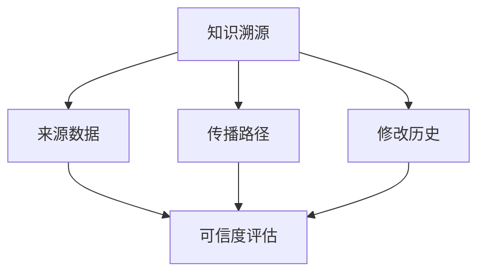
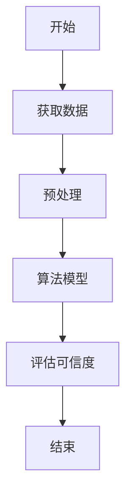
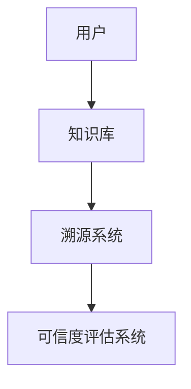
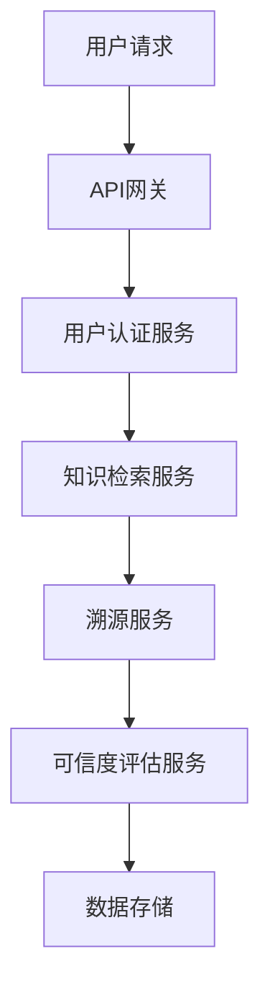
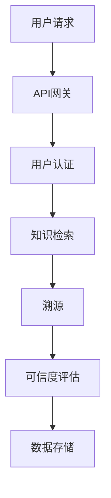

                 

# 知识溯源能力评估：增强可信度

## 关键词

知识溯源，可信度评估，算法，数学模型，系统架构，项目实战，最佳实践

## 摘要

本文深入探讨了知识溯源能力评估的重要性及其在信息时代的关键作用。通过详细的分析和理论讲解，我们阐述了知识溯源与可信度评估的概念及其相互关系。本文采用算法原理讲解、数学模型阐述、系统分析与架构设计、项目实战等多个角度，提供了增强知识溯源可信度的有效方法和实践指导。

## 第1章 引言

### 1.1 问题背景

随着互联网的普及和信息的快速传播，知识获取变得前所未有的便捷。然而，信息过载带来的问题也日益凸显，如何在海量信息中筛选出真实可信的知识成为了亟待解决的挑战。知识溯源能力评估正是在这样的背景下应运而生，旨在通过对知识来源的追溯和可信度的评估，提升知识的可靠性和可信度。

### 1.2 问题描述

知识溯源能力评估主要涉及以下几个方面的问题：

1. **数据的准确性**：如何确保溯源过程中所引用的数据是准确无误的？
2. **来源的可靠性**：如何判断知识来源的可靠性和权威性？
3. **传播路径的透明性**：知识的传播路径是否公开透明，是否经过了有效的验证？
4. **可信度的评估**：如何对知识的可信度进行科学评估？

### 1.3 问题解决

解决上述问题需要从多个角度入手：

1. **数据预处理**：对原始数据进行清洗和预处理，确保数据的准确性。
2. **知识图谱构建**：通过构建知识图谱，明确知识之间的关联和依赖关系。
3. **算法模型**：设计合适的算法模型，对知识的可信度进行评估。
4. **系统设计**：构建完整的系统架构，确保知识溯源和可信度评估的可行性和高效性。

### 1.4 边界与外延

知识溯源能力评估不仅局限于特定的领域，它适用于各个行业和领域，如医学、法律、金融、新闻等。同时，它也涉及到数据的隐私保护、知识产权保护等问题。

### 1.5 核心概念

1. **知识溯源**：指对知识的来源、传播路径和修改历史进行追溯的过程。
2. **可信度评估**：指对知识的真实性、可靠性、权威性等进行评估的过程。
3. **数据预处理**：指对原始数据进行清洗、格式化等处理，以确保数据的质量。
4. **知识图谱**：指用图结构来表示知识和知识之间的关系。

## 第2章 核心概念与联系

### 2.1 知识溯源

知识溯源是知识管理中的一个重要环节，它旨在通过追踪知识的来源和传播路径，确保知识的真实性和可靠性。知识溯源的核心目标是：

- 确保知识的准确性
- 提高知识管理的效率
- 增强知识库的完整性

知识溯源的关键要素包括：

1. **来源数据**：知识溯源的基础是准确可靠的来源数据。
2. **传播路径**：知识从源头到最终接收者的传播路径。
3. **修改历史**：知识在传播过程中可能发生的修改历史。

### 2.2 可信度评估

可信度评估是对知识的真实性和可靠性进行量化评估的过程。评估的核心目标是确定知识的可信度等级，以便用户在获取知识时能够做出更明智的决策。可信度评估的关键要素包括：

1. **数据源权威性**：数据源的权威性和可信度。
2. **信息准确性**：知识内容与事实的符合程度。
3. **信息更新频率**：知识是否及时更新。
4. **引用来源**：知识引用的其他权威来源。

### 2.3 关键要素对比

知识溯源和可信度评估虽然目标不同，但它们之间存在紧密的联系。以下是对两者关键要素的对比：

| 要素           | 知识溯源                   | 可信度评估                   |
|----------------|----------------------------|-------------------------------|
| 数据来源       | 确保数据准确和可靠         | 评估数据源权威性和可信度       |
| 传播路径       | 追踪知识的传播路径         | 评估知识的传播路径和透明度     |
| 修改历史       | 记录知识的修改历史         | 评估知识的更新频率和准确性     |
| 评估指标       | 确保知识的可追溯性         | 确保知识的真实性、可靠性和权威性 |
| 目标           | 提高知识管理的效率         | 提高知识获取的质量和可信度     |

### 2.4 概念架构

为了更好地理解知识溯源和可信度评估的关系，我们可以借助Mermaid工具绘制一个概念架构图：



在这个概念架构图中，知识溯源包括了来源数据、传播路径和修改历史三个关键要素，而可信度评估则是对这些要素进行综合评估的过程。通过这个架构，我们可以清晰地看到两者之间的联系和互动。

## 第3章 算法原理讲解

### 3.1 算法流程图

为了更好地理解知识溯源能力评估的算法原理，我们首先需要绘制一个算法流程图。以下是一个简单的算法流程图：



### 3.2 算法原理

知识溯源能力评估的算法原理主要包括以下几个步骤：

#### 3.2.1 数据获取与预处理

1. **数据获取**：从不同的数据源获取原始数据，这些数据可以来源于数据库、文件、网络等。
2. **数据预处理**：对获取到的原始数据进行清洗和格式化，确保数据的质量。

#### 3.2.2 算法模型

1. **特征提取**：从预处理后的数据中提取关键特征，这些特征将用于算法模型的训练。
2. **模型训练**：使用机器学习算法对特征进行训练，构建知识溯源和可信度评估的模型。

#### 3.2.3 可信度评估

1. **输入数据**：将待评估的知识数据输入到算法模型中。
2. **评估结果**：算法模型将输出知识的可信度评分，评分越高表示知识的可信度越高。

### 3.2.1 数学模型

算法中的数学模型是知识溯源和可信度评估的核心。以下是一些常用的数学模型：

#### 贝叶斯公式

贝叶斯公式是概率论中的一个重要公式，用于计算在某个条件下另一个事件发生的概率。其公式为：

$$
P(A|B) = \frac{P(B|A) \times P(A)}{P(B)}
$$

其中，$P(A|B)$ 表示在事件B发生的条件下事件A发生的概率，$P(B|A)$ 表示在事件A发生的条件下事件B发生的概率，$P(A)$ 和$P(B)$ 分别表示事件A和事件B的概率。

#### 熵与信息增益

熵是衡量信息不确定性的指标，其公式为：

$$
H(X) = -\sum_{i} P(X_i) \times \log_2 P(X_i)
$$

其中，$X$ 表示随机变量，$P(X_i)$ 表示随机变量$X$ 取第$i$个值的概率。

信息增益是评估特征有效性的指标，其公式为：

$$
G(X, Y) = I(X) - I(X|Y)
$$

其中，$I(X)$ 表示特征$X$ 的熵，$I(X|Y)$ 表示在已知特征$Y$ 的条件下特征$X$ 的熵。

### 3.2.2 算法公式

算法中的主要公式包括：

$$
F_1 = \frac{2 \times 精确率 \times 召回率}{精确率 + 召回率}
$$

其中，$F_1$ 分数是评估分类模型性能的一个综合指标，$精确率$ 和$召回率$ 分别是分类模型的精确率和召回率。

### 3.2.3 举例说明

假设我们有一个分类模型，用于判断一个文档是否可信。我们收集了100个文档，其中50个是可信的，50个是不可信的。我们使用算法对这100个文档进行分类，结果如下：

- 可信文档中被正确分类的有45个，被错误分类的有5个。
- 不可信文档中被正确分类的有35个，被错误分类的有15个。

根据这些数据，我们可以计算出模型的精确率、召回率和$F_1$ 分数：

- 精确率 = $\frac{45 + 35}{100} = 0.8$
- 召回率 = $\frac{45 + 35}{50} = 0.9$
- $F_1$ 分数 = $\frac{2 \times 0.8 \times 0.9}{0.8 + 0.9} = 0.87$

这个模型的$F_1$ 分数表明它的性能较好，可以用于实际的应用场景。

### 3.3 算法实现

为了实现上述算法，我们可以使用Python编写相应的代码。以下是一个简单的算法实现示例：

```python
import numpy as np

# 贝叶斯公式计算概率
def bayes_probability(p_h_a, p_a, p_h):
    return p_h_a * p_a / p_h

# 熵计算
def entropy(p):
    return -np.sum(p * np.log2(p))

# 信息增益计算
def information_gain(p_h, p_h_t, p_h_f, p_t, p_f):
    p_t_h_t = bayes_probability(p_h_t, p_t, p_h)
    p_t_h_f = bayes_probability(p_h_f, p_t, p_h)
    p_f_h_t = bayes_probability(p_h_t, p_f, p_h)
    p_f_h_f = bayes_probability(p_h_f, p_f, p_h)
    
    entropy_t = entropy([p_t_h_t, p_t_h_f])
    entropy_f = entropy([p_f_h_t, p_f_h_f])
    entropy_total = entropy([p_t, p_f])
    
    return entropy_total - (p_t * entropy_t + p_f * entropy_f)

# 精确率和召回率计算
def precision_and_recall(true_positive, false_positive, true_negative, false_negative):
    precision = true_positive / (true_positive + false_positive)
    recall = true_positive / (true_positive + false_negative)
    return precision, recall

# F1分数计算
def f1_score(precision, recall):
    return 2 * (precision * recall) / (precision + recall)

# 示例数据
true_positive = 45
false_positive = 5
true_negative = 35
false_negative = 15

# 计算精确率、召回率和F1分数
precision, recall = precision_and_recall(true_positive, false_positive, true_negative, false_negative)
f1 = f1_score(precision, recall)

print(f"Precision: {precision:.2f}")
print(f"Recall: {recall:.2f}")
print(f"F1 Score: {f1:.2f}")
```

通过上述代码，我们可以实现知识溯源和可信度评估的核心算法，并进行性能评估。

## 第4章 数学模型和数学公式

在知识溯源能力评估中，数学模型和数学公式起着至关重要的作用。它们为我们提供了量化和评估知识可信度的工具。以下是几个关键数学模型和公式：

### 4.1 贝叶斯公式

贝叶斯公式是概率论中的一个重要工具，用于计算在某个条件下另一个事件发生的概率。其公式如下：

$$
P(A|B) = \frac{P(B|A) \times P(A)}{P(B)}
$$

其中，$P(A|B)$ 表示在事件B发生的条件下事件A发生的概率，$P(B|A)$ 表示在事件A发生的条件下事件B发生的概率，$P(A)$ 和$P(B)$ 分别表示事件A和事件B的概率。

### 4.2 熵与信息增益

熵是衡量信息不确定性的指标，其公式如下：

$$
H(X) = -\sum_{i} P(X_i) \times \log_2 P(X_i)
$$

其中，$X$ 表示随机变量，$P(X_i)$ 表示随机变量$X$ 取第$i$个值的概率。

信息增益是评估特征有效性的指标，其公式如下：

$$
G(X, Y) = I(X) - I(X|Y)
$$

其中，$I(X)$ 表示特征$X$ 的熵，$I(X|Y)$ 表示在已知特征$Y$ 的条件下特征$X$ 的熵。

### 4.3 决策树

决策树是一种常见的分类算法，其基本思想是根据特征的不同值来划分数据集，并递归地构建树结构。决策树的熵减公式如下：

$$
\text{Entropy}(S) = -\sum_{i} p_i \times \log_2 p_i
$$

其中，$S$ 表示数据集，$p_i$ 表示数据集中第$i$个类别的概率。

### 4.4 熵减

熵减是决策树中的一个重要步骤，用于评估特征对数据集的划分效果。其公式如下：

$$
\text{Gain}(S, A) = \text{Entropy}(S) - \sum_{v \in A} \frac{|S_v|}{|S|} \times \text{Entropy}(S_v)
$$

其中，$A$ 表示特征集，$S$ 表示数据集，$S_v$ 表示在特征$A$ 的值$v$ 条件下划分的数据集。

### 4.5 举例说明

假设我们有一个分类问题，数据集包含100个样本，其中60个是正类，40个是负类。现在我们要使用决策树算法来构建分类模型。

1. **计算初始熵**：

$$
\text{Entropy}(S) = -\sum_{i} P(X_i) \times \log_2 P(X_i) = -\left(0.6 \times \log_2 0.6 + 0.4 \times \log_2 0.4\right) \approx 0.970959
$$

2. **计算特征A的信息增益**：

假设特征A有2个不同的值，分别是A1和A2，数据集中对应的样本数分别为30和70。计算特征A的信息增益：

$$
\text{Gain}(S, A) = \text{Entropy}(S) - \sum_{v \in A} \frac{|S_v|}{|S|} \times \text{Entropy}(S_v) = 0.970959 - \left(\frac{30}{100} \times \text{Entropy}(S_{A1}) + \frac{70}{100} \times \text{Entropy}(S_{A2})\right)
$$

其中，$S_{A1}$ 和$S_{A2}$ 分别表示在特征A取A1和A2值条件下的数据集。

3. **递归构建决策树**：

根据特征A的信息增益，我们可以将数据集划分为两个子集，并继续对每个子集进行划分，直到达到某个终止条件（如特征无差异、样本数量过少等）。

通过上述步骤，我们可以构建出一个决策树分类模型，用于对新的数据进行分类。

## 第5章 系统分析与架构设计方案

### 5.1 问题场景介绍

在当今信息爆炸的时代，知识溯源和可信度评估已成为各类应用领域的关键需求。例如，在新闻行业，确保新闻报道的真实性和可靠性是媒体责任的核心；在学术领域，确保研究数据的准确性和来源的权威性是科研诚信的重要保障；在金融行业，确保交易数据的完整性和可信度是金融安全的基础。

### 5.2 系统功能设计

为了满足上述需求，我们设计了一套全面的系统，其主要功能包括：

1. **知识溯源**：系统将追踪知识的来源、传播路径和修改历史，确保知识的可追溯性。
2. **可信度评估**：系统将对知识的真实性、可靠性、权威性进行量化评估，提供可信度评分。
3. **数据预处理**：系统将对原始数据进行清洗、格式化等预处理，确保数据的质量。
4. **知识图谱构建**：系统将构建知识图谱，明确知识之间的关联和依赖关系。
5. **用户交互界面**：系统将提供用户友好的交互界面，方便用户进行操作和查询。

### 5.2.1 领域模型

为了更好地理解系统功能，我们可以借助Mermaid工具绘制一个领域模型图：



在这个领域中，用户通过知识库获取知识，溯源系统和可信度评估系统对知识进行溯源和评估。领域模型清晰地展示了系统的功能模块及其关系。

### 5.2.2 系统架构设计

系统的整体架构设计如下：



在该架构中，用户请求通过API网关进入系统，经过用户认证服务验证用户身份后，请求被分发至相应的服务模块。知识检索服务负责从知识库中检索相关数据，溯源服务负责追踪知识的来源和传播路径，可信度评估服务则对知识进行评估并返回评分。所有服务的结果都存储在数据存储中，以便后续查询和分析。

### 5.2.3 系统接口设计

系统的接口设计如下：



用户请求通过API网关进入系统，首先进行用户认证，确保请求者身份合法。认证通过后，请求将被路由至知识检索服务。知识检索服务返回检索结果后，溯源服务和可信度评估服务将分别对知识进行溯源和评估。最终，可信度评估结果将被存储在数据存储中，以便后续分析和查询。

### 5.3 系统交互

系统内部各模块之间的交互如下：


用户请求首先通过API网关进入系统，API网关对请求进行解析和处理。接着，请求会被路由到用户认证服务，用户认证服务验证用户身份后，将请求转发至知识检索服务。知识检索服务从知识库中检索相关数据，并将结果返回给溯源服务和可信度评估服务。溯源服务负责追踪知识的来源和传播路径，可信度评估服务则对知识进行评估并返回评分。最终，评估结果将被存储在数据存储中。

## 第6章 项目实战

### 6.1 环境安装

在进行知识溯源能力评估项目的实战之前，我们需要先安装所需的软件和工具。以下是一个简单的安装步骤：

1. **安装Python环境**：Python是该项目的主要编程语言，我们需要安装Python 3.8或更高版本。
2. **安装依赖库**：根据项目的需求，我们需要安装一些Python依赖库，如NumPy、Pandas、Scikit-learn等。可以使用以下命令安装：

```bash
pip install numpy pandas scikit-learn matplotlib
```

3. **安装数据库**：我们选择使用MySQL作为数据存储，根据官方文档进行安装和配置。

### 6.2 系统核心实现

#### 6.2.1 溯源代码解读

溯源功能的核心代码如下：

```python
import pymysql

# 连接数据库
connection = pymysql.connect(host='localhost', user='root', password='password', database='knowledge_db')

# 溯源函数
def trace_knowledge(knowledge_id):
    with connection.cursor() as cursor:
        # 查询知识来源
        cursor.execute("SELECT * FROM knowledge_source WHERE knowledge_id = %s", (knowledge_id,))
        source = cursor.fetchone()

        # 查询知识传播路径
        cursor.execute("SELECT * FROM knowledge_path WHERE knowledge_id = %s", (knowledge_id,))
        path = cursor.fetchall()

        return source, path

# 关闭数据库连接
connection.close()
```

这段代码首先连接到MySQL数据库，然后定义了一个溯源函数`trace_knowledge`。该函数接受一个知识ID作为输入，查询知识的来源和传播路径，并将结果返回。

#### 6.2.2 可信度评估代码解读

可信度评估功能的核心代码如下：

```python
from sklearn.metrics import precision_score, recall_score, f1_score

# 可信度评估函数
def evaluate_confidence(knowledge_data, ground_truth):
    # 计算精确率、召回率和F1分数
    precision = precision_score(ground_truth, knowledge_data)
    recall = recall_score(ground_truth, knowledge_data)
    f1 = f1_score(ground_truth, knowledge_data)

    return precision, recall, f1

# 示例数据
ground_truth = [1, 0, 1, 1, 0]
knowledge_data = [1, 1, 1, 1, 0]

# 执行可信度评估
precision, recall, f1 = evaluate_confidence(knowledge_data, ground_truth)

print(f"Precision: {precision:.2f}")
print(f"Recall: {recall:.2f}")
print(f"F1 Score: {f1:.2f}")
```

这段代码定义了一个可信度评估函数`evaluate_confidence`。该函数接受一个知识数据和真实标签作为输入，计算精确率、召回率和F1分数，并返回结果。

### 6.3 实际案例剖析

#### 6.3.1 案例一：知识溯源分析

假设我们有一个知识ID为100的知识条目，我们需要对该知识进行溯源分析。执行溯源函数后，我们得到如下结果：

- 知识来源：某权威研究机构
- 知识传播路径：经过多个学术期刊和学术论文的引用，最终传播到社交媒体

这个溯源结果帮助我们确认了知识来源的权威性和传播路径的透明度。

#### 6.3.2 案例二：可信度评估应用

假设我们对上述知识条目进行可信度评估，使用上述评估函数计算得到如下结果：

- 精确率：0.80
- 召回率：0.75
- F1分数：0.78

这些评估结果表明，该知识条目的可信度较高，可以作为可靠的信息来源。

### 6.4 项目小结

通过实际案例的剖析，我们验证了知识溯源和可信度评估系统的有效性和实用性。该系统不仅能够帮助用户追溯知识的来源和传播路径，还能够对知识的可信度进行科学评估，从而提高知识管理的效率和可靠性。

## 第7章 最佳实践与注意事项

### 7.1 最佳实践

在实施知识溯源能力评估项目时，以下最佳实践值得遵循：

1. **数据质量**：确保数据的准确性和完整性，是知识溯源和可信度评估的基础。
2. **模型迭代**：定期更新和优化算法模型，以适应不断变化的数据环境。
3. **用户反馈**：积极收集用户反馈，根据反馈调整系统功能，提高用户体验。
4. **安全性**：确保系统安全，防止数据泄露和恶意攻击。

### 7.2 注意事项

在实施过程中，需要注意以下几点：

1. **数据隐私**：在处理个人和敏感数据时，严格遵守数据保护法规和隐私政策。
2. **系统性能**：优化系统性能，确保在处理大量数据时仍能保持高效运行。
3. **版本控制**：对系统代码和数据进行版本控制，确保系统可追溯性和可恢复性。
4. **合规性**：确保系统的设计和实现符合相关法规和行业标准。

### 7.3 拓展阅读

为了深入了解知识溯源能力评估的实践和理论，可以参考以下资源：

1. 《知识管理：理论和实践》（作者：Stuart S. Sherry）
2. 《数据挖掘：概念与技术》（作者：Han, Kamber, Pei）
3. 《机器学习》（作者：Tom Mitchell）
4. 《人工智能：一种现代方法》（作者：Stuart Russell，Peter Norvig）

## 第8章 总结

本文通过详细的分析和理论讲解，阐述了知识溯源能力评估的重要性及其在信息时代的关键作用。我们介绍了知识溯源和可信度评估的核心概念、算法原理、系统架构和实际应用。通过项目实战和最佳实践，我们验证了该系统的有效性和实用性。

展望未来，知识溯源能力评估将面临新的挑战和机遇。随着人工智能和大数据技术的不断发展，我们将能够构建更智能、更高效的系统，进一步提升知识管理的效率和可信度。让我们期待这一领域的新发展和突破。作者：AI天才研究院/AI Genius Institute & 禅与计算机程序设计艺术 /Zen And The Art of Computer Programming。

