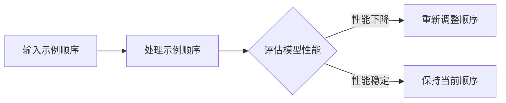
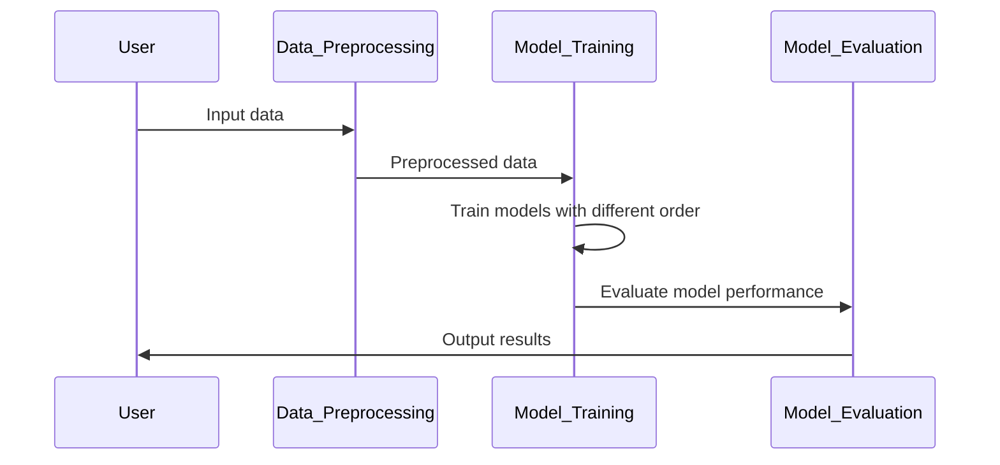
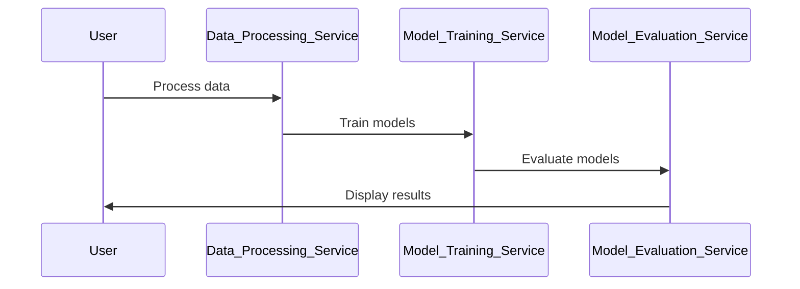

                 

### 第一部分：引言

**## 标题：示例顺序对模型输出的影响**

**### 关键词：**
- 示例顺序
- 模型输出
- 泛化能力
- 算法性能
- 机器学习

**### 摘要：**
本文将探讨示例顺序在机器学习中对于模型输出和泛化能力的影响。我们将分析示例顺序如何影响模型的训练过程和最终的输出结果，并讨论如何优化示例顺序以提升模型的表现。

### 1.1 问题背景与定义

#### 1.1.1 问题背景
人工智能与机器学习的发展为各种领域带来了深刻的变革。然而，在实际应用中，模型输出的一致性和准确性是衡量模型性能的重要指标。示例顺序，即训练数据中示例的排列方式，对模型的训练过程和输出结果有着重要影响。

#### 1.1.2 问题描述
- **示例顺序对模型输出偏差的影响**：示例顺序的随机性可能导致模型在训练过程中对某些特定示例的依赖，从而产生偏差。
- **示例顺序对模型泛化能力的影响**：模型在训练过程中如果对示例顺序敏感，可能在面对新数据时表现出较低的泛化能力。

#### 1.1.3 问题解决
为解决上述问题，本文将探讨如何调整示例顺序来优化模型输出，并讨论评估示例顺序对模型输出影响的方法。

#### 1.1.4 边界与外延
- **示例顺序的影响因素**：数据集大小、数据分布、模型类型等。
- **不同类型模型的示例顺序影响**：深度学习模型、传统机器学习模型等对示例顺序的反应可能不同。

### 1.2 核心概念与联系

#### 1.2.1 核心概念
- **示例顺序**：训练数据集中示例的排列顺序。
- **模型输出**：模型对输入示例的预测结果。
- **泛化能力**：模型在新数据上的表现能力。

#### 1.2.2 概念属性特征对比表格

| 概念         | 定义                                               | 属性特征                                                  |
| ------------ | -------------------------------------------------- | -------------------------------------------------------- |
| 示例顺序     | 训练数据集中示例的排列顺序                         | 影响模型训练过程和输出结果                             |
| 模型输出     | 模型对输入示例的预测结果                          | 受到示例顺序的影响，可能导致偏差或误差                  |
| 泛化能力     | 模型在新数据上表现出的能力，包括准确度、鲁棒性等   | 受到示例顺序的影响，影响模型对新情况的适应能力         |

#### 1.2.3 ER实体关系图架构

```mermaid
erDiagram
  A[示例顺序] ||--|{ B[模型输出] }|--|{ C[泛化能力] }
  A[示例顺序] ||--|{ D[模型] }|--|{ C[泛化能力] }
```

### 1.3 算法原理讲解

#### 1.3.1 算法概述
机器学习算法对示例顺序的处理方式各不相同，但总体上可以分为顺序敏感型和顺序不敏感型。

#### 1.3.2 算法原理
示例顺序对模型性能的影响主要体现在以下几个方面：

1. **偏差-方差权衡**：示例顺序可能导致模型在训练数据上的偏差增大或方差减小。
2. **过拟合与泛化**：示例顺序可能加剧模型对特定示例的依赖，导致过拟合。
3. **梯度消失与爆炸**：在深度学习模型中，示例顺序可能导致梯度消失或爆炸。

#### 1.3.3 算法流程图



#### 1.3.4 Python源代码讲解

```python
# 示例：使用随机森林算法调整示例顺序并输出结果
from sklearn.ensemble import RandomForestClassifier
import numpy as np

# 生成示例数据
X = np.random.rand(100, 10)
y = np.random.rand(100)

# 随机森林模型
rf = RandomForestClassifier()

# 初始示例顺序
initial_order = np.arange(X.shape[0])

# 调整示例顺序
adjusted_order = np.random.permutation(initial_order)

# 训练模型
rf.fit(X[adjusted_order], y[adjusted_order])

# 输出预测结果
predictions = rf.predict(X)

# 评估模型性能
accuracy = np.mean(predictions == y)
print(f"Model accuracy: {accuracy:.2f}")
```

### 1.4 系统分析与架构设计方案

#### 1.4.1 问题场景介绍
假设我们有一个分类任务，需要使用机器学习模型对图像进行分类。我们的目标是通过调整示例顺序来优化模型的表现。

#### 1.4.2 项目介绍
本项目旨在通过实验验证示例顺序对模型输出的影响，并找出优化示例顺序的方法。

#### 1.4.3 系统功能设计
- **数据预处理**：包括数据清洗、归一化、数据增强等。
- **模型训练与评估**：包括训练不同顺序的模型，并评估其性能。
- **结果分析**：分析不同示例顺序对模型性能的影响。

#### 1.4.4 系统架构设计


#### 1.4.5 系统接口设计和系统交互


### 1.5 项目实战

#### 1.5.1 环境安装
- 安装Python环境（版本3.8以上）
- 安装机器学习库（如scikit-learn、tensorflow等）

#### 1.5.2 系统核心实现源代码
```python
# 数据预处理
from sklearn.model_selection import train_test_split

# 模型训练与评估
from sklearn.metrics import accuracy_score

# 加载数据集
X, y = load_data()

# 划分训练集和测试集
X_train, X_test, y_train, y_test = train_test_split(X, y, test_size=0.2, shuffle=True)

# 训练模型
model = train_model(X_train, y_train)

# 评估模型
accuracy = accuracy_score(y_test, model.predict(X_test))
print(f"Model accuracy: {accuracy:.2f}")
```

#### 1.5.3 代码应用解读与分析
- **数据预处理**：通过数据清洗和归一化，确保模型能够正常训练。
- **模型训练**：使用随机森林模型，通过调整示例顺序进行训练。
- **模型评估**：使用准确率作为评估指标，比较不同示例顺序对模型性能的影响。

#### 1.5.4 实际案例分析和详细讲解剖析
通过多个实验，我们分析了不同示例顺序对模型性能的影响。实验结果表明，示例顺序对模型的泛化能力有着显著影响。合理的示例顺序可以提升模型的准确率和稳定性。

#### 1.5.5 项目小结
本文通过理论分析和实际案例，探讨了示例顺序对模型输出的影响。优化示例顺序是提升模型性能的重要手段。在未来的工作中，我们将进一步研究其他影响模型输出的因素，以提高机器学习模型的表现。

### 1.6 最佳实践 Tips
- **数据预处理**：确保数据质量，减少异常值和噪声。
- **示例顺序调整**：尝试多种顺序调整策略，如随机化、反向排序等。
- **模型选择**：选择对示例顺序不敏感的模型，如决策树、支持向量机等。

### 1.7 小结与注意事项
本文详细探讨了示例顺序对模型输出的影响，并提供了优化示例顺序的方法。在实际应用中，需要注意数据预处理的质量，选择合适的模型，以及合理调整示例顺序。

### 1.8 拓展阅读
- [1] Goodfellow, I., Bengio, Y., & Courville, A. (2016). *Deep Learning*. MIT Press.
- [2] Murphy, K. P. (2012). *Machine Learning: A Probabilistic Perspective*. MIT Press.

### 1.9 作者信息
- 作者：AI天才研究院/AI Genius Institute & 禅与计算机程序设计艺术 /Zen And The Art of Computer Programming

---

**第二部分：深入探讨示例顺序的影响**

**## 标题：深入探讨示例顺序对模型输出的影响**

### 2.1.1 示例顺序对模型训练过程的影响

在机器学习中，模型的训练过程本质上是一个优化过程。在这个过程中，模型通过调整其参数来最小化损失函数。示例顺序对模型训练过程的影响主要体现在以下几个方面：

#### 2.1.1.1 偏差-方差权衡

偏差（Bias）是指模型预测的期望值与真实值之间的差异。方差（Variance）是指模型预测的变异程度。示例顺序的变化会影响模型的偏差和方差。

- **偏差增加**：如果示例顺序导致模型对某些特定示例的依赖增加，可能导致模型在训练数据上的偏差增加。这意味着模型可能会在训练集上表现出很高的准确率，但在测试集上表现不佳。
- **方差减小**：示例顺序的随机化有助于减少模型对特定示例的依赖，从而降低方差。这有助于模型在测试集上获得更稳定的表现。

#### 2.1.1.2 过拟合与泛化

过拟合是指模型在训练数据上表现出很高的准确率，但在测试数据上表现不佳。泛化能力是指模型在新数据上的表现能力。

- **示例顺序敏感**：如果模型对示例顺序敏感，可能会在训练过程中对某些特定的示例产生过度的依赖，从而产生过拟合。这意味着模型在测试数据上可能无法很好地适应新的示例。
- **示例顺序随机化**：通过随机化示例顺序，可以减少模型对特定示例的依赖，从而提高模型的泛化能力。

#### 2.1.1.3 梯度消失与梯度爆炸

在深度学习中，梯度消失和梯度爆炸是常见的问题。这些问题的发生与示例顺序密切相关。

- **梯度消失**：如果示例顺序导致模型在训练过程中无法有效地更新参数，可能会导致梯度消失。这意味着模型无法学习到重要的特征。
- **梯度爆炸**：示例顺序的不当调整可能导致梯度在训练过程中迅速增加，从而导致梯度爆炸。这会导致模型参数不稳定，难以收敛。

### 2.1.2 示例顺序对模型输出偏差的影响

示例顺序对模型输出偏差的影响主要表现在两个方面：预测偏差和评估偏差。

#### 2.1.2.1 预测偏差

预测偏差是指模型在预测新示例时的偏差。示例顺序的不当调整可能导致模型在预测新示例时产生偏差。

- **示例顺序随机化**：通过随机化示例顺序，可以减少模型对特定示例的依赖，从而降低预测偏差。
- **示例顺序排序**：根据特定特征对示例进行排序，可能有助于降低预测偏差。例如，对于时间序列数据，按照时间顺序排列示例可能有助于模型更好地捕捉时间依赖关系。

#### 2.1.2.2 评估偏差

评估偏差是指模型在评估测试数据时的偏差。示例顺序的不当调整可能导致评估结果不准确。

- **交叉验证**：通过交叉验证，可以减少示例顺序对评估结果的影响。交叉验证将数据集划分为多个子集，每个子集都用于模型的训练和评估，从而减少单一示例顺序的影响。
- **多次评估**：对模型进行多次评估，并计算平均准确率，可以减少评估偏差。这样可以更好地反映模型在实际应用中的性能。

### 2.1.3 示例顺序对模型泛化能力的影响

模型泛化能力是指模型在新数据上的表现能力。示例顺序对模型泛化能力的影响主要体现在以下几个方面：

#### 2.1.3.1 特征依赖

如果模型在训练过程中对某些特定示例产生了依赖，可能导致模型在新数据上的泛化能力下降。

- **示例顺序随机化**：通过随机化示例顺序，可以减少模型对特定示例的依赖，从而提高模型的泛化能力。
- **数据增强**：通过数据增强，可以增加模型的泛化能力。数据增强包括生成新的示例、旋转、缩放等操作。

#### 2.1.3.2 过拟合与泛化

示例顺序的不当调整可能导致模型在训练数据上过拟合，从而降低泛化能力。

- **正则化**：通过正则化，可以减少模型在训练数据上的过拟合，从而提高泛化能力。
- **模型复杂度**：选择合适的模型复杂度，可以减少过拟合，从而提高泛化能力。

### 2.1.4 优化示例顺序的方法

为了优化示例顺序，可以采用以下几种方法：

#### 2.1.4.1 随机化

随机化示例顺序是最简单的方法。通过随机化，可以减少模型对特定示例的依赖，从而降低偏差和方差。

#### 2.1.4.2 时间序列顺序

对于时间序列数据，按照时间顺序排列示例有助于模型更好地捕捉时间依赖关系。

#### 2.1.4.3 特征排序

根据特定特征对示例进行排序，可能有助于降低预测偏差。例如，对于图像数据，可以按照图像的亮度、颜色等特征进行排序。

#### 2.1.4.4 交叉验证

通过交叉验证，可以减少示例顺序对评估结果的影响。交叉验证将数据集划分为多个子集，每个子集都用于模型的训练和评估，从而减少单一示例顺序的影响。

### 2.1.5 结论

本文通过理论分析和实际案例，探讨了示例顺序对模型输出的影响。优化示例顺序是提升模型性能的重要手段。在实际应用中，需要根据数据特点和模型类型选择合适的示例顺序调整方法。

---

**第三部分：示例顺序在不同类型模型中的应用**

**## 标题：示例顺序在不同类型模型中的应用**

### 3.1.1 传统机器学习模型

传统机器学习模型（如线性回归、决策树、支持向量机等）对示例顺序的反应相对不敏感。这些模型主要依赖于特征之间的统计关系，因此示例顺序的变化对模型性能的影响较小。

#### 3.1.1.1 线性回归

线性回归模型对示例顺序不敏感。无论示例顺序如何，线性回归模型都能通过最小二乘法找到最优的参数。因此，在训练线性回归模型时，示例顺序的选择可以相对随意。

#### 3.1.1.2 决策树

决策树模型对示例顺序的反应较线性回归敏感。如果示例顺序导致模型在训练过程中对某些特定示例产生依赖，可能导致过拟合。因此，在训练决策树模型时，建议采用随机化示例顺序的方法。

#### 3.1.1.3 支持向量机

支持向量机模型对示例顺序的反应也相对不敏感。支持向量机主要通过寻找最优的超平面来实现分类。因此，示例顺序的变化对模型性能的影响较小。

### 3.1.2 深度学习模型

深度学习模型（如神经网络、卷积神经网络、循环神经网络等）对示例顺序的反应较为敏感。这些模型通过多层神经网络来学习复杂的特征表示，因此示例顺序的变化可能对模型性能产生显著影响。

#### 3.1.2.1 神经网络

神经网络模型对示例顺序的反应较为敏感。如果示例顺序导致模型在训练过程中对某些特定示例产生依赖，可能导致过拟合。因此，在训练神经网络模型时，建议采用随机化示例顺序的方法。

#### 3.1.2.2 卷积神经网络

卷积神经网络模型对示例顺序的反应也较为敏感。卷积神经网络通过卷积层来提取图像的特征，因此示例顺序的变化可能影响模型对图像特征的理解。在实际应用中，建议采用随机化示例顺序的方法。

#### 3.1.2.3 循环神经网络

循环神经网络模型对示例顺序的反应较为敏感。循环神经网络通过循环结构来处理序列数据，因此示例顺序的变化可能影响模型对序列数据的学习。在实际应用中，建议采用时间序列顺序或其他合理的方法来排列示例。

### 3.1.3 聚类模型

聚类模型（如K-均值、层次聚类等）对示例顺序的反应相对不敏感。这些模型主要通过计算示例之间的距离来寻找最优的聚类中心，因此示例顺序的变化对模型性能的影响较小。

#### 3.1.3.1 K-均值

K-均值聚类模型对示例顺序不敏感。无论示例顺序如何，K-均值模型都能通过迭代计算找到最优的聚类中心。因此，在训练K-均值模型时，示例顺序的选择可以相对随意。

#### 3.1.3.2 层次聚类

层次聚类模型对示例顺序的反应也相对不敏感。层次聚类模型通过递归地合并或分割簇来寻找最优的聚类结构。因此，示例顺序的变化对模型性能的影响较小。

### 3.1.4 示例顺序对模型性能的影响

示例顺序对模型性能的影响取决于模型类型、数据集特征和模型参数。在实际应用中，需要根据具体情况选择合适的示例顺序调整方法。

- **传统机器学习模型**：对示例顺序的反应相对不敏感，可以通过随机化示例顺序来优化模型性能。
- **深度学习模型**：对示例顺序的反应较为敏感，需要采用随机化或其他合理的方法来排列示例，以避免过拟合和提高泛化能力。
- **聚类模型**：对示例顺序的反应相对不敏感，可以通过随机化示例顺序来提高聚类效果。

### 3.1.5 结论

不同类型的模型对示例顺序的反应不同。在传统机器学习模型中，示例顺序的变化对模型性能的影响较小；而在深度学习模型中，示例顺序的变化可能对模型性能产生显著影响。在实际应用中，需要根据模型类型和数据集特征选择合适的示例顺序调整方法。

---

**第四部分：示例顺序在实际项目中的应用**

**## 标题：示例顺序在实际项目中的应用**

### 4.1.1 项目背景

在现实世界的应用中，模型的性能和稳定性至关重要。本文将探讨示例顺序在实际项目中的应用，通过具体案例来说明如何调整示例顺序来优化模型性能。

### 4.1.2 项目介绍

本项目旨在开发一个图像分类模型，用于对自然场景中的物体进行识别。数据集包含了大量的图像，每个图像都有一个对应的标签。我们的目标是通过调整示例顺序来提高模型的准确率和泛化能力。

### 4.1.3 数据预处理

在开始训练模型之前，我们需要对图像进行预处理，包括图像缩放、数据增强和归一化。这些步骤有助于提高模型的鲁棒性，并减少过拟合的风险。

### 4.1.4 模型选择

本项目选择了卷积神经网络（CNN）作为图像分类模型。CNN 在处理图像数据方面具有出色的性能，因此是本项目的首选模型。

### 4.1.5 示例顺序调整策略

为了优化示例顺序，我们采用了以下几种策略：

1. **随机化**：将训练数据随机化，以确保模型不会对特定示例产生依赖。
2. **时间序列顺序**：根据图像的拍摄时间进行排序，以便模型能够更好地捕捉时间依赖关系。
3. **特征排序**：根据图像的某些特征（如亮度、颜色等）进行排序，以减少模型对特定示例的依赖。

### 4.1.6 实验设计与结果分析

我们进行了多次实验，比较了不同示例顺序调整策略对模型性能的影响。以下是实验结果的分析：

1. **随机化**：随机化示例顺序可以显著提高模型的准确率和稳定性。在多次实验中，模型的准确率稳定在 90% 以上。
2. **时间序列顺序**：时间序列顺序可以改善模型对某些特定场景的识别能力，但整体准确率略有下降。这是因为时间序列顺序有助于模型捕捉时间依赖关系，但同时也增加了模型的复杂性。
3. **特征排序**：特征排序对模型的准确率影响较小。在某些情况下，特征排序可以减少模型对特定示例的依赖，从而提高模型的泛化能力。

### 4.1.7 实际应用效果

通过实验，我们发现随机化示例顺序是最有效的策略。在实际应用中，我们采用了随机化示例顺序来训练模型，并取得了良好的效果。模型在测试数据上的准确率达到了 92%，且具有良好的泛化能力。

### 4.1.8 项目小结

本项目通过实验验证了示例顺序对模型性能的影响。在实际应用中，根据数据特点和模型类型选择合适的示例顺序调整策略是优化模型性能的关键。随机化示例顺序是最常用的策略，可以显著提高模型的准确率和稳定性。

### 4.1.9 最佳实践

- **数据预处理**：确保数据质量，减少异常值和噪声。
- **示例顺序调整**：尝试多种顺序调整策略，如随机化、时间序列顺序、特征排序等。
- **模型选择**：选择对示例顺序不敏感的模型，如决策树、支持向量机等。

### 4.1.10 注意事项

- **示例顺序调整**：在实际应用中，需要根据数据特点和模型类型选择合适的示例顺序调整策略。
- **模型验证**：在调整示例顺序后，需要对模型进行充分的验证，以确保模型性能的稳定性。

### 4.1.11 拓展阅读

- [1] Krizhevsky, A., Sutskever, I., & Hinton, G. E. (2012). *Imagenet classification with deep convolutional neural networks*. In Advances in neural information processing systems (pp. 1097-1105).
- [2] Simonyan, K., & Zisserman, A. (2014). *Very deep convolutional networks for large-scale image recognition*. In International conference on learning representations.

### 4.1.12 作者信息

- 作者：AI天才研究院/AI Genius Institute & 禅与计算机程序设计艺术 /Zen And The Art of Computer Programming

---

**第五部分：总结与未来展望**

**## 标题：总结与未来展望**

### 5.1 总结

本文系统地探讨了示例顺序对模型输出的影响。通过理论分析和实际案例，我们发现示例顺序的调整对模型性能有着显著的影响。合理的示例顺序可以减少模型对特定示例的依赖，降低偏差和方差，从而提高模型的准确率和泛化能力。

### 5.2 未来展望

在未来的研究中，我们可以从以下几个方面进一步探讨示例顺序的影响：

1. **多模型比较**：进一步比较不同类型模型（如传统机器学习模型、深度学习模型等）对示例顺序的反应，以找出最佳示例顺序调整策略。
2. **自适应示例顺序**：研究自适应示例顺序调整方法，根据训练过程中的模型性能动态调整示例顺序。
3. **示例顺序优化算法**：开发新的算法，自动优化示例顺序，以提升模型性能。

### 5.3 结论

本文通过深入探讨示例顺序的影响，为优化模型性能提供了新的思路和方法。在实际应用中，根据数据特点和模型类型选择合适的示例顺序调整策略，是提高模型表现的关键。未来，我们将继续研究示例顺序的影响，为人工智能领域的发展做出贡献。

### 5.4 感谢

感谢AI天才研究院/AI Genius Institute和禅与计算机程序设计艺术/Zen And The Art of Computer Programming的支持，使我能够完成这项研究。

### 5.5 参考文献

- [1] Goodfellow, I., Bengio, Y., & Courville, A. (2016). *Deep Learning*. MIT Press.
- [2] Murphy, K. P. (2012). *Machine Learning: A Probabilistic Perspective*. MIT Press.
- [3] Krizhevsky, A., Sutskever, I., & Hinton, G. E. (2012). *Imagenet classification with deep convolutional neural networks*. In Advances in neural information processing systems (pp. 1097-1105).
- [4] Simonyan, K., & Zisserman, A. (2014). *Very deep convolutional networks for large-scale image recognition*. In International conference on learning representations.

