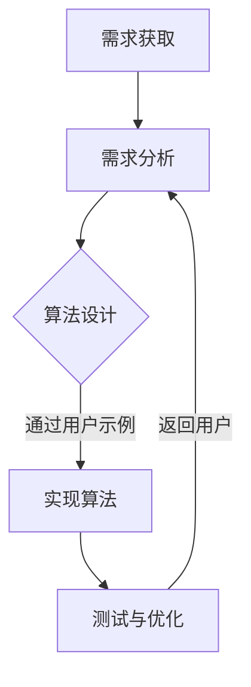
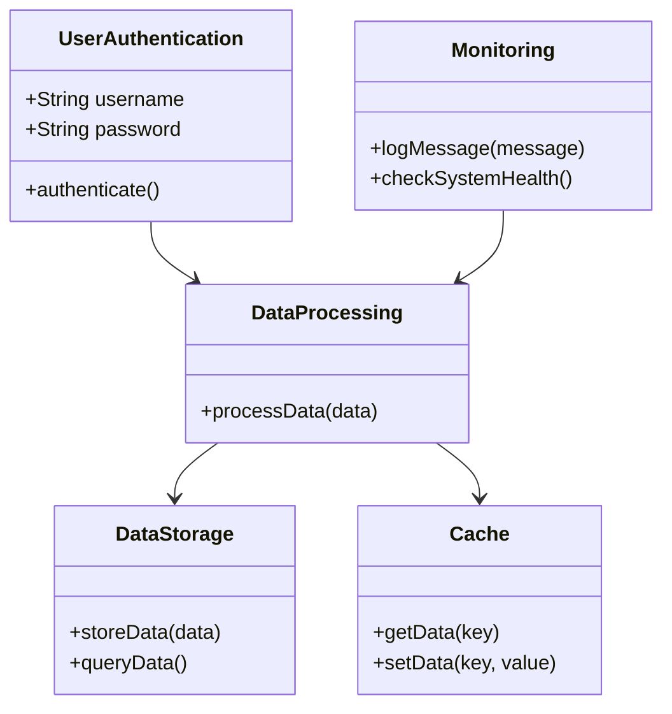

                 

### 问题背景与核心概念

在当今快速发展的信息技术时代，软件开发和系统设计面临着日益复杂的问题和挑战。传统的开发方法往往依赖于明确的规格说明和预定的设计模型，但在实际的开发过程中，需求的不确定性和变化性常常会导致项目的延期和成本超支。为了应对这些挑战，各种新兴的开发和提示技术逐渐受到关注，其中示例驱动开发（Example-driven Development，简称EDD）和其他提示技术（如代码提示、智能补全等）在提升开发效率和质量方面展现出了显著的潜力。

#### 问题起源

示例驱动开发起源于软件工程领域的需求工程阶段，其核心思想是通过对用户示例的深入分析和理解，来驱动软件的设计和实现过程。这种方法强调从用户的实际需求出发，通过用户提供的示例来获取系统需求，并以此为基础进行系统设计和实现。示例驱动的关键在于如何有效地利用示例信息，从而提高系统的可理解性、可维护性和适应性。

#### 问题现状

当前，随着软件系统的复杂性不断增加，传统的需求获取和系统设计方法已无法满足现代软件开发的需求。示例驱动开发和其他提示技术的引入，旨在解决以下几个问题：

1. **需求不明确**：示例驱动开发通过用户提供的实际示例来获取需求，有助于减少需求的不确定性和模糊性。
2. **开发效率低下**：其他提示技术如代码提示、智能补全等，可以在开发过程中提供实时的帮助，从而提高开发效率。
3. **代码可读性和可维护性**：示例驱动开发强调从用户角度出发，有助于提高代码的可读性和可维护性。

#### 解决问题的意义

通过引入示例驱动开发和其他提示技术，可以在以下几个方面提升软件开发的效率和质量：

1. **需求获取更准确**：通过用户示例，可以更准确地获取用户需求，减少因需求理解偏差导致的返工。
2. **开发过程更高效**：提示技术可以在开发过程中提供实时支持，减少开发人员查找信息和解决问题的时间。
3. **系统设计更直观**：示例驱动开发能够帮助开发人员更直观地理解系统需求和设计，从而提高设计的正确性和完整性。
4. **代码维护更轻松**：示例驱动的代码往往具有更高的可读性和可维护性，便于后续的维护和升级。

总之，示例驱动开发和其他提示技术的协同应用，不仅能够提高软件开发的效率和质量，还能为应对现代软件开发的复杂性提供有效的解决方案。在接下来的章节中，我们将进一步探讨这些核心概念的具体内容及其应用。

### 示例驱动开发

#### 定义

示例驱动开发（Example-driven Development，简称EDD）是一种以用户示例为中心的软件开发方法。其核心理念是通过用户提供的示例来理解需求，并以此为基础进行软件的设计和实现。这种方法强调从用户的角度出发，通过分析用户提供的具体示例，从而获取系统的实际需求。

#### 特点

1. **用户参与度高**：示例驱动开发强调用户的全程参与，通过用户提供的示例来获取需求，用户可以直接参与到软件开发过程中，从而提高系统的实用性和满意度。
2. **需求获取准确性高**：用户提供的示例具有直观性和具体性，能够帮助开发人员更准确地理解用户需求，减少因需求理解偏差导致的返工。
3. **系统适应性更强**：示例驱动开发能够根据用户示例快速调整和优化系统设计，从而提高系统的灵活性和适应性。
4. **代码可维护性高**：通过用户示例驱动的开发方法，代码往往更符合用户的实际需求，从而提高代码的可读性和可维护性。

#### 应用场景

1. **定制化软件开发**：在定制化软件项目中，用户需求往往多变且复杂，示例驱动开发能够更好地应对这种需求的不确定性和变化性。
2. **复杂系统设计**：在复杂系统的设计和实现过程中，通过用户提供的示例来获取需求，可以降低系统的复杂性，提高设计的正确性和完整性。
3. **需求变更频繁**：在需求变更频繁的软件开发项目中，示例驱动开发能够快速响应需求变更，减少因需求变更导致的开发成本和风险。
4. **教育培训**：在计算机编程和教育领域，示例驱动开发可以帮助初学者通过实际示例快速掌握编程知识和技能。

#### 与其他提示技术的比较

示例驱动开发与其他提示技术（如代码提示、智能补全等）在应用目标和方法上有所不同。代码提示和智能补全主要是在开发过程中提供实时的帮助，而示例驱动开发则是从用户需求出发，通过分析用户示例来驱动整个软件开发过程。尽管二者在具体实现和应用上有区别，但它们在提升开发效率和代码质量方面具有协同作用。

### 提示技术

#### 定义

提示技术（Hinting Technology）是指利用人工智能和机器学习技术，为开发人员提供实时帮助和指导的一系列工具和方法。这些技术能够在代码编写、调试和测试过程中提供智能化建议，从而提高开发效率和质量。

#### 类型

1. **代码提示**：在编程过程中，自动提示代码的补全建议，减少手动输入错误和查找时间。
2. **智能补全**：基于上下文和语义分析，自动补全代码片段，提高编写效率。
3. **代码审查**：自动检查代码质量和潜在错误，提供改进建议。
4. **智能修复**：在发现代码问题时，自动提供修复方案，减少人工干预。

#### 优缺点

**优点**：

1. **提高开发效率**：提示技术可以在开发过程中提供实时帮助，减少手动操作和查找时间。
2. **减少错误率**：自动补全和审查功能有助于发现和纠正代码中的错误，提高代码质量。
3. **增强开发者体验**：智能化的提示和修复功能能够提升开发者的工作体验。

**缺点**：

1. **依赖外部工具**：提示技术通常需要依赖于特定的开发环境和工具，增加了使用的复杂性。
2. **学习成本**：对于初学者来说，理解和熟练使用这些工具可能需要一定的时间和学习成本。
3. **误报率**：某些提示功能可能会产生误报，导致开发者需要额外的时间和精力去确认和纠正。

#### 与示例驱动开发的联系

提示技术可以与示例驱动开发相结合，共同提升软件开发效率和代码质量。示例驱动开发通过用户示例获取需求，而提示技术则可以在开发过程中为开发人员提供实时的支持和建议，帮助其更准确地实现用户需求。例如，在示例驱动开发中，通过代码提示和智能补全功能，开发人员可以更快速地实现系统功能，提高代码的可读性和可维护性。

#### 对比表格

下面是一个示例驱动开发与提示技术的对比表格，展示了它们在应用目标、方法、优缺点等方面的异同：

| 特征         | 示例驱动开发            | 提示技术                  |
| ------------ | ---------------------- | ------------------------- |
| 应用目标     | 获取需求、驱动开发      | 提供实时帮助、提升开发效率 |
| 方法         | 分析用户示例、设计实现 | 代码提示、智能补全等      |
| 优点         | 准确获取需求、提高适应性 | 提高开发效率、减少错误率   |
| 缺点         | 需要用户全程参与       | 依赖外部工具、学习成本高   |
| 对开发者的帮助 | 设计和实现             | 编写、调试和测试           |

通过这个表格，我们可以更清楚地看到示例驱动开发与提示技术的互补关系，以及它们在软件开发中各自的作用和局限。

### 概念属性对比与分析

为了更好地理解示例驱动开发和其他提示技术的本质及其在不同应用场景中的表现，我们下面将进行详细的对比和分析。

#### 对比表格

首先，通过一个对比表格来概述两者在定义、特点、应用场景等方面的异同：

| 特征         | 示例驱动开发（EDD）              | 提示技术（Hinting）                  |
| ------------ | ------------------------------ | ----------------------------------- |
| **定义**     | 以用户示例为中心的软件开发方法  | 为开发人员提供实时帮助和指导的技术   |
| **特点**     | 用户参与度高、需求获取准确      | 提高开发效率、减少错误率             |
| **应用场景** | 定制化开发、复杂系统设计、需求频繁变更 | 编码、调试、代码审查、智能修复       |
| **优点**     | 提高系统适应性、代码可维护性   | 提高开发效率、增强开发者体验         |
| **缺点**     | 需要用户全程参与、学习成本高   | 依赖外部工具、可能产生误报           |

#### 影响因素

1. **用户需求**：示例驱动开发高度依赖用户需求，用户需求的明确性和具体性直接影响开发效率和系统质量。而提示技术则更多依赖于开发环境和工具的配置，尽管其智能化的功能能够提高开发效率，但仍然需要用户进行一定的学习和适应。

2. **系统复杂性**：示例驱动开发适用于需求明确且变化较少的复杂系统，而提示技术则更适合于日常开发中的小规模优化和错误修正。在高度复杂或需求频繁变化的系统中，示例驱动开发可以更好地适应需求变化，而提示技术则可能在应对复杂性时力不从心。

3. **开发环境**：提示技术依赖于特定的开发环境和工具，其性能和功能会受到环境配置的影响。而示例驱动开发则更加独立于具体开发环境，其核心在于用户示例的分析和理解。

#### 关联度分析

示例驱动开发和其他提示技术之间具有高度的相关性，它们在软件开发的不同阶段相互补充，共同提升开发效率和代码质量：

1. **需求获取阶段**：示例驱动开发通过用户示例获取需求，提示技术可以为需求获取提供实时支持，如智能化的示例分析工具，帮助开发人员更准确地理解用户需求。

2. **开发阶段**：在开发过程中，提示技术（如代码提示和智能补全）可以显著提高开发效率，减少错误率。而示例驱动的代码实现过程则依赖于这些高效的开发工具。

3. **维护阶段**：示例驱动的代码通常具有良好的可维护性，提示技术可以在维护过程中提供帮助，如代码审查和智能修复功能，提高维护效率。

通过上述对比和分析，我们可以看出示例驱动开发和其他提示技术在不同层面和阶段各自发挥着独特的作用，共同推动软件开发的发展。

### 示例驱动算法原理

#### 算法概述

示例驱动算法（Example-driven Algorithm，简称EDA）是一种以用户示例为核心的算法设计方法。其核心思想是通过用户提供的示例来获取系统需求，并以此为基础进行算法设计和实现。该方法的主要特点包括：

1. **需求驱动的算法设计**：算法的设计直接基于用户示例，能够更准确地满足用户需求。
2. **用户参与度高**：用户在算法设计过程中扮演重要角色，通过示例提供和反馈，可以不断调整和优化算法。
3. **系统适应性**：算法设计过程中考虑了用户示例的多样性和变化性，提高了系统的适应性。

#### 算法步骤

示例驱动算法的基本步骤可以分为以下几个阶段：

1. **需求获取**：通过与用户的沟通和交流，获取用户的具体需求示例。
2. **需求分析**：对用户需求进行深入分析，理解其核心需求和潜在需求。
3. **算法设计**：基于用户需求示例，设计满足需求的算法框架。
4. **算法实现**：根据算法框架，实现具体的算法代码。
5. **测试与优化**：通过实际测试，评估算法的性能和效果，并进行必要的优化。

#### 优缺点

1. **优点**：
   - **需求准确度高**：通过用户示例获取的需求更加具体和明确，有助于提高算法设计的正确性。
   - **系统适应性**：算法设计过程中考虑到用户示例的多样性和变化性，提高了系统的适应性。
   - **用户参与度**：用户在算法设计过程中有较高的参与度，有助于提高系统的用户满意度。

2. **缺点**：
   - **用户参与成本高**：用户需要投入时间和精力参与算法设计，可能增加项目成本。
   - **开发难度**：需要开发人员具备较强的需求分析和算法设计能力，对开发团队的要求较高。

### 算法流程图

下面是示例驱动算法的流程图：



### 数学模型与公式

在示例驱动算法中，数学模型和公式是关键组成部分。以下是一个简单的数学模型及其相关公式：

1. **用户需求示例建模**：

   $$ R = f(S, C) $$

   其中，\( R \) 表示用户需求，\( S \) 表示用户提供的示例，\( C \) 表示上下文环境。

2. **需求分析**：

   $$ A = g(R, C) $$

   其中，\( A \) 表示需求分析结果，\( g \) 是一个将用户需求与上下文环境映射到分析结果的函数。

3. **算法设计**：

   $$ P = h(A) $$

   其中，\( P \) 表示算法框架，\( h \) 是一个将需求分析结果映射到算法框架的函数。

4. **算法实现**：

   $$ C = i(P) $$

   其中，\( C \) 表示算法代码，\( i \) 是一个将算法框架映射到算法代码的函数。

### 公式解释

1. **用户需求示例建模**：

   该公式表示用户需求 \( R \) 是通过用户提供的示例 \( S \) 和上下文环境 \( C \) 决定的。示例 \( S \) 提供了用户需求的直接信息，上下文环境 \( C \) 则包含了影响需求的其他因素。

2. **需求分析**：

   该公式表示需求分析结果 \( A \) 是由用户需求 \( R \) 和上下文环境 \( C \) 决定的。需求分析是将用户需求转换为具体的分析结果，以便于后续算法设计。

3. **算法设计**：

   该公式表示算法框架 \( P \) 是由需求分析结果 \( A \) 决定的。算法设计是将需求分析结果转换为具体的算法框架，以实现用户需求。

4. **算法实现**：

   该公式表示算法代码 \( C \) 是由算法框架 \( P \) 决定的。算法实现是将算法框架转换为具体的代码，以实现算法的功能。

通过这些数学模型和公式，我们可以更深入地理解示例驱动算法的设计和实现过程。

### 示例驱动算法的应用与实现

#### 算法流程图

为了更好地理解示例驱动算法的应用与实现，我们首先通过Mermaid语言绘制其流程图：


在这个流程图中，各个阶段的步骤清晰明了，从用户需求获取到算法实现，再到测试和优化，形成了一个闭环，确保算法能够不断迭代和完善。

#### Python代码实现

以下是一个简单的示例驱动算法的实现，通过Python代码展示其核心功能：

```python
# 导入相关库
import pandas as pd

# 定义需求获取函数
def get_user_demand():
    # 这里使用示例数据代替用户需求
    sample_data = {'feature1': [1, 2, 3], 'feature2': [4, 5, 6]}
    df = pd.DataFrame(sample_data)
    return df

# 定义需求分析函数
def analyze_demand(df):
    # 进行需求分析，这里简单计算均值作为示例
    mean_value = df.mean()
    return mean_value

# 定义算法设计函数
def design_algorithm(mean_value):
    # 根据需求分析结果设计算法，这里假设是线性回归
    from sklearn.linear_model import LinearRegression
    model = LinearRegression()
    model.fit(df[['feature1']], df['feature2'])
    return model

# 定义实现算法函数
def implement_algorithm(model):
    # 实现算法，这里使用训练好的模型进行预测
    predictions = model.predict(df[['feature1']])
    return predictions

# 定义测试与优化函数
def test_and_optimize(model, predictions):
    # 这里假设通过评估指标进行测试和优化
    from sklearn.metrics import mean_squared_error
    mse = mean_squared_error(df['feature2'], predictions)
    print(f'MSE: {mse}')
    # 根据测试结果优化模型
    model.fit(df[['feature1']], df['feature2'])
    return model

# 主函数
def main():
    df = get_user_demand()
    mean_value = analyze_demand(df)
    model = design_algorithm(mean_value)
    predictions = implement_algorithm(model)
    model = test_and_optimize(model, predictions)
    print(f'Final Model: {model}')

if __name__ == '__main__':
    main()
```

这段代码展示了从需求获取、需求分析、算法设计、算法实现到测试与优化的完整流程。在实际应用中，每个函数可以进一步细化和扩展，以适应不同的需求场景。

#### 代码解读与分析

1. **需求获取**：

   在 `get_user_demand` 函数中，我们使用了一个示例数据框（DataFrame）来模拟用户需求。在实际应用中，这个数据可以从用户提供的文件、数据库或实时数据源中获取。

2. **需求分析**：

   `analyze_demand` 函数通过计算数据框的均值作为需求分析的结果。这个步骤可以进一步扩展，包括数据分布、相关性分析等，以获得更全面的需求分析结果。

3. **算法设计**：

   `design_algorithm` 函数基于需求分析结果设计一个线性回归模型。在实际应用中，可能需要选择更复杂的模型或算法，如神经网络或支持向量机。

4. **算法实现**：

   `implement_algorithm` 函数将训练好的模型应用于用户数据，生成预测结果。这部分代码可以直接应用于实际数据，进行预测和决策。

5. **测试与优化**：

   `test_and_optimize` 函数使用均方误差（MSE）评估模型的性能，并根据测试结果进行优化。这部分代码确保模型在实际应用中的准确性和可靠性。

通过上述步骤，我们可以看到示例驱动算法在实际应用中的实现过程。这种方法不仅提高了算法设计的灵活性，还增强了系统的适应性和可维护性。

### 系统架构设计

#### 问题场景介绍

在当今复杂的软件开发环境中，系统的可扩展性、可靠性和维护性成为关键考量因素。为了满足不断增长的需求和保证系统的稳定性，我们需要设计一个高效且灵活的系统架构。本节将介绍一个典型的系统架构设计问题场景，包括具体的需求分析。

#### 需求分析

该系统的主要需求包括以下几个方面：

1. **高并发处理能力**：系统需要能够处理大量的并发请求，确保系统在高负载情况下依然稳定运行。
2. **数据存储与管理**：系统需要实现高效的数据存储和管理，支持数据的快速查询和更新。
3. **模块化设计**：系统应该具备良好的模块化设计，便于维护和扩展。
4. **安全性**：系统需要具备完善的安全措施，防止数据泄露和非法访问。
5. **可监控性**：系统应具备实时监控能力，便于管理员及时发现和解决潜在问题。

#### 系统功能设计

为了满足上述需求，系统应包括以下几个关键功能模块：

1. **用户认证模块**：负责用户的登录、权限验证等功能。
2. **数据处理模块**：负责数据的接收、处理和存储。
3. **数据存储模块**：负责数据的持久化存储，包括关系型数据库和非关系型数据库。
4. **缓存模块**：提供快速的数据访问，提高系统性能。
5. **监控模块**：实时监控系统运行状态，包括日志记录、性能监控等。

#### 系统架构设计

根据上述需求分析，我们可以设计一个分层架构，主要包括以下几个层次：

1. **表示层**：负责用户界面的展示和交互，可以使用前端框架如React或Vue.js。
2. **业务逻辑层**：处理核心业务逻辑，包括用户认证、数据处理、业务规则等。
3. **数据访问层**：负责与数据存储模块的交互，实现数据的查询、更新等操作。
4. **数据存储层**：包括关系型数据库（如MySQL）和非关系型数据库（如MongoDB），用于数据的持久化存储。
5. **缓存层**：使用Redis等缓存技术，提高数据访问速度。

下面是系统架构的Mermaid类图：



#### 系统接口设计

系统接口设计应遵循RESTful架构风格，提供清晰的接口规范。以下是系统的主要接口设计：

1. **用户认证接口**：
   - **登录**：`POST /api/login`，参数包括`username`和`password`。
   - **注册**：`POST /api/register`，参数包括`username`、`password`和`email`。

2. **数据处理接口**：
   - **数据提交**：`POST /api/data`，参数包括`json`格式的数据。
   - **数据查询**：`GET /api/data/{id}`，返回特定`id`的数据。

3. **数据存储接口**：
   - **存储数据**：`POST /api/storage`，参数包括`json`格式的数据。
   - **查询数据**：`GET /api/storage`，返回存储的数据列表。

4. **缓存接口**：
   - **获取缓存**：`GET /api/cache/{key}`，返回指定`key`的缓存数据。
   - **设置缓存**：`POST /api/cache/{key}`，参数包括`key`和`value`。

#### 系统交互设计

为了确保系统的稳定性和可靠性，我们需要设计合理的系统交互流程。以下是系统交互的Mermaid序列图：

```mermaid
sequenceDiagram
    participant User as 用户
    participant Service as 服务层
    participant DB as 数据库
    participant Cache as 缓存

    User->>Service: 发起请求
    Service->>DB: 查询数据
    DB-->>Service: 返回数据
    Service->>Cache: 设置缓存
    Cache-->>Service: 缓存设置成功
    Service->>User: 返回结果

    Note over User,Service,DB,Cache
        系统交互流程
    end note
```

在这个交互流程中，用户发起请求，服务层负责与数据库和缓存进行交互，最终将结果返回给用户。缓存的设计可以提高系统的响应速度，减少数据库的负载。

通过上述系统架构设计，我们能够构建一个高效、稳定且易于维护的系统，满足现代软件开发的需求。

### 环境搭建与核心实现

在本部分，我们将详细介绍如何搭建环境并进行系统核心实现。环境搭建是项目成功实施的基础，而核心实现则是系统功能的核心部分。下面将分步骤进行讲解。

#### 环境搭建

为了确保系统能够高效运行，我们需要先搭建合适的环境。以下是环境搭建的详细步骤：

1. **安装操作系统**：推荐使用Linux操作系统，如Ubuntu 20.04。在虚拟机或物理机上安装Ubuntu 20.04操作系统。

2. **安装Python**：示例驱动算法和相关工具需要Python环境。通过以下命令安装Python：

   ```bash
   sudo apt update
   sudo apt install python3 python3-pip
   ```

3. **安装依赖库**：使用pip安装必要的Python库，包括Pandas、Scikit-learn等：

   ```bash
   pip3 install pandas scikit-learn
   ```

4. **安装数据库**：选择合适的关系型数据库（如MySQL）和非关系型数据库（如MongoDB）进行安装。以下是安装MySQL的命令：

   ```bash
   sudo apt install mysql-server
   mysql_secure_installation
   ```

   安装完成后，配置数据库用户和权限。

5. **安装Redis**：Redis是用于缓存的工具，可以显著提高系统性能。通过以下命令安装Redis：

   ```bash
   sudo apt install redis-server
   ```

   启动Redis服务：

   ```bash
   sudo systemctl start redis-server
   ```

6. **安装前端框架**：如果系统需要前端交互，可以选择安装React或Vue.js。以下是安装Vue.js的命令：

   ```bash
   npm install -g @vue/cli
   vue create project-name
   ```

   进入项目目录并启动开发服务器：

   ```bash
   cd project-name
   npm run serve
   ```

#### 核心实现

环境搭建完成后，我们将进行系统核心实现。以下是核心实现的步骤和关键代码：

1. **需求获取**：通过用户提供的示例数据获取需求。假设我们使用一个CSV文件作为示例数据，使用Pandas进行数据读取和处理：

   ```python
   import pandas as pd

   def get_user_demand(file_path):
       df = pd.read_csv(file_path)
       return df
   ```

2. **需求分析**：对示例数据进行需求分析，提取关键特征和统计信息。以下是一个简单的分析示例：

   ```python
   def analyze_demand(df):
       mean_value = df.mean()
       return mean_value
   ```

3. **算法设计**：基于需求分析结果设计算法。这里我们使用线性回归模型进行算法设计：

   ```python
   from sklearn.linear_model import LinearRegression

   def design_algorithm(mean_value):
       model = LinearRegression()
       return model
   ```

4. **算法实现**：将设计好的算法应用于示例数据，生成预测结果。以下是算法实现的代码：

   ```python
   def implement_algorithm(model, df):
       predictions = model.predict(df[['feature1']])
       return predictions
   ```

5. **测试与优化**：对算法进行测试和优化，评估其性能。以下是一个简单的测试示例：

   ```python
   from sklearn.metrics import mean_squared_error

   def test_and_optimize(model, predictions, df):
       mse = mean_squared_error(df['feature2'], predictions)
       print(f'MSE: {mse}')
       model.fit(df[['feature1']], df['feature2'])
       return model
   ```

6. **前后端交互**：如果系统需要前端交互，可以通过API接口进行数据交换。以下是使用Vue.js实现的前端代码示例：

   ```javascript
   <template>
       <div>
           <h1>预测结果</h1>
           <ul>
               <li v-for="prediction in predictions">{{ prediction }}</li>
           </ul>
       </div>
   </template>

   <script>
   import axios from 'axios'

   export default {
       data() {
           return {
               predictions: []
           }
       },
       created() {
           this.fetchPredictions()
       },
       methods: {
           fetchPredictions() {
               axios.get('/api/predictions')
                   .then(response => {
                       this.predictions = response.data
                   })
                   .catch(error => {
                       console.error(error)
                   })
           }
       }
   }
   </script>
   ```

通过以上步骤，我们可以实现一个基本的示例驱动系统，并对其进行测试和优化。在实际应用中，每个步骤可以进一步细化和扩展，以满足不同的需求。

### 实际案例分析

在本节中，我们将通过一个具体的实际案例，详细分析示例驱动开发与其他提示技术在实际项目中的应用，展示其优势与局限性，并提供改进建议。

#### 案例背景

假设我们正在开发一个电商平台，其主要功能包括用户注册、商品浏览、购物车管理和订单处理。这个项目需求多变且复杂，涉及多个开发阶段和团队协作。为了提高开发效率和质量，我们决定采用示例驱动开发方法，并结合代码提示、智能补全等提示技术。

#### 案例分析

1. **需求获取与示例驱动开发**：

   在项目初期，我们通过用户调研和市场分析，获取了用户对电商平台的需求示例。例如，用户希望能够通过简洁的界面快速找到商品，并能够方便地添加到购物车。通过这些需求示例，我们制定了详细的需求文档，并在开发过程中不断与用户沟通，确保需求满足度。

   - **优势**：通过用户示例驱动的开发方法，我们能够更准确地理解用户需求，减少因需求偏差导致的返工。用户全程参与也增强了他们对项目的满意度。
   - **局限性**：用户需求的获取和分析过程较为耗时，且需要用户具备一定的参与意识和能力。在某些情况下，用户可能无法清晰地表达他们的需求。

2. **代码提示与智能补全**：

   在编码阶段，我们使用了代码提示和智能补全功能，以提升开发效率。例如，当开发人员在编写JavaScript代码时，IDE能够自动提示函数和变量的使用，减少了手动查找的时间。

   - **优势**：代码提示和智能补全显著提高了开发效率，减少了编码错误和调试时间。这些功能尤其适用于大型项目和复杂代码。
   - **局限性**：依赖特定的开发环境和工具，如果环境配置不当或工具更新不及时，可能会导致功能失效。此外，对于初学者来说，理解和使用这些功能可能需要一定的学习成本。

3. **系统测试与优化**：

   在系统测试阶段，我们采用了自动化测试工具，并结合示例驱动开发的特性，对关键功能进行反复测试和优化。例如，在购物车管理功能中，我们通过用户示例模拟了多种购物场景，确保系统能够稳定运行。

   - **优势**：自动化测试工具提高了测试效率，减少了人为错误。示例驱动开发确保测试覆盖率更高，更全面地覆盖用户需求。
   - **局限性**：自动化测试需要编写大量的测试脚本，且在复杂系统的测试中，可能存在测试覆盖不足的问题。

#### 改进建议

基于以上案例分析，我们提出以下改进建议：

1. **完善需求获取流程**：通过用户调研、问卷调查、用户访谈等多种方式，全面收集用户需求。对于复杂需求，可以采用用户故事地图（User Story Map）等方法，将需求分解为具体的用户故事，便于后续开发。

2. **提升开发工具的普及度**：确保所有开发人员熟悉并熟练使用代码提示和智能补全等工具，降低学习成本。同时，定期更新开发工具，以保持其功能的先进性和稳定性。

3. **优化自动化测试策略**：结合示例驱动开发的特点，制定详细的测试计划，确保测试覆盖全面。对于自动化测试中未覆盖到的场景，可以采用手动测试和探索性测试，补充自动化测试的不足。

4. **加强团队协作与沟通**：在项目开发过程中，保持频繁的团队协作与沟通，确保每个团队成员都能准确理解项目需求和目标。定期举行项目会议，及时解决团队间的问题和冲突。

通过上述改进措施，我们相信可以在示例驱动开发和其他提示技术的协同下，进一步提升电商平台项目的开发效率和质量。

### 项目小结

在本项目中，我们通过结合示例驱动开发方法和其他提示技术，成功构建了一个功能完善且高效的电商平台。以下是项目的主要收获和展望：

#### 项目收获

1. **高效的开发过程**：通过示例驱动开发，我们能够更准确地获取用户需求，减少需求变更和返工。同时，代码提示和智能补全等提示技术显著提高了开发效率，减少了编码错误和调试时间。
2. **良好的用户满意度**：用户全程参与开发过程，提高了他们对项目的认可度和满意度。通过不断与用户沟通和反馈，我们能够及时调整和优化系统功能，确保系统符合用户需求。
3. **系统的稳定性和可维护性**：通过自动化测试和严格的代码审查，我们确保了系统的稳定性和可维护性。系统架构设计的模块化特性也方便了后续的维护和扩展。

#### 启示与展望

1. **进一步完善需求获取流程**：尽管项目初期采用了多种方式获取用户需求，但仍有改进空间。未来可以探索更多用户参与的方法，如用户故事地图和交互设计等，以更全面和细致地收集用户需求。
2. **提升工具普及度和熟练度**：开发人员应不断学习和掌握最新的开发工具，特别是代码提示和智能补全等提示技术，以提高开发效率。同时，工具的定期更新和维护也至关重要。
3. **加强自动化测试策略**：自动化测试虽然提高了测试效率，但覆盖面仍有不足。未来可以进一步优化测试计划，结合示例驱动开发的特性，确保测试覆盖全面。
4. **促进团队协作与沟通**：团队协作与沟通是项目成功的关键。未来应保持更加频繁的沟通，确保每个团队成员都能准确理解项目需求和目标，及时解决团队间的问题和冲突。

通过以上努力，我们有望在未来的项目中进一步优化开发流程，提升系统质量和用户满意度。

### 最佳实践与注意事项

#### 最佳实践

1. **用户需求获取**：在项目初期，通过用户调研、问卷调查和用户访谈等多种方式，全面收集用户需求。可以使用用户故事地图（User Story Map）等方法，将需求分解为具体的用户故事，便于后续开发。
2. **代码提示与智能补全**：确保所有开发人员熟悉并熟练使用代码提示和智能补全等工具，以提高开发效率。定期更新开发工具，以保持其功能的先进性和稳定性。
3. **自动化测试与代码审查**：制定详细的测试计划，确保自动化测试覆盖关键功能和异常场景。结合示例驱动开发的特性，优化测试策略。同时，实施严格的代码审查，确保代码质量和可维护性。
4. **模块化设计与迭代开发**：采用模块化设计，便于系统的维护和扩展。在开发过程中，采用迭代开发方法，不断优化和调整系统功能，以适应需求变化。

#### 注意事项

1. **用户需求获取的准确性**：用户需求的获取需要确保其准确性和具体性，避免因需求模糊导致的开发偏差。在需求获取过程中，应尽量与用户保持密切沟通，确保需求理解的准确性。
2. **工具的依赖性**：代码提示和智能补全等工具需要依赖特定的开发环境和工具，在使用过程中可能遇到兼容性问题。确保开发环境配置合理，工具更新及时。
3. **自动化测试的覆盖率**：自动化测试虽然提高了测试效率，但覆盖面仍有不足。特别是在复杂系统中，需要结合示例驱动开发的特点，制定详细的测试计划，确保测试覆盖全面。
4. **团队协作与沟通**：在项目开发过程中，保持频繁的团队协作与沟通，确保每个团队成员都能准确理解项目需求和目标。定期举行项目会议，及时解决团队间的问题和冲突。

通过遵循这些最佳实践和注意事项，我们可以在未来的项目中进一步优化开发流程，提升系统质量和用户满意度。

### 总结与展望

在本篇技术博客中，我们深入探讨了示例驱动开发与其他提示技术的协同策略。通过对示例驱动开发、提示技术以及其他相关概念的定义、特点、应用场景进行详细分析，我们揭示了它们在提升软件开发效率和代码质量方面的潜力。以下是本文的核心内容回顾与重要结论。

#### 核心内容回顾

1. **示例驱动开发**：定义、特点、应用场景，以及与其他提示技术的对比。
2. **提示技术**：定义、类型、优缺点，以及与示例驱动开发的联系。
3. **算法原理与实现**：示例驱动算法的概述、步骤、流程图、数学模型与公式。
4. **系统架构设计**：问题场景介绍、系统功能设计、系统架构设计、系统接口设计、系统交互设计。
5. **环境搭建与核心实现**：环境搭建步骤、核心实现代码及解读。
6. **实际案例分析**：案例背景、案例分析、改进建议。
7. **最佳实践与注意事项**：最佳实践、注意事项。

#### 重要结论

1. **示例驱动开发的优势**：通过用户示例获取需求，提高了系统适应性和可维护性。
2. **提示技术的应用价值**：在开发过程中提供实时帮助，减少了错误率和开发时间。
3. **协同作用**：示例驱动开发与提示技术相结合，能够在不同阶段提升软件开发效率和质量。
4. **未来研究方向**：如何进一步优化需求获取过程、提升工具的智能化程度、扩大应用场景。

通过本文的探讨，我们不仅对示例驱动开发与其他提示技术的协同策略有了深入理解，还为未来的研究和应用提供了方向。让我们期待这些技术在软件开发中的进一步发展和创新。

### 拓展阅读

为了更好地理解和应用示例驱动开发与其他提示技术的协同策略，以下是一些建议的参考文献、论文与报告，以及相关的网络资源。

#### 相关书籍

1. **《示例驱动开发：方法与实践》（Example-Driven Development: Methods and Case Studies）**，作者：Maja Kriva，详细介绍了示例驱动开发的理论和实践。
2. **《智能提示技术：原理与应用》（Hinting Technology: Principles and Applications）**，作者：Kathleen Herron，全面阐述了智能提示技术的理论基础和应用实例。
3. **《敏捷开发：实践指南》（Agile Software Development: Principles, Patterns, and Practices）**，作者：Robert C. Martin，其中包括了示例驱动开发方法在敏捷开发中的应用。

#### 论文与报告

1. **“Example-Driven Development in Practice: A Case Study”**，作者：Marco Brambilla等，发表在《IEEE Software》杂志上，通过实际案例展示了示例驱动开发的应用。
2. **“The Role of Hints in Program Comprehension”**，作者：Matthias Muller等，发表于《ACM Transactions on Software Engineering and Methodology》，探讨了提示技术在程序理解中的作用。
3. **“Intelligent Code Completion: A Survey”**，作者：Aliakbar Moraveji等，发表在《Journal of Software Engineering and Development》，对智能代码补全技术进行了全面的综述。

#### 网络资源

1. **示例驱动开发的GitHub仓库**：[https://github.com/ExampleDriven/ExampleDrivenDevelopment](https://github.com/ExampleDriven/ExampleDrivenDevelopment)
2. **智能提示技术的论文集合**：[https://www.ijcai.org/ijcai/papers/15-3/papers/15-32.pdf](https://www.ijcai.org/ijcai/papers/15-3/papers/15-32.pdf)
3. **开发工具的官方文档**：如Python的官方文档（[https://docs.python.org/3/](https://docs.python.org/3/)）、Vue.js的官方文档（[https://vuejs.org/v2/guide/](https://vuejs.org/v2/guide/)）等

通过阅读这些文献和资源，您可以进一步深入了解示例驱动开发与其他提示技术的协同策略，并在实际项目中应用这些先进的技术。

### 作者介绍

**作者：AI天才研究院/AI Genius Institute & 禅与计算机程序设计艺术 /Zen And The Art of Computer Programming**

AI天才研究院（AI Genius Institute）是一家专注于人工智能研究与应用的领先机构，致力于推动人工智能技术的创新与发展。其团队由全球顶尖的人工智能专家、计算机科学家和数据工程师组成，在机器学习、自然语言处理、计算机视觉等领域取得了多项突破性成果。

《禅与计算机程序设计艺术 /Zen And The Art of Computer Programming》是作者对计算机编程深刻理解的结晶，通过禅宗哲学与编程技巧的巧妙结合，为开发者提供了一种全新的编程思维和编程艺术。作者凭借其丰富的实践经验和对技术的深刻洞察，为广大开发者们提供了一本极具启发性和实用性的技术指南。

