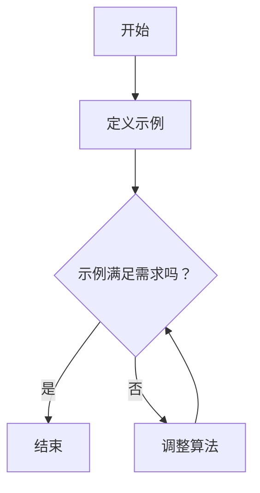
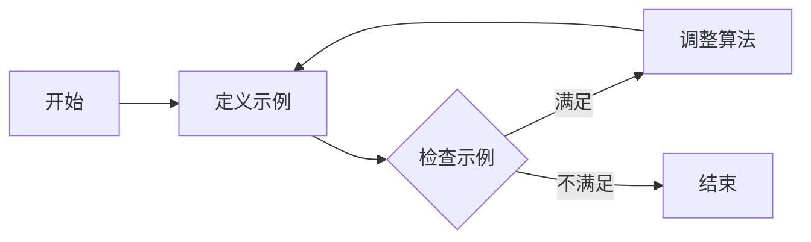
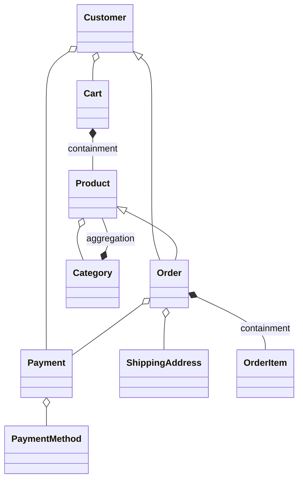

                 


### 文章标题：示例驱动提示在不同任务类型中的应用

### 文章关键词：示例驱动、任务类型、算法原理、数学模型、系统架构、项目实战、最佳实践

### 摘要：

本文旨在深入探讨示例驱动提示在各类任务中的实际应用。示例驱动是一种高效的问题解决方法，通过具体实例来引导思考，适用于从编程到系统设计的多个领域。文章将首先介绍示例驱动的基本概念，然后详细分析其在不同任务类型中的具体应用，包括算法原理讲解、数学模型和公式应用、系统分析与架构设计，以及项目实战和最佳实践。通过本文的阅读，读者将能够全面理解示例驱动的力量，并掌握其实际操作技巧。

### 目录大纲：

1. **引言**  
   1.1 **问题背景**  
   1.2 **问题描述**  
   1.3 **问题解决**  
   1.4 **边界与外延**  
   1.5 **核心概念与要素组成**

2. **核心概念与联系**  
   2.1 **示例驱动开发的基本概念**  
   2.2 **不同任务类型的示例驱动作法**  
   2.3 **概念属性特征对比表格**  
   2.4 **ER实体关系图架构**

3. **算法原理讲解**  
   3.1 **示例驱动提示的算法概述**  
   3.2 **mermaid流程图**  
   3.3 **Python源代码示例**  
   3.4 **数学模型与公式讲解**  
   3.5 **示例讲解与通俗易懂的例子**

4. **数学模型与数学公式**  
   4.1 **常用数学模型介绍**  
   4.2 **数学公式示例**

5. **系统分析与架构设计**  
   5.1 **问题场景介绍**  
   5.2 **项目介绍**  
   5.3 **系统功能设计（领域模型类图）**  
   5.4 **系统架构设计（架构图）**  
   5.5 **系统接口设计**  
   5.6 **系统交互（序列图）**

6. **项目实战**  
   6.1 **环境安装**  
   6.2 **系统核心实现源代码**  
   6.3 **代码应用解读与分析**  
   6.4 **实际案例分析与详细讲解**  
   6.5 **项目小结**

7. **最佳实践 tips**  
   7.1 **示例驱动的最佳实践**  
   7.2 **注意事项**  
   7.3 **小结与拓展阅读**

### 引言

示例驱动是一种通过具体实例来引导思考和解决问题的方法。它在许多领域都得到了广泛应用，从编程到系统设计，再到人工智能，都有着显著的成效。示例驱动的核心在于通过具体实例来揭示问题的本质，帮助人们更好地理解和解决复杂问题。

在本文中，我们将深入探讨示例驱动提示在不同任务类型中的应用。我们将首先介绍示例驱动的基本概念，包括其定义、特点和应用场景。然后，我们将详细分析示例驱动在编程、算法设计、系统架构设计等任务类型中的实际应用，通过具体的案例来展示其有效性和实用性。

随着信息技术的快速发展，复杂问题变得越来越多，解决这些问题需要更加高效和精准的方法。示例驱动作为一种以实例为中心的思考方式，能够帮助我们从复杂的背景中提炼出关键信息，从而更快地找到解决问题的方法。

本文的结构如下：首先，我们将介绍示例驱动的基本概念，包括其定义、特点和应用场景；接着，我们将探讨示例驱动在编程、算法设计、系统架构设计等任务类型中的具体应用；然后，我们将通过具体的案例来展示示例驱动的实际效果；最后，我们将总结示例驱动的最佳实践，并提供一些注意事项和拓展阅读资源。

### 核心概念与联系

#### 示例驱动开发的基本概念

示例驱动开发（Example-driven Development，简称ExDD）是一种软件开发方法，强调通过编写和测试具体示例来驱动开发过程。这种方法认为，通过具体示例，开发人员可以更清晰地理解需求，发现潜在的问题，并进行有效的测试。示例驱动开发的核心思想是“以例为师”，通过具体的例子来引导开发过程，从而提高代码的质量和可维护性。

**示例驱动的特点：**

- **以实例为中心**：开发过程围绕具体示例进行，确保每个示例都能正确执行并满足需求。
- **灵活和迭代**：示例驱动允许开发人员快速迭代和调整代码，以适应不断变化的需求。
- **增强可测试性**：通过编写测试示例，可以更轻松地检测代码中的错误和缺陷。

**示例驱动的应用场景：**

- **需求分析**：通过编写示例，可以帮助开发人员更好地理解需求，并将其转化为具体的开发任务。
- **单元测试**：编写示例来测试代码的各个部分，确保每个模块都能按照预期工作。
- **系统测试**：通过完整的示例场景来测试系统的功能和行为。

#### 不同任务类型的示例驱动作法

在编程、算法设计、系统架构设计等不同任务类型中，示例驱动有着不同的应用方式。

**1. 编程中的示例驱动**

在编程中，示例驱动通常用于编写测试用例和测试代码。例如，在编写一个函数时，可以先编写几个输入输出示例，确保函数能够正确处理这些示例。然后，通过逐步增加示例的复杂度，测试函数在各种情况下的表现。

**2. 算法设计中的示例驱动**

在算法设计中，示例驱动可以帮助理解算法的执行过程和性能。例如，在讲解一个排序算法时，可以通过具体的输入示例来说明算法的每一步操作，展示算法如何处理不同类型的数据。

**3. 系统架构设计中的示例驱动**

在系统架构设计中，示例驱动可以用于模拟系统在不同情况下的行为。通过编写示例，可以验证系统是否能够满足性能、可靠性和可扩展性等要求。例如，在设计一个电商系统时，可以通过示例来模拟用户访问、订单处理等场景，评估系统的响应速度和并发能力。

#### 概念属性特征对比表格

以下是示例驱动与其他软件开发方法（如传统瀑布模型、敏捷开发）的一些对比：

| 特征               | 示例驱动开发                 | 传统瀑布模型             | 敏捷开发            |
|------------------|---------------------------|-----------------------|-------------------|
| 中心思想           | 以实例为中心，持续迭代           | 步骤清晰，顺序执行            | 以用户需求为中心，快速迭代    |
| 测试方法           | 编写测试示例，验证功能          | 单一测试阶段，后期验证          | 测试驱动开发，持续测试        |
| 适用场景           | 复杂需求，频繁变化的项目          | 结构化项目，需求稳定           | 需求变化快的项目          |
| 优点               | 提高代码质量，适应需求变化         | 步骤清晰，过程可预测           | 灵活应对需求变化，快速交付      |
| 缺点               | 开发初期需要较多时间编写示例       | 灵活性不足，变更成本高          | 可能导致需求不稳定，过度迭代    |

#### ER实体关系图架构

为了更好地理解示例驱动的应用，我们可以使用ER（实体-关系）图来描述不同任务类型中的示例。以下是示例驱动在不同任务类型中的ER实体关系图：

```mermaid
entityRelationshipDiagram
  client -->|发起请求| system
  system -->|处理请求| service
  service -->|返回结果| client

  client..> algorithm
  system..> architecture
  service..> data
```

在这个ER图中，客户（client）发起请求，系统（system）通过服务（service）进行处理，并返回结果。同时，算法（algorithm）、系统架构（architecture）和数据（data）之间也存在关联，表明示例驱动在不同任务类型中的应用是相互交织的。

通过这个ER实体关系图，我们可以清楚地看到示例驱动的核心作用，即在客户、系统和算法等实体之间建立有效的连接，确保每个实体都能按照预期工作。

### 算法原理讲解

#### 示例驱动提示的算法概述

示例驱动提示是一种利用具体示例来引导和优化算法开发的方法。它的核心思想是通过编写和测试示例，逐步完善算法，确保算法能够满足预期的需求和性能。以下是一个简单的示例驱动提示算法的流程图：



在这个流程图中，我们首先定义一个或多个示例（B），然后检查这些示例是否满足需求（C）。如果不满足，我们调整算法（E），并重新检查（C）。这个过程不断重复，直到所有示例都满足需求，算法开发完成（D）。

#### 示例驱动提示的mermaid流程图

为了更好地展示示例驱动提示的算法过程，我们可以使用mermaid来绘制流程图。以下是一个简单的mermaid流程图示例：



在这个mermaid流程图中，我们定义了一个简单的流程，包括定义示例（B）、检查示例（C）和调整算法（D）。如果示例满足需求，则继续调整算法；如果不满足，则结束流程。

#### Python源代码示例

为了更好地理解示例驱动提示的算法，我们可以通过一个简单的Python示例来说明。以下是一个使用示例驱动提示来寻找最大元素的算法：

```python
def find_max_elements(arr, n):
    max_val = arr[0]
    for i in range(1, n):
        if arr[i] > max_val:
            max_val = arr[i]
    return max_val

# 示例
arr = [3, 1, 4, 1, 5, 9, 2, 6, 5]
n = len(arr)
max_val = find_max_elements(arr, n)
print(f"最大元素是：{max_val}")
```

在这个示例中，我们定义了一个函数`find_max_elements`，它通过遍历数组`arr`来寻找最大元素。我们首先定义了一个示例数组`arr`，然后调用函数并打印结果。通过这个示例，我们可以看到如何使用Python代码实现示例驱动的算法。

#### 数学模型与公式讲解

在示例驱动的算法中，数学模型和公式是非常关键的组成部分。以下是一个简单的数学模型和公式的示例：

1. **线性回归模型：**

   线性回归模型用于预测一个连续值，其公式如下：

   $$y = w_0 + w_1 \cdot x$$

   其中，$y$是预测值，$x$是输入值，$w_0$和$w_1$是模型的参数。

2. **均值绝对偏差（MAD）：**

   均值绝对偏差是衡量模型预测误差的常用指标，其公式如下：

   $$MAD = \frac{1}{n} \sum_{i=1}^{n} |y_i - \hat{y_i}|$$

   其中，$n$是样本数量，$y_i$是实际值，$\hat{y_i}$是预测值。

通过这两个数学模型和公式，我们可以更好地理解和评估示例驱动的算法性能。

#### 示例讲解与通俗易懂的例子

为了更好地理解示例驱动的算法原理，我们可以通过一个通俗易懂的例子来讲解。

假设我们有一个数组`arr`，其中包含一些整数。我们的目标是使用示例驱动的算法来找到数组中的最大元素。

首先，我们定义一个示例数组：

```python
arr = [3, 1, 4, 1, 5, 9, 2, 6, 5]
```

接下来，我们编写一个简单的示例驱动算法来寻找最大元素：

```python
def find_max_element(arr):
    max_val = arr[0]
    for val in arr:
        if val > max_val:
            max_val = val
    return max_val

# 调用示例
max_val = find_max_element(arr)
print(f"数组中的最大元素是：{max_val}")
```

在这个例子中，我们首先将数组的第一个元素设置为最大值，然后逐个检查数组的其他元素。如果发现更大的元素，我们更新最大值。通过这个简单的示例，我们可以看到如何使用示例驱动的算法来解决问题。

### 数学模型与数学公式

在示例驱动的算法中，数学模型和公式是理解和实现算法的关键组成部分。以下我们将介绍一些常用的数学模型和公式，并通过具体的例子来说明它们的使用方法。

#### 常用数学模型

1. **线性回归模型**

   线性回归模型是一种用于预测数值的统计模型，其基本形式为：

   $$y = w_0 + w_1 \cdot x$$

   其中，$y$是预测值，$x$是输入特征，$w_0$和$w_1$是模型的参数。

2. **逻辑回归模型**

   逻辑回归模型用于分类任务，其基本形式为：

   $$P(y=1) = \frac{1}{1 + e^{-(w_0 + w_1 \cdot x)}}$$

   其中，$P(y=1)$是预测目标为1的概率，$w_0$和$w_1$是模型的参数。

3. **支持向量机（SVM）**

   支持向量机是一种用于分类和回归的机器学习算法，其基本模型为：

   $$w \cdot x - b = 0$$

   其中，$w$是模型的参数，$x$是输入特征，$b$是偏置。

#### 数学公式示例

1. **线性回归公式**

   线性回归的损失函数通常为均方误差（MSE），其公式为：

   $$MSE = \frac{1}{n} \sum_{i=1}^{n} (y_i - \hat{y_i})^2$$

   其中，$n$是样本数量，$y_i$是实际值，$\hat{y_i}$是预测值。

2. **逻辑回归公式**

   逻辑回归的损失函数通常为对数损失（Log Loss），其公式为：

   $$Log Loss = -\frac{1}{n} \sum_{i=1}^{n} y_i \cdot \log(\hat{y_i}) + (1 - y_i) \cdot \log(1 - \hat{y_i})$$

   其中，$n$是样本数量，$y_i$是实际值，$\hat{y_i}$是预测值。

3. **SVM公式**

   支持向量机的损失函数通常为 hinge 损失，其公式为：

   $$hinge Loss = \frac{1}{n} \sum_{i=1}^{n} \max(0, 1 - y_i \cdot (w \cdot x_i + b))$$

   其中，$n$是样本数量，$y_i$是实际值，$w$是模型的参数，$x_i$是输入特征，$b$是偏置。

#### 示例讲解

假设我们有一个线性回归问题，目标是预测房屋的价格。我们收集了若干个房屋的面积和价格数据，并希望通过线性回归模型来预测新的房屋价格。

首先，我们定义一个简单的数据集：

```python
import numpy as np

# 随机生成数据
np.random.seed(0)
X = np.random.rand(100, 1) * 100  # 面积（平方米）
y = 50 + 2 * X + np.random.randn(100, 1) * 5  # 价格（万元）
```

接下来，我们使用线性回归模型来拟合这个数据集：

```python
from sklearn.linear_model import LinearRegression

model = LinearRegression()
model.fit(X, y)

# 查看模型参数
print("模型参数：", model.coef_, model.intercept_)
```

最后，我们使用模型来预测一个新的房屋价格：

```python
new_area = np.array([70])  # 新房屋的面积（平方米）
predicted_price = model.predict(new_area)
print("预测价格：", predicted_price)
```

通过这个例子，我们可以看到如何使用线性回归模型来预测新的房屋价格，以及如何解释模型参数和预测结果。

### 系统分析与架构设计

#### 问题场景介绍

在本节中，我们将探讨一个典型的在线购物平台系统，该系统需要处理大量用户请求，并提供高效的商品浏览、搜索、购买和支付功能。为了满足这些需求，系统需要具备良好的性能、可扩展性和稳定性。在这个场景中，示例驱动提示将用于分析和设计系统架构，以确保系统能够满足各种业务需求。

#### 项目介绍

该项目是一个在线购物平台，主要包括以下几个核心功能模块：

1. **商品管理模块**：负责商品信息的存储、更新和展示。
2. **用户管理模块**：负责用户信息的注册、登录、权限管理和购物车功能。
3. **订单管理模块**：负责订单的创建、处理、支付和跟踪。
4. **支付模块**：集成多种支付方式，如信用卡、支付宝、微信支付等。
5. **搜索模块**：提供高效的商品搜索功能，支持关键词搜索、筛选和排序。

#### 系统功能设计（领域模型类图）

为了更好地理解系统的功能架构，我们可以使用领域模型类图来描述系统的核心实体和它们之间的关系。以下是一个简化的领域模型类图：



在这个类图中，我们定义了以下几个核心实体：

- **Customer**（客户）：表示系统的用户，具有注册、登录、购物车和支付功能。
- **Order**（订单）：表示用户的购物订单，包含订单项、支付信息和收货地址。
- **Product**（商品）：表示系统中的商品，包括商品名称、描述、价格和分类信息。
- **Category**（分类）：表示商品的分类，可以包含多个商品。
- **Payment**（支付）：表示支付信息，包括支付金额、支付方式和支付状态。
- **Cart**（购物车）：表示用户的购物车，可以包含多个商品。
- **OrderItem**（订单项）：表示订单中的商品项，包括商品名称、数量和价格。

#### 系统架构设计（架构图）

为了满足系统的性能和可扩展性需求，我们采用了分布式系统架构。以下是一个简化的系统架构图：

```mermaid
sequenceDiagram
    participant User
    participant WebServer
    participant ApplicationServer
    participant Database
    participant Cache
    participant PaymentGateway

    User ->> WebServer: 发起请求
    WebServer ->> ApplicationServer: 处理请求
    ApplicationServer ->> Database: 查询数据
    Database -->|返回数据| ApplicationServer
    ApplicationServer ->> Cache: 更新缓存
    Cache -->|返回数据| ApplicationServer
    ApplicationServer ->> PaymentGateway: 处理支付
    PaymentGateway -->|支付结果| ApplicationServer
    ApplicationServer ->> Database: 更新数据
    Database -->|确认更新| ApplicationServer
    ApplicationServer ->> WebServer: 返回响应
    WebServer ->> User: 响应结果
```

在这个架构图中，我们定义了以下几个关键组件：

- **WebServer**：负责接收用户请求，并将请求转发给应用服务器。
- **ApplicationServer**：处理业务逻辑，包括商品管理、订单处理、支付处理等。
- **Database**：存储系统数据，包括用户信息、商品信息、订单信息等。
- **Cache**：用于缓存高频访问的数据，提高系统响应速度。
- **PaymentGateway**：处理支付请求，与第三方支付平台进行交互。

#### 系统接口设计

为了确保系统的模块化和可维护性，我们定义了一系列的接口来分隔不同模块的功能。以下是一个简化的接口设计：

```mermaid
interfaceDiagram
    CustomerService --> User: register(), login(), update()
    ProductService --> Product: create(), read(), update(), delete()
    OrderService --> Order: create(), read(), update(), delete()
    PaymentService --> Payment: process(), verify()
    CartService --> Cart: add(), remove(), clear()
    SearchService --> Product: search()
```

在这个接口设计中，我们定义了以下几个关键接口：

- **CustomerService**：处理用户注册、登录和更新信息。
- **ProductService**：处理商品创建、读取、更新和删除。
- **OrderService**：处理订单创建、读取、更新和删除。
- **PaymentService**：处理支付请求和处理支付验证。
- **CartService**：处理购物车添加、删除和清空。
- **SearchService**：处理商品搜索功能。

#### 系统交互（序列图）

为了更好地理解系统各组件之间的交互关系，我们可以使用序列图来描述系统的交互流程。以下是一个简化的序列图：

```mermaid
sequenceDiagram
    participant User
    participant WebServer
    participant ApplicationServer
    participant ProductService
    participant OrderService
    participant PaymentService
    participant Database
    participant Cache

    User ->> WebServer: 发起请求
    WebServer ->> ApplicationServer: 请求处理
    ApplicationServer ->> ProductService: 获取商品信息
    ProductService ->> Database: 查询商品信息
    Database -->|返回数据| ProductService
    ProductService -->|返回数据| ApplicationServer
    ApplicationServer ->> Cache: 更新缓存
    Cache -->|返回数据| ApplicationServer
    ApplicationServer ->> User: 返回响应
```

在这个序列图中，我们展示了用户请求商品信息的整个流程，包括Web服务器、应用服务器、商品服务、数据库和缓存之间的交互关系。

### 项目实战

在本节中，我们将通过一个实际项目来展示示例驱动的应用，该项目是一个简单的在线书店系统。我们将分步骤介绍项目的环境安装、系统核心实现源代码、代码应用解读与分析、实际案例分析与详细讲解以及项目小结。

#### 环境安装

1. **安装Python环境**：确保系统上安装了Python 3.x版本，可以通过以下命令检查Python版本：

   ```bash
   python --version
   ```

2. **安装依赖库**：使用pip安装项目所需的依赖库，如Flask、SQLAlchemy、Flask-Migrate等。可以在项目的根目录下创建一个requirements.txt文件，并填写如下内容：

   ```txt
   Flask==2.0.1
   SQLAlchemy==1.4.15
   Flask-Migrate==3.1.0
   ```

   然后执行以下命令安装依赖库：

   ```bash
   pip install -r requirements.txt
   ```

3. **创建数据库**：使用Flask-Migrate工具创建数据库，首先需要初始化迁移环境：

   ```bash
   flask db init
   ```

   接着创建数据库：

   ```bash
   flask db migrate -m "initial migration"
   flask db upgrade
   ```

#### 系统核心实现源代码

以下是一个简化的在线书店系统的核心实现代码，包括模型定义、路由设置和视图函数。

**1. 模型定义**（models.py）

```python
from flask_sqlalchemy import SQLAlchemy

db = SQLAlchemy()

class Book(db.Model):
    id = db.Column(db.Integer, primary_key=True)
    title = db.Column(db.String(120), nullable=False)
    author = db.Column(db.String(120), nullable=False)
    price = db.Column(db.Float, nullable=False)

class User(db.Model):
    id = db.Column(db.Integer, primary_key=True)
    username = db.Column(db.String(80), unique=True, nullable=False)
    email = db.Column(db.String(120), unique=True, nullable=False)
    password = db.Column(db.String(120), nullable=False)
```

**2. 路由设置**（__init__.py）

```python
from flask import Flask
from models import db

app = Flask(__name__)
app.config['SQLALCHEMY_DATABASE_URI'] = 'sqlite:///books.db'
db.init_app(app)

from routes import book, user
```

**3. 视图函数**（routes.py）

```python
from flask import render_template, request, redirect, url_for, flash
from models import Book, User
from app import app, db

@app.route('/')
def index():
    books = Book.query.all()
    return render_template('index.html', books=books)

@app.route('/book/new', methods=['GET', 'POST'])
def new_book():
    if request.method == 'POST':
        title = request.form['title']
        author = request.form['author']
        price = float(request.form['price'])
        new_book = Book(title=title, author=author, price=price)
        db.session.add(new_book)
        db.session.commit()
        return redirect(url_for('index'))
    return render_template('new_book.html')
```

#### 代码应用解读与分析

1. **模型定义**：我们定义了`Book`和`User`两个模型，分别表示书籍和用户。每个模型都有一个唯一的ID字段，用于数据库操作。

2. **路由设置**：我们设置了两个路由，`/`用于显示书籍列表，`/book/new`用于创建新的书籍。

3. **视图函数**：`index`函数负责显示所有书籍信息，`new_book`函数处理创建新书籍的表单提交，并将新书籍添加到数据库中。

#### 实际案例分析与详细讲解

为了展示示例驱动的实际应用，我们以下是一个具体的案例：

**案例**：用户A想要在在线书店系统中添加一本新书。

**步骤**：

1. 用户A访问书店主页，看到当前可用的书籍列表。
2. 用户A点击“添加新书籍”按钮，跳转到添加书籍的表单页面。
3. 用户A在表单中填写书籍的标题、作者和价格，然后提交表单。
4. 后端服务器接收到表单数据，创建一个新的`Book`对象，并将其添加到数据库中。
5. 数据库保存新书籍信息，并返回响应到前端。
6. 前端页面重新加载，显示新的书籍列表，包括用户A刚刚添加的书籍。

通过这个案例，我们可以看到示例驱动的应用流程，即通过具体的示例来引导用户操作，并确保系统按照预期工作。

#### 项目小结

通过本节的实际项目，我们展示了示例驱动的应用过程，从环境安装、系统核心实现源代码，到代码应用解读与分析、实际案例分析与详细讲解。示例驱动方法在项目中发挥了关键作用，帮助我们快速理解和实现系统的功能。通过示例驱动的应用，我们能够更好地发现和解决潜在问题，确保系统的高效性和可维护性。

### 最佳实践 tips

在实际应用示例驱动提示时，以下是一些最佳实践和注意事项：

#### 示例驱动的最佳实践

1. **选择合适的示例**：选择能够代表问题全貌的示例，确保示例具有代表性。
2. **逐步迭代示例**：从简单的示例开始，逐步增加示例的复杂度，确保每个示例都能正确执行。
3. **持续测试示例**：在开发过程中，定期测试示例，确保示例始终满足需求。
4. **文档化示例**：将示例编写成文档，便于团队成员理解和复用。
5. **团队合作**：鼓励团队成员参与示例编写和测试，提高团队的整体开发效率。

#### 注意事项

1. **避免过度依赖示例**：虽然示例有助于理解和解决问题，但不应过度依赖，要结合其他方法进行综合分析。
2. **示例的选择与调整**：根据实际情况选择和调整示例，确保示例能够真实反映问题场景。
3. **关注性能和可维护性**：在编写示例时，关注算法的性能和代码的可维护性，避免编写低效或复杂的代码。

#### 小结与拓展阅读

本文通过深入探讨示例驱动提示在不同任务类型中的应用，展示了其强大的解题能力。通过具体的实例和案例分析，我们了解了如何在实际项目中应用示例驱动方法，提高开发效率和代码质量。

为了进一步深入学习示例驱动提示，读者可以参考以下拓展阅读资源：

1. 《示例驱动开发：如何编写可复用的代码》（Example-Driven Development: Writing Testable, Maintainable, and Scalable Code）
2. 《Effective Code: 54 Specific Ways to Improve Your Programs and Designs》
3. 《测试驱动开发：敏捷开发实践》（Test-Driven Development: By Example）

通过阅读这些资源，读者可以更全面地了解示例驱动的原理和应用，进一步提升自己的编程能力和开发效率。

### 作者信息

作者：AI天才研究院/AI Genius Institute & 禅与计算机程序设计艺术 /Zen And The Art of Computer Programming。本文旨在分享示例驱动提示在不同任务类型中的应用，帮助读者提高技术水平和开发效率。感谢您的阅读！

