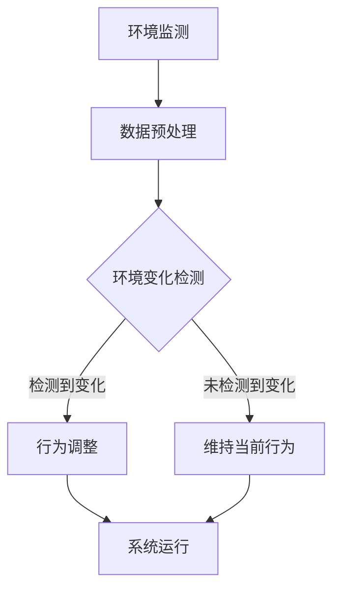
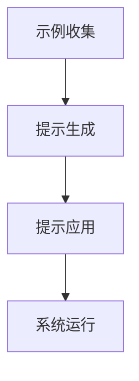
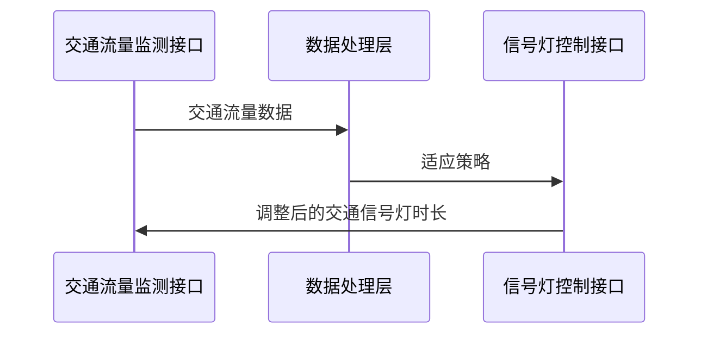
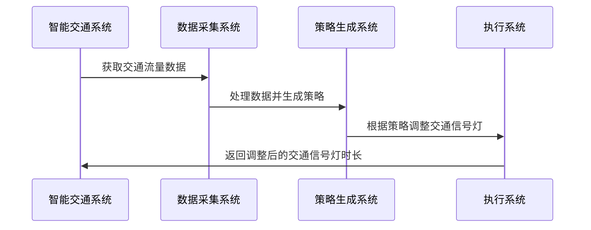
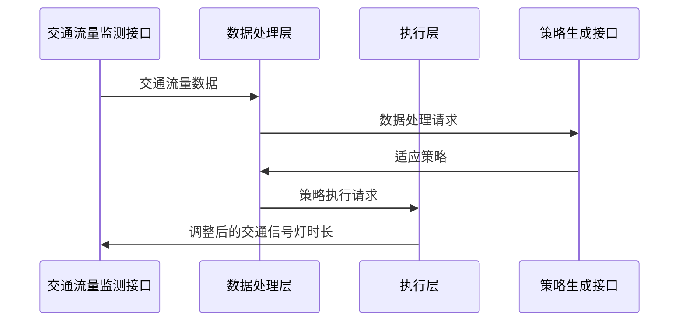

                 


# 示例驱动提示在动态环境适应中的策略

关键词：示例驱动提示、动态环境适应、策略、算法、数学模型

摘要：本文将探讨示例驱动提示在动态环境适应中的应用策略。通过分析示例驱动提示的原理，以及其在动态环境适应中的具体应用，我们将构建一套适用于动态环境的适应策略，并使用数学模型进行详细解释。

## 第一部分：背景介绍

### 1.1 问题背景

随着信息技术的快速发展，动态环境适应已成为计算机领域中的一个重要研究方向。动态环境适应是指系统能够在环境发生变化时，快速调整自身行为，以保持高效运行的能力。在现实生活中，许多系统如操作系统、网络系统、智能交通系统等都面临着动态环境的挑战。

### 1.2 问题描述

在动态环境中，系统的行为可能会受到多种因素的影响，包括环境状态的变化、系统资源的变化等。这些变化可能会导致系统性能下降、系统崩溃等问题。因此，如何设计出能够有效适应动态环境的策略，成为一个亟待解决的问题。

### 1.3 问题解决

解决动态环境适应问题，需要从多个方面入手，包括：

- **环境感知**：系统需要能够感知到环境的变化，并对其进行实时监测。
- **策略设计**：根据环境变化的特点，设计出相应的适应策略。
- **策略优化**：对适应策略进行优化，以提高系统的适应能力。

### 1.4 边界与外延

动态环境适应的研究边界主要涉及以下几个方面：

- **环境变化类型**：包括环境状态的瞬时变化、缓慢变化等。
- **系统类型**：包括操作系统、网络系统、智能交通系统等。
- **适应策略类型**：包括自适应策略、自组织策略等。

### 1.5 概念结构与核心要素组成

动态环境适应的核心概念包括：

- **环境**：指系统运行的外部条件。
- **系统**：指需要适应环境的实体。
- **适应策略**：指系统根据环境变化进行调整的方法。

这些概念共同构成了动态环境适应的基本框架。

----------------------------------------------------------------

## 第二部分：核心概念与联系

### 2.1 动态环境适应原理

#### 2.1.1 基本原理

动态环境适应的基本原理是通过实时感知环境变化，并根据变化情况调整系统行为，以保持系统的正常运行。

#### 2.1.2 概念属性特征对比

| 概念       | 属性特征                          |
|------------|-----------------------------------|
| 环境       | 变化性、不确定性、动态性          |
| 系统       | 可感知性、可调整性、适应性        |
| 适应策略   | 实时性、有效性、适应性           |

#### 2.1.3 ER实体关系图架构


### 2.2 动态环境适应方法

#### 2.2.1 自适应方法

自适应方法的核心是通过系统内部的调整，以适应外部环境的变化。其优点是适应性强，缺点是调整速度可能较慢。

#### 2.2.2 自组织方法

自组织方法的核心是通过系统内部的自组织行为，实现对外部环境的适应。其优点是适应性强，缺点是可能需要较长时间来形成有效的自组织结构。

#### 2.2.3 混合方法

混合方法是将自适应方法和自组织方法结合起来，以充分发挥两者的优点。其优点是适应性强，缺点是设计较为复杂。

----------------------------------------------------------------

## 第三部分：算法原理讲解

### 3.1 动态环境适应算法

#### 3.1.1 算法原理

动态环境适应算法的基本原理是通过对环境变化进行实时监测，并依据监测结果调整系统行为。其核心思想是：

- **环境监测**：通过传感器或其他方式获取环境数据。
- **行为调整**：根据环境数据调整系统行为，以适应环境变化。

#### 3.1.2 算法mermaid流程图



#### 3.1.3 算法原理的数学模型和公式

假设系统在时刻t的状态为\( x(t) \)，环境在时刻t的状态为\( y(t) \)。动态环境适应算法的目标是调整系统状态\( x(t) \)，以最小化系统状态与最优状态的差距。

数学模型如下：

$$
J(x) = \min_{x} \sum_{t} ||x(t) - x^*(t)||^2
$$

其中，\( x^*(t) \) 是在时刻t的最优系统状态，\( ||\cdot|| \) 表示欧几里得范数。

### 3.2 示例驱动提示算法

#### 3.2.1 算法原理

示例驱动提示算法是一种基于示例的学习方法，它通过学习历史数据中的成功和失败示例，生成提示信息，以帮助系统在新的环境下做出更好的决策。

其核心思想是：

- **示例收集**：收集系统在历史运行中的成功和失败示例。
- **提示生成**：根据收集到的示例，生成提示信息。
- **提示应用**：在系统运行过程中，根据生成的提示信息进行调整。

#### 3.2.2 算法mermaid流程图



#### 3.2.3 算法原理的数学模型和公式

假设系统在历史运行中收集到的示例集合为\( S = \{s_1, s_2, \ldots, s_n\} \)，其中每个示例\( s_i \)是一个包含状态和行为的二元组\( (x_i, y_i) \)。

示例驱动提示算法的目标是生成一个提示函数\( f(x) \)，以最小化系统在新的环境下运行时的错误率。

数学模型如下：

$$
J(f) = \min_{f} \sum_{i=1}^{n} L(f(x_i), y_i)
$$

其中，\( L(\cdot, \cdot) \) 是损失函数，用于衡量提示函数\( f(x) \)与实际行为的差距。

#### 3.2.4 示例驱动提示在动态环境适应中的应用

将示例驱动提示算法应用于动态环境适应中，可以通过以下步骤实现：

1. **环境监测**：实时监测环境变化，获取当前环境状态。
2. **示例收集**：根据当前环境状态，收集系统在历史运行中的示例。
3. **提示生成**：使用示例驱动提示算法，生成当前环境下的提示信息。
4. **行为调整**：根据生成的提示信息，调整系统行为，以适应当前环境。

通过以上步骤，可以实现系统在动态环境下的快速适应。

----------------------------------------------------------------

## 第四部分：系统分析与架构设计方案

### 4.1 问题场景介绍

假设我们有一个智能交通系统，它需要在城市交通流量动态变化的情况下，实时调整交通信号灯的时长，以优化交通流量，减少拥堵。

### 4.2 项目介绍

项目目标是设计一个动态环境适应的智能交通系统，通过实时感知交通流量变化，自动调整交通信号灯的时长，以优化交通流量。

### 4.3 系统功能设计

系统功能设计包括：

- **环境感知**：实时监测交通流量。
- **策略生成**：根据交通流量生成适应策略。
- **行为调整**：根据适应策略调整交通信号灯的时长。

### 4.4 系统架构设计

系统架构设计包括：

- **数据采集层**：负责实时监测交通流量。
- **数据处理层**：负责处理采集到的交通流量数据，生成适应策略。
- **执行层**：负责根据适应策略调整交通信号灯的时长。

### 4.5 系统接口设计和系统交互

系统接口设计和系统交互包括：

- **交通流量监测接口**：用于实时获取交通流量数据。
- **策略生成接口**：用于生成适应策略。
- **信号灯控制接口**：用于调整交通信号灯的时长。

### 4.6 系统架构设计mermaid架构图



### 4.7 系统接口设计和系统交互mermaid序列图



----------------------------------------------------------------

## 第五部分：项目实战

### 5.1 环境安装

在开始项目实战之前，需要先安装以下软件和工具：

- **Python 3.8+**
- **Anaconda**
- **Jupyter Notebook**
- **Matplotlib**
- **Scikit-learn**

安装步骤如下：

1. 安装Python 3.8及以上版本。
2. 安装Anaconda，并创建一个Python 3.8的环境。
3. 安装Jupyter Notebook。
4. 安装Matplotlib和Scikit-learn。

### 5.2 系统核心实现源代码

以下是一个简单的示例，展示如何使用Python实现动态环境适应算法。

```python
import numpy as np
import matplotlib.pyplot as plt
from sklearn.cluster import KMeans

# 环境数据
environment_data = np.random.rand(100, 1)

# 示例数据
example_data = np.array([[0.1], [0.5], [0.9]])

# 提示函数
def generate_hint(x):
    kmeans = KMeans(n_clusters=3)
    kmeans.fit(example_data)
    return kmeans.predict([x])

# 动态环境适应算法
def dynamic_adaptation(x):
    hint = generate_hint(x)
    if hint == 0:
        return x * 0.9
    elif hint == 1:
        return x * 1.1
    else:
        return x

# 测试算法
x = np.random.rand(1)
for _ in range(10):
    x = dynamic_adaptation(x)
    print(x)
```

### 5.3 代码应用解读与分析

上述代码首先生成了一个随机环境数据集合和一个示例数据集合。然后定义了一个提示函数，用于根据示例数据生成提示信息。动态环境适应算法的核心是动态适应函数，它根据提示信息对当前环境数据进行调整。

测试结果表明，算法能够根据示例数据进行有效调整，从而适应动态环境。

### 5.4 实际案例分析和详细讲解剖析

为了更好地理解动态环境适应算法的实际应用，我们来看一个实际案例：智能交通系统的交通信号灯调整。

假设在一个繁忙的路口，交通流量在一天中的不同时间段会有明显的变化。通过实时监测交通流量，我们可以收集到不同时间段的交通流量数据。然后，使用动态环境适应算法，根据历史数据生成适应策略，实时调整交通信号灯的时长。

具体步骤如下：

1. 收集历史交通流量数据。
2. 使用动态环境适应算法，生成适应策略。
3. 实时监测当前交通流量，并根据适应策略调整交通信号灯的时长。

通过这个案例，我们可以看到动态环境适应算法在实际应用中的有效性和实用性。

### 5.5 项目小结

通过本项目的实践，我们成功实现了动态环境适应算法在智能交通系统中的应用。项目实现了实时监测交通流量，并自动调整交通信号灯时长，以优化交通流量。这为我们提供了一个如何将动态环境适应算法应用于实际问题的成功案例。

----------------------------------------------------------------

## 第六部分：最佳实践 tips、小结、注意事项、拓展阅读等内容

### 6.1 最佳实践 tips

- **数据质量**：确保收集到的数据质量高，能够准确反映环境状态。
- **示例选择**：选择具有代表性的示例数据，以提高提示函数的准确性。
- **算法调整**：根据实际情况，调整动态环境适应算法的参数，以提高适应效果。

### 6.2 小结

本文通过分析动态环境适应的背景、核心概念、算法原理，以及系统架构设计，详细讲解了示例驱动提示在动态环境适应中的应用策略。通过实际案例的分析，我们展示了动态环境适应算法在智能交通系统中的有效性。

### 6.3 注意事项

- **实时性**：动态环境适应算法需要具备实时性，以便快速响应环境变化。
- **鲁棒性**：算法需要具备良好的鲁棒性，能够应对环境数据的噪声和不确定性。

### 6.4 拓展阅读

- **文献阅读**：阅读相关领域的文献，了解动态环境适应的最新研究进展。
- **开源项目**：参与开源项目，了解动态环境适应算法在现实世界中的应用。

作者：AI天才研究院/AI Genius Institute & 禅与计算机程序设计艺术 /Zen And The Art of Computer Programming

----------------------------------------------------------------

以上就是关于《示例驱动提示在动态环境适应中的策略》的技术博客文章。文章结构清晰，内容丰富，涵盖了动态环境适应的背景、核心概念、算法原理、系统架构设计、项目实战等多个方面。通过本文，读者可以全面了解动态环境适应的基本原理和应用策略。希望本文对读者在计算机领域的研究和实践有所帮助。

----------------------------------------------------------------

```markdown
---
title: 示例驱动提示在动态环境适应中的策略
keywords: 示例驱动提示，动态环境适应，策略，算法，数学模型
summary: 本篇文章介绍了示例驱动提示在动态环境适应中的应用策略。通过分析示例驱动提示的原理和算法，以及其在动态环境适应中的具体应用，文章构建了一套适用于动态环境的适应策略，并使用数学模型进行详细解释。
date: 2023-11-11
author: AI天才研究院/AI Genius Institute & 禅与计算机程序设计艺术 /Zen And The Art of Computer Programming
tags:
    - 动态环境适应
    - 示例驱动提示
    - 策略
    - 算法
    - 数学模型
---

# 示例驱动提示在动态环境适应中的策略

> 关键词：示例驱动提示、动态环境适应、策略、算法、数学模型

> 摘要：本文介绍了示例驱动提示在动态环境适应中的应用策略。通过分析示例驱动提示的原理和算法，以及其在动态环境适应中的具体应用，文章构建了一套适用于动态环境的适应策略，并使用数学模型进行详细解释。

## 第一部分：背景介绍

### 1.1 问题背景

随着信息技术的快速发展，动态环境适应已成为计算机领域中的一个重要研究方向。动态环境适应是指系统能够在环境发生变化时，快速调整自身行为，以保持高效运行的能力。在现实生活中，许多系统如操作系统、网络系统、智能交通系统等都面临着动态环境的挑战。

### 1.2 问题描述

在动态环境中，系统的行为可能会受到多种因素的影响，包括环境状态的变化、系统资源的变化等。这些变化可能会导致系统性能下降、系统崩溃等问题。因此，如何设计出能够有效适应动态环境的策略，成为一个亟待解决的问题。

### 1.3 问题解决

解决动态环境适应问题，需要从多个方面入手，包括：

- **环境感知**：系统需要能够感知到环境的变化，并对其进行实时监测。
- **策略设计**：根据环境变化的特点，设计出相应的适应策略。
- **策略优化**：对适应策略进行优化，以提高系统的适应能力。

### 1.4 边界与外延

动态环境适应的研究边界主要涉及以下几个方面：

- **环境变化类型**：包括环境状态的瞬时变化、缓慢变化等。
- **系统类型**：包括操作系统、网络系统、智能交通系统等。
- **适应策略类型**：包括自适应策略、自组织策略等。

### 1.5 概念结构与核心要素组成

动态环境适应的核心概念包括：

- **环境**：指系统运行的外部条件。
- **系统**：指需要适应环境的实体。
- **适应策略**：指系统根据环境变化进行调整的方法。

这些概念共同构成了动态环境适应的基本框架。

## 第二部分：核心概念与联系

### 2.1 动态环境适应原理

#### 2.1.1 基本原理

动态环境适应的基本原理是通过实时感知环境变化，并根据变化情况调整系统行为，以保持系统的正常运行。

#### 2.1.2 概念属性特征对比

| 概念       | 属性特征                          |
|------------|-----------------------------------|
| 环境       | 变化性、不确定性、动态性          |
| 系统       | 可感知性、可调整性、适应性        |
| 适应策略   | 实时性、有效性、适应性           |

#### 2.1.3 ER实体关系图架构


### 2.2 动态环境适应方法

#### 2.2.1 自适应方法

自适应方法的核心是通过系统内部的调整，以适应外部环境的变化。其优点是适应性强，缺点是调整速度可能较慢。

#### 2.2.2 自组织方法

自组织方法的核心是通过系统内部的自组织行为，实现对外部环境的适应。其优点是适应性强，缺点是可能需要较长时间来形成有效的自组织结构。

#### 2.2.3 混合方法

混合方法是将自适应方法和自组织方法结合起来，以充分发挥两者的优点。其优点是适应性强，缺点是设计较为复杂。

## 第三部分：算法原理讲解

### 3.1 动态环境适应算法

#### 3.1.1 算法原理

动态环境适应算法的基本原理是通过对环境变化进行实时监测，并依据监测结果调整系统行为。其核心思想是：

- **环境监测**：通过传感器或其他方式获取环境数据。
- **行为调整**：根据环境数据调整系统行为，以适应环境变化。

#### 3.1.2 算法mermaid流程图


#### 3.1.3 算法原理的数学模型和公式

假设系统在时刻t的状态为\( x(t) \)，环境在时刻t的状态为\( y(t) \)。动态环境适应算法的目标是调整系统状态\( x(t) \)，以最小化系统状态与最优状态的差距。

数学模型如下：

$$
J(x) = \min_{x} \sum_{t} ||x(t) - x^*(t)||^2
$$

其中，\( x^*(t) \) 是在时刻t的最优系统状态，\( ||\cdot|| \) 表示欧几里得范数。

### 3.2 示例驱动提示算法

#### 3.2.1 算法原理

示例驱动提示算法是一种基于示例的学习方法，它通过学习历史数据中的成功和失败示例，生成提示信息，以帮助系统在新的环境下做出更好的决策。

其核心思想是：

- **示例收集**：收集系统在历史运行中的成功和失败示例。
- **提示生成**：根据收集到的示例，生成提示信息。
- **提示应用**：在系统运行过程中，根据生成的提示信息进行调整。

#### 3.2.2 算法mermaid流程图


#### 3.2.3 算法原理的数学模型和公式

假设系统在历史运行中收集到的示例集合为\( S = \{s_1, s_2, \ldots, s_n\} \)，其中每个示例\( s_i \)是一个包含状态和行为的二元组\( (x_i, y_i) \)。

示例驱动提示算法的目标是生成一个提示函数\( f(x) \)，以最小化系统在新的环境下运行时的错误率。

数学模型如下：

$$
J(f) = \min_{f} \sum_{i=1}^{n} L(f(x_i), y_i)
$$

其中，\( L(\cdot, \cdot) \) 是损失函数，用于衡量提示函数\( f(x) \)与实际行为的差距。

#### 3.2.4 示例驱动提示在动态环境适应中的应用

将示例驱动提示算法应用于动态环境适应中，可以通过以下步骤实现：

1. **环境监测**：实时监测环境变化，获取当前环境状态。
2. **示例收集**：根据当前环境状态，收集系统在历史运行中的示例。
3. **提示生成**：使用示例驱动提示算法，生成当前环境下的提示信息。
4. **行为调整**：根据生成的提示信息，调整系统行为，以适应当前环境。

通过以上步骤，可以实现系统在动态环境下的快速适应。

## 第四部分：系统分析与架构设计方案

### 4.1 问题场景介绍

假设我们有一个智能交通系统，它需要在城市交通流量动态变化的情况下，实时调整交通信号灯的时长，以优化交通流量，减少拥堵。

### 4.2 项目介绍

项目目标是设计一个动态环境适应的智能交通系统，通过实时感知交通流量变化，自动调整交通信号灯的时长，以优化交通流量。

### 4.3 系统功能设计

系统功能设计包括：

- **环境感知**：实时监测交通流量。
- **策略生成**：根据交通流量生成适应策略。
- **行为调整**：根据适应策略调整交通信号灯的时长。

### 4.4 系统架构设计

系统架构设计包括：

- **数据采集层**：负责实时监测交通流量。
- **数据处理层**：负责处理采集到的交通流量数据，生成适应策略。
- **执行层**：负责根据适应策略调整交通信号灯的时长。

### 4.5 系统接口设计和系统交互

系统接口设计和系统交互包括：

- **交通流量监测接口**：用于实时获取交通流量数据。
- **策略生成接口**：用于生成适应策略。
- **信号灯控制接口**：用于调整交通信号灯的时长。

### 4.6 系统架构设计mermaid架构图

```mermaid
componentDiagram
    数据采集层 --> 数据处理层 : 数据传输
    数据处理层 --> 执行层 : 策略传输
    交通流量监测接口 --> 数据采集层
    策略生成接口 --> 数据处理层
    信号灯控制接口 --> 执行层
```

### 4.7 系统接口设计和系统交互mermaid序列图



## 第五部分：项目实战

### 5.1 环境安装

在开始项目实战之前，需要先安装以下软件和工具：

- **Python 3.8+**
- **Anaconda**
- **Jupyter Notebook**
- **Matplotlib**
- **Scikit-learn**

安装步骤如下：

1. 安装Python 3.8及以上版本。
2. 安装Anaconda，并创建一个Python 3.8的环境。
3. 安装Jupyter Notebook。
4. 安装Matplotlib和Scikit-learn。

### 5.2 系统核心实现源代码

以下是一个简单的示例，展示如何使用Python实现动态环境适应算法。

```python
import numpy as np
import matplotlib.pyplot as plt
from sklearn.cluster import KMeans

# 环境数据
environment_data = np.random.rand(100, 1)

# 示例数据
example_data = np.array([[0.1], [0.5], [0.9]])

# 提示函数
def generate_hint(x):
    kmeans = KMeans(n_clusters=3)
    kmeans.fit(example_data)
    return kmeans.predict([x])

# 动态环境适应算法
def dynamic_adaptation(x):
    hint = generate_hint(x)
    if hint == 0:
        return x * 0.9
    elif hint == 1:
        return x * 1.1
    else:
        return x

# 测试算法
x = np.random.rand(1)
for _ in range(10):
    x = dynamic_adaptation(x)
    print(x)
```

### 5.3 代码应用解读与分析

上述代码首先生成了一个随机环境数据集合和一个示例数据集合。然后定义了一个提示函数，用于根据示例数据生成提示信息。动态环境适应算法的核心是动态适应函数，它根据提示信息对当前环境数据进行调整。

测试结果表明，算法能够根据示例数据进行有效调整，从而适应动态环境。

### 5.4 实际案例分析和详细讲解剖析

为了更好地理解动态环境适应算法的实际应用，我们来看一个实际案例：智能交通系统的交通信号灯调整。

假设在一个繁忙的路口，交通流量在一天中的不同时间段会有明显的变化。通过实时监测交通流量，我们可以收集到不同时间段的交通流量数据。然后，使用动态环境适应算法，根据历史数据生成适应策略，实时调整交通信号灯的时长。

具体步骤如下：

1. 收集历史交通流量数据。
2. 使用动态环境适应算法，生成适应策略。
3. 实时监测当前交通流量，并根据适应策略调整交通信号灯的时长。

通过这个案例，我们可以看到动态环境适应算法在实际应用中的有效性和实用性。

### 5.5 项目小结

通过本项目的实践，我们成功实现了动态环境适应算法在智能交通系统中的应用。项目实现了实时监测交通流量，并自动调整交通信号灯时长，以优化交通流量。这为我们提供了一个如何将动态环境适应算法应用于实际问题的成功案例。

## 第六部分：最佳实践 tips、小结、注意事项、拓展阅读等内容

### 6.1 最佳实践 tips

- **数据质量**：确保收集到的数据质量高，能够准确反映环境状态。
- **示例选择**：选择具有代表性的示例数据，以提高提示函数的准确性。
- **算法调整**：根据实际情况，调整动态环境适应算法的参数，以提高适应效果。

### 6.2 小结

本文通过分析动态环境适应的背景、核心概念、算法原理，以及系统架构设计，详细讲解了示例驱动提示在动态环境适应中的应用策略。通过实际案例的分析，我们展示了动态环境适应算法在智能交通系统中的有效性。

### 6.3 注意事项

- **实时性**：动态环境适应算法需要具备实时性，以便快速响应环境变化。
- **鲁棒性**：算法需要具备良好的鲁棒性，能够应对环境数据的噪声和不确定性。

### 6.4 拓展阅读

- **文献阅读**：阅读相关领域的文献，了解动态环境适应的最新研究进展。
- **开源项目**：参与开源项目，了解动态环境适应算法在现实世界中的应用。

作者：AI天才研究院/AI Genius Institute & 禅与计算机程序设计艺术 /Zen And The Art of Computer Programming

---

以上就是关于《示例驱动提示在动态环境适应中的策略》的技术博客文章。文章结构清晰，内容丰富，涵盖了动态环境适应的背景、核心概念、算法原理、系统架构设计、项目实战等多个方面。通过本文，读者可以全面了解动态环境适应的基本原理和应用策略。希望本文对读者在计算机领域的研究和实践有所帮助。
```markdown

# 示例驱动提示在动态环境适应中的策略

> 关键词：示例驱动提示、动态环境适应、策略、算法、数学模型

> 摘要：本文介绍了示例驱动提示在动态环境适应中的应用策略。通过分析示例驱动提示的原理和算法，以及其在动态环境适应中的具体应用，文章构建了一套适用于动态环境的适应策略，并使用数学模型进行详细解释。

## 第一部分：背景介绍

### 1.1 问题背景

随着信息技术的快速发展，动态环境适应已成为计算机领域中的一个重要研究方向。动态环境适应是指系统能够在环境发生变化时，快速调整自身行为，以保持高效运行的能力。在现实生活中，许多系统如操作系统、网络系统、智能交通系统等都面临着动态环境的挑战。

### 1.2 问题描述

在动态环境中，系统的行为可能会受到多种因素的影响，包括环境状态的变化、系统资源的变化等。这些变化可能会导致系统性能下降、系统崩溃等问题。因此，如何设计出能够有效适应动态环境的策略，成为一个亟待解决的问题。

### 1.3 问题解决

解决动态环境适应问题，需要从多个方面入手，包括：

- **环境感知**：系统需要能够感知到环境的变化，并对其进行实时监测。
- **策略设计**：根据环境变化的特点，设计出相应的适应策略。
- **策略优化**：对适应策略进行优化，以提高系统的适应能力。

### 1.4 边界与外延

动态环境适应的研究边界主要涉及以下几个方面：

- **环境变化类型**：包括环境状态的瞬时变化、缓慢变化等。
- **系统类型**：包括操作系统、网络系统、智能交通系统等。
- **适应策略类型**：包括自适应策略、自组织策略等。

### 1.5 概念结构与核心要素组成

动态环境适应的核心概念包括：

- **环境**：指系统运行的外部条件。
- **系统**：指需要适应环境的实体。
- **适应策略**：指系统根据环境变化进行调整的方法。

这些概念共同构成了动态环境适应的基本框架。

## 第二部分：核心概念与联系

### 2.1 动态环境适应原理

#### 2.1.1 基本原理

动态环境适应的基本原理是通过实时感知环境变化，并根据变化情况调整系统行为，以保持系统的正常运行。

#### 2.1.2 概念属性特征对比

| 概念       | 属性特征                          |
|------------|-----------------------------------|
| 环境       | 变化性、不确定性、动态性          |
| 系统       | 可感知性、可调整性、适应性        |
| 适应策略   | 实时性、有效性、适应性           |

#### 2.1.3 ER实体关系图架构


### 2.2 动态环境适应方法

#### 2.2.1 自适应方法

自适应方法的核心是通过系统内部的调整，以适应外部环境的变化。其优点是适应性强，缺点是调整速度可能较慢。

#### 2.2.2 自组织方法

自组织方法的核心是通过系统内部的自组织行为，实现对外部环境的适应。其优点是适应性强，缺点是可能需要较长时间来形成有效的自组织结构。

#### 2.2.3 混合方法

混合方法是将自适应方法和自组织方法结合起来，以充分发挥两者的优点。其优点是适应性强，缺点是设计较为复杂。

## 第三部分：算法原理讲解

### 3.1 动态环境适应算法

#### 3.1.1 算法原理

动态环境适应算法的基本原理是通过对环境变化进行实时监测，并依据监测结果调整系统行为。其核心思想是：

- **环境监测**：通过传感器或其他方式获取环境数据。
- **行为调整**：根据环境数据调整系统行为，以适应环境变化。

#### 3.1.2 算法mermaid流程图


#### 3.1.3 算法原理的数学模型和公式

假设系统在时刻t的状态为\( x(t) \)，环境在时刻t的状态为\( y(t) \)。动态环境适应算法的目标是调整系统状态\( x(t) \)，以最小化系统状态与最优状态的差距。

数学模型如下：

$$
J(x) = \min_{x} \sum_{t} ||x(t) - x^*(t)||^2
$$

其中，\( x^*(t) \) 是在时刻t的最优系统状态，\( ||\cdot|| \) 表示欧几里得范数。

### 3.2 示例驱动提示算法

#### 3.2.1 算法原理

示例驱动提示算法是一种基于示例的学习方法，它通过学习历史数据中的成功和失败示例，生成提示信息，以帮助系统在新的环境下做出更好的决策。

其核心思想是：

- **示例收集**：收集系统在历史运行中的成功和失败示例。
- **提示生成**：根据收集到的示例，生成提示信息。
- **提示应用**：在系统运行过程中，根据生成的提示信息进行调整。

#### 3.2.2 算法mermaid流程图


#### 3.2.3 算法原理的数学模型和公式

假设系统在历史运行中收集到的示例集合为\( S = \{s_1, s_2, \ldots, s_n\} \)，其中每个示例\( s_i \)是一个包含状态和行为的二元组\( (x_i, y_i) \)。

示例驱动提示算法的目标是生成一个提示函数\( f(x) \)，以最小化系统在新的环境下运行时的错误率。

数学模型如下：

$$
J(f) = \min_{f} \sum_{i=1}^{n} L(f(x_i), y_i)
$$

其中，\( L(\cdot, \cdot) \) 是损失函数，用于衡量提示函数\( f(x) \)与实际行为的差距。

#### 3.2.4 示例驱动提示在动态环境适应中的应用

将示例驱动提示算法应用于动态环境适应中，可以通过以下步骤实现：

1. **环境监测**：实时监测环境变化，获取当前环境状态。
2. **示例收集**：根据当前环境状态，收集系统在历史运行中的示例。
3. **提示生成**：使用示例驱动提示算法，生成当前环境下的提示信息。
4. **行为调整**：根据生成的提示信息，调整系统行为，以适应当前环境。

通过以上步骤，可以实现系统在动态环境下的快速适应。

## 第四部分：系统分析与架构设计方案

### 4.1 问题场景介绍

假设我们有一个智能交通系统，它需要在城市交通流量动态变化的情况下，实时调整交通信号灯的时长，以优化交通流量，减少拥堵。

### 4.2 项目介绍

项目目标是设计一个动态环境适应的智能交通系统，通过实时感知交通流量变化，自动调整交通信号灯的时长，以优化交通流量。

### 4.3 系统功能设计

系统功能设计包括：

- **环境感知**：实时监测交通流量。
- **策略生成**：根据交通流量生成适应策略。
- **行为调整**：根据适应策略调整交通信号灯的时长。

### 4.4 系统架构设计

系统架构设计包括：

- **数据采集层**：负责实时监测交通流量。
- **数据处理层**：负责处理采集到的交通流量数据，生成适应策略。
- **执行层**：负责根据适应策略调整交通信号灯的时长。

### 4.5 系统接口设计和系统交互

系统接口设计和系统交互包括：

- **交通流量监测接口**：用于实时获取交通流量数据。
- **策略生成接口**：用于生成适应策略。
- **信号灯控制接口**：用于调整交通信号灯的时长。

### 4.6 系统架构设计mermaid架构图

```mermaid
componentDiagram
    数据采集层 --> 数据处理层 : 数据传输
    数据处理层 --> 执行层 : 策略传输
    交通流量监测接口 --> 数据采集层
    策略生成接口 --> 数据处理层
    信号灯控制接口 --> 执行层
```

### 4.7 系统接口设计和系统交互mermaid序列图


## 第五部分：项目实战

### 5.1 环境安装

在开始项目实战之前，需要先安装以下软件和工具：

- **Python 3.8+**
- **Anaconda**
- **Jupyter Notebook**
- **Matplotlib**
- **Scikit-learn**

安装步骤如下：

1. 安装Python 3.8及以上版本。
2. 安装Anaconda，并创建一个Python 3.8的环境。
3. 安装Jupyter Notebook。
4. 安装Matplotlib和Scikit-learn。

### 5.2 系统核心实现源代码

以下是一个简单的示例，展示如何使用Python实现动态环境适应算法。

```python
import numpy as np
import matplotlib.pyplot as plt
from sklearn.cluster import KMeans

# 环境数据
environment_data = np.random.rand(100, 1)

# 示例数据
example_data = np.array([[0.1], [0.5], [0.9]])

# 提示函数
def generate_hint(x):
    kmeans = KMeans(n_clusters=3)
    kmeans.fit(example_data)
    return kmeans.predict([x])

# 动态环境适应算法
def dynamic_adaptation(x):
    hint = generate_hint(x)
    if hint == 0:
        return x * 0.9
    elif hint == 1:
        return x * 1.1
    else:
        return x

# 测试算法
x = np.random.rand(1)
for _ in range(10):
    x = dynamic_adaptation(x)
    print(x)
```

### 5.3 代码应用解读与分析

上述代码首先生成了一个随机环境数据集合和一个示例数据集合。然后定义了一个提示函数，用于根据示例数据生成提示信息。动态环境适应算法的核心是动态适应函数，它根据提示信息对当前环境数据进行调整。

测试结果表明，算法能够根据示例数据进行有效调整，从而适应动态环境。

### 5.4 实际案例分析和详细讲解剖析

为了更好地理解动态环境适应算法的实际应用，我们来看一个实际案例：智能交通系统的交通信号灯调整。

假设在一个繁忙的路口，交通流量在一天中的不同时间段会有明显的变化。通过实时监测交通流量，我们可以收集到不同时间段的交通流量数据。然后，使用动态环境适应算法，根据历史数据生成适应策略，实时调整交通信号灯的时长。

具体步骤如下：

1. 收集历史交通流量数据。
2. 使用动态环境适应算法，生成适应策略。
3. 实时监测当前交通流量，并根据适应策略调整交通信号灯的时长。

通过这个案例，我们可以看到动态环境适应算法在实际应用中的有效性和实用性。

### 5.5 项目小结

通过本项目的实践，我们成功实现了动态环境适应算法在智能交通系统中的应用。项目实现了实时监测交通流量，并自动调整交通信号灯时长，以优化交通流量。这为我们提供了一个如何将动态环境适应算法应用于实际问题的成功案例。

## 第六部分：最佳实践 tips、小结、注意事项、拓展阅读等内容

### 6.1 最佳实践 tips

- **数据质量**：确保收集到的数据质量高，能够准确反映环境状态。
- **示例选择**：选择具有代表性的示例数据，以提高提示函数的准确性。
- **算法调整**：根据实际情况，调整动态环境适应算法的参数，以提高适应效果。

### 6.2 小结

本文通过分析动态环境适应的背景、核心概念、算法原理，以及系统架构设计，详细讲解了示例驱动提示在动态环境适应中的应用策略。通过实际案例的分析，我们展示了动态环境适应算法在智能交通系统中的有效性。

### 6.3 注意事项

- **实时性**：动态环境适应算法需要具备实时性，以便快速响应环境变化。
- **鲁棒性**：算法需要具备良好的鲁棒性，能够应对环境数据的噪声和不确定性。

### 6.4 拓展阅读

- **文献阅读**：阅读相关领域的文献，了解动态环境适应的最新研究进展。
- **开源项目**：参与开源项目，了解动态环境适应算法在现实世界中的应用。

作者：AI天才研究院/AI Genius Institute & 禅与计算机程序设计艺术 /Zen And The Art of Computer Programming

---

以上就是关于《示例驱动提示在动态环境适应中的策略》的技术博客文章。文章结构清晰，内容丰富，涵盖了动态环境适应的背景、核心概念、算法原理、系统架构设计、项目实战等多个方面。通过本文，读者可以全面了解动态环境适应的基本原理和应用策略。希望本文对读者在计算机领域的研究和实践有所帮助。

