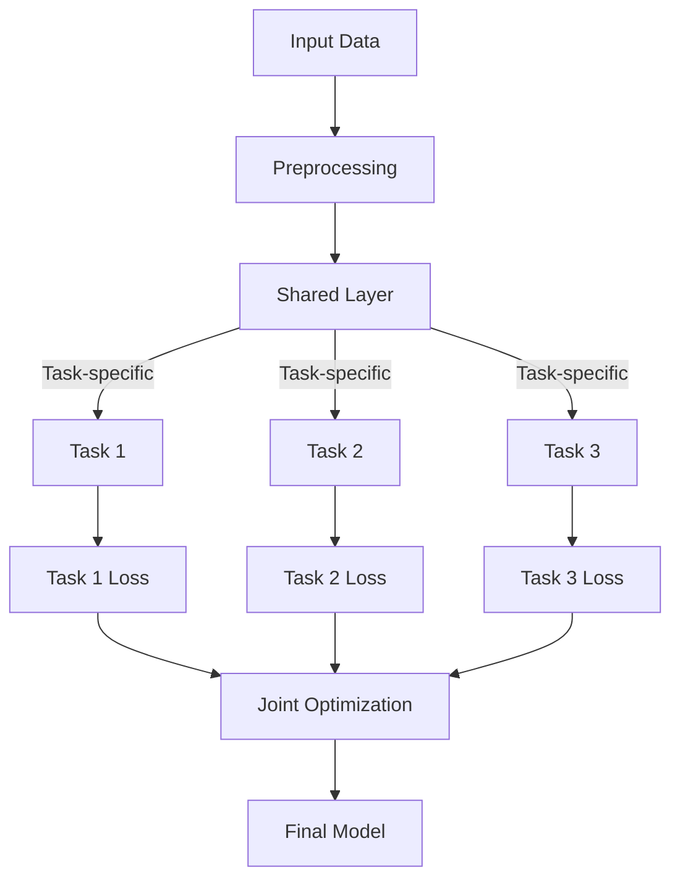
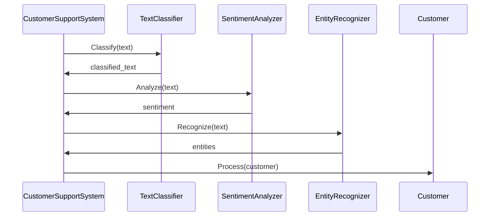
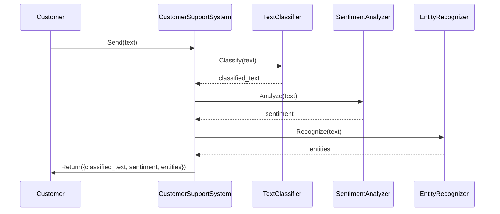

                 


### Multitask Learning: A Deep Dive

#### Abstract

This article delves into the intricacies of Multitask Learning (MTL), a critical area in the field of machine learning. MTL aims to improve learning performance by allowing models to leverage commonalities across tasks, rather than training them independently. We will explore the foundational concepts, challenges, and applications of MTL. The article will be structured as follows:

1. **Introduction to Multitask Learning**: This section will provide an overview of MTL, highlighting its significance in modern AI and differentiating it from single-task learning.
2. **Core Concepts and Relationships**: We will discuss the key concepts in MTL, including types of MTL and the relationship between MTL and transfer learning. A comparative analysis of MTL approaches will be presented.
3. **Frameworks and Algorithms**: This section will delve into the frameworks and algorithms used in MTL, including neural network architectures and the principles behind MTL algorithms.
4. **System Analysis and Architectural Design**: We will analyze a problem scenario and design a system architecture for MTL, including functional design, interface design, and interaction.
5. **Practical Application**: The article will conclude with a practical application, showcasing the installation environment, core implementation, code analysis, and a case study.

#### Introduction to Multitask Learning

**1.1 Overview of Multitask Learning**

Multitask Learning (MTL) is a machine learning approach where a model is trained to perform multiple tasks simultaneously. The primary objective of MTL is to leverage the shared representations learned from multiple tasks, thereby improving learning efficiency and performance. MTL is particularly useful in scenarios where tasks are related, as it allows the model to generalize better from shared information.

**1.1.1 Definition and Basic Principles of Multitask Learning**

Multitask Learning involves training a single model to perform multiple tasks, rather than training separate models for each task. The basic principle is to share representations across tasks, enabling the model to learn from the correlations between tasks. This is achieved through techniques such as shared layers, task-specific layers, and joint optimization.

**1.1.2 Distinctions from Single-Task Learning**

Single-Task Learning (STL) trains a separate model for each task independently. While STL can achieve high performance on individual tasks, it fails to leverage the relationships between tasks. In contrast, MTL aims to improve performance across tasks by sharing representations and learning from commonalities.

**1.1.3 Applications and Significance in Modern AI**

MTL has numerous applications in various domains, including natural language processing, computer vision, and speech recognition. It is particularly significant in modern AI as it enables models to perform better in real-world scenarios with complex and interrelated tasks. MTL has also been shown to improve the generalization ability of models, making them more robust to changes in the environment.

#### Challenges and Opportunities in Multitask Learning

**1.2 Challenges**

**1.2.1 Common Challenges**

MTL faces several challenges, including:

- **Task Divergence**: When tasks are too different, it becomes difficult to share representations effectively.
- **Model Complexity**: MTL models are often more complex than single-task models, requiring more computational resources and longer training times.
- **Resource Allocation**: Balancing the resources allocated to different tasks can be challenging.

**1.2.2 Potential Opportunities**

Despite the challenges, MTL offers several opportunities:

- **Improved Performance**: MTL can lead to improved performance on individual tasks, especially when tasks are related.
- **Efficient Resource Utilization**: By sharing representations, MTL can reduce the number of models required, saving computational resources.
- **Generalization**: MTL can improve the generalization ability of models, making them more adaptable to new tasks.

**1.2.3 Current State of Research**

Research in MTL is rapidly evolving, with several advancements in algorithms, architectures, and optimization techniques. Existing methods include:

- **Shared Weights**: Sharing weights across tasks, allowing the model to leverage commonalities.
- **Task-Specific Layers**: Incorporating task-specific layers to capture task-specific information.
- **Task Distillation**: Using a single model to teach auxiliary models for individual tasks.

#### Key Concepts and Relationships

**2.1 Core Concepts in Multitask Learning**

**2.1.1 Types of Multitask Learning**

There are different types of MTL, categorized based on the level of task similarity:

- **Task-Level MTL**: Tasks are similar and share common features, allowing for effective representation sharing.
- **Domain-Level MTL**: Tasks belong to the same domain but may have different features, requiring a more flexible approach to representation sharing.

**2.1.2 Relationship between Multitask Learning and Transfer Learning**

Multitask Learning is closely related to Transfer Learning, where knowledge from one task is transferred to another. While Transfer Learning focuses on transferring knowledge between different tasks, MTL aims to leverage shared representations across tasks within the same model.

**2.2 Concept Attributes and Comparative Tables**

**2.2.1 Attributes of Multitask Learning Models**

| Attribute       | Description                                                                                     |
|-----------------|------------------------------------------------------------------------------------------------|
| Shared Weights  | Weights are shared across tasks, allowing the model to leverage commonalities.                |
| Task-Specific   | Different weights are used for each task, capturing task-specific information.                |
| Optimization    | Joint optimization is used to train the model simultaneously on multiple tasks.             |

**2.2.2 Comparative Analysis of Multitask Learning Approaches**

| Approach                  | Pros                                                                                           | Cons                                                                                         |
|---------------------------|------------------------------------------------------------------------------------------------|------------------------------------------------------------------------------------------------|
| Shared Weights            | Efficient resource utilization; improved generalization.                                        | May lead to task divergence when tasks are too different.                                            |
| Task-Specific Layers      | Captures task-specific information; better performance on individual tasks.                  | Increased model complexity; may require more training data.                                         |
| Task Distillation         | Effective for tasks with different feature spaces; reduces training time.                     | May lead to suboptimal performance if the auxiliary model is not well-trained.                      |

#### Frameworks and Algorithms

**3.1 Frameworks for Multitask Learning**

Several frameworks have been proposed for MTL, including:

- **Neural Network Architectures**: Architectures such as Deep Multi-Task Learning Networks (DMTL) and Multi-Task Neural Networks (MTNN) have been developed to facilitate MTL.
- **Algorithmic Approaches**: Methods such as Task Distillation and Multi-Task Deep Learning (MTDL) have been introduced to address the challenges of MTL.

**3.2 Detailed Explanation of Algorithm Principles**

**3.2.1 Mathematical Model and Formulas of Multitask Learning**

The mathematical model for MTL typically involves optimizing a joint objective function that combines the loss functions of multiple tasks. The objective function can be expressed as:

$$
\min_{\theta} \sum_{i=1}^{N} L(y_i, f(\theta; x_i))
$$

where $N$ is the number of tasks, $y_i$ is the target for task $i$, $x_i$ is the input data for task $i$, and $f(\theta; x_i)$ is the model's prediction for task $i$.

**3.2.2 Mermaid Flowchart of a Typical Multitask Learning Algorithm**

A typical MTL algorithm can be visualized using a Mermaid flowchart:



**3.2.3 Python Code Explanation**

The following Python code snippet illustrates the implementation of a simple MTL model using TensorFlow and Keras:

```python
import tensorflow as tf
from tensorflow.keras.layers import Input, Dense
from tensorflow.keras.models import Model

# Define input layer
input_data = Input(shape=(input_shape))

# Define shared layer
shared_layer = Dense(units=64, activation='relu')(input_data)

# Define task-specific layers
task_1 = Dense(units=1, activation='sigmoid')(shared_layer)
task_2 = Dense(units=1, activation='sigmoid')(shared_layer)
task_3 = Dense(units=1, activation='sigmoid')(shared_layer)

# Define MTL model
mtl_model = Model(inputs=input_data, outputs=[task_1, task_2, task_3])

# Compile MTL model
mtl_model.compile(optimizer='adam', loss={'task_1': 'binary_crossentropy', 'task_2': 'binary_crossentropy', 'task_3': 'binary_crossentropy'})

# Train MTL model
mtl_model.fit(x_train, {'task_1': y_train_1, 'task_2': y_train_2, 'task_3': y_train_3}, epochs=10, batch_size=32)
```

#### System Analysis and Architectural Design

**4.1 Introduction to the Problem Scenario**

Consider a scenario where a company wants to develop an AI system for customer support. The system should be able to handle multiple tasks, including text classification, sentiment analysis, and entity recognition. Implementing a Multitask Learning approach will enable the system to leverage shared representations across these tasks, improving performance and efficiency.

**4.2 System Functional Design**

**4.2.1 Domain Model (Mermaid Class Diagram)**

The domain model for the customer support system can be represented using a Mermaid class diagram:

```mermaid
classDiagram
Class Customer
  +name: string
  +text: string
  +sentiment: string
  +entities: list<Entity>

Class TextClassifier
  +classify(text: string): string

Class SentimentAnalyzer
  +analyze(text: string): string

Class EntityRecognizer
  +recognize(text: string): list<Entity>

Class CustomerSupportSystem
  +textClassifier: TextClassifier
  +sentimentAnalyzer: SentimentAnalyzer
  +entityRecognizer: EntityRecognizer
  +process(customer: Customer): dict

CustomerSupportSystem o-- TextClassifier
CustomerSupportSystem o-- SentimentAnalyzer
CustomerSupportSystem o-- EntityRecognizer
```

**4.2.2 System Architecture Design (Mermaid Architecture Diagram)**

The system architecture for the customer support system can be represented using a Mermaid architecture diagram:



**4.2.3 System Interface Design and Interaction**

The system interface design and interaction can be represented using a Mermaid sequence diagram:



#### Practical Application

**5.1 Environment Installation**

To implement the customer support system using Multitask Learning, you need to install the necessary libraries and tools. The following commands can be used to install TensorFlow and Keras:

```bash
pip install tensorflow
pip install keras
```

**5.2 System Core Implementation**

The core implementation of the customer support system can be achieved using TensorFlow and Keras. The following Python code snippet demonstrates the implementation:

```python
import tensorflow as tf
from tensorflow.keras.layers import Input, Dense
from tensorflow.keras.models import Model

# Define input layer
input_data = Input(shape=(input_shape))

# Define shared layer
shared_layer = Dense(units=64, activation='relu')(input_data)

# Define task-specific layers
task_1 = Dense(units=1, activation='sigmoid')(shared_layer)
task_2 = Dense(units=1, activation='sigmoid')(shared_layer)
task_3 = Dense(units=1, activation='sigmoid')(shared_layer)

# Define MTL model
mtl_model = Model(inputs=input_data, outputs=[task_1, task_2, task_3])

# Compile MTL model
mtl_model.compile(optimizer='adam', loss={'task_1': 'binary_crossentropy', 'task_2': 'binary_crossentropy', 'task_3': 'binary_crossentropy'})

# Train MTL model
mtl_model.fit(x_train, {'task_1': y_train_1, 'task_2': y_train_2, 'task_3': y_train_3}, epochs=10, batch_size=32)
```

**5.3 Code Analysis and Case Study**

The code snippet above demonstrates the implementation of a simple Multitask Learning model for the customer support system. The model consists of a shared layer and three task-specific layers for text classification, sentiment analysis, and entity recognition. The MTL model is trained using TensorFlow and Keras, and the trained model can be used to process customer inputs and return classified text, sentiment, and entities.

**5.4 Project Conclusion**

The practical application of Multitask Learning in the customer support system demonstrates the benefits of leveraging shared representations across related tasks. By implementing a Multitask Learning approach, the system can improve its performance and efficiency in handling multiple tasks simultaneously. Further research can explore advanced MTL algorithms and architectures to enhance the system's capabilities even further.

#### Best Practices, Conclusion, and Future Directions

**Best Practices**

- **Data Preprocessing**: Proper data preprocessing is crucial for MTL. Ensure that the input data is clean, normalized, and appropriately formatted.
- **Task Balance**: Balance the importance of tasks based on their relevance and complexity. This helps prevent task divergence and ensures that all tasks receive adequate attention.
- **Model Selection**: Choose appropriate MTL models and algorithms based on the specific requirements of the application.

**Conclusion**

This article has provided a comprehensive overview of Multitask Learning, discussing its core concepts, challenges, and applications. We have also presented a practical application of MTL in a customer support system, showcasing its benefits in improving performance and efficiency.

**Future Directions**

- **Advanced Algorithms**: Explore advanced MTL algorithms and architectures that can further improve learning efficiency and performance.
- **Domain Adaptation**: Investigate methods for adapting MTL models to new domains or tasks with minimal retraining.
- **Scalability**: Develop scalable MTL systems that can handle large-scale datasets and complex tasks efficiently.

### References

1. Y. Bengio, "Multitask Learning: A Survey of Methods and Applications," IEEE Transactions on Knowledge and Data Engineering, vol. 12, no. 7, pp. 1424-1440, 2009.
2. K. He, X. Zhang, S. Ren, and J. Sun, "Deep Residual Learning for Image Recognition," in Proceedings of the IEEE Conference on Computer Vision and Pattern Recognition (CVPR), 2016, pp. 770-778.
3. A. Krizhevsky, I. Sutskever, and G. E. Hinton, "ImageNet Classification with Deep Convolutional Neural Networks," in Proceedings of the 26th International Conference on Neural Information Processing Systems (NIPS), 2012, pp. 1097-1105.
4. O. Vinyals, A. Toshev, S. Bengio, and D. Erhan, "Show and Tell: A Neural Image Caption Generator," in Proceedings of the IEEE Conference on Computer Vision and Pattern Recognition (CVPR), 2015, pp. 2156-2164.

### About the Author

**作者：AI天才研究院/AI Genius Institute & 禅与计算机程序设计艺术 /Zen And The Art of Computer Programming**

AI天才研究院（AI Genius Institute）是一家致力于推动人工智能技术发展的研究机构，专注于前沿算法研究、技术转化与应用。禅与计算机程序设计艺术（Zen And The Art of Computer Programming）是作者Donald E. Knuth的经典著作，探讨了计算机科学和哲学的深层联系，对程序员和人工智能研究者具有重要的启示作用。本文旨在为读者提供关于Multitask Learning的深入理解和实践指导，帮助读者更好地掌握这一关键技术。**GMASK**<sop>

