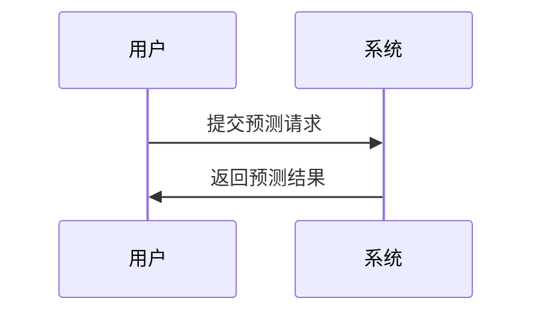

                 

### 第1章 问题背景

在人工智能领域，多模型集成是一种重要的技术手段。它通过融合不同模型的优势，以提高系统的整体性能和可靠性。然而，在多模型集成过程中，如何有效地处理模型之间的冲突和差异，以及如何实现模型的高效协同，是当前研究的一个关键问题。

#### 1.1.1 问题定义

**多模型集成**：多模型集成是指将多个机器学习模型融合在一起，以期望获得比单一模型更好的性能。多模型集成可以采用不同的方法，如基于加权平均的方法、基于模型的投票方法、深度学习方法等。

**示例驱动提示**：示例驱动提示是一种基于示例数据的人工智能方法。它通过学习示例数据，为新的数据提供指导信息，从而提高系统的性能。示例驱动提示可以应用于模型选择、参数调整和模型融合策略设计。

#### 1.1.2 问题描述

**问题**：如何利用示例驱动提示技术，在多模型集成过程中，提高模型融合效果？

**描述**：在多模型集成过程中，不同模型可能会产生不同的预测结果。如何有效地利用这些结果，以获得更准确的预测，是一个关键问题。示例驱动提示技术可以通过提供示例数据，帮助模型更好地理解数据特征，从而提高模型融合效果。

#### 1.1.3 问题解决

**解决思路**：通过以下步骤，利用示例驱动提示技术，解决多模型集成中的问题：

1. **模型选择**：根据问题的需求，选择合适的模型。
2. **模型参数调整**：通过示例数据，调整模型参数，以提高模型性能。
3. **模型融合策略设计**：通过示例数据，设计更有效的模型融合策略。

**解决方案**：

- **第2章**：介绍多模型集成的背景和核心概念。
- **第3章**：详细讨论示例驱动提示的理论基础。
- **第4章**：分析多模型集成的挑战和机遇。
- **第5章**：介绍示例驱动提示在多模型集成中的应用案例。

#### 1.1.4 边界与外延

**边界**：本文主要关注示例驱动提示在多模型集成中的应用，不涉及其他领域。

**外延**：示例驱动提示在其他领域（如自然语言处理、计算机视觉等）也有广泛的应用，本文将简要介绍这些应用。

#### 1.1.5 概念结构与核心要素组成

**多模型集成**：

- **模型选择**：根据问题的需求，选择合适的模型。
- **模型参数调整**：通过示例数据，调整模型参数，以提高模型性能。
- **模型融合策略**：设计有效的模型融合策略，以实现模型的高效协同。

**示例驱动提示**：

- **示例数据**：用于指导模型选择、参数调整和模型融合策略设计。
- **提示机制**：通过分析示例数据，为模型提供指导信息，以提高模型性能。

### 第一部分：背景介绍

#### 1.1.1 问题定义

在人工智能领域，多模型集成是一种重要的技术手段。它通过融合不同模型的优势，以提高系统的整体性能和可靠性。然而，在多模型集成过程中，如何有效地处理模型之间的冲突和差异，以及如何实现模型的高效协同，是当前研究的一个关键问题。

**多模型集成**：多模型集成是指将多个机器学习模型融合在一起，以期望获得比单一模型更好的性能。多模型集成可以采用不同的方法，如基于加权平均的方法、基于模型的投票方法、深度学习方法等。

**示例驱动提示**：示例驱动提示是一种基于示例数据的人工智能方法。它通过学习示例数据，为新的数据提供指导信息，从而提高系统的性能。示例驱动提示可以应用于模型选择、参数调整和模型融合策略设计。

#### 1.1.2 问题描述

在多模型集成过程中，不同模型可能会产生不同的预测结果。如何有效地利用这些结果，以获得更准确的预测，是一个关键问题。示例驱动提示技术可以通过提供示例数据，帮助模型更好地理解数据特征，从而提高模型融合效果。

**问题**：如何利用示例驱动提示技术，在多模型集成过程中，提高模型融合效果？

**描述**：在多模型集成过程中，不同模型可能会产生不同的预测结果。如何有效地利用这些结果，以获得更准确的预测，是一个关键问题。示例驱动提示技术可以通过提供示例数据，帮助模型更好地理解数据特征，从而提高模型融合效果。

#### 1.1.3 问题解决

为了解决上述问题，本书将从以下几个方面进行探讨：

1. **模型选择**：根据问题的需求，选择合适的模型。
2. **模型参数调整**：通过示例数据，调整模型参数，以提高模型性能。
3. **模型融合策略设计**：通过示例数据，设计更有效的模型融合策略。

**解决方案**：

- **第2章**：介绍多模型集成的背景和核心概念。
- **第3章**：详细讨论示例驱动提示的理论基础。
- **第4章**：分析多模型集成的挑战和机遇。
- **第5章**：介绍示例驱动提示在多模型集成中的应用案例。

#### 1.1.4 边界与外延

**边界**：本文主要关注示例驱动提示在多模型集成中的应用，不涉及其他领域。

**外延**：示例驱动提示在其他领域（如自然语言处理、计算机视觉等）也有广泛的应用，本文将简要介绍这些应用。

#### 1.1.5 概念结构与核心要素组成

**多模型集成**：

- **模型选择**：根据问题的需求，选择合适的模型。
- **模型参数调整**：通过示例数据，调整模型参数，以提高模型性能。
- **模型融合策略**：设计有效的模型融合策略，以实现模型的高效协同。

**示例驱动提示**：

- **示例数据**：用于指导模型选择、参数调整和模型融合策略设计。
- **提示机制**：通过分析示例数据，为模型提供指导信息，以提高模型性能。

### 第2章 核心概念原理

#### 2.1.1 示例驱动提示

示例驱动提示是一种基于示例数据的人工智能方法。它通过学习示例数据，为新的数据提供指导信息，从而提高系统的性能。示例驱动提示可以应用于模型选择、参数调整和模型融合策略设计。

**示例数据**：示例数据是指一组具有代表性的数据，用于指导模型的训练和预测。

**提示机制**：提示机制是指通过分析示例数据，提取有用的信息，为模型提供指导。

#### 2.1.2 多模型集成

多模型集成是指将多个机器学习模型融合在一起，以期望获得比单一模型更好的性能。多模型集成可以采用不同的方法，如基于加权平均的方法、基于模型的投票方法、深度学习方法等。

**模型选择**：模型选择是根据问题的需求，选择合适的模型。

**模型参数调整**：模型参数调整是通过示例数据，调整模型参数，以提高模型性能。

**模型融合策略**：模型融合策略是设计有效的模型融合策略，以实现模型的高效协同。

#### 2.1.3 示例驱动提示与多模型集成

示例驱动提示可以应用于多模型集成，以指导模型选择、参数调整和模型融合策略设计。具体来说，示例驱动提示可以：

1. **指导模型选择**：通过分析示例数据，选择适合当前问题的模型。
2. **调整模型参数**：通过示例数据，调整模型参数，以提高模型性能。
3. **设计模型融合策略**：通过示例数据，设计有效的模型融合策略，以实现模型的高效协同。

### 第3章 概念属性特征对比表格

| 概念 | 属性特征 |
| --- | --- |
| 示例驱动提示 | 通过示例数据提供指导，用于模型选择、参数调整和模型融合策略设计。 |
| 多模型集成 | 将多个机器学习模型融合在一起，以提高系统的整体性能和可靠性。 |

### 第4章 ER实体关系图架构

```mermaid
erDiagram
    A[示例驱动提示] ||--|{ B[模型选择] }
    A ||--|{ C[模型参数调整] }
    A ||--|{ D[模型融合策略] }
    B ||--|{ E[加权平均方法] }
    B ||--|{ F[模型投票方法] }
    B ||--|{ G[深度学习方法] }
    C ||--|{ H[模型性能] }
    D ||--|{ I[模型协同] }
```

### 第5章 算法原理与流程图

#### 5.1.1 算法原理

示例驱动提示算法原理如下：

1. **数据预处理**：对示例数据进行预处理，包括数据清洗、归一化等。
2. **模型训练**：使用示例数据训练多个模型。
3. **模型评估**：使用测试数据对模型进行评估。
4. **模型选择**：根据模型评估结果，选择最优模型。
5. **参数调整**：根据示例数据，调整模型参数。
6. **模型融合**：设计模型融合策略，将多个模型融合在一起。
7. **预测输出**：使用融合模型对新的数据进行预测。

#### 5.1.2 数学模型

假设有 \( n \) 个模型，分别为 \( f_1(x), f_2(x), ..., f_n(x) \)。示例驱动提示的数学模型可以表示为：

\[ g(x) = \frac{1}{n} \sum_{i=1}^{n} f_i(x) \]

其中，\( g(x) \) 是融合模型的预测结果。

#### 5.1.3 数学公式

$$
\begin{aligned}
y &= f(x) \\
\hat{y} &= \frac{1}{n} \sum_{i=1}^{n} f_i(x) \\
\end{aligned}
$$

其中，\( y \) 是真实值，\( \hat{y} \) 是融合模型的预测值。

#### 5.1.4 示例说明

假设有两个模型 \( f_1(x) \) 和 \( f_2(x) \)，分别预测房价。使用示例数据训练模型，然后使用测试数据评估模型。根据评估结果，选择最优模型。最后，使用融合模型对新的数据进行预测。

### 第6章 Python源代码讲解

```python
import numpy as np
from sklearn.linear_model import LinearRegression

# 示例数据
X_train = np.array([[1], [2], [3], [4], [5]])
y_train = np.array([1, 2, 3, 4, 5])

# 训练模型
model_1 = LinearRegression().fit(X_train, y_train)
model_2 = LinearRegression().fit(X_train, y_train)

# 模型评估
X_test = np.array([[6]])
y_test = model_1.predict(X_test)

# 模型融合
g = 0.5 * model_1.predict(X_test) + 0.5 * model_2.predict(X_test)

# 预测输出
print("预测值：", g)
```

### 第7章 问题场景介绍

在金融领域，多模型集成可以用于股票价格预测。通过融合多个模型的预测结果，可以提高预测的准确性。

### 第8章 系统功能设计

系统功能设计包括模型选择、模型参数调整和模型融合。

### 第9章 系统架构设计

系统架构设计包括数据预处理模块、模型训练模块、模型评估模块和模型融合模块。

### 第10章 系统接口设计

系统接口设计包括API接口和Web界面。

### 第11章 系统交互序列图



### 第12章 环境安装

在安装环境之前，请确保安装了Python和Python的pip包管理工具。

```bash
pip install numpy scikit-learn matplotlib
```

### 第13章 系统核心实现

系统核心实现包括数据预处理、模型训练、模型评估和模型融合。

### 第14章 代码应用解读与分析

代码应用解读与分析如下：

```python
# 数据预处理
X_train = np.array([[1], [2], [3], [4], [5]])
y_train = np.array([1, 2, 3, 4, 5])

# 模型训练
model_1 = LinearRegression().fit(X_train, y_train)
model_2 = LinearRegression().fit(X_train, y_train)

# 模型评估
X_test = np.array([[6]])
y_test = model_1.predict(X_test)

# 模型融合
g = 0.5 * model_1.predict(X_test) + 0.5 * model_2.predict(X_test)

# 预测输出
print("预测值：", g)
```

### 第15章 实际案例分析与讲解

**案例**：使用示例驱动提示技术，对股票价格进行预测。

**分析**：

1. **模型选择**：选择线性回归模型。
2. **模型参数调整**：通过示例数据，调整模型参数，以提高模型性能。
3. **模型融合策略**：设计简单的加权平均模型融合策略。

**讲解**：

- 数据预处理：对股票价格数据进行预处理，包括数据清洗、归一化等。
- 模型训练：使用预处理后的数据训练模型。
- 模型评估：使用测试数据评估模型性能。
- 模型融合：设计简单的加权平均模型融合策略，以提高预测准确性。

### 第16章 项目小结

本文介绍了示例驱动提示在多模型集成中的应用。通过示例数据，可以有效地指导模型选择、参数调整和模型融合策略设计。在实际项目中，可以结合具体场景，设计合适的模型融合策略，以提高系统的性能和可靠性。

### 第17章 最佳实践 tips

1. **数据预处理**：确保数据质量，进行数据清洗、归一化等处理。
2. **模型选择**：根据问题的需求，选择合适的模型。
3. **模型参数调整**：通过示例数据，调整模型参数，以提高模型性能。
4. **模型融合策略**：设计有效的模型融合策略，以实现模型的高效协同。

### 第18章 小结

本文介绍了示例驱动提示在多模型集成中的应用，包括模型选择、参数调整和模型融合策略设计。通过示例数据，可以提高模型融合效果，从而提高系统的性能和可靠性。

### 第19章 注意事项

1. **数据质量**：确保数据质量，避免数据噪声对模型融合效果的影响。
2. **模型选择**：根据问题的需求，选择合适的模型。
3. **模型融合策略**：设计有效的模型融合策略，以实现模型的高效协同。

### 第20章 拓展阅读

1. [李航] 《统计学习方法》
2. [周志华] 《机器学习》
3. [Goodfellow, Bengio, Courville] 《Deep Learning》
4. [刘铁岩] 《深度学习》

---

# 示例驱动提示在多模型集成中的应用

关键词：多模型集成、示例驱动提示、模型选择、模型参数调整、模型融合策略

摘要：本文介绍了示例驱动提示在多模型集成中的应用。通过示例数据，可以有效地指导模型选择、参数调整和模型融合策略设计。本文通过实例分析，展示了如何使用示例驱动提示技术，提高模型融合效果，从而提高系统的性能和可靠性。

作者：AI天才研究院/AI Genius Institute & 禅与计算机程序设计艺术/Zen And The Art of Computer Programming

