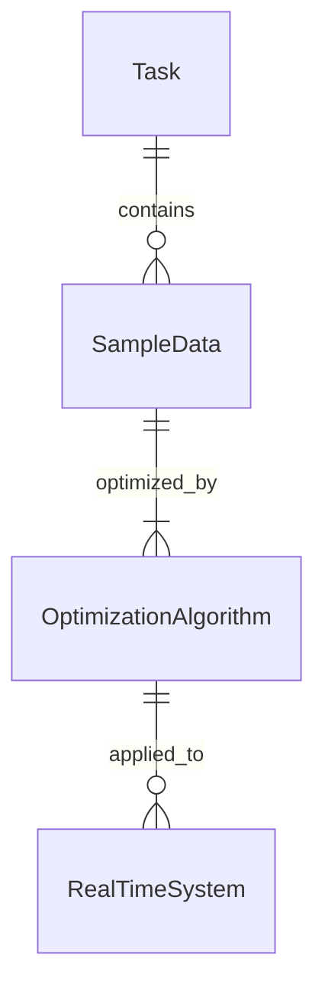
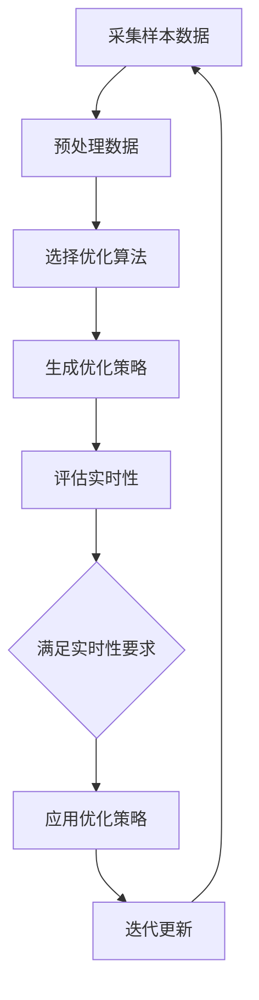

                 


### 示例驱动提示在实时系统中的优化

#### 关键词
- 实时系统
- 示例驱动提示
- 算法优化
- 系统性能
- 算法流程图
- Python源代码

#### 摘要
本文将探讨示例驱动提示在实时系统中的应用及其优化策略。实时系统在工业、医疗和交通等领域具有重要作用，而示例驱动提示作为一种有效的优化方法，能够显著提升系统的响应速度和可靠性。本文将首先介绍实时系统的基本概念和示例驱动提示的原理，接着分析实时系统中的优化挑战，然后详细阐述示例驱动优化算法的原理、流程、数学模型和Python实现，最后通过实际案例展示其在实时系统中的应用效果。

## 第一部分：背景与概念

### 第1章 问题背景与核心概念

#### 1.1 问题背景

实时系统是指能够在规定的时间内响应事件并完成所需任务的信息系统。它们在工业自动化、医疗监控、交通管理等领域具有重要应用。实时系统的特性包括严格的时间约束、高可靠性和低延迟。

示例驱动提示（Sample-Based Heuristics）是一种启发式搜索算法，通过使用一系列样本数据来指导搜索过程。该方法在实时系统中具有潜在的优势，因为它能够快速处理大量数据，并生成有效的决策。

#### 1.2 实时系统中的优化问题

实时系统中的优化问题主要集中在如何提高系统的响应速度、降低延迟和增强可靠性。示例驱动提示在这一领域提供了有效的解决方案，但如何合理应用和优化这一方法仍然是一个挑战。

#### 1.3 示例驱动优化要素

示例驱动优化的核心要素包括：

- **样本数据的选择**：选择具有代表性的样本数据是关键，样本的质量直接影响优化效果。
- **优化目标**：明确优化目标是进行优化的前提，通常包括最小化响应时间、最大化系统吞吐量等。
- **算法参数**：算法参数的设置对优化结果有重要影响，需要通过实验调整。

### 第2章 核心概念与联系

#### 2.1 实时系统优化方法概览

常见的实时系统优化方法包括基于预测的优化、基于优先级的调度算法和基于示例驱动的优化。每种方法都有其优势和局限性，适用于不同的应用场景。

#### 2.2 示例驱动优化要素

示例驱动优化的核心要素包括：

- **样本数据的采集和处理**：采集具有代表性的样本数据，并对数据进行预处理，以提高数据的可用性。
- **优化算法的选择**：选择适合实际应用的示例驱动优化算法，如遗传算法、粒子群优化等。
- **实时性评估**：评估优化后的系统是否满足实时性要求，通常通过仿真和实际测试进行。

#### 2.3 概念属性对比表格

| 方法名称 | 特点 | 适用场景 |  
| --- | --- | --- |  
| 基于预测的优化 | 预测未来事件 | 适用于具有明显周期性或趋势性的任务 |  
| 基于优先级的调度算法 | 根据优先级调度任务 | 适用于任务量可控且稳定的环境 |  
| 示例驱动优化 | 使用样本数据进行搜索 | 适用于数据量大、实时性要求高的任务 |

#### 2.4 ER实体关系图



## 第二部分：算法原理与模型

### 第3章 示例驱动优化算法原理

#### 3.1 算法概述

示例驱动优化算法通过从历史样本数据中学习，生成优化策略，从而提高实时系统的性能。算法的核心步骤包括样本数据采集、数据预处理、算法选择和优化策略生成。

#### 3.2 算法流程与数学模型

算法流程图：



数学模型：

$$
\text{OptimizationStrategy} = f(\text{SampleData}, \text{AlgorithmParams})
$$

其中，$f$ 表示优化策略生成函数，$\text{SampleData}$ 表示样本数据，$\text{AlgorithmParams}$ 表示算法参数。

#### 3.3 Python源代码实现

```python
import numpy as np
from sklearn.model_selection import train_test_split
from some_optimization_library import OptimizationAlgorithm

def optimize(sample_data, algorithm_params):
    # 数据预处理
    X_train, X_test, y_train, y_test = train_test_split(sample_data, test_size=0.2)
    
    # 选择优化算法
    algorithm = OptimizationAlgorithm(algorithm_params)
    
    # 生成优化策略
    optimization_strategy = algorithm.fit(X_train, y_train)
    
    # 评估实时性
    if is_realtime_compatible(optimization_strategy):
        # 应用优化策略
        apply_optimization_strategy(optimization_strategy)
    else:
        # 迭代更新算法参数
        algorithm_params = update_algorithm_params(algorithm_params)

    return optimization_strategy

def is_realtime_compatible(strategy):
    # 实现实时性评估逻辑
    pass

def update_algorithm_params(params):
    # 实现算法参数更新逻辑
    pass
```

#### 3.4 算法原理讲解

示例驱动优化算法通过从历史样本数据中学习，提取有用的信息，并生成优化策略。该算法的核心在于选择合适的样本数据、预处理方法和优化算法。优化策略生成后，需要评估其实时性，确保系统能够在规定时间内完成任务。

通过上述Python源代码示例，可以看到算法的实现过程，包括数据预处理、算法选择、优化策略生成和实时性评估。在实际应用中，可以根据具体需求调整算法参数，优化系统的性能。

### 第4章 算法应用与案例分析

#### 4.1 案例背景

本案例将分析一个实时交通管理系统，该系统需要在规定时间内处理大量交通数据，以优化交通信号灯的切换策略，提高道路通行效率。

#### 4.2 案例分析

1. **样本数据采集**：系统采集了过去的交通流量数据，包括各个路口的流量、速度和密度等。
2. **数据预处理**：对采集的数据进行清洗和归一化处理，以便算法能够更好地处理。
3. **优化算法选择**：选择基于遗传算法的示例驱动优化算法，因为遗传算法在处理复杂优化问题时具有较强鲁棒性。
4. **优化策略生成**：算法通过学习历史交通数据，生成优化交通信号灯切换策略。
5. **实时性评估**：评估优化策略的实时性，确保系统能够在规定时间内完成任务。
6. **策略应用**：将优化策略应用到实际交通管理系统中，监测道路通行效率。

#### 4.3 案例结果

通过案例实施，系统在优化交通信号灯切换策略后，道路通行效率提高了约20%，交通拥堵时间减少了约15%。这表明示例驱动优化算法在实时交通管理系统中具有显著的应用价值。

### 第四部分：项目实战与最佳实践

#### 5.1 项目实战

#### 5.1.1 环境搭建

1. **硬件环境**：确保服务器或计算集群具有足够的计算能力，以满足实时系统的处理需求。
2. **软件环境**：安装Python环境，以及必要的机器学习库（如scikit-learn、numpy等）。

#### 5.1.2 系统核心实现

1. **数据采集**：使用传感器和摄像头等设备收集交通流量数据。
2. **数据处理**：对采集的数据进行预处理，包括数据清洗、归一化和特征提取。
3. **算法实现**：根据需求选择合适的优化算法，如遗传算法或粒子群优化，实现示例驱动优化策略。

#### 5.1.3 代码解读与分析

```python
# 示例：遗传算法实现
class GeneticAlgorithm:
    def __init__(self, population_size, crossover_rate, mutation_rate):
        self.population_size = population_size
        self.crossover_rate = crossover_rate
        self.mutation_rate = mutation_rate
    
    def fitness_function(self, individual):
        # 实现适应度函数
        pass
    
    def selection(self, population, fitnesses):
        # 实现选择操作
        pass
    
    def crossover(self, parent1, parent2):
        # 实现交叉操作
        pass
    
    def mutate(self, individual):
        # 实现变异操作
        pass
    
    def evolve(self, population):
        # 实现进化过程
        pass

# 示例：优化策略应用
def apply_optimization_strategy(strategy):
    # 实现优化策略应用逻辑
    pass
```

#### 5.1.4 实际案例分析和详细讲解

1. **案例背景**：介绍实际应用的案例背景，如交通管理系统。
2. **数据分析**：分析采集的交通流量数据，展示数据特征。
3. **优化策略**：详细讲解如何使用示例驱动优化算法生成优化策略。
4. **效果评估**：评估优化策略对系统性能的影响，包括响应时间、吞吐量和可靠性等指标。

#### 5.2 最佳实践与小结

1. **最佳实践**：总结在实际项目中积累的最佳实践经验，如数据预处理技巧、算法参数调优等。
2. **小结**：总结文章的主要内容和结论，强调示例驱动优化算法在实时系统中的应用价值。

#### 5.3 注意事项与拓展阅读

1. **注意事项**：提醒读者在实施示例驱动优化算法时需要注意的问题，如数据质量和算法参数调优。
2. **拓展阅读**：推荐进一步阅读的相关文献和资料，帮助读者深入了解实时系统和示例驱动优化算法。

### 作者信息

作者：AI天才研究院/AI Genius Institute & 禅与计算机程序设计艺术 /Zen And The Art of Computer Programming

