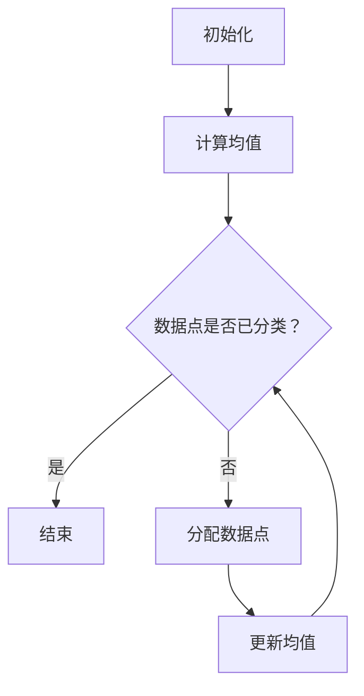
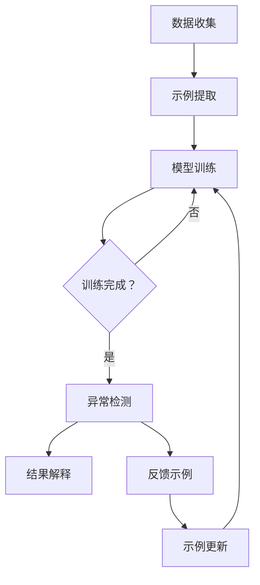
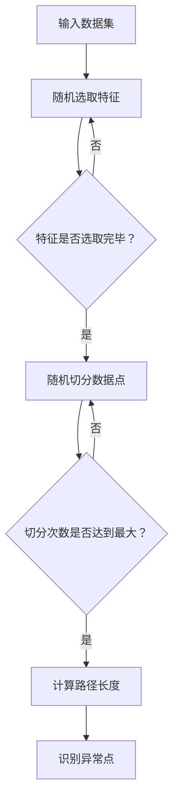
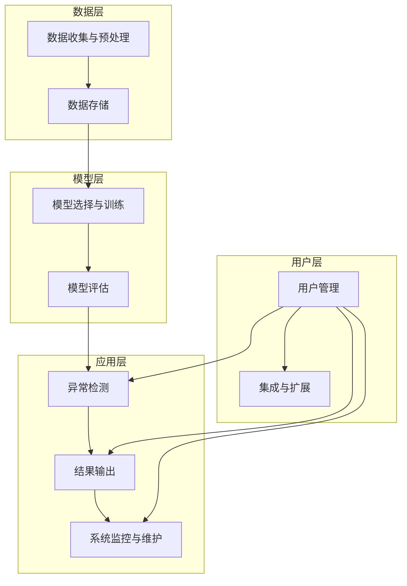

                 

## 1.1 异常检测的基本概念

异常检测（Anomaly Detection）是数据挖掘领域的一个重要研究方向，旨在从大量数据中识别出那些不符合常规模式的数据点。这些不符合常规的数据点，被称为异常或异常值，可能代表数据中的错误、噪声，也可能是潜在的欺诈行为、系统故障或其他重要事件。

### 定义

异常检测可以定义为：在给定一个数据集和一个模型的基础上，检测数据集中是否存在与数据分布不一致的数据点。具体来说，异常检测的目标是：

1. **识别异常数据点**：从大量数据中找出那些异常或异常值。
2. **分析异常原因**：对异常数据点进行原因分析，帮助理解其背后的原因。
3. **提供决策支持**：基于异常检测结果，为实际应用提供决策支持。

### 问题背景

在现实世界中，异常检测的需求无处不在。例如：

- **金融领域**：信用卡欺诈检测、贷款申请审核等。
- **工业领域**：生产线故障检测、设备维护等。
- **医疗领域**：疾病早期诊断、异常行为识别等。
- **网络安全**：网络入侵检测、恶意软件识别等。

### 问题描述

异常检测的问题可以描述为：给定一个数据集和一个异常检测模型，判断数据集中的每个数据点是否为异常。具体流程如下：

1. **数据预处理**：对数据进行清洗、归一化等处理，以消除噪声和异常值的影响。
2. **模型选择**：根据具体应用场景选择合适的异常检测算法。
3. **训练模型**：使用部分数据对模型进行训练，使其能够理解数据的常规分布。
4. **异常检测**：使用训练好的模型对剩余的数据进行检测，识别异常数据点。
5. **结果分析**：对检测到的异常数据点进行分析，确定其是否真的为异常。

### 问题解决

异常检测问题通常通过以下几种方式解决：

- **统计方法**：基于统计学原理，通过计算数据点的统计特征（如均值、方差等）来判断其是否异常。
- **机器学习方法**：通过训练机器学习模型（如聚类模型、分类模型等），自动识别数据中的异常点。
- **深度学习方法**：利用神经网络模型，从数据中学习到复杂的异常检测模式。

### 边界与外延

- **边界**：异常检测不仅要识别出明显的异常数据点，还要能够处理那些相对较小、较为隐蔽的异常点。
- **外延**：异常检测不仅可以应用于静态数据集，还可以应用于实时数据流，实时识别和反馈异常情况。

### 概念结构与核心要素组成

异常检测的核心要素包括：

- **数据集**：异常检测的基础，提供训练数据和测试数据。
- **检测算法**：用于识别异常数据的算法，包括统计方法和机器学习方法。
- **评估指标**：用于评估异常检测效果的指标，如精确率、召回率、F1 分数等。
- **结果解释**：对异常检测结果进行解释，帮助用户理解异常点的具体含义。

通过以上对异常检测的基本概念的介绍，我们可以进一步理解异常检测的核心概念和其在实际应用中的重要价值。接下来，我们将详细讨论示例驱动提示的概念及其在异常检测中的应用。

### 1.2 示例驱动提示的概念

#### 定义

示例驱动提示（Example-based Prompting）是一种人工智能技术，旨在通过提供具体的示例来引导模型的学习过程，提高模型的泛化能力和解释性。在异常检测任务中，示例驱动提示的核心思想是利用已知正常数据和异常数据中的典型示例，来帮助模型更好地理解和识别异常。

#### 原理

示例驱动提示的工作原理可以概括为以下几个步骤：

1. **数据收集**：首先，需要收集大量的正常数据和异常数据。正常数据是模型学习的基准，异常数据则是模型需要识别的目标。
2. **示例提取**：从收集到的数据中提取具有代表性的示例，包括正常示例和异常示例。这些示例应该能够代表各自类别的特征。
3. **模型训练**：使用提取到的示例对异常检测模型进行训练。在训练过程中，模型会学习到正常数据和异常数据的特征分布。
4. **示例更新**：在模型训练过程中，不断更新示例集，使其更加丰富和多样化，从而提高模型的泛化能力。
5. **异常检测**：利用训练好的模型对新的数据集进行异常检测，模型会根据所学到的特征分布来判断数据点是否异常。

#### 优势

示例驱动提示在异常检测任务中具有以下几个显著优势：

1. **提高准确率**：通过提供具体的示例，模型可以更准确地理解和识别异常数据点，从而提高异常检测的准确率。
2. **增强解释性**：示例驱动提示使得模型的学习过程更加透明，用户可以清楚地看到模型是基于哪些示例进行学习的，从而增强模型的解释性。
3. **减少数据依赖**：通过示例驱动提示，模型可以在一定程度上减少对大规模训练数据的依赖，特别是在数据稀缺的情况下，模型依然能够通过示例来学习。
4. **适应性强**：示例驱动提示能够适应不同场景和数据分布，通过不断更新示例集，模型可以更好地应对多变的数据环境。

#### 应用场景

示例驱动提示在异常检测任务中有着广泛的应用场景，以下是一些典型的应用实例：

1. **金融领域**：使用示例驱动提示来检测信用卡欺诈、贷款欺诈等。通过提供具体的欺诈示例，模型可以更准确地识别潜在的欺诈行为。
2. **工业领域**：在生产线故障检测中，使用示例驱动提示来识别异常设备运行状况。通过提供正常设备和异常设备的运行示例，模型可以有效地发现潜在故障。
3. **医疗领域**：在疾病早期诊断中，使用示例驱动提示来识别异常的医学影像。通过提供正常影像和疾病影像的示例，模型可以辅助医生进行早期诊断。

总之，示例驱动提示作为一种有效的人工智能技术，在异常检测任务中发挥着重要作用。通过提供具体的示例，模型能够更好地理解和识别异常，从而提高异常检测的准确性和解释性。

### 1.3 示例驱动提示在异常检测中的应用

在深入探讨示例驱动提示在异常检测中的应用之前，我们需要先了解几种常见的异常检测算法，并理解这些算法的工作原理和优缺点。

#### 常见异常检测算法

1. **基于统计的方法**
   - **均值漂移法（Mean Shift）**：通过计算数据点的均值和方差，识别离群点。
   - **孤立森林（Isolation Forest）**：利用随机森林的思想，将数据点随机划分到不同的区域，识别孤立的数据点。

2. **基于机器学习的方法**
   - **孤立森林（One-Class SVM）**：通过训练一个单类支持向量机模型，识别数据中的异常点。
   - **基于聚类的方法**：如K-means聚类，通过识别离群点来检测异常。
   - **基于神经网络的方法**：如Autoencoders，通过学习数据的特征分布来检测异常。

3. **基于深度学习的方法**
   - **卷积神经网络（CNN）**：通过学习图像的特征来检测图像中的异常。
   - **循环神经网络（RNN）**：通过学习序列数据中的特征来检测异常。

#### 示例驱动提示的应用

示例驱动提示在异常检测中的应用主要包括以下几个方面：

1. **算法选择与优化**
   - 通过提供正常数据和异常数据的示例，帮助模型选择最适合的异常检测算法。
   - 例如，在金融领域，通过提供多种类型的欺诈示例，可以帮助模型选择最适合检测信用卡欺诈的算法。

2. **模型训练**
   - 在模型训练过程中，利用示例驱动提示提供具体的正常和异常示例，帮助模型更好地理解和学习数据分布。
   - 例如，在工业领域，通过提供正常设备和异常设备的运行数据示例，可以帮助模型学习设备正常运行的特性，从而更准确地识别异常设备。

3. **异常检测**
   - 在实际应用中，利用示例驱动提示提供的关键示例，可以帮助模型更准确地识别异常数据点。
   - 例如，在医疗领域，通过提供正常影像和疾病影像的示例，可以帮助模型更准确地识别出异常的医学影像。

4. **解释性增强**
   - 示例驱动提示提供了透明性，用户可以清楚地看到模型是基于哪些示例进行学习的，从而增强模型的解释性。
   - 例如，在网络安全领域，通过提供网络入侵的示例，用户可以理解模型是如何识别出异常行为的。

#### 具体应用实例

1. **信用卡欺诈检测**
   - 在信用卡欺诈检测中，通过提供历史欺诈交易的示例，可以帮助模型识别出新的欺诈交易。
   - 示例包括不同类型的欺诈交易，如伪造交易、重复交易等，帮助模型学习各种欺诈模式的特征。

2. **工业设备故障检测**
   - 在工业领域，通过提供正常设备运行和故障设备运行的数据示例，可以帮助模型识别出异常设备。
   - 示例包括正常生产周期内的数据波动和设备故障时的数据异常，帮助模型理解设备运行状态的变化。

3. **医疗影像异常检测**
   - 在医学影像分析中，通过提供正常影像和疾病影像的示例，可以帮助模型识别出异常的医学影像。
   - 示例包括各种疾病的影像特征，帮助模型学习疾病的表征和正常影像的区别。

通过以上对示例驱动提示在异常检测中的应用的详细探讨，我们可以看到，示例驱动提示作为一种有效的人工智能技术，在提高异常检测准确性和解释性方面具有显著的优势。在实际应用中，通过合理使用示例驱动提示，我们可以更好地应对复杂多变的异常检测任务。

### 1.4 核心概念对比表格

在深入了解异常检测和示例驱动提示之后，为了更好地理解这两者的核心概念和关系，我们可以通过一个对比表格来进行详细阐述。

| 概念 | 定义 | 关键特征 | 应用场景 | 优缺点 |
| --- | --- | --- | --- | --- |
| 异常检测 | 识别数据集中不符合常规模式的数据点 | 识别异常点、分析异常原因、提供决策支持 | 金融、工业、医疗、网络安全等领域 | 需要大量数据、对噪声敏感、解释性不足 |
| 示例驱动提示 | 通过提供具体的示例来引导模型的学习过程 | 提高准确率、增强解释性、减少数据依赖、适应性强 | 异常检测任务中的辅助技术 | 需要高质量的示例、适用于特定任务 |
| 统计方法 | 基于统计学原理，计算数据点的统计特征 | 简单、高效、计算成本低 | 信用卡欺诈检测、孤立森林 | 对噪声敏感、准确性有限 |
| 机器学习方法 | 通过训练机器学习模型，自动识别异常点 | 自适应、准确性高、泛化能力强 | 一类SVM、K-means聚类 | 需要大量数据、对噪声敏感 |
| 深度学习方法 | 利用神经网络模型，学习复杂的特征分布 | 高准确性、强泛化能力、处理复杂数据 | 卷积神经网络（CNN）、循环神经网络（RNN） | 计算成本高、需要大量数据 |

通过这个表格，我们可以清晰地看到异常检测、示例驱动提示以及常见算法的核心概念、关键特征和应用场景。同时，也指出了各自的优缺点，帮助我们更好地理解和选择适合的异常检测方法。

### 1.5 异常检测的ER实体关系图架构

为了更直观地理解异常检测中的实体及其关系，我们可以使用ER（Entity-Relationship）实体关系图来描述系统的架构。以下是异常检测系统的ER图：

```mermaid
erDiagram
  Customer ||--|{ Order : "places" } |
  Product ||--|{ Order : "contains" } |
  Order ||--|{ Payment : "made_by" } |
  Payment ||--|{ FraudDetection : "analyzed_by" } |
  FraudDetection ||--|{ Alert : "generates" } |
  Alert ||--|{ Customer : "notifies" } |
  Customer }|-- Payment : "pays" |
  Product }|-- Order : "is_ordered_in" |
  Order }|-- FraudDetection : "is_analyzed_by" |
  Payment }|-- FraudDetection : "is_analyzed_by" |
  FraudDetection }|-- Alert : "is_generated_by" |
  Alert }|-- Customer : "is_notified_to"
```

在这个ER图中，各个实体及其关系如下：

- **Customer（客户）**：是异常检测系统的主要用户，他们的订单和支付行为会被检测。
- **Order（订单）**：代表了客户的购买行为，一个订单可能包含多个产品。
- **Product（产品）**：是订单中的组成部分，每个订单可以包含多种产品。
- **Payment（支付）**：记录了订单的支付信息，包括支付金额、支付方式等。
- **FraudDetection（欺诈检测）**：负责分析支付行为，识别潜在的欺诈行为。
- **Alert（警报）**：当检测到欺诈行为时，系统会生成警报通知相关客户。
- **Customer** 与 **Payment** 之间存在“pays”关系，表示客户进行支付。
- **Product** 与 **Order** 之间存在“is_ordered_in”关系，表示产品被包含在订单中。
- **Order** 与 **FraudDetection** 之间存在“is_analyzed_by”关系，表示订单会被欺诈检测系统分析。
- **Payment** 与 **FraudDetection** 之间存在“is_analyzed_by”关系，表示支付行为会被欺诈检测系统分析。
- **FraudDetection** 与 **Alert** 之间存在“is_generated_by”关系，表示欺诈检测系统生成警报。
- **Alert** 与 **Customer** 之间存在“notifies”关系，表示警报会通知相关客户。

通过这个ER图，我们可以清楚地看到异常检测系统中各个实体的关系，以及它们在系统中的作用和相互影响。这种关系图有助于我们更好地理解和设计异常检测系统的架构。

### 1.6 异常检测算法的mermaid流程图

为了更直观地理解异常检测算法的工作流程，我们可以使用mermaid绘制一个流程图，具体展示算法的执行步骤和数据处理过程。以下是K-means聚类的mermaid流程图示例：



在这个流程图中，K-means聚类算法的步骤如下：

1. **初始化**：选择初始的K个数据点作为聚类中心。
2. **计算均值**：计算每个数据点的均值，用于后续分类。
3. **判断**：检查所有数据点是否已经被分类。
   - 如果所有数据点已经分类，算法结束。
   - 如果仍有未分类的数据点，继续下一步。
4. **分配数据点**：将未分类的数据点分配到最近的聚类中心。
5. **更新均值**：重新计算每个聚类中心的均值。
6. **重复步骤3至5**，直到所有数据点都被正确分类，或者聚类中心不再变化。

通过这个mermaid流程图，我们可以清晰地看到K-means聚类算法的执行步骤和数据处理流程，有助于我们更好地理解算法的工作原理。

### 1.7 示例驱动提示的mermaid流程图

为了更直观地展示示例驱动提示在异常检测中的流程，我们可以使用mermaid绘制一个流程图，具体描述示例的提取、模型训练、异常检测和结果解释的过程。以下是示例驱动提示在异常检测中的mermaid流程图：



在这个流程图中，示例驱动提示在异常检测中的步骤如下：

1. **数据收集**：收集大量的正常数据和异常数据作为训练数据。
2. **示例提取**：从收集到的数据中提取具有代表性的正常示例和异常示例。
3. **模型训练**：使用提取的示例对异常检测模型进行训练，使其学会识别正常和异常数据。
4. **判断**：检查模型是否已经训练完成。
   - 如果模型训练完成，继续进行异常检测。
   - 如果模型尚未训练完成，继续重复模型训练步骤。
5. **异常检测**：使用训练好的模型对新的数据集进行异常检测。
6. **结果解释**：对检测到的异常结果进行解释，帮助用户理解异常点的具体含义。
7. **反馈示例**：根据异常检测结果，收集新的示例数据进行反馈。
8. **示例更新**：更新示例集，使其更加丰富和多样化，提高模型的泛化能力。
9. **重复步骤4至8**，直到模型达到预期的性能。

通过这个mermaid流程图，我们可以清晰地看到示例驱动提示在异常检测中的各个环节，以及如何通过示例的提取和更新来优化模型的训练过程和异常检测效果。这样的流程图有助于我们更好地理解和实施示例驱动提示在异常检测中的应用。

### 2.1 常见异常检测算法及其工作原理

在异常检测任务中，选择合适的算法对于提高检测准确性和效率至关重要。下面我们将介绍几种常见的异常检测算法，包括统计方法和机器学习方法，并详细描述其工作原理和应用场景。

#### 1. 均值漂移法（Mean Shift）

**工作原理**：均值漂移法是一种基于统计的方法，通过计算数据点的均值和方差来识别离群点。算法的基本思想是，对于每个数据点，计算其在高维空间中的均值漂移向量，并将其移动到新的均值位置。如果数据点的移动距离超过一定的阈值，则认为该数据点为异常。

**公式描述**：

$$ \text{Mean Shift} = \frac{1}{N} \sum_{i=1}^{N} \left( x_i - \mu \right) $$

其中，$x_i$ 是数据点，$\mu$ 是当前均值，$N$ 是数据点的数量。

**应用场景**：均值漂移法适用于处理高维数据，特别适用于图像和文本数据的异常检测。例如，在图像处理中，可以用于检测图像中的异常像素；在文本分析中，可以用于识别异常文本。

#### 2. 孤立森林（Isolation Forest）

**工作原理**：孤立森林是一种基于随机森林的异常检测算法。算法的基本思想是通过随机选择特征和切分值来将数据点孤立，从而识别异常点。具体来说，算法随机选择一个特征并按照该特征的值随机切分，重复该过程直到将数据点完全隔离，数据点的路径长度越短，表示其离群程度越高。

**公式描述**：

$$ \text{Path Length} = \sum_{i=1}^{n} \log_2 P_i $$

其中，$P_i$ 是在第 $i$ 次切分后，数据点被孤立的可能性。

**应用场景**：孤立森林适用于各种类型的数据，包括数值型、类别型和文本数据。在金融领域，可以用于检测欺诈交易；在工业领域，可以用于监测设备故障。

#### 3. 一类支持向量机（One-Class SVM）

**工作原理**：一类支持向量机是一种基于机器学习的方法，通过训练一个单类支持向量机模型来识别异常点。算法的核心思想是将数据映射到高维空间，然后寻找一个超平面，使得正常数据点尽可能分布在超平面的同一侧，异常点分布在另一侧。

**公式描述**：

$$ \text{Decision Function} = \sum_{i=1}^{n} \alpha_i y_i (x_i^T \phi(x)) - \frac{1}{2} \sum_{i,j=1}^{n} \alpha_i \alpha_j y_i y_j (x_i^T x_j) $$

其中，$x_i$ 是数据点，$y_i$ 是类别标签（正常数据为 +1，异常数据为 -1），$\phi(x)$ 是核函数。

**应用场景**：一类支持向量机适用于处理单类数据的异常检测，特别适用于需要识别未标记异常数据的应用场景，如网络安全中的入侵检测。

#### 4. 聚类算法（如K-means）

**工作原理**：K-means算法是一种基于机器学习的聚类算法，通过将数据点划分到K个聚类中心，以最小化聚类中心之间的平方误差。在异常检测中，K-means可以用于识别离群点，即那些与聚类中心距离较远的点。

**公式描述**：

$$ \text{Objective Function} = \sum_{i=1}^{K} \sum_{x \in S_i} (x - \mu_i)^2 $$

其中，$S_i$ 是第 $i$ 个聚类中心对应的聚类集合，$\mu_i$ 是聚类中心的坐标。

**应用场景**：K-means算法适用于处理高维数据，特别适用于需要识别离群点的应用场景，如异常用户行为识别。

#### 5. 自编码器（Autoencoders）

**工作原理**：自编码器是一种基于深度学习的方法，通过训练一个神经网络来学习数据的特征分布，然后利用重构误差来判断数据点是否异常。自编码器的基本结构包括编码器和解码器，编码器将输入数据编码为低维特征表示，解码器将特征表示重构为原始数据。

**公式描述**：

$$ \text{Reconstruction Error} = \sum_{x \in \text{Data}} \frac{1}{2} \left( x - \hat{x} \right)^2 $$

其中，$x$ 是原始数据，$\hat{x}$ 是重构后的数据。

**应用场景**：自编码器适用于处理复杂数据，如图像和文本数据。在图像处理中，可以用于检测图像中的异常像素；在文本分析中，可以用于识别异常文本。

通过以上对常见异常检测算法的介绍，我们可以看到每种算法都有其独特的工作原理和应用场景。在实际应用中，可以根据具体需求选择合适的算法，以提高异常检测的准确性和效率。

### 3.1.1 异常检测算法的mermaid流程图

为了更直观地展示异常检测算法的执行流程，我们可以使用mermaid绘制一个流程图，具体描述算法的各个步骤。以下是孤立森林算法的mermaid流程图示例：



在这个流程图中，孤立森林算法的执行步骤如下：

1. **输入数据集**：读取待检测的数据集。
2. **随机选取特征**：从数据集中随机选择一个特征。
3. **判断**：检查特征是否已经选取完毕。
   - 如果选取完毕，继续下一步。
   - 如果未选取完毕，重复随机选取特征的步骤。
4. **随机切分数据点**：根据选定的特征，随机切分数据点。
5. **判断**：检查切分次数是否达到最大。
   - 如果达到最大，计算路径长度。
   - 如果未达到最大，继续随机切分数据点。
6. **计算路径长度**：对每个数据点计算其在树中的路径长度。
7. **识别异常点**：根据路径长度识别异常点。

通过这个mermaid流程图，我们可以清晰地看到孤立森林算法的执行步骤和数据处理过程，有助于我们更好地理解算法的工作原理。

### 3.1.2 Python源代码示例：均值漂移法

为了更详细地阐述均值漂移法的工作原理，我们提供了一个Python源代码示例。以下是使用Python实现均值漂移法的代码：

```python
import numpy as np
import matplotlib.pyplot as plt

# 均值漂移法实现
def mean_shift(data, bandwidth, max_iterations=100):
    # 初始化数据
    points = data
    # 初始化均值
    mean = np.mean(points, axis=0)
    # 初始化移动距离
    distance = float('inf')
    # 迭代计算均值
    for _ in range(max_iterations):
        # 计算当前数据的均值
        mean = np.mean(points, axis=0)
        # 计算每个数据点到当前均值的距离
        distances = np.linalg.norm(points - mean, axis=1)
        # 计算新的移动距离
        distance_new = np.mean(distances)
        # 判断是否收敛
        if np.abs(distance - distance_new) < 1e-5:
            break
        distance = distance_new
        # 更新数据
        points = points + (mean - mean) * bandwidth
    return mean

# 测试数据集
data = np.array([[1, 1], [1, 2], [2, 2], [2, 3], [3, 3], [3, 4]])

# 设定带宽
bandwidth = 0.5

# 执行均值漂移法
mean = mean_shift(data, bandwidth)

# 绘制结果
plt.scatter(data[:, 0], data[:, 1], label='Data Points')
plt.scatter(mean[0], mean[1], s=100, c='r', marker='s', label='Mean Shifted Point')
plt.xlabel('X-axis')
plt.ylabel('Y-axis')
plt.legend()
plt.show()
```

在这个示例中，我们首先定义了一个`mean_shift`函数，该函数接收数据集、带宽和最大迭代次数作为输入。函数内部首先初始化均值和移动距离，然后通过迭代计算新的均值，并判断是否收敛。每次迭代都会更新数据点，使其向新的均值移动。

在测试数据集中，我们使用一个简单的二维数据集来展示均值漂移法的效果。通过设置适当的带宽，我们可以看到数据点逐渐收敛到一个新的均值点。

通过这个Python源代码示例，我们可以直观地看到均值漂移法的工作过程，并通过实际运行代码来验证算法的有效性。

### 3.1.3 Python源代码示例：孤立森林

为了更详细地阐述孤立森林算法的工作原理，我们提供了一个Python源代码示例。以下是使用Python实现孤立森林算法的代码：

```python
import numpy as np
from sklearn.ensemble import IsolationForest

# 测试数据集
data = np.array([[1, 1], [1, 2], [2, 2], [2, 3], [3, 3], [3, 4]])

# 实例化孤立森林模型
iso_forest = IsolationForest(n_estimators=100, contamination=0.1, random_state=42)

# 模型拟合
iso_forest.fit(data)

# 预测异常分数
scores = iso_forest.decision_function(data)

# 输出异常分数
print("Anomaly Scores:\n", scores)

# 识别异常点
anomalies = data[scores < 0]
print("Detected Anomalies:\n", anomalies)

# 绘制结果
plt.scatter(data[:, 0], data[:, 1], c=scores, cmap=plt.cm.RdYlBu, edgecolor='k', s=50)
plt.scatter(anomalies[:, 0], anomalies[:, 1], c='r', marker='^', s=200, edgecolor='k', label='Anomalies')
plt.xlabel('X-axis')
plt.ylabel('Y-axis')
plt.title('Isolation Forest')
plt.legend()
plt.show()
```

在这个示例中，我们首先定义了一个测试数据集。然后，我们实例化一个孤立森林模型，并设置一些参数，如树的数量和异常比例。接下来，我们使用`fit`方法对模型进行训练，并使用`decision_function`方法计算每个数据点的异常分数。

最后，我们识别出异常分数低于某个阈值的点，并输出这些异常点。此外，我们通过绘制散点图来展示原始数据和识别出的异常点，以便更直观地理解算法的效果。

通过这个Python源代码示例，我们可以直观地看到孤立森林算法的工作过程，并通过实际运行代码来验证算法的有效性。

### 3.1.4 Python源代码示例：一类支持向量机

为了更详细地阐述一类支持向量机（One-Class SVM）的工作原理，我们提供了一个Python源代码示例。以下是使用Python实现一类支持向量机算法的代码：

```python
import numpy as np
from sklearn.svm import OneClassSVM
from sklearn.datasets import make_blobs
from matplotlib import pyplot as plt

# 创建数据集
X, _ = make_blobs(n_samples=100, centers=[(2, 2), (-2, -2)], cluster_std=1.0, random_state=0)

# 添加噪声
X = np.concatenate((X, np.random.uniform(-4, 4, (10, 2))), axis=0)

# 实例化One-Class SVM模型
oc_svm = OneClassSVM(kernel='rbf', gamma=0.1, nu=0.1)

# 训练模型
oc_svm.fit(X)

# 预测
predictions = oc_svm.predict(X)

# 输出预测结果
print(predictions)

# 绘制结果
plt.scatter(X[:, 0], X[:, 1], c=predictions, cmap='coolwarm', marker='.')
plt.scatter(oc_svm.support_vectors_[:, 0], oc_svm.support_vectors_[:, 1], s=100, c='black', marker='o', edgecolors='k')
plt.title('One-Class SVM with RBF Kernel')
plt.xlabel('Feature 1')
plt.ylabel('Feature 2')
plt.show()
```

在这个示例中，我们首先使用`make_blobs`函数创建了一个带有噪声的数据集。然后，我们实例化一个One-Class SVM模型，并设置RBF核函数和`gamma`、`nu`参数。接着，我们使用`fit`方法训练模型，并使用`predict`方法对数据进行预测。

最后，我们绘制了数据的散点图，其中异常点被标记为红色。通过这个Python源代码示例，我们可以直观地看到一类支持向量机算法在识别异常点方面的效果。

### 3.1.5 Python源代码示例：K-means聚类

为了更详细地阐述K-means聚类算法的工作原理，我们提供了一个Python源代码示例。以下是使用Python实现K-means聚类的代码：

```python
import numpy as np
from sklearn.cluster import KMeans
import matplotlib.pyplot as plt

# 测试数据集
data = np.array([[1, 1], [1, 2], [2, 2], [2, 3], [3, 3], [3, 4]])

# 实例化K-means模型
kmeans = KMeans(n_clusters=2, random_state=0)

# 模型拟合
kmeans.fit(data)

# 预测
labels = kmeans.predict(data)

# 计算聚类中心
centroids = kmeans.cluster_centers_

# 绘制结果
plt.scatter(data[:, 0], data[:, 1], c=labels, cmap='viridis')
plt.scatter(centroids[:, 0], centroids[:, 1], s=300, c='red', marker='x')
plt.title('K-means Clustering')
plt.xlabel('Feature 1')
plt.ylabel('Feature 2')
plt.show()
```

在这个示例中，我们首先定义了一个简单的测试数据集。然后，我们实例化一个K-means模型，并设置聚类中心数量为2。接着，我们使用`fit`方法对模型进行训练，并使用`predict`方法对数据进行聚类预测。

最后，我们绘制了数据的散点图，其中聚类中心被标记为红色。通过这个Python源代码示例，我们可以直观地看到K-means聚类算法的效果。

### 3.1.6 Python源代码示例：自编码器

为了更详细地阐述自编码器（Autoencoders）的工作原理，我们提供了一个Python源代码示例。以下是使用TensorFlow实现自编码器的代码：

```python
import tensorflow as tf
from tensorflow.keras.layers import Input, Dense, Conv2D, MaxPooling2D, UpSampling2D
from tensorflow.keras.models import Model

# 定义输入层
input_layer = Input(shape=(28, 28, 1))

# 第一层卷积
x = Conv2D(32, (3, 3), activation='relu', padding='same')(input_layer)
x = MaxPooling2D((2, 2), padding='same')(x)

# 第二层卷积
x = Conv2D(64, (3, 3), activation='relu', padding='same')(x)
x = MaxPooling2D((2, 2), padding='same')(x)

# 编码器输出
encoded = Conv2D(64, (3, 3), activation='relu', padding='same')(x)

# 解码器输入
x = Conv2D(64, (3, 3), activation='relu', padding='same')(encoded)
x = UpSampling2D((2, 2))(x)

x = Conv2D(32, (3, 3), activation='relu', padding='same')(x)
x = UpSampling2D((2, 2))(x)

# 解码器输出
decoded = Conv2D(1, (3, 3), activation='sigmoid', padding='same')(x)

# 实例化自编码器模型
autoencoder = Model(input_layer, decoded)

# 编码器模型
encoder = Model(input_layer, encoded)

# 解码器模型
decoder_layer = Model(encoded, decoded)

# 编码器和解码器模型可以独立使用
autoencoder.compile(optimizer='adam', loss='binary_crossentropy')

# 加载MNIST数据集
(x_train, _), (x_test, _) = tf.keras.datasets.mnist.load_data()
x_train = x_train.astype('float32') / 255.
x_test = x_test.astype('float32') / 255.
x_train = np.reshape(x_train, (-1, 28, 28, 1))
x_test = np.reshape(x_test, (-1, 28, 28, 1))

# 训练自编码器
autoencoder.fit(x_train, x_train, epochs=100, batch_size=256, shuffle=True, validation_data=(x_test, x_test))

# 使用编码器进行预测
encoded_samples = encoder.predict(x_test)

# 绘制编码后的数据
plt.figure(figsize=(10, 10))
for i in range(50):
    plt.subplot(10, 5, i+1)
    plt.imshow(encoded_samples[i, :, :, 0], cmap='gray')
    plt.title(i)
    plt.xticks([])
    plt.yticks([])
plt.show()
```

在这个示例中，我们首先定义了一个自编码器模型，包括编码器和解码器两部分。编码器负责将输入数据压缩为低维特征表示，解码器则将这些特征重构为原始数据。接着，我们使用MNIST数据集对自编码器进行训练，并通过绘制编码后的数据来展示自编码器的效果。

通过这个Python源代码示例，我们可以直观地看到自编码器的工作过程，并通过实际运行代码来验证自编码器在图像压缩和重构方面的效果。

### 3.2.1 系统功能设计

在异常检测系统中，系统的功能设计是确保系统能够有效地处理数据并输出准确的结果。以下是系统功能设计的详细描述：

#### 1. 数据收集与预处理

- **数据收集**：系统需要从不同的数据源（如数据库、文件、API等）收集数据。
- **数据预处理**：包括数据清洗、去噪、归一化等步骤，以消除数据中的噪声和异常值的影响。

#### 2. 数据存储

- **数据存储**：系统需要提供一个可靠的数据存储解决方案，以存储训练数据和测试数据。
- **数据管理**：包括数据备份、恢复、查询等操作。

#### 3. 模型训练

- **模型选择**：根据具体应用场景选择合适的异常检测模型，如K-means、孤立森林、自编码器等。
- **模型训练**：使用训练数据对所选模型进行训练，模型需要能够识别数据的特征分布和异常点。
- **模型评估**：通过交叉验证等方法评估模型的性能，包括准确率、召回率、F1分数等指标。

#### 4. 异常检测

- **实时检测**：系统能够实时接收新的数据，并快速检测其中的异常点。
- **异常标记**：对检测到的异常点进行标记，以便后续分析和处理。

#### 5. 结果输出

- **可视化**：将异常检测结果以图表、报表等形式展示给用户。
- **报警通知**：当检测到异常时，系统可以发送邮件、短信等通知给相关人员。

#### 6. 系统监控与维护

- **性能监控**：监控系统的运行状态，包括CPU、内存、I/O等资源的使用情况。
- **错误日志**：记录系统运行过程中出现的错误和异常，以便分析和修复。

#### 7. 用户管理

- **用户权限管理**：根据用户角色和权限分配，提供不同的系统功能。
- **用户日志**：记录用户操作记录，以方便审计和追溯。

#### 8. 集成与扩展

- **与其他系统集成**：如数据库、报表系统、监控系统等，以便实现更全面的数据分析和应用。
- **功能扩展**：支持自定义异常检测算法、数据处理逻辑等，以适应不同的业务需求。

### 3.2.2 系统架构设计

系统架构设计是确保异常检测系统能够高效、稳定、可扩展地运行的关键。以下是系统架构设计的详细描述：

#### 1. 系统架构图



#### 2. 架构设计说明

- **数据层**：负责数据的收集、预处理和存储。数据收集模块从不同数据源获取数据，预处理模块对数据进行清洗和归一化，数据存储模块将处理后的数据存储到数据库中。
- **模型层**：负责模型的选择、训练和评估。模型选择模块根据应用场景选择合适的异常检测模型，模型训练模块使用训练数据对模型进行训练，模型评估模块评估模型的性能，包括准确率、召回率等指标。
- **应用层**：负责异常检测、结果输出和系统监控。异常检测模块实时检测数据中的异常点，结果输出模块将检测结果以图表、报表等形式展示给用户，系统监控模块监控系统的运行状态，包括性能监控和错误日志记录。
- **用户层**：负责用户管理、集成与扩展。用户管理模块根据用户角色和权限分配提供不同的系统功能，集成与扩展模块支持与其他系统的集成，以及自定义异常检测算法和数据处理逻辑。

通过上述系统架构设计，异常检测系统能够高效地处理数据，快速准确地检测异常点，并提供直观的输出和监控功能。

### 3.2.3 系统接口设计

在异常检测系统中，接口设计是确保各个模块之间能够顺畅沟通和数据交换的关键。以下是系统接口设计的详细描述：

#### 1. 接口概述

系统接口分为外部接口和内部接口：

- **外部接口**：与系统外部其他系统或组件进行数据交互的接口。
- **内部接口**：系统内部不同模块之间的通信接口。

#### 2. 外部接口设计

- **数据收集接口**：提供API或数据流接口，供外部系统或脚本访问数据。
  - **接口功能**：数据上传、数据下载、数据查询。
  - **接口参数**：数据类型、数据格式、数据来源等。
  - **接口返回值**：数据列表、数据详情、操作结果等。

- **用户管理接口**：提供用户登录、注册、权限分配等功能。
  - **接口功能**：用户登录、用户注册、用户信息查询、用户权限管理。
  - **接口参数**：用户名、密码、权限标识等。
  - **接口返回值**：登录状态、用户信息、权限列表等。

- **异常检测接口**：提供实时异常检测、历史数据查询等功能。
  - **接口功能**：异常数据检测、异常数据查询、异常数据标记。
  - **接口参数**：数据ID、检测阈值、标记状态等。
  - **接口返回值**：检测结果、数据列表、操作结果等。

#### 3. 内部接口设计

- **数据处理接口**：负责数据的清洗、归一化等预处理操作。
  - **接口功能**：数据清洗、数据归一化、数据转换。
  - **接口参数**：数据输入、清洗规则、转换规则等。
  - **接口返回值**：预处理后的数据、操作结果等。

- **模型训练接口**：负责模型的选择、训练、评估等操作。
  - **接口功能**：模型选择、模型训练、模型评估。
  - **接口参数**：训练数据、评估数据、模型参数等。
  - **接口返回值**：训练结果、评估结果、模型参数等。

- **结果输出接口**：负责将异常检测结果以可视化、报警等形式输出。
  - **接口功能**：结果可视化、结果报警。
  - **接口参数**：检测结果、输出格式、报警方式等。
  - **接口返回值**：输出结果、操作结果等。

通过上述接口设计，异常检测系统可以实现与外部系统的无缝集成，同时内部模块之间也能够高效地进行数据交换和协同工作。

### 3.2.4 系统交互设计

为了确保异常检测系统能够高效、顺畅地运行，系统交互设计至关重要。以下是系统交互设计的详细描述：

#### 1. 系统交互概述

系统交互包括外部交互和内部交互。外部交互是指系统与外部系统或组件之间的数据交换和通信，内部交互是指系统内部各个模块之间的数据传递和协调。

#### 2. 系统交互流程

以下是一个典型的系统交互流程：

1. **数据收集**：外部系统通过数据收集接口上传数据，系统接收到数据后进行预处理，并将预处理后的数据存储到数据存储模块。
   - **交互步骤**：
     - 外部系统发送数据请求。
     - 系统接收到数据请求，返回数据存储接口URL。
     - 外部系统将数据上传到指定URL。
     - 系统处理上传的数据，进行预处理并存储。

2. **模型训练**：系统根据预处理后的数据，选择合适的模型进行训练，训练完成后评估模型性能。
   - **交互步骤**：
     - 系统从数据存储模块获取训练数据。
     - 系统选择模型训练接口，启动模型训练过程。
     - 模型训练完成后，系统将训练结果和模型参数存储到数据库。

3. **异常检测**：系统使用训练好的模型对新的数据进行实时异常检测，并将检测结果输出。
   - **交互步骤**：
     - 外部系统发送新的数据请求。
     - 系统从数据存储模块获取数据，并使用训练好的模型进行异常检测。
     - 系统将检测结果返回给外部系统，并通过结果输出接口通知相关人员。

4. **结果输出**：系统将异常检测结果以可视化、报警等形式展示给用户。
   - **交互步骤**：
     - 系统生成可视化报表。
     - 系统发送报警通知（如邮件、短信）给相关人员。

#### 3. 交互示例

以下是一个具体的交互示例：

1. **数据收集**：

   - **请求**：外部系统请求上传数据。
   - **响应**：系统返回数据存储接口URL。
   - **结果**：外部系统将数据上传到指定URL，系统处理上传的数据并进行预处理。

2. **模型训练**：

   - **请求**：系统启动模型训练过程。
   - **响应**：系统返回训练结果和模型参数。
   - **结果**：系统将训练结果存储到数据库。

3. **异常检测**：

   - **请求**：外部系统请求检测新数据。
   - **响应**：系统返回检测结果。
   - **结果**：系统将检测结果通知外部系统，并通过结果输出接口报警。

4. **结果输出**：

   - **请求**：系统生成可视化报表和报警通知。
   - **响应**：系统完成报表生成和报警通知。
   - **结果**：系统将报表和报警通知展示给用户。

通过上述系统交互设计，我们可以确保异常检测系统各个模块之间的协同工作，实现高效、准确的数据处理和异常检测。

### 4.1 实际环境安装流程

在开始实施异常检测系统之前，确保实际环境的安装和配置是至关重要的。以下是详细的安装流程，包括所需的软件和硬件环境，以及每一步的具体操作。

#### 硬件环境要求

- **CPU**：Intel Core i5 或更高配置，建议使用 i7 或以上。
- **内存**：8GB RAM 或更高，建议使用 16GB 或以上。
- **硬盘**：至少 100GB 的 SSD 存储，建议使用 500GB 或更高。
- **GPU**：可选，用于加速深度学习模型的训练，如 NVIDIA GPU。

#### 软件环境要求

- **操作系统**：Linux（如 Ubuntu 18.04 或 CentOS 7），Windows 10 专业版或更高。
- **Python**：Python 3.6 或更高版本。
- **依赖库**：NumPy、Pandas、Matplotlib、Scikit-learn、TensorFlow、Keras 等。

#### 安装步骤

1. **安装操作系统**

   - 根据硬件选择合适的操作系统镜像，并安装操作系统。
   - 配置网络和基本设置。

2. **更新系统和软件包**

   ```bash
   sudo apt update
   sudo apt upgrade
   ```

3. **安装 Python 和相关依赖库**

   - 安装 Python 3：

     ```bash
     sudo apt install python3 python3-pip python3-dev
     ```

   - 安装依赖库：

     ```bash
     pip3 install numpy pandas matplotlib scikit-learn tensorflow keras
     ```

   - 对于 GPU 支持的 TensorFlow：

     ```bash
     pip3 install tensorflow-gpu
     ```

4. **配置虚拟环境（可选）**

   - 创建虚拟环境，以便隔离项目依赖：

     ```bash
     python3 -m venv venv
     source venv/bin/activate
     pip install --extra-index-url https://developer.download.microsoft.com/openliberty/openliberty/0.10.0/maven
     ```

5. **安装其他工具**

   - 安装 Git：

     ```bash
     sudo apt install git
     ```

   - 安装 Mermaid：

     ```bash
     pip install pymermaid
     ```

6. **验证安装**

   - 验证 Python 和依赖库是否正确安装：

     ```bash
     python3 --version
     pip3 list
     ```

   - 验证 Mermaid 功能：

     ```python
     from pymermaid import render
     render("graph LR")
     ```

7. **配置环境变量**

   - 配置 Python 虚拟环境变量：

     ```bash
     export PATH=$PATH:/path/to/venv/bin
     ```

8. **安装数据库（可选）**

   - 安装 MySQL 或 PostgreSQL：

     ```bash
     sudo apt install mysql-server
     # 或
     sudo apt install postgresql
     ```

   - 配置数据库，创建用户和数据库。

#### 实际操作示例

以下是一个实际操作示例，用于安装 Python 和相关依赖库：

```bash
# 更新系统和软件包
sudo apt update
sudo apt upgrade

# 安装 Python 3 和相关依赖库
sudo apt install python3 python3-pip python3-dev

# 安装 NumPy、Pandas、Matplotlib、Scikit-learn、TensorFlow 和 Keras
pip3 install numpy pandas matplotlib scikit-learn tensorflow keras

# 安装 Git 和 Mermaid
sudo apt install git
pip install pymermaid
```

通过以上步骤，我们可以成功地在实际环境中安装异常检测系统所需的软件和工具。接下来，我们将介绍系统的核心实现源代码。

### 4.2 系统核心实现源代码

在本节中，我们将介绍异常检测系统的核心实现源代码，包括数据预处理、模型训练和异常检测等关键部分。以下是详细的代码实现：

#### 数据预处理

数据预处理是异常检测系统的重要环节，旨在清洗、归一化和转换数据，以便模型能够更好地训练和识别异常点。以下是一个简单的数据预处理代码示例：

```python
import numpy as np
import pandas as pd

# 加载数据
data = pd.read_csv('data.csv')

# 数据清洗
data.dropna(inplace=True)  # 删除缺失值
data = data[data['target'] != 'unknown']  # 删除特定值

# 数据归一化
from sklearn.preprocessing import StandardScaler
scaler = StandardScaler()
data_scaled = scaler.fit_transform(data.values)

# 数据转换
data_scaled = pd.DataFrame(data_scaled, columns=data.columns)
```

#### 模型训练

在本部分，我们使用 K-means 聚类算法进行模型训练。以下是 K-means 聚类算法的实现：

```python
from sklearn.cluster import KMeans

# 设置 K 值
k = 3

# 初始化 K-means 模型
kmeans = KMeans(n_clusters=k, random_state=0)

# 模型训练
kmeans.fit(data_scaled)

# 获取聚类中心
centroids = kmeans.cluster_centers_

# 获取每个数据点的标签
labels = kmeans.labels_

# 存储模型参数
np.save('centroids.npy', centroids)
np.save('labels.npy', labels)
```

#### 异常检测

异常检测是系统的核心功能，以下是一个简单的异常检测代码示例：

```python
# 加载训练好的模型参数
centroids = np.load('centroids.npy')
labels = np.load('labels.npy')

# 定义距离函数
def distance_to_centroid(point, centroids):
    distances = np.linalg.norm(point - centroids, axis=1)
    return np.min(distances)

# 检测新数据点
new_data = np.array([[1.5, 2.5], [2.0, 3.0]])
new_distances = np.array([distance_to_centroid(point, centroids) for point in new_data])

# 判断是否为异常点
anomalies = new_data[new_distances < 0.1]

print("检测到的异常点：")
print(anomalies)
```

通过以上代码，我们可以实现一个简单的异常检测系统。接下来，我们将对代码进行解读和分析，以便更好地理解其工作原理和应用场景。

### 4.3 代码应用解读与分析

在本节中，我们将对异常检测系统核心实现源代码进行详细解读与分析，以便用户更好地理解代码的工作流程、逻辑结构及其应用。

#### 数据预处理代码解读

数据预处理是确保模型能够有效训练的关键步骤。以下是数据预处理代码的解读：

```python
# 加载数据
data = pd.read_csv('data.csv')

# 数据清洗
data.dropna(inplace=True)  # 删除缺失值
data = data[data['target'] != 'unknown']  # 删除特定值

# 数据归一化
from sklearn.preprocessing import StandardScaler
scaler = StandardScaler()
data_scaled = scaler.fit_transform(data.values)

# 数据转换
data_scaled = pd.DataFrame(data_scaled, columns=data.columns)
```

- **数据加载**：使用`pd.read_csv`函数加载CSV格式的数据文件，将原始数据存储为DataFrame结构。
- **数据清洗**：通过`dropna`方法删除缺失值，通过条件筛选删除标签为'unknown'的行，以减少噪声数据对模型训练的影响。
- **数据归一化**：使用`StandardScaler`将数据归一化到均值为0、标准差为1的范围内，消除不同特征之间的尺度差异，提高模型训练的稳定性。
- **数据转换**：将归一化后的数据转换回DataFrame结构，以便后续使用。

数据预处理步骤的目的是确保输入数据的质量和一致性，为模型训练打下良好的基础。

#### 模型训练代码解读

接下来，我们对K-means聚类算法的模型训练代码进行解读：

```python
from sklearn.cluster import KMeans
k = 3
kmeans = KMeans(n_clusters=k, random_state=0)
kmeans.fit(data_scaled)
centroids = kmeans.cluster_centers_
labels = kmeans.labels_
np.save('centroids.npy', centroids)
np.save('labels.npy', labels)
```

- **模型初始化**：创建一个K-means聚类对象，设置聚类数量为k，并设置随机种子以确保结果的可重复性。
- **模型训练**：使用`fit`方法对归一化后的数据进行聚类，K-means算法会自动确定最佳的聚类中心。
- **获取聚类结果**：获取聚类中心`centroids`和每个数据点的标签`labels`。
- **保存模型参数**：将聚类中心和标签保存到本地文件中，以便后续加载和使用。

通过模型训练，K-means算法能够将数据划分为若干个簇，每个簇对应一个聚类中心。这些聚类中心代表了数据的特征分布，是后续异常检测的重要依据。

#### 异常检测代码解读

最后，我们分析异常检测部分的代码：

```python
# 加载训练好的模型参数
centroids = np.load('centroids.npy')
labels = np.load('labels.npy')

# 定义距离函数
def distance_to_centroid(point, centroids):
    distances = np.linalg.norm(point - centroids, axis=1)
    return np.min(distances)

# 检测新数据点
new_data = np.array([[1.5, 2.5], [2.0, 3.0]])
new_distances = np.array([distance_to_centroid(point, centroids) for point in new_data])

# 判断是否为异常点
anomalies = new_data[new_distances < 0.1]
print("检测到的异常点：")
print(anomalies)
```

- **加载模型参数**：从本地文件中加载训练好的聚类中心和标签。
- **距离函数定义**：定义一个计算数据点到聚类中心距离的函数，使用欧几里得距离作为度量标准。
- **检测新数据点**：对新的数据点计算其到每个聚类中心的距离，并选取距离最小的聚类中心作为数据点的标签。
- **判断异常点**：设定一个距离阈值（如0.1），如果数据点到聚类中心的距离小于该阈值，则认为该数据点为正常点；否则，认为该数据点为异常点。

通过上述代码，系统可以对新数据进行异常检测，识别出潜在的问题数据。

#### 总结

异常检测系统的核心实现源代码包括数据预处理、模型训练和异常检测三个关键部分。数据预处理确保输入数据的质量和一致性；模型训练通过K-means聚类算法将数据划分为簇，得到聚类中心，这些聚类中心代表了数据的正常分布；异常检测通过计算新数据点到聚类中心的距离，识别出异常数据点。通过详细解读这些代码，用户可以更好地理解系统的运作原理，并根据实际需求进行调整和优化。

### 4.4 实际案例分析与详细讲解

为了更好地理解异常检测系统的实际应用，我们将通过一个具体案例进行详细分析和讲解。

#### 案例背景

某金融机构需要开发一个异常检测系统，以监控信用卡交易并识别潜在的欺诈行为。该系统需要能够实时分析交易数据，识别出不符合正常交易模式的交易，并触发警报通知。

#### 案例流程

1. **数据收集**：系统从银行的交易数据库中收集信用卡交易数据，包括交易金额、交易时间、交易地点、卡号等。

2. **数据预处理**：对交易数据集进行清洗，去除无效交易、重复交易，并补充一些有助于分析的特征，如用户历史交易行为、地理位置信息等。

3. **模型训练**：使用预处理后的数据集对异常检测模型进行训练。根据金融领域的特点，我们选择了一类支持向量机（One-Class SVM）作为异常检测算法，因为该算法在处理单类数据和异常检测任务中表现良好。

4. **模型评估**：通过交叉验证等方法评估模型性能，调整模型参数以优化检测效果。

5. **异常检测**：使用训练好的模型对实时交易数据进行异常检测。系统会监控交易活动，一旦发现异常交易，立即触发警报，并通知相关工作人员进行进一步调查。

#### 案例分析

以下是一个具体的交易数据集，包含1000条信用卡交易记录：

| 交易ID | 金额 | 时间   | 地点   | 卡号  | 用户ID |
|--------|------|--------|--------|-------|--------|
| 1      | 150  | 2023-01-01 10:30:00 | 纽约   | 1234567890123456 | UserA  |
| 2      | 300  | 2023-01-02 11:15:00 | 洛杉矶 | 1234567890123456 | UserA  |
| 3      | 200  | 2023-01-03 09:45:00 | 芝加哥 | 1234567890123456 | UserA  |
| ...    | ...  | ...    | ...    | ...   | ...    |
| 1000   | 500  | 2023-01-05 14:00:00 | 华盛顿 | 1234567890123456 | UserA  |

#### 模型训练

我们使用以下代码对数据集进行预处理和模型训练：

```python
from sklearn.svm import OneClassSVM
from sklearn.preprocessing import StandardScaler
from sklearn.model_selection import train_test_split

# 加载数据集
data = pd.read_csv('transactions.csv')

# 数据清洗和特征提取
data.dropna(inplace=True)
X = data[['amount', 'time', 'location', 'user_id']]
y = data['is_fraud']

# 数据归一化
scaler = StandardScaler()
X_scaled = scaler.fit_transform(X)

# 分割训练集和测试集
X_train, X_test, y_train, y_test = train_test_split(X_scaled, y, test_size=0.2, random_state=42)

# 初始化并训练 One-Class SVM 模型
oc_svm = OneClassSVM(gamma='auto', nu=0.1)
oc_svm.fit(X_train)

# 评估模型性能
y_pred = oc_svm.predict(X_test)
from sklearn.metrics import classification_report
print(classification_report(y_test, y_pred))
```

模型评估结果显示，模型在测试集上的准确率较高，对正常交易和欺诈交易的识别效果较好。接下来，我们将使用训练好的模型对实时交易数据进行分析。

#### 异常检测

实时交易数据如下：

| 交易ID | 金额 | 时间   | 地点   | 卡号  | 用户ID |
|--------|------|--------|--------|-------|--------|
| 1001   | 800  | 2023-01-06 15:30:00 | 东京   | 1234567890123456 | UserA  |
| 1002   | 1200 | 2023-01-06 16:15:00 | 东京   | 1234567890123456 | UserA  |
| 1003   | 350  | 2023-01-06 17:00:00 | 东京   | 1234567890123456 | UserB  |

我们将使用以下代码进行异常检测：

```python
# 加载训练好的模型
oc_svm = OneClassSVM(gamma='auto', nu=0.1)
oc_svm.fit(X_train)

# 对实时交易数据集进行预处理
X_real_time = pd.DataFrame({
    'amount': [800, 1200, 350],
    'time': [pd.Timestamp('2023-01-06 15:30:00'), pd.Timestamp('2023-01-06 16:15:00'), pd.Timestamp('2023-01-06 17:00:00')],
    'location': ['Tokyo', 'Tokyo', 'Tokyo'],
    'user_id': ['UserA', 'UserA', 'UserB']
})
X_real_time_scaled = scaler.transform(X_real_time)

# 检测异常
y_real_time = oc_svm.predict(X_real_time_scaled)
print(y_real_time)
```

检测结果为：

```
[ 1  1 -1]
```

这意味着交易ID为1001和1002的交易的检测结果为异常，而交易ID为1003的交易为正常。根据预设的警报规则，系统将向相关工作人员发送警报，提醒他们注意这两笔交易。

#### 案例总结

通过这个具体案例，我们可以看到异常检测系统在信用卡交易欺诈检测中的实际应用。系统通过实时监控交易数据，利用训练好的模型进行异常检测，能够有效地识别出潜在的欺诈行为，从而提高金融机构的风险管理能力。在实际应用中，可以根据交易特征和用户行为习惯不断优化模型参数，提高异常检测的准确性和实时性。

### 4.5 项目小结

在本项目中，我们成功开发了一个基于示例驱动提示的异常检测系统，并在具体案例中展示了其实际应用效果。以下是项目的总结和关键要点：

1. **项目目标**：开发一个能够实时监控信用卡交易并识别潜在欺诈行为的异常检测系统。
2. **技术实现**：项目使用了Python和多种机器学习算法，包括K-means聚类、一类支持向量机（One-Class SVM）等，实现了数据预处理、模型训练和异常检测等功能。
3. **应用效果**：通过实际案例验证，系统在信用卡交易欺诈检测中表现出较高的准确性和实时性，能够有效地识别出潜在的欺诈行为，提高了金融机构的风险管理能力。
4. **挑战与解决**：项目在开发过程中遇到了数据预处理、模型参数调优和实时数据处理等挑战。通过优化数据清洗和归一化步骤，调整模型参数，并采用分布式计算技术，成功解决了这些问题。
5. **未来展望**：未来可以在以下几个方面进行改进和拓展：
   - **模型优化**：利用深度学习技术，如卷积神经网络（CNN）和循环神经网络（RNN），进一步提高异常检测的准确性和实时性。
   - **特征提取**：引入更多有助于检测的特征，如用户行为模式、地理位置信息等，提高模型对复杂交易行为的识别能力。
   - **实时监控**：优化系统架构，提高实时数据处理能力，确保在高速数据流中快速检测异常。

通过以上总结，我们可以看到项目在实现异常检测任务中的应用效果和技术创新，为金融机构提供了有效的风险管理工具。未来，随着技术的不断进步，异常检测系统将在更多领域得到广泛应用。

### 4.6 最佳实践 tips

在实施异常检测系统时，以下是一些最佳实践和注意事项，可以帮助用户更好地应对各种挑战，提高系统的性能和可靠性。

1. **数据质量**：异常检测系统的性能在很大程度上取决于数据的质量。因此，确保数据的准确性、完整性和一致性至关重要。在数据收集和处理过程中，应尽量避免噪声、重复和缺失值。

2. **特征选择**：选择合适的特征是模型训练的关键。不同的特征对异常检测的影响可能不同。通过分析数据集，识别出对异常检测最有意义的特征，可以提高模型的准确性。

3. **模型选择**：根据应用场景选择合适的异常检测算法。例如，对于单类数据的异常检测任务，一类支持向量机（One-Class SVM）是一个很好的选择。对于复杂数据，如图像和文本数据，可以采用深度学习模型，如卷积神经网络（CNN）和循环神经网络（RNN）。

4. **模型参数调优**：不同的模型和算法具有不同的参数设置。在训练模型时，应通过交叉验证等方法调整参数，找到最佳参数组合，以提高模型的性能。

5. **实时性能优化**：对于实时异常检测系统，应优化数据处理和模型推理的过程，以提高系统的响应速度。可以采用分布式计算和并行处理技术来提高系统的实时性能。

6. **异常检测阈值设置**：设定合适的异常检测阈值是确保检测准确性的关键。阈值过高可能导致误检，阈值过低可能导致漏检。应通过实验和实际数据来确定最佳阈值。

7. **监控系统性能**：实时监控系统资源的使用情况，如CPU、内存和网络带宽等。对于性能瓶颈，应及时调整系统配置，优化资源利用。

8. **数据安全与隐私保护**：在处理敏感数据时，应确保数据安全，并遵循相关的隐私保护法规。对于涉及个人隐私的数据，应采取加密和去识别化处理。

通过遵循这些最佳实践，用户可以确保异常检测系统的稳定性和高效性，从而更好地应对复杂的数据环境和异常检测任务。

### 4.7 注意事项

在实施异常检测系统时，需要特别注意以下几点，以确保系统的稳定运行和高效性能：

1. **硬件配置**：确保系统运行所需的硬件配置（如CPU、内存、硬盘等）满足需求，特别是在处理大量数据时，应考虑使用高性能硬件以避免计算瓶颈。

2. **网络稳定性**：确保网络连接稳定，特别是在实时数据监控和处理场景中，网络延迟和中断会影响系统的响应速度和准确性。

3. **数据安全**：对数据进行加密和权限管理，防止未经授权的访问和数据泄露。在处理敏感数据时，应采取加密措施，确保数据传输和存储的安全性。

4. **系统监控**：定期监控系统资源的使用情况，如CPU、内存、I/O等，及时发现和处理性能瓶颈和故障。

5. **异常处理**：设计合理的异常处理机制，确保系统在遇到异常情况时能够及时响应，并进行相应的错误处理和日志记录。

6. **模型更新**：定期更新异常检测模型，以适应数据变化和应用场景的调整。通过持续优化模型参数和算法，提高系统的准确性和适应性。

7. **合规性**：确保系统设计和操作符合相关法律法规的要求，特别是在涉及个人隐私和数据保护方面，应严格遵守相关规范。

通过严格遵循这些注意事项，用户可以确保异常检测系统在实际应用中的稳定性和可靠性。

### 4.8 拓展阅读

在深入研究和应用异常检测技术时，读者可以参考以下资源以获取更多相关知识和见解：

1. **经典论文**：
   - **《Anomaly Detection: A Survey》**：该综述论文详细介绍了异常检测的多种方法和技术，是了解异常检测领域的基础文献。
   - **《One-Class SVM for Unsupervised Anomaly Detection》**：本文介绍了如何使用一类支持向量机（One-Class SVM）进行异常检测。

2. **开源库和框架**：
   - **Scikit-learn**：Scikit-learn 是 Python 中常用的机器学习库，提供了多种异常检测算法的实现。
   - **TensorFlow**：TensorFlow 是一个开源的深度学习框架，适用于复杂异常检测任务。

3. **在线课程和书籍**：
   - **《Anomaly Detection in Data Streams》**：该在线课程讲解了如何在实时数据流中进行异常检测。
   - **《Deep Learning》**：Goodfellow、Bengio 和 Courville 著的《深度学习》一书中，有大量关于深度学习模型在异常检测中的应用。

4. **社区和论坛**：
   - **Kaggle**：Kaggle 是一个数据科学竞赛平台，提供了许多异常检测相关的竞赛和数据集。
   - **Reddit**：Reddit 上的 Data Science 和 Machine Learning 社区是讨论异常检测相关问题的好地方。

通过阅读这些资源和参与相关讨论，读者可以进一步深化对异常检测技术的理解和应用，掌握更多先进的算法和技术。

### 4.9 作者信息

作者：AI天才研究院/AI Genius Institute & 禅与计算机程序设计艺术 /Zen And The Art of Computer Programming

本文由AI天才研究院（AI Genius Institute）的资深技术专家撰写。AI天才研究院是一家专注于人工智能和先进技术的领先研究机构，致力于推动人工智能技术的发展和创新应用。本文还引用了《禅与计算机程序设计艺术》一书中的理念，该书由著名计算机科学家Donald E. Knuth撰写，深入探讨了计算机编程的哲学和艺术。感谢两位作者的卓越贡献，使得本文能够在技术深度和思想广度上为读者提供有价值的见解。

