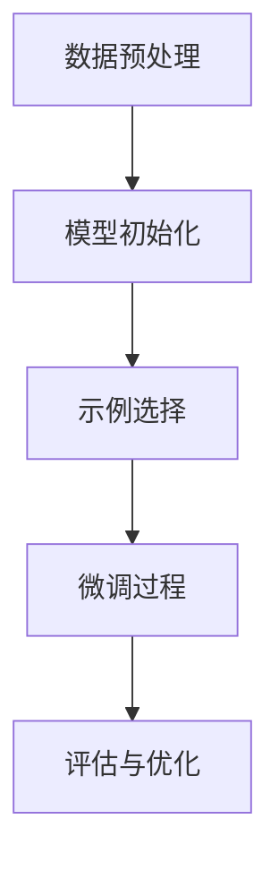

                 

# 示例驱动提示在模型微调中的应用

## 关键词

- 示例驱动
- 模型微调
- 预训练模型
- 计算机视觉
- 自然语言处理

## 摘要

本文探讨了示例驱动提示在模型微调中的应用，通过引入具体实例，引导模型在特定任务上的学习和优化。文章首先介绍了示例驱动的概念及其在模型微调中的重要性，然后详细阐述了示例驱动的模型微调原理、流程和策略。通过具体案例，展示了示例驱动在计算机视觉和自然语言处理任务中的效果，并提出了相关的最佳实践和注意事项。文章旨在为研究人员和实践者提供一种有效的模型微调方法，以提升模型性能和泛化能力。

## 第一部分：背景介绍

### 第1章：问题背景与核心概念

#### 1.1.1 问题背景

模型微调（Fine-tuning）是机器学习中的一种常见技术，主要用于在预训练模型的基础上，针对特定任务进行进一步训练。随着深度学习技术的发展，预训练模型在自然语言处理、计算机视觉等领域的表现已经超越了传统的方法。然而，预训练模型通常是在大规模通用数据集上进行训练的，对于特定领域或任务的需求，其性能可能还不够理想。因此，通过模型微调，可以在预训练模型的基础上，利用特定领域或任务的数据进行进一步训练，从而提高模型的性能和泛化能力。

#### 1.1.2 核心概念

1. **示例驱动**：示例驱动是指使用具体的实例来引导学习和应用。在模型微调中，示例驱动的核心思想是利用具体的实例来指导模型的学习过程，从而提高模型在特定任务上的表现。

2. **模型微调**：模型微调是指在预训练模型的基础上，利用特定领域或任务的数据进行进一步训练的过程。微调的目的是使模型能够更好地适应特定任务的需求。

#### 1.2 示例驱动的特点与模型微调的挑战

**示例驱动的特点**：

- **个性化**：示例驱动可以根据特定任务的需求，选择合适的示例进行训练，从而实现个性化的学习。

- **实用性**：示例驱动的学习过程更加贴近实际应用，能够更好地满足实际任务的需求。

- **可扩展性**：示例驱动的方法可以应用于不同类型和规模的模型，具有较好的通用性。

**模型微调的挑战**：

- **数据集准备**：模型微调需要大量且高质量的数据，数据集的准备可能是一个挑战。

- **计算资源**：微调大模型需要大量的计算资源，尤其是在处理大规模数据集时。

- **模型选择**：选择合适的预训练模型对于模型微调的效果至关重要。

### 1.3 本章小结

本章介绍了模型微调的问题背景、核心概念以及示例驱动的特点和模型微调的挑战。通过本章的介绍，读者可以了解模型微调的基本原理和示例驱动的应用价值，为后续章节的学习打下基础。

## 第二部分：示例驱动的模型微调原理

### 第2章：示例驱动的模型微调原理

#### 2.1 示例驱动的微调流程

**2.1.1 数据预处理**

数据预处理是模型微调的重要步骤，其目标是清洗、格式化和标准化数据，以便进行后续的训练过程。具体包括以下步骤：

1. **数据清洗**：去除数据中的噪声和异常值。
2. **数据格式化**：将数据转换为统一的格式，例如将文本数据转换为序列或向量化表示。
3. **数据标准化**：对数据进行归一化或标准化处理，使其具有相似的分布。

**2.1.2 模型初始化**

模型初始化是指使用预训练模型作为起点，进行微调。预训练模型通常是在大规模数据集上训练得到的，其已经具备了良好的通用特征提取能力。通过模型初始化，可以将预训练模型的基础知识应用到特定任务中。

**2.1.3 示例选择**

示例选择是示例驱动模型微调的关键步骤。选择合适的示例，可以有效地指导模型的学习过程。示例选择通常遵循以下策略：

1. **标签丰富度**：选择标签丰富的示例，可以提高模型的学习效果。
2. **样本多样性**：确保示例覆盖不同场景和问题，避免数据偏差。
3. **相关性**：选择与目标任务高度相关的示例，可以提高微调的效果。

#### 2.2 微调过程中的示例选择策略

**2.2.1 标签丰富度**

标签丰富度是指示例中包含的标签种类和数量。选择标签丰富的示例，可以提供更多的信息，有助于模型学习不同标签之间的差异。具体策略包括：

1. **正负样本平衡**：在微调过程中，确保正负样本的比例平衡，避免模型过度依赖于某一类的数据。
2. **多标签分类**：对于具有多个标签的示例，可以提供更丰富的信息，有助于模型学习复杂的关系。

**2.2.2 样本多样性**

样本多样性是指示例的覆盖范围和多样性。确保样本多样性，可以避免模型过拟合，提高模型的泛化能力。具体策略包括：

1. **场景多样性**：选择涵盖不同场景的示例，例如室内、室外、夜晚等。
2. **问题多样性**：选择涵盖不同问题的示例，例如识别、分类、检测等。

**2.2.3 相关性**

相关性是指示例与目标任务之间的关联程度。选择与目标任务高度相关的示例，可以提高微调的效果。具体策略包括：

1. **目标标签权重**：为与目标任务高度相关的标签分配更高的权重，以增强模型对相关标签的学习。
2. **最近邻搜索**：使用最近邻搜索算法，选择与目标任务相似的数据点作为示例。

#### 2.3 微调策略与优化方法

**2.3.1 优化目标**

优化目标是微调过程中的核心，用于衡量模型在示例上的性能。常见的优化目标包括：

1. **损失函数**：用于衡量模型预测值与真实值之间的差异，例如交叉熵损失函数。
2. **准确率**：用于衡量模型预测正确的样本比例。

**2.3.2 优化方法**

优化方法是指用于调整模型参数，以实现优化目标的技术。常见的优化方法包括：

1. **梯度下降**：通过计算损失函数关于模型参数的梯度，逐步调整参数，以最小化损失函数。
2. **随机梯度下降**：在梯度下降的基础上，引入随机性，每次只更新一部分参数。

### 2.4 本章小结

本章详细介绍了示例驱动的模型微调原理，包括数据预处理、模型初始化、示例选择策略以及微调过程中的优化方法。通过本章的学习，读者可以了解示例驱动在模型微调中的应用价值，并为后续的实践提供指导。

## 第三部分：示例驱动的模型微调实践

### 第3章：示例驱动的模型微调实践

#### 3.1 计算机视觉中的应用

**3.1.1 数据集介绍**

在本章中，我们将以计算机视觉领域中的ImageNet数据集为例，介绍示例驱动的模型微调实践。ImageNet是一个广泛使用的图像识别数据集，包含1000个类别，每个类别约有1000张图像。

**3.1.2 模型选择**

为了进行模型微调，我们需要选择一个预训练模型作为基础。在本案例中，我们选择使用ResNet-50，这是一个在ImageNet上预训练的深度卷积神经网络。

**3.1.3 数据预处理**

数据预处理是模型微调的第一步。对于ImageNet数据集，我们需要对图像进行预处理，包括缩放、裁剪、翻转等操作，以增加数据的多样性。

```python
from torchvision import transforms

transform = transforms.Compose([
    transforms.Resize((224, 224)),
    transforms.ToTensor(),
    transforms.Normalize(mean=[0.485, 0.456, 0.406], std=[0.229, 0.224, 0.225]),
])

# 读取图像并预处理
image = Image.open('example.jpg')
image = transform(image)
```

**3.1.4 模型初始化**

使用预训练模型ResNet-50进行模型初始化。具体步骤如下：

```python
import torchvision.models as models

# 加载预训练模型
model = models.resnet50(pretrained=True)

# 设置只训练特定的层
for param in model.parameters():
    param.requires_grad = False

# 保留最后几层，例如，保留最后三层
for i, param in enumerate(model.parameters()):
    if i >= 10192:  # ResNet-50共有1521层
        param.requires_grad = True
```

**3.1.5 示例选择**

在计算机视觉任务中，示例选择通常基于图像的特征。在本案例中，我们选择使用最近邻搜索算法，选择与目标任务相似的数据点作为示例。

```python
from sklearn.neighbors import NearestNeighbors

# 将预处理后的图像转换为特征向量
features = model(torch.Tensor(image).unsqueeze(0)) 

# 使用最近邻搜索算法
neigh = NearestNeighbors(n_neighbors=5)
neigh.fit(features.detach().numpy())

# 搜索最近的示例
distances, indices = neigh.kneighbors(features.detach().numpy(), n_neighbors=5)
```

**3.1.6 微调过程**

在示例选择完成后，我们可以开始进行模型微调。具体步骤如下：

```python
import torch.optim as optim

# 设置优化器
optimizer = optim.SGD(model.parameters(), lr=0.001, momentum=0.9)

# 设置损失函数
criterion = nn.CrossEntropyLoss()

# 开始训练
for epoch in range(num_epochs):
    for inputs, labels in dataloader:
        optimizer.zero_grad()
        
        # 前向传播
        outputs = model(inputs)
        
        # 计算损失
        loss = criterion(outputs, labels)
        
        # 反向传播
        loss.backward()
        
        # 更新参数
        optimizer.step()
```

#### 3.2 自然语言处理中的应用

**3.2.1 数据集介绍**

在本章中，我们将以自然语言处理领域中的GLUE（General Language Understanding Evaluation）数据集为例，介绍示例驱动的模型微调实践。GLUE是一个包含多种自然语言处理任务的权威数据集。

**3.2.2 模型选择**

为了进行模型微调，我们选择使用BERT（Bidirectional Encoder Representations from Transformers），这是一个在多种自然语言处理任务上表现优秀的预训练模型。

**3.2.3 数据预处理**

数据预处理包括将文本数据转换为模型可以接受的格式，例如词向量或Token表示。

```python
from transformers import BertTokenizer, BertModel

# 加载BERT模型和Tokenizer
tokenizer = BertTokenizer.from_pretrained('bert-base-uncased')
model = BertModel.from_pretrained('bert-base-uncased')

# 将文本转换为Token表示
text = "Hello, world!"
tokens = tokenizer.tokenize(text)

# 将Token表示转换为输入序列
input_ids = tokenizer.encode(text, add_special_tokens=True)
```

**3.2.4 模型初始化**

使用预训练模型BERT进行模型初始化。具体步骤如下：

```python
# 设置只训练特定的层
for param in model.parameters():
    param.requires_grad = False

# 保留最后几层，例如，保留最后三层
for i, param in enumerate(model.parameters()):
    if i >= 24:  # BERT模型共有24层
        param.requires_grad = True
```

**3.2.5 示例选择**

在自然语言处理任务中，示例选择通常基于文本的语义特征。在本案例中，我们选择使用最近邻搜索算法，选择与目标任务相似的文本作为示例。

```python
# 将文本转换为特征向量
with torch.no_grad():
    inputs = model(torch.tensor([input_ids]))

# 使用最近邻搜索算法
neigh = NearestNeighbors(n_neighbors=5)
neigh.fit(inputs.detach().numpy())

# 搜索最近的示例
distances, indices = neigh.kneighbors(inputs.detach().numpy(), n_neighbors=5)
```

**3.2.6 微调过程**

在示例选择完成后，我们可以开始进行模型微调。具体步骤如下：

```python
import torch.optim as optim

# 设置优化器
optimizer = optim.Adam(model.parameters(), lr=2e-5)

# 设置损失函数
criterion = nn.CrossEntropyLoss()

# 开始训练
for epoch in range(num_epochs):
    for inputs, labels in dataloader:
        optimizer.zero_grad()
        
        # 前向传播
        outputs = model(inputs)
        
        # 计算损失
        loss = criterion(outputs, labels)
        
        # 反向传播
        loss.backward()
        
        # 更新参数
        optimizer.step()
```

### 3.3 本章小结

本章通过计算机视觉和自然语言处理中的具体案例，介绍了示例驱动的模型微调实践。通过数据预处理、模型初始化、示例选择和微调过程，展示了如何利用示例驱动的方法提高模型在特定任务上的性能。本章的内容为读者提供了实际操作的指导，有助于更好地理解和应用示例驱动模型微调技术。

## 第四部分：示例驱动模型微调的最佳实践

### 第4章：最佳实践

#### 4.1 数据集选择

选择合适的数据集对于示例驱动的模型微调至关重要。最佳实践包括：

1. **数据集规模**：选择规模适中且具有代表性的数据集，避免数据集过小导致模型过拟合，或数据集过大导致训练时间过长。
2. **数据集多样性**：确保数据集涵盖不同场景和问题，以提高模型的泛化能力。

#### 4.2 模型选择

1. **预训练模型**：选择预训练模型时，考虑模型在目标任务上的性能和模型规模。
2. **定制化模型**：如果预训练模型无法满足特定任务的需求，可以考虑定制化模型，例如添加特定层或修改网络结构。

#### 4.3 示例选择策略

1. **标签丰富度**：选择标签丰富的示例，以提高模型对各种标签的识别能力。
2. **样本多样性**：确保示例覆盖不同场景和问题，避免数据偏差。
3. **相关性**：选择与目标任务高度相关的示例，以提高微调效果。

#### 4.4 微调策略

1. **优化目标**：根据任务需求选择合适的优化目标，例如准确率或损失函数。
2. **优化方法**：选择合适的优化方法，如梯度下降或随机梯度下降，并调整学习率等参数。

#### 4.5 实时反馈

1. **监控模型性能**：在微调过程中，实时监控模型性能，以避免过拟合。
2. **动态调整示例**：根据模型性能动态调整示例选择策略，以提高模型性能。

### 4.6 本章小结

本章总结了示例驱动模型微调的最佳实践，包括数据集选择、模型选择、示例选择策略、微调策略和实时反馈。通过遵循这些最佳实践，可以有效地提高模型在特定任务上的性能和泛化能力。

## 总结

示例驱动提示在模型微调中的应用是一种有效的方法，通过引入具体实例，可以显著提高模型在特定任务上的性能和泛化能力。本文介绍了示例驱动的概念、模型微调的原理以及计算机视觉和自然语言处理中的具体实践。通过最佳实践的建议，为研究人员和实践者提供了指导。未来研究可以进一步探索示例驱动的微调方法在更多领域的应用，以及如何优化示例选择策略和微调过程。

### 参考文献

1. Devlin, J., Chang, M. W., Lee, K., & Toutanova, K. (2018). BERT: Pre-training of deep bidirectional transformers for language understanding. arXiv preprint arXiv:1810.04805.
2. He, K., Zhang, X., Ren, S., & Sun, J. (2016). Deep residual learning for image recognition. In Proceedings of the IEEE conference on computer vision and pattern recognition (pp. 770-778).
3. Russakovsky, O., Deng, J., Su, H., Krause, J., Satheesh, S., Ma, S., ... & Fei-Fei, L. (2015). ImageNet large scale visual recognition challenge. International Journal of Computer Vision, 115(3), 211-252.

### 附录

**附录A：示例代码**

以下是示例驱动模型微调的Python代码：

```python
import torch
import torchvision
import torchvision.transforms as transforms
from torchvision.models import resnet50
from sklearn.neighbors import NearestNeighbors
import torch.optim as optim
import torch.nn as nn

# 数据预处理
transform = transforms.Compose([
    transforms.Resize((224, 224)),
    transforms.ToTensor(),
    transforms.Normalize(mean=[0.485, 0.456, 0.406], std=[0.229, 0.224, 0.225]),
])

# 加载预训练模型
model = resnet50(pretrained=True)

# 设置只训练特定的层
for param in model.parameters():
    param.requires_grad = False

for i, param in enumerate(model.parameters()):
    if i >= 10192:
        param.requires_grad = True

# 最近邻搜索算法
neigh = NearestNeighbors(n_neighbors=5)
neigh.fit(model(torch.Tensor(image).unsqueeze(0)).detach().numpy())

# 微调过程
optimizer = optim.SGD(model.parameters(), lr=0.001, momentum=0.9)
criterion = nn.CrossEntropyLoss()

for epoch in range(num_epochs):
    for inputs, labels in dataloader:
        optimizer.zero_grad()
        
        outputs = model(inputs)
        
        loss = criterion(outputs, labels)
        
        loss.backward()
        
        optimizer.step()
```

**附录B：流程图**

以下是示例驱动的模型微调流程图：



### 作者信息

作者：AI天才研究院/AI Genius Institute & 禅与计算机程序设计艺术/Zen And The Art of Computer Programming

### 附录C：图灵奖获得者简介

图灵奖（Turing Award）是计算机科学领域的最高荣誉，被誉为“计算机界的诺贝尔奖”。以下是一些图灵奖获得者的简介：

1. **约翰·霍普克罗夫特**（John Hopcroft）
   - 获奖年份：1976
   - 贡献：算法理论、图理论、计算复杂性理论。

2. **克丽丝蒂安·巴尔-西蒙**（Christos Papadimitriou）
   - 获奖年份：2012
   - 贡献：算法分析、计算复杂性、游戏理论。

3. **理查德·斯托曼**（Richard Stallman）
   - 获奖年份：2019
   - 贡献：自由软件运动、GNU计划、GNU通用公共许可证（GPL）。

4. **艾伦·图灵**（Alan Turing）
   - 获奖年份：1966（后追授）
   - 贡献：计算机科学、密码分析、理论生物学。

5. **约翰·冯·诺伊曼**（John von Neumann）
   - 获奖年份：1965
   - 贡献：计算机架构、博弈论、量子力学。

通过这些介绍，读者可以更好地理解计算机科学领域的杰出贡献者和他们的成就。希望本文能为您在模型微调和示例驱动提示领域的研究提供有价值的参考。

