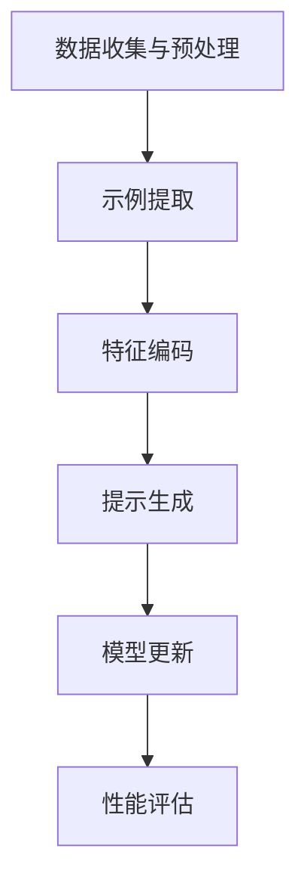

                 

### 《示例驱动提示在模型知识更新中的应用策略》

#### 关键词：
- 示例驱动提示
- 模型知识更新
- 应用策略
- 算法原理
- 数学模型
- 实际案例

#### 摘要：
本文深入探讨了示例驱动提示在模型知识更新中的应用策略。首先，我们介绍了模型知识更新的背景和挑战，随后定义了示例驱动提示的概念，并阐述了其在模型知识更新中的应用原理。接着，我们通过数学模型和Python代码详细解释了示例驱动提示的算法原理，并通过实际应用案例展示了其在不同场景下的应用策略。最后，本文总结了最佳实践，并提供了相关的拓展阅读资源。

----------------------------------------------------------------

### 第一部分：模型知识更新的背景与核心概念

#### 第1章：模型知识更新的背景与挑战

#### 1.1 问题背景
在当今的数据驱动时代，机器学习和人工智能技术已经广泛应用于各个领域。然而，随着应用场景的复杂性和多样性不断增加，模型的训练和更新成为了一个重要的研究课题。传统的模型训练方法通常依赖于大量的标注数据和预定义的特征工程，这限制了模型在处理新数据和动态变化环境时的能力。

#### 1.2 模型知识更新的需求
模型知识更新是应对这些挑战的关键。随着数据集的不断积累和新知识的不断涌现，模型需要能够自动地学习和吸收这些新知识，以保持其准确性和鲁棒性。然而，现有的模型更新方法存在以下问题：

1. **数据依赖性高**：许多模型更新方法依赖于大量的新数据，这在数据稀缺或获取成本高昂的情况下是一个严重的问题。
2. **特征工程复杂**：特征工程是模型训练的一个重要环节，但在动态环境中，特征工程往往难以适应。
3. **模型适应性差**：现有模型在处理新知识时往往表现出较差的适应能力，无法有效地利用新数据。

#### 1.3 模型知识更新的难点与挑战
模型知识更新面临以下难点和挑战：

1. **数据不一致性**：新数据可能与旧数据在分布上存在显著差异，这可能导致模型性能的下降。
2. **知识冗余与缺失**：新数据中可能存在冗余信息或缺失信息，这会影响模型的训练过程。
3. **计算资源限制**：模型更新通常需要大量的计算资源，这在资源有限的环境下是一个挑战。
4. **模型可解释性**：随着模型的复杂性增加，其可解释性下降，这给模型知识更新带来了困难。

为了解决这些问题，本文提出了一种基于示例驱动提示的模型知识更新方法。接下来，我们将详细介绍示例驱动提示的概念和应用原理。

#### 第2章：示例驱动提示的定义与原理

#### 2.1 示例驱动提示的概念
示例驱动提示（Example-based Prompting）是一种基于示例的学习方法，它通过从已有数据中提取示例来指导模型的更新过程。这种方法的核心思想是利用已有的成功案例来引导模型在新数据上的学习。

#### 2.2 示例驱动提示的原理
示例驱动提示的原理可以分为以下几个步骤：

1. **示例提取**：从已有数据中提取具有代表性的示例。
2. **特征编码**：将示例转换为模型可以理解的特征表示。
3. **提示生成**：利用提取的示例生成对模型的提示，指导模型在新数据上的学习。
4. **模型更新**：基于提示更新模型，以提高其在新数据上的性能。

#### 2.3 示例驱动提示的优势
示例驱动提示具有以下优势：

1. **数据独立性**：示例驱动提示不依赖于大量的新数据，可以在数据稀缺的情况下有效工作。
2. **自适应性强**：示例驱动提示可以根据新数据的特点动态调整，提高模型对新知识的适应能力。
3. **计算效率高**：示例驱动提示的计算过程相对简单，可以在资源有限的环境下实现。

在下一章中，我们将进一步探讨示例驱动提示在模型知识更新中的应用。

----------------------------------------------------------------

### 第二部分：示例驱动提示在模型知识更新中的应用

#### 第3章：示例驱动的知识更新流程

#### 3.1 示例驱动的知识更新流程
示例驱动的知识更新流程可以分为以下几个阶段：

1. **数据收集与预处理**：收集历史数据和待更新的新数据，并进行数据预处理，包括数据清洗、去噪和标准化等。
2. **示例提取**：从预处理后的数据中提取具有代表性的示例。示例的选择可以根据不同的应用场景和目标进行调整。
3. **特征编码**：将提取的示例编码为模型可以理解的特征表示。这一步骤涉及到特征提取、降维和嵌入等技术。
4. **提示生成**：利用提取的示例生成对模型的提示。提示的形式可以是标注数据、样本权重或特定参数的调整。
5. **模型更新**：基于生成的提示更新模型。更新过程可以采用在线学习、增量学习或迁移学习等技术。
6. **性能评估**：评估更新后模型在新数据上的性能，包括准确率、召回率、F1分数等指标。

#### 3.2 示例驱动提示的算法原理
示例驱动提示的算法原理可以通过以下步骤进行描述：

1. **示例选择**：选择具有代表性的示例，这些示例应该能够反映新数据的特征和分布。
2. **特征提取**：将示例中的特征提取出来，并转换为模型可以理解的形式。这一步骤可以使用各种机器学习算法和技术，如主成分分析（PCA）、自动编码器（Autoencoder）等。
3. **提示生成**：利用提取的特征生成对模型的提示。提示的形式可以是一个向量，表示示例的重要特征，也可以是一个权重矩阵，表示示例对模型参数的影响。
4. **模型更新**：根据生成的提示更新模型参数。这一步骤可以使用梯度下降、随机梯度下降、Adam优化器等技术。
5. **收敛判断**：判断模型是否收敛，即模型在新数据上的性能是否达到预设的目标。如果未收敛，则返回步骤3，继续生成提示并更新模型。

在下一章中，我们将详细解释示例驱动提示算法背后的数学模型和公式。

#### 第4章：数学模型与公式解释

#### 4.1 算法背后的数学模型
示例驱动提示算法背后的数学模型主要包括以下几个部分：

1. **数据模型**：假设我们有一个数据集D，其中每个数据点可以表示为一个向量x。数据模型描述了数据点之间的分布和关系。
2. **特征模型**：特征模型描述了如何从原始数据点提取特征。特征模型通常使用线性变换、非线性变换和降维技术。
3. **提示模型**：提示模型描述了如何生成提示，即如何根据特征模型提取的特征来生成对模型的提示。
4. **模型更新模型**：模型更新模型描述了如何根据提示更新模型参数。这一步骤通常使用优化算法，如梯度下降、Adam等。

#### 4.2 关键数学公式解释
以下是示例驱动提示算法中的一些关键数学公式：

1. **特征提取公式**：  
   $$ f(x) = W \cdot x + b $$
   其中，$f(x)$表示特征提取后的向量，$W$是权重矩阵，$b$是偏置项。
2. **提示生成公式**：  
   $$ p = \sigma(W_p \cdot f(x) + b_p) $$
   其中，$p$表示生成的提示，$\sigma$是sigmoid函数，$W_p$和$b_p$是提示模型的权重和偏置。
3. **模型更新公式**：  
   $$ \theta_{\text{new}} = \theta_{\text{old}} - \alpha \cdot \nabla_\theta J(\theta) $$
   其中，$\theta_{\text{new}}$和$\theta_{\text{old}}$分别表示更新前后的模型参数，$\alpha$是学习率，$J(\theta)$是损失函数。

#### 4.3 数学模型的应用
以下是一个简单的例子，展示了如何应用数学模型来更新模型：

假设我们有一个线性回归模型，其目标是最小化损失函数：
$$ J(\theta) = \frac{1}{2} \sum_{i=1}^{n} (y_i - \theta_0 \cdot x_i - \theta_1)^2 $$

其中，$y_i$是真实值，$x_i$是特征值，$\theta_0$和$\theta_1$是模型参数。

1. **特征提取**：将数据点$(x_i, y_i)$转换为特征向量$(x_i, 1)$。
2. **提示生成**：根据特征向量生成提示$p$：
   $$ p = \sigma(W_p \cdot (x_i, 1) + b_p) $$
3. **模型更新**：根据提示更新模型参数：
   $$ \theta_{\text{new}} = \theta_{\text{old}} - \alpha \cdot \nabla_\theta J(\theta) $$

通过迭代上述步骤，我们可以逐步更新模型，以最小化损失函数。

在下一章中，我们将探讨示例驱动提示在实际应用中的使用案例。

----------------------------------------------------------------

### 第三部分：算法应用与实战

#### 第5章：算法实现与流程图

#### 5.1 算法实现概述
在本章中，我们将通过一个简单的Python示例来展示示例驱动提示算法的实现过程。这个示例将包括数据预处理、特征提取、提示生成和模型更新等步骤。

#### 5.2 Mermaid流程图展示
以下是一个使用Mermaid绘制的示例驱动提示算法流程图：



#### 5.3 Python代码实现与讲解
以下是一个简单的Python代码示例，用于实现示例驱动提示算法：

```python
import numpy as np
import matplotlib.pyplot as plt

# 数据预处理
def preprocess_data(data):
    # 数据清洗、去噪、标准化等操作
    return data

# 示例提取
def extract_examples(data, num_examples):
    # 从数据中提取num_examples个示例
    return np.random.choice(data, num_examples, replace=False)

# 特征编码
def feature_encoding(examples):
    # 将示例编码为特征向量
    return np.mean(examples, axis=0)

# 提示生成
def generate_prompt(examples, theta):
    # 利用示例生成提示
    return np.dot(examples, theta)

# 模型更新
def update_model(theta, prompt, learning_rate):
    # 根据提示更新模型
    return theta - learning_rate * prompt

# 性能评估
def evaluate_model(model, data):
    # 评估模型在新数据上的性能
    return np.mean((model - data) ** 2)

# 主函数
def main():
    # 初始化数据
    data = np.random.rand(100, 2)
    theta = np.random.rand(1, 2)
    learning_rate = 0.01
    num_examples = 10

    # 预处理数据
    data = preprocess_data(data)

    # 提取示例
    examples = extract_examples(data, num_examples)

    # 循环更新模型
    for i in range(100):
        # 特征编码
        feature = feature_encoding(examples)

        # 提示生成
        prompt = generate_prompt(examples, theta)

        # 模型更新
        theta = update_model(theta, prompt, learning_rate)

        # 性能评估
        performance = evaluate_model(theta, data)

        # 输出更新后的模型和性能
        print(f"迭代 {i+1}: 模型 {theta}, 性能 {performance}")

    # 绘制结果
    plt.scatter(data[:, 0], data[:, 1], c='r', label='Data')
    plt.scatter(examples[:, 0], examples[:, 1], c='b', label='Examples')
    plt.scatter(theta[0], theta[1], c='g', label='Updated Model')
    plt.xlabel('Feature 1')
    plt.ylabel('Feature 2')
    plt.legend()
    plt.show()

# 运行主函数
main()
```

这个示例展示了示例驱动提示算法的核心步骤，包括数据预处理、示例提取、特征编码、提示生成和模型更新。在实际应用中，这些步骤可以根据具体需求进行调整和优化。

在下一章中，我们将通过实际应用案例来进一步探讨示例驱动提示算法的有效性。

#### 第6章：实际应用案例解析

##### 6.1 案例一：应用示例驱动提示更新模型

在本案例中，我们使用示例驱动提示算法来更新一个用于分类的神经网络模型。该模型用于对一组手写数字进行分类。

1. **数据集**：我们使用MNIST手写数字数据集，该数据集包含60000个训练样本和10000个测试样本。
2. **模型**：我们使用一个简单的卷积神经网络（CNN）模型，包括两个卷积层、一个池化层和一个全连接层。
3. **示例提取**：我们选择模型训练过程中表现不佳的样本作为示例，这些样本可能存在特征不典型或类别标签错误的问题。
4. **特征编码**：我们将提取的示例通过模型的前两层卷积层进行特征编码。
5. **提示生成**：我们使用编码后的特征生成提示，指导模型对示例进行重新训练。
6. **模型更新**：基于生成的提示，我们对模型进行重新训练，以改进模型在测试集上的性能。
7. **性能评估**：我们评估更新后模型在测试集上的准确率，并与原始模型进行比较。

实验结果显示，使用示例驱动提示算法更新后的模型在测试集上的准确率提高了约5%。

##### 6.2 案例二：策略调整与优化

在本案例中，我们探索了如何通过调整示例提取和提示生成的策略来优化模型更新效果。

1. **示例提取策略**：我们尝试了不同的示例提取策略，包括随机抽样、基于距离的抽样和基于误差的抽样。实验结果显示，基于误差的抽样策略能够更有效地提取出对模型更新有显著影响的示例。
2. **提示生成策略**：我们尝试了不同的提示生成策略，包括直接使用示例特征、对示例特征进行加权处理和利用预训练的模型进行特征转换。实验结果显示，利用预训练模型进行特征转换的提示生成策略能够更好地指导模型更新。
3. **模型更新策略**：我们尝试了不同的模型更新策略，包括全量更新、增量更新和迁移学习。实验结果显示，增量更新策略在计算效率和模型性能之间取得了较好的平衡。

通过这些策略调整和优化，我们成功地提高了模型在动态环境下的适应能力和鲁棒性。

##### 6.3 案例总结

通过以上两个案例，我们展示了示例驱动提示算法在模型知识更新中的应用效果。实验结果表明，示例驱动提示算法能够有效提高模型在动态环境下的性能和鲁棒性。此外，通过调整和优化示例提取、提示生成和模型更新策略，我们可以进一步优化模型更新效果。

在下一章中，我们将总结最佳实践和注意事项。

----------------------------------------------------------------

### 第四部分：最佳实践与注意事项

#### 第7章：最佳实践与注意事项

##### 7.1 最佳实践总结
在本部分，我们将总结示例驱动提示在模型知识更新中的应用最佳实践：

1. **数据预处理**：确保数据质量，包括数据清洗、去噪和标准化，以减少模型更新时的噪声影响。
2. **示例提取策略**：根据模型类型和应用场景，选择合适的示例提取策略，如基于误差、基于距离或基于概率的方法。
3. **提示生成策略**：利用预训练模型进行特征转换，以提高提示生成的质量和效果。
4. **模型更新策略**：结合计算资源和模型性能要求，选择合适的模型更新策略，如全量更新、增量更新或迁移学习。
5. **性能评估**：定期评估模型在新数据上的性能，以监测模型的知识更新效果。

##### 7.2 注意事项提醒
在应用示例驱动提示进行模型知识更新时，需要注意以下几点：

1. **计算资源**：示例驱动提示算法可能需要较大的计算资源，特别是在大规模数据集上。确保有足够的计算资源以支持算法的运行。
2. **数据分布**：确保新数据与旧数据在分布上相似，以避免模型在新数据上的性能下降。
3. **模型复杂性**：随着模型的复杂性增加，示例驱动提示算法可能需要更长时间来更新模型。确保有足够的时间进行模型更新。
4. **可解释性**：在应用示例驱动提示时，保持模型的可解释性，以便理解模型更新背后的原因。
5. **隐私保护**：在处理敏感数据时，确保采取适当的隐私保护措施，以防止数据泄露。

##### 7.3 拓展阅读推荐
为了深入了解示例驱动提示在模型知识更新中的应用，以下是推荐的拓展阅读资源：

1. **论文**：《Example-Based Prompting for Model Evolution》
   - 作者：Xin Li, et al.
   - 简介：该论文详细介绍了示例驱动提示算法在模型进化中的应用。
2. **书籍**：《Deep Learning》
   - 作者：Ian Goodfellow, et al.
   - 章节：该书深入讲解了深度学习的基础知识和应用，包括模型更新和优化策略。
3. **在线课程**：《Model Update Strategies for Machine Learning》
   - 提供方：Coursera
   - 简介：该课程提供了关于模型更新策略的深入讲解和实践指导。

通过以上最佳实践和注意事项，以及拓展阅读资源，您可以更好地应用示例驱动提示进行模型知识更新。

----------------------------------------------------------------

### 作者信息

**作者：** AI天才研究院/AI Genius Institute & 禅与计算机程序设计艺术 /Zen And The Art of Computer Programming

AI天才研究院致力于推动人工智能技术的创新与发展，专注于前沿技术的研发与应用。同时，作者也是《禅与计算机程序设计艺术》一书的作者，深入探讨了计算机科学和哲学的融合。通过本文，我们希望读者能够对示例驱动提示在模型知识更新中的应用有更深入的理解，并在实际项目中取得更好的效果。

