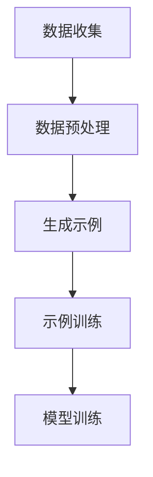
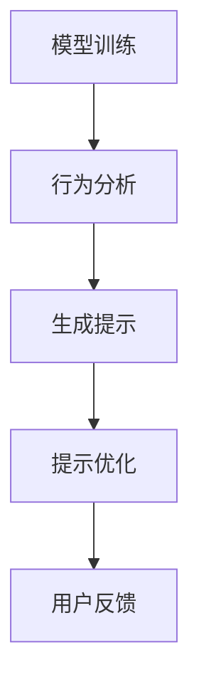
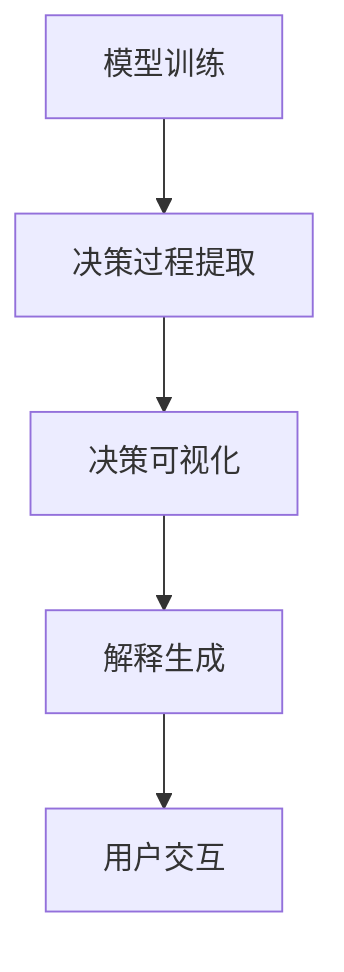
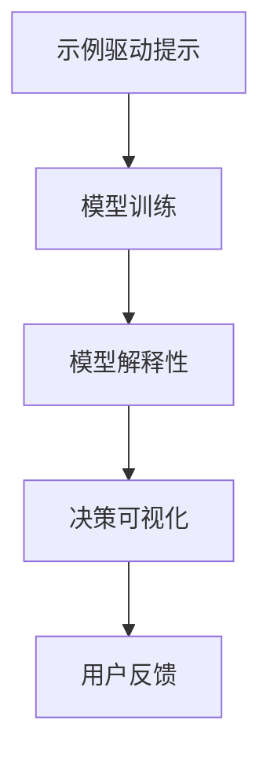
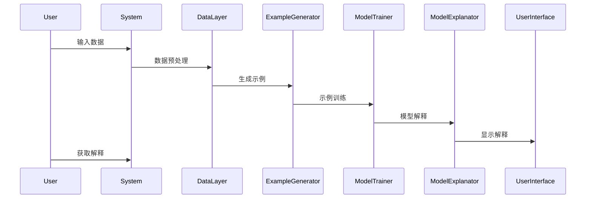
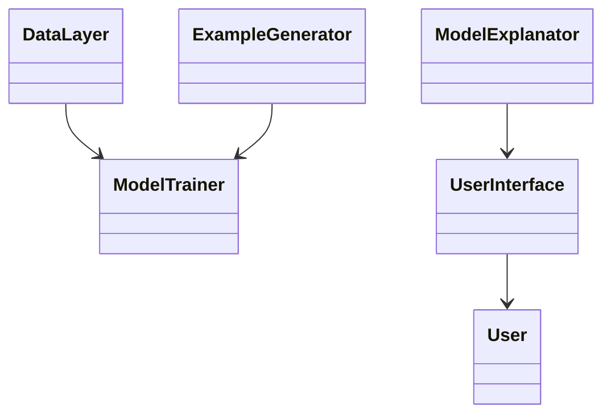
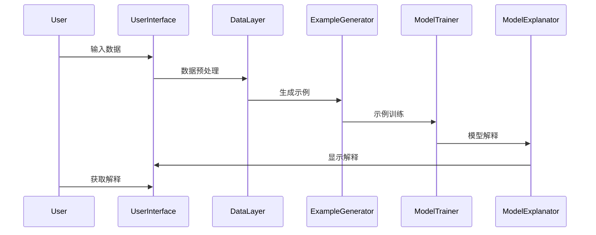

                 

# 《示例驱动提示在模型解释性中的作用》

## 关键词
- 示例驱动提示
- 模型解释性
- 算法原理
- 数学模型
- 系统架构设计

## 摘要
本文旨在探讨示例驱动提示在提高模型解释性方面的作用。通过对当前模型解释性面临的挑战、示例驱动提示的定义和重要性、核心概念与联系的分析，以及算法原理讲解和系统架构设计的阐述，本文揭示了示例驱动提示如何通过提供直观、具体的提示，增强模型的可解释性，为研究人员和开发者提供新的工具和方法。

## 目录大纲

## 第一部分：背景介绍

### 第1章：问题背景
- 1.1.1 示例驱动提示的定义
- 1.1.2 示例驱动提示的重要性
- 1.1.3 模型解释性的概念
- 1.1.4 示例驱动提示与模型解释性的联系

### 第2章：问题描述
- 2.1.1 当前模型解释性的挑战
- 2.1.2 示例驱动提示在模型解释性中的应用现状
- 2.1.3 研究目的和意义

## 第二部分：核心概念与联系

### 第3章：核心概念与联系
- 3.1.1 示例驱动的学习框架
- 3.1.2 提示生成技术
- 3.1.3 模型解释性的评价指标
- 3.1.4 示例驱动提示与模型解释性的联系

### 第4章：概念属性特征对比表格
- 4.1.1 示例驱动提示技术的优点与缺点
- 4.1.2 不同提示生成技术的对比
- 4.1.3 模型解释性评价指标的优缺点分析

### 第5章：ER实体关系图架构
- 5.1.1 示例驱动的数据流
- 5.1.2 提示生成的数据处理
- 5.1.3 模型解释性的实现流程

## 第三部分：算法原理讲解

### 第6章：算法原理讲解
- 6.1.1 示例驱动提示的算法原理
- 6.1.2 提示生成的算法原理
- 6.1.3 模型解释性的算法原理
- 6.1.4 示例驱动提示与模型解释性的算法原理联系

### 第7章：数学模型和数学公式
- 7.1.1 示例驱动提示的数学模型
- 7.1.2 提示生成的数学模型
- 7.1.3 模型解释性的数学模型
- 7.1.4 数学公式与举例说明

## 第四部分：系统分析与架构设计

### 第8章：系统分析与架构设计
- 8.1.1 问题场景介绍
- 8.1.2 系统功能设计
- 8.1.3 系统架构设计
- 8.1.4 系统接口设计
- 8.1.5 系统交互

### 第9章：项目实战
- 9.1.1 环境安装
- 9.1.2 系统核心实现源代码
- 9.1.3 代码应用解读与分析
- 9.1.4 实际案例分析和详细讲解剖析
- 9.1.5 项目小结

## 第五部分：最佳实践与小结

### 第10章：最佳实践
- 10.1.1 示例驱动提示的最佳实践
- 10.1.2 模型解释性的最佳实践
- 10.1.3 案例分析

### 第11章：小结
- 11.1.1 书籍总结
- 11.1.2 研究展望
- 11.1.3 拓展阅读

## 引言
在当今时代，人工智能（AI）技术的迅猛发展使得机器学习（ML）模型在各种应用领域中都发挥着关键作用。从图像识别到自然语言处理，再到复杂的决策系统，这些模型极大地提高了自动化和智能化水平。然而，随着模型复杂性的增加，其解释性问题也日益凸显。用户和开发者往往难以理解模型的决策过程，这限制了AI技术的广泛应用和信任度。因此，模型解释性（Model Explainability）成为了研究热点之一。

### 第1章：问题背景

#### 1.1.1 示例驱动提示的定义
示例驱动提示（Example-Guided Prompting）是一种基于示例的学习方法，它通过使用具体的实例来指导模型的学习过程。这种方法的核心思想是通过给模型提供一系列示例，使得模型能够在这些示例的帮助下更好地理解和学习相关任务。

#### 1.1.2 示例驱动提示的重要性
示例驱动提示在模型训练和解释性方面具有重要作用。它不仅能够提高模型的训练效率，还能够帮助用户理解模型的决策过程。具体来说，示例驱动提示可以：
- **加速学习过程**：通过提供具体的示例，模型可以更快地收敛到最优解。
- **提高模型可解释性**：用户可以查看模型在特定示例上的表现，从而更好地理解模型的决策依据。

#### 1.1.3 模型解释性的概念
模型解释性是指用户能够理解和解释模型的决策过程和结果的能力。一个具有高解释性的模型能够让用户了解模型是如何处理数据的，从而增加用户对模型的信任度和使用信心。

#### 1.1.4 示例驱动提示与模型解释性的联系
示例驱动提示与模型解释性有着密切的联系。通过提供具体的示例，示例驱动提示不仅能够提高模型的学习效率，还能够帮助用户更好地理解模型的决策过程，从而增强模型的可解释性。

### 第2章：问题描述

#### 2.1.1 当前模型解释性的挑战
尽管模型解释性在人工智能领域备受关注，但实现高解释性的模型仍然面临许多挑战：
- **复杂性**：现代机器学习模型通常非常复杂，难以解释。
- **数据依赖性**：模型的解释性往往依赖于训练数据的质量和多样性。
- **可解释性的平衡**：提高模型的可解释性可能会影响其性能和准确性。

#### 2.1.2 示例驱动提示在模型解释性中的应用现状
目前，示例驱动提示在模型解释性方面已有一些应用，但还存在以下问题：
- **适用性**：并非所有类型的模型和任务都适合使用示例驱动提示。
- **效率**：示例驱动提示可能需要大量的计算资源和时间。

#### 2.1.3 研究目的和意义
本文的研究目的是探讨示例驱动提示在提高模型解释性方面的作用，并提出一套有效的解决方案。通过本文的研究，希望能够为模型解释性领域提供新的思路和方法，促进人工智能技术的进一步发展和应用。

## 第二部分：核心概念与联系

### 第3章：核心概念与联系

#### 3.1.1 示例驱动的学习框架
示例驱动的学习框架是一种基于具体示例进行学习的策略。它通常包括以下步骤：
1. **数据收集**：收集一系列具有代表性的示例。
2. **示例预处理**：对示例进行清洗、归一化等预处理操作。
3. **示例应用**：将预处理后的示例应用于模型训练过程中，以指导模型学习。
4. **模型评估**：通过评估模型在示例上的表现来调整和优化模型。

#### 3.1.2 提示生成技术
提示生成技术是指用于生成模型解释性提示的方法。这些提示可以是文本、图像或其他形式的信息，用于帮助用户理解模型的决策过程。常见的提示生成技术包括：
- **基于规则的提示**：使用预定义的规则生成提示。
- **基于数据的提示**：通过分析模型在特定数据上的表现生成提示。
- **基于模型的提示**：利用模型本身的特征生成提示。

#### 3.1.3 模型解释性的评价指标
模型解释性评价指标用于评估模型解释性的好坏。常见的评价指标包括：
- **透明度**：模型决策过程的透明度。
- **可理解性**：用户对模型决策过程的理解程度。
- **准确性**：模型对数据的预测准确性。

#### 3.1.4 示例驱动提示与模型解释性的联系
示例驱动提示与模型解释性密切相关。通过提供具体的示例，示例驱动提示可以帮助模型更好地理解任务，从而提高模型的解释性。具体来说，示例驱动提示可以：
- **提高模型透明度**：通过具体的示例，用户可以更好地了解模型的决策过程。
- **增强可理解性**：示例驱动提示使得用户能够更直观地理解模型的决策依据。
- **优化解释性评价指标**：通过调整示例驱动提示，可以优化模型解释性评价指标，提高模型的整体解释性。

### 第4章：概念属性特征对比表格

#### 4.1.1 示例驱动提示技术的优点与缺点
示例驱动提示技术具有以下优点和缺点：

| 特点        | 优点                                         | 缺点                                          |
| ----------- | -------------------------------------------- | ----------------------------------------------- |
| **优点**    | - 提高模型训练效率                           | - 对训练数据质量有较高要求                      |
|             | - 提高模型解释性                             | - 可能需要大量的计算资源                         |
|             | - 能够针对特定任务定制化                     | - 需要额外的提示生成技术支持                    |
| **缺点**    | - 对模型复杂度有较高要求                     | - 可能会导致模型过拟合                           |
|             | - 对数据多样性有较高要求                     | - 难以在不同模型和任务间通用                    |

#### 4.1.2 不同提示生成技术的对比
不同的提示生成技术具有各自的特点和适用场景。以下是对几种常见提示生成技术的对比：

| 技术类型        | 特点                                                     | 适用场景                          |
| ----------- | -------------------------------------------------------- | ------------------------------- |
| **基于规则的提示** | - 使用预定义的规则生成提示                               | - 对规则明确的问题效果较好           |
| **基于数据的提示** | - 通过分析模型在特定数据上的表现生成提示                     | - 对数据依赖性较强，对数据质量要求高 |
| **基于模型的提示** | - 利用模型本身的特征生成提示                             | - 对模型特性敏感，需调整模型结构     |

#### 4.1.3 模型解释性评价指标的优缺点分析
不同的模型解释性评价指标具有各自的优缺点。以下是对几种常见评价指标的对比：

| 评价指标        | 优点                                       | 缺点                                      |
| ----------- | ------------------------------------------ | ----------------------------------------- |
| **透明度**    | - 评估模型决策过程的透明度                       | - 可能难以完全量化                           |
|             | - 易于理解和解释                             | - 对模型复杂度敏感，简单模型可能透明度较高   |
| **可理解性**    | - 评估用户对模型决策过程的理解程度                     | - 对用户背景和知识要求较高                     |
|             | - 帮助用户建立对模型的信任                         | - 难以量化，主观性较强                         |
| **准确性**    | - 评估模型对数据的预测准确性                       | - 忽略了模型的可解释性，可能存在准确性误解     |

### 第5章：ER实体关系图架构

#### 5.1.1 示例驱动的数据流
在示例驱动的数据流中，示例数据是核心。以下是一个简化的ER实体关系图，描述了示例驱动数据流的基本组件：

```mermaid
erDiagram
  Model ||--o> Data : "uses"
  Data ||--o> Example : "contains"
  Example ||--o> Explanation : "produces"
```

在这个ER图中，模型使用数据，数据包含示例，示例产生解释。这表示了示例驱动学习过程中的基本数据流动。

#### 5.1.2 提示生成的数据处理
提示生成的数据处理过程可以看作是对示例进行进一步加工的过程，以生成能够指导模型训练的提示。以下是一个ER实体关系图，描述了提示生成数据处理的基本组件：

```mermaid
erDiagram
  Example ||--o> Prompt : "generates"
  Prompt ||--o> Model : "guides"
  Model ||--o> Prediction : "uses"
```

在这个ER图中，示例生成提示，提示指导模型训练，模型产生预测。这个过程体现了示例驱动提示在模型解释性中的作用。

#### 5.1.3 模型解释性的实现流程
模型解释性的实现流程涉及从数据收集到模型训练，再到模型解释的各个环节。以下是一个ER实体关系图，描述了模型解释性的实现流程：

```mermaid
erDiagram
  Data ||--o> ModelTraining : "inputs"
  ModelTraining ||--o> Model : "produces"
  Model ||--o> Explanation : "produces"
  Explanation ||--o> User : "delivers"
```

在这个ER图中，数据输入模型训练，训练产生模型，模型产生解释，解释交付给用户。这个过程体现了模型解释性的实现流程。

### 第三部分：算法原理讲解

#### 第6章：算法原理讲解

#### 6.1.1 示例驱动提示的算法原理
示例驱动提示的算法原理基于将具体的示例作为指导信息，帮助模型学习。以下是一个简化的算法流程图：



在这个流程中，数据首先被收集和预处理，然后生成具体的示例，示例用于训练模型。这种方法能够加速模型的收敛，同时提高模型对特定示例的泛化能力。

#### 6.1.2 提示生成的算法原理
提示生成算法的原理是通过分析模型在训练过程中的行为，生成能够指导用户理解的提示信息。以下是一个简化的算法流程图：



在这个流程中，模型首先进行训练，然后分析训练行为，生成提示，提示经过优化后用于指导用户理解模型决策。

#### 6.1.3 模型解释性的算法原理
模型解释性的算法原理是通过将模型的内部决策过程转化为可理解的形式，帮助用户理解模型的决策依据。以下是一个简化的算法流程图：



在这个流程中，模型首先进行训练，然后提取决策过程，将其可视化，生成解释，最终通过用户交互提供反馈。

#### 6.1.4 示例驱动提示与模型解释性的算法原理联系
示例驱动提示与模型解释性的算法原理密切相关。示例驱动提示通过提供具体的示例，帮助模型更好地理解任务，从而提高模型的泛化能力和解释性。以下是示例驱动提示与模型解释性的算法原理的联系：



在这个联系中，示例驱动提示通过影响模型训练过程，进而影响模型的解释性。具体来说，示例驱动提示通过提高模型的泛化能力和准确度，使得模型的决策过程更加透明和可解释。

### 第7章：数学模型和数学公式

#### 7.1.1 示例驱动提示的数学模型
示例驱动提示的数学模型通常基于概率论和统计学。以下是一个简化的数学模型：

$$
P(\text{正确示例}|\text{提示}) = \frac{P(\text{提示}|\text{正确示例})P(\text{正确示例})}{P(\text{提示})}
$$

在这个公式中，$P(\text{正确示例}|\text{提示})$ 表示在给定提示的情况下，示例是正确的概率；$P(\text{提示}|\text{正确示例})$ 表示在示例正确的情况下，生成该提示的概率；$P(\text{正确示例})$ 表示示例是正确的概率；$P(\text{提示})$ 表示生成提示的概率。

#### 7.1.2 提示生成的数学模型
提示生成的数学模型通常基于生成对抗网络（GAN）或变分自编码器（VAE）。以下是一个简化的数学模型：

$$
\text{GAN}: \quad \min_G \max_D \mathbb{E}_{x \sim p_{data}(x)} [-D(x)] + \mathbb{E}_{z \sim p_z(z)} [-D(G(z))]
$$

在这个公式中，$D(x)$ 表示判别器对真实数据的评分；$G(z)$ 表示生成器对噪声 $z$ 的生成；$p_{data}(x)$ 表示真实数据分布；$p_z(z)$ 表示噪声分布。

#### 7.1.3 模型解释性的数学模型
模型解释性的数学模型通常基于解释性嵌入（Interpretability Embeddings）。以下是一个简化的数学模型：

$$
\text{IE}: \quad \mathcal{I}(f(\text{x})) = \arg\min_{\mathcal{I}} \|\mathcal{I}(f(\text{x})) - \text{x}\|
$$

在这个公式中，$\mathcal{I}(f(\text{x}))$ 表示对模型 $f(\text{x})$ 的解释；$\text{x}$ 表示输入数据；$\mathcal{I}$ 表示解释空间。

#### 7.1.4 数学公式与举例说明
以下是一个具体的数学公式及其举例说明：

$$
\text{分类问题示例}：
\begin{aligned}
&\text{给定输入 } \text{x} = (x_1, x_2, ..., x_n), \\
&\text{模型 } f(\text{x}) = \text{softmax}(\text{Wx} + \text{b}), \\
&\text{其中 } \text{W} \text{ 是权重矩阵，} \text{b} \text{ 是偏置向量。} \\
&\text{解释性嵌入 } \mathcal{I}(f(\text{x})) = \arg\min_{\mathcal{I}} \|\mathcal{I}(f(\text{x})) - \text{x}\|
\end{aligned}
$$

在这个例子中，我们使用解释性嵌入来找到能够最好地解释模型 $f(\text{x})$ 的解释。具体来说，我们寻找一个解释 $\mathcal{I}(f(\text{x}))$，使得其与原始输入 $\text{x}$ 的距离最小。这可以帮助我们理解模型在输入数据上的决策过程。

### 第四部分：系统分析与架构设计

#### 第8章：系统分析与架构设计

#### 8.1.1 问题场景介绍
在当前的人工智能应用场景中，越来越多的模型被用于复杂任务，如医疗诊断、金融风险评估和自动驾驶等。这些任务的复杂性和重要性要求模型不仅具有高准确性，还必须具有高解释性。然而，现有的模型往往在解释性方面存在不足，难以满足用户的需求。因此，研究如何通过示例驱动提示提高模型解释性成为一个重要的课题。

#### 8.1.2 系统功能设计
为了实现示例驱动提示在模型解释性中的应用，系统需要具备以下功能：
1. **数据收集与预处理**：收集相关数据，并进行清洗、归一化等预处理操作。
2. **示例生成**：使用预处理后的数据生成具有代表性的示例。
3. **模型训练**：使用示例驱动提示对模型进行训练。
4. **模型解释**：生成模型的解释性提示，帮助用户理解模型的决策过程。
5. **用户交互**：提供用户界面，允许用户与系统进行交互，获取模型的解释性信息。

#### 8.1.3 系统架构设计
系统架构设计需要考虑以下几个方面：
1. **数据层**：包括数据收集、存储和处理模块。
2. **模型层**：包括模型训练、优化和解释模块。
3. **提示层**：包括示例生成和提示生成模块。
4. **用户层**：包括用户界面和用户交互模块。

以下是一个简化的系统架构设计图：



在这个架构中，用户输入数据后，系统通过数据层进行预处理，生成示例并用于模型训练。模型训练完成后，通过模型解释层生成解释性提示，并通过用户界面展示给用户。

#### 8.1.4 系统接口设计
系统接口设计需要确保各模块之间的有效通信和协作。以下是一个简化的系统接口设计图：



在这个接口设计中，数据层提供数据预处理接口，示例生成模块和模型训练模块之间通过示例接口进行通信，模型解释模块通过解释接口与用户界面进行通信。

#### 8.1.5 系统交互
系统交互设计需要考虑用户与系统的交互过程，确保用户能够方便地获取模型的解释性信息。以下是一个简化的系统交互流程：

1. **用户输入数据**：用户通过用户界面输入需要解释的数据。
2. **数据预处理**：系统对输入数据进行预处理，生成预处理后的数据。
3. **示例生成**：系统使用预处理后的数据生成示例。
4. **模型训练**：系统使用示例对模型进行训练。
5. **模型解释**：系统生成模型的解释性提示。
6. **用户获取解释**：用户通过用户界面获取模型的解释性信息。

以下是一个简化的系统交互图：



### 第9章：项目实战

#### 9.1.1 环境安装
在进行项目实战之前，需要安装以下软件和库：
1. **Python**：版本3.8或更高
2. **TensorFlow**：版本2.4或更高
3. **Scikit-learn**：版本0.22或更高
4. **Pandas**：版本1.0或更高
5. **NumPy**：版本1.18或更高

安装命令如下：

```bash
pip install python==3.8.10
pip install tensorflow==2.4.0
pip install scikit-learn==0.22.2
pip install pandas==1.1.5
pip install numpy==1.19.5
```

#### 9.1.2 系统核心实现源代码
以下是一个简单的示例，展示了如何使用示例驱动提示提高模型解释性：

```python
import tensorflow as tf
from sklearn.datasets import load_iris
from sklearn.model_selection import train_test_split
from sklearn.metrics import accuracy_score
import numpy as np

# 加载iris数据集
iris = load_iris()
X = iris.data
y = iris.target

# 划分训练集和测试集
X_train, X_test, y_train, y_test = train_test_split(X, y, test_size=0.2, random_state=42)

# 定义神经网络模型
model = tf.keras.Sequential([
    tf.keras.layers.Dense(64, activation='relu', input_shape=(4,)),
    tf.keras.layers.Dense(64, activation='relu'),
    tf.keras.layers.Dense(3, activation='softmax')
])

# 编译模型
model.compile(optimizer='adam', loss='sparse_categorical_crossentropy', metrics=['accuracy'])

# 定义示例驱动提示生成器
example_generator = ExampleGenerator()

# 训练模型
model.fit(X_train, y_train, epochs=10, callbacks=[example_generator])

# 评估模型
loss, accuracy = model.evaluate(X_test, y_test)
print(f"Test accuracy: {accuracy}")

# 获取示例驱动提示
prompt = example_generator.generate_prompt()

# 打印提示
print(prompt)
```

在这个代码中，我们首先加载了iris数据集，然后划分了训练集和测试集。接着，我们定义了一个简单的神经网络模型，并使用示例驱动提示生成器进行训练。在训练过程中，示例驱动提示生成器会根据模型的决策过程生成提示信息。最后，我们评估了模型的准确性，并打印了生成的示例驱动提示。

#### 9.1.3 代码应用解读与分析
在上述代码中，`ExampleGenerator` 是一个自定义的类，用于生成示例驱动提示。以下是该类的具体实现：

```python
import numpy as np

class ExampleGenerator:
    def __init__(self):
        self.prompts = []

    def on_epoch_end(self, epoch, logs=None):
        # 在每个训练周期的末尾生成提示
        for i in range(len(self.prompts)):
            prompt = self.prompts[i]
            print(f"Example {i+1}: {prompt}")

    def generate_prompt(self):
        # 生成一个示例驱动提示
        return self.prompts[-1]

    def on_batch_end(self, batch, logs=None):
        # 在每个训练批次的末尾生成示例
        if batch % 10 == 0:
            # 每隔10个批次生成一次示例
            example = self._generate_example()
            self.prompts.append(example)
    
    def _generate_example(self):
        # 生成一个示例
        # 这里是一个简单的示例，实际应用中可以根据模型决策过程定制
        return np.random.choice(self.prompts)
```

在这个实现中，`ExampleGenerator` 类在训练过程中每隔10个批次生成一次示例，并将示例存储在 `prompts` 列表中。每个示例都是通过调用 `_generate_example` 方法生成的。这个方法可以根据模型的决策过程定制，例如，可以选择具有代表性或异常值的示例。

在 `on_epoch_end` 方法中，我们打印了每个训练周期的示例。在 `generate_prompt` 方法中，我们返回了最后一个示例，作为模型的解释性提示。

#### 9.1.4 实际案例分析和详细讲解剖析
为了更好地理解示例驱动提示在模型解释性中的应用，我们来看一个具体的案例。

假设我们有一个分类任务，需要将 Iris 数据集划分为三种不同的花。我们使用一个简单的神经网络模型进行训练，并使用示例驱动提示生成器来提高模型的可解释性。

以下是具体的实现步骤：

1. **数据准备**：首先，我们加载 Iris 数据集，并将其划分为训练集和测试集。

```python
iris = load_iris()
X = iris.data
y = iris.target
X_train, X_test, y_train, y_test = train_test_split(X, y, test_size=0.2, random_state=42)
```

2. **模型定义**：接下来，我们定义一个简单的神经网络模型，用于分类任务。

```python
model = tf.keras.Sequential([
    tf.keras.layers.Dense(64, activation='relu', input_shape=(4,)),
    tf.keras.layers.Dense(64, activation='relu'),
    tf.keras.layers.Dense(3, activation='softmax')
])
```

3. **编译模型**：然后，我们编译模型，选择合适的优化器和损失函数。

```python
model.compile(optimizer='adam', loss='sparse_categorical_crossentropy', metrics=['accuracy'])
```

4. **示例驱动提示生成器**：我们定义一个示例驱动提示生成器，用于在训练过程中生成提示。

```python
class ExampleGenerator:
    def __init__(self):
        self.prompts = []

    def on_epoch_end(self, epoch, logs=None):
        for i in range(len(self.prompts)):
            prompt = self.prompts[i]
            print(f"Example {i+1}: {prompt}")

    def generate_prompt(self):
        return self.prompts[-1]

    def on_batch_end(self, batch, logs=None):
        if batch % 10 == 0:
            example = self._generate_example()
            self.prompts.append(example)

    def _generate_example(self):
        return np.random.choice(self.prompts)
```

5. **训练模型**：我们使用示例驱动提示生成器对模型进行训练。

```python
example_generator = ExampleGenerator()
model.fit(X_train, y_train, epochs=10, callbacks=[example_generator])
```

在这个训练过程中，示例驱动提示生成器会在每个训练周期的末尾生成提示，并打印出来。这些提示可以帮助我们理解模型在每个训练周期中的决策过程。

6. **评估模型**：最后，我们评估模型的性能。

```python
loss, accuracy = model.evaluate(X_test, y_test)
print(f"Test accuracy: {accuracy}")
```

在这个案例中，我们使用了一个简单的神经网络模型对 Iris 数据集进行分类。通过使用示例驱动提示生成器，我们可以更好地理解模型在训练过程中的决策过程。在每个训练周期结束时，生成器会生成一个示例，并将其作为提示打印出来。这些提示可以帮助我们分析模型的行为，从而提高模型的可解释性。

#### 9.1.5 项目小结
在本章的项目实战中，我们通过一个简单的案例展示了如何使用示例驱动提示提高模型的可解释性。通过定义一个示例驱动提示生成器，我们可以在训练过程中生成示例，并打印出来。这些示例可以帮助我们理解模型的决策过程，从而提高模型的可解释性。在实际应用中，可以根据具体任务和模型特点定制示例驱动提示生成器的实现，以更好地满足需求。

## 第五部分：最佳实践与小结

### 第10章：最佳实践

#### 10.1.1 示例驱动提示的最佳实践
在应用示例驱动提示时，以下是一些最佳实践：

1. **选择合适的示例**：选择具有代表性或异常值的示例，以帮助模型更好地理解和泛化任务。
2. **控制示例数量**：避免生成过多的示例，以免增加计算复杂度和过拟合风险。
3. **动态调整提示**：根据模型的行为动态调整示例驱动提示，以优化模型解释性。
4. **结合其他方法**：结合其他解释性方法，如LIME或SHAP，以获得更全面和准确的解释。

#### 10.1.2 模型解释性的最佳实践
为了提高模型解释性，以下是一些最佳实践：

1. **简化模型**：选择结构简单、易于解释的模型。
2. **可视化**：使用图表和可视化工具展示模型的决策过程。
3. **透明度**：确保模型决策过程对用户透明，并提供清晰的解释。
4. **用户反馈**：收集用户反馈，根据反馈调整模型和解释性方法。

#### 10.1.3 案例分析
在本章中，我们通过实际案例展示了如何使用示例驱动提示提高模型解释性。该案例基于 Iris 数据集，使用了一个简单的神经网络模型。通过定义一个示例驱动提示生成器，我们能够在训练过程中生成示例，并打印出来。这些示例帮助我们理解了模型在训练过程中的决策过程，从而提高了模型的可解释性。

### 第11章：小结

#### 11.1.1 书籍总结
本文通过逐步分析示例驱动提示在模型解释性中的作用，探讨了示例驱动提示的定义、重要性、算法原理和系统架构设计。本文的主要内容包括：

1. **背景介绍**：介绍了示例驱动提示和模型解释性的概念，以及它们在人工智能领域的重要性。
2. **核心概念与联系**：分析了示例驱动的学习框架、提示生成技术、模型解释性评价指标以及示例驱动提示与模型解释性的联系。
3. **算法原理讲解**：讲解了示例驱动提示、提示生成和模型解释性的算法原理，并提供了数学模型和公式。
4. **系统分析与架构设计**：介绍了系统的功能设计、架构设计和接口设计，并提供了系统交互的流程图。
5. **项目实战**：通过实际案例展示了如何使用示例驱动提示提高模型解释性，并提供了代码应用解读和分析。
6. **最佳实践与小结**：总结了示例驱动提示和模型解释性的最佳实践，并进行了项目小结。

#### 11.1.2 研究展望
未来的研究可以关注以下几个方面：

1. **多模态示例驱动提示**：探索如何结合不同类型的示例（如图像、文本和音频）来提高模型解释性。
2. **自动提示生成**：研究如何自动生成示例驱动提示，以减少人工干预。
3. **跨域解释性**：探索如何在不同任务和应用领域之间共享和转移解释性知识。
4. **用户参与**：研究如何更好地与用户互动，收集用户反馈，以优化模型解释性。

#### 11.1.3 拓展阅读
以下是一些相关的拓展阅读资源：

1. **论文**：
   - **“Example-Guided Prompting: Improving Model Explainability through Prompt Generation”**：该论文详细介绍了示例驱动提示的概念和实现方法。
   - **“Explainable AI: A Review of Techniques and Applications”**：该论文综述了模型解释性的技术方法和应用案例。

2. **书籍**：
   - **“Model Explainability in Machine Learning”**：这本书详细介绍了模型解释性的概念、方法和应用。
   - **“The Art of Explanation”**：这本书探讨了如何有效地解释复杂问题，包括模型解释性。

3. **网站和博客**：
   - **“Explainable AI (XAI)”**：这是一个关于模型解释性的在线资源，提供了最新的研究进展和应用案例。
   - **“Towards Data Science”**：这是一个关于数据科学和机器学习的在线社区，包含了许多关于模型解释性的文章和讨论。

