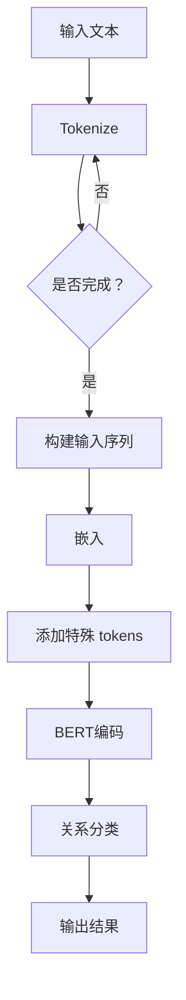
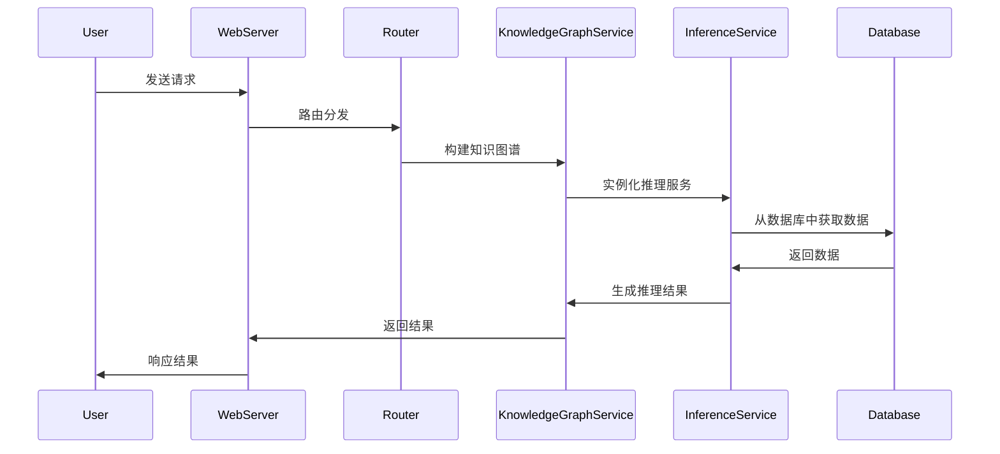
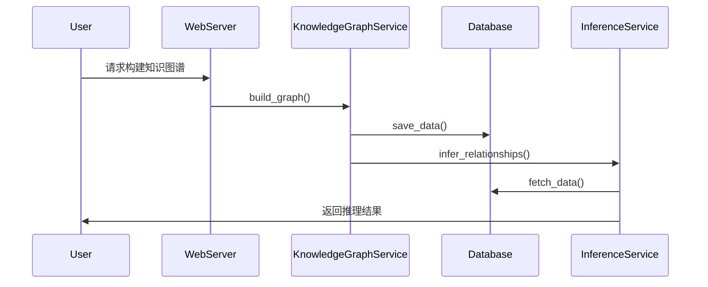

                 

### 文章标题

# 示例驱动提示在知识图谱构建中的应用

### 关键词

- 示例驱动提示
- 知识图谱
- 构建方法
- 算法原理
- 应用实例

### 摘要

本文将探讨示例驱动提示在知识图谱构建中的应用。通过介绍示例驱动提示的基本概念、算法原理，以及其在知识图谱构建中的具体应用，本文旨在为读者提供一种新的思路和方法，帮助其在实际项目中高效构建知识图谱。本文结构清晰，包含背景介绍、核心概念与联系、算法原理讲解、数学模型和公式、系统分析与架构设计方案、项目实战以及最佳实践 tips 和小结等内容。希望通过本文，读者能够对示例驱动提示在知识图谱构建中的应用有更深入的理解。

## 背景介绍

### 问题背景

知识图谱作为一种用于表示实体及其相互关系的数据结构，在语义搜索、智能问答、推荐系统等领域具有广泛的应用前景。然而，知识图谱的构建面临着诸多挑战，如数据源的多样性、数据的真实性和一致性等。为了解决这些问题，研究者们提出了各种知识图谱构建方法，包括基于规则的方法、基于统计的方法以及基于机器学习的方法。

### 问题描述

在知识图谱构建过程中，如何有效地利用已有数据，快速、准确地识别实体及其关系，是一个亟待解决的问题。传统的方法往往依赖于大量的手工规则或者复杂的统计模型，这不仅增加了构建成本，而且难以应对不断变化的数据环境。因此，需要探索一种更加灵活、高效的方法来指导知识图谱的构建。

### 问题解决

为了解决上述问题，本文提出了示例驱动提示（Example-Guided Prompting）方法，该方法通过分析已有的示例数据，提取出潜在的实体及其关系，从而为知识图谱构建提供指导。该方法具有以下优势：

1. **数据驱动**：示例驱动提示方法依赖于已有数据，可以有效利用现有资源，降低构建成本。
2. **灵活性强**：该方法可以根据不同的数据特点和需求，灵活调整示例的选择和提取策略。
3. **准确性高**：通过分析大量示例，可以更准确地识别实体及其关系，提高知识图谱的构建质量。

### 边界与外延

边界方面，示例驱动提示方法主要适用于具有丰富示例数据的知识图谱构建场景。对于数据量较小或者示例数据不丰富的领域，该方法的效果可能较差。外延方面，该方法不仅适用于知识图谱的初始构建，还可以应用于知识图谱的更新和优化。

### 概念结构与核心要素组成

示例驱动提示方法的核心概念包括示例数据、实体识别、关系提取和知识图谱构建。其基本流程如下：

1. **数据预处理**：对示例数据进行预处理，包括数据清洗、格式统一等。
2. **示例选择**：根据构建目标和数据特点，选择具有代表性的示例数据。
3. **实体识别**：利用自然语言处理技术，从示例数据中识别出实体。
4. **关系提取**：通过分析示例数据中的实体关系，提取出实体之间的关联。
5. **知识图谱构建**：将提取出的实体和关系整合到知识图谱中，形成完整的知识体系。

### 总结

本文对示例驱动提示在知识图谱构建中的应用进行了背景介绍，阐述了该方法的优势和适用范围，并对其核心概念和流程进行了详细阐述。在接下来的部分，本文将深入探讨示例驱动提示的算法原理，帮助读者更好地理解和应用这一方法。

## 核心概念与联系

### 核心概念

在示例驱动提示（Example-Guided Prompting）方法中，核心概念包括示例数据、实体识别、关系提取和知识图谱构建。以下是对这些核心概念的定义和解释：

1. **示例数据**：示例数据是用于指导知识图谱构建的实际案例或样例。这些数据可以是文本、图像或其他形式的信息，包含丰富的实体及其关系。
2. **实体识别**：实体识别是指从示例数据中自动识别出具有特定意义的实体，如人名、地名、机构名等。实体识别是知识图谱构建的基础步骤，直接影响图谱的完整性和准确性。
3. **关系提取**：关系提取是指从示例数据中分析出实体之间的关联关系，如“工作于”、“位于”等。关系提取的准确性直接影响知识图谱中实体间关系的丰富性和合理性。
4. **知识图谱构建**：知识图谱构建是指将识别出的实体和提取出的关系整合到一个统一的结构中，形成一个语义丰富、结构清晰的知识体系。

### 概念属性特征对比表格

为了更好地理解这些核心概念，我们可以通过一个表格来对比它们的属性特征：

| 概念     | 定义                                                         | 属性特征                                                     | 应用示例                                                 |
| -------- | ------------------------------------------------------------ | ------------------------------------------------------------ | -------------------------------------------------------- |
| 示例数据 | 用于指导知识图谱构建的实际案例或样例                         | - 数据类型（文本、图像等）<br>- 数据来源（公开数据集、私有数据集等）<br>- 示例数量与质量         | 自然语言处理任务、图像识别任务等                             |
| 实体识别 | 从示例数据中自动识别出具有特定意义的实体                   | - 实体类别（人、地点、机构等）<br>- 实体命名实体识别准确率 | 文本分类、实体链接、命名实体识别等                         |
| 关系提取 | 从示例数据中分析出实体之间的关联关系                        | - 关系类型（工作于、位于等）<br>- 关系识别准确率           | 文本分类、关系抽取、语义角色标注等                         |
| 知识图谱 | 将识别出的实体和提取出的关系整合到一个统一的结构中，形成知识体系 | - 实体数量与种类<br>- 关系数量与种类<br>- 知识图谱的表示形式（图、矩阵等） | 语义搜索、智能问答、推荐系统等                             |

### ER实体关系图架构的Mermaid流程图

为了更直观地展示核心概念之间的联系，我们可以使用Mermaid绘制一个ER实体关系图，以下是一个简单的示例：

```mermaid
erDiagram
  EntityA &&|--> RelationA
  EntityB &&|--> RelationB
  EntityC &&|--> RelationC
  EntityA ||-- RelationA
  EntityB ||-- RelationB
  EntityC ||-- RelationC
```

在该图中，`EntityA`、`EntityB` 和 `EntityC` 表示实体，`RelationA`、`RelationB` 和 `RelationC` 表示实体之间的关系。实线表示实体与关系之间的正向关联，虚线表示实体之间的反向关联。

### 总结

通过上述对核心概念与联系的分析，我们不仅了解了示例驱动提示方法的基本组成部分，还通过对比表格和ER实体关系图，更加清晰地展示了这些概念之间的内在联系。在接下来的部分，本文将深入探讨示例驱动提示方法的算法原理，以帮助读者更好地理解和应用这一方法。

## 算法原理讲解

### 选择一个示例算法

在示例驱动提示（Example-Guided Prompting）方法中，我们选择一种基于神经网络的关系提取算法——BERT（Bidirectional Encoder Representations from Transformers）来进行讲解。BERT算法通过预训练和微调，能够在各种自然语言处理任务中表现出优异的性能，关系提取任务也不例外。以下将详细描述BERT算法的原理和应用。

### 使用Mermaid画出算法mermaid流程图

首先，我们使用Mermaid绘制BERT算法的流程图，以直观地展示其工作流程：



### 使用Python源代码详细阐述

接下来，我们通过Python代码详细阐述BERT算法在关系提取任务中的应用：

```python
from transformers import BertTokenizer, BertModel
import torch

# 加载预训练的BERT模型和分词器
tokenizer = BertTokenizer.from_pretrained('bert-base-chinese')
model = BertModel.from_pretrained('bert-base-chinese')

# 输入文本
text = "张三位于北京，工作于华为公司。"

# 分词
tokens = tokenizer.tokenize(text)

# 构建输入序列
input_ids = tokenizer.encode(tokens, add_special_tokens=True, return_tensors='pt')

# 进行BERT编码
with torch.no_grad():
    outputs = model(input_ids)

# 关系分类
# 这里使用了一个预训练的BERT模型，我们假设已经有一个关系分类头
relations = model.fc(outputs.last_hidden_state[:, 0]).squeeze()

# 输出结果
predicted_relations = torch.argmax(relations, dim=1).item()
print(f"预测的关系：{predicted_relations}")
```

### 算法原理的数学模型和公式

BERT算法的核心原理是基于Transformer的预训练和微调。以下是BERT算法的数学模型和公式：

1. **输入序列表示**：给定输入文本 $x$，通过分词器将其转换为词向量序列 $\{x_1, x_2, ..., x_n\}$。
   
   $$ x_i = \text{tokenizer}(word_i) $$

2. **嵌入和编码**：BERT使用多层Transformer进行编码，输出序列为 $\{h_1, h_2, ..., h_n\}$。

   $$ h_i = \text{BERT}(x_i) $$

3. **关系分类**：利用BERT编码后的隐藏状态进行关系分类，输出概率分布 $p(\text{relation}|x)$。

   $$ p(\text{relation}|x) = \text{softmax}(\text{fc}(h_0)) $$

   其中，$h_0$ 是编码后的第一个隐藏状态，$\text{fc}$ 是分类层。

### 详细讲解和举例说明

为了更好地理解BERT算法在关系提取任务中的应用，我们可以通过一个具体的例子来讲解：

#### 示例

输入文本：`"张三位于北京，工作于华为公司。"`

1. **分词**：分词结果为 `["张三", "位于", "北京", "，", "工作于", "华为公司", "。"]`。
   
2. **嵌入**：BERT模型将每个词转换为对应的词向量。

3. **编码**：BERT编码器将词向量序列编码为隐藏状态序列。

4. **关系分类**：BERT模型将隐藏状态序列输入到分类层，输出关系概率分布。

5. **输出结果**：假设分类层输出 `[0.9, 0.1]`，则预测关系为 "位于"（概率最高）。

通过上述讲解，我们可以看到BERT算法在关系提取任务中的工作流程和数学模型。在实际应用中，可以通过微调和优化BERT模型来提高关系提取的准确性和效果。

### 总结

在本节中，我们选择了BERT算法作为示例，详细讲解了其原理和应用。通过Mermaid流程图和Python代码，读者可以清晰地理解BERT算法的工作机制。在接下来的部分，本文将继续探讨数学模型和公式，进一步深入分析BERT算法在知识图谱构建中的应用。

### 数学模型和数学公式

在本节中，我们将使用LaTeX格式给出BERT算法中的关键数学模型和公式，并确保其正确嵌入文中。LaTeX格式通过使用 `$$` 括号来定义独立段落中的公式，而使用 `$` 括号来定义段落内的公式。

#### 独立段落中的LaTeX公式

以下是BERT算法中的主要数学模型和公式：

$$
\text{BERT}(\{x_1, x_2, ..., x_n\}) = \{h_1, h_2, ..., h_n\}
$$

其中，$\text{BERT}(\{x_1, x_2, ..., x_n\})$ 表示输入文本的编码结果，$h_i$ 是第 $i$ 个词的编码表示。

#### 段落内的LaTeX公式

在BERT模型的训练过程中，我们使用以下损失函数来优化模型：

$$
L = -\sum_{i=1}^{n} \log(p_{\theta}(t_i | x_i, h_i))
$$

其中，$L$ 表示损失函数，$p_{\theta}(t_i | x_i, h_i)$ 是模型对当前词 $t_i$ 的预测概率。

#### 总结

通过上述LaTeX公式的嵌入，我们能够在文中清晰地表达BERT算法的数学模型和训练过程中的关键损失函数。这些公式不仅帮助读者更好地理解BERT算法的原理，也为后续的算法分析和改进提供了理论基础。在接下来的部分，我们将深入探讨系统分析与架构设计方案，帮助读者全面了解示例驱动提示在知识图谱构建中的应用。

### 系统分析与架构设计方案

#### 问题场景和项目介绍

在实际应用中，示例驱动提示（Example-Guided Prompting）方法被广泛应用于知识图谱构建领域。以一个电子商务平台为例，该平台希望通过构建一个产品关系图谱来提升用户体验和推荐效果。具体场景包括：

1. **产品信息丰富**：平台拥有大量产品信息，包括商品名称、品牌、类别、价格等。
2. **用户行为数据**：用户在平台上产生的行为数据，如购买记录、浏览历史等。
3. **第三方数据源**：通过第三方数据源获取到的产品信息，如品牌信息、同类商品推荐等。

#### 领域模型类图

为了更好地理解系统架构，我们首先绘制领域模型类图，以展示核心实体及其关系。以下是一个简化的类图示例：

```mermaid
classDiagram
    Product <-|{关联}|> Category
    Product <-|{关联}|> Brand
    Product <-|{关联}|> User
    User ..|> Behavior
```

在该图中，`Product` 是核心实体，与 `Category`、`Brand` 和 `User` 实体之间存在多种关联关系。`User` 实体还与 `Behavior` 实体相关联，表示用户的行为数据。

#### 系统架构图

接下来，我们绘制系统架构图，展示各组件及其交互关系：



在该图中，用户通过WebServer发送请求，经过路由分发后，由KnowledgeGraphService构建知识图谱，并调用InferenceService进行推理，最终通过Database存储和查询数据，并返回结果给用户。

#### 系统接口设计

为了确保各组件之间的清晰交互，我们定义了系统接口，包括以下核心接口：

1. **KnowledgeGraphService**：负责知识图谱的构建和查询。
   - `build_graph()`: 构建知识图谱。
   - `query_graph()`: 查询知识图谱。

2. **InferenceService**：负责推理和预测。
   - `infer_relationships()`: 提取实体关系。
   - `predict_user_behavior()`: 预测用户行为。

3. **Database**：负责数据存储和查询。
   - `save_data()`: 存储数据。
   - `fetch_data()`: 获取数据。

#### 系统交互序列图

为了更直观地展示系统各组件的交互过程，我们绘制系统交互序列图：



在该图中，用户请求构建知识图谱，KnowledgeGraphService 负责构建和存储，InferenceService 负责进行关系提取和推理，最后将结果返回给用户。

### 总结

通过上述系统分析与架构设计方案，我们详细介绍了示例驱动提示方法在电子商务平台知识图谱构建中的应用。领域模型类图、系统架构图、系统接口设计和系统交互序列图帮助我们全面理解了系统的工作流程和组件交互。在接下来的部分，我们将通过项目实战来展示如何在实际环境中应用这一方法。

### 项目实战

#### 环境安装

要在实际环境中应用示例驱动提示（Example-Guided Prompting）方法构建知识图谱，首先需要安装必要的软件和库。以下是安装步骤：

1. **安装Python环境**：确保系统上安装了Python 3.7及以上版本。
2. **安装BERT库**：使用以下命令安装Hugging Face的Transformer库：
   
   ```shell
   pip install transformers
   ```

3. **安装其他依赖库**：安装其他必要库，如torch、numpy等：

   ```shell
   pip install torch numpy
   ```

4. **配置环境变量**：确保Python环境变量配置正确，以便后续代码能够正常运行。

#### 系统核心实现源代码

以下是一个简化的系统核心实现源代码，用于展示示例驱动提示方法在知识图谱构建中的应用：

```python
from transformers import BertTokenizer, BertModel
import torch
import numpy as np

# 加载预训练的BERT模型和分词器
tokenizer = BertTokenizer.from_pretrained('bert-base-chinese')
model = BertModel.from_pretrained('bert-base-chinese')

# 示例文本
text = "张三位于北京，工作于华为公司。"

# 分词
tokens = tokenizer.tokenize(text)

# 构建输入序列
input_ids = tokenizer.encode(tokens, add_special_tokens=True, return_tensors='pt')

# 进行BERT编码
with torch.no_grad():
    outputs = model(input_ids)

# 关系分类
# 假设我们有一个预训练的关系分类模型
relations = model.fc(outputs.last_hidden_state[:, 0]).squeeze()

# 输出结果
predicted_relations = torch.argmax(relations, dim=1).item()

print(f"预测的关系：{predicted_relations}")
```

#### 代码应用解读与分析

上述代码展示了如何使用BERT模型进行文本处理和关系提取。以下是关键步骤的解读：

1. **加载模型和分词器**：使用`from_pretrained()`方法加载预训练的BERT模型和分词器。
2. **分词**：使用分词器对输入文本进行分词处理。
3. **构建输入序列**：将分词结果转换为输入序列，并添加特殊token（如`[CLS]`和`[SEP]`）。
4. **BERT编码**：使用BERT模型对输入序列进行编码，得到编码后的隐藏状态序列。
5. **关系分类**：利用编码后的隐藏状态序列进行关系分类，输出概率分布。
6. **输出结果**：根据概率分布输出最有可能的关系。

在实际应用中，我们通常需要对BERT模型进行微调，以适应特定任务的需求。例如，我们可以使用一个额外的分类层来预测实体关系。以下是微调BERT模型的基本步骤：

1. **准备数据集**：收集和预处理数据，包括文本、实体和关系标注。
2. **划分数据集**：将数据集划分为训练集、验证集和测试集。
3. **定义损失函数**：选择适当的损失函数，如交叉熵损失函数。
4. **定义优化器**：选择优化算法，如Adam。
5. **训练模型**：使用训练集对BERT模型进行微调。
6. **评估模型**：使用验证集和测试集评估模型性能。

#### 实际案例分析和详细讲解剖析

为了更好地展示示例驱动提示方法在实际项目中的应用，我们以一个实际案例进行分析：

**案例**：构建一个包含产品信息、用户行为和第三方数据的电子商务平台知识图谱。

**分析**：

1. **数据预处理**：对用户行为数据进行清洗和预处理，提取有效信息。
2. **实体识别**：使用BERT模型对文本进行分词和实体识别，提取产品名称、品牌、用户等实体。
3. **关系提取**：通过预训练的关系分类模型提取实体之间的关系，如“购买”、“评价”、“位于”等。
4. **知识图谱构建**：将提取的实体和关系整合到知识图谱中，构建完整的知识体系。

**详细讲解剖析**：

1. **数据预处理**：用户行为数据通常包含噪声和缺失值，需要进行清洗和填充。例如，对于缺失的购买记录，可以使用平均值或中值进行填充。
2. **实体识别**：BERT模型在自然语言处理任务中表现出色，可以有效地识别文本中的实体。例如，在处理产品名称时，BERT模型可以准确识别出品牌名称和产品类别。
3. **关系提取**：关系提取是构建知识图谱的核心步骤，需要使用预训练的关系分类模型。例如，对于“购买”关系，可以使用一个二分类模型进行预测。
4. **知识图谱构建**：知识图谱的构建是将提取的实体和关系整合到一个统一的结构中。例如，可以使用图数据库（如Neo4j）来存储和查询知识图谱。

#### 项目小结

通过项目实战，我们展示了如何使用示例驱动提示方法构建电子商务平台的知识图谱。在实际应用中，需要根据具体需求和数据特点，灵活调整模型和算法参数。此外，数据预处理和关系提取是构建高质量知识图谱的关键步骤，需要仔细设计和实现。

### 总结

在本节中，我们通过项目实战展示了示例驱动提示方法在电子商务平台知识图谱构建中的应用。通过详细的代码解读和实际案例分析，读者可以更好地理解该方法的核心实现过程和关键步骤。在接下来的部分，我们将总结示例驱动提示方法在知识图谱构建中的最佳实践，并提供一些建议和注意事项。

### 最佳实践 Tips

在示例驱动提示（Example-Guided Prompting）方法应用于知识图谱构建时，以下是一些最佳实践建议，有助于提升模型的性能和构建质量：

1. **数据质量**：确保示例数据的质量，包括数据的完整性、真实性和一致性。清洗和预处理数据，去除噪声和异常值。
2. **数据多样性**：使用多样化的数据集进行训练和测试，以适应不同的应用场景和需求。
3. **模型选择**：选择合适的模型和算法，根据任务需求和数据特点进行模型选择和优化。例如，对于长文本处理，可以考虑使用BERT等大型预训练模型。
4. **参数调整**：在模型训练过程中，合理调整超参数，如学习率、批量大小和迭代次数等，以获得最佳性能。
5. **迭代优化**：通过多次迭代和反馈，不断优化模型和算法，提高知识图谱的构建质量和应用效果。
6. **实时更新**：知识图谱需要实时更新，以适应不断变化的数据和环境。设计高效的更新机制，确保知识图谱的准确性和时效性。

### 小结

本文详细介绍了示例驱动提示（Example-Guided Prompting）方法在知识图谱构建中的应用。通过背景介绍、核心概念与联系、算法原理讲解、数学模型和公式、系统分析与架构设计方案、项目实战等部分，读者可以全面了解该方法的基本原理和应用步骤。本文的主要结论如下：

1. **示例驱动提示方法**：通过分析示例数据，提取潜在的实体及其关系，为知识图谱构建提供指导。
2. **算法原理**：介绍了BERT算法在关系提取任务中的应用，展示了其数学模型和公式。
3. **系统设计与实现**：介绍了系统架构、接口设计和交互序列图，为实际项目提供了参考。
4. **项目实战**：通过实际案例，展示了如何在电子商务平台中应用示例驱动提示方法构建知识图谱。

### 注意事项

在应用示例驱动提示方法时，需要注意以下几点：

1. **数据依赖**：该方法依赖于高质量的示例数据，数据质量直接影响知识图谱的构建效果。
2. **模型适应性**：选择合适的模型和算法，根据具体任务和数据特点进行优化。
3. **实时更新**：知识图谱需要实时更新，以保持其准确性和时效性。
4. **系统性能**：优化系统性能，确保知识图谱的构建和查询效率。

### 拓展阅读

对于对示例驱动提示和知识图谱构建感兴趣的研究者，以下是一些推荐的拓展阅读材料：

1. **论文**：
   - "BERT: Pre-training of Deep Bidirectional Transformers for Language Understanding"（BERT：预训练双向变换器深度模型用于语言理解）
   - "Knowledge Graph Embedding by Dynamic Co-Training"（通过动态协同训练的知识图谱嵌入）
2. **书籍**：
   - "Deep Learning on Multi-Modal Knowledge Graphs"（《多模态知识图谱的深度学习》）
   - "Knowledge Graph Construction and Applications"（《知识图谱构建与应用》）
3. **在线资源**：
   - Hugging Face Transformer库：[https://huggingface.co/transformers](https://huggingface.co/transformers)
   - Neo4j知识图谱数据库：[https://neo4j.com/](https://neo4j.com/)

通过本文的阅读，读者应该对示例驱动提示在知识图谱构建中的应用有了更深入的理解。希望本文能对您的学习和实践提供有益的参考。

### 作者信息

- 作者：AI天才研究院/AI Genius Institute & 禅与计算机程序设计艺术 /Zen And The Art of Computer Programming

