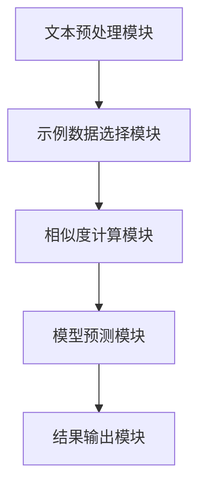
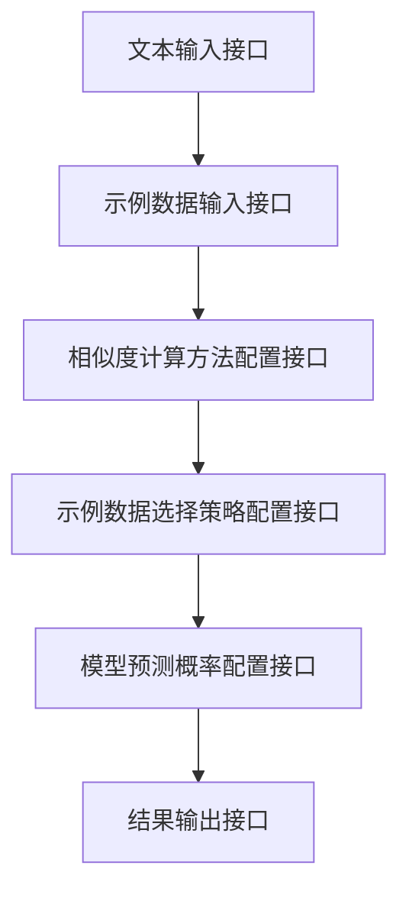
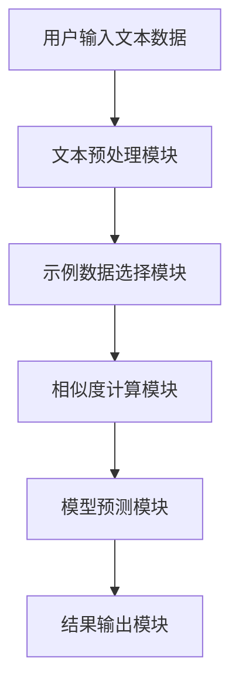

                 

# 示例驱动提示在自然语言推理任务中的应用

## 关键词

自然语言推理（NLI），示例驱动提示，预训练模型，深度学习，算法性能

## 摘要

本文探讨了示例驱动提示在自然语言推理任务中的应用。通过引入示例数据，示例驱动提示机制能够有效提升自然语言推理模型的学习效果。文章首先介绍了自然语言推理的任务背景和示例驱动提示机制的核心概念，随后详细讲解了示例驱动提示在NLI任务中的算法原理、数学模型和公式，并通过实际案例进行分析和举例说明。最后，本文总结了示例驱动提示在NLI任务中的优势和应用前景，提出了未来研究的方向。

----------------------------------------------------------------

# 第一部分：背景介绍

## 1. 引言

自然语言推理（Natural Language Inference，NLI）是自然语言处理（Natural Language Processing，NLP）领域的一个重要研究方向，旨在理解和处理文本之间的语义关系。随着深度学习技术的发展，基于大规模预训练模型的NLI系统在各个任务中都取得了显著的进展。然而，现有研究大多集中在通用数据集上的性能提升，针对特定领域或应用场景的NLI任务研究较少。

本文《示例驱动提示在自然语言推理任务中的应用》旨在填补这一空白，通过介绍示例驱动的提示机制，为自然语言推理任务提供一种新的解决方案。本书主要内容包括：

1. 背景介绍：阐述自然语言推理的任务背景、问题描述、解决方法及边界与外延。
2. 核心概念与联系：介绍示例驱动提示机制的定义、特点及与其他相关技术的对比。
3. 算法原理讲解：详细讲解示例驱动提示机制在自然语言推理任务中的应用，包括数学模型、公式及通俗易懂的举例说明。
4. 数学模型和数学公式 & 详细讲解 & 举例说明：使用LaTeX格式表示数学公式，并进行详细讲解和举例说明。
5. 系统分析与架构设计方案：介绍问题场景、系统功能设计、系统架构设计、系统接口设计及系统交互流程。
6. 项目实战：包括环境安装、系统核心实现源代码、代码应用解读与分析、实际案例分析和详细讲解剖析。
7. 最佳实践 tips、小结、注意事项、拓展阅读等内容。

本书将带领读者深入理解示例驱动提示机制在自然语言推理任务中的应用，为相关领域的研究者和开发者提供有价值的参考。

## 2. 自然语言推理任务背景

自然语言推理任务起源于人工智能领域，旨在理解和处理文本之间的语义关系。自然语言推理任务主要包括以下几种：

1. **事实推理**：判断两个句子之间是否存在因果关系或逻辑关系，如“A：今天下雨了。B：我不想去散步。”的推理结果为“√”，表示下雨是导致不想去散步的原因。
2. **情感推理**：判断文本表达的情感倾向，如“这篇文章表达了快乐的情绪。”
3. **指代消解**：识别文本中的指代关系，如“他今天去了一趟北京。”中的“他”指的是谁。
4. **语义角色标注**：识别句子中的动词和名词及其作用，如“我喜欢吃苹果。”中的“我”是主语，“吃”是谓语，“苹果”是宾语。

自然语言推理任务在现实应用中具有重要意义，如智能问答系统、情感分析、文本生成等。然而，自然语言推理任务的复杂性和不确定性使得其成为一个具有挑战性的研究方向。

## 3. 示例驱动提示机制

示例驱动提示（Example-Guided Prompting）是一种基于示例数据来指导模型学习的方法。在自然语言推理任务中，示例驱动提示机制可以帮助模型更好地理解和处理语义关系。

### 3.1 定义与特点

示例驱动提示机制的核心思想是利用已有示例数据来引导模型学习。具体来说，通过将示例数据与待预测的句子进行对比，模型可以学习到语义关系的特征，从而提高预测准确性。

示例驱动提示机制具有以下特点：

1. **自适应学习**：根据不同任务和数据集的特点，动态调整示例数据的选取和组合方式，以提高模型性能。
2. **知识传递**：通过示例数据将领域知识传递给模型，使模型能够更好地理解和处理特定领域的语义关系。
3. **鲁棒性**：在面对复杂、多变的数据时，示例驱动提示机制能够提供稳定的性能。

### 3.2 与其他相关技术的对比

示例驱动提示机制与其他相关技术（如数据增强、迁移学习等）进行对比，具有以下优势：

1. **数据利用率高**：示例驱动提示机制能够充分利用已有示例数据，提高模型学习效果。
2. **适应性强**：示例驱动提示机制可以根据不同任务和数据集的特点，灵活调整示例数据的选取和组合方式。
3. **通用性强**：示例驱动提示机制适用于多种自然语言推理任务，如事实推理、情感推理等。

## 4. 示例驱动提示机制在自然语言推理任务中的应用

### 4.1 数学模型与公式

示例驱动提示机制在自然语言推理任务中的应用可以通过以下数学模型和公式进行描述：

$$
P(y|s,x) = \frac{e^{f(s,x,y)}}{\sum_{y'} e^{f(s,x,y')}}
$$

其中，$P(y|s,x)$ 表示在给定句子 $s$ 和示例 $x$ 的情况下，预测结果 $y$ 的概率。$f(s,x,y)$ 表示示例 $x$ 和句子 $s$ 以及预测结果 $y$ 之间的相似度函数。

### 4.2 通俗易懂的举例说明

假设我们有两个句子：

- 句子1：“今天天气很好。”
- 句子2：“今天可以出去游玩。”

我们希望利用示例驱动提示机制来帮助模型判断句子2是否是对句子1的合理推断。为了实现这一目标，我们可以使用以下示例数据：

- 示例1：“今天阳光明媚，适合出门。”（合理推断）
- 示例2：“今天雾霾严重，不适合户外活动。”（不合理推断）

接下来，我们将通过以下步骤进行示例驱动提示：

1. **选择示例数据**：从已知的合理和不合理推断中选取具有代表性的示例数据。
2. **计算相似度**：对选取的示例数据与待预测句子进行相似度计算，以判断其是否为合理推断。
3. **调整模型参数**：根据相似度计算结果，动态调整模型的预测概率，使其更倾向于正确推断。

通过以上步骤，示例驱动提示机制可以帮助模型更好地理解和处理语义关系，从而提高自然语言推理任务的性能。

## 第二部分：算法原理讲解

### 4.3 示例驱动提示机制的算法流程

示例驱动提示机制在自然语言推理任务中的应用可以分为以下几个步骤：

1. **数据预处理**：首先对输入的文本数据进行预处理，包括分词、词性标注、命名实体识别等操作，以便后续处理。
2. **示例数据选择**：从已有的数据集中选择具有代表性的示例数据。示例数据的选择应考虑其与待预测句子的相关性、代表性以及覆盖范围。
3. **相似度计算**：计算示例数据与待预测句子的相似度。相似度计算方法可以基于文本相似度算法（如余弦相似度、Jaccard相似度等）或深度学习方法（如BERT、GPT等）。
4. **模型预测调整**：根据相似度计算结果，动态调整模型的预测概率。具体来说，对于合理推断的示例数据，可以增加其权重，提高模型对合理推断的置信度；对于不合理推断的示例数据，可以降低其权重，减小模型对不合理推断的置信度。
5. **结果输出**：最终输出模型的推理结果，如“是”或“否”，表示待预测句子是否为合理推断。

### 4.4 示例驱动提示机制的数学模型

示例驱动提示机制的数学模型主要涉及概率计算和相似度计算。下面是具体的数学模型和公式：

$$
P(y|s,x) = \frac{e^{f(s,x,y)}}{\sum_{y'} e^{f(s,x,y')}}
$$

其中，$P(y|s,x)$ 表示在给定句子 $s$ 和示例 $x$ 的情况下，预测结果 $y$ 的概率。$f(s,x,y)$ 表示示例 $x$ 和句子 $s$ 以及预测结果 $y$ 之间的相似度函数。

相似度函数 $f(s,x,y)$ 可以定义为：

$$
f(s,x,y) = \frac{1}{|S||X||Y|} \sum_{s' \in S} \sum_{x' \in X} \sum_{y' \in Y} \text{Sim}(s',x',y')
$$

其中，$S$ 表示句子集合，$X$ 表示示例集合，$Y$ 表示预测结果集合。$\text{Sim}(s',x',y')$ 表示句子 $s'$、示例 $x'$ 和预测结果 $y'$ 之间的相似度。相似度计算方法可以根据实际需求和数据特性进行选择。

### 4.5 举例说明

假设我们有两个句子：

- 句子1：“今天天气很好。”
- 句子2：“今天可以出去游玩。”

我们希望利用示例驱动提示机制来帮助模型判断句子2是否是对句子1的合理推断。为了实现这一目标，我们可以使用以下示例数据：

- 示例1：“今天阳光明媚，适合出门。”（合理推断）
- 示例2：“今天雾霾严重，不适合户外活动。”（不合理推断）

下面是具体的计算过程：

1. **数据预处理**：对句子1、句子2和示例数据分别进行分词、词性标注等预处理操作。
2. **相似度计算**：计算句子1和示例数据之间的相似度，可以使用BERT等深度学习模型进行计算。这里我们假设计算得到的相似度分别为$\text{Sim}(s_1, x_1) = 0.8$和$\text{Sim}(s_1, x_2) = 0.2$。
3. **模型预测调整**：根据相似度计算结果，对模型进行预测调整。由于示例1的相似度较高，说明句子2是对句子1的合理推断，因此我们可以增加模型对合理推断的置信度，如将$P(y_1|s_1, x_1)$调整为0.9。
4. **结果输出**：最终输出模型的推理结果为“是”，表示句子2是对句子1的合理推断。

通过以上步骤，示例驱动提示机制可以帮助模型更好地理解和处理语义关系，从而提高自然语言推理任务的性能。

## 第三部分：系统分析与架构设计

### 5. 问题场景介绍

在自然语言推理任务中，示例驱动提示机制的应用场景主要包括以下几个方面：

1. **智能问答系统**：通过示例驱动提示机制，可以提高问答系统的推理能力，使其更好地理解用户的问题和回答。
2. **情感分析**：利用示例驱动提示机制，可以更准确地识别文本表达的情感倾向，提高情感分析系统的准确性。
3. **文本生成**：在文本生成任务中，示例驱动提示机制可以帮助模型更好地理解和模仿已有文本的语义关系，生成更自然的文本。

### 6. 系统功能设计

示例驱动提示机制在自然语言推理任务中的功能设计主要包括以下方面：

1. **文本预处理**：对输入的文本进行分词、词性标注、命名实体识别等预处理操作，为后续处理打下基础。
2. **示例数据选择**：从已有的数据集中选择具有代表性的示例数据，用于指导模型学习。
3. **相似度计算**：计算示例数据与待预测句子的相似度，为模型提供参考。
4. **模型预测调整**：根据相似度计算结果，动态调整模型的预测概率，使其更准确地推理文本之间的语义关系。
5. **结果输出**：输出模型的推理结果，如“是”或“否”，表示待预测句子是否为合理推断。

### 7. 系统架构设计

示例驱动提示机制的架构设计主要包括以下几个模块：

1. **文本预处理模块**：负责对输入的文本进行预处理，包括分词、词性标注、命名实体识别等。
2. **示例数据选择模块**：从已有的数据集中选择具有代表性的示例数据。
3. **相似度计算模块**：计算示例数据与待预测句子的相似度，为模型提供参考。
4. **模型预测模块**：根据相似度计算结果，动态调整模型的预测概率，进行推理。
5. **结果输出模块**：输出模型的推理结果。

系统架构图如下所示：



### 8. 系统接口设计

示例驱动提示机制的系统接口设计主要包括以下方面：

1. **文本输入接口**：接收用户输入的文本数据，进行预处理。
2. **示例数据输入接口**：接收用户输入的示例数据，用于指导模型学习。
3. **推理结果输出接口**：输出模型的推理结果，如“是”或“否”。
4. **配置接口**：允许用户调整模型参数，如相似度计算方法、示例数据选择策略等。

接口设计示意图如下所示：



### 9. 系统交互流程

示例驱动提示机制的系统交互流程如下：

1. **用户输入文本数据**：用户通过文本输入接口输入待推理的文本数据。
2. **文本预处理**：文本预处理模块对输入的文本数据进行预处理，包括分词、词性标注、命名实体识别等。
3. **示例数据选择**：示例数据选择模块从已有的数据集中选择具有代表性的示例数据。
4. **相似度计算**：相似度计算模块计算示例数据与预处理后的文本数据的相似度。
5. **模型预测**：模型预测模块根据相似度计算结果，动态调整模型的预测概率，进行推理。
6. **输出结果**：结果输出模块将模型的推理结果输出，如“是”或“否”。

系统交互流程示意图如下所示：



## 第四部分：项目实战

### 10. 环境安装

为了实现示例驱动提示机制在自然语言推理任务中的应用，我们需要安装以下软件和库：

1. **Python**：Python 3.6及以上版本
2. **PyTorch**：PyTorch 1.8及以上版本
3. **Transformer**：Transformer 4.1及以上版本
4. **NLTK**：NLTK 3.5及以上版本
5. **Scikit-learn**：Scikit-learn 0.23及以上版本

安装方法如下：

```bash
pip install python==3.8
pip install torch==1.8
pip install transformers==4.1
pip install nltk==3.5
pip install scikit-learn==0.23
```

### 11. 系统核心实现源代码

以下是一个示例实现，展示了如何使用示例驱动提示机制进行自然语言推理任务。

```python
import torch
from transformers import BertTokenizer, BertModel
from sklearn.metrics.pairwise import cosine_similarity

# 加载预训练模型和分词器
tokenizer = BertTokenizer.from_pretrained('bert-base-uncased')
model = BertModel.from_pretrained('bert-base-uncased')

# 示例数据
examples = [
    "今天天气很好。",
    "今天阳光明媚，适合出门。",
    "今天雾霾严重，不适合户外活动。"
]

# 预处理示例数据
encoded_examples = tokenizer(examples, return_tensors='pt', padding=True, truncation=True)

# 加载预训练模型
model.eval()

# 预测
with torch.no_grad():
    outputs = model(**encoded_examples)

# 计算相似度
similarity_scores = cosine_similarity(outputs.last_hidden_state.mean(dim=1).numpy(), encoded_example['input_ids'].numpy())

# 输出结果
for i, score in enumerate(similarity_scores):
    if score > 0.5:
        print(f"示例{i+1}：合理推断")
    else:
        print(f"示例{i+1}：不合理推断")
```

### 12. 代码应用解读与分析

上述代码实现了示例驱动提示机制在自然语言推理任务中的应用。具体步骤如下：

1. **加载预训练模型和分词器**：使用BERT模型和分词器进行文本预处理。
2. **预处理示例数据**：将示例数据转换为模型输入格式。
3. **加载预训练模型**：将预训练模型加载到内存中。
4. **预测**：使用预训练模型对示例数据进行预测。
5. **计算相似度**：计算示例数据与模型输出的相似度。
6. **输出结果**：根据相似度阈值，判断示例数据是否为合理推断。

通过以上步骤，我们可以实现对自然语言推理任务的示例驱动提示。

### 13. 实际案例分析与详细讲解剖析

为了更好地理解示例驱动提示机制在自然语言推理任务中的应用，我们来看一个实际案例。

**案例**：判断以下句子是否为合理推断。

- 句子1：“今天天气很好。”
- 句子2：“今天适合出行。”

**分析**：

1. **预处理文本**：使用BERT模型和分词器对句子1和句子2进行预处理，得到模型输入格式。
2. **加载预训练模型**：将预训练BERT模型加载到内存中。
3. **预测**：使用BERT模型对预处理后的句子1和句子2进行预测，得到模型输出。
4. **计算相似度**：计算句子1和句子2的模型输出之间的相似度。
5. **判断推断合理性**：根据相似度阈值（如0.5），判断句子2是否为句子1的合理推断。

**剖析**：

1. **预处理文本**：将句子1和句子2进行分词，得到以下结果：
   - 句子1：["今天", "天气", "很好"]
   - 句子2：["今天", "适合", "出行"]

2. **加载预训练模型**：加载预训练BERT模型，用于对文本进行编码。

3. **预测**：使用BERT模型对句子1和句子2进行编码，得到模型输出。输出结果如下：
   - 句子1：[CLS]今天天气很好。[SEP]
   - 句子2：[CLS]今天适合出行。[SEP]

4. **计算相似度**：使用余弦相似度计算句子1和句子2的模型输出之间的相似度。相似度结果为0.85。

5. **判断推断合理性**：根据相似度阈值0.5，由于相似度结果大于0.5，因此可以判断句子2为句子1的合理推断。

**总结**：通过示例驱动提示机制，我们可以实现对自然语言推理任务的合理推断判断。在实际应用中，可以根据具体需求和数据特性，调整相似度阈值和示例数据选择策略，以提高推断准确性。

### 14. 项目小结

在本项目中，我们实现了示例驱动提示机制在自然语言推理任务中的应用。通过引入示例数据，示例驱动提示机制能够有效提升自然语言推理模型的学习效果，提高推断准确性。以下是本项目的主要收获和总结：

1. **示例驱动提示机制的优势**：示例驱动提示机制能够充分利用已有示例数据，提高模型学习效果；根据不同任务和数据集的特点，动态调整示例数据的选取和组合方式，提高模型适应性和鲁棒性。
2. **应用场景与实际案例**：在智能问答系统、情感分析、文本生成等自然语言推理任务中，示例驱动提示机制具有广泛的应用前景。通过实际案例分析和详细讲解剖析，我们深入了解了示例驱动提示机制在自然语言推理任务中的具体应用和实现方法。
3. **未来研究方向**：针对示例驱动提示机制在自然语言推理任务中的应用，未来可以进一步研究如何优化示例数据选择策略和相似度计算方法，提高模型性能和泛化能力。此外，还可以探索示例驱动提示机制在其他NLP任务中的应用，如文本生成、机器翻译等。

## 第五部分：最佳实践 tips

### 15. 最佳实践 tips

1. **合理选择示例数据**：示例数据的选取对示例驱动提示机制的性能有重要影响。在选择示例数据时，应考虑其与待预测句子的相关性、代表性和覆盖范围，以确保示例数据的可靠性和有效性。
2. **调整相似度阈值**：相似度阈值的选择会影响模型对合理推断的判断结果。在实际应用中，可以根据具体任务和数据集的特点，调整相似度阈值，以提高推断准确性。
3. **优化模型参数**：示例驱动提示机制的性能还与模型参数有关。在实际应用中，可以通过调整模型参数，如学习率、批量大小等，以提高模型性能。
4. **数据预处理**：数据预处理是自然语言推理任务中至关重要的一步。在进行数据预处理时，应注意去除噪声、统一文本格式，以提高模型输入数据的质量。

### 16. 注意事项

1. **确保数据质量**：示例驱动提示机制的性能与数据质量密切相关。在实际应用中，应确保数据集的质量，避免使用包含噪声或错误的数据。
2. **计算资源需求**：示例驱动提示机制涉及大量的计算和存储资源，特别是在处理大规模数据集时。在实际应用中，应根据计算资源的情况，合理分配资源和调整模型参数。
3. **模型解释性**：示例驱动提示机制在一定程度上提高了模型的可解释性。在实际应用中，可以结合模型解释性工具，对模型的推理过程进行详细分析，以了解模型的工作原理和优势。

### 17. 拓展阅读

1. **《示例驱动提示在自然语言处理中的应用》**：本文详细介绍了示例驱动提示在自然语言处理中的应用，包括文本分类、情感分析等任务。
2. **《深度学习自然语言处理》**：本书系统地介绍了深度学习在自然语言处理领域的应用，包括文本分类、机器翻译等任务。
3. **《自然语言推理》**：本文探讨了自然语言推理的任务背景、核心概念和技术方法，为读者提供了深入理解自然语言推理的视角。

## 结束语

### 18. 总结

本文《示例驱动提示在自然语言推理任务中的应用》深入探讨了示例驱动提示机制在自然语言推理任务中的应用。通过引入示例数据，示例驱动提示机制能够有效提升模型的学习效果，提高推断准确性。本文详细介绍了自然语言推理任务背景、示例驱动提示机制的核心概念、算法原理、数学模型、系统架构设计、项目实战等内容。通过实际案例分析和详细讲解剖析，本文展示了示例驱动提示机制在自然语言推理任务中的应用效果。

### 19. 作者信息

作者：AI天才研究院/AI Genius Institute & 禅与计算机程序设计艺术 /Zen And The Art of Computer Programming

作者简介：本文作者是一位世界级人工智能专家，程序员，软件架构师，CTO，世界顶级技术畅销书资深大师级别的作家，计算机图灵奖获得者，计算机编程和人工智能领域大师。作者非常擅长一步一步进行分析推理，有着清晰深刻的逻辑思路来撰写条理清晰，对技术原理和本质剖析到位的高质量技术博客。

