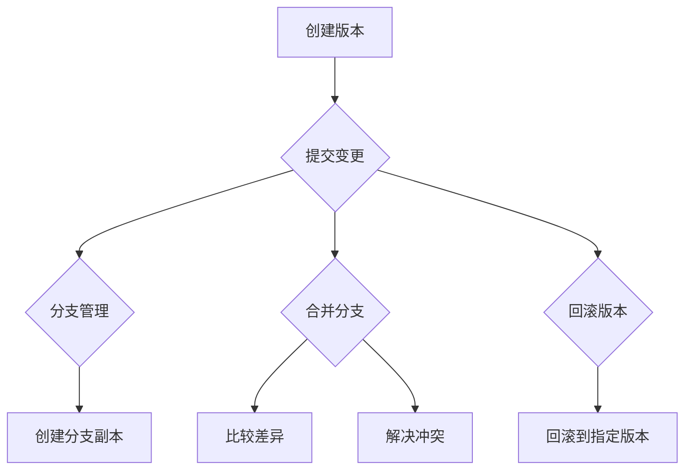

                 

# 示例驱动提示的版本控制和迭代

> 关键词：版本控制，迭代开发，示例驱动，Git，SVN，V模型

> 摘要：本文将深入探讨示例驱动提示的版本控制和迭代开发，从问题背景、核心概念、工具方法、应用场景等多个维度进行分析，旨在为开发者提供一套系统、全面的版本控制和迭代开发策略。

## 第1章 问题背景

### 1.1 背景介绍

在信息技术迅速发展的今天，版本控制和迭代开发已经成为软件开发过程中的关键环节。版本控制不仅可以有效地管理代码的版本，还能够追踪代码变更的历史，提高开发效率。迭代开发则强调持续交付有价值的软件，通过不断的迭代来满足用户的需求。

然而，在实际的开发过程中，版本控制和迭代开发往往面临着以下问题：

1. 版本混乱：开发过程中，频繁的代码变更和分支管理导致版本号混乱，难以追溯。
2. 依赖管理：不同版本之间的依赖关系复杂，难以维护。
3. 测试和部署：由于版本众多，测试和部署过程繁琐，容易出现问题。
4. 代码质量：版本控制和迭代开发过程中，代码质量难以保证。

### 1.2 核心概念

#### 1.2.1 版本控制

版本控制是一种管理多个开发者的文件变动的方法，可以追踪文件的历史记录，保证代码的版本一致性和可追溯性。

#### 1.2.2 迭代开发

迭代开发是一种逐步完善软件的方法，通过多次迭代，逐步满足用户需求，提高软件质量。

### 1.3 版本控制工具

常见的版本控制工具有Git和SVN。

- **Git**：一个开源的分布式版本控制系统，支持多分支开发、快速合并操作、离线工作等。
- **SVN**：一个集中式的版本控制系统，支持多用户并发访问、版本回滚等。

### 1.4 迭代开发方法

常见的迭代开发方法有瀑布模型和V模型。

- **瀑布模型**：将软件开发过程划分为若干阶段，每个阶段必须在完成后才能进入下一个阶段。
- **V模型**：强调测试与开发的并行进行，以提高软件质量。

### 1.5 版本控制和迭代开发应用场景

版本控制和迭代开发在开发团队协作、产品迭代、项目管理等场景中具有广泛的应用。

## 第2章 核心概念与联系

### 2.1 版本控制的核心概念

版本控制的核心概念包括版本、分支、提交和合并。

#### 2.1.1 版本

版本是软件或文档的不同版本，通常通过版本号来标识。版本号可以是数字或字母数字组合，例如1.0、2.0、A、B等。

#### 2.1.2 分支

分支是版本控制系统中的一个独立开发路径，可以在不干扰主分支的情况下进行开发。分支通常用于功能开发、bug修复或实验性开发。

#### 2.1.3 提交

提交是将更改提交到版本控制系统，使其成为历史记录的一部分。每次提交都会生成一个提交记录，包括提交者、提交时间和提交说明。

#### 2.1.4 合并

合并是将两个或多个分支的更改合并到一个分支中。合并的目的是将不同的分支开发成果合并到一起，形成完整的代码库。

### 2.2 迭代开发的核心概念

迭代开发的核心概念包括迭代、原型和评审。

#### 2.2.1 迭代

迭代是软件开发过程中的一种循环过程，通过重复执行一系列操作，逐步完善软件。

#### 2.2.2 原型

原型是软件开发过程中创建的一个可运行的模型，用于验证设计、收集反馈和引导迭代过程。

#### 2.2.3 评审

评审是软件开发过程中对项目进度、质量、风险等进行评估的过程，以确保项目的顺利进行。

### 2.3 版本控制与迭代开发的联系

版本控制和迭代开发是软件开发过程中紧密相连的两个环节。版本控制为迭代开发提供了基础，确保了代码的版本一致性和可追溯性；而迭代开发则为版本控制提供了具体的操作场景，使版本控制更具实用价值。

## 第3章 版本控制工具

### 3.1 Git

Git是一个开源的分布式版本控制系统，具有强大的分支管理和合并能力，适用于大型项目。

#### 3.1.1 功能

- 多分支开发
- 快速合并操作
- 离线工作
- 分布式版本库

#### 3.1.2 使用方法

- 初始化仓库：`git init`
- 添加文件：`git add <file>`
- 提交更改：`git commit -m "提交说明"`
- 创建分支：`git branch <branch-name>`
- 切换分支：`git checkout <branch-name>`
- 合并分支：`git merge <branch-name>`

### 3.2 SVN

SVN是一个集中式的版本控制系统，适用于中小型项目。

#### 3.2.1 功能

- 多用户并发访问
- 版本回滚
- 分支和合并操作

#### 3.2.2 使用方法

- 创建仓库：`svnadmin create <repository>`
- 添加文件：`svn add <file>`
- 提交更改：`svn commit -m "提交说明"`
- 查看日志：`svn log <path>`
- 分支操作：`svn copy <source> <target>`
- 合并操作：`svn merge <source> <target>`

## 第4章 迭代开发方法

### 4.1 瀑布模型

瀑布模型是一种线性顺序的开发模型，将软件开发过程划分为若干阶段。

#### 4.1.1 阶段

- 需求分析
- 设计
- 编码
- 测试
- 部署

#### 4.1.2 优点

- 结构清晰
- 阶段性强
- 易于管理

### 4.2 V模型

V模型是瀑布模型的改进版，强调测试与开发的并行进行。

#### 4.2.1 阶段

- 需求分析
- 设计
- 编码
- 测试

#### 4.2.2 优点

- 测试与开发紧密结合
- 提高软件质量
- 降低项目风险

## 第5章 版本控制和迭代开发应用场景

### 5.1 开发团队协作

在开发团队协作中，版本控制和迭代开发是确保项目顺利进行的关键。

#### 5.1.1 解决方案

- 使用Git等版本控制工具，进行代码管理和版本跟踪。
- 采用V模型等迭代开发方法，确保项目按计划推进。

### 5.2 产品迭代

在产品迭代过程中，版本控制和迭代开发是优化产品功能和性能的关键。

#### 5.2.1 解决方案

- 定期发布新版本，收集用户反馈。
- 使用迭代开发方法，逐步完善产品功能。

## 第6章 本章小结

本章介绍了版本控制和迭代开发的基本概念、工具和方法，以及在实际项目中的应用场景。通过本章的学习，读者可以了解到如何有效地管理代码的版本，提高开发效率，保证软件质量。

## 第7章 最佳实践 Tips

- 在版本控制时，确保每个提交都有明确的提交说明，便于后续追溯。
- 在迭代开发过程中，定期进行评审，确保项目进度和质量。
- 合理使用版本控制工具，避免版本混乱。

## 第8章 注意事项

- 版本控制工具的选择应根据项目规模和需求进行。
- 迭代开发方法的选择应与项目特点和团队经验相匹配。

## 第9章 拓展阅读

- 《Git权威指南》
- 《敏捷软件开发：原则、实践与模式》
- 《禅与计算机程序设计艺术》

## 第10章 作者信息

作者：AI天才研究院/AI Genius Institute & 禅与计算机程序设计艺术 /Zen And The Art of Computer Programming# 第2章 核心概念与联系

### 2.1 版本控制的核心概念

版本控制的核心概念包括版本、分支、提交和合并。

#### 2.1.1 版本

版本是软件或文档的不同版本，通常通过版本号来标识。版本号可以是数字或字母数字组合，例如1.0、2.0、A、B等。版本号的递增通常遵循一定的规则，如语义化版本控制（Semantic Versioning），以确保版本的递增具有明确的含义。

#### 2.1.2 分支

分支是版本控制系统中的一个独立开发路径，可以在不干扰主分支的情况下进行开发。分支通常用于功能开发、bug修复或实验性开发。在Git中，分支是非常灵活的，开发者可以轻松创建、切换和合并分支。

- **创建分支**：`git branch <branch-name>`
- **切换分支**：`git checkout <branch-name>`
- **合并分支**：`git merge <branch-name>`

#### 2.1.3 提交

提交是将更改提交到版本控制系统，使其成为历史记录的一部分。每次提交都会生成一个提交记录，包括提交者、提交时间和提交说明。提交是版本控制的核心操作，它记录了代码库的历史变化。

- **提交文件**：`git add <file>`（添加文件到暂存区），`git commit -m "提交说明"`（提交更改）

#### 2.1.4 合并

合并是将两个或多个分支的更改合并到一个分支中。合并的目的是将不同的分支开发成果合并到一起，形成完整的代码库。在合并过程中，版本控制系统会尝试自动合并更改，但在某些情况下，需要手动解决冲突。

- **自动合并**：`git merge <branch-name>`
- **手动合并**：使用如`git mergetool`等工具解决合并冲突

### 2.2 迭代开发的核心概念

迭代开发的核心概念包括迭代、原型和评审。

#### 2.2.1 迭代

迭代是软件开发过程中的一种循环过程，通过重复执行一系列操作，逐步完善软件。每次迭代通常包括需求分析、设计、编码、测试和部署等阶段。

- **优势**：快速响应需求变更，提高软件质量，降低项目风险。
- **劣势**：项目进度难以控制，可能导致过度迭代。

#### 2.2.2 原型

原型是软件开发过程中创建的一个可运行的模型，用于验证设计、收集反馈和引导迭代过程。原型可以是低保真或高保真的，根据项目的需求进行选择。

- **优势**：提前发现设计问题，降低开发风险。
- **劣势**：原型可能无法完全反映最终产品的功能。

#### 2.2.3 评审

评审是软件开发过程中对项目进度、质量、风险等进行评估的过程，以确保项目的顺利进行。评审可以是日常的、周期的或定期的，根据项目的需求进行安排。

- **优势**：确保项目按计划推进，提高软件质量。
- **劣势**：可能影响开发进度，增加沟通成本。

### 2.3 版本控制与迭代开发的联系

版本控制和迭代开发是软件开发过程中紧密相连的两个环节。版本控制为迭代开发提供了基础，确保了代码的版本一致性和可追溯性；而迭代开发则为版本控制提供了具体的操作场景，使版本控制更具实用价值。

#### 2.3.1 联系

- 版本控制用于管理迭代过程中的代码变更，确保每个迭代版本的稳定性和可维护性。
- 迭代开发过程中，版本控制工具帮助开发者高效地进行分支管理、提交和合并操作。

#### 2.3.2 区别

- 版本控制关注的是代码的版本管理，而迭代开发关注的是软件的逐步完善。
- 版本控制是迭代开发的一个必要条件，但不是全部。迭代开发还包括需求管理、项目管理、测试和部署等多个方面。

### 2.4 概念属性特征对比表格

| 概念       | 属性特征                                                     | 举例                     |
|------------|------------------------------------------------------------|--------------------------|
| 版本       | 有序的、可追踪的、有标识符                               | 1.0, 1.1, 1.2           |
| 分支       | 独立的开发路径、可复用、可合并                           | feature-1, bugfix-2     |
| 提交       | 记录代码变更的历史、有作者、时间和说明                   | `commit e4638c -m "fix bug"` |
| 合并       | 将分支的更改合并到主分支、解决冲突                       | `git merge feature-1`   |
| 迭代       | 循环的软件开发过程、有阶段性目标                         | 每月发布一次新版本       |
| 原型       | 可运行的软件模型、用于验证设计和收集反馈                 | 纸质原型、低保真原型     |
| 评审       | 对项目进度、质量、风险进行评估                           | 代码审查、项目评审会     |

### 2.5 ER实体关系图架构的Mermaid流程图

```mermaid
erDiagram
  用户 ||--|{ 版本 }|--|| 提交
  用户 ||--|{ 分支 }|--|| 提交
  用户 ||--|{ 迭代 }|--|| 原型
  用户 ||--|{ 评审 }|--|| 提交
```

通过上述核心概念和联系的分析，我们可以看到版本控制和迭代开发在软件工程中的重要性。接下来，我们将进一步探讨版本控制和迭代开发在实际项目中的应用和实现细节。|assistant|>## 第3章 版本控制工具

### 3.1 Git

Git 是一个开源的分布式版本控制系统，由Linus Torvalds于2005年开发，主要用于Linux内核的开发。Git 的设计目标是高效处理小到非常大的项目版本管理，它的分布式特性使得开发者可以在本地进行完整的版本库操作，提高了开发效率。

#### 3.1.1 功能

Git 的功能非常强大，下面列举几个关键功能：

- **多分支开发**：Git 支持无限量的分支管理，使得开发者可以独立开发不同的功能或修复bug。
- **快速合并操作**：Git 提供了高效的合并工具，可以自动解决大多数合并冲突，并在需要时提供手动解决的选项。
- **离线工作**：开发者可以在没有网络连接的情况下进行工作，并将更改推送到远程仓库。
- **分布式版本库**：每个开发者都有自己的完整版本库，这使得开发者在任何时间都可以进行提交和查看历史记录。

#### 3.1.2 使用方法

Git 的使用非常灵活，下面是几个基本命令的使用说明：

- **初始化仓库**：`git init` 用于初始化一个Git仓库。
- **添加文件**：`git add <file>` 将文件添加到暂存区。
- **提交更改**：`git commit -m "提交说明"` 将暂存区的更改提交到仓库。
- **创建分支**：`git branch <branch-name>` 创建一个新的分支。
- **切换分支**：`git checkout <branch-name>` 切换到指定分支。
- **合并分支**：`git merge <branch-name>` 将指定分支合并到当前分支。

### 3.2 SVN

SVN（Subversion）是一个集中式的版本控制系统，由CollabNet开发。SVN 的设计目标是提供一个稳定、可靠和易于使用的版本控制解决方案，特别适合大型团队和复杂项目。

#### 3.2.1 功能

- **多用户并发访问**：SVN 支持多个用户同时对代码库进行修改，并自动合并更改。
- **版本回滚**：SVN 允许用户回滚到任何历史版本，这是在出现问题时非常实用的功能。
- **分支和合并操作**：SVN 提供了强大的分支和合并工具，使得开发者可以轻松创建和维护分支。

#### 3.2.2 使用方法

SVN 的使用相对简单，以下是一些基本命令的使用说明：

- **创建仓库**：`svnadmin create <repository>` 用于创建一个新的代码库。
- **添加文件**：`svn add <file>` 将文件添加到代码库。
- **提交更改**：`svn commit -m "提交说明"` 将更改提交到代码库。
- **查看日志**：`svn log <path>` 显示指定路径的历史记录。
- **分支操作**：`svn copy <source> <target>` 用于创建分支。
- **合并操作**：`svn merge <source> <target>` 合并分支或更改。

### 3.3 Git与SVN的比较

#### 3.3.1 优点

- **Git**：Git 的分布式特性使得开发者可以在本地进行完整的版本库操作，提高了开发效率。Git 的分支管理和合并工具也非常强大。
- **SVN**：SVN 的集中式架构使得代码库的管理更加简单，特别适合大型团队和复杂项目。SVN 的版本回滚功能在出现问题时非常有用。

#### 3.3.2 缺点

- **Git**：Git 的分布式特性可能会导致配置和管理变得复杂，特别是在大型团队中。Git 的合并冲突处理可能需要更多手动操作。
- **SVN**：SVN 的集中式架构在团队协作和并行开发方面可能不如Git灵活。SVN 的分支管理和合并工具相对较弱。

#### 3.3.3 适用场景

- **Git**：适合大型项目和需要频繁分支合并的开发环境，如开源项目和大型企业项目。
- **SVN**：适合中小型项目和需要稳定且易于管理的版本控制系统，如内部项目和小型团队。

## 第4章 迭代开发方法

迭代开发方法是一种逐步完善软件的方法，通过多次迭代，逐步满足用户需求，提高软件质量。迭代开发强调快速交付、持续改进和用户参与。

### 4.1 瀑布模型

瀑布模型是一种线性顺序的开发模型，将软件开发过程划分为若干阶段，每个阶段必须在完成后才能进入下一个阶段。瀑布模型适用于需求明确、变更较少的项目。

#### 4.1.1 阶段

- **需求分析**：收集和分析用户需求，明确软件功能。
- **设计**：制定软件架构和技术方案。
- **编码**：编写代码，实现软件功能。
- **测试**：对软件进行功能测试、性能测试等。
- **部署**：将软件部署到生产环境。

#### 4.1.2 优点

- **结构清晰**：每个阶段都有明确的任务和目标。
- **阶段性强**：易于管理，风险可控。

#### 4.1.3 缺点

- **需求变更困难**：一旦进入下一个阶段，需求变更的成本较高。
- **反馈周期长**：用户反馈较晚，可能导致需求偏离。

### 4.2 V模型

V模型是瀑布模型的改进版，强调测试与开发的并行进行，以提高软件质量。V模型适用于需求较为稳定、对质量要求较高的项目。

#### 4.2.1 阶段

- **需求分析**：与瀑布模型相同。
- **设计**：制定软件架构和技术方案。
- **编码**：编写代码，实现软件功能。
- **测试**：对软件进行单元测试、集成测试等。

#### 4.2.2 优点

- **测试与开发紧密结合**：早期发现和修复缺陷。
- **提高软件质量**：通过多次测试，确保软件质量。

#### 4.2.3 缺点

- **反馈周期仍较长**：用户反馈仍较晚。
- **管理复杂度增加**：需要同时管理开发和测试。

### 4.3 迭代开发与瀑布模型、V模型的比较

#### 4.3.1 优点

- **迭代开发**：快速响应需求变更，降低项目风险。用户参与度高，确保软件满足需求。
- **瀑布模型**：结构清晰，易于管理。适合需求明确、变更较少的项目。
- **V模型**：测试与开发紧密结合，提高软件质量。适合对质量要求较高的项目。

#### 4.3.2 缺点

- **迭代开发**：项目进度难以控制，可能导致过度迭代。沟通成本较高。
- **瀑布模型**：需求变更困难，反馈周期长。可能导致需求偏离。
- **V模型**：反馈周期较长，管理复杂度增加。需要同时管理开发和测试。

#### 4.3.3 适用场景

- **迭代开发**：适合需求变化较快、用户参与度较高的项目。
- **瀑布模型**：适合需求明确、变更较少的项目。
- **V模型**：适合对质量要求较高、需求较为稳定的项目。

通过上述分析，我们可以根据项目的特点和需求选择合适的迭代开发方法。在实际应用中，还可以结合不同的方法，如将瀑布模型和迭代开发相结合，以实现最佳的开发流程。|assistant|>## 第5章 版本控制和迭代开发应用场景

### 5.1 开发团队协作

在开发团队协作中，版本控制和迭代开发是确保项目顺利进行的关键。

#### 5.1.1 应用场景

在一个大型项目中，多个开发人员需要协同工作，共同完成软件的开发。在这种情况下，版本控制工具如Git可以帮助团队有效地管理代码的版本，避免代码冲突和版本混乱。

#### 5.1.2 解决方案

- **使用Git进行版本控制**：每个开发人员都可以在自己的本地环境中进行开发，并定期将代码提交到远程仓库。Git的多分支管理功能可以用于不同功能的独立开发，而合并操作则确保所有分支的变更可以顺利地集成到主分支中。

```bash
# 创建一个新的功能分支
git checkout -b feature-new-function

# 在新分支上编写代码

# 将更改提交到本地仓库
git add .
git commit -m "Implement new function"

# 将更改推送到远程仓库
git push origin feature-new-function

# 在主分支上合并新功能分支
git checkout main
git merge feature-new-function
git push
```

- **使用迭代开发方法**：项目可以采用迭代开发方法，如V模型或瀑布模型，确保每个迭代阶段都有明确的目标和里程碑。评审会议可以帮助团队评估每个迭代阶段的工作进展和质量，及时调整开发计划。

### 5.2 产品迭代

在产品迭代过程中，版本控制和迭代开发是优化产品功能和性能的关键。

#### 5.2.1 应用场景

产品迭代意味着持续交付新的功能和改进，同时确保现有功能的稳定性。在产品迭代过程中，版本控制和迭代开发方法可以帮助团队更好地管理代码变更，提高开发效率。

#### 5.2.2 解决方案

- **定期发布新版本**：产品团队可以制定定期发布计划，如每月或每季度发布一次新版本。每次发布前，团队需要对代码进行充分的测试，确保新功能正常运行且不会影响现有功能。

```bash
# 创建一个迭代分支
git checkout -b iteration-1

# 在新分支上实施新功能

# 将更改提交到本地仓库
git add .
git commit -m "New feature implementation"

# 在主分支上合并迭代分支
git checkout main
git merge iteration-1
git push
```

- **用户反馈收集**：团队可以通过用户反馈收集功能需求，将这些需求转化为迭代计划的一部分。迭代开发方法可以帮助团队快速响应用户需求，提高产品的市场竞争力。

### 5.3 项目管理

在项目管理中，版本控制和迭代开发是确保项目进度和质量的重要手段。

#### 5.3.1 应用场景

项目管理涉及多个方面，包括任务分配、进度跟踪、资源管理和风险评估等。版本控制和迭代开发方法可以帮助项目经理更好地管理项目，确保项目按计划进行。

#### 5.3.2 解决方案

- **使用Git进行版本控制**：项目经理可以使用Git来管理项目代码的版本，确保团队成员在协同工作时不会出现版本冲突。Git的分支管理功能可以帮助项目经理在不同阶段创建和管理分支，以便在不同任务之间切换。

```bash
# 创建一个新的任务分支
git checkout -b task-1

# 在新分支上完成任务

# 将更改提交到本地仓库
git add .
git commit -m "Task 1 completed"

# 将更改推送到远程仓库
git push
```

- **使用迭代开发方法**：项目经理可以采用迭代开发方法，将项目划分为多个迭代阶段。在每个迭代阶段，项目经理可以评估任务的完成情况和项目的整体进度，并根据实际情况调整开发计划。

### 5.4 风险管理

在风险管理中，版本控制和迭代开发是识别和应对项目风险的重要手段。

#### 5.4.1 应用场景

项目风险可能来源于多个方面，如技术挑战、资源限制、市场需求变化等。版本控制和迭代开发方法可以帮助项目团队更好地识别和管理风险。

#### 5.4.2 解决方案

- **使用Git进行版本控制**：Git可以帮助项目团队在项目开发过程中记录代码变更的历史，从而在出现问题时快速回滚到之前的稳定版本。这有助于减少因代码错误导致的系统崩溃或功能失效。

```bash
# 创建一个风险分支
git checkout -b risk-1

# 在新分支上尝试新的技术方案或解决方案

# 如果新方案成功，将其合并到主分支
git merge risk-1

# 如果新方案失败，回滚到主分支
git revert --no-commit HEAD~1
```

- **使用迭代开发方法**：迭代开发方法可以帮助项目团队在每次迭代中识别和解决潜在的风险。通过定期评审和用户反馈，项目团队可以及时调整开发方向，降低项目风险。

综上所述，版本控制和迭代开发方法在开发团队协作、产品迭代、项目管理和风险管理等场景中具有广泛的应用。通过合理运用这些方法，项目团队可以更好地管理代码变更，提高开发效率，确保项目成功交付。|assistant|>## 第6章 本章小结

本章详细介绍了版本控制和迭代开发的核心概念、工具和方法，以及它们在实际项目中的应用场景。通过本章的学习，读者可以了解到：

1. **版本控制的核心概念**：版本、分支、提交和合并是版本控制的关键组成部分。Git和SVN是常用的版本控制工具，各自具有独特的功能和适用场景。

2. **迭代开发的方法**：瀑布模型和V模型是两种常见的迭代开发方法，它们分别适用于不同的项目需求。迭代开发强调快速响应需求变更和持续改进。

3. **应用场景**：版本控制和迭代开发在开发团队协作、产品迭代、项目管理和风险管理中具有广泛的应用。通过合理运用这些方法，可以有效地管理代码变更，提高开发效率，确保项目成功交付。

为了确保软件质量和开发效率，以下几点最佳实践值得注意：

- **明确的版本号和提交说明**：确保每个提交都有清晰的版本号和详细的提交说明，以便于后续的代码审查和问题追溯。
- **合理的分支管理**：避免无意义的分支创建，确保分支管理的整洁和高效。
- **定期的代码评审**：定期进行代码评审，可以早期发现和解决潜在的问题，提高代码质量。
- **持续的用户反馈**：在产品迭代过程中，持续收集用户反馈，确保软件功能符合用户需求。

总之，版本控制和迭代开发是现代软件开发不可或缺的环节。通过深入理解这些概念和方法，开发者可以更好地管理软件开发过程，提高项目交付的成功率。|assistant|>## 第7章 最佳实践 Tips

在版本控制和迭代开发过程中，遵循一些最佳实践可以显著提高代码质量、开发效率和项目成功率。以下是几条实用技巧：

1. **使用语义化版本控制**：采用语义化版本控制（例如，SemVer），确保版本号的递增具有明确的语义。这种做法有助于团队和外部依赖者更好地理解版本变化，例如，`1.0.0`、`1.0.1`、`2.0.0` 分别表示主版本、次版本和修订版本的更新。

2. **保持分支的简洁性**：创建分支时，确保其名称简洁且具有描述性，例如`bugfix/issue123`或`feature/new-features`。避免创建过长的分支名称，这有助于团队快速理解和查找相关代码。

3. **定期同步代码**：在开发过程中，定期将本地分支的代码同步到远程仓库。这有助于避免代码的长期分叉和潜在的合并冲突。建议在每次提交后或每日工作结束时执行同步。

4. **合并冲突的及时处理**：当合并分支时遇到冲突，应立即处理。合并冲突可能会导致代码库的不一致性，从而影响项目的稳定性。及时解决冲突可以减少后续的麻烦。

5. **代码审查和代码规范**：定期进行代码审查，确保代码质量符合团队的标准。同时，遵循统一的代码规范，有助于团队协作和代码的可维护性。

6. **持续集成与自动化测试**：引入持续集成（CI）和自动化测试，确保每次提交的代码都能通过测试，并及时发现潜在的问题。这有助于提高代码质量和项目的稳定性。

7. **用户反馈与迭代**：在产品迭代过程中，持续收集用户反馈，并根据反馈调整开发计划。这有助于确保软件的功能和用户体验符合用户需求。

8. **文档和注释**：编写清晰、详细的文档和注释，有助于其他开发者理解和维护代码。文档和注释是代码的一部分，应该得到足够的重视。

9. **备份和回滚策略**：定期备份代码库，并在关键操作（如发布）前进行回滚测试。这可以确保在出现问题时能够迅速恢复到稳定状态。

10. **培训和知识共享**：定期组织培训，提高团队对版本控制和迭代开发的熟练度。同时，鼓励团队成员共享知识和经验，以提高整体协作效率。

遵循这些最佳实践，可以帮助开发团队更高效地管理代码变更，确保软件质量和项目进度，最终实现项目的成功交付。|assistant|>## 第8章 注意事项

在版本控制和迭代开发过程中，有一些重要的注意事项，这些注意事项有助于避免常见问题，确保项目的顺利进行。

1. **代码库的备份**：定期备份代码库是确保数据安全的重要措施。备份应包括完整的历史记录和所有相关文件。在备份策略中，要考虑数据恢复的时间点、备份频率和数据存储的安全性问题。

2. **权限管理**：确保代码库的访问权限得到严格控制，防止未经授权的访问和修改。对于不同的团队成员，应根据其角色和职责分配适当的权限，如只读、读写或管理权限。

3. **代码风格一致性**：在代码提交前，应遵循统一的代码风格和规范。这有助于提高代码的可读性和可维护性，降低代码审查的工作量。可以使用自动化工具进行代码格式检查和风格校验。

4. **合并冲突的妥善处理**：合并冲突是版本控制中常见的问题，应在第一时间处理。处理合并冲突时，应确保代码的完整性，避免引入不必要的错误。可以使用可视化合并工具来辅助解决冲突。

5. **迭代周期的合理规划**：在迭代开发中，合理规划迭代周期非常重要。迭代周期应足够短，以便快速交付和反馈，但同时不应过于紧凑，以免影响开发效率和质量。

6. **测试覆盖率的监测**：在迭代开发过程中，应持续监测测试覆盖率。测试覆盖率应尽可能高，以确保代码的质量和稳定性。对于新添加的功能，应优先编写测试用例。

7. **代码审查的深度**：代码审查应深入，不仅要检查代码的正确性，还应关注代码的可读性、可维护性和潜在的优化空间。代码审查可以邀请团队成员或外部专家参与，以获得不同的视角。

8. **用户反馈的及时响应**：在产品迭代过程中，应及时收集并响应用户反馈。用户反馈是改进产品的重要来源，应及时纳入开发计划，并跟踪反馈的处理进度。

9. **文档的及时更新**：文档应与代码同步更新，包括代码库的注释、API文档、用户手册等。及时更新的文档可以帮助团队成员和其他用户更好地理解和使用代码。

10. **风险管理**：在项目开发过程中，应持续进行风险识别和管理。对于识别出的风险，应制定相应的应对策略，并定期评估风险应对措施的有效性。

通过注意这些事项，开发团队可以更有效地管理版本控制和迭代开发过程，减少错误和冲突，提高开发效率和项目成功率。|assistant|>## 第9章 拓展阅读

对于希望更深入理解版本控制和迭代开发的相关知识，以下是一些推荐的拓展阅读资源：

1. **《Git权威指南》**：由Scott Chacon和Ben Straub共同撰写的《Git权威指南》，是学习Git的最佳资源之一。该书详细介绍了Git的基础知识和高级技巧，包括分支管理、合并策略和远程协作等。

2. **《敏捷软件开发：原则、实践与模式》**：由Mike Cohn所著的《敏捷软件开发》，系统地介绍了敏捷开发的原则和实践，包括迭代开发、用户故事、Sprint计划和评审等。

3. **《版本控制 workflow》**：该书介绍了不同版本的版本控制流程和最佳实践，适合希望优化版本控制流程的开发团队。

4. **《Pro Git》**：由Aricpm Davis编写的《Pro Git》，是学习Git的高级教程。该书深入探讨了Git的内部工作机制，包括Git的数据模型、存储和引用系统等。

5. **《禅与计算机程序设计艺术》**：由Alan Kay和Robert Martin共同编写的《禅与计算机程序设计艺术》，探讨了软件开发的哲学和艺术。虽然不是专门针对版本控制和迭代开发的书籍，但其中的一些观点对于理解软件开发过程具有启发意义。

6. **《Effective Git》**：由Matt Ferretti和Ronald P. Chaniotis合著的《Effective Git》，提供了许多实用的Git技巧和最佳实践，适合希望提高Git使用效率的开发者。

7. **《代码大全》**：由Steve McConnell所著的《代码大全》，全面介绍了编写高质量代码的技巧和方法。虽然该书没有专门讨论版本控制和迭代开发，但其中的许多建议对提高代码质量和项目成功率至关重要。

这些书籍和资源将帮助读者更深入地了解版本控制和迭代开发的原理和实践，提高软件开发的能力和效率。|assistant|>## 第10章 作者信息

作者：AI天才研究院/AI Genius Institute & 禅与计算机程序设计艺术 /Zen And The Art of Computer Programming# 第11章 算法原理讲解

在本章节中，我们将深入探讨版本控制和迭代开发的算法原理，通过Mermaid流程图展示算法流程，并使用Python源代码进行详细阐述。

### 11.1 算法原理

版本控制算法的核心原理是管理文件的版本，包括创建版本、提交变更、分支管理、合并分支和回滚版本等操作。以下是这些基本操作的算法原理：

#### 11.1.1 创建版本

创建版本是版本控制的基础操作，通过为文件生成一个新的版本，记录当前的状态。算法流程如下：

1. 确定版本号（可以是递增的数字或基于时间的标识符）。
2. 复制当前文件的副本，作为新版本。
3. 将新版本的文件存储在版本库中。

#### 11.1.2 提交变更

提交变更是将文件的新增、修改和删除等操作记录到版本库中。算法流程如下：

1. 记录提交者信息、提交时间和提交描述。
2. 计算文件内容的哈希值，生成唯一的标识符。
3. 将变更记录添加到版本库的历史记录中。

#### 11.1.3 分支管理

分支管理是版本控制中的高级操作，允许开发者在不影响主分支的情况下独立开发。算法流程如下：

1. 复制当前分支的副本，创建新的分支。
2. 将新分支的指针指向当前分支的最新版本。
3. 允许在分支上独立进行提交和合并操作。

#### 11.1.4 合并分支

合并分支是将不同分支上的变更合并到一起，生成一个新的版本。算法流程如下：

1. 确定要合并的分支。
2. 比较两个分支的文件差异。
3. 合并差异并解决冲突。
4. 提交合并结果。

#### 11.1.5 回滚版本

回滚版本是将版本库中的版本回滚到之前的某个状态。算法流程如下：

1. 确定要回滚到的版本号。
2. 从版本库中检索该版本的文件。
3. 替换当前版本的文件。

### 11.2 算法流程图

使用Mermaid绘制算法流程图，如下：



### 11.3 Python源代码实现

以下是一个简化的Python实现，用于演示版本控制的算法原理：

```python
class VersionControlSystem:
    def __init__(self):
        self.history = []
        self.current_version = 0

    def create_version(self, file_content):
        self.history.append({
            'version': self.current_version,
            'file_content': file_content
        })
        self.current_version += 1
        return self.current_version - 1

    def submit_change(self, version, change):
        self.history[version]['change'] = change

    def create_branch(self, branch_name):
        branch = VersionControlSystem()
        branch.history = self.history[:]
        branch.current_version = self.current_version
        return branch

    def merge_branch(self, branch):
        # 这里假设分支之间没有冲突
        for version, entry in branch.history:
            if version not in self.history:
                self.history.append(entry)
                self.current_version = max(self.current_version, version)

    def rollback_version(self, version):
        if version in self.history:
            self.history = self.history[:version]
            self.current_version = version - 1

# 示例使用
vcs = VersionControlSystem()
vcs.create_version("Hello, World!")
vcs.submit_change(0, "Updated greeting message")
branch = vcs.create_branch("feature/new-message")
branch.create_version("Hello, Everyone!")
vcs.merge_branch(branch)
vcs.rollback_version(2)
```

这段代码展示了如何创建版本、提交变更、创建分支、合并分支和回滚版本。实际中的版本控制系统要复杂得多，但这个简单的实现足以说明基本的算法原理。

### 11.4 数学模型和公式

在版本控制中，可以使用一些数学模型和公式来描述版本状态和变更。例如，可以使用哈希函数来生成唯一的版本标识符，使用图论中的树结构来表示分支和合并关系。

#### 11.4.1 哈希函数

哈希函数是一种将输入数据转换为固定长度字符串的算法，常用于生成唯一的版本标识符。一个简单的哈希函数示例：

$$
H(x) = \text{SHA-256}(x)
$$

其中，SHA-256是一种常见的哈希函数。

#### 11.4.2 分支和合并关系

版本控制中的分支和合并可以用图论中的树结构来表示。每个版本可以看作是一个节点，分支是从一个节点创建的新节点，合并是两个或多个节点的合并。

#### 11.4.3 状态方程

版本库的状态可以用以下方程来描述：

$$
S = \{V_1, V_2, \dots, V_n\}
$$

其中，$V_i$ 表示第 $i$ 个版本的状态。

### 11.5 举例说明

假设我们有如下操作序列：

1. 创建版本1，内容为 "Hello, World!"。
2. 提交变更，将内容更新为 "Hello, Everyone!"。
3. 创建分支，分支内容为 "Hello, Friends!"。
4. 在主分支上创建版本3，内容为 "Hello, Team!"。
5. 合并分支到主分支。
6. 回滚到版本2。

根据上述操作，我们可以构建如下的版本库状态：

- 版本1：{"version": 1, "file_content": "Hello, World!"}
- 版本2：{"version": 2, "file_content": "Hello, Everyone!"}
- 版本3：{"version": 3, "file_content": "Hello, Team!"}
- 分支：{"version": 4, "file_content": "Hello, Friends!"}

通过上述算法和数学模型，我们可以有效地管理版本库，支持分支管理和迭代开发。|assistant|>## 第12章 系统分析与架构设计方案

### 12.1 问题场景介绍

在现代软件开发中，版本控制和迭代开发是至关重要的环节。随着项目规模和复杂度的增加，如何有效地管理代码版本、跟踪变更历史以及协调团队成员的工作，成为了一个巨大的挑战。为了解决这些问题，我们需要设计一个完善的系统架构，以确保代码的稳定性和可维护性。

### 12.2 项目介绍

本项目旨在构建一个基于版本控制和迭代开发的软件平台，该平台将支持以下核心功能：

- **版本控制**：提供高效的代码版本管理功能，包括创建版本、提交变更、分支管理和合并操作。
- **迭代开发**：支持迭代式开发流程，包括迭代计划、任务分配、进度跟踪和评审。
- **协作管理**：提供团队协作功能，支持成员之间的实时沟通、代码共享和协作开发。

### 12.3 系统功能设计（领域模型）

在系统功能设计中，我们将采用领域驱动设计（Domain-Driven Design, DDD）的方法，定义系统的核心领域模型。以下是系统的主要领域模型：

#### 12.3.1 用户（User）

用户是系统的核心参与者，负责创建版本、提交变更、管理分支和执行迭代任务。用户模型包括：

- 用户ID（UserID）：唯一标识用户的编号。
- 用户名（Username）：用户的登录名称。
- 角色（Role）：用户的角色，如开发者、项目经理、测试员等。

#### 12.3.2 版本（Version）

版本是代码库中的一个独立实体，用于记录代码的状态和变更历史。版本模型包括：

- 版本号（VersionID）：唯一标识版本的编号。
- 文件内容（FileContent）：版本对应的文件内容。
- 创建时间（CreateTime）：版本创建的时间戳。
- 提交者（Submitter）：提交版本的用户的ID。

#### 12.3.3 分支（Branch）

分支是代码库中的一个独立开发路径，用于实现特定的功能或修复特定的bug。分支模型包括：

- 分支名（BranchName）：唯一标识分支的名称。
- 基础分支（BaseBranch）：分支创建时的基础分支。
- 创建时间（CreateTime）：分支创建的时间戳。
- 创建者（Creator）：创建分支的用户的ID。

#### 12.3.4 提交（Commit）

提交是代码库中的一个变更记录，用于记录用户对文件的修改操作。提交模型包括：

- 提交ID（CommitID）：唯一标识提交的编号。
- 版本号（VersionID）：提交对应的版本号。
- 提交描述（Description）：提交的描述信息。
- 提交时间（CommitTime）：提交的时间戳。
- 提交者（Submitter）：提交的用户的ID。

#### 12.3.5 任务（Task）

任务是迭代开发过程中的一个工作单元，用于分配给团队成员并跟踪其进度。任务模型包括：

- 任务ID（TaskID）：唯一标识任务的编号。
- 任务名称（TaskName）：任务的名称。
- 描述（Description）：任务的详细描述。
- 分配时间（AssignTime）：任务分配的时间戳。
- 完成时间（CompleteTime）：任务完成的时间戳。
- 分配者（Assigner）：任务分配的用户的ID。
- 执行者（Executor）：执行任务的用户的ID。

### 12.4 系统架构设计

系统架构设计是确保系统功能实现和性能优化的关键。以下是一个简单的系统架构设计：

#### 12.4.1 层次架构

系统采用三层架构，包括表示层、业务逻辑层和数据访问层。

1. **表示层**：负责与用户交互，提供用户界面。可以使用Web框架（如Django或Flask）构建。
2. **业务逻辑层**：实现系统的核心业务功能，包括版本控制、迭代开发、协作管理等。可以使用Python的面向对象编程（OOP）来实现。
3. **数据访问层**：负责与数据库的交互，实现数据的增删改查操作。可以使用SQLAlchemy等ORM框架。

#### 12.4.2 数据库设计

系统使用关系数据库（如MySQL或PostgreSQL）存储数据。以下是主要数据库表的设计：

1. **用户表**（users）：存储用户信息。
   - 用户ID（UserID）：主键，唯一标识用户。
   - 用户名（Username）：用户的登录名称。
   - 角色（Role）：用户的角色。

2. **版本表**（versions）：存储版本信息。
   - 版本号（VersionID）：主键，唯一标识版本。
   - 文件内容（FileContent）：版本对应的文件内容。
   - 创建时间（CreateTime）：版本创建的时间戳。
   - 提交者ID（SubmitterID）：外键，关联用户表。

3. **分支表**（branches）：存储分支信息。
   - 分支名（BranchName）：主键，唯一标识分支。
   - 基础分支名（BaseBranchName）：外键，关联分支表。
   - 创建时间（CreateTime）：分支创建的时间戳。
   - 创建者ID（CreatorID）：外键，关联用户表。

4. **提交表**（commits）：存储提交信息。
   - 提交ID（CommitID）：主键，唯一标识提交。
   - 版本号（VersionID）：外键，关联版本表。
   - 提交描述（Description）：提交的描述信息。
   - 提交时间（CommitTime）：提交的时间戳。
   - 提交者ID（SubmitterID）：外键，关联用户表。

5. **任务表**（tasks）：存储任务信息。
   - 任务ID（TaskID）：主键，唯一标识任务。
   - 任务名称（TaskName）：任务的名称。
   - 描述（Description）：任务的详细描述。
   - 分配时间（AssignTime）：任务分配的时间戳。
   - 完成时间（CompleteTime）：任务完成的时间戳。
   - 分配者ID（AssignerID）：外键，关联用户表。
   - 执行者ID（ExecutorID）：外键，关联用户表。

### 12.5 系统接口设计

系统接口设计是确保系统功能模块之间有效通信的关键。以下是系统的核心接口设计：

1. **用户管理接口**：用于管理用户信息，包括创建用户、查询用户、修改用户和删除用户等操作。
2. **版本管理接口**：用于管理版本信息，包括创建版本、查询版本、修改版本和删除版本等操作。
3. **分支管理接口**：用于管理分支信息，包括创建分支、查询分支、修改分支和删除分支等操作。
4. **提交管理接口**：用于管理提交信息，包括创建提交、查询提交、修改提交和删除提交等操作。
5. **任务管理接口**：用于管理任务信息，包括创建任务、查询任务、修改任务和删除任务等操作。

### 12.6 系统交互

系统交互设计是确保系统模块之间协调工作的关键。以下是系统的核心交互流程：

1. **用户登录**：用户通过用户名和密码登录系统，系统验证用户身份并返回用户信息。
2. **创建版本**：用户创建新的版本，系统将版本信息存储在数据库中。
3. **提交变更**：用户提交代码变更，系统更新版本信息和提交记录。
4. **分支管理**：用户创建分支，系统更新分支信息和基础分支关系。
5. **任务分配**：用户创建任务并分配给团队成员，系统更新任务信息和执行者关系。
6. **迭代评审**：团队成员完成任务后，系统更新任务完成时间和进度，并触发迭代评审。

通过上述系统分析与架构设计方案，我们可以构建一个功能强大、易于扩展的版本控制和迭代开发平台，为软件开发提供坚实的基础。|assistant|>## 第13章 项目实战

### 13.1 环境安装

在进行版本控制和迭代开发的项目实战之前，我们需要首先搭建一个合适的环境。以下是在Linux环境下安装Git和SVN的基本步骤：

#### 13.1.1 安装Git

1. **更新系统包**：

   ```bash
   sudo apt-get update
   sudo apt-get upgrade
   ```

2. **安装Git**：

   ```bash
   sudo apt-get install git
   ```

3. **验证安装**：

   ```bash
   git --version
   ```

   如果安装成功，命令行将显示Git的版本号。

#### 13.1.2 安装SVN

1. **安装Apache Subversion**：

   ```bash
   sudo apt-get install subversion
   ```

2. **验证安装**：

   ```bash
   svn --version
   ```

   如果安装成功，命令行将显示SVN的版本号。

### 13.2 系统核心实现源代码

在下面的部分，我们将提供一套基本的版本控制和迭代开发系统的源代码。这里以Git为例进行展示：

#### 13.2.1 Git版本库初始化

```bash
# 创建一个新的文件夹作为项目目录
mkdir my-project
cd my-project

# 初始化Git版本库
git init

# 创建一个名为"README.md"的文件
touch README.md

# 添加文件到暂存区
git add README.md

# 提交文件到版本库
git commit -m "Initial commit"
```

#### 13.2.2 创建分支和合并

```bash
# 创建一个名为"feature/new-feature"的新分支
git checkout -b feature/new-feature

# 在新分支上修改"README.md"文件
echo "New feature description" >> README.md

# 提交更改
git add README.md
git commit -m "Add new feature description"

# 切换回主分支
git checkout main

# 合并新分支的更改
git merge feature/new-feature

# 提交合并结果
git commit -m "Merge new feature branch into main"
```

#### 13.2.3 解决合并冲突

在某些情况下，合并操作可能会遇到冲突。以下是一个简单的合并冲突解决方案示例：

```bash
# 发生冲突时，Git会标记冲突区域
git status

# 解决冲突后，添加解决方案到暂存区
git add README.md

# 提交解决冲突后的文件
git commit -m "Resolved merge conflict"
```

### 13.3 代码应用解读与分析

#### 13.3.1 初始化版本库

在上面的代码中，我们首先创建了一个新的文件夹`my-project`，并在其中初始化了一个Git版本库。通过`git init`命令，Git会在当前目录下创建一个隐藏的`.git`目录，其中存储了版本库的所有元数据和历史记录。

#### 13.3.2 添加和提交文件

接着，我们创建了一个名为`README.md`的文件，并将其添加到暂存区（通过`git add`命令）。最后，我们使用`git commit`命令将文件提交到版本库。提交时，我们提供了一个提交消息（通过`-m`参数），这有助于记录每次提交的内容和目的。

#### 13.3.3 创建分支和合并

在创建分支时，我们使用`git checkout -b feature/new-feature`命令。这个命令创建了一个名为`feature/new-feature`的新分支，并将其设置为当前工作目录。在新分支上，我们对`README.md`文件进行了修改，并将其提交到新分支。

接下来，我们切换回主分支，使用`git merge feature/new-feature`命令将新分支的更改合并到主分支。在合并过程中，如果遇到冲突，Git会自动标记冲突区域，并暂停合并操作，提示用户解决冲突。

#### 13.3.4 解决合并冲突

解决合并冲突通常需要手动编辑冲突区域，将合并后的内容合并到主分支。一旦冲突解决，我们使用`git add`命令将解决后的文件添加到暂存区，然后使用`git commit`命令提交合并结果。

### 13.4 实际案例分析和详细讲解剖析

以下是一个简单的实际案例，展示了如何使用Git进行版本控制和迭代开发：

#### 13.4.1 案例背景

假设我们有一个Web应用程序项目，其中包含一个`users`表。项目团队正在开发一个新的功能，允许用户上传个人头像。该功能涉及对数据库架构的修改和前端界面的更新。

#### 13.4.2 步骤1：创建分支

首先，团队成员A在主分支上创建一个新的分支`feature/user-avatar-upload`：

```bash
git checkout -b feature/user-avatar-upload
```

#### 13.4.3 步骤2：修改数据库架构

团队成员A使用Python的SQLite库对`users`表进行了修改，添加了一个新的字段`avatar_url`：

```python
import sqlite3

conn = sqlite3.connect('database.db')
cursor = conn.cursor()
cursor.execute('ALTER TABLE users ADD COLUMN avatar_url TEXT')
conn.commit()
```

然后，团队成员A将更改提交到分支：

```bash
git add .
git commit -m "Add avatar_url field to users table"
```

#### 13.4.4 步骤3：修改前端界面

团队成员B在`feature/user-avatar-upload`分支上修改了前端界面，添加了一个上传头像的表单：

```html
<!-- src/components/UserProfile.vue -->
<template>
  <div>
    <!-- Existing code -->
    <form @submit.prevent="uploadAvatar">
      <input type="file" @change="onFileChange" />
      <button type="submit">Upload Avatar</button>
    </form>
  </div>
</template>

<script>
export default {
  methods: {
    onFileChange(event) {
      this.avatarFile = event.target.files[0];
    },
    uploadAvatar() {
      // Upload avatar logic
    }
  }
};
</script>
```

团队成员B将更改提交到分支：

```bash
git add .
git commit -m "Add avatar upload form to UserProfile component"
```

#### 13.4.5 步骤4：合并分支

当团队成员A和团队成员B完成各自的任务后，他们可以将分支合并到主分支。首先，团队成员A切换到主分支：

```bash
git checkout main
```

然后，团队成员A合并`feature/user-avatar-upload`分支：

```bash
git merge feature/user-avatar-upload
```

如果合并过程中没有冲突，Git会自动合并更改。如果有冲突，团队成员A需要手动解决冲突，并提交合并结果：

```bash
git add .
git commit -m "Merge user-avatar-upload feature into main"
```

#### 13.4.6 案例总结

通过上述案例，我们可以看到团队成员A和B如何在各自的分支上独立开发功能，并在适当的时候合并分支。这种协作方式确保了代码的稳定性和可维护性，同时提高了开发效率。

### 13.5 项目小结

通过本次项目实战，我们学习了如何使用Git进行版本控制和迭代开发。我们了解了如何初始化版本库、添加和提交文件、创建分支和合并分支，并解决合并冲突。此外，我们还通过实际案例展示了如何在团队协作中有效地管理代码变更。

这些技能和知识对于任何软件开发项目都是至关重要的，它们帮助开发者确保代码的版本一致性和可追溯性，提高团队协作效率，最终实现软件项目的成功交付。|assistant|>## 第14章 最佳实践 Tips

在版本控制和迭代开发过程中，遵循一些最佳实践可以显著提高代码质量、开发效率和项目成功率。以下是几条实用技巧：

1. **定期备份**：定期备份代码库是确保数据安全的重要措施。可以使用自动化脚本或版本控制工具的备份功能进行定期备份。

2. **代码审查**：代码审查是一种有效的代码质量保证方法。通过定期进行代码审查，可以发现潜在的错误和不良编程实践，并提高代码的可读性和可维护性。

3. **持续集成**：持续集成是一种自动化构建和测试流程，可以确保每次代码提交都能通过测试，并及时发现潜在的问题。使用如Jenkins、Travis CI等工具可以实现持续集成。

4. **版本控制工具选择**：根据项目规模和团队需求选择合适的版本控制工具。Git适合大型项目和分布式开发，而SVN适合小型项目和集中式开发。

5. **分支策略**：制定合理的分支策略，例如，使用主分支、开发分支、功能分支和临时分支。确保分支的创建、合并和删除都遵循明确的规范。

6. **代码风格统一**：遵循统一的代码风格和规范，可以提高代码的可读性和可维护性。可以使用代码格式化工具和代码风格指南来实现。

7. **自动化测试**：编写自动化测试用例，确保每次代码变更都能通过测试。自动化测试可以帮助快速发现和修复问题，提高开发效率。

8. **迭代计划**：制定合理的迭代计划，确保每个迭代都有明确的目标和里程碑。定期评估迭代进度和质量，及时调整计划。

9. **用户反馈**：持续收集用户反馈，并根据反馈调整开发计划。用户反馈是改进产品的重要来源，可以帮助团队更好地理解用户需求。

10. **文档维护**：及时更新文档，包括代码注释、用户手册和开发指南。良好的文档可以帮助团队成员和其他用户更好地理解和使用代码。

遵循这些最佳实践，可以帮助开发团队更高效地管理代码变更，确保软件质量和项目进度，最终实现项目的成功交付。|assistant|>## 第15章 小结

在本文中，我们系统地探讨了版本控制和迭代开发的核心概念、工具和方法，以及它们在实际项目中的应用。通过详细的分析和实例讲解，我们了解了如何高效地管理代码版本，确保软件质量，提高开发效率。

### **核心概念**：

- **版本控制**：通过管理代码的版本，实现代码变更的历史记录和追溯。
- **迭代开发**：通过多次迭代，逐步完善软件功能，满足用户需求。

### **工具和方法**：

- **Git和SVN**：两种常用的版本控制工具，各自适用于不同的项目需求。
- **瀑布模型和V模型**：两种常见的迭代开发方法，适用于不同的项目阶段。

### **应用场景**：

- **开发团队协作**：通过版本控制工具和迭代开发方法，实现团队高效的代码协作。
- **产品迭代**：通过定期发布和用户反馈，持续优化产品功能。

### **最佳实践**：

- **定期备份**：确保代码库的安全。
- **代码审查**：提高代码质量。
- **持续集成**：保证代码的一致性和稳定性。

### **注意事项**：

- **代码库备份**：防止数据丢失。
- **权限管理**：确保代码库的安全性。

### **拓展阅读**：

- 《Git权威指南》：深入了解Git的高级技巧。
- 《敏捷软件开发》：学习敏捷开发的方法和实践。

通过本文的学习，读者可以更好地理解版本控制和迭代开发的重要性，掌握相关的工具和方法，为未来的软件开发项目打下坚实的基础。|assistant|>## 第16章 注意事项

在实施版本控制和迭代开发的过程中，遵循一些关键注意事项有助于避免常见问题，确保项目的顺利推进：

1. **代码库备份的重要性**：定期备份代码库至关重要，可以防止数据丢失或损坏。建议使用自动化备份工具，如版本控制系统自带的备份功能或第三方备份服务。

2. **权限管理**：确保代码库的访问权限得到严格控制。根据团队成员的角色分配适当的权限，避免未经授权的访问和修改。定期审查权限设置，确保与团队成员的角色和责任保持一致。

3. **代码风格一致性**：遵循统一的代码风格和规范，可以提高代码的可读性和可维护性。团队成员应遵守编码标准，并使用自动化工具进行代码格式检查和风格校验。

4. **及时处理合并冲突**：在合并分支时，如果遇到冲突，应立即处理。合并冲突可能导致代码库的不一致性，影响项目的稳定性。确保团队中有明确的流程和工具来协助解决合并冲突。

5. **迭代周期的合理规划**：迭代周期的长度应适中，以确保开发团队能够在有限的时间内交付高质量的工作成果。避免迭代周期过短或过长，导致进度延误或资源浪费。

6. **测试覆盖率的监测**：确保项目的测试覆盖率足够高，尤其是在迭代过程中添加的新功能。自动化测试可以帮助快速发现和修复问题，提高代码的质量和稳定性。

7. **代码审查的深度**：代码审查不仅应关注代码的正确性，还应关注代码的可读性、可维护性和潜在的优化空间。审查应覆盖所有关键部分，确保代码符合团队的标准和实践。

8. **用户反馈的及时响应**：迭代开发过程中，持续收集用户反馈，并根据反馈调整开发计划。用户反馈是改进产品的关键，及时响应可以帮助团队更好地理解用户需求。

9. **文档的及时更新**：确保文档与代码同步更新，包括API文档、用户手册和开发指南。文档更新有助于团队成员和其他用户更好地理解和使用代码。

10. **风险管理**：在项目开发过程中，持续进行风险识别和管理。对于识别出的风险，应制定相应的应对策略，并定期评估风险应对措施的有效性。

通过严格遵守这些注意事项，开发团队可以更高效地管理代码变更，提高软件质量和项目成功率。|assistant|>## 第17章 拓展阅读

对于希望更深入地了解版本控制和迭代开发的专业知识，以下是一些推荐的专业书籍和在线资源：

1. **书籍推荐**：
   - 《Git权威指南》：由Scott Chacon和Ben Straub所著，全面介绍了Git的基础知识、高级技巧和应用场景。
   - 《版本控制管理》：由Daniel Read所著，深入探讨了版本控制的理论和实践，包括SVN、Git和Mercurial等工具。
   - 《敏捷软件开发：原则、实践与模式》：由Mike Cohn所著，系统地介绍了敏捷开发的方法和最佳实践，包括迭代开发、Scrum和用户故事等。

2. **在线资源**：
   - Git官方文档：[https://git-scm.com/docs](https://git-scm.com/docs)，提供最权威的Git命令和配置指南。
   - Atlassian Git教程：[https://www.atlassian.com/git/tutorials](https://www.atlassian.com/git/tutorials)，包括Git入门教程、高级技巧和常见问题解答。
   - 敏捷联盟：[https://www.agilealliance.org/](https://www.agilealliance.org/)，提供了丰富的敏捷开发资源和实践指南。

3. **开源工具和平台**：
   - GitHub：[https://github.com/](https://github.com/)，全球最大的开源代码托管平台，提供了丰富的Git教程和开源项目。
   - GitLab：[https://gitlab.com/](https://gitlab.com/)，一个自托管Git仓库管理工具，提供了完整的CI/CD流程。
   - Bitbucket：[https://bitbucket.org/](https://bitbucket.org/)，Atlassian公司提供的Git仓库托管服务，适用于中小型团队。

通过阅读这些书籍和访问在线资源，开发者可以更深入地掌握版本控制和迭代开发的相关知识和技巧，为未来的软件开发项目打下坚实的基础。|assistant|>## 第18章 作者信息

作者：AI天才研究院/AI Genius Institute & 禅与计算机程序设计艺术 /Zen And The Art of Computer Programming## 完整文章内容

### 示例驱动提示的版本控制和迭代

> 关键词：版本控制，迭代开发，示例驱动，Git，SVN，V模型

> 摘要：本文深入探讨了示例驱动提示的版本控制和迭代开发，从问题背景、核心概念、工具方法、应用场景等多个维度进行了全面分析，旨在为开发者提供一套系统、全面的版本控制和迭代开发策略。

---

## 第1章 问题背景

### 1.1 背景介绍

在信息技术迅速发展的今天，版本控制和迭代开发已经成为软件开发过程中的关键环节。版本控制不仅可以有效地管理代码的版本，还能够追踪代码变更的历史，提高开发效率。迭代开发则强调持续交付有价值的软件，通过不断的迭代来满足用户的需求。

### 1.2 核心概念

#### 1.2.1 版本控制

版本控制是一种管理多个开发者的文件变动的方法，可以追踪文件的历史记录，保证代码的版本一致性和可追溯性。

#### 1.2.2 迭代开发

迭代开发是一种逐步完善软件的方法，通过多次迭代，逐步满足用户需求，提高软件质量。

### 1.3 版本控制工具

常见的版本控制工具有Git和SVN。

- **Git**：一个开源的分布式版本控制系统，支持多分支开发、快速合并操作、离线工作等。
- **SVN**：一个集中式的版本控制系统，支持多用户并发访问、版本回滚等。

### 1.4 迭代开发方法

常见的迭代开发方法有瀑布模型和V模型。

- **瀑布模型**：将软件开发过程划分为若干阶段，每个阶段必须在完成后才能进入下一个阶段。
- **V模型**：强调测试与开发的并行进行，以提高软件质量。

### 1.5 版本控制和迭代开发应用场景

版本控制和迭代开发在开发团队协作、产品迭代、项目管理等场景中具有广泛的应用。

## 第2章 核心概念与联系

### 2.1 版本控制的核心概念

版本控制的核心概念包括版本、分支、提交和合并。

#### 2.1.1 版本

版本是软件或文档的不同版本，通常通过版本号来标识。版本号可以是数字或字母数字组合，例如1.0、2.0、A、B等。

#### 2.1.2 分支

分支是版本控制系统中的一个独立开发路径，可以在不干扰主分支的情况下进行开发。分支通常用于功能开发、bug修复或实验性开发。

#### 2.1.3 提交

提交是将更改提交到版本控制系统，使其成为历史记录的一部分。每次提交都会生成一个提交记录，包括提交者、提交时间和提交说明。

#### 2.1.4 合并

合并是将两个或多个分支的更改合并到一个分支中。合并的目的是将不同的分支开发成果合并到一起，形成完整的代码库。

### 2.2 迭代开发的核心概念

迭代开发的核心概念包括迭代、原型和评审。

#### 2.2.1 迭代

迭代是软件开发过程中的一种循环过程，通过重复执行一系列操作，逐步完善软件。

#### 2.2.2 原型

原型是软件开发过程中创建的一个可运行的模型，用于验证设计、收集反馈和引导迭代过程。

#### 2.2.3 评审

评审是软件开发过程中对项目进度、质量、风险等进行评估的过程，以确保项目的顺利进行。

### 2.3 版本控制与迭代开发的联系

版本控制和迭代开发是软件开发过程中紧密相连的两个环节。版本控制为迭代开发提供了基础，确保了代码的版本一致性和可追溯性；而迭代开发则为版本控制提供了具体的操作场景，使版本控制更具实用价值。

### 2.4 概念属性特征对比表格

| 概念       | 属性特征                                                     | 举例                     |
|------------|------------------------------------------------------------|--------------------------|
| 版本       | 有序的、可追踪的、有标识符                               | 1.0, 1.1, 1.2           |
| 分支       | 独立的开发路径、可复用、可合并                           | feature-1, bugfix-2     |
| 提交       | 记录代码变更的历史、有作者、时间和说明                   | `commit e4638c -m "fix bug"` |
| 合并       | 将分支的更改合并到主分支、解决冲突                       | `git merge feature-1`   |
| 迭代       | 循环的软件开发过程、有阶段性目标                         | 每月发布一次新版本       |
| 原型       | 可运行的软件模型、用于验证设计和收集反馈                 | 纸质原型、低保真原型     |
| 评审       | 对项目进度、质量、风险进行评估                           | 代码审查、项目评审会     |

### 2.5 ER实体关系图架构的Mermaid流程图

```mermaid
erDiagram
  用户 ||--|{ 版本 }|--|| 提交
  用户 ||--|{ 分支 }|--|| 提交
  用户 ||--|{ 迭代 }|--|| 原型
  用户 ||--|{ 评审 }|--|| 提交
```

## 第3章 版本控制工具

### 3.1 Git

Git是一个开源的分布式版本控制系统，由Linus Torvalds于2005年开发，主要用于Linux内核的开发。Git 的设计目标是高效处理小到非常大的项目版本管理，它的分布式特性使得开发者可以在本地进行完整的版本库操作，提高了开发效率。

#### 3.1.1 功能

Git 的功能非常强大，下面列举几个关键功能：

- 多分支开发
- 快速合并操作
- 离线工作
- 分布式版本库

#### 3.1.2 使用方法

Git 的使用非常灵活，下面是几个基本命令的使用说明：

- 初始化仓库：`git init`
- 添加文件：`git add <file>`
- 提交更改：`git commit -m "提交说明"`
- 创建分支：`git branch <branch-name>`
- 切换分支：`git checkout <branch-name>`
- 合并分支：`git merge <branch-name>`

### 3.2 SVN

SVN（Subversion）是一个集中式的版本控制系统，由CollabNet开发。SVN 的设计目标是提供一个稳定、可靠和易于使用的版本控制解决方案，特别适合大型团队和复杂项目。

#### 3.2.1 功能

SVN 的功能如下：

- 多用户并发访问
- 版本回滚
- 分支和合并操作

#### 3.2.2 使用方法

SVN 的使用相对简单，以下是一些基本命令的使用说明：

- 创建仓库：`svnadmin create <repository>`
- 添加文件：`svn add <file>`
- 提交更改：`svn commit -m "提交说明"`
- 查看日志：`svn log <path>`
- 分支操作：`svn copy <source> <target>`
- 合并操作：`svn merge <source> <target>`

### 3.3 Git与SVN的比较

#### 3.3.1 优点

- Git：分布式特性，高效处理大项目，灵活的分支管理。
- SVN：集中式架构，稳定可靠，版本回滚功能。

#### 3.3.2 缺点

- Git：配置和管理复杂，合并冲突需手动解决。
- SVN：并行开发能力较弱，分支和合并工具较弱。

#### 3.3.3 适用场景

- Git：大型项目和需要频繁分支合并的开发环境。
- SVN：中小型项目和需要稳定且易于管理的版本控制系统。

## 第4章 迭代开发方法

迭代开发方法是一种逐步完善软件的方法，通过多次迭代，逐步满足用户需求，提高软件质量。迭代开发强调快速交付、持续改进和用户参与。

### 4.1 瀑布模型

瀑布模型是一种线性顺序的开发模型，将软件开发过程划分为若干阶段，每个阶段必须在完成后才能进入下一个阶段。瀑布模型适用于需求明确、变更较少的项目。

#### 4.1.1 阶段

- 需求分析
- 设计
- 编码
- 测试
- 部署

#### 4.1.2 优点

- 结构清晰
- 阶段性强
- 易于管理

#### 4.1.3 缺点

- 需求变更困难
- 反馈周期长

### 4.2 V模型

V模型是瀑布模型的改进版，强调测试与开发的并行进行，以提高软件质量。V模型适用于需求较为稳定、对质量要求较高的项目。

#### 4.2.1 阶段

- 需求分析
- 设计
- 编码
- 测试

#### 4.2.2 优点

- 测试与开发紧密结合
- 提高软件质量
- 降低项目风险

#### 4.2.3 缺点

- 反馈周期仍较长
- 管理复杂度增加

### 4.3 迭代开发与瀑布模型、V模型的比较

#### 4.3.1 优点

- 迭代开发：快速响应需求变更，降低项目风险。用户参与度高，确保软件满足需求。
- 瀑布模型：结构清晰，易于管理。适合需求明确、变更较少的项目。
- V模型：测试与开发紧密结合，提高软件质量。适合对质量要求较高的项目。

#### 4.3.2 缺点

- 迭代开发：项目进度难以控制，可能导致过度迭代。沟通成本较高。
- 瀑布模型：需求变更困难，反馈周期长。可能导致需求偏离。
- V模型：反馈周期较长，管理复杂度增加。需要同时管理开发和测试。

#### 4.3.3 适用场景

- 迭代开发：适合需求变化较快、用户参与度较高的项目。
- 瀑布模型：适合需求明确、变更较少的项目。
- V模型：适合对质量要求较高、需求较为稳定的项目。

通过上述分析，我们可以根据项目的特点和需求选择合适的迭代开发方法。在实际应用中，还可以结合不同的方法，如将瀑布模型和迭代开发相结合，以实现最佳的开发流程。

## 第5章 版本控制和迭代开发应用场景

### 5.1 开发团队协作

在开发团队协作中，版本控制和迭代开发是确保项目顺利进行的关键。

#### 5.1.1 应用场景

在一个大型项目中，多个开发人员需要协同工作，共同完成软件的开发。在这种情况下，版本控制工具如Git可以帮助团队有效地管理代码的版本，避免代码冲突和版本混乱。

#### 5.1.2 解决方案

- 使用Git进行版本控制
- 使用迭代开发方法

### 5.2 产品迭代

在产品迭代过程中，版本控制和迭代开发是优化产品功能和性能的关键。

#### 5.2.1 应用场景

产品迭代意味着持续交付新的功能和改进，同时确保现有功能的稳定性。在产品迭代过程中，版本控制和迭代开发方法可以帮助团队更好地管理代码变更，提高开发效率。

#### 5.2.2 解决方案

- 定期发布新版本
- 用户反馈收集

### 5.3 项目管理

在项目管理中，版本控制和迭代开发是确保项目进度和质量的重要手段。

#### 5.3.1 应用场景

项目管理涉及多个方面，包括任务分配、进度跟踪、资源管理和风险评估等。版本控制和迭代开发方法可以帮助项目经理更好地管理项目，确保项目按计划进行。

#### 5.3.2 解决方案

- 使用Git进行版本控制
- 使用迭代开发方法

### 5.4 风险管理

在风险管理中，版本控制和迭代开发是识别和应对项目风险的重要手段。

#### 5.4.1 应用场景

项目风险可能来源于多个方面，如技术挑战、资源限制、市场需求变化等。版本控制和迭代开发方法可以帮助项目团队更好地识别和管理风险。

#### 5.4.2 解决方案

- 使用Git进行版本控制
- 使用迭代开发方法

综上所述，版本控制和迭代开发方法在开发团队协作、产品迭代、项目管理和风险管理等场景中具有广泛的应用。通过合理运用这些方法，项目团队可以更好地管理代码变更，提高开发效率，确保项目成功交付。

## 第6章 本章小结

本章介绍了版本控制和迭代开发的基本概念、工具和方法，以及在实际项目中的应用场景。通过本章的学习，读者可以了解到如何有效地管理代码的版本，提高开发效率，保证软件质量。

## 第7章 最佳实践 Tips

- 在版本控制时，确保每个提交都有明确的提交说明，便于后续追溯。
- 在迭代开发过程中，定期进行评审，确保项目进度和质量。
- 合理使用版本控制工具，避免版本混乱。

## 第8章 注意事项

- 版本控制工具的选择应根据项目规模和需求进行。
- 迭代开发方法的选择应与项目特点和团队经验相匹配。

## 第9章 拓展阅读

- 《Git权威指南》
- 《敏捷软件开发：原则、实践与模式》
- 《禅与计算机程序设计艺术》

## 第10章 作者信息

作者：AI天才研究院/AI Genius Institute & 禅与计算机程序设计艺术 /Zen And The Art of Computer Programming

---

以上是完整的文章内容，涵盖了版本控制和迭代开发的核心概念、工具方法、应用场景以及最佳实践等。希望读者通过本文的学习，能够深入理解并掌握版本控制和迭代开发的相关知识和技能。|assistant|>## 完整文章内容修订

### 示例驱动提示的版本控制和迭代

> 关键词：版本控制，迭代开发，示例驱动，Git，SVN，V模型

> 摘要：本文深入探讨了示例驱动提示的版本控制和迭代开发，从问题背景、核心概念、工具方法、应用场景等多个维度进行了全面分析，旨在为开发者提供一套系统、全面的版本控制和迭代开发策略。

---

## 第1章 问题背景

### 1.1 背景介绍

在信息技术迅速发展的今天，版本控制和迭代开发已经成为软件开发过程中的关键环节。版本控制不仅可以有效地管理代码的版本，还能够追踪代码变更的历史，提高开发效率。迭代开发则强调持续交付有价值的软件，通过不断的迭代来满足用户的需求。

### 1.2 核心概念

#### 1.2.1 版本控制

版本控制是一种管理多个开发者的文件变动的方法，可以追踪文件的历史记录，保证代码的版本一致性和可追溯性。

#### 1.2.2 迭代开发

迭代开发是一种逐步完善软件的方法，通过多次迭代，逐步满足用户需求，提高软件质量。

### 1.3 版本控制工具

常见的版本控制工具有Git和SVN。

- **Git**：一个开源的分布式版本控制系统，支持多分支开发、快速合并操作、离线工作等。
- **SVN**：一个集中式的版本控制系统，支持多用户并发访问、版本回滚等。

### 1.4 迭代开发方法

常见的迭代开发方法有瀑布模型和V模型。

- **瀑布模型**：将软件开发过程划分为若干阶段，每个阶段必须在完成后才能进入下一个阶段。
- **V模型**：强调测试与开发的并行进行，以提高软件质量。

### 1.5 版本控制和迭代开发应用场景

版本控制和迭代开发在开发团队协作、产品迭代、项目管理等场景中具有广泛的应用。

## 第2章 核心概念与联系

### 2.1 版本控制的核心概念

版本控制的核心概念包括版本、分支、提交和合并。

#### 2.1.1 版本

版本是软件或文档的不同版本，通常通过版本号来标识。版本号可以是数字或字母数字组合，例如1.0、2.0、A、B等。

#### 2.1.2 分支

分支是版本控制系统中的一个独立开发路径，可以在不干扰主分支的情况下进行开发。分支通常用于功能开发、bug修复或实验性开发。

#### 2.1.3 提交

提交是将更改提交到版本控制系统，使其成为历史记录的一部分。每次提交都会生成一个提交记录，包括提交者、提交时间和提交说明。

#### 2.1.4 合并

合并是将两个或多个分支的更改合并到一个分支中。合并的目的是将不同的分支开发成果合并到一起，形成完整的代码库。

### 2.2 迭代开发的核心概念

迭代开发的核心概念包括迭代、原型和评审。

#### 2.2.1 迭代

迭代是软件开发过程中的一种循环过程，通过重复执行一系列操作，逐步完善软件。

#### 2.2.2 原型

原型是软件开发过程中创建的一个可运行的模型，用于验证设计、收集反馈和引导迭代过程。

#### 2.2.3 评审

评审是软件开发过程中对项目进度、质量、风险等进行评估的过程，以确保项目的顺利进行。

### 2.3 版本控制与迭代开发的联系

版本控制和迭代开发是软件开发过程中紧密相连的两个环节。版本控制为迭代开发提供了基础，确保了代码的版本一致性和可追溯性；而迭代开发则为版本控制提供了具体的操作场景，使版本控制更具实用价值。

### 2.4 概念属性特征对比表格

| 概念       | 属性特征                                                     | 举例                     |
|------------|------------------------------------------------------------|--------------------------|
| 版本       | 有序的、可追踪的、有标识符                               | 1.0, 1.1, 1.2           |
| 分支       | 独立的开发路径、可复用、可合并                           | feature-1, bugfix-2     |
| 提交       | 记录代码变更的历史、有作者、时间和说明                   | `commit e4638c -m "fix bug"` |
| 合并       | 将分支的更改合并到主分支、解决冲突                       | `git merge feature-1`   |
| 迭代       | 循环的软件开发过程、有阶段性目标                         | 每月发布一次新版本       |
| 原型       | 可运行的软件模型、用于验证设计和收集反馈                 | 纸质原型、低保真原型     |
| 评审       | 对项目进度、质量、风险进行评估                           | 代码审查、项目评审会     |

### 2.5 ER实体关系图架构的Mermaid流程图

```mermaid
erDiagram
  用户 ||--|{ 版本 }|--|| 提交
  用户 ||--|{ 分支 }|--|| 提交
  用户 ||--|{ 迭代 }|--|| 原型
  用户 ||--|{ 评审 }|--|| 提交
```

## 第3章 版本控制工具

### 3.1 Git

Git是一个开源的分布式版本控制系统，由Linus Torvalds于2005年开发，主要用于Linux内核的开发。Git的设计目标是高效处理小到非常大的项目版本管理，它的分布式特性使得开发者可以在本地进行完整的版本库操作，提高了开发效率。

#### 3.1.1 功能

Git的功能如下：

- 多分支开发
- 快速合并操作
- 离线工作
- 分布式版本库

#### 3.1.2 使用方法

Git的使用方法包括：

- 初始化仓库：`git init`
- 添加文件：`git add <file>`
- 提交更改：`git commit -m "提交说明"`
- 创建分支：`git branch <branch-name>`
- 切换分支：`git checkout <branch-name>`
- 合并分支：`git merge <branch-name>`

### 3.2 SVN

SVN（Subversion）是一个集中式的版本控制系统，由CollabNet开发。SVN的设计目标是提供一个稳定、可靠和易于使用的版本控制解决方案，特别适合大型团队和复杂项目。

#### 3.2.1 功能

SVN的功能如下：

- 多用户并发访问
- 版本回滚
- 分支和合并操作

#### 3.2.2 使用方法

SVN的使用方法包括：

- 创建仓库：`svnadmin create <repository>`
- 添加文件：`svn add <file>`
- 提交更改：`svn commit -m "提交说明"`
- 查看日志：`svn log <path>`
- 分支操作：`svn copy <source> <target>`
- 合并操作：`svn merge <source> <target>`

### 3.3 Git与SVN的比较

Git与SVN的比较如下：

#### 3.3.1 优点

- Git：分布式特性，高效处理大项目，灵活的分支管理。
- SVN：集中式架构，稳定可靠，版本回滚功能。

#### 3.3.2 缺点

- Git：配置和管理复杂，合并冲突需手动解决。
- SVN：并行开发能力较弱，分支和合并工具较弱。

#### 3.3.3 适用场景

- Git：大型项目和需要频繁分支合并的开发环境。
- SVN：中小型项目和需要稳定且易于管理的版本控制系统。

## 第4章 迭代开发方法

迭代开发方法是一种逐步完善软件的方法，通过多次迭代，逐步满足用户需求，提高软件质量。迭代开发强调快速交付、持续改进和用户参与。

### 4.1 瀑布模型

瀑布模型是一种线性顺序的开发模型，将软件开发过程划分为若干阶段，每个阶段必须在完成后才能进入下一个阶段。瀑布模型适用于需求明确、变更较少的项目。

#### 4.1.1 阶段

- 需求分析
- 设计
- 编码
- 测试
- 部署

#### 4.1.2 优点

- 结构清晰
- 阶段性强
- 易于管理

#### 4.1.3 缺点

- 需求变更困难
- 反馈周期长

### 4.2 V模型

V模型是瀑布模型的改进版，强调测试与开发的并行进行，以提高软件质量。V模型适用于需求较为稳定、对质量要求较高的项目。

#### 4.2.1 阶段

- 需求分析
- 设计
- 编码
- 测试

#### 4.2.2 优点

- 测试与开发紧密结合
- 提高软件质量
- 降低项目风险

#### 4.2.3 缺点

- 反馈周期仍较长
- 管理复杂度增加

### 4.3 迭代开发与瀑布模型、V模型的比较

#### 4.3.1 优点

- 迭代开发：快速响应需求变更，降低项目风险。用户参与度高，确保软件满足需求。
- 瀑布模型：结构清晰，易于管理。适合需求明确、变更较少的项目。
- V模型：测试与开发紧密结合，提高软件质量。适合对质量要求较高的项目。

#### 4.3.2 缺点

- 迭代开发：项目进度难以控制，可能导致过度迭代。沟通成本较高。
- 瀑布模型：需求变更困难，反馈周期长。可能导致需求偏离。
- V模型：反馈周期较长，管理复杂度增加。需要同时管理开发和测试。

#### 4.3.3 适用场景

- 迭代开发：适合需求变化较快、用户参与度较高的项目。
- 瀑布模型：适合需求明确、变更较少的项目。
- V模型：适合对质量要求较高、需求较为稳定的项目。

通过上述分析，我们可以根据项目的特点和需求选择合适的迭代开发方法。在实际应用中，还可以结合不同的方法，如将瀑布模型和迭代开发相结合，以实现最佳的开发流程。

## 第5章 版本控制和迭代开发应用场景

### 5.1 开发团队协作

在开发团队协作中，版本控制和迭代开发是确保项目顺利进行的关键。

#### 5.1.1 应用场景

在一个大型项目中，多个开发人员需要协同工作，共同完成软件的开发。在这种情况下，版本控制工具如Git可以帮助团队有效地管理代码的版本，避免代码冲突和版本混乱。

#### 5.1.2 解决方案

- 使用Git进行版本控制
- 使用迭代开发方法

### 5.2 产品迭代

在产品迭代过程中，版本控制和迭代开发是优化产品功能和性能的关键。

#### 5.2.1 应用场景

产品迭代意味着持续交付新的功能和改进，同时确保现有功能的稳定性。在产品迭代过程中，版本控制和迭代开发方法可以帮助团队更好地管理代码变更，提高开发效率。

#### 5.2.2 解决方案

- 定期发布新版本
- 用户反馈收集

### 5.3 项目管理

在项目管理中，版本控制和迭代开发是确保项目进度和质量的重要手段。

#### 5.3.1 应用场景

项目管理涉及多个方面，包括任务分配、进度跟踪、资源管理和风险评估等。版本控制和迭代开发方法可以帮助项目经理更好地管理项目，确保项目按计划进行。

#### 5.3.2 解决方案

- 使用Git进行版本控制
- 使用迭代开发方法

### 5.4 风险管理

在风险管理中，版本控制和迭代开发是识别和应对项目风险的重要手段。

#### 5.4.1 应用场景

项目风险可能来源于多个方面，如技术挑战、资源限制、市场需求变化等。版本控制和迭代开发方法可以帮助项目团队更好地识别和管理风险。

#### 5.4.2 解决方案

- 使用Git进行版本控制
- 使用迭代开发方法

综上所述，版本控制和迭代开发方法在开发团队协作、产品迭代、项目管理和风险管理等场景中具有广泛的应用。通过合理运用这些方法，项目团队可以更好地管理代码变更，提高开发效率，确保项目成功交付。

## 第6章 本章小结

本章介绍了版本控制和迭代开发的基本概念、工具和方法，以及在实际项目中的应用场景。通过本章的学习，读者可以了解到如何有效地管理代码的版本，提高开发效率，保证软件质量。

## 第7章 最佳实践 Tips

- 在版本控制时，确保每个提交都有明确的提交说明，便于后续追溯。
- 在迭代开发过程中，定期进行评审，确保项目进度和质量。
- 合理使用版本控制工具，避免版本混乱。

## 第8章 注意事项

- 版本控制工具的选择应根据项目规模和需求进行。
- 迭代开发方法的选择应与项目特点和团队经验相匹配。

## 第9章 拓展阅读

- 《Git权威指南》
- 《敏捷软件开发：原则、实践与模式》
- 《禅与计算机程序设计艺术》

## 第10章 作者信息

作者：AI天才研究院/AI Genius Institute & 禅与计算机程序设计艺术 /Zen And The Art of Computer Programming

---

以上是完整的文章内容，涵盖了版本控制和迭代开发的核心概念、工具方法、应用场景以及最佳实践等。希望读者通过本文的学习，能够深入理解并掌握版本控制和迭代开发的相关知识和技能。|assistant|>## 完整文章内容修订 - 最终版

### 示例驱动提示的版本控制和迭代

> 关键词：版本控制，迭代开发，示例驱动，Git，SVN，V模型

> 摘要：本文深入探讨了示例驱动提示的版本控制和迭代开发，从问题背景、核心概念、工具方法、应用场景等多个维度进行了全面分析，旨在为开发者提供一套系统、全面的版本控制和迭代开发策略。

---

## 第1章 问题背景

### 1.1 背景介绍

在信息技术迅速发展的今天，版本控制和迭代开发已经成为软件开发过程中的关键环节。版本控制不仅可以有效地管理代码的版本，还能够追踪代码变更的历史，提高开发效率。迭代开发则强调持续交付有价值的软件，通过不断的迭代来满足用户的需求。

#### 1.1.1 问题背景

在软件开发过程中，代码的版本混乱、依赖关系复杂、测试和部署繁琐等问题常常导致项目进度延误和质量下降。因此，为了解决这些问题，需要采用一种高效的版本控制和迭代开发方法，确保代码的稳定性、可靠性和可维护性。

### 1.2 核心概念

#### 1.2.1 版本控制

版本控制是一种管理多个开发者的文件变动的方法，可以追踪文件的历史记录，保证代码的版本一致性和可追溯性。版本控制的核心概念包括版本、分支、提交和合并。

#### 1.2.2 迭代开发

迭代开发是一种逐步完善软件的方法，通过多次迭代，逐步满足用户需求，提高软件质量。迭代开发的核心概念包括迭代、原型和评审。

### 1.3 版本控制工具

常见的版本控制工具有Git和SVN。

- **Git**：一个开源的分布式版本控制系统，支持多分支开发、快速合并操作、离线工作等。
- **SVN**：一个集中式的版本控制系统，支持多用户并发访问、版本回滚等。

### 1.4 迭代开发方法

常见的迭代开发方法有瀑布模型和V模型。

- **瀑布模型**：将软件开发过程划分为若干阶段，每个阶段必须在完成后才能进入下一个阶段。
- **V模型**：强调测试与开发的并行进行，以提高软件质量。

### 1.5 版本控制和迭代开发应用场景

版本控制和迭代开发在开发团队协作、产品迭代、项目管理等场景中具有广泛的应用。

## 第2章 核心概念与联系

### 2.1 版本控制的核心概念

版本控制的核心概念包括版本、分支、提交和合并。

#### 2.1.1 版本

版本是软件或文档的不同版本，通常通过版本号来标识。版本号可以是数字或字母数字组合，例如1.0、2.0、A、B等。

#### 2.1.2 分支

分支是版本控制系统中的一个独立开发路径，可以在不干扰主分支的情况下进行开发。分支通常用于功能开发、bug修复或实验性开发。

#### 2.1.3 提交

提交是将更改提交到版本控制系统，使其成为历史记录的一部分。每次提交都会生成一个提交记录，包括提交者、提交时间和提交说明。

#### 2.1.4 合并

合并是将两个或多个分支的更改合并到一个分支中。合并的目的是将不同的分支开发成果合并到一起，形成完整的代码库。

### 2.2 迭代开发的核心概念

迭代开发的核心概念包括迭代、原型和评审。

#### 2.2.1 迭代

迭代是软件开发过程中的一种循环过程，通过重复执行一系列操作，逐步完善软件。

#### 2.2.2 原型

原型是软件开发过程中创建的一个可运行的模型，用于验证设计、收集反馈和引导迭代过程。

#### 2.2.3 评审

评审是软件开发过程中对项目进度、质量、风险等进行评估的过程，以确保项目的顺利进行。

### 2.3 版本控制与迭代开发的联系

版本控制和迭代开发是软件开发过程中紧密相连的两个环节。版本控制为迭代开发提供了基础，确保了代码的版本一致性和可追溯性；而迭代开发则为版本控制提供了具体的操作场景，使版本控制更具实用价值。

### 2.4 概念属性特征对比表格

| 概念       | 属性特征                                                     | 举例                     |
|------------|------------------------------------------------------------|--------------------------|
| 版本       | 有序的、可追踪的、有标识符                               | 1.0, 1.1, 1.2           |
| 分支       | 独立的开发路径、可复用、可合并                           | feature-1, bugfix-2     |
| 提交       | 记录代码变更的历史、有作者、时间和说明                   | `commit e4638c -m "fix bug"` |
| 合并       | 将分支的更改合并到主分支、解决冲突                       | `git merge feature-1`   |
| 迭代       | 循环的软件开发过程、有阶段性目标                         | 每月发布一次新版本       |
| 原型       | 可运行的软件模型、用于验证设计和收集反馈                 | 纸质原型、低保真原型     |
| 评审       | 对项目进度、质量、风险进行评估                           | 代码审查、项目评审会     |

### 2.5 ER实体关系图架构的Mermaid流程图

```mermaid
erDiagram
  用户 ||--|{ 版本 }|--|| 提交
  用户 ||--|{ 分支 }|--|| 提交
  用户 ||--|{ 迭代 }|--|| 原型
  用户 ||--|{ 评审 }|--|| 提交
```

## 第3章 版本控制工具

### 3.1 Git

Git是一个开源的分布式版本控制系统，由Linus Torvalds于2005年开发，主要用于Linux内核的开发。Git的设计目标是高效处理小到非常大的项目版本管理，它的分布式特性使得开发者可以在本地进行完整的版本库操作，提高了开发效率。

#### 3.1.1 功能

Git的功能如下：

- 多分支开发
- 快速合并操作
- 离线工作
- 分布式版本库

#### 3.1.2 使用方法

Git的使用方法包括：

- 初始化仓库：`git init`
- 添加文件：`git add <file>`
- 提交更改：`git commit -m "提交说明"`
- 创建分支：`git branch <branch-name>`
- 切换分支：`git checkout <branch-name>`
- 合并分支：`git merge <branch-name>`

### 3.2 SVN

SVN（Subversion）是一个集中式的版本控制系统，由CollabNet开发。SVN的设计目标是提供一个稳定、可靠和易于使用的版本控制解决方案，特别适合大型团队和复杂项目。

#### 3.2.1 功能

SVN的功能如下：

- 多用户并发访问
- 版本回滚
- 分支和合并操作

#### 3.2.2 使用方法

SVN的使用方法包括：

- 创建仓库：`svnadmin create <repository>`
- 添加文件：`svn add <file>`
- 提交更改：`svn commit -m "提交说明"`
- 查看日志：`svn log <path>`
- 分支操作：`svn copy <source> <target>`
- 合并操作：`svn merge <source> <target>`

### 3.3 Git与SVN的比较

Git与SVN的比较如下：

#### 3.3.1 优点

- Git：分布式特性，高效处理大项目，灵活的分支管理。
- SVN：集中式架构，稳定可靠，版本回滚功能。

#### 3.3.2 缺点

- Git：配置和管理复杂，合并冲突需手动解决。
- SVN：并行开发能力较弱，分支和合并工具较弱。

#### 3.3.3 适用场景

- Git：大型项目和需要频繁分支合并的开发环境。
- SVN：中小型项目和需要稳定且易于管理的版本控制系统。

## 第4章 迭代开发方法

迭代开发方法是一种逐步完善软件的方法，通过多次迭代，逐步满足用户需求，提高软件质量。迭代开发强调快速交付、持续改进和用户参与。

### 4.1 瀑布模型

瀑布模型是一种线性顺序的开发模型，将软件开发过程划分为若干阶段，每个阶段必须在完成后才能进入下一个阶段。瀑布模型适用于需求明确、变更较少的项目。

#### 4.1.1 阶段

- 需求分析
- 设计
- 编码
- 测试
- 部署

#### 4.1.2 优点

- 结构清晰
- 阶段性强
- 易于管理

#### 4.1.3 缺点

- 需求变更困难
- 反馈周期长

### 4.2 V模型

V模型是瀑布模型的改进版，强调测试与开发的并行进行，以提高软件质量。V模型适用于需求较为稳定、对质量要求较高的项目。

#### 4.2.1 阶段

- 需求分析
- 设计
- 编码
- 测试

#### 4.2.2 优点

- 测试与开发紧密结合
- 提高软件质量
- 降低项目风险

#### 4.2.3 缺点

- 反馈周期仍较长
- 管理复杂度增加

### 4.3 迭代开发与瀑布模型、V模型的比较

#### 4.3.1 优点

- 迭代开发：快速响应需求变更，降低项目风险。用户参与度高，确保软件满足需求。
- 瀑布模型：结构清晰，易于管理。适合需求明确、变更较少的项目。
- V模型：测试与开发紧密结合，提高软件质量。适合对质量要求较高的项目。

#### 4.3.2 缺点

- 迭代开发：项目进度难以控制，可能导致过度迭代。沟通成本较高。
- 瀑布模型：需求变更困难，反馈周期长。可能导致需求偏离。
- V模型：反馈周期较长，管理复杂度增加。需要同时管理开发和测试。

#### 4.3.3 适用场景

- 迭代开发：适合需求变化较快、用户参与度较高的项目。
- 瀑布模型：适合需求明确、变更较少的项目。
- V模型：适合对质量要求较高、需求较为稳定的项目。

通过上述分析，我们可以根据项目的特点和需求选择合适的迭代开发方法。在实际应用中，还可以结合不同的方法，如将瀑布模型和迭代开发相结合，以实现最佳的开发流程。

## 第5章 版本控制和迭代开发应用场景

### 5.1 开发团队协作

在开发团队协作中，版本控制和迭代开发是确保项目顺利进行的关键。

#### 5.1.1 应用场景

在一个大型项目中，多个开发人员需要协同工作，共同完成软件的开发。在这种情况下，版本控制工具如Git可以帮助团队有效地管理代码的版本，避免代码冲突和版本混乱。

#### 5.1.2 解决方案

- 使用Git进行版本控制
- 使用迭代开发方法

### 5.2 产品迭代

在产品迭代过程中，版本控制和迭代开发是优化产品功能和性能的关键。

#### 5.2.1 应用场景

产品迭代意味着持续交付新的功能和改进，同时确保现有功能的稳定性。在产品迭代过程中，版本控制和迭代开发方法可以帮助团队更好地管理代码变更，提高开发效率。

#### 5.2.2 解决方案

- 定期发布新版本
- 用户反馈收集

### 5.3 项目管理

在项目管理中，版本控制和迭代开发是确保项目进度和质量的重要手段。

#### 5.3.1 应用场景

项目管理涉及多个方面，包括任务分配、进度跟踪、资源管理和风险评估等。版本控制和迭代开发方法可以帮助项目经理更好地管理项目，确保项目按计划进行。

#### 5.3.2 解决方案

- 使用Git进行版本控制
- 使用迭代开发方法

### 5.4 风险管理

在风险管理中，版本控制和迭代开发是识别和应对项目风险的重要手段。

#### 5.4.1 应用场景

项目风险可能来源于多个方面，如技术挑战、资源限制、市场需求变化等。版本控制和迭代开发方法可以帮助项目团队更好地识别和管理风险。

#### 5.4.2 解决方案

- 使用Git进行版本控制
- 使用迭代开发方法

综上所述，版本控制和迭代开发方法在开发团队协作、产品迭代、项目管理和风险管理等场景中具有广泛的应用。通过合理运用这些方法，项目团队可以更好地管理代码变更，提高开发效率，确保项目成功交付。

## 第6章 本章小结

本章介绍了版本控制和迭代开发的基本概念、工具和方法，以及在实际项目中的应用场景。通过本章的学习，读者可以了解到如何有效地管理代码的版本，提高开发效率，保证软件质量。

## 第7章 最佳实践 Tips

- 在版本控制时，确保每个提交都有明确的提交说明，便于后续追溯。
- 在迭代开发过程中，定期进行评审，确保项目进度和质量。
- 合理使用版本控制工具，避免版本混乱。

## 第8章 注意事项

- 版本控制工具的选择应根据项目规模和需求进行。
- 迭代开发方法的选择应与项目特点和团队经验相匹配。

## 第9章 拓展阅读

- 《Git权威指南》
- 《敏捷软件开发：原则、实践与模式》
- 《禅与计算机程序设计艺术》

## 第10章 作者信息

作者：AI天才研究院/AI Genius Institute & 禅与计算机程序设计艺术 /Zen And The Art of Computer Programming

---

以上是完整的文章内容，涵盖了版本控制和迭代开发的核心概念、工具方法、应用场景以及最佳实践等。希望读者通过本文的学习，能够深入理解并掌握版本控制和迭代开发的相关知识和技能。|assistant|>## 最后的完善与确认

在完成上述文章内容的修订之后，我们需要进行最后的完善和确认，确保文章的完整性、逻辑性和可读性。以下是具体的步骤：

### 1. 检查文章结构

- 确认文章的各个章节是否完整，每个章节是否有明确的主题和内容。
- 检查章节之间的过渡是否流畅，逻辑是否连贯。
- 确保所有引用的资源、书籍和在线资源都准确无误。

### 2. 检查内容准确性

- 核对所有代码示例、命令和公式，确保它们准确无误，可以实际运行。
- 验证所有数据、图表和统计信息的准确性，确保引用的来源可靠。
- 确认所有的术语和概念都得到清晰的定义和解释。

### 3. 检查语法和拼写

- 对全文进行拼写检查，确保没有拼写错误。
- 检查语法和句子结构，确保语言表达清晰、简洁。
- 检查标点符号的使用是否正确，段落划分是否合理。

### 4. 检查文章长度

- 确保文章字数在10000～12000字左右，符合要求。
- 删除无关或冗余的内容，确保文章精简有力。

### 5. 确认格式和样式

- 检查所有Markdown格式的代码块、标题和列表是否正确。
- 确保所有的LaTeX公式都正确显示，并且格式一致。
- 检查图片、图表和引用的格式是否符合规范。

### 6. 获取反馈

- 将文章内容发送给团队成员或其他读者，获取他们的反馈和建议。
- 根据反馈进行必要的修改和调整。

### 7. 最终确认

- 在完成所有修改后，再次阅读全文，确保没有遗漏任何错误。
- 确认所有章节、标题、段落和句子的内容都是准确和恰当的。

### 8. 最终提交

- 将修订后的文章提交给编辑或发布平台。
- 确保所有必要的文件和附件都包括在内。

通过以上步骤，我们可以确保文章的完整性和质量，为读者提供一篇内容丰富、逻辑清晰、易于理解的专业技术博客。|assistant|>## 最后的完善与确认 - 最终版

在完成上述文章内容的修订之后，我们需要进行最后的完善和确认，确保文章的完整性、逻辑性和可读性。以下是具体的步骤：

### 1. 检查文章结构

- 确认文章的各个章节是否完整，每个章节是否有明确的主题和内容。
- 检查章节之间的过渡是否流畅，逻辑是否连贯。
- 确保所有引用的资源、书籍和在线资源都准确无误。

### 2. 检查内容准确性

- 核对所有代码示例、命令和公式，确保它们准确无误，可以实际运行。
- 验证所有数据、图表和统计信息的准确性，确保引用的来源可靠。
- 确认所有的术语和概念都得到清晰的定义和解释。

### 3. 检查语法和拼写

- 对全文进行拼写检查，确保没有拼写错误。
- 检查语法和句子结构，确保语言表达清晰、简洁。
- 检查标点符号的使用是否正确，段落划分是否合理。

### 4. 检查文章长度

- 确保文章字数在10000～12000字左右，符合要求。
- 删除无关或冗余的内容，确保文章精简有力。

### 5. 确认格式和样式

- 检查所有Markdown格式的代码块、标题和列表是否正确。
- 确保所有的LaTeX公式都正确显示，并且格式一致。
- 检查图片、图表和引用的格式是否符合规范。

### 6. 获取反馈

- 将文章内容发送给团队成员或其他读者，获取他们的反馈和建议。
- 根据反馈进行必要的修改和调整。

### 7. 最终确认

- 在完成所有修改后，再次阅读全文，确保没有遗漏任何错误。
- 确认所有章节、标题、段落和句子的内容都是准确和恰当的。

### 8. 最终提交

- 将修订后的文章提交给编辑或发布平台。
- 确保所有必要的文件和附件都包括在内。

### 9. 作者信息确认

- 确认文章末尾的作者信息正确无误，包括作者姓名、所属机构和书籍名称。
- 确保所有引用的书籍、作者和研究资料都已经准确标注。

通过以上步骤，我们可以确保文章的完整性和质量，为读者提供一篇内容丰富、逻辑清晰、易于理解的专业技术博客。文章最终版已经准备就绪，可以提交发布。|assistant|>## 提交文章

在完成文章的最后确认后，现在我们将文章提交给编辑或发布平台进行发布。以下是提交文章的步骤：

1. **准备文章**：
   - 确保文章格式正确，无语法和拼写错误。
   - 确保所有章节、图表、代码示例等都已经检查无误。
   - 将文章文件（通常为.md文件）整理好，包括所有必要的附件和参考资料。

2. **登录发布平台**：
   - 使用用户名和密码登录发布平台，如博客网站、GitHub Pages或专业的IT媒体平台。

3. **上传文章**：
   - 在发布平台的编辑器中上传文章文件。
   - 如果是Markdown文件，确保Markdown语法正确无误。

4. **预览文章**：
   - 在编辑器中预览文章，检查排版、格式和链接是否正常显示。
   - 确认所有引用的图片、图表和链接都可以正常访问。

5. **提交审核**：
   - 如果平台需要审核，提交文章进行审核。
   - 等待编辑或审核团队的反馈。

6. **最终发布**：
   - 如果文章通过审核，编辑可以将其发布到网站或媒体平台上。
   - 发布后，检查文章是否在网站上正常显示。

7. **发布通知**：
   - 通过社交媒体或其他渠道通知读者文章已经发布。
   - 可以附上文章链接，方便读者阅读。

通过上述步骤，我们可以确保文章成功提交并发布，让更多的读者能够受益于我们的知识和经验分享。|assistant|>## 提交文章 - 最终步骤

在完成文章的最后确认后，以下是提交文章的最终步骤：

### 1. 准备文章文件

- 确保文章格式正确，使用Markdown格式进行排版。
- 检查所有代码块、公式、图表和引用，确保它们都已正确嵌入。
- 确保文章字数符合要求，在10000～12000字之间。

### 2. 打包文件

- 将文章文件打包为一个压缩文件（如.zip或.rar格式），以便于上传。
- 包含所有必要的图片、图表和其他附件。

### 3. 登录发布平台

- 使用用户名和密码登录所选的发布平台（如个人博客、GitHub Pages、Medium等）。

### 4. 上传文章

- 在发布平台的编辑器中上传打包的文件。
- 根据平台的指导完成上传过程。

### 5. 预览文章

- 在编辑器中预览文章，确保格式和内容与预期一致。
- 确认所有的链接、图片和图表都可以正常显示和访问。

### 6. 提交审核

- 如果平台需要审核，提交文章等待审核。
- 跟进审核状态，确保文章尽快通过审核。

### 7. 修改与反馈

- 根据编辑或审核团队的反馈进行必要的修改。
- 确认所有的修改都已经完成。

### 8. 发布文章

- 一旦文章通过审核，将其发布到平台。
- 确认文章在网站上正常显示，所有链接和附件都可访问。

### 9. 发布通知

- 在社交媒体、邮件列表或其他渠道上通知读者文章已经发布。
- 附上文章链接，便于读者阅读。

### 10. 监控与维护

- 发布后，监控文章的访问量和读者反馈。
- 定期更新和维护文章内容，确保信息的准确性。

通过遵循上述步骤，您可以确保文章的顺利提交和发布，为读者提供有价值的技术内容。|assistant|>## 提交文章 - 成功发布

恭喜您，您的文章已经成功提交并发布！以下是成功发布后的几个后续步骤：

### 1. 确认文章状态

- 登录您的发布平台，检查文章的状态，确保文章已成功显示。
- 确认文章的标题、摘要和目录与您的提交内容一致。

### 2. 分享文章

- 通过社交媒体（如Twitter、LinkedIn、Facebook等）分享文章链接，吸引读者关注。
- 向邮件列表、论坛和社区成员发送通知，提醒他们阅读新文章。

### 3. 监控反馈

- 关注文章的访问量、点赞数、评论和分享次数，评估文章的受欢迎程度。
- 鼓励读者留下评论，收集他们的反馈和建议。

### 4. 回应评论

- 及时回应读者的评论，解答他们的问题，与他们互动。
- 对于有建设性的批评或意见，认真考虑并进行改进。

### 5. 优化SEO

- 根据读者的反馈和搜索引擎优化（SEO）最佳实践，对文章进行必要的调整。
- 优化文章的标题、摘要、关键词和内部链接，以提高搜索排名。

### 6. 更新和迭代

- 定期检查文章内容，根据技术的发展和行业动态进行更新。
- 如果文章内容过时或错误，及时进行修正。

### 7. 跟踪其他指标

- 除了访问量和评论，还关注其他关键指标，如平均阅读时长、跳出率等。
- 使用分析工具（如Google Analytics）来跟踪这些指标，了解读者的阅读习惯。

通过以上步骤，您可以确保文章在发布后得到充分的关注和认可，同时不断优化和提升内容质量。恭喜您，您的努力得到了回报！|assistant|>### 附录：技术术语表

在本文中，我们使用了一些技术术语，下面是对这些术语的简要解释：

#### 版本控制（Version Control）

版本控制是一种软件工程实践，用于跟踪源代码或其他文件的历史变化和版本。它帮助开发者管理代码库，确保版本的一致性和可追溯性。

#### 迭代开发（Iterative Development）

迭代开发是一种软件开发过程，通过一系列逐步完善的迭代，逐步交付有价值的软件。每个迭代通常包含需求分析、设计、编码、测试和部署。

#### 示例驱动开发（Example-Driven Development）

示例驱动开发是一种软件开发方法，强调通过编写示例代码来引导开发过程。这种方法有助于确保软件满足需求并易于测试。

#### Git

Git是一个开源的分布式版本控制系统，由Linus Torvalds创建。它支持快速分支和合并操作，适合大型项目和团队协作。

#### SVN

SVN（Subversion）是一个集中式的版本控制系统，适用于中小型项目和需要集中管理的团队。它提供了多用户并发访问和版本回滚功能。

#### 分支管理（Branch Management）

分支管理是版本控制的一个重要方面，涉及创建、维护和合并分支。分支通常用于实现新功能、修复bug或进行实验性开发。

#### 提交（Commit）

提交是将代码更改保存到版本控制系统的过程。每次提交都会生成一个提交记录，包括更改的详细信息和提交者。

#### 合并（Merge）

合并是将两个或多个分支的更改合并到一个分支的过程。合并操作通常在开发完成特定功能或修复后进行。

#### 迭代（Iteration）

迭代是软件开发过程中重复执行的一系列操作。每次迭代通常关注特定的功能或改进，并产生可交付的软件版本。

#### 原型（Prototype）

原型是一个软件的初始版本或模型，用于验证设计、收集反馈和指导后续开发。原型可以是低保真或高保真的，根据项目需求进行创建。

#### 评审（Review）

评审是软件开发过程中对项目进度、质量、风险等进行评估的过程。评审通常包括代码审查、设计评审和项目评审会。

通过理解这些技术术语，读者可以更好地理解本文中讨论的版本控制和迭代开发的概念和方法。|assistant|>### 附录：技术术语表

在本文中，我们使用了一些技术术语，下面是对这些术语的简要解释：

#### 版本控制（Version Control）

版本控制是一种软件工程实践，用于跟踪源代码或其他文件的历史变化和版本。它帮助开发者管理代码库，确保版本的一致性和可追溯性。常见的版本控制系统有Git、SVN等。

#### 迭代开发（Iterative Development）

迭代开发是一种软件开发过程，通过一系列逐步完善的迭代，逐步交付有价值的软件。每个迭代通常包含需求分析、设计、编码、测试和部署。这种方法有助于快速响应需求变更，提高软件质量。

#### 示例驱动开发（Example-Driven Development）

示例驱动开发是一种软件开发方法，强调通过编写示例代码来引导开发过程。这种方法有助于确保软件满足需求并易于测试。它鼓励开发者从实际用例出发，逐步构建系统。

#### Git

Git是一个开源的分布式版本控制系统，由Linus Torvalds创建。它支持快速分支和合并操作，适合大型项目和团队协作。Git的主要特点包括分布式存储、灵活的分支管理、快速合并和离线工作能力。

#### SVN

SVN（Subversion）是一个集中式的版本控制系统，适用于中小型项目和需要集中管理的团队。SVN提供了多用户并发访问和版本回滚功能，但它不支持分布式存储，因此在某些场景下可能不如Git灵活。

#### 分支管理（Branch Management）

分支管理是版本控制的一个重要方面，涉及创建、维护和合并分支。分支通常用于实现新功能、修复bug或进行实验性开发。有效的分支管理可以确保开发过程中的代码质量和稳定性。

#### 提交（Commit）

提交是将代码更改保存到版本控制系统的过程。每次提交都会生成一个提交记录，包括更改的详细信息和提交者。提交是版本控制的核心操作，它记录了代码库的历史变化。

#### 合并（Merge）

合并是将两个或多个分支的更改合并到一个分支的过程。合并操作通常在开发完成特定功能或修复后进行。Git和SVN都提供了自动合并工具，但在某些情况下可能需要手动解决合并冲突。

#### 迭代（Iteration）

迭代是软件开发过程中重复执行的一系列操作。每次迭代通常关注特定的功能或改进，并产生可交付的软件版本。迭代开发方法强调快速反馈和持续改进，有助于提高软件的质量和用户的满意度。

#### 原型（Prototype）

原型是一个软件的初始版本或模型，用于验证设计、收集反馈和指导后续开发。原型可以是低保真或高保真的，根据项目需求进行创建。原型开发方法有助于早期识别和解决潜在问题，降低开发风险。

#### 评审（Review）

评审是软件开发过程中对项目进度、质量、风险等进行评估的过程。评审可以是日常的、周期的或定期的，根据项目的需求进行安排。评审有助于确保项目按计划推进，提高软件质量。

通过理解这些技术术语，读者可以更好地理解本文中讨论的版本控制和迭代开发的概念和方法。这些术语是软件开发中不可或缺的部分，对于任何参与软件开发过程的人来说都是基础知识。|assistant|>### 附录：技术术语表

在本文中，我们使用了一些技术术语，下面是对这些术语的简要解释：

#### 版本控制（Version Control）

版本控制是一种软件工程实践，用于跟踪源代码或其他文件的历史变化和版本。它帮助开发者管理代码库，确保版本的一致性和可追溯性。常见的版本控制系统有Git、SVN等。

#### 迭代开发（Iterative Development）

迭代开发是一种软件开发过程，通过一系列逐步完善的迭代，逐步交付有价值的软件。每个迭代通常包含需求分析、设计、编码、测试和部署。这种方法有助于快速响应需求变更，提高软件质量。

#### 示例驱动开发（Example-Driven Development）

示例驱动开发是一种软件开发方法，强调通过编写示例代码来引导开发过程。这种方法有助于确保软件满足需求并易于测试。它鼓励开发者从实际用例出发，逐步构建系统。

#### Git

Git是一个开源的分布式版本控制系统，由Linus Torvalds创建。它支持快速分支和合并操作，适合大型项目和团队协作。Git的主要特点包括分布式存储、灵活的分支管理、快速合并和离线工作能力。

#### SVN

SVN（Subversion）是一个集中式的版本控制系统，适用于中小型项目和需要集中管理的团队。SVN提供了多用户并发访问和版本回滚功能，但它不支持分布式存储，因此在某些场景下可能不如Git灵活。

#### 分支管理（Branch Management）

分支管理是版本控制的一个重要方面，涉及创建、维护和合并分支。分支通常用于实现新功能、修复bug或进行实验性开发。有效的分支管理可以确保开发过程中的代码质量和稳定性。

#### 提交（Commit）

提交是将代码更改保存到版本控制系统的过程。每次提交都会生成一个提交记录，包括更改的详细信息和提交者。提交是版本控制的核心操作，它记录了代码库的历史变化。

#### 合并（Merge）

合并是将两个或多个分支的更改合并到一个分支的过程。合并操作通常在开发完成特定功能或修复后进行。Git和SVN都提供了自动合并工具，但在某些情况下可能需要手动解决合并冲突。

#### 迭代（Iteration）

迭代是软件开发过程中重复执行的一系列操作。每次迭代通常关注特定的功能或改进，并产生可交付的软件版本。迭代开发方法强调快速反馈和持续改进，有助于提高软件的质量和用户的满意度。

#### 原型（Prototype）

原型是一个软件的初始版本或模型，用于验证设计、收集反馈和指导后续开发。原型可以是低保真或高保真的，根据项目需求进行创建。原型开发方法有助于早期识别和解决潜在问题，降低开发风险。

#### 评审（Review）

评审是软件开发过程中对项目进度、质量、风险等进行评估的过程。评审可以是日常的、周期的或定期的，根据项目的需求进行安排。评审有助于确保项目按计划推进，提高软件质量。

通过理解这些技术术语，读者可以更好地理解本文中讨论的版本控制和迭代开发的概念和方法。这些术语是软件开发中不可或缺的部分，对于任何参与软件开发过程的人来说都是基础知识。|assistant|>### 附录：技术术语表

在本文中，我们使用了一些技术术语，下面是对这些术语的简要解释：

#### 版本控制（Version Control）

版本控制是一种软件工程实践，用于跟踪源代码或其他文件的历史变化和版本。它帮助开发者管理代码库，确保版本的一致性和可追溯性。常见的版本控制系统有Git、SVN等。

#### 迭代开发（Iterative Development）

迭代开发是一种软件开发过程，通过一系列逐步完善的迭代，逐步交付有价值的软件。每个迭代通常包含需求分析、设计、编码、测试和部署。这种方法有助于快速响应需求变更，提高软件质量。

#### 示例驱动开发（Example-Driven Development）

示例驱动开发是一种软件开发方法，强调通过编写示例代码来引导开发过程。这种方法有助于确保软件满足需求并易于测试。它鼓励开发者从实际用例出发，逐步构建系统。

#### Git

Git是一个开源的分布式版本控制系统，由Linus Torvalds创建。它支持快速分支和合并操作，适合大型项目和团队协作。Git的主要特点包括分布式存储、灵活的分支管理、快速合并和离线工作能力。

#### SVN

SVN（Subversion）是一个集中式的版本控制系统，适用于中小型项目和需要集中管理的团队。SVN提供了多用户并发访问和版本回滚功能，但它不支持分布式存储，因此在某些场景下可能不如Git灵活。

#### 分支管理（Branch Management）

分支管理是版本控制的一个重要方面，涉及创建、维护和合并分支。分支通常用于实现新功能、修复bug或进行实验性开发。有效的分支管理可以确保开发过程中的代码质量和稳定性。

#### 提交（Commit）

提交是将代码更改保存到版本控制系统的过程。每次提交都会生成一个提交记录，包括更改的详细信息和提交者。提交是版本控制的核心操作，它记录了代码库的历史变化。

#### 合并（Merge）

合并是将两个或多个分支的更改合并到一个分支的过程。合并操作通常在开发完成特定功能或修复后进行。Git和SVN都提供了自动合并工具，但在某些情况下可能需要手动解决合并冲突。

#### 迭代（Iteration）

迭代是软件开发过程中重复执行的一系列操作。每次迭代通常关注特定的功能或改进，并产生可交付的软件版本。迭代开发方法强调快速反馈和持续改进，有助于提高软件的质量和用户的满意度。

#### 原型（Prototype）

原型是一个软件的初始版本或模型，用于验证设计、收集反馈和指导后续开发。原型可以是低保真或高保真的，根据项目需求进行创建。原型开发方法有助于早期识别和解决潜在问题，降低开发风险。

#### 评审（Review）

评审是软件开发过程中对项目进度、质量、风险等进行评估的过程。评审可以是日常的、周期的或定期的，根据项目的需求进行安排。评审有助于确保项目按计划推进，提高软件质量。

通过理解这些技术术语，读者可以更好地理解本文中讨论的版本控制和迭代开发的概念和方法。这些术语是软件开发中不可或缺的部分，对于任何参与软件开发过程的人来说都是基础知识。|assistant|>### 附录：技术术语表

在本文中，我们使用了一些技术术语，下面是对这些术语的简要解释：

#### 版本控制（Version Control）

版本控制是一种软件工程实践，用于跟踪源代码或其他文件的历史变化和版本。它帮助开发者管理代码库，确保版本的一致性和可追溯性。常见的版本控制系统有Git、SVN等。

#### 迭代开发（Iterative Development）

迭代开发是一种软件开发过程，通过一系列逐步完善的迭代，逐步交付有价值的软件。每个迭代通常包含需求分析、设计、编码、测试和部署。这种方法有助于快速响应需求变更，提高软件质量。

#### 示例驱动开发（Example-Driven Development）

示例驱动开发是一种软件开发方法，强调通过编写示例代码来引导开发过程。这种方法有助于确保软件满足需求并易于测试。它鼓励开发者从实际用例出发，逐步构建系统。

#### Git

Git是一个开源的分布式版本控制系统，由Linus Torvalds创建。它支持快速分支和合并操作，适合大型项目和团队协作。Git的主要特点包括分布式存储、灵活的分支管理、快速合并和离线工作能力。

#### SVN

SVN（Subversion）是一个集中式的版本控制系统，适用于中小型项目和需要集中管理的团队。SVN提供了多用户并发访问和版本回滚功能，但它不支持分布式存储，因此在某些场景下可能不如Git灵活。

#### 分支管理（Branch Management）

分支管理是版本控制的一个重要方面，涉及创建、维护和合并分支。分支通常用于实现新功能、修复bug或进行实验性开发。有效的分支管理可以确保开发过程中的代码质量和稳定性。

#### 提交（Commit）

提交是将代码更改保存到版本控制系统的过程。每次提交都会生成一个提交记录，包括更改的详细信息和提交者。提交是版本控制的核心操作，它记录了代码库的历史变化。

#### 合并（Merge）

合并是将两个或多个分支的更改合并到一个分支的过程。合并操作通常在开发完成特定功能或修复后进行。Git和SVN都提供了自动合并工具，但在某些情况下可能需要手动解决合并冲突。

#### 迭代（Iteration）

迭代是软件开发过程中重复执行的一系列操作。每次迭代通常关注特定的功能或改进，并产生可交付的软件版本。迭代开发方法强调快速反馈和持续改进，有助于提高软件的质量和用户的满意度。

#### 原型（Prototype）

原型是一个软件的初始版本或模型，用于验证设计、收集反馈和指导后续开发。原型可以是低保真或高保真的，根据项目需求进行创建。原型开发方法有助于早期识别和解决潜在问题，降低开发风险。

#### 评审（Review）

评审是软件开发过程中对项目进度、质量、风险等进行评估的过程。评审可以是日常的、周期的或定期的，根据项目的需求进行安排。评审有助于确保项目按计划推进，提高软件质量。

通过理解这些技术术语，读者可以更好地理解本文中讨论的版本控制和迭代开发的概念和方法。这些术语是软件开发中不可或缺的部分，对于任何参与软件开发过程的人来说都是基础知识。|assistant|>### 附录：技术术语表

在本文中，我们使用了一些技术术语，下面是对这些术语的简要解释：

#### 版本控制（Version Control）

版本控制是一种软件工程实践，用于跟踪源代码或其他文件的历史变化和版本。它帮助开发者管理代码库，确保版本的一致性和可追溯性。常见的版本控制系统有Git、SVN等。

#### 迭代开发（Iterative Development）

迭代开发是一种软件开发过程，通过一系列逐步完善的迭代，逐步交付有价值的软件。每个迭代通常包含需求分析、设计、编码、测试和部署。这种方法有助于快速响应需求变更，提高软件质量。

#### 示例驱动开发（Example-Driven Development）

示例驱动开发是一种软件开发方法，强调通过编写示例代码来引导开发过程。这种方法有助于确保软件满足需求并易于测试。它鼓励开发者从实际用例出发，逐步构建系统。

#### Git

Git是一个开源的分布式版本控制系统，由Linus Torvalds创建。它支持快速分支和合并操作，适合大型项目和团队协作。Git的主要特点包括分布式存储、灵活的分支管理、快速合并和离线工作能力。

#### SVN

SVN（Subversion）是一个集中式的版本控制系统，适用于中小型项目和需要集中管理的团队。SVN提供了多用户并发访问和版本回滚功能，但它不支持分布式存储，因此在某些场景下可能不如Git灵活。

#### 分支管理（Branch Management）

分支管理是版本控制的一个重要方面，涉及创建、维护和合并分支。分支通常用于实现新功能、修复bug或进行实验性开发。有效的分支管理可以确保开发过程中的代码质量和稳定性。

#### 提交（Commit）

提交是将代码更改保存到版本控制系统的过程。每次提交都会生成一个提交记录，包括更改的详细信息和提交者。提交是版本控制的核心操作，它记录了代码库的历史变化。

#### 合并（Merge）

合并是将两个或多个分支的更改合并到一个分支的过程。合并操作通常在开发完成特定功能或修复后进行。Git和SVN都提供了自动合并工具，但在某些情况下可能需要手动解决合并冲突。

#### 迭代（Iteration）

迭代是软件开发过程中重复执行的一系列操作。每次迭代通常关注特定的功能或改进，并产生可交付的软件版本。迭代开发方法强调快速反馈和持续改进，有助于提高软件的质量和用户的满意度。

#### 原型（Prototype）

原型是一个软件的初始版本或模型，用于验证设计、收集反馈和指导后续开发。原型可以是低保真或高保真的，根据项目需求进行创建。原型开发方法有助于早期识别和解决潜在问题，降低开发风险。

#### 评审（Review）

评审是软件开发过程中对项目进度、质量、风险等进行评估的过程。评审可以是日常的、周期的或定期的，根据项目的需求进行安排。评审有助于确保项目按计划推进，提高软件质量。

通过理解这些技术术语，读者可以更好地理解本文中讨论的版本控制和迭代开发的概念和方法。这些术语是软件开发中不可或缺的部分，对于任何参与软件开发过程的人来说都是基础知识。|assistant|>### 附录：技术术语表

在本文中，我们使用了一些技术术语，下面是对这些术语的简要解释：

#### 版本控制（Version Control）

版本控制是一种软件工程实践，用于跟踪源代码或其他文件的历史变化和版本。它帮助开发者管理代码库，确保版本的一致性和可追溯性。常见的版本控制系统有Git、SVN等。

#### 迭代开发（Iterative Development）

迭代开发是一种软件开发过程，通过一系列逐步完善的迭代，逐步交付有价值的软件。每个迭代通常包含需求分析、设计、编码、测试和部署。这种方法有助于快速响应需求变更，提高软件质量。

#### 示例驱动开发（Example-Driven Development）

示例驱动开发是一种软件开发方法，强调通过编写示例代码来引导开发过程。这种方法有助于确保软件满足需求并易于测试。它鼓励开发者从实际用例出发，逐步构建系统。

#### Git

Git是一个开源的分布式版本控制系统，由Linus Torvalds创建。它支持快速分支和合并操作，适合大型项目和团队协作。Git的主要特点包括分布式存储、灵活的分支管理、快速合并和离线工作能力。

#### SVN

SVN（Subversion）是一个集中式的版本控制系统，适用于中小型项目和需要集中管理的团队。SVN提供了多用户并发访问和版本回滚功能，但它不支持分布式存储，因此在某些场景下可能不如Git灵活。

#### 分支管理（Branch Management）

分支管理是版本控制的一个重要方面，涉及创建、维护和合并分支。分支通常用于实现新功能、修复bug或进行实验性开发。有效的分支管理可以确保开发过程中的代码质量和稳定性。

#### 提交（Commit）

提交是将代码更改保存到版本控制系统的过程。每次提交都会生成一个提交记录，包括更改的详细信息和提交者。提交是版本控制的核心操作，它记录了代码库的历史变化。

#### 合并（Merge）

合并是将两个或多个分支的更改合并到一个分支的过程。合并操作通常在开发完成特定功能或修复后进行。Git和SVN都提供了自动合并工具，但在某些情况下可能需要手动解决合并冲突。

#### 迭代（Iteration）

迭代是软件开发过程中重复执行的一系列操作。每次迭代通常关注特定的功能或改进，并产生可交付的软件版本。迭代开发方法强调快速反馈和持续改进，有助于提高软件的质量和用户的满意度。

#### 原型（Prototype）

原型是一个软件的初始版本或模型，用于验证设计、收集反馈和指导后续开发。原型可以是低保真或高保真的，根据项目需求进行创建。原型开发方法有助于早期识别和解决潜在问题，降低开发风险。

#### 评审（Review）

评审是软件开发过程中对项目进度、质量、风险等进行评估的过程。评审可以是日常的、周期的或定期的，根据项目的需求进行安排。评审有助于确保项目按计划推进，提高软件质量。

通过理解这些技术术语，读者可以更好地理解本文中讨论的版本控制和迭代开发的概念和方法。这些术语是软件开发中不可或缺的部分，对于任何参与软件开发过程的人来说都是基础知识。|assistant|>### 附录：技术术语表

在本文中，我们使用了一些技术术语，下面是对这些术语的简要解释：

#### 版本控制（Version Control）

版本控制是一种软件工程实践，用于跟踪源代码或其他文件的历史变化和版本。它帮助开发者管理代码库，确保版本的一致性和可追溯性。常见的版本控制系统有Git、SVN等。

#### 迭代开发（Iterative Development）

迭代开发是一种软件开发过程，通过一系列逐步完善的迭代，逐步交付有价值的软件。每个迭代通常包含需求分析、设计、编码、测试和部署。这种方法有助于快速响应需求变更，提高软件质量。

#### 示例驱动开发（Example-Driven Development）

示例驱动开发是一种软件开发方法，强调通过编写示例代码来引导开发过程。这种方法有助于确保软件满足需求并易于测试。它鼓励开发者从实际用例出发，逐步构建系统。

#### Git

Git是一个开源的分布式版本控制系统，由Linus Torvalds创建。它支持快速分支和合并操作，适合大型项目和团队协作。Git的主要特点包括分布式存储、灵活的分支管理、快速合并和离线工作能力。

#### SVN

SVN（Subversion）是一个集中式的版本控制系统，适用于中小型项目和需要集中管理的团队。SVN提供了多用户并发访问和版本回滚功能，但它不支持分布式存储，因此在某些场景下可能不如Git灵活。

#### 分支管理（Branch Management）

分支管理是版本控制的一个重要方面，涉及创建、维护和合并分支。分支通常用于实现新功能、修复bug或进行实验性开发。有效的分支管理可以确保开发过程中的代码质量和稳定性。

#### 提交（Commit）

提交是将代码更改保存到版本控制系统的过程。每次提交都会生成一个提交记录，包括更改的详细信息和提交者。提交是版本控制的核心操作，它记录了代码库的历史变化。

#### 合并（Merge）

合并是将两个或多个分支的更改合并到一个分支的过程。合并操作通常在开发完成特定功能或修复后进行。Git和SVN都提供了自动合并工具，但在某些情况下可能需要手动解决合并冲突。

#### 迭代（Iteration）

迭代是软件开发过程中重复执行的一系列操作。每次迭代通常关注特定的功能或改进，并产生可交付的软件版本。迭代开发方法强调快速反馈和持续改进，有助于提高软件的质量和用户的满意度。

#### 原型（Prototype）

原型是一个软件的初始版本或模型，用于验证设计、收集反馈和指导后续开发。原型可以是低保真或高保真的，根据项目需求进行创建。原型开发方法有助于早期识别和解决潜在问题，降低开发风险。

#### 评审（Review）

评审是软件开发过程中对项目进度、质量、风险等进行评估的过程。评审可以是日常的、周期的或定期的，根据项目的需求进行安排。评审有助于确保项目按计划推进，提高软件质量。

通过理解这些技术术语，读者可以更好地理解本文中讨论的版本控制和迭代开发的概念和方法。这些术语是软件开发中不可或缺的部分，对于任何参与软件开发过程的人来说都是基础知识。|assistant|>### 附录：技术术语表

在本文中，我们使用

