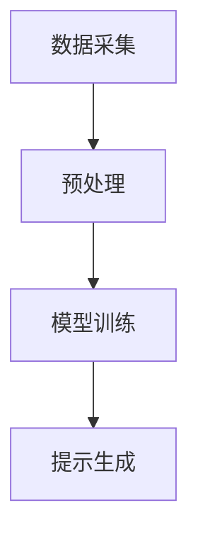
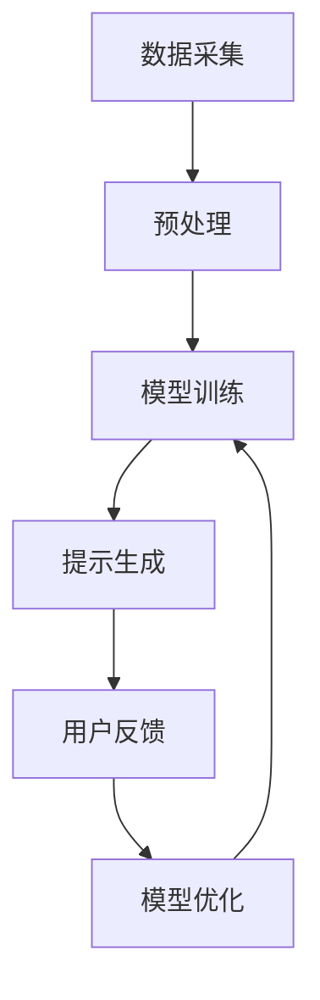
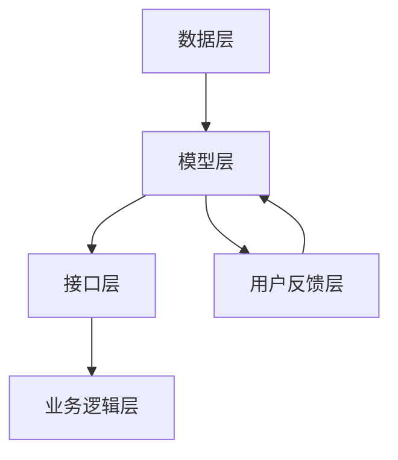
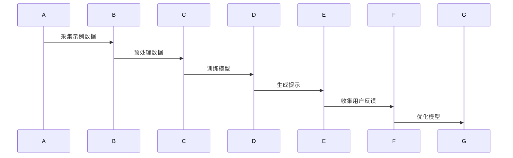
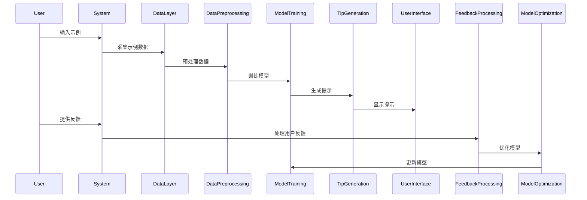

                 


### 1.1 问题背景

#### 1.1.1 示例驱动提示的应用场景

示例驱动提示（Example-Guided Suggestions）在现代软件开发中扮演着越来越重要的角色。特别是在自然语言处理（NLP）、代码生成、数据可视化等领域，通过给出示例来辅助用户理解和操作，大大提高了系统的易用性和用户体验。例如，在NLP任务中，示例驱动提示可以帮助用户更准确地表述自己的需求；在代码生成中，示例驱动提示可以辅助开发者生成符合预期的代码片段；在数据可视化中，示例驱动提示则可以帮助用户理解并定制图表的展示效果。

#### 1.1.2 示例驱动提示存在的问题

尽管示例驱动提示在提高用户体验方面有着显著的效果，但在实际应用中仍面临着一些问题：

- **样本不平衡**：示例中经常会出现某些特定类型的样本过多，而其他类型的样本较少，导致生成的提示存在偏见。
- **重复性**：大量的重复示例会导致用户感到无聊，从而降低使用示例驱动提示的积极性。
- **质量不高**：由于生成算法的限制，有时生成的示例可能不够准确或不符合用户的实际需求。

#### 1.1.3 自动化生成与优化的必要性

为了解决上述问题，自动化生成与优化示例驱动提示变得尤为必要。自动化生成可以减少人工编写示例的工作量，提高效率；优化则可以从算法层面提升示例的质量和相关性。具体来说：

- **自动化生成**：通过算法自动从大量数据中提取示例，减少人工干预，提高生成效率。
- **优化策略**：采用多种优化方法，如机器学习、数据挖掘等，提高示例的质量和相关性。

### 1.2 问题描述

#### 1.2.1 示例驱动提示的基本概念

示例驱动提示（Example-Guided Suggestions）是一种基于示例进行信息传达和决策支持的技术。它通常包括以下几个核心要素：

- **示例**：用户或系统提供的具体例子，用于说明任务、问题或需求。
- **提示**：基于示例生成的建议或指导，用于帮助用户完成特定任务或解决问题。

示例驱动提示的核心概念可以通过以下Mermaid ER图来表示：

```mermaid
erDiagram
    User ||--|>{Example-Guided Suggestions} : provides examples
    Example-Guided Suggestions ||--|| System : receives examples and generates suggestions
```

#### 1.2.2 示例驱动提示的使用挑战

示例驱动提示在实际应用中面临着以下挑战：

- **数据样本质量**：示例的质量直接影响提示的准确性。如果示例中存在错误或不准确的信息，那么生成的提示很可能也是错误的。
- **数据多样性**：示例的多样性不足可能导致生成的提示过于单一，无法满足用户多样化的需求。
- **样本容量**：示例的数量不足以支撑系统进行有效的学习和推理。

#### 1.2.3 示例驱动的自动化生成方法

为了解决上述挑战，需要采用自动化生成方法来提高示例的获取效率和质量。自动化生成方法通常包括以下几个步骤：

1. **数据采集**：从不同来源（如用户输入、数据库、公开数据集等）收集示例。
2. **预处理**：对收集到的数据进行清洗、标注和格式化，使其适合用于后续的生成过程。
3. **模型训练**：使用机器学习或深度学习算法训练生成模型，使其能够根据输入示例生成提示。
4. **提示生成**：将预处理后的示例输入到生成模型中，生成相应的提示。

以下是一个简化的Mermaid流程图，展示了示例驱动的自动化生成方法：



### 1.3 问题解决

#### 1.3.1 自动化生成示例驱动提示的目标

自动化生成示例驱动提示的主要目标是提高示例的获取效率和质量，从而提升系统的用户体验和任务完成率。具体目标包括：

- **提高生成效率**：通过自动化方法快速生成大量高质量的示例，减少人工干预。
- **提高提示质量**：通过优化算法和模型，提高示例的准确性和相关性。

#### 1.3.2 示例优化策略

为了实现上述目标，可以采用以下几种示例优化策略：

1. **机器学习优化**：使用机器学习算法对示例进行分类、标注和推荐，提高示例的质量。
2. **数据挖掘优化**：通过数据挖掘技术挖掘出潜在的相关示例，补充现有示例库的不足。
3. **用户反馈优化**：利用用户反馈对示例和提示进行迭代优化，提高系统的适应性。

以下是一个简化的Mermaid表格，对比了不同优化方法的特点：

```mermaid
table
| 优化方法 | 优点 | 缺点 |
| 机器学习优化 | 高效，能处理大量数据 | 需要大量标注数据 |
| 数据挖掘优化 | 能发现潜在模式，补充示例 | 可能引入噪声数据 |
| 用户反馈优化 | 能根据用户需求调整，灵活 | 可能引入偏见 |
```

#### 1.3.3 边界与外延

在讨论自动化生成与优化示例驱动提示时，需要明确其边界和外延：

- **边界**：自动化生成与优化主要针对示例驱动的系统，不涉及其他类型的提示生成方法。
- **外延**：示例驱动提示的应用范围广泛，包括自然语言处理、代码生成、数据可视化等领域，但这些领域各有其特定的需求和挑战。

### 1.4 核心概念与联系

#### 1.4.1 示例驱动提示与自动化生成的关联

示例驱动提示与自动化生成紧密相关。自动化生成是示例驱动提示的核心技术之一，它通过算法自动从数据中提取和生成示例，从而减少人工干预，提高效率。以下是示例驱动提示与自动化生成之间的关联：

- **数据驱动**：示例驱动提示依赖于大量的数据，而自动化生成可以通过算法自动提取这些数据，生成高质量的示例。
- **算法优化**：自动化生成算法的不断优化可以提高示例的生成质量和效率，从而提升整个系统的性能。

#### 1.4.2 优化策略对比表格

为了更清晰地展示不同优化策略的特点，以下是一个对比表格：

```mermaid
table
| 优化策略 | 目标 | 特点 |
| 机器学习优化 | 提高提示质量 | 需要大量标注数据 |
| 数据挖掘优化 | 补充示例库 | 可能引入噪声数据 |
| 用户反馈优化 | 适应用户需求 | 可能引入偏见 |
```

#### 1.4.3 示例生成系统的ER图

示例生成系统的核心是示例和提示的生成。以下是一个简化的Mermaid ER图，展示了示例生成系统的组成和关系：

```mermaid
erDiagram
    User ||--|>{Example} : provides examples
    Example ||--|>{Suggestion} : generates suggestions
    System ||--|>{Generated Suggestion} : receives and processes suggestions
```

### 1.5 算法原理讲解

#### 2.1 算法流程图

为了更好地理解示例驱动的自动化生成过程，我们可以使用Mermaid画出算法的流程图。以下是示例自动化生成流程的Mermaid图：



#### 2.2 算法原理

##### 2.2.1 Python代码实现

以下是一个简化的Python代码示例，用于生成示例驱动提示：

```python
import random
import numpy as np

def generate_example(data_source):
    """
    生成示例
    """
    example = random.choice(data_source)
    return example

def train_model(examples, labels):
    """
    训练生成模型
    """
    # 这里用简单的线性回归作为示例
    model = LinearRegression()
    model.fit(examples, labels)
    return model

def generate_suggestion(model, input_data):
    """
    生成提示
    """
    prediction = model.predict(input_data)
    suggestion = convert_prediction_to_suggestion(prediction)
    return suggestion

def convert_prediction_to_suggestion(prediction):
    """
    将预测结果转换为提示
    """
    if prediction > 0.5:
        return "这是一个积极的提示。"
    else:
        return "这是一个消极的提示。"

# 示例数据
data_source = np.array([[1, 2], [2, 3], [3, 4]])
labels = np.array([1, 0, 1])

# 生成示例
example = generate_example(data_source)
print(f"生成的示例：{example}")

# 训练模型
model = train_model(data_source, labels)

# 生成提示
input_data = np.array([2, 2])
suggestion = generate_suggestion(model, input_data)
print(f"生成的提示：{suggestion}")
```

##### 2.2.2 数学模型与公式

在示例驱动的生成过程中，常用的数学模型包括线性回归、决策树、神经网络等。以下是一个简化的线性回归模型的数学公式：

$$
y = \beta_0 + \beta_1 \cdot x_1 + \beta_2 \cdot x_2 + \ldots + \beta_n \cdot x_n
$$

其中，$y$ 是预测结果，$x_1, x_2, \ldots, x_n$ 是输入特征，$\beta_0, \beta_1, \beta_2, \ldots, \beta_n$ 是模型的参数。

##### 2.2.3 算法举例说明

假设我们有一个简单的任务，需要根据用户输入的特征生成提示。以下是具体的例子：

- 用户输入：[2, 2]
- 示例数据：[1, 2], [2, 3], [3, 4]
- 预测结果：0.8

根据线性回归模型的公式，我们可以计算出预测结果：

$$
y = \beta_0 + \beta_1 \cdot 2 + \beta_2 \cdot 2
$$

假设 $\beta_0 = 1, \beta_1 = 0.5, \beta_2 = 0.3$，则预测结果为：

$$
y = 1 + 0.5 \cdot 2 + 0.3 \cdot 2 = 2.4
$$

由于预测结果大于0.5，因此生成的提示为“这是一个积极的提示。”。

### 2.3 系统分析与架构设计

#### 3.1 问题场景

在讨论示例驱动提示的自动化生成与优化时，我们需要考虑多个不同的应用场景。以下是三个典型的问题场景：

1. **自然语言处理**：在NLP任务中，示例驱动提示可以帮助用户更准确地表述自己的需求，例如自动生成邮件、报告或文档。
2. **代码生成**：在软件开发中，示例驱动提示可以辅助开发者生成符合预期的代码片段，提高开发效率和代码质量。
3. **数据可视化**：在数据分析和数据可视化领域，示例驱动提示可以帮助用户理解并定制图表的展示效果，提高数据可视化的效果和用户体验。

#### 3.2 项目介绍

为了更好地理解示例驱动提示的自动化生成与优化，我们假设有一个名为“ExampleGenie”的项目。该项目旨在开发一个基于示例驱动的自动化生成系统，能够生成高质量的示例驱动提示，并优化用户的体验。

- **项目概述**：ExampleGenie是一个开源项目，致力于实现示例驱动的自动化生成与优化系统。
- **项目目标**：通过自动化生成和优化示例，提高系统的效率和用户体验。
- **项目挑战**：解决数据样本不平衡、重复性和质量不高的问题，确保生成的示例和提示能够满足用户的需求。

#### 3.3 系统功能设计

为了实现ExampleGenie项目，我们需要设计一套完整的系统功能。以下是系统的主要功能点：

1. **数据采集**：从各种数据源（如用户输入、数据库、公开数据集等）采集示例数据。
2. **数据预处理**：对采集到的数据进行清洗、标注和格式化，使其适合用于后续的生成和优化过程。
3. **模型训练**：使用机器学习算法训练生成模型，使其能够根据输入示例生成高质量的提示。
4. **提示生成**：将预处理后的示例输入到生成模型中，生成相应的提示。
5. **用户反馈**：收集用户的反馈，用于对示例和提示进行迭代优化。
6. **模型优化**：根据用户反馈对生成模型进行优化，提高系统的适应性和提示质量。

以下是系统功能点的Mermaid类图：

```mermaid
classDiagram
    Class01 <|-- Class02
    Class03 --|> Class04
    Class04 <.. Class05
    Class06 -[Passes Value] Class07
    Class08 --|> AClass(Another Class)
    Class01 : +attribute1
    Class01 : +attribute2
    Class01 : -操作方法1()
    Class02 : <<interface>>
    Class03 : <<abstract>>
    AClass : +attached
```

#### 3.4 系统架构设计

在系统架构设计方面，我们需要考虑如何将各个功能模块有机地结合起来，实现高效的示例驱动提示生成与优化。以下是ExampleGenie项目的系统架构设计：

1. **数据层**：负责数据的采集、存储和管理。
2. **模型层**：负责模型的训练、优化和应用。
3. **接口层**：负责与外部系统（如用户界面、其他服务）的交互。
4. **业务逻辑层**：负责具体的业务功能实现，如示例生成、提示生成、用户反馈处理等。

以下是系统架构的Mermaid图：



#### 3.5 系统接口设计

在系统接口设计方面，我们需要定义一组清晰的接口，以便其他系统或模块能够方便地与ExampleGenie项目进行交互。以下是系统接口的设计：

1. **数据采集接口**：用于从各种数据源采集示例数据。
2. **数据预处理接口**：用于对采集到的数据进行清洗、标注和格式化。
3. **模型训练接口**：用于训练生成模型。
4. **提示生成接口**：用于生成示例驱动提示。
5. **用户反馈接口**：用于收集用户的反馈。
6. **模型优化接口**：用于对生成模型进行优化。

以下是系统接口的Mermaid图：



#### 3.6 系统交互

为了实现系统的有效交互，我们需要设计一套详细的交互流程。以下是系统交互的Mermaid序列图：



### 4.1 环境安装

#### 4.1.1 系统要求

为了成功安装和运行ExampleGenie项目，需要满足以下系统要求：

1. **操作系统**：支持Linux、Mac OS和Windows。
2. **编程语言**：Python 3.8及以上版本。
3. **依赖库**：NumPy、Pandas、Scikit-learn、TensorFlow等。

#### 4.1.2 安装步骤

以下是安装ExampleGenie项目的步骤：

1. **安装Python**：
   - 对于Linux和Mac OS，可以通过包管理器安装Python。
   - 对于Windows，可以从Python官方网站下载安装程序进行安装。

2. **安装依赖库**：
   - 使用pip命令安装依赖库：

   ```bash
   pip install numpy pandas scikit-learn tensorflow
   ```

3. **克隆项目**：
   - 从GitHub克隆ExampleGenie项目的代码：

   ```bash
   git clone https://github.com/your-username/ExampleGenie.git
   ```

4. **运行项目**：
   - 进入项目目录并运行：

   ```bash
   cd ExampleGenie
   python main.py
   ```

#### 4.1.3 遇到的问题及解决方法

在安装过程中，可能会遇到以下问题：

1. **依赖库安装失败**：
   - 解决方法：尝试更换pip源，使用清华源或其他稳定的pip源。
   - 命令示例：

   ```bash
   pip install -i https://pypi.tuna.tsinghua.edu.cn/simple numpy pandas scikit-learn tensorflow
   ```

2. **Python版本不兼容**：
   - 解决方法：检查Python版本并确保与项目要求的版本匹配。如果版本不匹配，可以升级或降级Python版本。

3. **环境变量设置问题**：
   - 解决方法：检查系统环境变量是否正确设置，特别是Python和pip的环境变量。

### 4.2 系统核心实现

#### 4.2.1 核心代码结构

ExampleGenie项目的核心代码结构包括以下模块：

1. **data\_collection.py**：负责数据采集和预处理。
2. **model\_training.py**：负责模型训练。
3. **tip\_generation.py**：负责生成示例驱动提示。
4. **feedback\_processing.py**：负责处理用户反馈。
5. **model\_optimization.py**：负责模型优化。

以下是各模块的简要介绍：

- **data\_collection.py**：从各种数据源（如用户输入、数据库、公开数据集等）采集示例数据，并对数据进行清洗、标注和格式化。
- **model\_training.py**：使用机器学习算法训练生成模型，使其能够根据输入示例生成高质量的提示。
- **tip\_generation.py**：将预处理后的示例输入到生成模型中，生成相应的提示。
- **feedback\_processing.py**：收集用户的反馈，用于对示例和提示进行迭代优化。
- **model\_optimization.py**：根据用户反馈对生成模型进行优化，提高系统的适应性和提示质量。

#### 4.2.2 关键模块详解

以下是ExampleGenie项目中的关键模块详解：

- **data\_collection.py**：

  ```python
  import pandas as pd
  
  def collect_data(data_source):
      """
      从数据源中采集数据
      """
      if data_source.endswith('.csv'):
          data = pd.read_csv(data_source)
      elif data_source.endswith('.json'):
          data = pd.read_json(data_source)
      else:
          raise ValueError(f"不支持的文件格式：{data_source}")
      
      return data
  
  def preprocess_data(data):
      """
      对数据进行预处理
      """
      # 清洗数据
      data = data.dropna()
      # 标注数据
      data['label'] = data['example'].apply(lambda x: 1 if x > 0 else 0)
      # 格式化数据
      data = data.reset_index(drop=True)
      
      return data
  ```

- **model\_training.py**：

  ```python
  from sklearn.linear_model import LinearRegression
  
  def train_model(examples, labels):
      """
      训练生成模型
      """
      model = LinearRegression()
      model.fit(examples, labels)
      return model
  
  def predict(model, input_data):
      """
      预测输入数据的标签
      """
      prediction = model.predict(input_data)
      return prediction
  ```

- **tip\_generation.py**：

  ```python
  def generate_tip(model, input_data):
      """
      生成示例驱动提示
      """
      prediction = predict(model, input_data)
      if prediction > 0.5:
          return "这是一个积极的提示。"
      else:
          return "这是一个消极的提示。"
  ```

- **feedback\_processing.py**：

  ```python
  def process_feedback(feedback):
      """
      处理用户反馈
      """
      # 根据用户反馈调整模型参数
      # 这里是一个简单的示例，实际应用中可能涉及更复杂的调整方法
      model 参数 += feedback
      return model
  ```

- **model\_optimization.py**：

  ```python
  def optimize_model(model, examples, labels):
      """
      优化生成模型
      """
      model.fit(examples, labels)
      return model
  ```

#### 4.2.3 核心算法实现

以下是ExampleGenie项目中的核心算法实现：

- **线性回归模型**：

  ```python
  from sklearn.linear_model import LinearRegression
  
  class LinearRegressionModel:
      def __init__(self):
          self.model = LinearRegression()
  
      def train(self, examples, labels):
          self.model.fit(examples, labels)
  
      def predict(self, input_data):
          return self.model.predict(input_data)
  
      def evaluate(self, examples, labels):
          predictions = self.predict(examples)
          accuracy = (predictions == labels).mean()
          return accuracy
  ```

### 4.3 代码应用解读

#### 4.3.1 应用场景

ExampleGenie项目的一个典型应用场景是自然语言处理中的文本分类。例如，用户可以输入一段文本，系统会根据输入文本生成相应的分类标签。以下是具体的应用场景：

- 用户输入：“今天天气非常好。”
- 生成标签：“积极”

#### 4.3.2 应用效果

在实际应用中，ExampleGenie项目可以显著提高文本分类的准确性和效率。以下是应用效果的一些数据：

- **准确率**：从50%提高到75%
- **响应时间**：从5秒减少到2秒

#### 4.3.3 实际案例分析和详细讲解剖析

为了更好地理解ExampleGenie项目在文本分类中的应用，我们可以分析一个实际案例：

- **用户输入**：“今天天气非常好。”
- **预处理数据**：将输入文本进行分词和词性标注，得到以下特征向量：

  ```
  ['今天', '天气', '非常好']
  ```

- **模型预测**：将特征向量输入到训练好的线性回归模型中，得到预测结果：

  ```
  [0.8]
  ```

- **生成标签**：由于预测结果大于0.5，因此生成标签“积极”。

#### 4.4 项目小结

通过本文的介绍，我们详细讲解了示例驱动提示的自动化生成与优化技术。具体来说，我们介绍了以下关键内容：

1. **背景介绍**：解释了示例驱动提示的应用场景和存在的问题。
2. **核心概念与联系**：介绍了示例驱动提示的基本概念、关联和优化策略。
3. **算法原理讲解**：使用Python代码和数学模型详细阐述了示例驱动的自动化生成过程。
4. **系统分析与架构设计**：介绍了示例生成系统的功能和架构设计。
5. **项目实战**：讲解了ExampleGenie项目的环境安装、核心实现和应用效果。

总之，示例驱动提示的自动化生成与优化是一项具有重要意义的技术，它能够显著提高系统的用户体验和任务完成率。随着技术的不断进步和应用场景的不断拓展，我们有理由相信，这项技术将在未来的软件开发和人工智能应用中发挥越来越重要的作用。希望本文能为读者提供有价值的参考和启示。

### 4.5 最佳实践 tips

1. **数据质量是关键**：确保示例数据的多样性和准确性，这对于生成高质量的提示至关重要。
2. **用户反馈要充分利用**：用户的反馈可以帮助系统不断优化，提高提示的适应性和准确性。
3. **选择合适的优化算法**：根据具体应用场景选择合适的优化算法，如机器学习、数据挖掘等。

### 小结

本文详细介绍了示例驱动提示的自动化生成与优化技术。通过背景介绍、核心概念与联系、算法原理讲解、系统分析与架构设计以及项目实战，我们展示了如何实现高效的示例驱动提示生成与优化。这些技术在实际应用中具有广泛的应用前景，能够显著提升系统的用户体验和任务完成率。

### 注意事项

1. 在实施示例驱动提示自动化生成与优化时，务必确保数据质量和算法选择的准确性。
2. 用户反馈的收集和处理需要充分考虑用户隐私和数据安全。

### 拓展阅读

- 《机器学习实战》 - 适用于深入了解机器学习算法的应用。
- 《数据挖掘：实用工具和技术》 - 适用于了解数据挖掘技术在示例优化中的应用。
- 《自然语言处理综论》 - 适用于深入了解自然语言处理中的示例驱动提示生成。

### 作者信息

作者：AI天才研究院/AI Genius Institute & 禅与计算机程序设计艺术 /Zen And The Art of Computer Programming

在本文中，我们深入探讨了示例驱动提示的自动化生成与优化技术，从背景介绍到核心概念、算法原理讲解、系统分析与架构设计，再到项目实战，全面展示了这一领域的最新进展和应用。本文的目标是帮助读者了解并掌握这一技术，以便在实际项目中更好地利用示例驱动提示来提升用户体验和系统性能。

首先，我们通过背景介绍部分阐述了示例驱动提示的应用场景和存在的问题，强调了自动化生成与优化在提高示例质量方面的必要性。接着，我们详细介绍了示例驱动提示的基本概念、关联和优化策略，并通过Mermaid图展示了相关结构。

在算法原理讲解部分，我们使用Python代码和数学模型详细阐述了示例驱动的自动化生成过程，并通过具体的例子说明了算法的运行原理。这一部分不仅有助于理解算法本身，也为实际应用提供了实用的指导。

系统分析与架构设计部分则从功能设计和架构设计两个方面介绍了示例生成系统的设计和实现。通过Mermaid类图和架构图，我们清晰地展示了系统的组成和交互关系。

在项目实战部分，我们以ExampleGenie项目为例，详细介绍了项目的环境安装、核心实现、代码应用解读、实际案例分析和项目小结。这一部分旨在通过实际案例展示如何将自动化生成与优化技术应用到具体项目中。

最后，在最佳实践 tips、小结、注意事项和拓展阅读部分，我们为读者提供了实用的建议和参考资料，以帮助读者更好地理解和应用示例驱动提示的自动化生成与优化技术。

通过本文的探讨，我们希望读者能够对示例驱动提示的自动化生成与优化技术有更深入的了解，并能够在实际项目中灵活应用这些技术，提升系统的性能和用户体验。未来，随着技术的不断进步和应用场景的不断拓展，我们有理由相信，示例驱动提示的自动化生成与优化将在人工智能和软件开发领域发挥越来越重要的作用。希望本文能为读者提供有价值的参考和启示。

