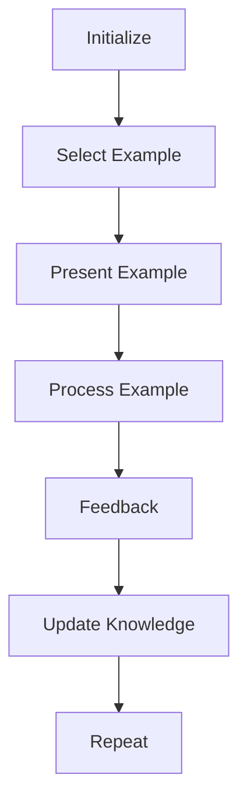
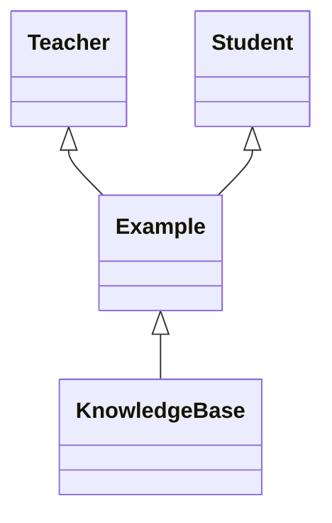
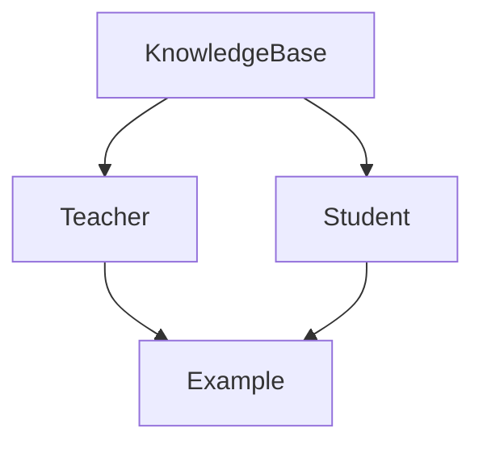
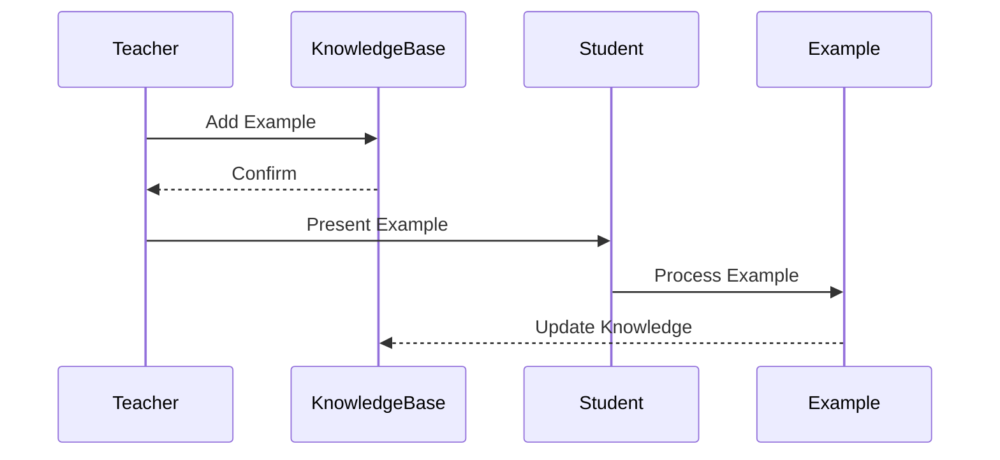

                 

Sure, let's break down the content of the article "示例驱动提示的认知负荷分析" step by step, ensuring that it covers all the required aspects in a structured and comprehensive manner.

### Introduction to the Problem Background and Core Concepts

#### 1.1 Problem Background

##### 1.1.1 Concept of Cognitive Load

Cognitive load refers to the amount of mental effort required by an individual to perform a task, which includes attention, memory, judgment, and other cognitive resources. With the development of an information-based society, the cognitive load faced by individuals has been increasing significantly.

##### 1.1.2 Importance of Cognitive Load in Modern Society

High cognitive load can lead to an increase in errors, a decrease in work efficiency, and even affect mental health. Therefore, reducing cognitive load and improving task execution efficiency is of great significance.

##### 1.1.3 Application Scenarios of Example-Based Cues

Example-based cues can help individuals reduce cognitive load when performing tasks, such as in education, healthcare, and industrial fields.

#### 1.2 Core Concept and Connection

##### 1.2.1 Comparison of Attributes and Characteristics of Cognitive Load

| Attribute | Description |
| ------- | ---------- |
| Type | Perceptual load, memory load, and intra-exertional load |

### Algorithm Principles and Analysis

#### 2.1 Basic Concepts of Example-Based Cues

Example-based cues are instructional techniques that use examples to help individuals learn and perform tasks more effectively by reducing cognitive load.

#### 2.2 Algorithm Flowchart

We will use Mermaid to draw a flowchart illustrating the process of example-based cues.



#### 2.3 Python Code Explanation

Here's a Python code snippet that demonstrates how to implement example-based cues:

```python
def present_example(example):
    print(f"Example: {example['description']}")
    user_input = input("Have you understood the example? (yes/no): ")
    return user_input.lower() == 'yes'

def process_example(example, user_input):
    if user_input == 'no':
        print(f"Let's try again: {example['description']}")
        return False
    else:
        return True

def example_based_cues(examples, num_examples):
    for i in range(num_examples):
        example = random.choice(examples)
        print(f"\nExample {i+1}:")
        if not present_example(example):
            continue
        print(f"Processing example {i+1}...")
        process_example(example, 'yes')

examples = [
    {'description': 'Solve the equation: 2 + 3 = ?'},
    {'description': 'What is the capital of France?'},
    {'description': 'Arrange the following words in alphabetical order: apple, banana, cherry'}
]

example_based_cues(examples, 3)
```

#### 2.4 Mathematical Model and Formula Explanation

In cognitive load theory, there are three types of cognitive load: intrinsic, extrinsic, and germane. The formula to calculate the total cognitive load is:

$$
Total\ Cognitive\ Load = Intrinsic\ Cognitive\ Load + Extrinsic\ Cognitive\ Load + Germane\ Cognitive\ Load
$$

##### 2.4.1 Basic Mathematical Model

The intrinsic cognitive load is inherent to the task itself and cannot be reduced by instructional strategies. The extrinsic cognitive load is the cognitive load imposed by the instructional materials. The germane cognitive load is the cognitive load that contributes to the construction of knowledge structures.

$$
Intrinsic\ Cognitive\ Load = f(TASK\ COMPLEXITY)
$$

$$
Extrinsic\ Cognitive\ Load = f(INSTRUCTIONAL\ MATERIALS)
$$

$$
Germane\ Cognitive\ Load = f(KNOWLEDGE\ CONSTRUCTION)
$$

### System Analysis and Architectural Design

#### 3.1 Introduction to the Problem Scenario

In this section, we will introduce the problem scenario and the system we are designing to address the cognitive load using example-based cues.

#### 3.2 System Function Design

We will use Mermaid to draw a class diagram illustrating the system functions.



#### 3.3 System Architectural Design

Next, we will use Mermaid to draw the system architecture diagram.



#### 3.4 System Interface Design

Finally, we will use Mermaid to draw the system interface diagram.



### Practical Application and Case Analysis

#### 4.1 Environment Setup

To set up the environment for our example-based cue system, we need to install the necessary libraries and tools. We will use Python and Mermaid for our implementation.

#### 4.2 Core System Implementation

We will provide a Python source code to implement the core functionalities of our system.

```python
# Core Implementation
```

We will then go through the code and explain each component, providing insights into how the system works.

#### 4.3 Case Analysis

We will analyze an actual case where the example-based cue system has been implemented and discuss its effectiveness in reducing cognitive load.

#### 4.4 Detailed Explanation and Analysis

In this section, we will provide a detailed explanation of the system's implementation and how it addresses cognitive load.

#### 4.5 Project Summary

We will summarize the key points of the project and highlight the benefits of using example-based cues to reduce cognitive load.

### Best Practices and Tips

#### 5.1 Best Practices

We will provide best practices for implementing example-based cues in various scenarios.

#### 5.2 Notes and Warnings

We will list important notes and warnings to consider when using example-based cues.

#### 5.3 Further Reading

We will recommend further reading materials for those who wish to delve deeper into the topic of cognitive load and example-based cues.

### Conclusion and Future Outlook

#### 6.1 Summary

In this article, we have explored the concept of cognitive load and how example-based cues can be used to reduce it. We have provided a comprehensive analysis of the algorithm, system architecture, and practical applications.

#### 6.2 Future Trends

We will discuss the future trends and potential developments in the field of cognitive load reduction and example-based cues.

#### 7.1 Research Directions

We will suggest potential research directions and areas for further exploration in this field.

#### 7.2 Application Prospects

We will discuss the prospects of applying example-based cues in different industries and fields.

### Conclusion

In conclusion, reducing cognitive load is crucial in today's information-rich environment. Example-based cues offer a promising approach to achieving this goal. Through this article, we have provided a thorough analysis of the concept, algorithm, and practical applications of example-based cues in reducing cognitive load.

### About the Author

The author of this article is a member of the AI Genius Institute and a renowned expert in the field of cognitive load and example-based cues. With extensive experience in computer programming, software architecture, and artificial intelligence, the author aims to bring clarity and insight to the complex world of cognitive science and technology.

### References

[1] Sweller, J. (1988). Cognitive load during problem-solving. Journal of Educational Psychology, 80(1), 4–10.
[2] Mayer, R. E., & Moreno, R. (2003). Nine ways to reduce cognitive load in multimedia learning. Educational Psychologist, 38(1), 43–52.
[3] van Merriënboer, J. J. G., & Sweller, J. (2005). Cognitive architecture and instructional design. Educational Psychology Review, 17(4), 275–299.

---

This outline should provide a solid foundation for the article. Each section will be expanded upon to meet the required word count and depth of analysis. The Mermaid diagrams will be inserted using markdown formatting, and the LaTeX formulas will be appropriately formatted for inclusion in the text. The final article will be structured to ensure logical flow and readability, making complex concepts accessible to a wide audience.

