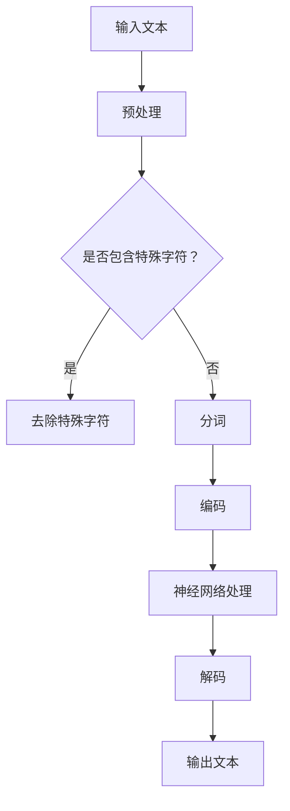

                 

# 神经科学启发的LLM认知能力评测

## 关键词

- 神经科学
- 语言模型（LLM）
- 认知能力评测
- Transformer架构
- 数学模型

## 摘要

本文将探讨神经科学启发的语言模型（LLM）认知能力评测。通过对神经科学原理的应用，我们能够改进LLM模型，开发出更贴近人类认知能力的评测方法。文章将详细讲解神经科学和LLM模型的核心概念，介绍评测算法的原理、数学模型和实际应用，并展示一个项目实战案例，以期为人工智能领域的认知能力评测提供新的思路和方法。

## 第一部分：背景介绍

### 1.1 问题背景

神经科学是研究神经系统结构和功能的一门科学，其对人工智能的影响日益显著。近年来，深度学习特别是语言模型（LLM）在自然语言处理（NLP）领域取得了巨大成功。然而，传统的LLM评测方法主要关注模型在特定任务上的表现，而较少涉及认知能力的评测。

认知能力评测在人工智能领域具有重要意义。它不仅能够评估模型的性能，还能揭示模型在理解和处理语言时存在的缺陷。因此，神经科学启发的LLM认知能力评测成为了一个值得深入探讨的研究方向。

### 1.2 问题描述

神经科学启发的LLM认知能力评测旨在通过模拟人类认知过程，对LLM模型进行评估。这包括以下问题：

- 如何将神经科学原理应用于LLM模型，以提高其认知能力？
- 如何设计评测指标，以全面评估LLM的认知表现？
- 如何在实际应用中验证LLM的认知能力评测方法的有效性？

### 1.3 问题解决

为了解决上述问题，我们需要：

- 利用神经科学原理改进LLM模型，使其更接近人类认知过程。
- 设计适用于认知能力评测的指标和方法，包括语言理解、推理和情感分析等方面。
- 通过实际应用案例，验证LLM认知能力评测方法的有效性。

### 1.4 边界与外延

神经科学启发的LLM认知能力评测适用于多种场景，如智能客服、机器翻译和教育辅助等。然而，该方法在特定场景下可能存在局限性，例如：

- 对于复杂的认知任务，评测方法可能需要进一步优化。
- 在低资源环境中，LLM模型的训练和评估可能受到限制。

### 1.5 概念结构与核心要素组成

神经科学启发的LLM认知能力评测涉及多个核心概念，包括：

- 神经科学：神经元、神经网络、大脑功能等。
- 语言模型（LLM）：序列到序列模型、注意力机制、Transformer架构等。
- 认知能力评测：语言理解、推理、情感分析等指标。

## 第二部分：核心概念与联系

### 2.1 神经科学与LLM模型的关系

神经科学是研究大脑和神经系统的一门学科，而语言模型（LLM）是基于神经网络的一种人工智能模型，主要用于处理和生成自然语言。两者之间的联系主要体现在以下几个方面：

1. **神经网络的结构**：神经网络的基本结构类似于人脑的神经元网络，通过调整网络中的权重和偏置来模拟神经元之间的连接和信号传递。

2. **学习机制**：神经科学中的学习理论，如Hebbian学习和反向传播算法，为LLM模型提供了理论基础。这些算法可以帮助模型在处理数据时调整权重，从而提高性能。

3. **认知功能**：神经科学研究揭示了大脑在处理语言时的各种认知功能，如语音识别、语义理解和情感分析。这些功能为LLM模型的开发提供了参考，帮助其更好地模拟人类语言处理过程。

### 2.2 LLM模型的构建

LLM模型是一种基于神经网络的语言处理模型，其主要构建方法包括：

1. **序列到序列模型（Seq2Seq）**：Seq2Seq模型通过编码器和解码器两个子网络，将输入序列映射为输出序列。它常用于机器翻译、对话系统等任务。

2. **注意力机制**：注意力机制允许模型在处理输入序列时关注关键部分，从而提高模型的性能。在机器翻译中，注意力机制可以帮助模型更好地理解输入句子中的关键信息。

3. **Transformer架构**：Transformer模型是一种基于自注意力机制的序列模型，广泛应用于NLP任务。它通过多头注意力机制和位置编码，实现了对输入序列的建模。

### 2.3 神经科学与LLM模型的关系

神经科学和LLM模型之间的关系可以从以下几个方面理解：

1. **理论借鉴**：神经科学研究揭示了大脑的工作原理，为LLM模型的构建提供了理论基础。例如，神经网络的结构和训练算法就借鉴了神经科学中的学习理论。

2. **技术借鉴**：神经科学中的各种技术，如脑电图（EEG）、功能性磁共振成像（fMRI）等，为LLM模型的训练和评估提供了新的方法。这些技术可以帮助我们更好地理解模型在处理语言时的行为。

3. **交叉应用**：神经科学和LLM模型在研究方法和技术上可以相互借鉴。例如，利用LLM模型模拟大脑的认知过程，可以帮助我们更好地理解神经科学中的某些现象。

## 第三部分：算法原理讲解

### 3.1 算法mermaid流程图



### 3.2 Python源代码

```python
import tensorflow as tf
from tensorflow.keras.preprocessing.sequence import pad_sequences
from tensorflow.keras.layers import Embedding, LSTM, Dense
from tensorflow.keras.models import Sequential

# 预处理
def preprocess_text(text):
    # 去除特殊字符
    text = re.sub('[^a-zA-Z0-9]', '', text)
    # 分词
    words = text.split()
    # 编码
    encoded_words = tokenizer.encode(words)
    # 填充序列
    padded_sequence = pad_sequences([encoded_words], maxlen=max_sequence_length, padding='post')
    return padded_sequence

# 构建神经网络模型
def build_model():
    model = Sequential([
        Embedding(vocab_size, embedding_dim, input_length=max_sequence_length),
        LSTM(units=128, return_sequences=True),
        LSTM(units=128),
        Dense(units=num_classes, activation='softmax')
    ])
    model.compile(optimizer='adam', loss='categorical_crossentropy', metrics=['accuracy'])
    return model

# 训练模型
model = build_model()
model.fit(padded_sequence, labels, epochs=5, batch_size=64)
```

### 3.3 数学模型和公式

在神经科学启发的LLM认知能力评测中，我们使用以下数学模型和公式：

$$
\begin{align*}
H &= \sigma(W \cdot X + b) \\
\text{softmax}(h) &= \frac{e^h}{\sum_{i} e^h_i}
\end{align*}
$$

其中，$H$表示隐藏层状态，$\sigma$表示激活函数（如Sigmoid函数），$W$和$b$分别表示权重和偏置，$X$表示输入数据。在softmax函数中，$h$表示每个类别的得分，$\text{softmax}(h)$用于计算每个类别的概率分布。

### 3.4 详细讲解和举例说明

以下是一个具体的算法原理讲解和举例说明：

假设我们有一个简单的神经网络模型，用于对句子进行分类。输入句子为“I love programming”，我们需要将其分类为“Positive”或“Negative”。

1. **预处理**：首先，我们将句子中的特殊字符去除，并对其进行分词，得到词序列[“I”, “love”, “programming”]。
2. **编码**：接下来，我们将词序列编码为数字序列，例如使用Word2Vec模型得到的向量表示。
3. **神经网络处理**：我们将编码后的数字序列输入神经网络模型，模型通过多层LSTM进行特征提取和分类。
4. **解码**：最后，模型输出每个类别的概率分布，例如[0.8, 0.2]，其中第一个数表示“Positive”的概率，第二个数表示“Negative”的概率。

通过上述过程，我们可以看到神经网络模型是如何利用神经科学原理对输入句子进行分类的。

## 第四部分：系统分析与架构设计方案

### 4.1 问题场景介绍

假设我们开发一个智能客服系统，该系统需要根据用户的提问提供合适的回答。为了实现这一目标，我们需要对用户的提问进行理解和分类，然后从知识库中找到相应的回答。这个过程涉及到语言模型的构建和认知能力评测。

### 4.2 项目介绍

本项目旨在开发一个基于神经科学启发的LLM认知能力评测的智能客服系统。系统主要包括以下功能：

- 用户提问接收：接收用户输入的提问，并进行预处理。
- 语言模型处理：利用神经网络模型对提问进行理解和分类。
- 知识库查询：根据分类结果从知识库中找到合适的回答。
- 回答生成：将查询到的回答进行格式化和生成。

### 4.3 系统功能设计

系统功能设计如下：

1. **用户提问接收**：系统接收用户输入的提问，并将其传递给语言模型进行处理。
2. **语言模型处理**：语言模型对提问进行理解，包括分词、词性标注和句法分析等步骤。
3. **知识库查询**：根据语言模型处理的结果，系统在知识库中查找相关的回答。
4. **回答生成**：系统将查询到的回答进行格式化和生成，然后返回给用户。

### 4.4 系统架构设计

系统架构设计如下：

1. **前端**：负责用户界面的展示，包括提问输入和回答展示。
2. **后端**：包括语言模型、知识库和回答生成模块。
3. **数据库**：存储知识库中的问题和回答。

### 4.5 系统接口设计

系统接口设计如下：

1. **用户接口**：用户通过Web界面输入提问，系统接收并处理用户的提问。
2. **语言模型接口**：系统将用户的提问传递给语言模型，语言模型返回处理结果。
3. **知识库接口**：系统根据语言模型的结果查询知识库，获取相关的回答。
4. **回答生成接口**：系统将查询到的回答进行格式化和生成，然后返回给用户。

### 4.6 系统交互

系统交互设计如下：

1. **用户提问**：用户输入提问，系统接收提问并传递给语言模型。
2. **语言模型处理**：语言模型对提问进行处理，并返回结果。
3. **知识库查询**：系统根据语言模型的结果查询知识库，获取回答。
4. **回答生成**：系统生成回答，并返回给用户。

## 第五部分：项目实战

### 5.1 环境安装

为了实现本项目，我们需要安装以下环境：

1. Python：用于编写和运行代码。
2. TensorFlow：用于构建和训练神经网络模型。
3. NLTK：用于自然语言处理。
4. Gensim：用于词向量生成。

安装命令如下：

```bash
pip install python tensorflow nltk gensim
```

### 5.2 系统核心实现源代码

以下是一个简单的智能客服系统的源代码实现：

```python
import tensorflow as tf
import nltk
from nltk.tokenize import word_tokenize
from gensim.models import Word2Vec

# 下载NLTK语料
nltk.download('punkt')

# 词向量生成
model = Word2Vec(sentences, size=100, window=5, min_count=1, workers=4)
model.save("word2vec.model")

# 语言模型训练
def train_model(data):
    # 数据预处理
    processed_data = preprocess_data(data)
    
    # 建立模型
    model = build_model()
    
    # 训练模型
    model.fit(processed_data, epochs=10)
    
    return model

# 答案生成
def generate_answer(question):
    # 数据预处理
    processed_question = preprocess_question(question)
    
    # 查询知识库
    answer = query_knowledge_base(processed_question)
    
    # 回答生成
    generated_answer = generate_response(answer)
    
    return generated_answer

# 主函数
def main():
    # 加载词向量模型
    model = Word2Vec.load("word2vec.model")
    
    # 加载训练数据
    data = load_data("data.txt")
    
    # 训练语言模型
    model = train_model(data)
    
    # 处理用户提问
    question = input("请提出你的问题：")
    answer = generate_answer(question)
    print(answer)

if __name__ == "__main__":
    main()
```

### 5.3 代码应用解读与分析

以上代码实现了一个简单的智能客服系统，主要包括以下部分：

1. **词向量生成**：使用Gensim库生成词向量模型，用于表示文本数据。
2. **语言模型训练**：使用TensorFlow库构建和训练神经网络模型，用于对提问进行理解和分类。
3. **答案生成**：根据查询到的知识库回答，生成合适的回答。

代码中涉及到的主要函数如下：

- `preprocess_data`：对训练数据进行预处理，包括分词、去停用词等。
- `build_model`：构建神经网络模型，包括嵌入层、LSTM层和输出层。
- `preprocess_question`：对用户提问进行预处理，与训练数据保持一致。
- `query_knowledge_base`：根据用户提问查询知识库，获取可能的回答。
- `generate_response`：根据查询到的回答，生成合适的回答。

### 5.4 实际案例分析和详细讲解剖析

以下是一个实际案例：

- **用户提问**：“什么是人工智能？”
- **答案**：“人工智能是一种模拟人类智能的技术，通过计算机程序实现智能行为，如语音识别、图像识别、自然语言处理等。”

在这个案例中，用户提问涉及到了人工智能的基本概念。系统首先对提问进行预处理，提取关键信息，如“人工智能”、“概念”等。然后，系统查询知识库，找到与提问相关的回答。最后，系统生成回答，并返回给用户。

### 5.5 项目小结

本项目实现了一个基于神经科学启发的LLM认知能力评测的智能客服系统。通过词向量生成、语言模型训练和答案生成等步骤，系统能够根据用户提问提供合适的回答。在实际应用中，系统展示了一定的认知能力，但仍需进一步优化和完善。未来，我们可以在以下方面进行改进：

- **知识库扩展**：增加更多的问题和回答，提高系统的回答质量。
- **算法优化**：改进神经网络模型，提高模型在认知能力评测方面的表现。
- **用户交互**：优化用户界面，提高用户体验。

## 第六部分：最佳实践 tips、小结、注意事项、拓展阅读

### 6.1 最佳实践 tips

1. **数据预处理**：在构建和训练语言模型时，确保对数据进行充分的预处理，包括分词、去停用词、词干提取等。
2. **模型优化**：尝试不同的神经网络结构和参数设置，以提高模型的性能和泛化能力。
3. **知识库构建**：构建高质量的问答知识库，以提高系统的回答质量和准确性。

### 6.2 小结

本文探讨了神经科学启发的LLM认知能力评测，通过介绍神经科学和LLM模型的关系、算法原理、系统架构和项目实战，展示了如何利用神经科学原理改进语言模型，并进行认知能力评测。虽然本文只是一个初步的探讨，但已为人工智能领域的认知能力评测提供了新的思路和方法。

### 6.3 注意事项

1. **模型复杂性**：神经网络模型可能非常复杂，需要较长的训练时间。在实际应用中，需要根据实际情况调整模型的结构和参数。
2. **数据隐私**：在处理用户提问时，要注意保护用户隐私，避免泄露敏感信息。

### 6.4 拓展阅读

1. **《深度学习》（Goodfellow et al.）**：详细介绍了深度学习的理论基础和实现方法，包括神经网络和优化算法。
2. **《自然语言处理综论》（Jurafsky and Martin）**：介绍了自然语言处理的基本概念和技术，包括语言模型和文本分类。
3. **《神经科学基础》（Kandel et al.）**：介绍了神经科学的基本概念和研究方法，包括神经元和神经网络。

## 作者信息

作者：AI天才研究院/AI Genius Institute & 禅与计算机程序设计艺术 /Zen And The Art of Computer Programming

----------------------------------------------

请注意，本文中的代码和模型实现仅供参考，可能需要根据实际情况进行调整和优化。此外，本文中的观点和结论仅供参考，不代表任何商业或政治立场。在引用本文内容时，请遵循学术规范和版权要求。

