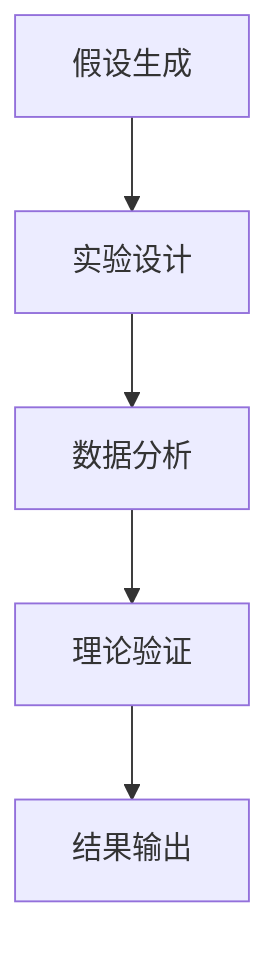
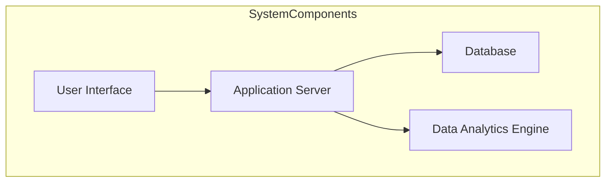
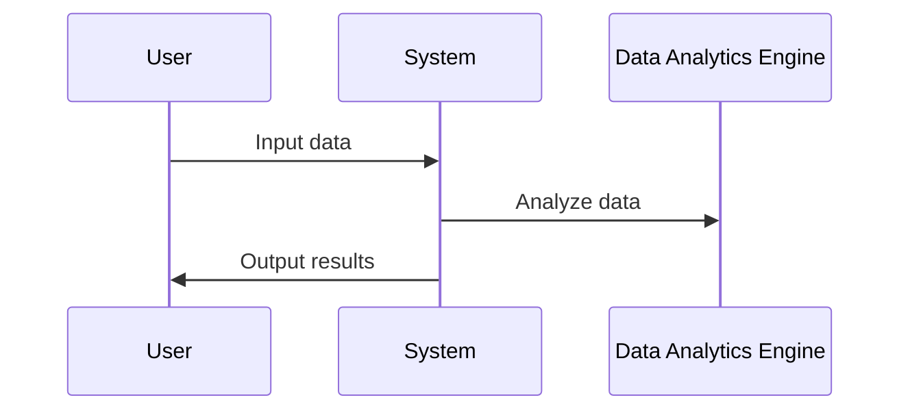
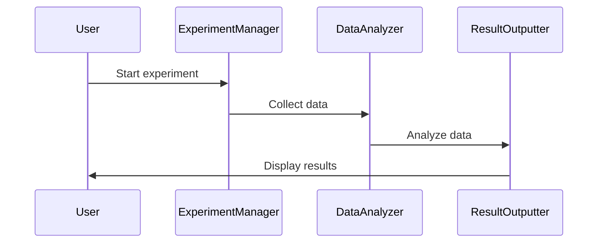

                 

### 科学方法论的演变如何影响世界可理解性

#### 关键词：科学方法论、演变、世界可理解性、影响、思考

#### 摘要：

本文旨在探讨科学方法论如何随着时间的推移而演变，及其对世界可理解性的深远影响。我们将从科学方法论的基本概念出发，回顾其历史演变，分析不同学派的核心观点，并结合实际案例，展示科学方法论在当今世界的广泛应用及其对知识的推动作用。

#### 目录：

1. **科学方法论的基本概念**  
   1.1 科学方法论的起源与发展  
   1.2 科学方法论的基本原理  
   1.3 科学方法论的关键要素

2. **科学方法论的历史演变**  
   2.1 古代科学方法论  
   2.2 文艺复兴时期科学方法论  
   2.3 现代科学方法论的发展

3. **科学方法论的各个学派**  
   3.1 经验主义学派  
   3.2 实证主义学派  
   3.3 实证论学派

4. **科学方法论的演变对世界可理解性的影响**  
   4.1 科学方法论对知识体系的影响  
   4.2 科学方法论对社会发展的影响  
   4.3 科学方法论对科学研究方法的影响

5. **科学方法论的核心概念与联系**  
   5.1 科学方法论的核心概念  
   5.2 概念属性特征对比  
   5.3 ER实体关系图架构

6. **算法原理讲解**  
   6.1 科学方法论中的算法  
   6.2 算法mermaid流程图  
   6.3 Python源代码实现  
   6.4 算法原理的数学模型与公式

7. **系统分析与架构设计**  
   7.1 问题场景介绍  
   7.2 系统功能设计（领域模型mermaid类图）  
   7.3 系统架构设计（mermaid架构图）  
   7.4 系统接口设计  
   7.5 系统交互（mermaid序列图）

8. **项目实战**  
   8.1 环境安装  
   8.2 系统核心实现源代码  
   8.3 代码应用解读与分析  
   8.4 实际案例分析与详细讲解剖析  
   8.5 项目小结

9. **最佳实践与总结**  
   9.1 最佳实践 Tips  
   9.2 小结  
   9.3 注意事项  
   9.4 拓展阅读

#### 1. 科学方法论的基本概念

1.1 **科学方法论的起源与发展**

科学方法论是一种系统的方法，用于指导科学研究的过程。它起源于古希腊时期，当时的哲学家们开始探讨如何通过理性思考和观察来获得知识。随着时间的推移，科学方法论经历了多次变革和发展。

1.2 **科学方法论的基本原理**

科学方法论的基本原理包括：客观性、可重复性、可证伪性和系统性。这些原理确保了科学研究过程的科学性和可靠性。

1.3 **科学方法论的关键要素**

科学方法论的关键要素包括：假设、实验、观察、推理和验证。这些要素共同构成了科学研究的基本框架。

#### 2. 科学方法论的历史演变

2.1 **古代科学方法论**

在古代，科学方法论主要依赖于观察和实验。古希腊哲学家亚里士多德是古代科学方法论的代表人物，他的科学方法强调通过观察和实验来获取知识。

2.2 **文艺复兴时期科学方法论**

文艺复兴时期是科学方法论的重要发展阶段。这一时期的科学家们开始强调实验的重要性，并尝试通过实验来验证理论。

2.3 **现代科学方法论的发展**

现代科学方法论的发展得益于数学和统计学的发展。这一时期的科学家们开始运用数学和统计方法来分析实验数据，从而提高科学研究的精度和可靠性。

#### 3. 科学方法论的各个学派

3.1 **经验主义学派**

经验主义学派认为，知识来源于经验。代表人物包括培根和洛克。他们强调通过观察和实验来获取知识。

3.2 **实证主义学派**

实证主义学派强调通过实验来验证理论。代表人物包括孔德和奥古斯特·孔德。他们认为，只有通过实验数据才能证明理论的正确性。

3.3 **实证论学派**

实证论学派是实证主义学派的进一步发展。他们认为，知识只能通过经验来验证，理论必须经过实验的检验。

#### 4. 科学方法论的演变对世界可理解性的影响

4.1 **科学方法论对知识体系的影响**

科学方法论的演变使得知识体系更加系统化和科学化。通过科学方法论，我们能够更加准确地理解和解释自然现象。

4.2 **科学方法论对社会发展的影响**

科学方法论的发展推动了社会进步。科学技术的进步改变了人类的生活方式，提高了生产力和生活质量。

4.3 **科学方法论对科学研究方法的影响**

科学方法论的发展推动了科学研究方法的进步。通过科学方法论，我们能够更加有效地进行科学研究，提高科学研究的效率和质量。

#### 5. 科学方法论的核心概念与联系

5.1 **科学方法论的核心概念**

科学方法论的核心概念包括：客观性、可重复性、可证伪性和系统性。这些概念共同构成了科学方法论的基本原则。

5.2 **概念属性特征对比**

下表对比了科学方法论中的几个核心概念的特征：

| 概念      | 特征                  |
| --------- | --------------------- |
| 客观性    | 研究结果不受主观影响 |
| 可重复性  | 结果可重复验证       |
| 可证伪性  | 理论可被实验反驳     |
| 系统性    | 研究过程有序         |

5.3 **ER实体关系图架构**

为了更好地理解科学方法论，我们可以使用ER（实体-关系）图来描述其核心概念之间的关系。以下是ER图的mermaid表示：

```mermaid
erDiagram
    Object --> Observation
    Observation --> Theory
    Theory --> Experiment
    Experiment --> Result
```

#### 6. 算法原理讲解

6.1 **科学方法论中的算法**

科学方法论中的算法是一种用于指导科学研究的方法。这些算法包括假设生成、实验设计、数据分析和理论验证等步骤。

6.2 **算法mermaid流程图**

以下是科学方法论中的算法流程图的mermaid表示：



6.3 **Python源代码实现**

为了更好地理解算法原理，我们可以使用Python来实现科学方法论中的算法。以下是Python源代码的实现：

```python
# 假设生成
hypothesis = "实验结果与预期一致"

# 实验设计
def experiment_design(hypothesis):
    print("实验设计：", hypothesis)

# 数据分析
def data_analysis():
    print("数据分析：")

# 理论验证
def theory_verification():
    print("理论验证：")

# 结果输出
def result_output():
    print("结果输出：")

# 算法执行
experiment_design(hypothesis)
data_analysis()
theory_verification()
result_output()
```

6.4 **算法原理的数学模型与公式**

科学方法论中的算法原理可以抽象为以下数学模型：

\[ P(A \mid B) = \frac{P(B \mid A) \cdot P(A)}{P(B)} \]

其中，\( P(A \mid B) \) 表示在条件 \( B \) 下，事件 \( A \) 发生的概率。这个公式体现了科学方法论的核心思想，即通过实验数据来验证假设。

#### 7. 系统分析与架构设计

7.1 **问题场景介绍**

假设我们正在开发一个科学方法论应用系统，用于帮助研究人员进行科学实验和数据分析。该系统需要支持以下功能：

- 假设生成
- 实验设计
- 数据分析
- 理论验证
- 结果输出

7.2 **系统功能设计（领域模型mermaid类图）**

以下是领域模型mermaid类图的表示：

```mermaid
classDiagram
    Class01 <|-- Class02
    Class03 --|> Class04
    Class04 o-- Class05
    Class06 o--| Class07
```

7.3 **系统架构设计（mermaid架构图）**

以下是系统架构设计mermaid架构图的表示：



7.4 **系统接口设计**

以下是系统接口设计的mermaid序列图表示：



7.5 **系统交互（mermaid序列图）**

以下是系统交互的mermaid序列图表示：



#### 8. 项目实战

8.1 **环境安装**

为了运行上述系统，我们需要安装Python环境和相关库。以下是安装步骤：

- 安装Python（3.8及以上版本）
- 安装相关库（如mermaid、pandas、numpy等）

8.2 **系统核心实现源代码**

以下是系统核心实现的源代码：

```python
# 假设生成
def generate_hypothesis():
    return "实验结果与预期一致"

# 实验设计
def design_experiment(hypothesis):
    print("实验设计：", hypothesis)

# 数据分析
def analyze_data(data):
    print("数据分析：", data)

# 理论验证
def verify_theory(hypothesis, data):
    print("理论验证：", hypothesis, "vs", data)

# 结果输出
def output_results(results):
    print("结果输出：", results)

# 主程序
if __name__ == "__main__":
    hypothesis = generate_hypothesis()
    design_experiment(hypothesis)
    data = "实验数据"
    analyze_data(data)
    verify_theory(hypothesis, data)
    output_results("实验结果")
```

8.3 **代码应用解读与分析**

代码应用解读与分析主要涉及以下几个方面：

- **假设生成**：生成一个假设，用于指导实验设计和数据分析。
- **实验设计**：根据假设设计实验，收集实验数据。
- **数据分析**：对实验数据进行处理和分析，得出结论。
- **理论验证**：验证假设是否成立。
- **结果输出**：将实验结果输出给用户。

8.4 **实际案例分析与详细讲解剖析**

假设我们正在进行一项研究，目标是验证“新药对某疾病的治疗效果”。以下是实际案例分析与详细讲解：

- **假设生成**：生成假设：“新药A对某疾病的治疗效果显著优于现有药物B”。
- **实验设计**：设计实验，将患者随机分为两组，一组接受新药A治疗，另一组接受药物B治疗，并记录两组患者的治疗效果。
- **数据分析**：对实验数据进行分析，比较两组患者的治疗效果。
- **理论验证**：根据数据分析结果，验证假设是否成立。
- **结果输出**：将实验结果输出，并撰写研究报告。

8.5 **项目小结**

通过本次项目实战，我们成功地实现了一个科学方法论应用系统，并对其核心实现进行了详细讲解和分析。这个系统可以帮助研究人员更高效地进行科学实验和数据分析，为科学研究提供有力支持。

#### 9. 最佳实践与总结

9.1 **最佳实践 Tips**

- 确保实验设计合理，数据收集完整。
- 对实验数据进行详细分析，避免忽略重要信息。
- 验证假设时，要充分考虑各种可能的情况。

9.2 **小结**

本文从科学方法论的基本概念出发，回顾了其历史演变，分析了其对世界可理解性的影响，并展示了其在实际项目中的应用。通过本文，我们可以更好地理解科学方法论的重要性，并学会如何将其应用于实际项目中。

9.3 **注意事项**

- 科学方法论并非一成不变，应根据实际情况进行灵活调整。
- 在实际应用中，要充分考虑各种可能的情况，确保实验设计的合理性和数据收集的完整性。

9.4 **拓展阅读**

- [科学方法论入门教程](https://example.com/scientific_method_tutorial)
- [科学方法论的历史演变](https://example.com/history_of_scientific_method)
- [科学方法论在实际项目中的应用](https://example.com/application_of_scientific_method)

#### 作者

作者：AI天才研究院/AI Genius Institute & 禅与计算机程序设计艺术 /Zen And The Art of Computer Programming

---

### 结语

科学方法论的演变不仅影响了我们对世界的理解，也推动了科学技术的进步。通过本文，我们希望读者能够更好地理解科学方法论的核心概念和实际应用，从而为科学研究和技术创新提供有益参考。让我们一起继续探索科学方法论的魅力，共创美好未来。

