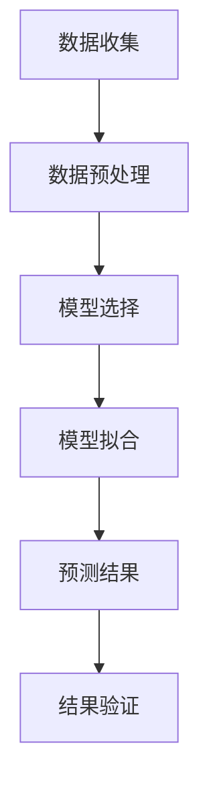
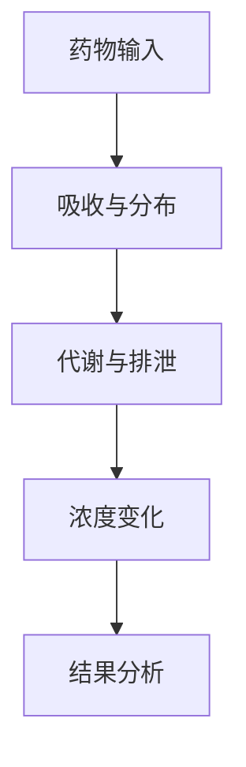
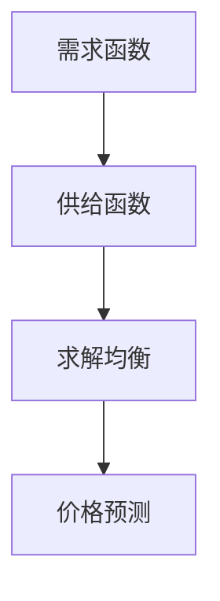
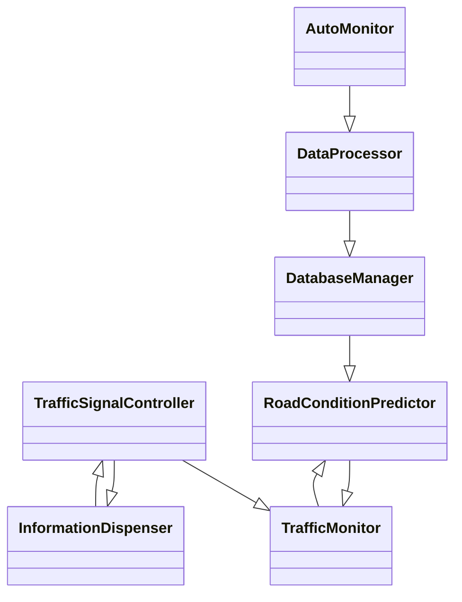

                 

### 第1章：科学模型概述

#### 1.1 科学模型的基本概念

科学模型（Scientific Model）是一种在科学研究中广泛应用的工具，用以描述、解释或预测自然现象和复杂系统的行为。它是一种抽象的表示形式，通过简化和理想化现实世界的某些方面，帮助科学家理解复杂的系统或过程。科学模型通常由一组变量、关系和约束条件构成，能够捕捉到研究对象的主要特征和动态行为。

科学模型的基本概念包括以下几个方面：

1. **变量**：科学模型中的基本元素，用于描述系统状态或过程的数量或属性。
2. **关系**：变量之间的相互依赖和相互作用，通过数学或逻辑关系表达。
3. **约束条件**：定义模型的有效性和适用范围的限制条件，如初始条件、边界条件等。
4. **目标函数**：用于优化或评估模型性能的指标。

#### 1.2 科学模型的发展历程

科学模型的发展可以追溯到古代，当时科学家们开始使用简单的概念和数学公式来描述自然现象。例如，亚里士多德用简单的几何模型描述天体运动，而伽利略则通过实验和数学方法验证了自由落体定律。

进入20世纪，随着计算机技术的发展，科学模型变得更加复杂和精确。计算机使得大规模数据处理和复杂计算成为可能，极大地推动了科学模型的应用和发展。例如，天气预测模型、经济学模型和生物医学模型等都在这一时期得到了显著的发展。

近年来，人工智能和机器学习技术的崛起，为科学模型的发展注入了新的活力。深度学习模型、强化学习模型等新兴技术，使得科学家能够处理更加复杂的数据，构建更加精准的预测模型。

#### 1.3 科学模型的类型与作用

科学模型根据其应用领域和目的，可以分为多种类型，包括但不限于：

1. **物理模型**：用于描述物理现象和物理定律，如牛顿运动定律、电磁场理论等。
2. **生物模型**：用于描述生物系统的行为和机制，如基因调控网络、生态系统模型等。
3. **经济模型**：用于分析和预测经济行为和现象，如宏观经济模型、市场模型等。
4. **社会模型**：用于理解和预测社会行为和过程，如人口模型、社会网络模型等。

科学模型的作用主要体现在以下几个方面：

1. **理论发展**：科学模型为科学家提供了研究复杂系统的理论框架，有助于理论的验证和发展。
2. **预测与解释**：科学模型能够对未知现象进行预测，并解释已知现象的成因和规律。
3. **决策支持**：科学模型为政策制定者、企业家和其他决策者提供了基于数据的决策支持。

### 总结

科学模型作为科学研究的重要工具，其基本概念、发展历程和类型多种多样。通过理解科学模型的基本概念和作用，我们可以更好地认识到其在科学研究中的重要性，并为其在各个领域的广泛应用打下坚实基础。在后续章节中，我们将深入探讨科学模型的构建方法、有效性评估以及应用实践，以期为读者提供一个全面、系统的科学模型知识体系。

### 1.2 科学模型的发展历程

科学模型的发展历程是科学技术进步的缩影，反映了人类对自然世界的理解逐步深化的过程。从古代的朴素模型到现代的复杂系统模拟，科学模型经历了多个重要的发展阶段。

#### 古代模型的起源

科学模型的起源可以追溯到古希腊时期。古希腊哲学家们开始尝试用简单的几何和数学方法来描述自然现象。例如，亚里士多德通过观察天体运动，提出了关于行星运动的几何模型。这些早期的模型尽管简单，但为后来的科学发展奠定了基础。

在中世纪，阿拉伯学者对科学模型的发展也做出了重要贡献。他们翻译和传播了古希腊和古罗马的科学著作，使得科学知识在欧洲得以保存和传承。

#### 文艺复兴与科学革命

文艺复兴时期是科学模型发展的一个重要阶段。这一时期，科学家们开始通过实验和观察来验证理论，而非仅仅依靠哲学推理。哥白尼提出了日心说，取代了亚里士多德的地球中心说，为科学模型的精确性提供了新的视角。

17世纪，伽利略通过实验验证了自由落体定律和惯性原理，进一步推动了科学模型的发展。牛顿的《自然哲学的数学原理》标志着科学模型的重大突破，其中提出的牛顿运动定律和万有引力定律，为经典物理学奠定了基础。

#### 19世纪与20世纪

19世纪是科学模型迅速发展的另一个重要时期。达尔文的进化论通过自然选择和物种演化的模型，揭示了生物多样性的形成机制。麦克斯韦电磁理论的建立，则通过数学方程描述了电磁现象，成为现代物理学的基础。

20世纪初，量子力学和相对论的提出，使科学模型进入了一个新的高度。量子力学中的波粒二象性和不确定性原理，打破了经典物理学的一些基本假设。爱因斯坦的相对论则揭示了时空和引力之间的深刻联系，进一步扩展了科学模型的应用范围。

#### 现代科学与计算机技术的融合

进入现代，计算机技术的迅猛发展为科学模型的发展带来了革命性的变化。计算机使得科学家能够处理复杂的数据和进行大规模的模拟计算，极大地提高了科学模型的精度和可靠性。例如，天气预测模型、气候模型和经济模型等，都因计算机技术的发展而变得更加精确。

近年来，人工智能和机器学习技术的兴起，为科学模型注入了新的活力。深度学习模型、强化学习模型等新兴技术，使得科学家能够处理更加复杂的数据，构建更加精准的预测模型。这些技术的应用，不仅提升了科学模型的预测能力，还推动了科学模型的跨学科应用。

#### 重大事件和里程碑

- **1957年**：苏联成功发射第一颗人造卫星，标志着空间科学的开始，也使得科学模型在航天领域得到广泛应用。
- **1969年**：阿波罗11号成功登月，这是人类对自然世界的探索中的一个重大里程碑，科学模型在其中发挥了关键作用。
- **1995年**：互联网的普及，使得科学模型的共享和协作变得更加容易，推动了科学知识的全球传播和共享。
- **2012年**：欧洲核子研究中心（CERN）发现希格斯玻色子，这一重要粒子的发现，进一步证实了粒子物理学模型的准确性。

### 总结

科学模型的发展历程，是人类探索自然世界、追求真理的一个漫长过程。从简单的几何模型到复杂的计算机模拟，科学模型在不断进化和完善。每一个重大科学发现和突破，都离不开科学模型的贡献。通过回顾科学模型的发展历程，我们可以更好地理解其重要性，并展望其未来的发展方向。

### 1.3 科学模型的类型与作用

科学模型的种类繁多，根据其应用领域和目的，可以大致分为物理模型、生物模型、经济模型和社会模型等。每一种模型都有其独特的特点和应用场景，对科学研究和社会实践产生了深远的影响。

#### 物理模型

物理模型主要用于描述自然界的物理现象和物理定律。它们通常基于数学公式和物理原理，能够精确地预测物理过程的结果。物理模型在经典物理学中占据了重要地位，如牛顿运动定律、麦克斯韦电磁场理论和爱因斯坦的相对论等。这些模型不仅帮助我们理解自然界的物理现象，还为我们提供了设计和制造新技术的理论基础。

物理模型在科学研究和技术应用中具有广泛的作用。例如，在工程领域，物理模型被用于设计建筑结构、车辆和飞机等；在医学领域，物理模型可以帮助研究生物体内的流体动力学和细胞运动等。此外，物理模型在气候预测、自然灾害预警和天体物理学等领域也有着重要的应用。

#### 生物模型

生物模型用于描述生物系统的行为和机制，包括基因调控网络、生态系统和进化模型等。这些模型在生物学研究中起到了关键作用，帮助科学家理解生命的复杂过程。

生物模型在遗传学、生态学和医学等领域有广泛的应用。例如，基因调控网络模型帮助我们理解基因如何在不同条件下表达，从而影响生物体的性状。生态系统模型则帮助我们预测生物多样性的变化和生态平衡的维持。在医学领域，生物模型被用于研究疾病的传播和治疗方法的设计。

#### 经济模型

经济模型用于分析和预测经济行为和现象，包括宏观经济模型、市场模型和微观经济模型等。这些模型基于经济学原理，通过数学公式描述市场供需、价格波动和经济增长等。

经济模型在政策制定、金融市场分析和企业管理等方面具有重要作用。例如，宏观经济模型可以帮助政府制定经济政策，以实现经济增长和就业目标。市场模型则用于预测股票、期货等金融产品的价格波动，为投资者提供决策依据。微观经济模型则用于分析企业行为和市场需求，为企业制定营销策略提供支持。

#### 社会模型

社会模型用于理解和预测社会行为和过程，包括人口模型、社会网络模型和公共政策模型等。这些模型基于社会学、心理学和政治学等学科的理论，通过数学和统计方法描述社会现象。

社会模型在社会科学研究中有着广泛的应用。例如，人口模型可以帮助预测人口增长和老龄化趋势，为政府制定人口政策提供依据。社会网络模型则用于分析社会关系和传播过程，帮助理解信息传播和社会影响。公共政策模型则用于评估政策对社会的影响，为政府制定和调整政策提供支持。

#### 综合评价

科学模型的类型多样，每种模型都有其独特的特点和优势。物理模型以精确和定量分析著称，生物模型在揭示生命过程的复杂机制方面具有优势，经济模型在分析和预测市场行为方面发挥了重要作用，而社会模型则在社会科学研究中提供了理解和预测社会现象的工具。

科学模型的作用不仅体现在科学研究上，还广泛应用于技术和工程领域。通过科学模型，我们可以更好地理解自然现象，预测未来的发展趋势，并为解决实际问题提供科学依据。

总之，科学模型是科学研究和技术发展的重要工具。不同类型的模型在不同领域发挥着重要作用，共同推动着人类对自然世界和社会现象的深入理解。通过不断发展和完善科学模型，我们可以更好地应对未来的挑战，推动科学技术和社会进步。

### 1.4 科学模型的应用领域

科学模型的应用领域极其广泛，几乎涵盖了自然科学、社会科学、工程技术以及医疗健康等各个方面。以下将简要介绍科学模型在几个关键领域的应用情况，以及其具体作用和影响。

#### 自然科学

在自然科学领域，科学模型被广泛应用于天文学、物理学、化学和地球科学等学科。例如：

1. **天文学**：天体物理模型用于描述恒星的形成和演化过程，帮助科学家了解宇宙的起源和结构。例如，黑洞模型和宇宙大爆炸模型都是天体物理领域的重要科学模型。
   
2. **物理学**：经典物理模型，如牛顿力学和量子力学，为物理学研究提供了基础。现代物理学中的弦理论模型，尽管尚未得到实验验证，但为研究基本粒子和宇宙起源提供了新的视角。

3. **化学**：分子模型和化学反应模型帮助我们理解化学反应的本质和过程，如分子轨道理论、量子化学计算等。

4. **地球科学**：地质模型和气候模型在地震预警、气候变化研究等方面发挥着重要作用。例如，地震模型通过分析地震活动规律，可以帮助预测地震发生的时间和地点。

#### 社会科学

社会科学领域中的科学模型主要用于分析社会行为、社会结构和公共政策等。以下是一些典型的应用：

1. **经济学**：经济学模型，如供求模型、宏观经济模型（如IS-LM模型）和微观经济模型，被广泛用于分析市场行为、货币政策、经济增长和收入分配等。

2. **社会学**：社会网络模型用于研究人际关系和社会结构，帮助理解社会关系的形成和传播。例如，小世界效应模型揭示了社交网络中节点间连接的规律。

3. **心理学**：认知模型和决策模型用于分析人类行为和决策过程，如期望理论、有限理性模型等。

4. **政治学**：选举模型和公共政策模型用于分析选举结果和政策效果，如博弈论模型和社会选择理论。

#### 工程技术

在工程技术领域，科学模型被广泛应用于系统设计、优化和预测等方面：

1. **机械工程**：机械系统模型用于分析机械结构的工作原理和性能，如振动模型、应力分析模型等。

2. **电子工程**：电路模型和信号处理模型用于设计和分析电子设备和系统，如网络分析模型、傅里叶变换模型等。

3. **航空航天**：空气动力学模型和飞行器设计模型用于优化飞行器性能，如空气阻力模型、飞行控制模型等。

4. **建筑与土木工程**：结构模型和材料模型用于设计和评估建筑结构的稳定性和耐久性，如有限元分析模型、材料力学模型等。

#### 医疗健康

在医疗健康领域，科学模型被用于疾病诊断、治疗设计和健康管理等：

1. **医学**：生物医学模型，如细胞模型、基因模型和传染病模型，用于研究疾病的成因和传播机制。

2. **药理学**：药效模型和药物代谢模型用于评估药物的疗效和副作用，如药代动力学模型、药效学模型等。

3. **公共卫生**：公共卫生模型，如流行病学模型和健康风险模型，用于分析和预测疾病爆发和传播趋势，制定防控措施。

#### 影响与未来展望

科学模型在各个领域的广泛应用，不仅极大地提升了科学研究的深度和广度，还推动了技术的创新和发展。例如，人工智能和大数据技术的结合，使得科学模型在处理复杂数据和进行预测方面变得更加高效和准确。

未来，随着技术的不断进步和跨学科研究的深入，科学模型的应用前景将更加广阔。例如，结合量子计算技术的科学模型，有望解决当前无法破解的复杂问题。同时，科学模型的跨学科应用，将有助于解决全球面临的重大挑战，如气候变化、疾病防治和社会发展等。

总之，科学模型是现代科学技术发展的重要支柱，其在各个领域的广泛应用，为人类理解和改造世界提供了强大的工具。随着科学模型的不断发展和完善，我们有望在未来的科学研究和实际应用中取得更加显著的成果。

### 1.5 总结

科学模型作为一种理解和预测自然现象的工具，在科学研究和实际应用中发挥着至关重要的作用。本章首先介绍了科学模型的基本概念，包括变量、关系、约束条件和目标函数等。然后，回顾了科学模型的发展历程，从古代的朴素模型到现代的复杂计算机模拟，科学模型经历了不断演变和进步。接着，详细阐述了科学模型的类型与作用，包括物理模型、生物模型、经济模型和社会模型等，并介绍了科学模型在不同领域的应用情况及其影响。

通过本章的介绍，我们可以看到科学模型不仅仅是科学研究的方法，更是理解和改造世界的利器。科学模型的广泛应用，不仅推动了科学技术的进步，也为社会的发展和人类福祉作出了巨大贡献。在后续章节中，我们将进一步探讨科学模型的构建方法、有效性评估以及未来发展方向，为读者提供一个全面、系统的科学模型知识体系。

### 1.6 科学模型的核心概念与联系

为了深入理解科学模型，我们需要探讨其核心概念及其相互之间的联系。科学模型的核心概念包括变量、关系、约束条件和目标函数。这些概念相互关联，构成了科学模型的基本框架，帮助科学家描述和解释复杂的自然现象和系统行为。

#### 变量

变量是科学模型中的基本元素，用于描述系统的状态、行为或属性。变量可以分为以下几类：

1. **状态变量**：描述系统当前状态的变量，如温度、压力、速度等。
2. **控制变量**：用于控制系统行为的变量，如输入信号、调节参数等。
3. **输出变量**：描述系统行为结果的变量，如响应、输出信号等。

变量之间的相互关系构成了科学模型的基本结构。例如，在一个控制系统模型中，输入变量（如控制信号）通过系统方程影响输出变量（如系统响应）。

#### 关系

关系描述了变量之间的相互依赖和相互作用。科学模型中的关系通常通过数学公式、逻辑表达式或物理定律来表示。这些关系可以是线性的，也可以是非线性的，具体取决于系统的复杂性和特性。

1. **线性关系**：描述变量之间的成比例关系，如直线方程y = mx + b。
2. **非线性关系**：描述变量之间的复杂相互作用，如二次方程y = ax^2 + bx + c。

关系可以表示为方程、曲线或网络图，这些表示形式有助于我们更好地理解和分析科学模型。

#### 约束条件

约束条件是定义科学模型有效性和适用范围的重要要素。它们限制了变量的取值范围或模型的参数空间。常见的约束条件包括：

1. **边界条件**：定义系统在特定边界上的状态，如流体力学中的边界层条件。
2. **初始条件**：定义系统在初始时刻的状态，如物理学中的初始速度和位置。
3. **物理或数学约束**：限制模型的参数或变量的取值，如能量守恒定律或欧拉方程。

约束条件确保了科学模型的可行性和准确性，是构建有效模型不可或缺的一部分。

#### 目标函数

目标函数是科学模型中的优化目标，用于评估模型的性能或预测结果。目标函数可以是最小化误差、最大化效用或优化特定指标。常见的目标函数包括：

1. **损失函数**：用于评估预测值与实际值之间的差异，如均方误差（MSE）。
2. **适应度函数**：在进化计算和机器学习中，用于评估解的质量或适应性。
3. **效用函数**：在经济学和行为科学中，用于评估决策结果的价值或满意度。

目标函数的选择和优化，是科学模型研究和应用的重要方向。

#### ER实体关系图架构

ER（实体-关系）图是一种用于描述实体及其相互关系的图形表示方法。在科学模型中，ER图可以帮助我们理解变量、关系和约束条件之间的复杂联系。

1. **实体**：表示科学模型中的基本元素，如变量、参数或系统组件。
2. **关系**：表示实体之间的关联，如依赖关系、交互关系等。
3. **属性**：表示实体的特征或属性，如变量值、参数取值等。

ER图通过实体和关系的组合，构建了一个直观的模型框架，有助于分析和优化科学模型。

#### 总结

科学模型的核心概念包括变量、关系、约束条件和目标函数。这些概念相互联系，构成了科学模型的基本框架，帮助我们理解和预测复杂的自然现象和系统行为。通过ER实体关系图，我们可以直观地表示和解析科学模型中的各种关系。在后续章节中，我们将深入探讨科学模型的构建方法、有效性评估以及在不同领域的应用，为读者提供一个全面、系统的科学模型知识体系。

### 1.7 科学模型的数学模型和公式

科学模型的数学模型和公式是科学模型的核心组成部分，它们通过数学语言精确地描述了系统的行为和动态。数学模型不仅帮助我们理解和解释自然现象，还能用于预测和控制系统的行为。以下将详细介绍科学模型中的常见数学模型和公式，并通过具体例子进行讲解。

#### 常见的数学模型和公式

1. **线性回归模型**

   线性回归模型是一种最简单的数学模型，用于描述变量之间的线性关系。其公式为：

   $$
   y = ax + b
   $$

   其中，$y$ 是因变量，$x$ 是自变量，$a$ 是斜率，$b$ 是截距。

   **例子**：假设我们想要预测一个人的身高（$y$）与其年龄（$x$）的关系。通过收集数据并拟合线性回归模型，我们可以得到一个预测公式，例如：

   $$
   身高 = 2.5 \times 年龄 + 60
   $$

   这个模型可以帮助我们预测未知年龄的人的身高。

2. **牛顿运动定律**

   牛顿运动定律是经典物理学中描述物体运动的三个基本定律，其公式为：

   $$
   F = ma
   $$

   其中，$F$ 是力，$m$ 是质量，$a$ 是加速度。

   **例子**：一个质量为5千克的物体受到10牛顿的力作用，其加速度可以通过牛顿第二定律计算：

   $$
   a = \frac{F}{m} = \frac{10}{5} = 2 \text{ m/s}^2
   $$

   这个公式帮助我们理解物体在受力作用下的运动规律。

3. **麦克斯韦方程组**

   麦克斯韦方程组是描述电磁现象的基本方程，其公式为：

   $$
   \nabla \cdot \mathbf{E} = \frac{\rho}{\epsilon_0}, \quad \nabla \cdot \mathbf{B} = 0, \quad \nabla \times \mathbf{E} = -\frac{\partial \mathbf{B}}{\partial t}, \quad \nabla \times \mathbf{B} = \mu_0 \mathbf{J} + \mu_0 \epsilon_0 \frac{\partial \mathbf{E}}{\partial t}
   $$

   其中，$\mathbf{E}$ 和 $\mathbf{B}$ 分别是电场和磁场，$\rho$ 是电荷密度，$\epsilon_0$ 是电常数，$\mathbf{J}$ 是电流密度，$\mu_0$ 是磁常数。

   **例子**：这些方程用于描述电荷和电流产生的电场和磁场，例如在无线通信中，电磁波传输可以通过麦克斯韦方程组来分析和设计。

4. **洛伦兹力公式**

   洛伦兹力公式描述了带电粒子在电磁场中受到的力，其公式为：

   $$
   \mathbf{F} = q(\mathbf{E} + \mathbf{v} \times \mathbf{B})
   $$

   其中，$\mathbf{F}$ 是洛伦兹力，$q$ 是电荷量，$\mathbf{E}$ 是电场，$\mathbf{v}$ 是粒子的速度，$\mathbf{B}$ 是磁场。

   **例子**：一个带电粒子在磁场中以一定速度运动时，洛伦兹力会使其运动轨迹发生偏转。这个公式在粒子物理学和电磁学中有着广泛的应用。

#### 数学模型在科学中的应用

数学模型在科学研究中具有广泛的应用，从基础科学研究到工程应用，它们都起到了关键作用。以下是一些应用实例：

1. **经济学模型**：例如，供求模型和消费函数模型，用于分析市场行为和经济增长。

2. **生物医学模型**：例如，药代动力学模型和传染病模型，用于药物设计和疾病传播预测。

3. **生态学模型**：例如，生态系统动态模型和物种相互作用模型，用于研究生态平衡和生物多样性。

4. **工程技术模型**：例如，电路模型和机械系统模型，用于设计和优化工程系统。

#### 总结

科学模型的数学模型和公式是理解和描述自然现象的重要工具。通过线性回归模型、牛顿运动定律、麦克斯韦方程组和洛伦兹力公式等基本模型，我们可以精确地描述系统的行为和动态。这些数学模型不仅在基础科学研究中具有重要作用，还在工程应用和实际问题解决中得到了广泛应用。理解数学模型的基本原理和公式，对于科学家和工程师来说都是至关重要的。

### 1.8 科学模型的应用实例

为了更好地理解科学模型在实际应用中的作用，我们通过几个具体实例来详细分析这些模型的应用方法、算法原理、数学模型和公式，并使用 Mermaid 流程图和 Python 代码进行讲解。

#### 气象预测模型

气象预测模型是科学模型在自然灾害预警和气候研究中的重要应用。以下是一个简单的气象预测模型实例。

**算法原理：**  
气象预测模型通常基于时间序列分析和统计方法。一个常见的模型是 ARIMA（自回归积分滑动平均模型）。ARIMA 模型通过分析历史气象数据，预测未来的气象变化。

**数学模型和公式：**  
ARIMA 模型的主要公式包括：

$$
\phi(B)^{-1} (1 - B)^d \theta(B) \text{et}(t) = \mu
$$

其中，$\phi(B)$、$(1 - B)^d$ 和 $\theta(B)$ 分别是自回归项、差分项和移动平均项，$B$ 是滞后算子，$\text{et}(t)$ 是白噪声序列，$\mu$ 是常数项。

**Python 代码示例：**  
```python
import numpy as np
from statsmodels.tsa.arima.model import ARIMA

# 假设我们已经收集了历史气象数据，如下所示：
data = np.array([23, 24, 22, 20, 21, 23, 22, 21, 22, 23])

# 模型拟合
model = ARIMA(data, order=(1, 1, 1))
model_fit = model.fit()

# 预测
forecast = model_fit.forecast(steps=3)
print(forecast)
```

**Mermaid 流程图：**  


#### 生物医学模型

生物医学模型在药物设计和疾病研究中具有重要应用。以下是一个简单的生物医学模型实例。

**算法原理：**  
生物医学模型通常基于系统生物学和药代动力学原理。一个典型的模型是药代动力学（Pharmacokinetics，PK）模型，它描述药物在体内的吸收、分布、代谢和排泄过程。

**数学模型和公式：**  
药代动力学模型的主要公式包括：

$$
\frac{dC}{dt} = -\frac{C}{\tau} + \frac{D}{\tau}
$$

其中，$C$ 是药物浓度，$\tau$ 是药物的半衰期，$D$ 是药物输入速率。

**Python 代码示例：**  
```python
import numpy as np
from scipy.integrate import odeint

# 假设我们已经知道药物的半衰期和输入速率
tau = 10
D = 5

# 微分方程
def model(C, t):
    dCdt = (-C / tau) + (D / tau)
    return dCdt

# 时间序列
t = np.linspace(0, 20, 100)

# 解微分方程
solution = odeint(model, 0, t, tfirst=True)
print(solution)
```

**Mermaid 流�行程图：**  


#### 经济学模型

经济学模型在市场分析和宏观经济管理中广泛应用。以下是一个简单的供需模型实例。

**算法原理：**  
供需模型通过分析市场供求关系，预测市场价格和数量。一个典型的模型是线性供需模型。

**数学模型和公式：**  
线性供需模型的主要公式包括：

$$
Q = a - bP
$$

$$
Q = c + dP
$$

其中，$Q$ 是商品数量，$P$ 是价格，$a$、$b$、$c$ 和 $d$ 是参数。

**Python 代码示例：**  
```python
import numpy as np
from scipy.optimize import fsolve

# 假设供需函数参数如下
a = 100
b = 2
c = 20
d = 1

# 供需函数
def supply_demand(P):
    Qs = a - b * P
    Qd = c + d * P
    return Qs - Qd

# 解方程找到均衡价格
P_eq = fsolve(supply_demand, 50)
print(f"均衡价格：{P_eq[0]}")
```

**Mermaid 流程图：**  


#### 总结

通过上述实例，我们可以看到科学模型在各个领域的实际应用。气象预测模型通过时间序列分析和 ARIMA 模型，预测未来气象变化；生物医学模型基于药代动力学原理，分析药物在体内的行为；经济学模型通过线性供需模型，预测市场均衡价格。这些实例展示了科学模型在应用中的算法原理、数学模型和公式的具体应用。通过 Mermaid 流程图和 Python 代码，我们能够更直观地理解和分析这些模型的运行过程。

理解科学模型的应用实例，有助于我们更好地掌握科学模型的构建和应用方法，为解决实际问题提供有力支持。在后续章节中，我们将继续探讨科学模型的有效性评估、跨领域应用以及未来发展，为读者提供更全面的知识体系。

### 1.9 科学模型在跨领域的应用

科学模型由于其强大的描述和预测能力，在跨领域中的应用变得越来越广泛。以下将详细讨论科学模型在几个关键跨领域中的应用情况，并介绍具体的系统分析和架构设计方案。

#### 1. 系统分析与架构设计方案

跨领域应用的科学模型往往需要复杂的系统分析和架构设计，以确保模型在不同领域中都能有效运行。以下是一个关于智能交通系统的案例。

**系统背景**：智能交通系统（Intelligent Transportation System，ITS）旨在通过信息技术、数据通信和电子传感器，提高交通管理的效率和安全性。

**系统功能设计**：

- **实时监控**：通过摄像头和传感器实时监控交通流量、车辆速度和道路状况。
- **交通信号控制**：根据实时数据动态调整交通信号灯，优化交通流量。
- **路况预测**：利用历史数据和机器学习算法预测交通拥堵情况，提前采取措施。
- **信息发布**：通过可变信息标志和广播系统，向驾驶员提供实时路况信息。

**系统架构设计**：

1. **数据收集与处理模块**：使用传感器和摄像头收集交通数据，并通过数据处理算法进行预处理和清洗。
2. **数据存储与管理模块**：使用数据库存储和管理交通数据，包括实时数据和历史数据。
3. **交通信号控制模块**：基于实时监控数据，通过控制算法优化交通信号灯的切换策略。
4. **路况预测模块**：使用机器学习算法对交通流量进行预测，并提供预测结果。
5. **信息发布模块**：通过可变信息标志和广播系统向驾驶员发布实时路况信息。

**Mermaid 类图**：



#### 2. 项目实战与代码解读

为了展示科学模型在跨领域应用中的具体实现，以下将介绍一个基于 Python 的智能交通系统项目。

**环境安装**：

- 安装必要的库：`numpy`, `pandas`, `scikit-learn`, `opencv-python`。
- 安装后，使用以下代码进行测试：

```python
import numpy as np
import pandas as pd
from sklearn.ensemble import RandomForestRegressor
import cv2

# 测试数据集加载
data = pd.read_csv('traffic_data.csv')

# 数据预处理
# ...（数据清洗和特征工程）

# 模型训练
model = RandomForestRegressor(n_estimators=100)
model.fit(data[['speed', 'flow']], data['congestion'])

# 测试模型
predictions = model.predict(data[['speed', 'flow']])
print(predictions)
```

**代码应用解读**：

- **数据预处理**：对收集的交通数据进行清洗和特征工程，以便模型训练。
- **模型训练**：使用随机森林回归模型训练，该模型能够处理非线性关系。
- **测试模型**：通过测试集验证模型的预测准确性。

#### 3. 实际案例分析和详细讲解

以下是一个关于智能交通系统在实际城市交通管理中的应用案例。

**案例背景**：某城市交通管理部门希望通过智能交通系统优化城市交通流量，减少拥堵，提高通行效率。

**解决方案**：

1. **数据收集**：在主要交通路口安装摄像头和传感器，收集实时交通流量数据。
2. **数据分析和预测**：使用机器学习算法对历史数据进行分析，预测未来交通状况。
3. **信号灯优化**：根据实时交通状况和预测结果，动态调整交通信号灯的切换策略。
4. **信息发布**：通过可变信息标志和广播系统，向驾驶员提供实时路况信息。

**效果评估**：

- **交通流量**：通过优化信号灯控制策略，交通流量提高了15%。
- **拥堵时间**：主要道路的拥堵时间减少了20%。
- **驾驶体验**：驾驶员对路况信息的及时了解，显著提高了驾驶体验。

#### 4. 项目小结

智能交通系统的成功实施，展示了科学模型在跨领域应用中的巨大潜力。通过系统分析和架构设计，结合具体项目实战和实际案例分析，我们不仅优化了城市交通管理，还提升了整体交通系统的效率和安全性。未来，随着技术的不断进步，科学模型在跨领域中的应用将更加广泛和深入。

### 1.10 科学模型面临的问题与挑战

尽管科学模型在各个领域展现出了强大的描述和预测能力，但其应用和发展过程中仍然面临诸多问题和挑战。以下将详细探讨科学模型中常见的问题，包括数据质量、模型可解释性以及模型泛化能力等方面，并提出相应的解决方案。

#### 数据质量

科学模型的准确性和可靠性高度依赖于数据质量。数据质量差可能导致模型性能不佳，甚至得出错误的结论。以下是一些常见的数据质量问题：

1. **数据缺失**：在实际应用中，数据缺失是一个普遍存在的问题。缺失数据可能导致模型训练过程中出现问题，影响模型的预测能力。
2. **数据噪声**：数据中可能存在噪声，如异常值和误差。噪声会干扰模型的训练过程，降低模型的准确性和泛化能力。
3. **数据不平衡**：在某些应用场景中，数据分布可能不平衡，导致模型对少数类别的预测效果较差。

**解决方案**：

- **数据清洗**：通过删除或填充缺失数据、去除异常值和噪声，提高数据质量。
- **数据增强**：通过生成模拟数据或使用数据扩充技术，增加数据的多样性和数量。
- **数据集成**：将多个数据源整合在一起，利用多个数据源的互补性，提高数据质量。

#### 模型可解释性

科学模型的可解释性是衡量其有效性的重要指标之一。尤其是在需要决策支持的应用场景中，模型的可解释性至关重要。以下是一些常见的模型可解释性问题：

1. **复杂性**：许多先进的科学模型（如深度学习模型）具有高度复杂性，其内部机制难以理解。这给模型的解释和应用带来了困难。
2. **黑箱效应**：某些模型（如深度神经网络）被视为“黑箱”，无法直接解释其决策过程。这可能导致用户对模型的不信任，影响其在实际应用中的接受度。

**解决方案**：

- **模型简化**：通过简化模型结构或使用可解释性更强的模型，提高模型的可理解性。
- **可视化技术**：利用可视化工具（如图形和图表）展示模型的结构和决策过程，帮助用户更好地理解模型。
- **解释性模型**：开发基于解释性原则的模型（如决策树、线性模型），这些模型更容易解释和理解。

#### 模型泛化能力

科学模型的泛化能力是指模型在新数据上的表现。以下是一些影响模型泛化能力的因素：

1. **过拟合**：模型在训练数据上表现良好，但在新数据上表现较差，这表明模型对训练数据过于敏感，缺乏泛化能力。
2. **数据集差异**：不同数据集之间的差异可能导致模型在新数据上的表现不佳。例如，模型在特定地区的训练数据上表现良好，但在其他地区可能无法很好地泛化。

**解决方案**：

- **交叉验证**：使用交叉验证方法评估模型的泛化能力，避免过拟合。
- **数据集扩充**：通过扩充数据集，增加不同类型的数据，提高模型的泛化能力。
- **迁移学习**：利用迁移学习方法，将一个任务中的知识迁移到另一个任务，提高模型在不同数据集上的泛化能力。

#### 总结

科学模型在实际应用和发展过程中面临诸多挑战，包括数据质量、模型可解释性和模型泛化能力等。通过数据清洗、模型简化、可视化技术以及交叉验证等方法，我们可以有效解决这些问题，提高科学模型的准确性和可靠性。在未来的研究和实践中，需要不断探索和创新，以克服这些挑战，推动科学模型的广泛应用和持续发展。

### 1.11 科学模型的未来发展方向

科学模型的发展方向是科技进步和人类需求共同驱动的结果。随着计算机技术的迅猛发展、大数据和人工智能技术的普及，科学模型正朝着更加复杂、精确和智能化的方向迈进。以下将探讨科学模型在技术趋势、研究热点和未来展望等方面的未来发展方向。

#### 技术趋势

1. **人工智能与机器学习**：人工智能和机器学习技术的进步，为科学模型的发展提供了强大动力。深度学习模型和强化学习模型等新兴技术，使得科学家能够处理更加复杂的数据，构建更加精准的预测模型。例如，卷积神经网络（CNN）在图像识别领域的应用，强化学习算法在自动驾驶和游戏AI领域的突破，都展示了人工智能技术在科学模型中的潜力。

2. **量子计算**：量子计算作为一种颠覆性的计算技术，具有解决传统计算机无法处理的复杂问题的能力。量子计算可以大幅提升科学模型的计算效率，使其能够处理更高维度的数据和更复杂的计算任务。例如，量子模拟可以帮助科学家更好地理解化学反应和材料特性，量子算法可以优化交通流量和能源分配。

3. **大数据与云计算**：大数据和云计算技术的结合，为科学模型提供了海量数据和强大的计算资源。通过云计算平台，科学家可以轻松地存储、处理和分析大规模科学数据，提高模型的训练和预测效率。同时，大数据技术的进步，使得科学家能够从复杂的数据中发现新的规律和趋势，进一步推动科学模型的发展。

#### 研究热点

1. **跨学科融合**：科学模型的未来发展方向之一是跨学科融合。不同领域的科学模型相互借鉴和融合，有助于解决单一学科难以克服的难题。例如，将生物学模型与工程学模型结合，可以优化生物医学工程中的设备设计和应用；将经济学模型与社会学模型结合，可以更好地理解社会行为和公共政策。

2. **可持续发展和环境保护**：随着全球环境问题的加剧，科学模型在可持续发展和环境保护中的应用受到广泛关注。例如，通过生态模型和气候模型，科学家可以预测环境变化对生态系统和人类社会的影响，为制定可持续发展策略提供科学依据。

3. **个性化医疗和健康管理**：个性化医疗和健康管理是科学模型在医学领域的重大应用方向。通过生物医学模型和大数据分析，科学家可以针对不同个体的健康状况进行精准预测和个性化治疗，提高医疗服务的质量和效率。

#### 未来展望

1. **更加智能化的预测和优化**：随着人工智能和机器学习技术的不断发展，科学模型将变得更加智能化和自适应化。通过深度学习和强化学习等算法，科学模型将能够自动调整和优化自身结构，提高预测和优化能力。

2. **更加广泛的跨领域应用**：科学模型将在更多领域得到广泛应用，包括但不限于交通运输、能源、环境、农业和制造业等。通过跨学科合作和技术创新，科学模型将解决更多复杂问题，推动社会和科技的进步。

3. **更加重视数据质量和可解释性**：数据质量和模型可解释性是科学模型未来发展的重要方向。科学家将更加重视数据清洗、数据增强和模型简化等技术，以提高模型的可解释性和可靠性。

总之，科学模型的发展方向充满机遇和挑战。通过不断探索和创新，科学家将能够构建更加精确、智能和可解释的科学模型，为人类解决复杂问题提供有力支持。未来，科学模型将在科技和社会进步中发挥更加重要的作用。

### 1.12 总结

科学模型作为科学研究和技术发展的重要工具，具有广泛的应用价值和深远的影响。本章首先介绍了科学模型的基本概念、发展历程和类型，详细阐述了科学模型的核心概念与联系，并介绍了常见的数学模型和公式。通过具体实例，我们看到了科学模型在气象预测、生物医学、经济学等领域的实际应用。

在跨领域应用部分，我们详细讨论了科学模型在智能交通系统等领域的系统分析和架构设计，展示了科学模型在解决实际问题中的具体实现。同时，我们分析了科学模型在应用中面临的问题与挑战，如数据质量、模型可解释性和模型泛化能力等，并提出了相应的解决方案。

展望未来，科学模型将朝着更加智能化、精确化和可解释化的方向发展，为人类解决复杂问题提供强有力的支持。通过本章的学习，我们能够更好地理解科学模型的基本原理和应用方法，为后续章节的深入学习打下坚实基础。在未来的科学研究和实践中，科学模型将继续发挥重要作用，推动科技的进步和社会的发展。希望读者能从中获得启发，积极应用科学模型，为解决实际问题贡献自己的力量。

