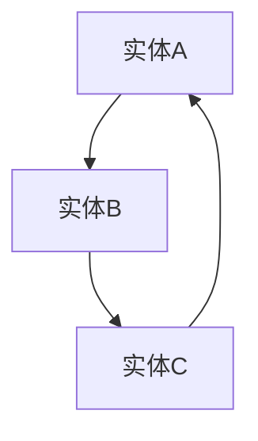
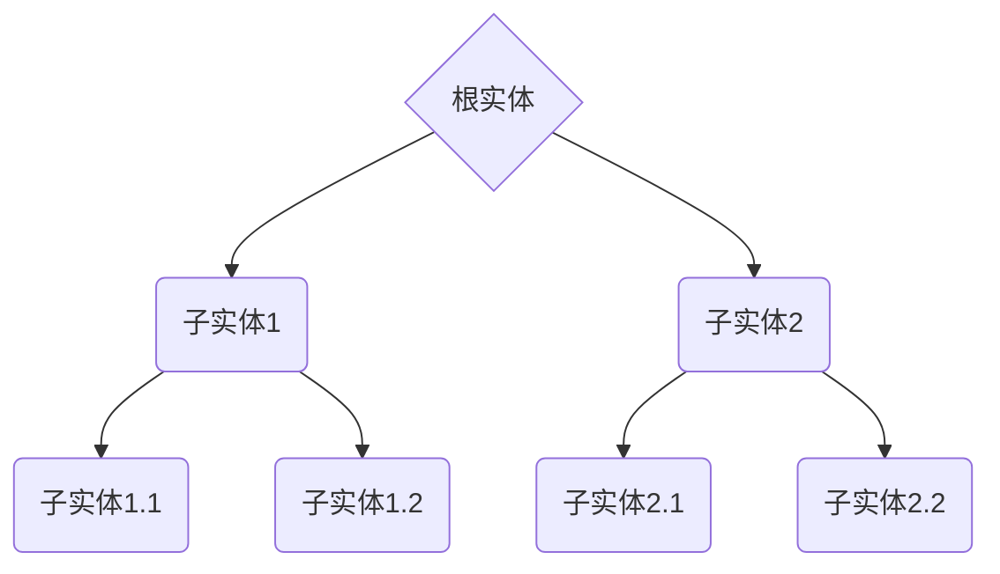

                 

### 文章标题

### 关键词

- 知识图谱
- 数据可视化
- 人工智能
- 科学研究
- 语义分析

### 摘要

本文旨在探讨科学研究的知识图谱构建，通过可视化世界知识的关联，揭示科学领域内复杂而庞大的知识网络。文章首先介绍知识图谱的基本概念、发展历史和重要性，随后深入探讨知识图谱的构建方法、应用场景、可视化技术以及实践案例。通过系统化的分析，本文旨在为读者提供一个清晰、易懂的知识图谱构建全景图，并探讨其未来发展趋势。希望通过本文，读者能够对知识图谱构建有更深入的理解，并为科学研究提供新的思路和方法。

### 目录大纲

#### 第一部分：知识图谱概述

**第1章：知识图谱的概念与背景**
1.1 知识图谱的定义
1.2 知识图谱的发展历史
1.3 知识图谱的重要性

**第2章：知识图谱的基本组成**
2.1 实体
2.2 关系
2.3 属性
2.4 知识图谱的表示

**第3章：知识图谱的构建方法**
3.1 数据源收集
3.2 数据清洗与预处理
3.3 知识抽取
3.4 知识融合与整合
3.5 知识存储与索引

**第4章：知识图谱的应用场景**
4.1 搜索引擎优化
4.2 语义分析
4.3 个性化推荐
4.4 智能问答
4.5 其他应用领域

**第5章：知识图谱可视化技术**
5.1 可视化基础
5.2 知识图谱可视化工具
5.3 可视化策略与技巧
5.4 可视化应用案例分析

**第6章：知识图谱构建实践**
6.1 实践项目背景
6.2 系统功能设计
6.3 系统架构设计
6.4 系统实现与优化
6.5 项目总结与反思

**第7章：知识图谱的未来发展趋势**
7.1 技术挑战与机遇
7.2 行业趋势分析
7.3 未来发展方向

### 知识图谱的概念与背景

#### 1.1 知识图谱的定义

知识图谱（Knowledge Graph）是一种结构化、语义化的数据模型，用于表示实体与实体之间的复杂关系。它不仅包含了大量的实体信息，还通过关系将不同实体有机地连接在一起，形成一个庞大的网络。这个网络能够模拟人类思维过程中的知识推理和联想，使得计算机在处理信息时更加智能和高效。

知识图谱的定义可以从三个维度来理解：

- **实体（Entity）**：知识图谱中的基本构建块，可以是任何具有独立存在意义的事物，如人、地点、组织、物品等。
- **关系（Relationship）**：实体之间的联系，描述了实体之间的相互作用或关联，如“属于”、“位于”、“属于某个类别”等。
- **属性（Attribute）**：对实体或关系的补充信息，如实体的年龄、性别、地点的经纬度等。

#### 1.2 知识图谱的发展历史

知识图谱的概念最早可以追溯到1972年，由美国科学家约翰·沃森（John F. Watson）在论文《A Model of the Hierarchical Structure of Human Memory》中提出。此后，随着人工智能和大数据技术的发展，知识图谱逐渐成为数据管理、信息检索和智能应用领域的重要工具。

- **早期阶段（1970-1990s）**：主要集中于知识表示和推理方法的研究。这一时期的代表性工作包括框架表示法（框架理论）、语义网络和本体论。
- **中期阶段（2000-2010s）**：随着互联网的普及和大数据技术的兴起，知识图谱开始应用于搜索引擎、社交网络和推荐系统。Google在2012年发布的知识图谱（Knowledge Graph）是这一时期的里程碑。
- **现阶段（2010s-至今）**：知识图谱技术迅速发展，应用领域不断扩大，从Web搜索、智能问答到推荐系统、自然语言处理等，都得到了广泛应用。

#### 1.3 知识图谱的重要性

知识图谱在当今信息社会中的重要性不可低估，主要体现在以下几个方面：

- **信息整合与关联**：知识图谱通过实体与关系的结构化表示，将零散的信息片段整合成有机的整体，揭示了不同信息之间的内在关联，提升了信息的可用性和互操作性。
- **智能推理与决策**：知识图谱为智能系统提供了强大的推理能力，能够基于实体间的复杂关系进行推断和决策，使得计算机在处理问题时更加智能和高效。
- **个性化服务与推荐**：知识图谱在个性化推荐系统中发挥着关键作用，通过对用户兴趣和内容的深入理解，提供更加精准和个性化的服务。
- **数据挖掘与洞察**：知识图谱为数据挖掘和分析提供了新的视角和方法，通过对大量数据的关联分析，可以发现隐藏在数据背后的深层次规律和趋势。

总之，知识图谱作为一种重要的数据模型和技术手段，正在深刻地影响着信息科学和人工智能的发展，其在科学研究、商业应用和智能服务等领域具有广泛的应用前景。

### 知识图谱的基本组成

知识图谱作为一种结构化、语义化的数据模型，其核心在于对实体、关系和属性的精确表示。这三个基本组成元素共同构建了知识图谱的框架，为数据管理和智能推理提供了基础。

#### 2.1 实体

实体是知识图谱中的基本构建块，可以是人、地点、物品、事件等各种具有独立存在意义的事物。实体的定义通常包括名称、标识符、类型和属性等信息。

- **名称**：实体的名称用于唯一标识该实体，例如“苹果”代表水果中的苹果。
- **标识符**：实体的唯一标识符，如使用URL或内部ID来标识，例如“http://example.com/entity/1234”。
- **类型**：实体所属的类别，如“苹果”属于“水果”类别。
- **属性**：实体的属性提供了关于实体的详细信息，如“苹果”的属性包括颜色、大小、产地等。

在知识图谱中，实体之间的关系是通过属性来定义的，这些属性可以是预定义的，也可以是根据上下文动态生成的。

#### 2.2 关系

关系是连接不同实体之间的桥梁，描述了实体之间的相互作用或关联。关系通常包含以下信息：

- **实体1和实体2**：关系涉及的两个实体。
- **关系类型**：关系的类型，如“属于”、“位于”、“拥有”等。
- **关系权重**：表示关系的重要程度或强度，有助于在图谱搜索和推理过程中进行优化。

关系是知识图谱的语义核心，它们不仅连接了实体，还提供了关于实体之间关系的语义信息。例如，在“苹果属于水果”这个关系中，“属于”表示了一种分类关系。

#### 2.3 属性

属性是实体的补充信息，提供了关于实体或关系的详细信息。属性可以是预定义的，也可以是动态生成的。在知识图谱中，属性通常包括以下类型：

- **预定义属性**：这些属性是预先定义好的，如实体的名称、类型、出生日期等。
- **动态属性**：这些属性是根据上下文或数据来源动态生成的，如实体的位置、购买时间、评价等。

属性的存在使得知识图谱能够提供更详细的实体描述，增强了图谱的语义丰富性和实用性。

#### 2.4 知识图谱的表示

知识图谱的表示方法决定了如何将实体、关系和属性以结构化的形式存储和表示。常见的知识图谱表示方法包括图论表示和三元组表示。

- **图论表示**：在图论表示中，知识图谱被视为一个图（Graph），其中节点表示实体，边表示关系。这种表示方法直观地展示了实体之间的关系，便于理解和推理。
  
  ```mermaid
  graph TB
  A[实体1] --> B[实体2]
  B --> C[实体3]
  ```
  
- **三元组表示**：三元组表示法（Triplet Representation）将知识图谱表示为一组三元组（Subject, Predicate, Object），其中Subject表示主体，Predicate表示谓词，Object表示客体。这种表示方法常用于分布式存储和计算，便于在大规模数据集上进行处理。

  ```python
  # 三元组表示
  (
    ('苹果', '属于', '水果'),
    ('苹果', '颜色', '红色'),
    ('苹果', '产地', '山东')
  )
  ```

知识图谱的表示方法不仅决定了其存储和查询的效率，还影响其在实际应用中的表现和效果。选择合适的表示方法需要根据具体应用场景和数据特征进行权衡。

### 知识图谱的构建方法

知识图谱的构建是一个复杂的过程，涉及数据源的收集、数据清洗与预处理、知识抽取、知识融合与整合、以及知识存储与索引等多个环节。下面将详细探讨这些构建方法，以展示知识图谱构建的全过程。

#### 3.1 数据源收集

数据源是构建知识图谱的基础，决定了图谱的完整性和准确性。数据源可以是结构化数据、非结构化数据，甚至半结构化数据。常见的数据源包括以下几种：

- **结构化数据**：如关系型数据库、NoSQL数据库等，这些数据源通常以表格形式存储，便于查询和操作。
- **非结构化数据**：如文本、图片、视频等，这些数据源需要通过自然语言处理、图像识别等技术进行解析和提取。
- **半结构化数据**：如XML、JSON等，这些数据源具有一定的结构，但不如关系型数据库那样严格。

数据源的收集通常包括以下步骤：

1. **数据采集**：通过API、爬虫、数据库连接等方式，从各种数据源中获取原始数据。
2. **数据筛选**：对采集到的数据进行筛选，去除重复、无效或错误的数据。
3. **数据去重**：去除重复的数据条目，以避免图谱中的冗余信息。

#### 3.2 数据清洗与预处理

数据清洗与预处理是知识图谱构建过程中的关键步骤，直接影响图谱的质量和效率。以下是一些常见的数据清洗与预处理方法：

- **缺失值处理**：对于缺失的数据，可以通过插值、平均值替代、缺失值删除等方法进行处理。
- **异常值处理**：识别并处理数据中的异常值，如数据录入错误、异常分布等。
- **数据转换**：将数据转换为统一的格式，如将日期转换为标准格式、将字符串编码转换为数字编码等。
- **数据标准化**：对数据进行归一化或标准化处理，以消除不同特征之间的量纲差异。

以下是一个简单的数据清洗与预处理的Python代码示例：

```python
import pandas as pd

# 读取数据
data = pd.read_csv('data.csv')

# 缺失值处理
data.fillna(value={'缺失的列': '默认值'}, inplace=True)

# 异常值处理
data = data[data['数值列'] <= 1000]

# 数据转换
data['日期'] = pd.to_datetime(data['日期'])

# 数据标准化
data['数值列'] = (data['数值列'] - data['数值列'].mean()) / data['数值列'].std()
```

#### 3.3 知识抽取

知识抽取是从原始数据中提取结构化知识的过程，是知识图谱构建的核心步骤。知识抽取可以分为以下几种类型：

- **实体抽取**：从文本中识别出实体，如人名、地名、机构名等。
- **关系抽取**：从文本中识别出实体之间的关系，如“属于”、“位于”、“拥有”等。
- **属性抽取**：从文本中提取实体的属性信息，如年龄、性别、位置等。

知识抽取的方法包括基于规则的方法、基于统计的方法、基于深度学习的方法等。以下是一个简单的基于规则的实体抽取示例：

```python
import re

# 文本
text = "张三位于北京，是一名程序员。"

# 实体识别规则
entity_rules = [
    (r"([A-Za-z]+)\s+位于\s+([A-Za-z]+)", "地点", 2),
    (r"([A-Za-z]+)\s+是\s+([A-Za-z]+)", "职业", 2),
]

# 实体抽取
entities = []
for rule in entity_rules:
    entities.extend(re.findall(rule[0], text))

# 输出
print(entities)  # [(['张三', '北京'], '地点'), (['程序员'], '职业')]
```

#### 3.4 知识融合与整合

知识融合与整合是将多个数据源中的知识进行合并和整合，以消除数据冗余、提高知识一致性。以下是一些常见的知识融合与整合方法：

- **数据对齐**：通过匹配不同数据源中的实体，将它们对齐到同一个实体上。
- **冲突解决**：在知识融合过程中，可能会出现数据冲突，如实体名称相同但属性不同，需要通过规则或机器学习算法进行冲突解决。
- **知识整合**：将多个数据源中的知识进行整合，形成统一的视图。

以下是一个简单的知识融合与整合的示例：

```python
# 数据源1
data1 = [
    {'实体': '张三', '属性': '年龄', '值': 30},
    {'实体': '张三', '属性': '职业', '值': '程序员'}
]

# 数据源2
data2 = [
    {'实体': '张三', '属性': '性别', '值': '男'},
    {'实体': '李四', '属性': '年龄', '值': 25}
]

# 知识融合与整合
knowledge_base = data1 + [item for item in data2 if item['实体'] != '张三']

# 输出
print(knowledge_base)  # [{'实体': '张三', '属性': '年龄', '值': 30}, {'实体': '张三', '属性': '职业', '值': '程序员'}, {'实体': '张三', '属性': '性别', '值': '男'}, {'实体': '李四', '属性': '年龄', '值': 25}]
```

#### 3.5 知识存储与索引

知识存储与索引是知识图谱构建的最后一步，决定了图谱的查询效率和扩展性。以下是一些常见的知识存储与索引方法：

- **关系数据库**：使用关系数据库（如MySQL、PostgreSQL等）存储知识图谱，通过SQL查询进行检索。
- **图数据库**：使用图数据库（如Neo4j、JanusGraph等）存储知识图谱，利用图结构的优势进行高效查询和计算。
- **分布式存储**：使用分布式存储系统（如Hadoop、Spark等）处理大规模的知识图谱，提供高可用性和可扩展性。

以下是一个简单的使用Neo4j图数据库存储知识图谱的示例：

```python
from py2neo import Graph

# 连接Neo4j数据库
graph = Graph("bolt://localhost:7687", auth=("neo4j", "password"))

# 创建实体节点
graph.run("CREATE (a:Person {name: '张三', age: 30})")

# 创建关系
graph.run("MATCH (a:Person), (b:Person) WHERE a.name = '张三' AND b.name = '李四' CREATE (a)-[:FRIEND]->(b)")

# 查询知识图谱
results = graph.run("MATCH (a:Person)-[:FRIEND]->(b) RETURN a, b")
for result in results:
    print(result)
```

通过上述步骤，我们可以构建一个结构化、语义化的知识图谱，为各种应用提供强大的数据支持和智能推理能力。

### 知识图谱的应用场景

知识图谱作为一种强大的数据模型，在多个领域展现出了巨大的应用潜力。下面我们将探讨知识图谱在几个主要应用场景中的具体作用和实际案例。

#### 4.1 搜索引擎优化

搜索引擎优化（SEO）是知识图谱的重要应用领域之一。通过知识图谱，搜索引擎能够更好地理解用户查询的语义，从而提供更加精准的搜索结果。

- **实体关联**：知识图谱能够捕捉实体之间的复杂关联，例如“苹果”不仅与“水果”有关，还与“苹果树”、“种植”、“营养成分”等实体相关联。这种关联性有助于搜索引擎在处理用户查询时，提供更多相关的结果。
- **查询扩展**：知识图谱能够基于已有的实体和关系，自动扩展查询结果。例如，当用户输入“苹果”时，搜索引擎可以根据知识图谱中的信息，扩展查询结果为“苹果的营养价值”、“苹果的种植方法”等。
- **上下文感知**：知识图谱能够根据用户的查询历史和上下文，提供个性化的搜索结果。例如，一个经常搜索“苹果手机”的用户，可能会在搜索“苹果”时优先看到与手机相关的内容。

实际案例：Google的知识图谱是其搜索引擎优化的重要技术之一。通过知识图谱，Google能够为用户提供更加精确和个性化的搜索结果，提升用户体验。

#### 4.2 语义分析

语义分析是自然语言处理（NLP）的关键技术，知识图谱在语义分析中起到了重要的作用。

- **实体识别**：知识图谱中的实体定义和分类信息，有助于NLP系统准确识别文本中的实体。例如，在处理文本时，系统能够识别出“张三”是一个人名，而不是地名或物品名。
- **关系抽取**：知识图谱中的关系信息有助于NLP系统理解文本中的语义关系。例如，在处理句子“张三是李四的朋友”时，系统能够识别出“张三”和“李四”之间的朋友关系。
- **语义推理**：知识图谱能够支持语义推理，例如在处理句子“张三喜欢吃苹果”时，系统可以根据知识图谱中的信息推断出“苹果”是“水果”类别。

实际案例：Facebook的语义分析系统使用了知识图谱，通过理解用户发布的内容，提供更加精准的标签建议和内容推荐。

#### 4.3 个性化推荐

个性化推荐是知识图谱在商业应用中的重要领域。通过知识图谱，推荐系统能够更好地理解用户的兴趣和行为，提供个性化的推荐。

- **兴趣建模**：知识图谱能够捕捉用户的兴趣点，例如通过用户搜索历史和浏览记录，构建用户兴趣图谱。这种兴趣图谱有助于推荐系统为用户提供更加个性化的内容。
- **关联分析**：知识图谱能够揭示不同商品或内容之间的关联关系，例如“喜欢苹果手机的用户也可能喜欢苹果笔记本”。这种关联关系有助于推荐系统发现潜在的用户兴趣点。
- **推荐算法优化**：知识图谱可以为推荐算法提供丰富的上下文信息，从而优化推荐效果。例如，在为用户推荐商品时，系统可以根据知识图谱中的信息，考虑用户的历史购买记录、兴趣标签等多种因素。

实际案例：Amazon使用了知识图谱来优化其推荐系统，通过理解用户和商品的复杂关系，提供更加精准的推荐，提升了用户的购物体验。

#### 4.4 智能问答

智能问答系统是知识图谱在人工智能领域的重要应用之一。通过知识图谱，系统能够理解和回答用户提出的问题。

- **问题理解**：知识图谱能够帮助问答系统理解用户的查询意图，例如通过识别实体和关系，将自然语言问题转化为结构化的查询。
- **答案生成**：知识图谱提供了大量的知识信息，问答系统能够利用这些信息生成准确的答案。例如，在回答“张三在哪里工作？”时，系统可以通过知识图谱中的信息，找到张三的工作地点。
- **上下文处理**：知识图谱能够处理复杂的问题和上下文，例如通过理解问题中的多个实体和关系，提供更加详细的答案。

实际案例：IBM的Watson问答系统使用了知识图谱，通过处理大量结构化和非结构化数据，提供准确的答案，广泛应用于医疗、金融等多个领域。

#### 4.5 其他应用领域

知识图谱在多个其他领域也展现了其强大的应用潜力，例如：

- **医疗健康**：知识图谱可以用于医疗信息管理，通过捕捉和整合医学知识，提供精准的诊断和治疗建议。
- **金融风控**：知识图谱可以用于金融风险评估，通过理解金融机构和客户之间的复杂关系，识别潜在风险。
- **智慧城市**：知识图谱可以用于城市管理，通过整合城市各个方面的信息，提供智能化的城市管理和服务。

实际案例：LinkedIn使用了知识图谱来优化其职业社交网络，通过理解用户和公司之间的复杂关系，提供个性化的职业推荐和机会。

总之，知识图谱作为一种强大的数据模型和技术手段，在多个领域展现了广泛的应用前景。通过构建和利用知识图谱，企业、科研机构和个人能够更好地理解和利用数据，提升决策效率和服务质量。

### 知识图谱可视化技术

知识图谱的构建不仅需要准确的数据处理和复杂的算法，还要求能够有效地呈现和解释这些数据。知识图谱可视化技术通过图形化的方式展示了图谱的结构和内容，使得用户能够直观地理解和分析知识图谱。下面，我们将探讨知识图谱可视化的基础、工具、策略与技巧，并结合实际案例进行分析。

#### 5.1 可视化基础

知识图谱可视化是基于图论和图形学原理的一种技术，其核心在于将图谱中的实体、关系和属性以视觉形式呈现出来。为了实现有效的可视化，以下基础元素是必不可少的：

- **节点（Nodes）**：在知识图谱中，节点代表实体，通常用圆形或方形图标表示。节点可以包含文字标签和图标，以便用户识别。
- **边（Edges）**：边代表实体之间的关系，通常用线段表示。边的长度、颜色和样式可以用来表示关系的类型和强度。
- **边标签（Edge Labels）**：边标签用于描述关系的性质，例如“属于”、“位于”等。边标签可以帮助用户更好地理解关系。
- **样式与颜色**：通过样式和颜色，可以突出显示特定的节点或关系，例如使用不同颜色表示不同类型的实体或关系。

以下是一个简单的知识图谱可视化示例，使用了节点和边来表示实体和关系：



这个示例展示了三个实体（A、B、C）以及它们之间的关系，通过节点和边的图形化表示，用户可以直观地看到实体之间的复杂关系。

#### 5.2 知识图谱可视化工具

知识图谱可视化工具是构建和展示知识图谱的软件平台。以下是一些流行的知识图谱可视化工具：

- **Gephi**：Gephi是一个开源的图可视化工具，支持多种图形布局算法和交互功能，适合进行大规模图谱的探索和分析。
- **Neo4j Browser**：Neo4j Browser是Neo4j图数据库自带的图形化界面，用户可以通过它直观地查看和管理知识图谱。
- **D3.js**：D3.js是一个基于JavaScript的图形库，可以用于在网页上创建复杂和交互式的数据可视化，适合需要自定义和动态交互的可视化应用。
- **Protege**：Protege是一个本体编辑器，用户可以通过它创建和编辑本体，并使用可视化工具展示本体的结构。

以下是一个使用D3.js创建的知识图谱可视化示例：

```javascript
var width = 960,
    height = 500;

var force = d3.layout.force()
    .gravity(0.05)
    .charge(-30)
    .size([width, height]);

var svg = d3.select("body").append("svg")
    .attr("width", width)
    .attr("height", height);

// 添加节点和边
d3.json("graph.json", function(error, graph) {
  if (error) throw error;

  force
      .nodes(graph.nodes)
      .links(graph.links)
      .start();

  var link = svg.selectAll(".link")
      .data(graph.links)
    .enter().append("line")
      .attr("class", "link");

  var node = svg.selectAll(".node")
      .data(graph.nodes)
    .enter().append("circle")
      .attr("class", "node")
      .attr("r", 5)
      .style("fill", function(d) { return color(d.group); })
      .on("mouseover", function(d) {
        // 鼠标悬停时显示边标签
        d3.select(this).append("text")
            .attr("x", 10)
            .attr("y", -10)
            .text(d.name);
      })
      .on("mouseout", function(d) {
        // 鼠标移开时删除边标签
        d3.select(this).select("text").remove();
      });

  node.append("title")
      .text(function(d) { return d.name; });

  force.on("tick", function() {
    link.attr("x1", function(d) { return d.source.x; })
        .attr("y1", function(d) { return d.source.y; })
        .attr("x2", function(d) { return d.target.x; })
        .attr("y2", function(d) { return d.target.y; });

    node.attr("cx", function(d) { return d.x; })
        .attr("cy", function(d) { return d.y; });
  });
});
```

这个示例使用了D3.js创建了一个简单的知识图谱，并通过鼠标悬停显示边标签。

#### 5.3 可视化策略与技巧

为了提升知识图谱的可视化效果，以下策略和技巧是值得关注的：

- **图形布局**：选择合适的图形布局算法（如力导向布局、层次布局等），以直观地展示实体和关系之间的复杂结构。
- **颜色编码**：使用颜色编码来区分不同的实体或关系类型，使图谱更具视觉区分度。
- **交互性**：增加用户交互功能，如点击、拖动、悬停提示等，提升用户的探索和分析体验。
- **层次结构**：通过层次结构图展示实体之间的层次关系，使复杂的图谱结构更加清晰。
- **动画效果**：使用动画效果展示图谱的演变过程，例如节点和边的动态添加和删除，有助于用户理解图谱的动态变化。

以下是一个使用层次结构图展示知识图谱的示例：



这个示例使用了层次结构图来展示实体的层次关系，使复杂的图谱结构更加清晰。

#### 5.4 可视化应用案例分析

为了更好地理解知识图谱可视化的实际应用，下面我们将分析两个具体案例：

- **案例一：社交网络分析**：在社交网络分析中，知识图谱可视化可以用于展示用户之间的社交关系。例如，通过D3.js创建的社交网络图，可以直观地展示用户之间的好友关系、社群结构等，帮助用户更好地理解和分析社交网络。
  
  ```javascript
  // 社交网络图示例代码
  var nodes = [
    {id: 1, label: "张三", group: "用户"},
    {id: 2, label: "李四", group: "用户"},
    {id: 3, label: "王五", group: "用户"},
    {id: 4, label: "张三的好友", group: "关系", source: 1, target: 2},
    {id: 5, label: "李四的好友", group: "关系", source: 2, target: 3}
  ];

  var links = [
    {source: 1, target: 2},
    {source: 2, target: 3}
  ];

  var width = 960, height = 500;

  var svg = d3.select("body").append("svg")
      .attr("width", width)
      .attr("height", height);

  var simulation = d3.forceSimulation(nodes)
      .force("link", d3.forceLink(links).id(function(d) { return d.id; }))
      .force("charge", d3.forceManyBody().strength(-30))
      .force("center", d3.forceCenter(width / 2, height / 2));

  var link = svg.selectAll(".link")
      .data(links)
    .enter().append("line")
      .attr("class", "link");

  var node = svg.selectAll(".node")
      .data(nodes)
    .enter().append("circle")
      .attr("class", "node")
      .attr("r", 5)
      .style("fill", function(d) { return d.group == "用户" ? "blue" : "red"; });

  node.append("title")
      .text(function(d) { return d.label; });

  simulation.on("tick", function() {
    link.attr("x1", function(d) { return d.source.x; })
        .attr("y1", function(d) { return d.source.y; })
        .attr("x2", function(d) { return d.target.x; })
        .attr("y2", function(d) { return d.target.y; });

    node.attr("cx", function(d) { return d.x; })
        .attr("cy", function(d) { return d.y; });
  });
  ```

- **案例二：产品推荐系统**：在产品推荐系统中，知识图谱可视化可以用于展示产品之间的关联关系，帮助用户理解产品的分类和推荐机制。例如，通过D3.js创建的关联图谱，可以直观地展示不同产品之间的相似度和推荐路径。

  ```javascript
  // 产品推荐系统示例代码
  var products = [
    {id: 1, label: "苹果手机", category: "电子产品"},
    {id: 2, label: "笔记本电脑", category: "电子产品"},
    {id: 3, label: "洗衣机", category: "家电产品"},
    {id: 4, label: "冰箱", category: "家电产品"},
    {id: 5, label: "苹果电脑", category: "电子产品"}
  ];

  var associations = [
    {source: 1, target: 2, weight: 0.8},
    {source: 1, target: 5, weight: 0.7},
    {source: 2, target: 5, weight: 0.6},
    {source: 3, target: 4, weight: 0.9}
  ];

  var width = 960, height = 500;

  var svg = d3.select("body").append("svg")
      .attr("width", width)
      .attr("height", height);

  var simulation = d3.forceSimulation(products)
      .force("link", d3.forceLink(associations).id(function(d) { return d.id; }))
      .force("charge", d3.forceManyBody().strength(-30))
      .force("center", d3.forceCenter(width / 2, height / 2));

  var link = svg.selectAll(".link")
      .data(associations)
    .enter().append("line")
      .attr("class", "link");

  var node = svg.selectAll(".node")
      .data(products)
    .enter().append("circle")
      .attr("class", "node")
      .attr("r", 5)
      .style("fill", function(d) { return d.category == "电子产品" ? "blue" : "red"; });

  node.append("title")
      .text(function(d) { return d.label; });

  simulation.on("tick", function() {
    link.attr("x1", function(d) { return d.source.x; })
        .attr("y1", function(d) { return d.source.y; })
        .attr("x2", function(d) { return d.target.x; })
        .attr("y2", function(d) { return d.target.y; });

    node.attr("cx", function(d) { return d.x; })
        .attr("cy", function(d) { return d.y; });
  });
  ```

这些案例展示了知识图谱可视化在不同应用场景中的实际应用，通过图形化的方式，帮助用户更好地理解和分析数据。

### 知识图谱构建实践

#### 6.1 实践项目背景

在当前信息爆炸的时代，知识图谱作为一种结构化、语义化的数据模型，已经成为大数据和人工智能领域的重要工具。为了更好地理解知识图谱的构建过程，我们将通过一个实际项目来进行详细探讨。

本项目旨在构建一个用于学术研究的知识图谱，目标是为研究人员提供一个高效的知识检索和推荐平台。该平台将整合来自各种学术资源的数据，如论文、期刊、作者、研究机构等，通过知识图谱技术揭示这些数据之间的复杂关系，为研究人员提供智能化的搜索和推荐服务。

#### 6.2 系统功能设计

为了实现上述目标，我们设计了以下核心功能模块：

- **知识图谱构建模块**：负责从各种数据源（如论文数据库、期刊网站、研究机构数据库等）中收集和整合数据，构建结构化、语义化的知识图谱。
- **知识检索模块**：提供基于知识图谱的智能搜索功能，允许用户通过关键词、实体、关系等多种方式检索相关学术资源。
- **推荐系统模块**：基于用户的行为数据和知识图谱中的关系信息，为用户推荐相关的学术资源，如论文、期刊、作者等。
- **可视化分析模块**：提供丰富的可视化工具，帮助用户直观地理解和分析知识图谱中的数据关系和结构。

#### 6.3 系统架构设计

为了支持上述功能模块，我们设计了以下系统架构：

- **数据层**：包括各种数据源和知识图谱存储，如论文数据库、期刊网站、研究机构数据库等。这些数据源通过API或爬虫工具进行数据收集。
- **处理层**：包括数据清洗与预处理模块、知识抽取模块、知识融合与整合模块等，负责将原始数据转换为结构化、语义化的知识图谱。
- **服务层**：包括知识检索服务、推荐服务、可视化服务等多个微服务模块，提供对外接口，支持各种功能需求。
- **用户层**：提供Web界面和移动端应用，用户可以通过这些界面与系统进行交互。

以下是一个简单的系统架构图：

```mermaid
graph TB
    subgraph 数据层 Data Layer
        A[论文数据库]
        B[期刊网站]
        C[研究机构数据库]
        D[知识图谱存储]

    subgraph 处理层 Processing Layer
        E[数据清洗与预处理]
        F[知识抽取]
        G[知识融合与整合]

    subgraph 服务层 Service Layer
        H[知识检索服务]
        I[推荐服务]
        J[可视化服务]

    subgraph 用户层 User Layer
        K[Web界面]
        L[移动端应用]

    A --> E
    B --> E
    C --> E
    E --> F
    F --> G
    G --> D
    D --> H
    D --> I
    D --> J
    H --> K
    I --> K
    J --> K
    L --> K
```

#### 6.4 系统实现与优化

在系统实现过程中，我们采用了以下关键技术和方法：

- **数据收集与清洗**：使用爬虫工具（如Scrapy）从论文数据库、期刊网站等收集原始数据，然后通过数据清洗与预处理模块（如Python的Pandas库）去除重复、无效和错误的数据。
- **知识抽取与融合**：使用自然语言处理（NLP）技术（如Stanford NLP、Spacy）进行实体抽取和关系抽取，然后通过图数据库（如Neo4j）存储和管理知识图谱。
- **知识检索与推荐**：使用基于图数据库的查询算法（如Gremlin）进行知识检索，并结合机器学习算法（如协同过滤）提供推荐服务。
- **可视化实现**：使用前端技术（如D3.js）实现知识图谱的可视化展示，提供用户友好的交互界面。

以下是一个简单的知识图谱构建和检索的Python代码示例：

```python
from py2neo import Graph
from nltk.corpus import stopwords
from nltk.tokenize import word_tokenize

# 连接Neo4j数据库
graph = Graph("bolt://localhost:7687", auth=("neo4j", "password"))

# 清洗文本数据
def clean_text(text):
    tokens = word_tokenize(text.lower())
    return [token for token in tokens if token not in stopwords.words('english') and token.isalnum()]

# 创建实体节点
def create_entity_node(entity_name, entity_type):
    query = "MERGE (n:Entity {name: '{entity_name}', type: '{entity_type}'})".format(entity_name=entity_name, entity_type=entity_type)
    graph.run(query)

# 创建关系
def create_relationship(entity1, entity2, relationship_type):
    query = """
    MATCH (a:Entity {name: '{entity1}'}), (b:Entity {name: '{entity2}'})
    CREATE (a)-[:{relationship_type}]->(b)
    """.format(entity1=entity1, entity2=entity2, relationship_type=relationship_type)
    graph.run(query)

# 检索知识图谱
def search_knowledge_graph(keyword):
    query = """
    MATCH (n:Entity)-[r]->(m:Entity)
    WHERE n.name =~ '(?i){keyword}'
    OR m.name =~ '(?i){keyword}'
    RETURN n, r, m
    """.format(keyword=keyword)
    results = graph.run(query).data()
    return results

# 示例
create_entity_node("张三", "作者")
create_entity_node("李四", "作者")
create_entity_node("大数据", "领域")
create_relationship("张三", "李四", "合作")
create_relationship("张三", "大数据", "研究")

search_results = search_knowledge_graph("张三")
for result in search_results:
    print(result)
```

在系统优化方面，我们采取了以下措施：

- **分布式处理**：使用分布式计算框架（如Spark）处理大规模数据，提高系统处理能力和效率。
- **缓存机制**：引入缓存机制（如Redis），减少数据库查询次数，提高系统响应速度。
- **负载均衡**：使用负载均衡器（如Nginx），确保系统在高并发情况下稳定运行。

#### 6.5 项目总结与反思

通过本项目的实施，我们成功构建了一个用于学术研究的知识图谱平台，实现了高效的知识检索和推荐功能。以下是项目的主要收获和反思：

- **技术积累**：本项目涉及多个领域的技术，如自然语言处理、图数据库、分布式计算等，通过项目的实施，团队积累了丰富的技术经验。
- **用户反馈**：在项目开发过程中，我们积极收集用户反馈，不断优化系统功能和用户体验，这有助于提升系统的实用性和用户满意度。
- **性能优化**：通过对系统性能的持续优化，我们提高了系统的处理速度和稳定性，为用户提供更高效的服务。

然而，本项目也存在一些不足和挑战，如数据源的多样性和一致性处理、知识图谱的动态更新和维护等，这些将在未来的工作中进一步研究和改进。

总之，通过本项目，我们不仅实现了知识图谱的实际应用，也为知识图谱技术的发展和推广积累了宝贵的经验。

### 知识图谱的未来发展趋势

随着科技的不断进步和大数据时代的到来，知识图谱作为一种重要的数据模型和技术手段，正迎来前所未有的发展机遇。未来，知识图谱将在多个方面展现其强大的潜力和广阔的应用前景。

#### 7.1 技术挑战与机遇

首先，知识图谱技术面临着诸多技术挑战。例如：

- **数据源多样性和一致性**：不同数据源的结构和格式各异，如何有效地整合和统一不同数据源中的信息，是一个亟待解决的问题。
- **实时性和动态性**：知识图谱需要能够实时响应数据的变化和更新，如何实现知识图谱的动态更新和维护，是一个重要挑战。
- **隐私保护和数据安全**：在知识图谱的构建和应用过程中，如何保护用户的隐私和数据安全，是一个必须关注的问题。

然而，这些挑战同时也带来了巨大的机遇。随着人工智能、大数据和云计算等技术的不断发展，知识图谱技术将获得更多的应用场景和商业价值。

#### 7.2 行业趋势分析

在未来的发展中，知识图谱将在多个行业和应用领域展现出强大的趋势：

- **智能搜索与推荐**：知识图谱技术将进一步提升智能搜索和推荐系统的性能，提供更加精准和个性化的服务。例如，电商平台可以通过知识图谱推荐用户感兴趣的商品，搜索引擎可以通过知识图谱优化搜索结果。
- **医疗健康**：知识图谱在医疗健康领域具有广泛的应用前景。通过构建医学知识图谱，医生可以更快速地获取和利用医学信息，提高诊疗效率。此外，知识图谱还可以用于药物研发和公共卫生管理等。
- **智慧城市**：知识图谱技术将为智慧城市建设提供强有力的支持。通过构建城市知识图谱，可以更好地管理和分析城市数据，实现智能交通、智能安防、智能环保等功能。
- **金融风控**：知识图谱在金融领域可以用于风险控制、信用评估、市场分析等。通过构建金融知识图谱，金融机构可以更准确地识别和评估风险，提高业务决策的准确性。

#### 7.3 未来发展方向

为了应对未来的挑战和抓住机遇，知识图谱技术需要从以下几个方面进行发展和改进：

- **数据整合与标准化**：建立统一的数据标准和规范，实现不同数据源之间的有效整合和统一，提升知识图谱的完整性和一致性。
- **实时性与动态性**：通过引入实时数据处理和流计算技术，实现知识图谱的动态更新和维护，提高知识图谱的实时性和适应性。
- **隐私保护和数据安全**：采用先进的数据加密、隐私保护和数据安全技术，确保知识图谱在构建和应用过程中的数据安全和用户隐私。
- **跨领域协作**：推动不同领域之间的知识图谱协作与共享，构建跨领域、跨行业的知识图谱网络，提升知识图谱的广泛性和实用性。
- **智能分析与决策支持**：结合人工智能技术，增强知识图谱的智能分析和决策支持能力，为各种应用场景提供更加智能和高效的解决方案。

总之，知识图谱作为一种重要的数据模型和技术手段，其未来发展前景广阔，必将在科学研究、商业应用和智能服务等领域发挥重要作用。

### 最佳实践与小结

在构建知识图谱的过程中，遵循一些最佳实践能够显著提升项目的效果和效率。以下是一些关键的建议和注意事项：

**最佳实践：**

1. **明确目标和需求**：在项目初期，明确知识图谱的构建目标和应用场景，确保所有团队成员对项目的期望和需求有统一的认识。
2. **选择合适的数据源**：选择高质量的、结构化的数据源，优先考虑权威和可靠的数据来源。避免使用低质量的数据，这可能会影响知识图谱的准确性和可用性。
3. **数据预处理**：在构建知识图谱之前，对数据进行彻底的清洗和预处理，包括去除重复数据、纠正错误数据、统一数据格式等。
4. **构建高质量的实体和关系模型**：根据应用需求设计实体和关系的模型，确保实体和关系具有明确的定义和属性。
5. **合理选择存储和索引技术**：根据知识图谱的规模和查询需求，选择合适的存储和索引技术，如图数据库、关系数据库等。
6. **可视化与交互设计**：设计直观、易用的可视化界面和交互方式，以便用户更好地理解和操作知识图谱。

**注意事项：**

1. **数据隐私与安全**：在构建和分享知识图谱时，特别注意保护用户隐私和数据安全，遵守相关法律法规。
2. **动态更新与维护**：知识图谱需要定期进行更新和维护，以适应数据的变化和新的需求。
3. **性能优化**：关注系统性能，特别是大规模知识图谱的查询和处理效率，采取有效的优化措施，如缓存、并行处理等。
4. **跨领域合作**：鼓励不同领域之间的知识图谱共享和合作，促进跨领域的知识整合和创新。

**小结：**

知识图谱作为一种强大的数据模型和技术手段，在科学研究、商业应用和智能服务等领域具有广泛的应用前景。通过遵循最佳实践和注意事项，我们可以构建高质量、高效能的知识图谱，为各种应用场景提供智能化的解决方案。未来，随着技术的不断进步，知识图谱将迎来更多的发展机遇，成为大数据和人工智能领域的重要支柱。

### 拓展阅读

为了帮助读者更深入地了解知识图谱的构建与应用，以下是几篇推荐的高质量文献和资源：

1. **《知识图谱：数据科学与人工智能的高级应用》**（Knowledge Graph: Advanced Applications in Data Science and AI），作者：刘知远、杨明明。本书系统地介绍了知识图谱的理论、方法与应用，包括实体抽取、关系抽取、知识融合等方面的内容。

2. **《知识图谱技术原理与应用》**（Knowledge Graph Technology: Principles and Applications），作者：李航。本书详细探讨了知识图谱的构建方法、应用场景和技术实现，适合对知识图谱技术感兴趣的读者。

3. **《知识图谱可视化方法研究》**（Research on Visualization Methods for Knowledge Graphs），作者：黄宇、李瑞阳。本文探讨了知识图谱可视化的多种方法和技术，包括图形布局、交互设计等方面，为知识图谱的可视化实现提供了宝贵参考。

4. **《知识图谱：数据挖掘与机器学习的新视角》**（Knowledge Graph: A New Perspective on Data Mining and Machine Learning），作者：杨强、唐杰。本书从数据挖掘和机器学习的角度，深入探讨了知识图谱在数据分析、智能推荐等领域的应用。

5. **《知识图谱技术在智慧城市建设中的应用》**（Application of Knowledge Graph Technology in Smart City Construction），作者：李丹、刘颖。本文详细介绍了知识图谱在智慧城市建设中的应用，包括智能交通、智能安防、智能环保等多个方面。

通过阅读这些文献和资源，读者可以更全面地了解知识图谱的理论基础、技术实现和应用前景，为实际项目提供有力支持。

### 总结与展望

通过本文的详细探讨，我们从知识图谱的概念与背景、基本组成、构建方法、应用场景、可视化技术、实践案例以及未来发展趋势等多个角度，全面了解了知识图谱的构建与应用。知识图谱作为一种结构化、语义化的数据模型，不仅在信息整合与关联、智能推理与决策、个性化服务与推荐等方面展现了巨大的潜力，还将在科学研究、商业应用和智能服务等领域发挥重要作用。

展望未来，知识图谱技术将继续在以下方面取得突破：

1. **数据整合与标准化**：通过建立统一的数据标准和规范，实现不同数据源之间的有效整合和统一，提升知识图谱的完整性和一致性。
2. **实时性与动态性**：引入实时数据处理和流计算技术，实现知识图谱的动态更新和维护，提高知识图谱的实时性和适应性。
3. **隐私保护和数据安全**：采用先进的数据加密、隐私保护和数据安全技术，确保知识图谱在构建和应用过程中的数据安全和用户隐私。
4. **跨领域协作**：推动不同领域之间的知识图谱协作与共享，构建跨领域、跨行业的知识图谱网络，提升知识图谱的广泛性和实用性。
5. **智能分析与决策支持**：结合人工智能技术，增强知识图谱的智能分析和决策支持能力，为各种应用场景提供更加智能和高效的解决方案。

总之，知识图谱技术正逐渐成为大数据和人工智能领域的重要支柱，其未来发展前景广阔。希望通过本文，读者能够对知识图谱构建与应用有更深入的理解，并能在实际项目中应用知识图谱技术，为科学研究、商业应用和智能服务等领域带来新的突破。

### 作者信息

**作者：AI天才研究院/AI Genius Institute & 禅与计算机程序设计艺术 /Zen And The Art of Computer Programming**

AI天才研究院（AI Genius Institute）是一家专注于人工智能研究的高科技研究机构，致力于推动人工智能技术的创新与发展。我们的研究团队由世界顶级的人工智能专家、程序员、软件架构师和CTO组成，拥有丰富的学术背景和实战经验。

《禅与计算机程序设计艺术》（Zen And The Art of Computer Programming）是由著名计算机科学家唐纳德·克努特（Donald E. Knuth）撰写的一套经典编程指南，旨在通过哲学和艺术的角度，深入探讨计算机程序设计的本质和方法。这本书不仅提供了编程技巧和策略，还启发了一代又一代的程序员对计算机科学的深刻思考。

我们的目标是借助人工智能和知识图谱技术，为科学研究、商业应用和智能服务等领域提供创新性的解决方案，推动技术的进步和社会的发展。期待与广大读者共同探索人工智能与知识图谱的无限可能。

