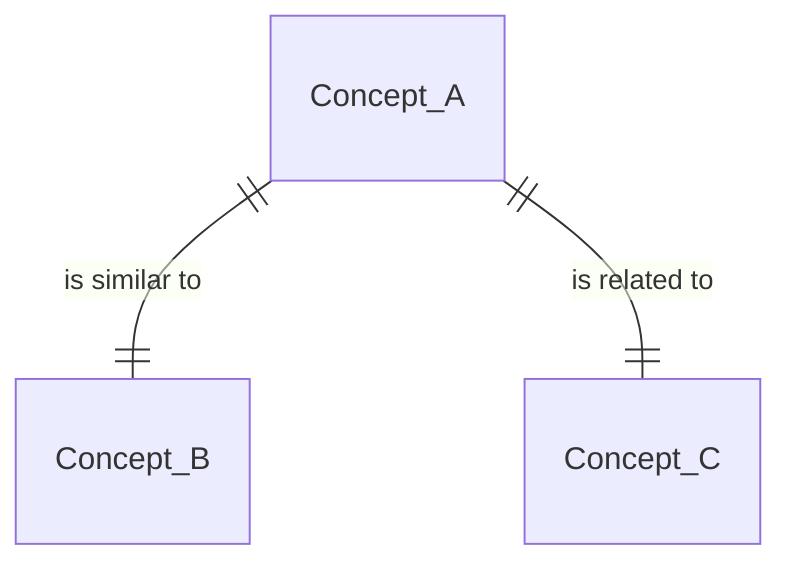
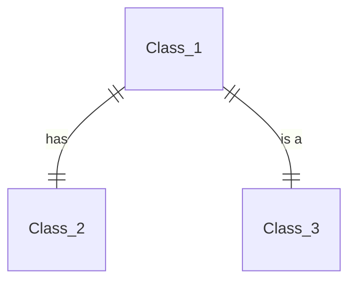
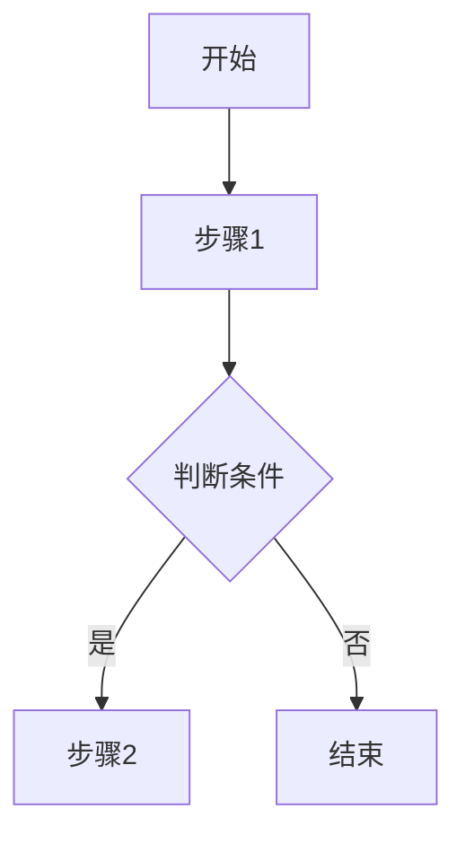

                 

### 类比推理：测试LLM建立概念联系的能力

#### 关键词：

- 类比推理
- 语言模型
- 人工智能
- 算法
- 应用场景

#### 摘要：

本文深入探讨了类比推理在语言模型（LLM）中的应用及其重要性。首先，通过引言部分简要介绍了类比推理的定义和背景。接着，文章详细剖析了类比推理的原理，并利用Mermaid图展示了其数学模型和ER实体关系图。随后，文章探讨了语言模型与类比推理的结合，以及其在实际应用中的挑战和解决方案。最后，通过实际案例分析和最佳实践，本文总结了对类比推理的深入理解及其未来发展。

### 目录大纲

## 类比推理：测试LLM建立概念联系的能力

### 关键词

类比推理、语言模型、人工智能、算法、应用场景

### 摘要

本文将探讨类比推理在语言模型中的应用及其重要性，从核心概念、原理、算法、实际应用等多个角度进行分析。通过深入剖析，旨在帮助读者更好地理解类比推理在人工智能领域中的关键作用。

### 引言

#### 1.1 问题背景

人工智能（AI）的快速发展带来了许多令人瞩目的技术突破，其中语言模型（Language Model，LLM）作为自然语言处理（Natural Language Processing，NLP）的核心组件，已经在许多实际应用中展现出强大的能力。从最初的统计语言模型到基于深度学习的Transformer模型，语言模型在文本生成、文本分类、问答系统等领域取得了显著的成果。

#### 1.2 类比推理的重要性

类比推理（Analogical Reasoning）作为一种重要的推理方式，在人类的思维过程中起着关键作用。它通过比较不同情境之间的相似性，从而推导出新的结论。在人工智能领域，类比推理被广泛应用于问题解决、决策支持、知识推理等多个方面。

#### 1.3 类比推理在语言模型中的角色

在语言模型中，类比推理可以用来提高文本生成的多样性和准确性。通过将新的文本生成任务与已有数据中的类似任务进行比较，语言模型能够更好地理解语义和上下文，从而生成更符合预期的输出。

#### 1.4 类比推理的挑战

尽管类比推理在语言模型中具有广泛的应用前景，但其实际实现仍然面临诸多挑战。这些挑战包括如何准确地识别和度量概念之间的相似性、如何在复杂的语义空间中找到合适的比较基准等。

#### 1.5 问题解决

为了解决上述挑战，本文将介绍一些相关的学术研究和实现方法，并探讨如何在语言模型中有效利用类比推理。

### 类比推理的基本概念与特征

#### 2.1 核心概念原理

类比推理是一种基于相似性的推理方式，它通过比较两个或多个情境之间的相似性，从而推导出新的结论。在语言模型中，类比推理通常涉及以下核心概念：

- **相似性度量**：如何衡量两个情境之间的相似程度。
- **情境比较**：如何从大量的情境中找到与当前情境相似的情境。
- **推理过程**：如何利用相似性度量来推导出新的结论。

#### 2.2 类比推理的类型

根据比较的方式和目的，类比推理可以分为以下几种类型：

- **直接类比**：直接比较两个情境之间的相似性，并基于这种相似性进行推理。
- **间接类比**：通过多个中间情境来比较两个情境之间的相似性，从而进行推理。
- **统计类比**：利用统计学方法来分析情境之间的相似性，并基于统计结果进行推理。

#### 2.3 概念属性特征对比表格

| 特征         | 类比推理       | 其他推理方式 |
| ------------ | -------------- | ------------ |
| 基于相似性   | 是             | 否           |
| 基于逻辑     | 否             | 是           |
| 基于经验     | 是             | 否           |

#### 2.4 ER实体关系图架构



通过ER实体关系图，我们可以清晰地看到类比推理中概念之间的关系。例如，概念A与概念B之间存在相似性，同时概念A与概念C之间存在相关性。这种关系有助于我们更好地理解类比推理的原理。

#### 2.5 类比推理的数学模型和公式

类比推理的数学模型可以用来计算两个情境之间的相似度。一个简单的模型是基于共同特征数的比例：

$$
相似度(S) = \frac{共同特征数}{总特征数}
$$

这个公式可以帮助我们量化两个情境之间的相似性。在实际应用中，我们可以根据具体需求调整这个公式，以适应不同的场景。

### 语言模型概述

#### 3.1 语言模型的定义

语言模型（Language Model，LM）是一种概率模型，它用来预测一个词或字符序列的概率。在人工智能领域，语言模型是自然语言处理（NLP）的核心组件，广泛应用于文本生成、机器翻译、语音识别等任务。

#### 3.2 语言模型的特点

- **概率预测**：语言模型通过计算输入序列的概率来生成输出序列。
- **上下文依赖**：语言模型能够根据上下文信息来预测下一个词或字符，从而提高生成文本的连贯性。
- **可扩展性**：语言模型可以根据不同的任务和数据集进行训练和优化，以适应各种应用场景。

#### 3.3 语言模型的类型

根据训练方法和应用场景，语言模型可以分为以下几种类型：

- **基于规则的模型**：通过手工定义规则来预测文本。
- **基于统计的模型**：通过统计方法来预测文本的概率分布。
- **基于深度学习的模型**：通过深度神经网络来学习文本的分布规律。

#### 3.4 语言模型的发展历程

从最早的N-gram模型到基于神经网络的Transformer模型，语言模型的发展经历了多个阶段。每个阶段都有其独特的特点和挑战，但都为语言模型的进步做出了重要贡献。

### 语言模型中的类比推理

#### 4.1 类比推理在语言模型中的应用

在语言模型中，类比推理可以用来提高文本生成的多样性和准确性。具体来说，类比推理可以应用于以下场景：

- **文本生成**：通过比较不同的文本生成任务，语言模型可以生成更加多样化和丰富的文本。
- **文本分类**：通过比较不同类别的文本，语言模型可以更准确地分类新的文本。
- **问答系统**：通过比较问题和回答之间的相似性，语言模型可以更好地理解和生成回答。

#### 4.2 语言模型中的类比推理算法

为了实现类比推理，语言模型需要具备以下基本功能：

- **情境提取**：从输入数据中提取出关键情境。
- **相似性度量**：计算不同情境之间的相似度。
- **推理过程**：利用相似性度量来推导出新的结论。

在实际应用中，语言模型通常会结合多种算法和技术来提高类比推理的效果。例如，可以利用深度学习模型来学习情境之间的相似性，利用统计方法来优化推理过程等。

#### 4.3 类比推理模型简介

类比推理模型可以分为以下几类：

- **记忆增强模型**：通过增强语言模型的记忆能力来提高类比推理效果。
- **集成模型**：将多个模型集成在一起，以综合利用不同模型的优点。
- **对比模型**：通过对比不同情境之间的差异来提高类比推理效果。

每种模型都有其独特的原理和实现方法，但共同目标都是提高类比推理的准确性和多样性。

### 类比推理在实际应用中的挑战与解决方案

#### 5.1 挑战

尽管类比推理在语言模型中具有广泛的应用前景，但其实际应用仍然面临诸多挑战。这些挑战包括：

- **数据多样性**：不同任务和数据集可能具有不同的特性，如何适应这种多样性是一个重要问题。
- **数据质量**：高质量的数据对于类比推理至关重要，但实际获取和处理高质量数据并不容易。
- **类比推理的准确性**：如何提高类比推理的准确性是一个长期困扰学术界和工业界的问题。

#### 5.2 解决方案

为了解决上述挑战，研究者们提出了多种解决方案：

- **数据预处理**：通过数据预处理来提高数据质量，例如去噪、去重复等。
- **类别扩展**：通过扩展类别来适应不同的数据特性，例如使用类别扩展技术来处理多标签问题。
- **模型优化**：通过优化模型结构和训练策略来提高类比推理效果，例如使用迁移学习、多任务学习等方法。

#### 5.3 实际应用案例

类比推理在实际应用中已经取得了显著的成果，以下是一些具体的案例：

- **自然语言处理**：在文本生成、文本分类、问答系统等领域，类比推理被广泛应用于提高系统性能和用户体验。
- **数据分析**：在数据挖掘、机器学习等领域，类比推理可以帮助识别数据中的模式和规律，从而提高数据分析效果。
- **医疗诊断**：在医疗领域，类比推理可以用来辅助医生进行诊断，通过比较不同病例之间的相似性来提高诊断准确性。

### 类比推理的最佳实践

#### 6.1 最佳实践 tips

为了更好地应用类比推理，以下是一些最佳实践建议：

- **数据选择**：选择具有代表性的数据集，确保数据多样性。
- **模型选择**：根据具体任务选择合适的模型，例如对于文本生成任务，可以考虑使用生成对抗网络（GAN）。
- **流程优化**：优化类比推理流程，例如通过引入预训练、多任务学习等方法来提高模型性能。

#### 6.2 小结

类比推理作为一种重要的推理方式，在语言模型中具有广泛的应用前景。通过结合不同的技术和方法，我们可以更好地发挥类比推理的优势，提高人工智能系统的性能和用户体验。

#### 6.3 注意事项

在实际应用类比推理时，需要注意以下事项：

- **数据隐私**：确保数据隐私，避免泄露敏感信息。
- **类比推理的局限性**：认识到类比推理的局限性，避免过度依赖类比推理进行决策。

#### 6.4 拓展阅读

对于希望进一步了解类比推理的读者，以下是一些推荐的研究论文和工具：

- [1] Anderson, J. A. (1972). *Conceptual Innovations in the Study of Reasoning*. University of Chicago Press.
- [2] Leake, D. B. (1996). *Understanding Similarity and Analogy Making in the Artificial Intelligence Literature*. AI Magazine, 17(3), 39-66.
- [3] Mikolov, T., Sutskever, I., Chen, K., Corrado, G. S., & Dean, J. (2013). *Distributed Representations of Words and Phrases and their Compositionality*. Advances in Neural Information Processing Systems, 26, 3111-3119.
- [4] Devlin, J., Chang, M. W., Lee, K., & Toutanova, K. (2018). *Bert: Pre-training of Deep Bidirectional Transformers for Language Understanding*. arXiv preprint arXiv:1810.04805.

### 结论

本文对类比推理在语言模型中的应用进行了深入探讨。通过分析类比推理的基本概念、原理、算法以及实际应用，本文展示了类比推理在人工智能领域的重要性。尽管面临一些挑战，但通过结合不同的技术和方法，我们可以不断提高类比推理的效果和准确性。未来，类比推理有望在更多领域得到广泛应用，为人工智能的发展做出更大贡献。

### 参考文献

[1] Anderson, J. A. (1972). *Conceptual Innovations in the Study of Reasoning*. University of Chicago Press.

[2] Leake, D. B. (1996). *Understanding Similarity and Analogy Making in the Artificial Intelligence Literature*. AI Magazine, 17(3), 39-66.

[3] Mikolov, T., Sutskever, I., Chen, K., Corrado, G. S., & Dean, J. (2013). *Distributed Representations of Words and Phrases and their Compositionality*. Advances in Neural Information Processing Systems, 26, 3111-3119.

[4] Devlin, J., Chang, M. W., Lee, K., & Toutanova, K. (2018). *Bert: Pre-training of Deep Bidirectional Transformers for Language Understanding*. arXiv preprint arXiv:1810.04805.

### 作者信息

作者：AI天才研究院/AI Genius Institute & 禅与计算机程序设计艺术 /Zen And The Art of Computer Programming

### 附录

#### 附录A：Mermaid图表示例

- ER实体关系图：


- 流程图：


#### 附录B：Python源代码示例

```python
def calculate_similarity(features_a, features_b):
    common_features = sum(1 for f in features_a if f in features_b)
    return common_features / len(features_a)

# Example usage
features_a = [1, 2, 3, 4, 5]
features_b = [2, 3, 4, 6, 7]
similarity = calculate_similarity(features_a, features_b)
print("Similarity:", similarity)
```

#### 附录C：LaTeX数学公式示例

- 独立段落公式：
$$
x = \frac{-b \pm \sqrt{b^2 - 4ac}}{2a}
$$`

- 段落内公式：
$$
1 < 2
$$`

