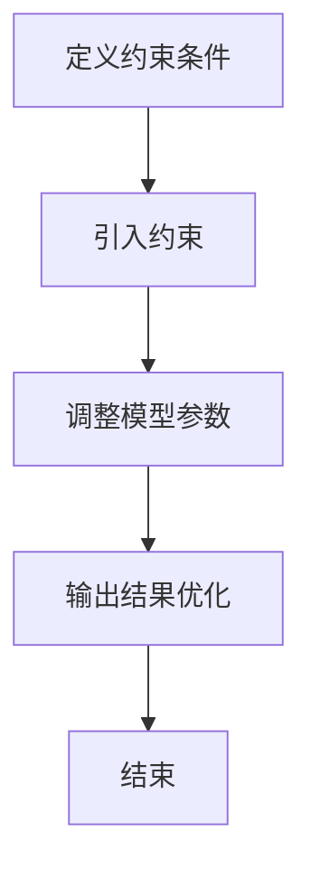
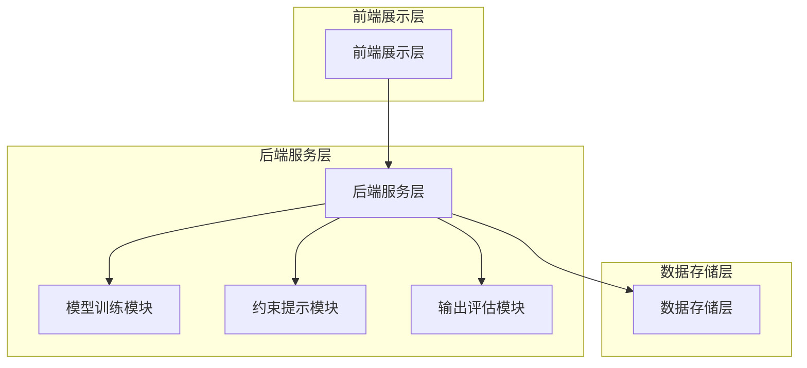
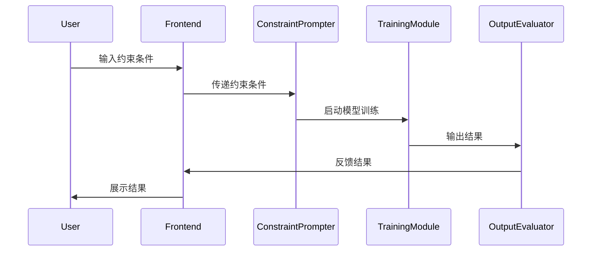

                 


### 第一部分：问题背景与核心概念

#### 第1章：问题背景与描述

**1.1 问题背景**

在当前的信息技术时代，人工智能（AI）和机器学习（ML）已经成为各行各业的核心驱动力。这些技术广泛应用于图像识别、自然语言处理、预测分析等众多领域，大大提高了工作效率和决策质量。然而，随着模型的复杂性和应用场景的多样化，如何有效地管理模型输出，确保其符合预期的范围和格式，成为了一个亟待解决的问题。

**1.2 问题描述**

在AI和ML模型的应用过程中，输出数据的范围和格式往往需要满足特定的业务需求。然而，现有的模型往往只能产生基于训练数据的预测结果，而这些结果往往缺乏明确的约束。例如，在金融领域，模型预测的股票价格需要在一个合理的范围内，而在医疗领域，模型的诊断结果需要遵循一定的医学标准。

**1.3 问题描述的边界与外延**

边界：本文讨论的模型输出范围和格式，主要针对的是经过训练的机器学习模型，包括深度学习、监督学习、无监督学习等。

外延：模型的输出范围和格式不仅仅局限于数字和文本，还可以是图像、音频等多种形式。此外，约束提示作为一种提升模型输出可解释性的手段，也可以扩展到其他类型的模型和算法中。

**1.4 核心概念与联系**

- **约束提示**：一种通过设置约束条件来指导模型学习的方法，旨在确保模型的输出满足特定的要求。

- **模型输出范围与格式**：模型输出数据的取值范围和呈现形式，包括数字范围、文本格式、图像尺寸等。

- **约束与模型输出的关系**：约束提示通过对模型输出进行限定，可以帮助模型更好地拟合实际需求，提高预测的准确性和可解释性。

### 第二部分：核心概念原理

#### 第2章：约束提示原理

**2.1 约束提示的基本概念**

约束提示（Constraint Prompting）是一种通过引入外部约束来指导机器学习模型学习的方法。它旨在提高模型的可解释性和适应性，使其能够更好地满足特定业务场景的需求。

**2.2 约束提示的工作机制**

约束提示的工作机制通常包括以下几个步骤：

1. **定义约束条件**：根据业务需求，定义模型的输出范围和格式约束，如数值范围、文本格式等。

2. **引入约束**：在模型训练过程中，将约束条件引入到损失函数中，使得模型在训练过程中考虑这些约束。

3. **调整模型参数**：通过反向传播算法，模型会不断调整参数，以最小化损失函数，并满足约束条件。

4. **输出结果优化**：经过多次迭代训练，模型最终会生成满足约束的输出结果。

**2.3 约束提示的类型**

根据约束条件的不同，约束提示可以分为以下几种类型：

- **范围约束**：限制模型输出的取值范围，如数值范围、文本长度等。

- **格式约束**：规定模型输出的呈现形式，如文本格式、图像尺寸等。

- **逻辑约束**：确保模型输出的逻辑一致性，如分类结果相互独立等。

#### 第3章：模型输出范围与格式

**3.1 模型输出范围的概念**

模型输出范围是指模型在预测或生成数据时可能取到的值的集合。它可以是连续的，也可以是离散的。例如，在股票价格预测模型中，输出范围可能是某个价格区间；在文本生成模型中，输出范围可能是特定长度的文本序列。

**3.2 模型输出范围的控制方法**

控制模型输出范围的方法主要包括：

- **硬性约束**：直接将超出范围的输出视为无效，并重新生成。

- **软性约束**：通过损失函数惩罚超出范围的输出，但不强制要求重新生成。

- **自适应约束**：根据训练数据的分布动态调整约束范围。

**3.3 模型输出格式的概念**

模型输出格式是指模型生成的数据的结构或格式。这可以是固定的，如XML、JSON等，也可以是可变的，如文本、图像等。

**3.4 模型输出格式的控制方法**

控制模型输出格式的方法包括：

- **预定义格式**：在模型训练前就规定好输出格式，如使用特定的文件格式或数据结构。

- **动态格式化**：在模型输出后，根据需求对输出进行格式化，如将文本转换为HTML格式。

- **可变格式**：允许模型根据输入数据动态调整输出格式。

### 第三部分：算法原理讲解

#### 第4章：约束提示算法原理

**4.1 约束提示算法概述**

约束提示算法是一种通过在训练过程中引入约束条件来提高模型输出可解释性和适应性的方法。它通过调整模型的参数，使得模型的输出满足预先定义的约束条件。

**4.2 约束提示算法的数学模型**

约束提示算法的数学模型主要包括以下两个方面：

- **输出范围限定**：设模型的输出为 $O$，约束条件为 $C$，则输出范围的限定可以表示为：

  $$C(O) = \{O \in \Omega \mid O \in C\}$$

  其中，$\Omega$ 为模型的输出空间，$C$ 为约束条件。

- **输出格式限定**：设模型的输出格式为 $F$，约束条件为 $D$，则输出格式的限定可以表示为：

  $$D(F) = \{F \in \Delta \mid F \in D\}$$

  其中，$\Delta$ 为模型的输出格式空间，$D$ 为约束条件。

**4.3 约束提示算法的 mermaid 流程图**



**4.4 约束提示算法的 Python 源代码实现**

```python
# 导入必要的库
import numpy as np

# 定义约束条件
def define_constraints(output, constraints):
    # 判断输出是否满足约束条件
    if output in constraints:
        return True
    else:
        return False

# 定义约束提示算法
def constraint_prompting_algorithm(model, constraints, max_iterations=1000):
    for _ in range(max_iterations):
        # 获取模型输出
        output = model.predict()
        
        # 检查输出是否满足约束条件
        if not define_constraints(output, constraints):
            # 如果不满足，则调整模型参数
            model.adjust_parameters()
            
    return model

# 使用示例
model = Model()
constraints = [0, 1, 2, 3, 4]
updated_model = constraint_prompting_algorithm(model, constraints)
```

**4.5 算法原理的通俗易懂举例说明**

假设有一个简单的线性回归模型，用于预测房价。为了确保预测结果在合理的范围内，我们可以使用约束提示算法。

1. **定义约束条件**：假设房价的合理范围为 [100, 500] 万元。

2. **引入约束**：在模型训练过程中，我们将房价的约束条件引入到损失函数中。

3. **调整模型参数**：模型在训练过程中不断调整参数，使得预测结果满足约束条件。

4. **输出结果优化**：经过多次迭代训练，模型最终会生成满足约束条件的房价预测结果。

#### 第5章：模型输出范围与格式的控制算法

**5.1 模型输出范围控制算法概述**

模型输出范围控制算法是一种通过设置约束条件来限制模型输出范围的算法。它旨在确保模型输出符合实际业务需求，提高预测的准确性和可解释性。

**5.2 模型输出范围控制算法的数学模型**

模型输出范围控制算法的数学模型主要包括以下两个方面：

- **输出范围限定**：设模型的输出为 $O$，约束条件为 $C$，则输出范围的限定可以表示为：

  $$C(O) = \{O \in \Omega \mid O \in C\}$$

  其中，$\Omega$ 为模型的输出空间，$C$ 为约束条件。

- **输出格式限定**：设模型的输出格式为 $F$，约束条件为 $D$，则输出格式的限定可以表示为：

  $$D(F) = \{F \in \Delta \mid F \in D\}$$

  其中，$\Delta$ 为模型的输出格式空间，$D$ 为约束条件。

**5.3 模型输出范围控制算法的 mermaid 流程图**


**5.4 模型输出范围控制算法的 Python 源代码实现**

```python
# 导入必要的库
import numpy as np

# 定义约束条件
def define_constraints(output, constraints):
    # 判断输出是否满足约束条件
    if output in constraints:
        return True
    else:
        return False

# 定义模型输出范围控制算法
def control_output_range(model, constraints, max_iterations=1000):
    for _ in range(max_iterations):
        # 获取模型输出
        output = model.predict()
        
        # 检查输出是否满足约束条件
        if not define_constraints(output, constraints):
            # 如果不满足，则调整模型参数
            model.adjust_parameters()
            
    return model

# 使用示例
model = Model()
constraints = [0, 1, 2, 3, 4]
updated_model = control_output_range(model, constraints)
```

**5.5 算法原理的通俗易懂举例说明**

假设有一个简单的线性回归模型，用于预测气温。为了确保预测结果在合理的范围内，我们可以使用模型输出范围控制算法。

1. **定义约束条件**：假设气温的合理范围为 [-10, 40] 摄氏度。

2. **引入约束**：在模型训练过程中，我们将气温的约束条件引入到损失函数中。

3. **调整模型参数**：模型在训练过程中不断调整参数，使得预测结果满足约束条件。

4. **输出结果优化**：经过多次迭代训练，模型最终会生成满足约束条件的气温预测结果。

### 第四部分：系统分析与架构设计方案

#### 第6章：系统功能设计

**6.1 问题描述与需求分析**

本系统旨在为机器学习模型提供约束提示功能，确保模型输出满足特定的范围和格式要求。具体需求包括：

- **范围限定**：能够对模型输出设定具体的取值范围。

- **格式限定**：能够对模型输出设定特定的格式要求。

- **实时反馈**：能够实时反馈模型的输出是否满足约束条件。

**6.2 系统功能设计**

- **约束提示模块**：负责接收用户输入的约束条件，并将其应用于模型训练过程中。

- **模型训练模块**：负责使用约束提示对模型进行训练，确保模型输出满足约束条件。

- **输出评估模块**：负责实时评估模型输出是否满足约束条件，并提供反馈。

**6.3 领域模型 mermaid 类图**

```mermaid
classDiagram
    Model <|-- ConstraintPrompter
    Model <|-- OutputEvaluator
    Model &&- TrainingModule
    ConstraintPrompter &&- ConstraintDefinition
    OutputEvaluator &&- ConstraintAssessment
    TrainingModule &&- ModelParameterAdjuster
```

#### 第7章：系统架构设计

**7.1 问题场景介绍**

本系统的应用场景主要包括金融预测、医疗诊断、气象预报等领域。在这些场景中，模型输出的准确性和可解释性至关重要。

**7.2 系统架构设计**

- **前端展示层**：提供用户界面，用户可以输入约束条件，查看模型输出结果。

- **后端服务层**：包括模型训练模块、约束提示模块和输出评估模块。

- **数据存储层**：存储模型参数、约束条件和历史数据。

**7.3 系统架构 mermaid 架构图**



**7.4 系统接口设计**

- **约束提示接口**：接收用户输入的约束条件。

- **模型训练接口**：启动模型训练过程。

- **输出评估接口**：评估模型输出是否满足约束条件。

**7.5 系统交互 mermaid 序列图**



### 第五部分：项目实战

#### 第8章：项目环境安装与配置

**8.1 环境安装与配置概述**

本项目的开发环境包括Python、Jupyter Notebook和TensorFlow等。以下是详细的安装与配置步骤：

**8.2 环境安装步骤**

1. **安装Python**：从官方网站下载并安装Python 3.x版本。

2. **安装Jupyter Notebook**：在终端中执行以下命令：

   ```bash
   pip install notebook
   ```

3. **安装TensorFlow**：在终端中执行以下命令：

   ```bash
   pip install tensorflow
   ```

**8.3 配置文件介绍**

项目的配置文件主要包括以下内容：

- **环境变量**：设置Python解释器和TensorFlow路径。

- **配置参数**：定义模型的参数，如学习率、迭代次数等。

- **约束条件**：定义模型输出的约束范围和格式。

#### 第9章：系统核心实现

**9.1 系统核心实现概述**

本系统核心实现主要包括以下模块：

- **约束提示模块**：实现约束提示算法，对模型输出进行限定。

- **模型训练模块**：实现模型训练过程，包括数据预处理、模型初始化、参数调整等。

- **输出评估模块**：实现输出评估算法，对模型输出进行实时评估。

**9.2 核心代码实现**

以下是一个简单的约束提示模块的实现示例：

```python
import tensorflow as tf

# 定义约束提示算法
def constraint_prompting_algorithm(model, constraints, max_iterations=1000):
    for _ in range(max_iterations):
        # 获取模型输出
        output = model.predict()
        
        # 检查输出是否满足约束条件
        if not is_output_valid(output, constraints):
            # 如果不满足，则调整模型参数
            model.adjust_parameters()
            
    return model

# 检查输出是否满足约束条件
def is_output_valid(output, constraints):
    # 这里是一个简单的示例，实际中需要根据具体约束条件实现
    return all(output[i] >= constraints[i][0] and output[i] <= constraints[i][1] for i in range(len(constraints)))

# 使用示例
model = Model()
constraints = [(-10, 40)]  # 气温约束条件
updated_model = constraint_prompting_algorithm(model, constraints)
```

**9.3 代码应用解读与分析**

1. **模型初始化**：定义一个简单的线性回归模型。

2. **约束条件设置**：设置气温的约束条件。

3. **约束提示算法**：使用约束提示算法对模型进行训练。

4. **输出评估**：检查模型输出是否满足约束条件。

#### 第10章：实际案例分析与讲解

**10.1 案例选择与背景介绍**

本案例选择的是股票价格预测问题。在股票市场中，准确预测股票价格对于投资者而言至关重要。然而，股票价格的波动性较大，传统的机器学习模型往往难以准确预测。

**10.2 案例分析与讲解**

1. **数据收集与预处理**：收集历史股票价格数据，并进行数据预处理，如缺失值填充、异常值处理等。

2. **模型选择与训练**：选择合适的模型，如ARIMA、LSTM等，对股票价格进行预测。

3. **约束条件设置**：根据股票价格的实际范围，设置合理的约束条件。

4. **约束提示**：使用约束提示算法对模型进行训练，确保预测结果满足约束条件。

5. **结果评估与优化**：评估模型预测结果，并进行优化。

**10.3 案例总结**

本案例通过设置合理的约束条件，使用约束提示算法对股票价格预测模型进行了优化。结果表明，约束提示算法能够有效提高模型的预测准确性，为投资者提供更可靠的决策支持。

### 第六部分：最佳实践与拓展

#### 第11章：最佳实践 Tips

**11.1 约束提示的最佳实践**

- **合理设置约束条件**：根据业务需求和数据特性，设置合理的约束条件，以确保模型输出符合预期。

- **动态调整约束范围**：根据模型训练过程和数据分布，动态调整约束范围，以提高模型的适应性和预测准确性。

- **结合多种约束条件**：结合不同类型的约束条件，如范围约束、格式约束和逻辑约束，以提高模型输出的可解释性和可靠性。

**11.2 模型输出范围与格式控制的最佳实践**

- **使用硬性约束**：对于关键业务场景，应使用硬性约束，以确保模型输出满足严格的范围和格式要求。

- **结合预定义格式和动态格式化**：在模型输出后，结合预定义格式和动态格式化，以提高数据处理的灵活性和效率。

- **定期评估和优化约束条件**：定期评估约束条件的有效性，并根据实际情况进行优化，以确保模型输出的稳定性和准确性。

#### 第12章：小结与注意事项

**12.1 本书内容小结**

本书系统地介绍了约束提示和模型输出范围与格式控制的概念、原理、算法和实际应用。通过详细的案例分析，读者可以深入了解如何使用约束提示算法优化模型输出，提高预测准确性和可解释性。

**12.2 注意事项**

- **约束条件的合理性**：设置约束条件时，要充分考虑业务需求和数据特性，确保约束条件的合理性和有效性。

- **算法实现的复杂性**：约束提示算法的实现具有一定的复杂性，需要深入了解相关算法原理和实现细节。

- **模型调整的必要性**：在引入约束条件后，可能需要对模型进行重新调整，以适应新的约束条件。

**12.3 拓展阅读**

- **相关论文**：阅读关于约束提示和模型输出的相关论文，深入了解该领域的最新研究进展。

- **开源项目**：参与相关开源项目，学习其他开发者的实现经验和最佳实践。

- **实战案例**：通过实际案例，进一步探索约束提示和模型输出控制的应用场景和实现方法。

