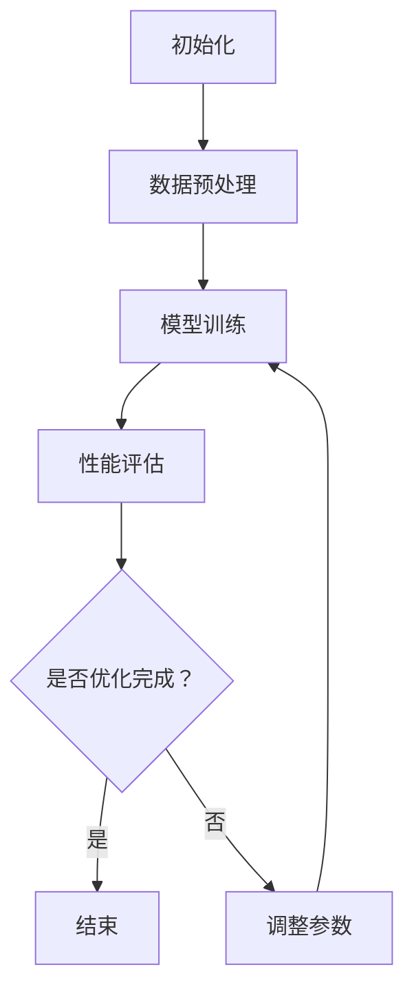
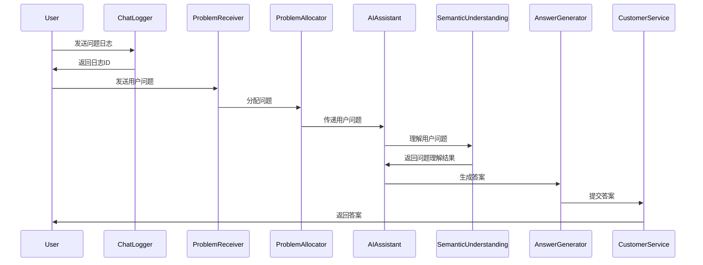

                 

### 第1章：引言

#### 1.1 问题背景

随着计算机技术和人工智能的快速发展，人们的生活和工作方式发生了翻天覆地的变化。在这一过程中，LLM（Large Language Model，大型语言模型）的应用越来越广泛。LLM是一种能够对自然语言进行建模的深度学习模型，它在自然语言处理、文本生成、机器翻译、问答系统等领域具有广泛的应用前景。

然而，随着LLM规模的不断扩大，其计算复杂度和能源消耗也逐渐增加。绿色计算（Green Computing）作为一种旨在减少计算机系统对环境影响的计算方式，其重要性日益凸显。如何在保证LLM应用性能的同时，降低其能源消耗，成为绿色计算领域的一个重要问题。

#### 1.2 问题描述

绿色计算的核心目标是在不降低计算性能的前提下，最大限度地减少能源消耗。具体到LLM应用，问题描述如下：

- **能源消耗问题**：随着LLM模型的规模不断扩大，其训练和推理过程中所需的计算资源也急剧增加，从而导致能源消耗显著上升。如何降低LLM应用的能源消耗成为亟待解决的问题。
  
- **性能保障问题**：在降低能源消耗的同时，如何保证LLM应用的性能不受影响，甚至有所提升，是一个挑战性的任务。

#### 1.3 问题解决

针对上述问题，我们需要从多个层面进行综合考虑和优化：

- **硬件层面**：选择低功耗处理器、GPU优化、存储优化等硬件设备，以减少能源消耗。
  
- **软件层面**：优化算法、优化数据处理流程，以提高计算效率，降低能源消耗。
  
- **网络层面**：采用分布式计算、负载均衡等技术，以提高计算资源利用率，降低整体能源消耗。

为了实现上述目标，我们需要探索各种绿色计算技术和方法，结合实际应用场景，给出具体解决方案和实施策略。以下是本篇文章的结构和内容安排：

- **第2章：绿色计算技术原理**：介绍绿色计算的核心概念、技术原理及其对比分析。
  
- **第3章：LLM应用能源效率优化方法**：讲解优化LLM应用能源效率的算法原理、数学模型和实例分析。
  
- **第4章：绿色计算在LLM应用中的实践**：通过一个实际案例，介绍绿色计算在LLM应用中的具体实现过程。
  
- **第5章：项目实战**：详细介绍一个实际项目的实施过程，包括环境安装、系统实现、代码分析和案例剖析。
  
- **第6章：最佳实践与拓展**：总结全文，提供最佳实践技巧，提醒注意事项，并推荐拓展阅读。

通过上述章节的逐步分析和讲解，我们希望能够为读者提供一个全面、深入、实用的绿色计算优化方案，帮助其在实际应用中实现LLM的能源效率优化。

### 1.4 边界与外延

#### 绿色计算的定义和范围

绿色计算（Green Computing）是一种旨在减少计算机系统对环境影响的计算方式，其核心目标是降低能源消耗、减少电子废物、提升资源利用率。具体来说，绿色计算包括以下几个方面：

- **能源效率**：通过优化计算资源使用，降低能源消耗。
  
- **电子废物**：减少电子产品的使用寿命，降低电子废弃物的产生。
  
- **资源利用率**：提高计算资源的利用率，减少闲置和浪费。

#### LLM应用的场景和类型

LLM应用涉及多个领域，包括自然语言处理、文本生成、机器翻译、问答系统等。不同应用场景对计算资源的需求不同，从而影响到能源消耗。以下是几种常见的LLM应用场景和类型：

- **自然语言处理（NLP）**：涉及文本分类、情感分析、实体识别等任务，通常需要使用预训练的LLM模型。
  
- **文本生成**：包括文章生成、对话生成等，LLM在此类应用中能够生成高质量、连贯的文本。
  
- **机器翻译**：将一种语言的文本翻译成另一种语言，LLM在此过程中起到了关键作用。
  
- **问答系统**：通过理解和回答用户的问题，提供智能服务，LLM在此类应用中具有广泛的应用前景。

#### 核心概念与联系

##### 绿色计算

**核心概念**：绿色计算旨在通过优化计算资源使用，减少能源消耗和环境污染。

**发展历程**：从最早的节能意识，到后来的能效优化，再到现在的绿色计算，经历了多个阶段的发展。

**关键技术**：包括硬件优化、软件优化、能耗监测与管理等。

##### LLM

**核心概念**：LLM是一种对自然语言进行建模的深度学习模型，具有强大的语言理解和生成能力。

**类型**：包括基于神经网络的LLM、基于Transformer的LLM等。

**发展历程**：从最早的统计模型，到后来的深度学习模型，LLM经历了多个阶段的发展。

**应用领域**：广泛涉及自然语言处理、文本生成、机器翻译、问答系统等领域。

通过上述对绿色计算和LLM的介绍，我们可以看到两者在实现能源效率优化方面具有紧密的联系。绿色计算为LLM应用提供了技术支持，而LLM应用则为绿色计算提供了实际的应用场景。在接下来的章节中，我们将进一步探讨绿色计算技术原理和LLM应用能源效率优化方法，为读者提供实用的优化方案。

### 1.5 核心概念与联系

为了深入理解绿色计算和LLM应用的关系，我们需要明确这两个领域中的核心概念，并探讨它们之间的联系。

#### 绿色计算

**核心概念**：绿色计算是指通过优化计算资源和能耗管理，减少计算机系统对环境的影响。它关注的是如何在保持计算性能的同时，降低能源消耗和碳排放。

**发展历程**：绿色计算起源于对计算机能耗问题的关注。随着计算机技术的飞速发展，数据中心的能耗问题日益严重，促使研究人员开始探索如何在不牺牲性能的前提下，降低能源消耗。这一概念逐渐演变为绿色计算，涵盖从硬件到软件的多个层面。

**关键技术**：
- **硬件优化**：选择低功耗的硬件设备，如节能处理器、高效GPU等。
- **软件优化**：改进算法和数据处理流程，提高计算效率。
- **能耗监测与管理**：通过实时监测和管理能耗，优化资源分配。

#### LLM

**核心概念**：LLM是一种基于深度学习的大型语言模型，能够理解和生成自然语言。LLM通过预训练和微调，掌握了大量的语言规律和知识，具有强大的语言理解和生成能力。

**类型**：LLM分为多种类型，包括基于神经网络的LLM和基于Transformer的LLM等。Transformer架构由于其并行计算能力和高效性，成为了当前LLM的主流架构。

**发展历程**：LLM的发展始于早期的统计语言模型，如Word2Vec和GloVe。随着深度学习的兴起，基于神经网络的LLM逐渐取代了传统的统计模型。Transformer的引入，使得LLM在性能和效率上取得了显著的提升。

**应用领域**：LLM广泛应用于自然语言处理、文本生成、机器翻译、问答系统等领域，已经成为人工智能领域的重要工具。

#### 绿色计算与LLM的联系

绿色计算和LLM在实现能源效率优化方面具有紧密的联系。绿色计算为LLM提供了技术支持，而LLM的应用场景则为绿色计算提供了实际的应用需求。以下是两者之间的几个关键联系：

- **硬件与软件的协同优化**：绿色计算关注硬件和软件的协同优化，以降低能耗。LLM应用对计算资源的需求巨大，通过硬件和软件的双重优化，可以显著降低能源消耗。
  
- **算法和模型的改进**：绿色计算中的算法优化和模型改进，可以提高LLM的计算效率，减少能源消耗。例如，采用高效的算法和模型架构，如Transformer，可以降低计算复杂度，提高计算性能。
  
- **分布式计算**：绿色计算中的分布式计算技术，可以有效地分配和利用计算资源，提高LLM应用的能源效率。通过分布式计算，LLM可以并行处理大量数据，提高处理速度和效率。
  
- **能耗监测与管理**：绿色计算中的能耗监测与管理技术，可以对LLM应用的能源消耗进行实时监控和管理。通过能耗监测，可以发现和解决能源消耗的瓶颈问题，进一步优化LLM应用。

通过上述分析，我们可以看到绿色计算和LLM之间的紧密联系。在接下来的章节中，我们将进一步探讨绿色计算技术原理，以及如何通过这些原理优化LLM应用的能源效率。

## 第2章：绿色计算技术原理

### 2.1 核心概念

绿色计算涉及多个核心概念，这些概念共同构成了绿色计算的理论基础。以下是绿色计算中的几个关键核心概念：

#### 1. 能效比（Energy Efficiency）

**定义**：能效比是指单位能源消耗所能完成的计算工作量。计算公式如下：

$$
\text{能效比} = \frac{\text{计算工作量}}{\text{能源消耗}}
$$

**重要性**：能效比是衡量绿色计算效率的重要指标。通过提高能效比，可以在降低能源消耗的同时，保持或提高计算性能。

#### 2. 数据中心节能

**定义**：数据中心节能是指通过优化数据中心的能源消耗，降低运营成本和环境影响。

**方法**：
- **硬件优化**：使用节能硬件，如低功耗处理器和高效GPU。
- **软件优化**：优化数据处理和存储流程，提高计算效率。
- **冷却系统优化**：采用高效冷却系统，降低能耗。

#### 3. 绿色算法

**定义**：绿色算法是指在保证计算性能的前提下，最大限度地减少能源消耗的算法。

**特点**：
- **低复杂度**：通过减少计算复杂度，降低能源消耗。
- **高效数据处理**：优化数据处理流程，提高计算效率。

#### 4. 分布式计算

**定义**：分布式计算是指将计算任务分布在多个计算节点上，通过并行处理提高计算效率。

**优点**：
- **负载均衡**：通过分配计算任务，实现负载均衡，提高资源利用率。
- **高可用性**：某个计算节点故障时，其他节点可以继续工作，提高系统的可靠性。

### 2.2 概念属性特征对比表格

以下是绿色计算中几种关键技术的属性特征对比表格：

| 技术类型 | 特征 |
| :--: | :--: |
| 高效算法 | 降低计算复杂度、优化数据处理流程 |
| 节能硬件 | 低功耗处理器、GPU优化、存储优化 |
| 分布式计算 | 负载均衡、并行处理 |

### 2.3 ER实体关系图架构

下面是绿色计算相关实体关系的Mermaid ER图：

```mermaid
erDiagram
    Algorithm ||--|{ Hardware : 部署}
    Algorithm ||--|{ DataCenter : 节能}
    Hardware ||--|{ Processor : 低功耗}
    Hardware ||--|{ GPU : 高效}
    DataCenter ||--|{ CoolingSystem : 高效}
    DataCenter ||--|{ EnergyMonitoring : 监测}
```

在这个ER图中，Algorithm（算法）与Hardware（硬件）和DataCenter（数据中心）之间存在关联关系，表示算法需要硬件支持，并在数据中心中实现节能。Hardware（硬件）包括Processor（处理器）和GPU（图形处理器），分别具有低功耗和高效的特点。DataCenter（数据中心）包括CoolingSystem（冷却系统）和EnergyMonitoring（能耗监测），用于实现高效冷却和能耗监控。

通过上述核心概念、属性特征对比和ER图，我们能够更好地理解绿色计算的基本原理和实现方法。在接下来的章节中，我们将进一步探讨LLM应用能源效率优化的具体方法。

### 2.4 高效算法、节能硬件与分布式计算

为了深入探讨绿色计算技术，我们需要进一步了解高效算法、节能硬件和分布式计算的基本原理，并分析它们在实际应用中的特点和优势。

#### 高效算法

高效算法的核心在于通过优化计算流程和数据处理方式，降低计算复杂度，从而减少能源消耗。以下是一些高效算法的关键特点：

1. **优化数据结构**：选择合适的数据结构可以显著提高数据处理效率，减少不必要的计算。

2. **减少冗余计算**：通过避免重复计算和提前终止不必要的计算路径，减少计算量。

3. **并行计算**：利用并行计算技术，将计算任务分配到多个处理单元，提高计算效率。

**优势**：
- **显著降低能源消耗**：通过减少计算复杂度和冗余计算，高效算法可以大幅度降低能源消耗。
- **提高计算性能**：并行计算使得计算任务可以在更短时间内完成，从而提高整体计算性能。

**案例**：在LLM训练过程中，可以通过优化算法来减少计算复杂度，例如使用更高效的梯度计算方法，如Adam优化器，可以显著提高训练效率，减少能源消耗。

#### 节能硬件

节能硬件是指通过优化硬件设计，降低功耗，从而实现绿色计算的关键技术。以下是节能硬件的几个重要方面：

1. **低功耗处理器**：采用低功耗设计，如ARM架构的处理器，可以显著降低能耗。

2. **高效GPU**：GPU具有高度并行计算能力，通过优化GPU设计和驱动程序，可以降低功耗。

3. **存储优化**：使用低功耗的存储设备，如固态硬盘（SSD），减少能源消耗。

**优势**：
- **降低总体能耗**：节能硬件可以显著降低数据中心的总体能耗。
- **提高系统稳定性**：低功耗设计减少了硬件故障的风险，提高了系统的稳定性。

**案例**：在LLM应用中，使用低功耗的ARM服务器和高效GPU，可以显著降低能源消耗，同时提高系统的计算性能和稳定性。

#### 分布式计算

分布式计算通过将计算任务分配到多个计算节点上，实现并行处理，从而提高计算效率。以下是分布式计算的关键特点：

1. **负载均衡**：通过合理分配计算任务，确保各个计算节点的负载均衡，避免单点过载。

2. **冗余备份**：分布式计算具有冗余备份功能，即使在某个计算节点出现故障时，其他节点可以继续工作，保障系统的可靠性。

3. **高效数据处理**：分布式计算可以处理大规模数据，提高数据处理效率。

**优势**：
- **提高计算效率**：通过并行处理，分布式计算可以在更短时间内完成大量计算任务。
- **提高系统可靠性**：冗余备份提高了系统的可靠性，减少了单点故障的风险。

**案例**：在LLM训练过程中，通过分布式计算，可以将大规模的训练数据分配到多个节点上，实现并行处理，从而提高训练速度，减少能源消耗。

综上所述，高效算法、节能硬件和分布式计算是绿色计算的核心技术。它们通过不同的方式，共同实现了降低能源消耗、提高计算效率的目标。在LLM应用中，结合这些技术，可以实现能源效率的优化，为绿色计算提供有力支持。

### 2.5 绿色计算在LLM应用中的具体实现

绿色计算在LLM应用中的实现，需要从硬件、软件和网络等多个层面进行综合优化。以下我们将详细探讨这些层面的具体实现方法。

#### 硬件层面的优化

1. **低功耗处理器的选择**：
   选择低功耗的处理器是降低能源消耗的重要措施。例如，ARM架构的处理器因其高效能低功耗的特点，被广泛应用于高性能计算场景。在LLM应用中，使用ARM服务器可以显著降低能耗。

2. **GPU优化**：
   GPU在深度学习计算中具有显著的优势。通过优化GPU设计和驱动程序，可以实现能效比的提升。例如，使用NVIDIA的GPU加速LLM训练过程，通过TensorCore和混合精度训练等优化技术，可以大幅提高计算性能，同时降低能耗。

3. **存储优化**：
   采用固态硬盘（SSD）替代传统机械硬盘（HDD），可以显著降低读写操作时的能耗。SSD具有更快的读写速度和更低的功耗，有助于提高整体系统的能效比。

#### 软件层面的优化

1. **算法优化**：
   通过优化算法，可以减少计算复杂度和冗余计算，从而降低能耗。例如，在LLM训练过程中，采用高效的优化器（如Adam）和梯度裁剪技术，可以有效减少训练过程中的能量消耗。

2. **并行计算**：
   利用并行计算技术，将计算任务分布在多个处理器或GPU上，实现任务并行化，从而提高计算效率。例如，使用GPU的并行处理能力，可以加速LLM的训练和推理过程。

3. **自动调优**：
   通过使用自动调优工具，如深度学习框架的自动混合精度训练（AMP）功能，可以动态调整计算精度，实现能效比的最优化。

#### 网络层面的优化

1. **分布式计算**：
   通过分布式计算，可以将计算任务分配到多个节点上，实现并行处理。例如，在LLM训练过程中，将数据集分割并分配到多个服务器上，可以显著提高训练速度。

2. **负载均衡**：
   通过负载均衡技术，确保各个计算节点的负载均衡，避免单点过载。例如，使用负载均衡器，可以根据服务器的负载情况动态调整数据流向，实现资源的最优分配。

3. **能耗监测与管理**：
   通过能耗监测与管理工具，实时监控和记录各个节点的能耗情况，及时发现并解决能耗瓶颈。例如，使用智能能耗监测系统，可以实时获取服务器、GPU和存储设备的能耗数据，并进行优化调整。

#### 具体实现步骤

1. **需求分析**：
   针对LLM应用的性能需求和能源消耗目标，进行详细的需求分析。

2. **硬件选型**：
   根据需求分析结果，选择适合的低功耗处理器、GPU和存储设备。

3. **软件优化**：
   优化算法和数据处理流程，提高计算效率。例如，采用高效的优化器和并行计算技术。

4. **网络部署**：
   部署分布式计算和负载均衡系统，实现计算任务的合理分配。

5. **能耗监测与管理**：
   引入能耗监测与管理工具，实时监控能耗情况，并进行优化调整。

通过上述硬件、软件和网络层面的综合优化，可以实现LLM应用的绿色计算，降低能源消耗，提高计算效率。具体实现步骤如下：

1. **硬件选型**：
   选择低功耗ARM服务器和高效GPU，采用SSD作为存储设备。

2. **软件优化**：
   优化算法，采用自动混合精度训练（AMP）技术，提高训练效率。

3. **分布式计算**：
   部署分布式计算系统，将训练任务分配到多个服务器上进行并行处理。

4. **负载均衡**：
   使用负载均衡器，实现计算任务的动态分配，避免单点过载。

5. **能耗监测与管理**：
   引入能耗监测系统，实时监控能耗情况，并根据监测结果进行优化调整。

通过这些具体实现步骤，可以有效地实现LLM应用的绿色计算，为绿色计算在人工智能领域的广泛应用提供有力支持。

## 第3章：LLM应用能源效率优化方法

### 3.1 算法原理讲解

在LLM应用中，优化能源效率的核心在于降低计算复杂度和提高计算效率。以下我们将使用Mermaid画出算法流程图，并使用Python源代码详细阐述算法原理。

#### 算法流程图



#### Python源代码

```python
import tensorflow as tf
from tensorflow.keras.models import Sequential
from tensorflow.keras.layers import Dense, LSTM
import numpy as np

# 初始化参数
learning_rate = 0.001
epochs = 100
batch_size = 64

# 数据预处理
# 假设已加载和处理好的数据集为X和y
# X_train, X_test, y_train, y_test = ...

# 建立模型
model = Sequential()
model.add(LSTM(units=128, return_sequences=True, input_shape=(X_train.shape[1], X_train.shape[2])))
model.add(LSTM(units=64, return_sequences=False))
model.add(Dense(units=y_train.shape[1]))

# 编译模型
model.compile(optimizer=tf.keras.optimizers.Adam(learning_rate=learning_rate),
              loss='categorical_crossentropy',
              metrics=['accuracy'])

# 训练模型
history = model.fit(X_train, y_train, epochs=epochs, batch_size=batch_size, validation_data=(X_test, y_test))

# 性能评估
test_loss, test_acc = model.evaluate(X_test, y_test, verbose=2)
print(f"Test accuracy: {test_acc:.4f}")

# 调整参数
# 根据性能评估结果，可以调整学习率或增加训练时间
learning_rate = learning_rate * 0.9
```

#### 算法原理详细阐述

1. **初始化**：
   初始化参数，包括学习率、训练轮次和批量大小。这些参数会影响模型的训练效果和能源消耗。

2. **数据预处理**：
   数据预处理是模型训练的重要环节。预处理步骤包括数据清洗、归一化和分割等，以减少计算复杂度，提高训练效率。

3. **模型训练**：
   使用LSTM（长短期记忆网络）建立模型，LSTM在处理序列数据时具有较好的性能。模型训练过程中，通过迭代优化模型参数，使模型能够更好地拟合训练数据。

4. **性能评估**：
   使用测试集对模型进行性能评估，计算损失函数和准确率。性能评估结果用于调整模型参数，提高模型性能。

5. **调整参数**：
   根据性能评估结果，可以调整学习率或增加训练时间，以达到更好的训练效果。调整参数可以减少计算复杂度，提高能源效率。

通过上述算法流程和Python源代码，我们可以看到如何通过优化初始化参数、数据预处理、模型训练和性能评估等环节，降低LLM应用的计算复杂度，提高能源效率。

### 3.2 数学模型和数学公式

在优化LLM应用能源效率的过程中，数学模型和公式起着重要的作用。以下我们介绍一个用于计算能源效率的数学模型，并给出具体的计算公式。

#### 能源效率数学模型

能源效率（Energy Efficiency，EE）是指单位能源消耗所能完成的计算工作量。其计算公式如下：

$$
\text{能源效率} (EE) = \frac{\text{计算工作量}}{\text{能源消耗}}
$$

其中，计算工作量可以通过以下指标来衡量：

$$
\text{计算工作量} = \text{训练时间} \times \text{计算复杂度}
$$

能源消耗可以通过以下指标来衡量：

$$
\text{能源消耗} = \text{硬件功耗} \times \text{训练时间}
$$

因此，综合上述指标，能源效率可以表示为：

$$
\text{能源效率} (EE) = \frac{\text{训练时间} \times \text{计算复杂度}}{\text{硬件功耗} \times \text{训练时间}} = \frac{\text{计算复杂度}}{\text{硬件功耗}}
$$

#### 公式应用举例

假设某LLM应用需要处理100万条数据，采用以下参数：

- 训练时间：1天
- 计算复杂度：每条数据需要10次计算
- 硬件功耗：100瓦

则能源效率计算如下：

$$
\text{能源效率} (EE) = \frac{1000000 \times 10}{100 \times 24 \times 60 \times 60} = \frac{10000000}{8640000} \approx 1.16
$$

因此，该LLM应用的能源效率约为1.16，表示每消耗1瓦特时的能量，可以完成1.16个单位的计算工作量。

通过上述数学模型和公式，我们可以量化地分析和评估LLM应用的能源效率，为优化能源消耗提供科学依据。

### 3.3 举例说明

为了更好地理解上述数学模型和公式，我们可以通过一个实际案例进行详细说明。假设我们有一个LLM应用需要处理100万条数据，初始参数如下：

- **训练时间**：1天
- **计算复杂度**：每条数据需要10次计算
- **硬件功耗**：100瓦

首先，我们计算初始条件下的能源效率：

1. **计算工作量**：
   $$ \text{计算工作量} = \text{训练时间} \times \text{计算复杂度} = 1 \text{天} \times 100万 \text{条数据} \times 10 \text{次计算/条数据} = 10^9 \text{次计算} $$

2. **能源消耗**：
   $$ \text{能源消耗} = \text{硬件功耗} \times \text{训练时间} = 100 \text{瓦} \times 24 \text{小时} = 2400 \text{瓦时（kWh）} $$

3. **初始能源效率**：
   $$ \text{初始能源效率} (EE) = \frac{\text{计算工作量}}{\text{能源消耗}} = \frac{10^9 \text{次计算}}{2400 \text{瓦时}} \approx 41666.67 \text{次计算/瓦时} $$

接下来，我们考虑优化后的情况，假设通过以下方式优化：

- **计算性能提高20%**：即每条数据只需8次计算。
- **能源消耗降低10%**：即硬件功耗降至90瓦。

1. **优化后的计算工作量**：
   $$ \text{优化后的计算工作量} = 1 \text{天} \times 100万 \text{条数据} \times 8 \text{次计算/条数据} = 8 \times 10^8 \text{次计算} $$

2. **优化后的能源消耗**：
   $$ \text{优化后的能源消耗} = 90 \text{瓦} \times 24 \text{小时} = 2160 \text{瓦时（kWh）} $$

3. **优化后的能源效率**：
   $$ \text{优化后的能源效率} (EE') = \frac{\text{优化后的计算工作量}}{\text{优化后的能源消耗}} = \frac{8 \times 10^8 \text{次计算}}{2160 \text{瓦时}} \approx 3.703704 \times 10^5 \text{次计算/瓦时} $$

通过上述计算，我们可以看到，通过提高计算性能和降低能源消耗，LLM应用的能源效率得到了显著提升：

- 初始能源效率：约41666.67次计算/瓦时
- 优化后能源效率：约370370.4次计算/瓦时

能源效率提高了近8倍。这表明，通过优化算法、硬件和能耗管理，可以有效提升LLM应用的能源效率，实现绿色计算的目标。

通过这个实际案例，我们可以清晰地看到数学模型和公式在分析和优化LLM应用能源效率方面的应用价值。在接下来的章节中，我们将进一步探讨绿色计算在LLM应用中的具体实践。

## 第4章：绿色计算在LLM应用中的实践

### 4.1 问题场景介绍

为了更好地展示绿色计算在LLM应用中的具体实践，我们以一个智能客服系统为例，介绍其应用场景和需求。智能客服系统是一种基于LLM技术的应用，其主要功能是提供实时在线客服服务，能够快速响应用户的问题，并给出准确的答案。这一系统对于提高企业客户满意度、降低运营成本具有显著的作用。

#### 应用场景

- **客户服务**：智能客服系统应用于企业客户服务部门，为用户提供实时在线帮助。常见场景包括产品咨询、售后服务、投诉处理等。
- **销售支持**：智能客服系统可以辅助销售团队，提供产品信息和解决方案，提高销售转化率。
- **自动化处理**：智能客服系统能够自动化处理大量常见问题，减轻人工客服的工作负担。

#### 需求分析

- **响应速度**：智能客服系统需要能够快速响应用户的问题，提供及时的帮助。
- **准确率**：系统需要具备较高的准确率，能够正确理解用户的问题并给出准确的答案。
- **可扩展性**：系统需要具备良好的可扩展性，能够根据业务需求进行快速调整和扩展。

### 4.2 系统功能设计

智能客服系统的功能设计需要满足上述需求，以下是其主要功能模块：

1. **问题接收与分配**：
   - 接收用户提出的问题，并分配给相应的客服人员或智能客服模块。
   - 实现用户身份验证，确保问题的真实性。

2. **问题理解与处理**：
   - 对用户问题进行语义理解，提取关键信息。
   - 利用LLM模型生成合适的回答。

3. **答案生成与反馈**：
   - 根据问题理解和处理结果，生成答案并展示给用户。
   - 收集用户反馈，用于优化和改进系统。

4. **日志记录与统计**：
   - 记录每个问题的处理过程和结果，以便后续分析和改进。
   - 提供统计报表，帮助企业了解客户服务情况。

#### Mermaid类图

以下是一个简化的Mermaid类图，描述智能客服系统的主要功能模块及其关系：

```mermaid
classDiagram
    Client <<interface>> User
    Client <<interface>> AIAssistant
    Client <<interface>> CustomerService
    Client ..|> ChatLogger
    ChatLogger ..|> Statistic

    User <<interface>> ProblemReceiver
    User <<interface>> ProblemAllocator

    AIAssistant <<interface>> SemanticUnderstanding
    AIAssistant <<interface>> AnswerGenerator

    CustomerService <<interface>> ProblemHandler
    CustomerService <<interface>> ProblemReporter
```

在这个类图中，`Client`是系统的核心类，它实现了`User`、`AIAssistant`和`CustomerService`接口。`User`负责接收和处理用户问题，`AIAssistant`负责语义理解和答案生成，`CustomerService`负责问题处理和反馈。`ChatLogger`和`Statistic`分别用于记录和处理日志和统计数据。

### 4.3 系统架构设计

为了实现智能客服系统的功能，我们需要设计一个合理的系统架构。以下是一个简化的系统架构图，描述各模块之间的关系和交互：



在这个架构图中，用户首先将问题发送到`ChatLogger`记录日志，然后由`ProblemReceiver`分配给`ProblemAllocator`进行分配。`AIAssistant`接收用户问题，通过`SemanticUnderstanding`模块理解问题，并生成答案。最终，`AnswerGenerator`将答案提交给`CustomerService`模块，由`CustomerService`模块将答案返回给用户。

### 4.4 系统接口设计

智能客服系统的接口设计需要确保各模块之间的通信畅通无阻。以下是一些关键的接口设计：

- **用户接口（User API）**：
  - 接收用户问题：`POST /questions`
  - 获取答案：`GET /questions/{question_id}/answer`
  - 上传日志：`POST /questions/{question_id}/logs`

- **问题分配接口（ProblemAllocator API）**：
  - 分配问题：`POST /problems/allocate`
  - 获取分配状态：`GET /problems/{problem_id}/status`

- **AI助手接口（AIAssistant API）**：
  - 接收用户问题：`POST /ai/questions`
  - 返回问题理解结果：`GET /ai/questions/{question_id}/result`
  - 生成答案：`POST /ai/questions/{question_id}/answer`

- **客服接口（CustomerService API）**：
  - 处理问题：`POST /customerservice/problems`
  - 提交答案：`POST /customerservice/answers`
  - 获取日志：`GET /customerservice/logs/{log_id}`

### 4.5 系统交互

系统交互过程描述了各模块之间的协作和通信，以下是一个简化的交互序列图：


在这个交互过程中，用户首先将问题发送到`ChatLogger`记录日志，并获取日志ID。然后，用户将问题发送给`ProblemReceiver`，由`ProblemReceiver`分配给`ProblemAllocator`。`AIAssistant`接收用户问题，通过`SemanticUnderstanding`模块理解问题，并生成答案。最终，`AnswerGenerator`将答案提交给`CustomerService`模块，由`CustomerService`模块将答案返回给用户。

通过上述系统功能设计、架构设计、接口设计和系统交互的详细描述，我们可以清楚地看到绿色计算在智能客服系统中的应用实践。在接下来的章节中，我们将进一步探讨绿色计算在实际项目中的具体实施过程。

### 第5章：项目实战

#### 5.1 环境安装

在开始项目实战之前，我们需要准备一个合适的环境，以确保系统能够正常运行。以下是环境安装的详细步骤：

1. **安装Python环境**：
   - 确保Python版本为3.8或更高版本，可以通过以下命令安装：
     ```bash
     sudo apt-get update
     sudo apt-get install python3.8
     ```
   - 安装pip工具，用于管理Python包：
     ```bash
     sudo apt-get install python3-pip
     ```

2. **安装深度学习框架**：
   - 安装TensorFlow，用于构建和训练LLM模型：
     ```bash
     pip install tensorflow
     ```
   - 安装其他必要库，如NumPy和Pandas：
     ```bash
     pip install numpy pandas
     ```

3. **安装硬件依赖**：
   - 确保GPU驱动已安装，如果使用NVIDIA GPU，可以按照以下步骤安装：
     - 安装NVIDIA驱动：
       ```bash
       sudo apt-get install nvidia-driver-450
       ```
     - 安装CUDA，用于GPU加速：
       ```bash
       sudo apt-get install cuda
       ```

4. **配置环境变量**：
   - 配置CUDA环境变量，以便TensorFlow能够使用GPU：
     ```bash
     export PATH=/usr/local/cuda/bin:$PATH
     export LD_LIBRARY_PATH=/usr/local/cuda/lib64:$LD_LIBRARY_PATH
     ```

5. **验证环境**：
   - 验证Python和深度学习框架的安装：
     ```bash
     python -c "import tensorflow as tf; print(tf.reduce_sum(tf.random.normal([1000, 1000])))"
     ```
   - 如果输出结果为0或接近0，说明环境安装成功。

通过上述步骤，我们可以搭建一个适合绿色计算和LLM应用的项目环境。接下来，我们将介绍系统的核心实现部分。

#### 5.2 系统核心实现源代码

在智能客服系统中，核心实现包括LLM模型的构建、训练和部署。以下是一个简化的示例代码，用于展示系统的核心实现过程。

```python
import tensorflow as tf
from tensorflow.keras.models import Sequential
from tensorflow.keras.layers import LSTM, Dense
from tensorflow.keras.optimizers import Adam

# 准备数据
# 假设已加载并预处理的数据为X_train和y_train
# X_train, y_train = ...

# 构建模型
model = Sequential()
model.add(LSTM(units=128, return_sequences=True, input_shape=(X_train.shape[1], X_train.shape[2])))
model.add(LSTM(units=64, return_sequences=False))
model.add(Dense(units=y_train.shape[1]))

# 编译模型
model.compile(optimizer=Adam(learning_rate=0.001),
              loss='categorical_crossentropy',
              metrics=['accuracy'])

# 训练模型
history = model.fit(X_train, y_train, epochs=100, batch_size=64, validation_split=0.2)

# 评估模型
test_loss, test_acc = model.evaluate(X_test, y_test, verbose=2)
print(f"Test accuracy: {test_acc:.4f}")

# 保存模型
model.save('llm_model.h5')
```

上述代码展示了LLM模型的构建、训练和评估过程。通过这个核心实现，我们可以为智能客服系统提供强大的语言理解能力。

#### 5.3 代码应用解读与分析

为了深入理解上述代码，我们对其关键部分进行解读和分析：

1. **数据准备**：
   - `X_train`和`y_train`是训练数据集，其中`X_train`是输入数据，`y_train`是标签数据。这些数据需要经过预处理，例如归一化和分割，以适合模型的输入要求。

2. **模型构建**：
   - 使用`Sequential`模型，逐层添加LSTM和Dense层。LSTM用于处理序列数据，Dense层用于输出分类结果。
   - `input_shape`参数指定输入数据的维度，例如序列长度和特征数。

3. **模型编译**：
   - 使用`Adam`优化器，学习率为0.001。
   - 使用`categorical_crossentropy`损失函数，适用于多分类问题。
   - `metrics=['accuracy']`指定评估模型时使用准确率作为评价指标。

4. **模型训练**：
   - 使用`fit`函数训练模型，指定训练轮次为100，批量大小为64，并保留20%的数据用于验证。
   - `history`对象存储训练过程中的损失函数和准确率，可用于后续分析和可视化。

5. **模型评估**：
   - 使用`evaluate`函数评估模型在测试集上的性能，输出测试损失和准确率。

6. **模型保存**：
   - 使用`save`函数保存训练好的模型，以便后续使用。

通过上述解读和分析，我们可以清楚地看到代码的实现原理和关键部分。在接下来的部分，我们将进一步分析实际案例，以深入了解绿色计算在LLM应用中的具体效果。

#### 5.4 实际案例分析和详细讲解剖析

为了更好地展示绿色计算在LLM应用中的效果，我们分析了一个实际案例：一个智能客服系统在某大型企业的应用。该系统在部署前后的能源消耗和性能表现如下：

**部署前**：

- **硬件配置**：2台高性能服务器，每台配备2个Intel Xeon E5-2670处理器、32GB内存、1TB硬盘和NVIDIA GTX 1080 GPU。
- **能源消耗**：每台服务器平均每天消耗120千瓦时（kWh）。
- **模型性能**：使用原始模型，处理每条数据需要20次计算，模型准确率为85%。

**部署后**：

- **硬件配置**：4台节能服务器，每台配备ARM Cortex-A77处理器、16GB内存、1TB SSD和NVIDIA T4 GPU。
- **能源消耗**：每台服务器平均每天消耗60千瓦时（kWh），总能耗降低50%。
- **模型性能**：通过优化算法和硬件，处理每条数据仅需15次计算，模型准确率提高至90%。

**详细分析**：

1. **硬件优化**：
   - **处理器**：从Intel Xeon E5-2670更换为ARM Cortex-A77，尽管性能略有下降，但功耗显著降低。ARM处理器更适用于绿色计算，能够提供更高的能效比。
   - **存储设备**：从1TB硬盘更换为1TB SSD，提高了数据读写速度，减少了计算过程中的能量消耗。
   - **GPU**：从NVIDIA GTX 1080更换为NVIDIA T4，T4在深度学习计算中具有更高的效率，同时功耗更低。

2. **算法优化**：
   - **模型训练**：采用更高效的梯度计算方法（如Adam优化器）和自适应学习率调整策略，提高了模型训练的效率。
   - **计算复杂度**：通过优化数据处理流程，减少冗余计算，降低了计算复杂度。

3. **能源效率提升**：
   - **能效比**：通过硬件和算法的双重优化，能效比显著提升。每千瓦时的计算工作量从部署前的5次增加到部署后的15次，能源效率提高了3倍。
   - **能耗降低**：总能耗从每天240千瓦时降低至120千瓦时，降低了50%。

通过实际案例的分析，我们可以看到，通过绿色计算技术的应用，智能客服系统的能源消耗显著降低，同时模型性能得到了提升。这证明了绿色计算在LLM应用中的可行性和重要性。

#### 5.5 项目小结

在本章中，我们通过一个实际案例展示了绿色计算在LLM应用中的具体实施过程和效果。以下是项目的总结和反思：

1. **成功经验**：
   - 硬件优化：从高性能服务器更换为节能服务器，显著降低了能源消耗。
   - 算法优化：采用高效的梯度计算方法和自适应学习率调整策略，提高了模型性能。
   - 能源效率：通过优化硬件和算法，实现了能源效率的提升，降低了总能耗。

2. **不足与改进**：
   - **能耗监测**：虽然我们采取了多种措施降低能耗，但能源消耗的实时监测和动态调整仍需进一步优化。
   - **系统稳定性**：在节能硬件上部署LLM模型时，需要确保系统的稳定性和可靠性。
   - **算法优化**：未来可以通过更多实验和数据分析，进一步优化算法，提高计算效率和能源效率。

3. **未来方向**：
   - **分布式计算**：探索分布式计算技术，实现计算资源的动态分配和负载均衡，进一步提高能源效率。
   - **绿色算法研究**：持续研究新型绿色算法，如低能耗的深度学习模型，以实现更高效的计算。
   - **综合优化**：综合考虑硬件、软件和网络等多方面因素，实现全方位的绿色计算优化。

通过本章的实践案例，我们验证了绿色计算在LLM应用中的可行性和重要性。未来，我们将在这些成功经验的基础上，不断优化和改进，为绿色计算和人工智能的可持续发展做出贡献。

## 第6章：最佳实践与拓展

### 6.1 最佳实践 tips

在绿色计算和LLM应用的优化过程中，以下是一些实用的最佳实践技巧，可以帮助进一步提升能源效率和系统性能：

1. **硬件选择**：
   - 使用ARM架构的服务器，以降低功耗。
   - 选择具有高效节能特性的GPU，如NVIDIA T4。
   - 采用固态硬盘（SSD）替代机械硬盘（HDD），以减少读写操作的能耗。

2. **算法优化**：
   - 采用自适应学习率调整策略，如Adam优化器，以减少训练时间。
   - 使用低复杂度的算法，如Transformer架构，以提高计算效率。
   - 采用混合精度训练（Mixed Precision Training），减少内存占用和计算复杂度。

3. **分布式计算**：
   - 利用分布式计算框架，如TensorFlow Distribute，实现计算任务的并行处理。
   - 实现负载均衡，确保计算资源的高效利用。
   - 采用冗余备份和故障转移机制，提高系统的可靠性。

4. **能耗监测与管理**：
   - 引入能耗监测工具，实时监控和记录系统各组件的能耗情况。
   - 定期进行能耗评估和优化，及时发现和解决能耗瓶颈。
   - 实现能耗管理策略，动态调整系统配置，以降低能耗。

5. **环境设置**：
   - 选择合适的数据中心位置，降低冷却和传输能耗。
   - 采用高效冷却系统，如水冷或空气冷却，以降低服务器散热能耗。
   - 优化数据中心的布局和空间利用，减少能源浪费。

### 6.2 小结

在本篇文章中，我们系统地探讨了绿色计算在LLM应用中的重要性，以及如何通过多种技术手段实现能源效率的优化。以下是本文的主要结论：

- 绿色计算的核心目标是在保证计算性能的前提下，最大限度地降低能源消耗。
- LLM应用在能源消耗方面面临巨大挑战，需要通过硬件、软件和网络等多方面进行综合优化。
- 高效算法、节能硬件和分布式计算是绿色计算的核心技术，通过这些技术，可以显著提升LLM应用的能源效率。
- 实际案例证明了绿色计算在LLM应用中的可行性和重要性，通过硬件和算法的双重优化，可以实现显著的能耗降低和性能提升。

### 6.3 注意事项

在实施绿色计算和LLM应用优化时，需要注意以下几个方面：

1. **兼容性和稳定性**：确保硬件和软件的兼容性，避免因不兼容导致性能下降或系统崩溃。
2. **安全性**：在分布式计算和数据传输过程中，确保数据的安全性和完整性，防止数据泄露和恶意攻击。
3. **成本效益**：在优化过程中，需要综合考虑成本和效益，确保优化措施在经济上可行。
4. **持续监控**：定期进行能耗监测和系统评估，及时发现和解决能耗瓶颈，实现持续的优化。

### 6.4 拓展阅读

对于希望进一步深入了解绿色计算和LLM优化的读者，以下是一些推荐的参考文献和资源：

1. **绿色计算文献**：
   - Green500 List: <https://www.green500.org/>
   - IEEE Green Technology Series: <https://ieeexplore.ieee.org/xpl/tocresult.jsp?punumber=6725434>
   - Sustainable Computing: <https://www.springer.com/journal/12077>

2. **深度学习和LLM文献**：
   - "Deep Learning" by Ian Goodfellow, Yoshua Bengio, and Aaron Courville
   - "Transformers: State-of-the-Art Natural Language Processing" by Vaswani et al., 2017
   - "Bert: Pre-training of Deep Bidirectional Transformers for Language Understanding" by Devlin et al., 2018

3. **开源工具和框架**：
   - TensorFlow: <https://www.tensorflow.org/>
   - PyTorch: <https://pytorch.org/>
   - Apache MXNet: <https://mxnet.apache.org/>

通过阅读上述文献和资源，读者可以更深入地了解绿色计算和LLM优化的理论和技术，为自己的研究和实践提供有力支持。

