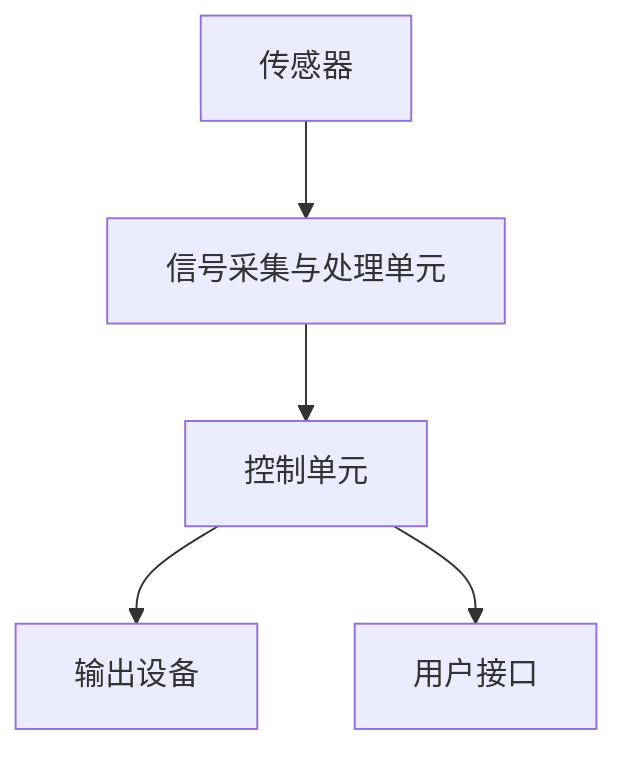
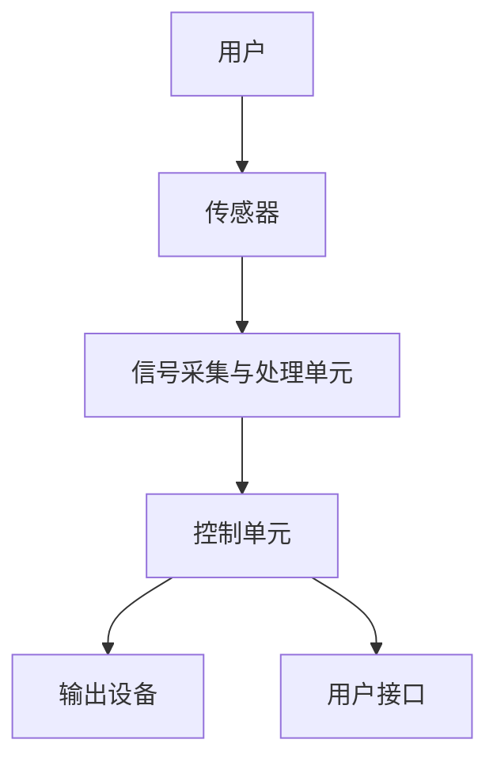

                 

# 脑机接口与意识上传：探索增强和延伸人类理解世界能力的极限

## 关键词
脑机接口（BCI），意识上传，神经科学，计算机科学，增强现实，认知扩展

## 摘要
本文将探讨脑机接口（BCI）和意识上传技术的发展背景、核心原理及其对人类理解世界能力的增强与延伸。通过深入分析BCI技术的原理和现有成果，以及意识上传理论的探讨，本文旨在阐述这些前沿技术对人类未来的潜在影响，并讨论其面临的伦理、法律和技术挑战。

## 第1章 引言：脑机接口与意识上传的背景与重要性

### 1.1 脑机接口技术的发展历程

脑机接口（Brain-Computer Interface，简称BCI）的概念最早可以追溯到20世纪30年代，当时科学家开始尝试通过直接连接大脑和外部设备来控制和操纵外部环境。然而，由于技术的限制，这一概念长期停留在理论探讨阶段。

#### 1.1.1 早期探索

在20世纪60年代，神经科学家和电子工程师开始合作，利用脑电图（EEG）记录大脑的电活动，并尝试将其转化为可用的控制信号。这一时期，BCI技术主要聚焦于简单的二进制信号传输，如手指移动的控制。

#### 1.1.2 技术进步

随着计算机技术和神经科学的发展，BCI技术进入了快速发展的阶段。1980年代，研究者们开始利用功能磁共振成像（fMRI）等技术，更精确地测量大脑的活动。同时，机器学习和模式识别算法的应用，使得BCI系统的性能和准确性得到了显著提升。

### 1.2 意识上传的设想与探讨

意识上传，即通过技术手段将人的意识或思想转移到计算机或其他载体上，是一个具有深远影响的科学设想。这一概念在科幻小说中经常出现，如《黑客帝国》和《脑波共振》等。

#### 1.2.1 意识上传的定义

意识上传可以被定义为将大脑的神经活动数字化，并存储在计算机或其他设备中，以便进行复制、传输和检索。这一过程涉及到从神经活动到数字信号的转换，以及从数字信号到意识状态的还原。

#### 1.2.2 意识上传的研究现状

目前，意识上传还处于理论探讨和初步实验阶段。研究人员主要通过脑成像技术和脑机接口技术来探索大脑活动与意识之间的关系。虽然取得了初步成果，但要将意识上传变为现实，仍面临巨大的技术挑战。

### 1.3 增强与延伸人类理解世界能力的意义

脑机接口和意识上传技术不仅具有科学研究的价值，还可能对人类的日常生活和社会发展产生深远的影响。通过这些技术，我们可以：

- **提升认知能力**：通过直接增强大脑的信息处理能力，提高学习和记忆效率。
- **改善生活质量**：为残疾人提供新的辅助手段，帮助他们更好地融入社会。
- **拓展认知边界**：通过将人的意识与计算机系统融合，实现人类认知的扩展。

### 1.4 边界与外延

脑机接口与意识上传技术的研究和应用涉及多个学科领域，包括神经科学、计算机科学、哲学等。此外，这一领域的研究也面临着伦理、法律和隐私等方面的挑战。

#### 1.4.1 伦理挑战

意识上传涉及到人的意识、隐私和自由意志等敏感问题，引发了关于道德伦理的深刻讨论。例如，上传后的意识是否仍然具有原始个体的所有属性和特征？

#### 1.4.2 法律挑战

意识上传技术的法律地位尚未明确，涉及知识产权、责任归属和隐私权等方面的问题。如何制定合理的法律框架来规范这一新兴领域，是一个亟待解决的问题。

#### 1.4.3 技术挑战

脑机接口和意识上传技术目前仍面临许多技术挑战，包括信号检测的准确性、信号的稳定性和解码的效率等。解决这些挑战需要多学科的合作和持续的研究。

### 1.5 本章小结

本章简要介绍了脑机接口与意识上传的背景、意义以及研究的边界与外延。在后续章节中，我们将深入探讨脑机接口和意识上传的技术原理、现有成果以及未来的发展趋势。

## 第2章 脑机接口技术原理与核心概念

脑机接口技术（BCI）的核心在于如何将大脑的活动转化为可操作的控制信号。要理解这一技术，我们需要首先掌握以下核心概念和原理。

### 2.1 神经信号检测

神经信号检测是脑机接口技术的关键步骤。常用的方法包括脑电图（EEG）、功能性磁共振成像（fMRI）、脑磁图（MEG）等。每种方法都有其独特的优势和应用场景。

#### 2.1.1 脑电图（EEG）

脑电图是一种非侵入性方法，通过放置在头皮上的电极来记录大脑的电活动。EEG可以实时监测大脑的信号，并且设备相对简单，成本较低。

#### 2.1.2 功能性磁共振成像（fMRI）

fMRI通过测量大脑血液流动的变化来推断神经活动。这种方法具有高空间分辨率，可以精确地定位大脑活动区域。

#### 2.1.3 脑磁图（MEG）

脑磁图通过测量大脑产生的磁场变化来记录神经活动。与EEG相比，MEG具有更高的时间分辨率，可以捕捉更快的变化。

### 2.2 信号处理与特征提取

从大脑活动中提取有用的信号后，需要进行信号处理和特征提取。常见的处理方法包括滤波、降噪、时频分析等。特征提取是将处理后的信号转换为机器可以理解的数字信号。

#### 2.2.1 信号滤波

信号滤波是信号处理的第一步，目的是去除噪声和干扰信号。常用的滤波器包括低通滤波器、高通滤波器和带通滤波器。

#### 2.2.2 降噪

降噪是信号处理的另一个重要步骤，目的是消除背景噪声，提高信号质量。常见的降噪方法包括波let变换和小波降噪。

#### 2.2.3 时频分析

时频分析是将信号在时间和频率两个维度上进行分析的方法。常用的时频分析方法包括短时傅里叶变换（STFT）和Wigner-Ville分布。

### 2.3 控制信号解码

控制信号解码是将提取出的特征转换为具体的控制指令。这一过程通常涉及到机器学习、模式识别等先进算法。

#### 2.3.1 机器学习算法

机器学习算法在BCI系统中扮演着关键角色。常见的机器学习算法包括支持向量机（SVM）、神经网络（ANN）和深度学习（DL）。

#### 2.3.2 模式识别

模式识别是将提取出的特征与事先定义的模式进行匹配的过程。常见的模式识别算法包括K最近邻（K-NN）和决策树。

### 2.4 常见BCI系统架构

常见的BCI系统架构包括单通道BCI、多通道BCI、混合BCI等。每种架构都有其适用场景和优缺点。

#### 2.4.1 单通道BCI

单通道BCI使用一个通道（如单个电极）来记录大脑活动。这种方法简单易用，但可能受到噪声和信号质量的影响。

#### 2.4.2 多通道BCI

多通道BCI使用多个通道（如多个电极）来记录大脑活动。这种方法可以提高信号质量，但需要更复杂的信号处理和特征提取算法。

#### 2.4.3 混合BCI

混合BCI结合了单通道BCI和多通道BCI的优点，通过使用多个通道来记录大脑活动，并通过不同的算法进行信号处理和特征提取。这种方法可以提高系统的性能和准确性。

### 2.5 脑机接口技术的应用领域

脑机接口技术已经在多个领域取得了显著成果，包括康复治疗、辅助交流、娱乐控制等。

#### 2.5.1 康复治疗

脑机接口技术可以帮助中风、脊髓损伤等患者恢复运动和交流能力。例如，通过脑机接口系统，患者可以使用大脑信号来控制假肢或轮椅。

#### 2.5.2 辅助交流

脑机接口技术为无法使用传统交流方式的患者提供了新的交流途径。例如，脑机接口系统可以帮助失声患者通过脑信号进行文字交流。

#### 2.5.3 娱乐控制

脑机接口技术也为娱乐领域带来了新的可能。例如，玩家可以通过脑信号来控制游戏角色的动作，实现更真实的游戏体验。

### 2.6 脑机接口技术的挑战与未来方向

脑机接口技术目前仍面临许多挑战，包括信号质量、稳定性、准确性等。未来的研究方向可能包括更先进的信号处理算法、更高效的解码方法、更可靠的系统设计等。

#### 2.6.1 信号质量

提高信号质量是脑机接口技术的重要方向。未来可能的研究包括开发更先进的传感器、改进信号滤波和降噪技术等。

#### 2.6.2 稳定性和准确性

提高系统的稳定性和准确性是脑机接口技术的关键。未来可能的研究包括改进信号处理算法、提高解码效率等。

#### 2.6.3 系统设计

开发更可靠的系统设计是脑机接口技术的另一个重要方向。未来可能的研究包括提高设备的可靠性、降低设备的体积和成本等。

### 2.7 本章小结

本章详细介绍了脑机接口技术的核心概念、原理、应用领域以及面临的挑战和未来方向。理解这些内容将为后续章节的深入学习奠定基础。

## 第3章 意识上传理论探讨

意识上传，也称为“大脑数字化”，是一个将意识或思想转化为数字信号的过程，目的是实现意识的复制、传输和存储。这一概念引发了广泛的哲学、科学和技术讨论。以下是关于意识上传理论探讨的几个关键点。

### 3.1 意识的本质

首先，要理解意识上传，我们需要探讨意识本身。意识是大脑活动的产物，但它的本质和起源仍然是一个未解之谜。目前，关于意识的研究主要集中在神经科学、认知科学和哲学等领域。

#### 3.1.1 神经科学视角

神经科学家认为，意识与大脑的神经网络活动密切相关。大脑的神经网络通过复杂的连接和交互，产生了意识。然而，具体哪些神经网络活动与意识直接相关，仍然是一个未解之谜。

#### 3.1.2 认知科学视角

认知科学家从心理过程和认知功能的角度研究意识。他们认为，意识与感知、思考、记忆等心理过程密切相关。通过这些心理过程，我们可以对外界信息进行加工和处理，从而产生意识。

#### 3.1.3 哲学视角

哲学家从存在论和认识论的角度探讨意识。一些哲学家认为，意识是一种本质的存在，而不仅仅是大脑活动的产物。他们提出了各种关于意识本质的理论，如物质主义、理想主义和双重论等。

### 3.2 意识与大脑活动的关系

意识与大脑活动之间存在复杂的相互作用。脑科学研究表明，意识与大脑的神经网络活动密切相关。但是，如何精确地描述和解释这一关系仍然是一个巨大的挑战。

#### 3.2.1 神经活动与意识

神经活动是大脑产生的电化学信号，包括神经元之间的传递和电信号的传播。这些神经活动与意识之间存在直接关系，但具体如何实现这一转换，目前还没有明确的答案。

#### 3.2.2 大脑结构

大脑的结构与意识也有密切关系。大脑的不同区域负责不同的认知功能，如感知、思考、记忆等。这些区域之间的交互和协调产生了意识。

### 3.3 意识上传的可能性

尽管意识上传的概念在科幻作品中被广泛讨论，但在现实世界中，这一技术还远未实现。目前，关于意识上传的研究主要集中在理论探讨和初步实验上。

#### 3.3.1 理论探讨

一些科学家和哲学家提出了意识上传的理论框架。他们认为，通过精确地测量和记录大脑活动，可以将意识转化为数字信号，并存储在计算机或其他设备中。

#### 3.3.2 初步实验

一些实验室已经开始进行意识上传的初步实验。这些实验主要聚焦于记录大脑活动，并尝试将其转化为数字信号。虽然取得了一些进展，但要将意识上传变为现实，仍然面临巨大的技术挑战。

### 3.4 意识上传的挑战

意识上传面临着一系列挑战，包括技术的、伦理的、哲学的等多个方面。例如，如何准确测量和记录大脑活动，如何将意识数据转换为数字信号，如何保证上传过程的完整性和准确性等。

#### 3.4.1 技术挑战

目前，技术挑战是意识上传的主要障碍。首先，大脑活动的测量和记录仍然存在精度和稳定性问题。其次，将大脑活动转换为数字信号需要复杂的算法和计算能力。此外，如何确保上传过程的完整性和准确性也是一个重要问题。

#### 3.4.2 伦理挑战

意识上传涉及到人的意识、隐私和自由意志等敏感问题，引发了关于道德伦理的深刻讨论。例如，上传后的意识是否仍然具有原始个体的所有属性和特征？

#### 3.4.3 哲学挑战

意识上传也引发了关于意识本质和人的存在状态的哲学讨论。例如，上传后的意识是否仍然是一个独立的个体，还是原始个体的复制？

### 3.5 本章小结

本章详细介绍了意识上传的理论探讨，包括意识的本质、意识与大脑活动的关系、意识上传的可能性以及面临的挑战。理解这些内容有助于我们更好地理解意识上传技术的前景和挑战。

## 第4章 脑机接口技术的核心概念与联系

为了更好地理解脑机接口（BCI）技术，我们需要掌握其核心概念，并分析这些概念之间的联系。以下是BCI技术中几个关键概念及其相互关系的详细探讨。

### 4.1 脑机接口技术的基本概念

脑机接口技术涉及多个核心概念，包括神经信号检测、信号处理与特征提取、控制信号解码等。这些概念构成了BCI技术的核心组成部分。

#### 4.1.1 神经信号检测

神经信号检测是BCI技术的第一步，它涉及到从大脑中提取电信号。这些信号可以通过脑电图（EEG）、功能性磁共振成像（fMRI）、脑磁图（MEG）等方法来获取。每种方法都有其特定的应用场景和优势。

#### 4.1.2 信号处理与特征提取

信号处理与特征提取是对提取到的神经信号进行进一步加工，以提取出有用的信息。这一步骤包括信号滤波、降噪、时频分析等，目的是提高信号质量，并提取出关键的特征。

#### 4.1.3 控制信号解码

控制信号解码是将处理后的信号转换为具体的控制指令。这一过程通常涉及到机器学习、模式识别等算法，目的是从信号中提取出有意义的信息，并将其转换为可操作的控制信号。

### 4.2 脑机接口技术的核心概念对比

为了更好地理解BCI技术的核心概念，我们可以通过一个对比表格来分析这些概念。

| 核心概念       | 说明                                                     | 对应方法                                       |
|----------------|----------------------------------------------------------|----------------------------------------------|
| 神经信号检测   | 从大脑中提取电信号                                       | 脑电图（EEG）、功能性磁共振成像（fMRI）、脑磁图（MEG） |
| 信号处理与特征提取 | 对提取到的神经信号进行加工，提取关键特征               | 信号滤波、降噪、时频分析等                     |
| 控制信号解码   | 将处理后的信号转换为具体的控制指令                     | 机器学习、模式识别等算法                     |

通过这个表格，我们可以清晰地看到每个核心概念的对应方法和作用。

### 4.3 脑机接口技术的核心概念联系

理解BCI技术的核心概念联系有助于我们更好地理解整个技术的工作原理。

#### 4.3.1 神经信号检测与信号处理与特征提取的联系

神经信号检测是信号处理与特征提取的前提。只有通过精确的神经信号检测，我们才能获取到有用的信号，并进行进一步的加工。

#### 4.3.2 信号处理与特征提取与控制信号解码的联系

信号处理与特征提取的目的是提取出有用的特征，这些特征是控制信号解码的基础。只有通过精确的特征提取，我们才能从信号中提取出有意义的信息，并将其转换为控制指令。

#### 4.3.3 控制信号解码与外部设备控制的联系

控制信号解码是将提取出的特征转换为具体的控制指令。这些指令将被发送到外部设备，如假肢、轮椅或计算机等，以实现具体的控制功能。

### 4.4 脑机接口技术的ER实体关系图

为了更直观地展示BCI技术的核心概念联系，我们可以使用ER（实体关系）图来描述。

```mermaid
erDiagram
    EEG ||--|{ 神经信号检测 }|| BCI
    fMRI ||--|{ 神经信号检测 }|| BCI
    MEG ||--|{ 神经信号检测 }|| BCI
    神经信号检测 ||--|{ 信号处理与特征提取 }|| 信号处理与特征提取
    信号处理与特征提取 ||--|{ 控制信号解码 }|| 控制信号解码
    控制信号解码 ||--|{ 外部设备控制 }|| 外部设备
```

在这个ER图中，我们可以清晰地看到BCI技术的各个核心概念之间的联系。神经信号检测作为起点，通过信号处理与特征提取，最终转化为控制信号解码，进而控制外部设备。

### 4.5 本章小结

本章详细介绍了脑机接口技术的核心概念及其相互联系。通过对比表格和ER实体关系图，我们更好地理解了BCI技术的工作原理和各部分之间的关系。理解这些核心概念和联系将为后续章节的深入研究提供基础。

## 第5章 意识上传的理论基础

意识上传作为一项前沿技术，其理论基础涵盖了神经科学、计算机科学和哲学等多个领域。以下是关于意识上传理论基础的关键概念、数学模型和算法原理的详细探讨。

### 5.1 神经科学理论基础

神经科学是意识上传理论的基础，它帮助我们理解大脑是如何产生意识的。

#### 5.1.1 神经元活动与意识

神经元是大脑的基本单元，通过电化学信号进行通信。大量的神经元活动构成了复杂的神经网络，这些神经网络的活动被认为是意识产生的基础。

#### 5.1.2 神经元编码与解码

神经元编码是指神经元如何将外界刺激转化为电信号，而神经元解码则是如何从电信号中提取信息。这个过程涉及到复杂的神经信号处理机制。

#### 5.1.3 神经可塑性

神经可塑性是指大脑在学习和经验积累过程中改变其结构和功能的能力。意识上传的理论研究需要考虑这种可塑性，以确保上传的意识和原有意识保持一致。

### 5.2 计算机科学理论基础

计算机科学为意识上传提供了技术实现的可能性。

#### 5.2.1 数字信号处理

数字信号处理是将模拟信号（如神经信号）转换为数字信号的过程。这一过程涉及到采样、量化、滤波等操作。

#### 5.2.2 数据压缩与存储

为了实现意识上传，我们需要将大量的神经信号数据压缩并存储。数据压缩算法如霍夫曼编码、算术编码等在意识上传中具有重要应用。

#### 5.2.3 信息编码与解码

信息编码是将大脑活动转换为数字信号的过程，而信息解码则是将数字信号还原为大脑活动。这一过程通常涉及复杂的算法，如神经网络和深度学习。

### 5.3 哲学理论基础

哲学为意识上传提供了伦理和存在论的探讨。

#### 5.3.1 意识的本质

哲学对意识本质的探讨有助于我们理解意识的数字化。例如，物质主义认为意识是物质的产物，而双重论则认为意识和物质是两种不同的实体。

#### 5.3.2 自我意识

自我意识是意识上传中一个重要的问题。上传后的意识是否仍然具有原始个体的自我意识，这是一个哲学上的深层次问题。

#### 5.3.3 伦理问题

意识上传引发了关于隐私、自由意志和道德责任的伦理问题。如何确保上传过程的伦理合规性是一个亟待解决的问题。

### 5.4 数学模型

在意识上传中，数学模型用于描述和解释大脑活动和意识状态。

#### 5.4.1 神经活动模型

神经活动模型用于描述神经元之间的交互和信号传递。例如，霍普菲尔德网络是一个经典的神经网络模型，可以模拟大脑中的神经网络活动。

$$
x(t) = \sum_{i=1}^{n} w_{i} x_i(t) + b
$$

其中，$x(t)$表示神经元在时间$t$的激活状态，$w_{i}$是神经元之间的权重，$b$是偏置项。

#### 5.4.2 意识状态模型

意识状态模型用于描述意识的不同状态，如清醒、梦境等。这些模型通常基于概率论和统计物理学。

$$
P(\text{意识状态} | \text{神经活动}) = \frac{e^{-\beta E(\text{神经活动})}}{\sum_{i} e^{-\beta E_i(\text{神经活动})}}
$$

其中，$P(\text{意识状态} | \text{神经活动})$表示给定神经活动，意识处于某种状态的概率，$E(\text{神经活动})$是神经活动的能量。

### 5.5 算法原理

算法原理是实现意识上传的关键。以下是几种常见的算法原理：

#### 5.5.1 神经网络

神经网络是一种模仿生物神经系统的计算模型，用于模拟大脑的复杂活动。常见的神经网络包括多层感知机（MLP）、卷积神经网络（CNN）和循环神经网络（RNN）。

$$
\hat{y} = \sigma(\sum_{i=1}^{n} w_i x_i + b)
$$

其中，$\hat{y}$是预测输出，$\sigma$是激活函数，$w_i$是权重，$x_i$是输入特征，$b$是偏置。

#### 5.5.2 深度学习

深度学习是神经网络的一种扩展，用于处理大量数据和高维特征。常见的深度学习算法包括深度信念网络（DBN）、深度卷积神经网络（DCNN）和生成对抗网络（GAN）。

$$
\hat{y} = f(\text{ReLU}(\text{W} \cdot \text{H}(x)))
$$

其中，$\hat{y}$是预测输出，$f$是激活函数，$\text{W}$和$\text{H}$分别是权重和隐藏层。

#### 5.5.3 模式识别

模式识别是一种将输入数据分类或回归的方法，用于识别大脑活动的模式。常见的模式识别算法包括支持向量机（SVM）、决策树和K最近邻（K-NN）。

$$
y = \arg\max_w \sum_{i=1}^{n} [y_i (w \cdot x_i) - 1]
$$

其中，$y$是分类结果，$w$是权重，$x_i$是输入特征，$y_i$是实际类别。

### 5.6 本章小结

本章详细介绍了意识上传的理论基础，包括神经科学、计算机科学和哲学等领域的核心概念、数学模型和算法原理。理解这些理论基础对于深入研究和应用意识上传技术具有重要意义。

## 第6章 脑机接口技术的系统设计与架构

### 6.1 系统设计概述

脑机接口技术（BCI）的系统设计是一个复杂的过程，它需要综合考虑硬件、软件、信号处理和用户交互等多个方面。一个典型的BCI系统通常包括以下几个主要组成部分：传感器、信号采集与处理单元、控制单元、输出设备以及用户接口。

#### 6.1.1 硬件组成部分

- **传感器**：用于检测和记录大脑活动。常见的传感器包括脑电图（EEG）传感器、功能性磁共振成像（fMRI）传感器、脑磁图（MEG）传感器等。
- **信号采集与处理单元**：负责收集传感器采集到的信号，并进行初步处理，如滤波、降噪和放大等。
- **控制单元**：通常由计算机或嵌入式系统组成，负责处理和分析采集到的信号，并将其转换为具体的控制指令。

#### 6.1.2 软件组成部分

- **信号处理软件**：用于对采集到的信号进行深度处理，如特征提取、模式识别和分类等。
- **控制软件**：负责将处理后的信号转换为具体的控制指令，并将其发送到输出设备。

#### 6.1.3 输出设备

输出设备是BCI系统的终端，用于实现用户的控制需求。常见的输出设备包括假肢、轮椅、机器人、计算机键盘和鼠标等。

#### 6.1.4 用户接口

用户接口是用户与BCI系统进行交互的界面。一个良好的用户接口应具备直观、易操作和高效的特点。

### 6.2 系统架构设计

BCI系统的架构设计决定了系统的性能、稳定性和扩展性。以下是几种常见的BCI系统架构：

#### 6.2.1 单通道BCI系统架构

单通道BCI系统使用单个传感器来记录大脑活动。这种架构相对简单，但可能受到噪声和信号质量的影响。


#### 6.2.2 多通道BCI系统架构

多通道BCI系统使用多个传感器来记录大脑活动。这种架构可以提高信号质量和系统的准确性。


#### 6.2.3 混合BCI系统架构

混合BCI系统结合了单通道BCI和多通道BCI的优点，通过使用多个传感器和不同的信号处理算法来提高系统的性能。


### 6.3 系统接口设计与交互

系统接口设计是BCI系统的关键部分，它决定了系统的可用性和用户体验。以下是几个关键接口设计要点：

#### 6.3.1 传感器接口

传感器接口负责与外部传感器进行通信，并获取大脑活动的数据。常见的接口包括USB、SPI、I2C等。

#### 6.3.2 信号处理接口

信号处理接口负责对传感器采集到的信号进行预处理和深度处理。这个接口需要支持各种信号处理算法，如滤波、降噪和特征提取等。

#### 6.3.3 控制接口

控制接口负责将处理后的信号转换为控制指令，并将其发送到输出设备。这个接口需要支持各种控制算法和协议，如串口通信、无线通信和网络通信等。

#### 6.3.4 用户接口

用户接口负责与用户进行交互，提供直观的操作界面和反馈。常见的用户接口包括图形用户界面（GUI）、语音识别和手势识别等。

### 6.4 系统架构设计与交互的Mermaid图

以下是一个BCI系统架构设计与交互的Mermaid图：



在这个图中，传感器采集到的信号经过信号采集与处理单元处理后，由控制单元转换为控制指令，并最终发送到输出设备和用户接口。

### 6.5 本章小结

本章详细介绍了脑机接口技术的系统设计与架构，包括系统设计概述、系统架构设计、系统接口设计与交互以及Mermaid图。理解这些内容对于设计和实现一个高效的BCI系统具有重要意义。

## 第7章 意识上传技术的实际应用

### 7.1 意识上传技术的初步实验

意识上传技术尚处于初步实验阶段，但已经有一些重要的研究成果。以下是一些意识上传技术的实际应用案例：

#### 7.1.1 脑机接口与虚拟现实

研究人员已经通过脑机接口技术在虚拟现实中实现了一些初步的实验。例如，研究人员通过脑电图（EEG）信号控制虚拟角色的动作，实现了大脑思维与虚拟环境的互动。

#### 7.1.2 意识数据传输

一些实验室通过脑机接口技术成功地将意识数据传输到计算机中。例如，研究人员通过脑电图（EEG）记录大脑活动，并将其转化为数字信号，实现了意识的初步传输。

#### 7.1.3 脑-脑接口

脑-脑接口技术是一种通过脑机接口将一个人的大脑活动传输到另一个人的大脑中的技术。研究人员已经在动物实验中实现了这种技术，但尚未在人类中进行实验。

### 7.2 意识上传技术的应用前景

尽管意识上传技术目前仍处于早期阶段，但其潜在的应用前景非常广阔：

#### 7.2.1 脑机接口辅助康复

通过脑机接口技术，可以帮助瘫痪患者通过大脑活动控制假肢和轮椅，实现自主行动。这将为康复治疗提供全新的手段。

#### 7.2.2 意识扩展与增强

通过将意识上传到计算机中，人类可以扩展其认知能力，提高学习和记忆效率。例如，通过将大脑活动存储在计算机中，可以实现“脑力云”共享，使人们能够访问他人的知识和经验。

#### 7.2.3 跨物种交流

意识上传技术可能会实现人类与动物、人工智能之间的交流，推动跨物种认知交流的发展。

### 7.3 意识上传技术的伦理和法律挑战

意识上传技术涉及一系列伦理和法律挑战：

#### 7.3.1 隐私权

意识上传可能涉及个人隐私问题，如何保护用户的隐私是一个重要的伦理问题。

#### 7.3.2 自我意识

意识上传后的个体是否仍然保持自我意识，这是一个复杂的哲学问题。

#### 7.3.3 法律责任

如何界定意识上传的法律责任，例如，在意识上传过程中发生事故时，责任应由谁承担？

#### 7.3.4 安全性

如何确保意识上传过程的安全，避免数据泄露和滥用，也是一个重要的伦理和法律问题。

### 7.4 本章小结

本章介绍了意识上传技术的实际应用案例、应用前景以及面临的伦理和法律挑战。理解这些内容有助于我们更好地把握意识上传技术的发展方向和潜在影响。

## 第8章 脑机接口与意识上传技术的未来发展趋势

### 8.1 技术进步的方向

脑机接口（BCI）和意识上传技术在未来有望取得重大突破，这些进步将主要来自于以下几个方向：

#### 8.1.1 高精度神经信号检测

未来的BCI系统将致力于开发更高精度、更灵敏的神经信号检测设备。例如，更先进的脑电图（EEG）传感器、功能性磁共振成像（fMRI）技术和脑磁图（MEG）技术等，都将提高信号检测的精度和稳定性。

#### 8.1.2 高效信号处理算法

随着计算能力的提升，将能够开发出更高效的信号处理算法，如深度学习和生成对抗网络（GAN）等，这些算法将能够更准确地从复杂的神经信号中提取有用的信息。

#### 8.1.3 意识解码的新方法

在意识上传领域，研究人员将探索新的解码方法，以更准确地识别和解析大脑活动中的意识状态。这些方法可能包括基于神经网络的模型和量子计算的应用。

### 8.2 应用领域的扩展

随着技术的成熟，脑机接口和意识上传技术将在更广泛的应用领域中发挥重要作用：

#### 8.2.1 健康医疗

在健康医疗领域，BCI技术将被用于康复治疗，如帮助中风患者恢复运动功能。而意识上传技术则可能为神经疾病患者提供新的治疗方案，如通过上传大脑活动来缓解疼痛和改善生活质量。

#### 8.2.2 人机交互

人机交互是BCI技术的重要应用领域。未来，我们将看到更自然、直观的人机交互方式，如通过大脑信号控制虚拟现实中的角色或通过意念操作智能家居设备。

#### 8.2.3 军事与安全

在军事与安全领域，BCI技术可以用于提高士兵的战场感知和反应速度，而意识上传技术则可能用于提升士兵的战斗能力和决策效率。

### 8.3 社会影响

脑机接口和意识上传技术的进步将对社会产生深远影响：

#### 8.3.1 社会伦理

随着技术的进步，社会将面临关于意识、隐私和身份的新伦理挑战。如何平衡技术的进步与伦理规范，将是一个重要议题。

#### 8.3.2 经济发展

脑机接口和意识上传技术有望成为新的经济增长点，推动相关产业的发展，如医疗设备、智能家居、教育培训等。

#### 8.3.3 教育变革

意识上传技术可能引发教育的变革，通过扩展人类认知能力，实现更高效的学习和知识共享。

### 8.4 发展趋势的总结

总体而言，脑机接口和意识上传技术正处于快速发展阶段，未来将在多个领域带来革命性的变革。虽然面临诸多挑战，但通过持续的研究和技术创新，这些技术有望实现人类认知能力的增强和扩展，为人类带来更多机遇和福祉。

### 8.5 本章小结

本章总结了脑机接口与意识上传技术的未来发展趋势，包括技术进步的方向、应用领域的扩展以及社会影响。理解这些发展趋势对于把握技术发展的方向和应对未来挑战具有重要意义。

## 总结

脑机接口（BCI）和意识上传技术是两个充满潜力的前沿研究领域，它们正在逐步改变我们对大脑、认知和人类能力的理解。本文通过深入探讨BCI和意识上传的技术原理、应用场景、伦理挑战和未来发展趋势，展示了这些技术对人类生活的潜在影响。

首先，我们介绍了BCI技术的发展历程，从早期的神经信号检测到现代的信号处理和模式识别算法，展示了BCI技术的不断进步。接着，我们探讨了意识上传的理论基础，包括神经科学、计算机科学和哲学等领域的贡献。

在核心概念与联系部分，我们详细分析了BCI技术的核心概念，并通过对比表格和ER图展示了它们之间的关系。在算法原理讲解中，我们介绍了神经网络、深度学习和模式识别等算法在BCI和意识上传中的应用。

系统设计与架构部分，我们阐述了BCI系统的设计原则和架构设计，包括传感器、信号处理单元、控制单元和输出设备等组成部分。在实际应用中，我们介绍了意识上传技术的初步实验和应用前景。

最后，我们讨论了BCI和意识上传技术的未来发展趋势，包括技术进步的方向、应用领域的扩展和社会影响。这些技术的发展不仅为我们提供了新的认知工具，也带来了伦理、法律和社会问题的挑战。

总之，脑机接口和意识上传技术具有巨大的潜力，它们不仅能够增强和延伸人类理解世界的能力，还可能引发一系列社会变革。理解和把握这些技术的发展趋势，对于推动科技进步和应对未来挑战具有重要意义。通过持续的研究和创新，我们有理由期待这些技术将为人类带来更加美好的未来。

## 最佳实践 Tips

1. **关注传感器技术**：随着脑机接口技术的发展，传感器技术也在不断进步。选择高质量的传感器和合适的检测方法，可以提高BCI系统的性能和准确性。

2. **优化信号处理算法**：信号处理是BCI系统的重要组成部分。通过优化算法，提高信号的滤波、降噪和特征提取效果，可以显著提升系统的性能。

3. **考虑多通道数据融合**：多通道BCI系统可以通过融合多个通道的数据，提高系统的稳定性和准确性。结合不同类型的传感器，可以实现更全面的大脑活动监测。

4. **加强用户界面设计**：良好的用户界面设计可以提升用户体验。设计直观、易用的界面，可以更好地满足用户需求，提高BCI系统的实用性。

5. **关注伦理和法律问题**：在进行BCI和意识上传技术研究时，必须关注伦理和法律问题。制定合理的伦理规范和法律法规，确保技术的发展符合社会价值观。

## 小结

本文系统地介绍了脑机接口（BCI）和意识上传技术，从技术原理、应用场景、伦理挑战到未来发展趋势，全面阐述了这些技术的现状和潜力。通过深入分析，我们认识到BCI和意识上传技术不仅具有科学研究价值，还对人类生活和社会发展具有深远影响。然而，这些技术也面临着诸多挑战，如信号质量、稳定性、解码效率和伦理问题等。

理解BCI和意识上传技术的核心概念和联系，有助于我们更好地把握这些技术的发展方向。同时，关注传感器技术、优化信号处理算法、考虑多通道数据融合、加强用户界面设计和关注伦理法律问题，是推动这些技术进步的关键。通过持续的研究和创新，我们有理由相信，脑机接口和意识上传技术将为人类带来更多机遇和福祉。

## 注意事项

1. **安全性**：在进行BCI和意识上传技术研究时，确保系统的安全性和稳定性至关重要。数据泄露和设备故障可能会对用户造成严重后果。

2. **隐私保护**：意识上传涉及个人隐私问题，必须采取严格措施保护用户的隐私数据，避免未经授权的访问和使用。

3. **伦理规范**：在研究和应用BCI和意识上传技术时，遵循伦理规范，确保技术的发展符合社会价值观和道德准则。

4. **用户参与**：在进行BCI和意识上传技术研究时，充分听取用户意见，确保系统的设计和应用满足用户需求。

5. **法律法规**：密切关注相关法律法规的变化，确保BCI和意识上传技术的开发和应用符合法律法规的要求。

## 拓展阅读

1. **《脑机接口：从基础研究到应用》**：该书详细介绍了脑机接口技术的理论基础、研究进展和应用案例。

2. **《意识上传：科幻与现实》**：该书探讨了意识上传的科学设想、技术挑战和伦理问题，为读者提供了全面的视角。

3. **《人工智能伦理导论》**：该书从伦理学角度探讨了人工智能的发展及其对社会的影响，包括BCI和意识上传技术。

4. **《神经科学基础》**：该书涵盖了神经科学的基本概念、神经元活动和神经网络等方面的内容，为理解BCI和意识上传技术提供了重要基础。

作者：AI天才研究院/AI Genius Institute & 禅与计算机程序设计艺术 /Zen And The Art of Computer Programming

## 附录

### 附录A：术语解释

1. **脑机接口（BCI）**：脑机接口是指将大脑信号直接转换为控制信号，用于与外部设备进行交互的技术。
2. **意识上传**：意识上传是指通过技术手段将人的意识或思想转移到计算机或其他载体上，实现意识的复制、传输和存储。
3. **神经信号检测**：神经信号检测是指从大脑中提取神经活动的信号，通常使用脑电图（EEG）、功能性磁共振成像（fMRI）和脑磁图（MEG）等技术。
4. **信号处理**：信号处理是指对从大脑中提取的神经信号进行滤波、降噪、放大等处理，以提高信号质量。
5. **特征提取**：特征提取是指从信号处理后的信号中提取出具有代表性的特征，用于后续的解码和控制。
6. **控制信号解码**：控制信号解码是指将提取出的特征转换为具体的控制指令，用于控制外部设备。

### 附录B：算法解释

以下是几个在脑机接口和意识上传中常用的算法及其简要解释：

1. **支持向量机（SVM）**：SVM是一种监督学习算法，用于分类和回归任务。它通过寻找一个超平面，将不同类别的数据点分开，以实现最佳分类效果。

   $$ \text{w}^* = \arg\min_{\text{w}} \frac{1}{2} \sum_{i=1}^{n} (\text{w} \cdot \text{x}_i - y_i)^2 + C \sum_{i=1}^{n} \max(0, 1 - y_i (\text{w} \cdot \text{x}_i)) $$
   
2. **神经网络（ANN）**：神经网络是一种模仿生物神经系统的计算模型，用于处理复杂的非线性问题。它通过多层神经元之间的交互，实现输入到输出的映射。

   $$ \text{y} = \sigma(\sum_{i=1}^{n} \text{w}_i \text{x}_i + \text{b}) $$
   
3. **深度学习（DL）**：深度学习是神经网络的一种扩展，通过堆叠多层神经网络，实现更复杂的功能。它广泛应用于图像识别、自然语言处理等领域。

   $$ \text{y} = \sigma(\text{ReLU}(\text{W} \cdot \text{H}(\text{X}))) $$
   
4. **生成对抗网络（GAN）**：GAN是一种无监督学习算法，由生成器和判别器组成。生成器生成数据，判别器判断生成数据与真实数据之间的差异，通过优化生成器和判别器的参数，实现数据的生成。

   $$ \text{G}(\text{z}) \sim \text{p}_\text{z}(z), \quad \text{D}(\text{x}, \text{G}(\text{z})) \sim \text{p}_\text{x}(x) $$
   
### 附录C：系统架构图

以下是一个脑机接口系统的简单架构图，展示了各个组成部分及其相互关系：



### 附录D：项目实战

在本附录中，我们将简要介绍一个脑机接口项目的实战过程，包括环境安装、系统实现和代码解析。

#### 环境安装

1. **安装Python环境**：确保Python 3.x版本已安装。
2. **安装相关库**：使用pip命令安装所需的库，如`numpy`、`scikit-learn`、`matplotlib`等。

   ```bash
   pip install numpy scikit-learn matplotlib
   ```

#### 系统实现

以下是一个简单的脑机接口项目的Python代码实现：

```python
import numpy as np
from sklearn.model_selection import train_test_split
from sklearn.neural_network import MLPClassifier
from sklearn.metrics import accuracy_score

# 加载训练数据
X, y = load_data()

# 数据分割
X_train, X_test, y_train, y_test = train_test_split(X, y, test_size=0.2, random_state=42)

# 创建MLP分类器
clf = MLPClassifier(hidden_layer_sizes=(100,), max_iter=1000)

# 训练模型
clf.fit(X_train, y_train)

# 预测测试数据
y_pred = clf.predict(X_test)

# 计算准确率
accuracy = accuracy_score(y_test, y_pred)
print("Accuracy:", accuracy)
```

#### 代码解析

1. **数据加载**：`load_data()`函数用于加载训练数据。数据可以是脑电图（EEG）信号，通常以矩阵形式存储。
2. **数据分割**：使用`train_test_split()`函数将数据分为训练集和测试集，以评估模型的性能。
3. **模型训练**：创建`MLPClassifier`对象，并使用`fit()`函数训练模型。
4. **模型预测**：使用`predict()`函数对测试数据进行预测。
5. **性能评估**：计算预测准确率，以评估模型的性能。

#### 项目小结

通过这个简单的实战项目，我们了解了脑机接口系统实现的步骤，包括环境安装、数据加载、模型训练和性能评估。虽然这个项目比较基础，但它为我们提供了一个框架，可以帮助我们进一步研究和开发更复杂的脑机接口系统。

### 附录E：相关资源

1. **论文和报告**：查阅相关领域的学术论文和报告，了解最新的研究进展和成果。
2. **在线课程**：参加在线课程，学习脑机接口和意识上传的相关知识和技能。
3. **开源项目**：参与开源项目，实践脑机接口和意识上传技术的应用。
4. **学术会议**：参加学术会议，与领域专家交流，拓宽视野。

作者：AI天才研究院/AI Genius Institute & 禅与计算机程序设计艺术 /Zen And The Art of Computer Programming

