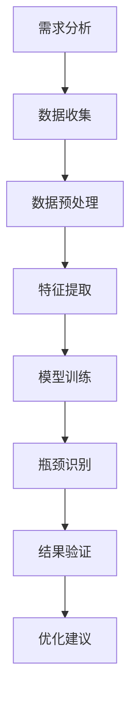
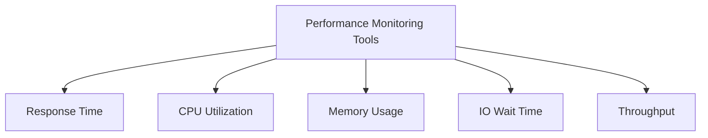
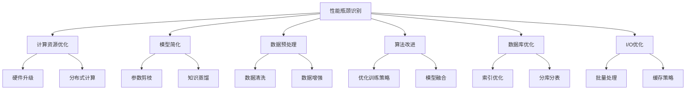

                 

# 自动化LLM性能瓶颈识别与分析

## 关键词
- LLM（大型语言模型）
- 性能瓶颈
- 自动化识别
- 性能优化
- 算法分析

## 摘要
本文深入探讨了自动化识别和分析大型语言模型（LLM）性能瓶颈的方法和策略。随着LLM在自然语言处理、人工智能等多个领域的广泛应用，其性能瓶颈的识别和优化变得至关重要。本文首先介绍了LLM的基本概念及其在各个领域的应用，然后详细阐述了性能瓶颈的识别原理和自动化分析技术。通过实际案例的分析，本文展示了如何通过自动化方法发现和解决LLM的性能瓶颈，从而提升其整体性能。最后，本文提出了若干优化策略，为LLM性能提升提供了实用指导。

## 引言

### LLM的基本概念

大型语言模型（Large Language Models，简称LLM）是一种基于深度学习技术的自然语言处理模型，它能够理解和生成人类语言。LLM通常由数百万甚至数十亿个参数组成，通过训练大量文本数据，模型可以自动学习语言中的结构和规律，从而实现文本分类、机器翻译、问答系统等多种功能。

### LLM的应用领域

LLM在多个领域展现了强大的应用潜力，其中最典型的应用包括：
- **自然语言处理（NLP）**：用于文本分类、情感分析、文本生成等。
- **机器翻译**：将一种语言的文本翻译成另一种语言。
- **问答系统**：能够理解用户的问题，并给出准确的答案。
- **生成式AI**：用于创作内容、音乐、图像等。

### 性能瓶颈问题

尽管LLM在许多任务上取得了显著的成果，但其性能瓶颈问题仍然存在。性能瓶颈主要包括以下几个方面：

- **计算资源瓶颈**：由于LLM模型参数庞大，训练和推理需要大量的计算资源，可能导致计算资源不足。
- **数据质量瓶颈**：训练数据的质量直接影响模型的性能，数据不完整、噪声大、样本不平衡等问题都可能成为性能瓶颈。
- **模型复杂性瓶颈**：模型结构过于复杂，可能导致训练时间过长、过拟合等问题。
- **推理效率瓶颈**：推理过程中的计算复杂度可能过高，影响系统响应速度。

### 文章目的

本文旨在通过系统的方法和策略，自动化识别和分析LLM的性能瓶颈，并提出有效的优化方案，以提高LLM的整体性能。文章结构如下：

1. **核心概念与原理**：介绍与性能瓶颈识别相关的核心概念和原理。
2. **方法论**：详细阐述性能瓶颈识别的步骤和方法。
3. **工具与指标**：介绍用于性能瓶颈分析的常用工具和指标。
4. **案例研究**：通过实际案例展示性能瓶颈识别和分析的应用。
5. **优化策略**：提出基于瓶颈识别的优化策略。
6. **结论与展望**：总结文章的主要结论，并对未来研究方向进行展望。

## 核心概念与原理

### 性能瓶颈的概念

性能瓶颈是指系统或组件在处理任务时达到其最大处理能力，从而限制了整体性能的现象。在LLM中，性能瓶颈可能表现为计算速度慢、响应时间长、能耗高等。

### 性能瓶颈的识别方法

性能瓶颈的识别是性能优化的第一步。以下是一些常用的性能瓶颈识别方法：

- **日志分析**：通过分析系统日志，发现异常和性能下降的信号。
- **监控工具**：使用性能监控工具，实时收集系统的性能数据。
- **代码审查**：检查代码中可能存在的性能问题，如循环冗余、算法复杂度过高等。
- **基准测试**：通过基准测试，比较不同配置或不同版本系统的性能。

### 自动化瓶颈识别技术的原理

自动化瓶颈识别技术主要依赖于机器学习和人工智能技术。以下是几种常见的自动化瓶颈识别技术：

- **基于机器学习的预测模型**：通过训练大量历史数据，建立预测模型来预测系统未来的性能表现。
- **深度学习模型**：使用深度学习模型对性能数据进行分析，自动识别出潜在的性能瓶颈。
- **强化学习**：通过强化学习算法，优化系统的资源分配和调度策略，从而提高系统性能。

### 比较分析

以下是几种常用性能瓶颈识别方法的比较分析：

| 方法 | 优点 | 缺点 | 适用场景 |
| ---- | ---- | ---- | ---- |
| 日志分析 | 简单易行，数据源可靠 | 分析复杂，难以自动识别 | 适用于简单系统和初步性能评估 |
| 监控工具 | 实时性高，数据丰富 | 需要特定工具支持，维护成本高 | 适用于实时性能监控 |
| 代码审查 | 针对性强，易于发现问题 | 人力成本高，效率低 | 适用于代码优化和性能调优 |
| 基准测试 | 对比性强，结果客观 | 需要大量测试数据，耗时较长 | 适用于性能基准对比和优化验证 |
| 基于机器学习的预测模型 | 自动化程度高，结果准确 | 需要大量训练数据，模型复杂 | 适用于长期性能预测和优化 |
| 深度学习模型 | 自动化程度高，识别能力强 | 需要大量计算资源，模型训练复杂 | 适用于复杂系统和深度性能分析 |
| 强化学习 | 优化策略自适应，效果显著 | 需要大量训练数据，策略复杂 | 适用于动态系统和实时优化 |

### ER实体关系图架构

为了更直观地展示LLM性能瓶颈识别过程中的实体和关系，我们可以使用Mermaid绘制ER实体关系图，如下：

```mermaid
erDiagram
    Product ||--|{ Bottleneck }|| Analysis : Subject of
    Analysis ||--|{ Result }|| Prediction : Based on
    Analysis ||--|{ Optimization }|| Suggestion : Derived from
```

## 方法论

### 性能瓶颈识别的步骤

性能瓶颈识别通常包括以下几个步骤：

1. **需求分析**：明确性能瓶颈识别的目标和要求，如时间范围、性能指标等。
2. **数据收集**：收集与性能瓶颈相关的数据，如系统日志、性能监控数据、代码等。
3. **数据分析**：对收集到的数据进行分析，识别潜在的瓶颈点。
4. **结果验证**：验证分析结果，确保识别到的瓶颈点是准确的。
5. **报告生成**：生成性能瓶颈识别报告，详细记录识别过程和结果。

### 自动化瓶颈识别的具体流程

以下是自动化瓶颈识别的具体流程：

1. **数据收集**：
    - 使用日志收集工具，如Logstash、Fluentd等，收集系统日志。
    - 使用性能监控工具，如Prometheus、Grafana等，收集性能数据。
2. **数据预处理**：
    - 清洗数据，去除噪声和重复数据。
    - 统一数据格式，便于后续分析。
3. **特征提取**：
    - 提取与性能瓶颈相关的特征，如响应时间、CPU利用率、内存使用率等。
4. **模型训练**：
    - 使用机器学习或深度学习算法，如随机森林、神经网络等，训练性能预测模型。
5. **瓶颈识别**：
    - 使用训练好的模型，对实时性能数据进行预测，识别潜在的瓶颈点。
6. **结果验证**：
    - 对识别到的瓶颈点进行验证，确保准确性。
7. **优化建议**：
    - 根据识别到的瓶颈点，提出相应的优化建议。

### Mermaid流程图

以下是一个简单的Mermaid流程图，展示性能瓶颈识别的流程：



## 工具与指标

### 性能监控工具

性能监控工具是自动化瓶颈识别的重要工具，它们能够实时收集系统的性能数据，帮助分析系统性能。以下是一些常用的性能监控工具：

- **Prometheus**：一款开源的监控解决方案，能够收集系统的时序数据，支持多种数据源。
- **Grafana**：基于Prometheus的数据可视化工具，可以直观地展示系统的性能指标。
- **Zabbix**：一款开源的监控系统，支持多种监控方式和报警机制。

### 性能指标

性能指标是评估系统性能的重要依据，以下是一些常见的性能指标：

- **响应时间**：系统处理请求所需的时间，是衡量系统速度的重要指标。
- **CPU利用率**：CPU在单位时间内的使用率，过高或过低都可能导致性能瓶颈。
- **内存使用率**：系统内存的使用率，过高可能导致内存泄漏或内存不足。
- **I/O等待时间**：系统I/O操作所花费的时间，过高可能导致I/O瓶颈。
- **吞吐量**：单位时间内系统处理的数据量，是衡量系统处理能力的重要指标。

### 指标比较

以下是几种性能指标的比较：

| 指标 | 描述 | 适用场景 |
| ---- | ---- | ---- |
| 响应时间 | 系统处理请求所需的时间 | 评估系统速度 |
| CPU利用率 | CPU在单位时间内的使用率 | 评估系统负载 |
| 内存使用率 | 系统内存的使用率 | 评估系统内存状况 |
| I/O等待时间 | 系统I/O操作所花费的时间 | 评估I/O性能 |
| 吞吐量 | 单位时间内系统处理的数据量 | 评估系统处理能力 |

### Mermaid架构图

以下是一个简单的Mermaid架构图，展示性能监控工具和性能指标之间的关系：



## 案例研究

### 案例背景

某大型互联网公司开发了一款基于LLM的智能问答系统，用于回答用户的问题。然而，在实际使用过程中，系统性能不稳定，经常出现响应时间长、回答不准确等问题。公司希望找到性能瓶颈并进行优化。

### 性能瓶颈识别过程

1. **需求分析**：明确性能瓶颈识别的目标和要求，如识别系统中的主要性能瓶颈，提出优化方案。
2. **数据收集**：使用Prometheus和Grafana收集系统的性能数据，包括响应时间、CPU利用率、内存使用率等。
3. **数据分析**：对收集到的数据进行预处理和特征提取，使用机器学习算法训练性能预测模型。
4. **瓶颈识别**：使用训练好的模型对实时性能数据进行预测，识别出系统中的潜在性能瓶颈。
5. **结果验证**：对识别到的瓶颈点进行验证，确保准确性。
6. **优化建议**：根据识别到的瓶颈点，提出相应的优化建议，如调整模型参数、优化数据结构等。

### 性能瓶颈分析

通过数据分析，发现系统存在以下性能瓶颈：

1. **计算资源瓶颈**：系统的CPU利用率高达80%，说明计算资源不足。
2. **数据质量瓶颈**：训练数据存在噪音和样本不平衡问题，影响了模型的性能。
3. **模型复杂性瓶颈**：模型结构过于复杂，导致训练时间过长。

### 性能瓶颈解决方案

针对识别到的性能瓶颈，提出了以下解决方案：

1. **增加计算资源**：增加CPU和内存资源，提高系统处理能力。
2. **数据预处理**：清洗训练数据，去除噪音和样本不平衡问题，提高数据质量。
3. **模型简化**：简化模型结构，减少训练时间。

### 实施与效果

1. **增加计算资源**：购买高性能服务器，增加CPU和内存资源。
2. **数据预处理**：使用数据清洗工具，去除噪音和样本不平衡问题。
3. **模型简化**：重新训练简化后的模型，提高训练速度。

经过优化，系统的响应时间明显缩短，CPU利用率和内存使用率均有所降低，系统的稳定性得到显著提升。用户反馈表明，系统回答的准确性和响应速度都有显著改善。

### 总结

通过案例研究，展示了如何使用自动化方法识别和分析LLM性能瓶颈，并提出有效的优化方案。性能瓶颈的识别和优化是提升LLM性能的关键步骤，对于保障系统的稳定运行和提升用户体验具有重要意义。

### 案例研究 - 性能瓶颈分析与优化

#### 案例背景

在一家知名的科技公司，其开发的基于大型语言模型（LLM）的智能客服系统，在日常运营中遇到了性能瓶颈问题。客服系统需要处理大量用户查询，但在高峰时段，系统的响应速度明显下降，导致用户体验不佳。公司希望找到性能瓶颈并进行针对性优化，以提高系统的稳定性和响应速度。

#### 性能瓶颈识别步骤

1. **需求分析**
   - 明确性能瓶颈识别的目标：确定系统在高峰时段的性能瓶颈。
   - 确定性能指标：响应时间、CPU利用率、内存使用率、I/O等待时间、吞吐量。

2. **数据收集**
   - 利用Prometheus进行实时监控，收集系统运行过程中的各种性能数据。
   - 使用Grafana对数据进行可视化展示，便于分析。

3. **数据分析**
   - 数据清洗：去除异常值和无效数据。
   - 特征提取：从性能数据中提取关键特征，如响应时间、CPU利用率等。

4. **瓶颈识别**
   - 使用机器学习算法，如随机森林、支持向量机等，建立性能预测模型。
   - 通过模型预测结果，分析系统在高负载情况下的性能表现。

5. **结果验证**
   - 对识别到的瓶颈点进行验证，确保准确性。
   - 通过对比不同时间段的性能数据，确认瓶颈点的存在。

6. **优化建议**
   - 根据识别到的瓶颈点，提出相应的优化方案。

#### 性能瓶颈分析

通过数据分析，发现系统存在以下性能瓶颈：

1. **计算资源瓶颈**
   - 系统在高负载时，CPU利用率接近100%，表明计算资源不足。

2. **数据质量瓶颈**
   - 数据库中的查询请求存在大量无效或格式不正确的查询，导致数据处理效率低下。

3. **模型复杂性瓶颈**
   - LLM模型过于复杂，导致训练时间过长，推理速度缓慢。

4. **I/O瓶颈**
   - 数据库读写速度较慢，导致I/O等待时间增加。

#### 性能瓶颈解决方案

1. **增加计算资源**
   - 购买更高性能的服务器，增加CPU和内存资源，以提高系统处理能力。

2. **优化数据处理**
   - 实施数据清洗策略，过滤无效查询，提高数据处理效率。

3. **简化LLM模型**
   - 对LLM模型进行简化，减少训练时间和推理时间。

4. **优化数据库**
   - 对数据库进行优化，如索引优化、查询优化等，提高读写速度。

#### 实施与效果

1. **增加计算资源**
   - 购买两台高性能服务器，通过负载均衡分配查询请求。

2. **优化数据处理**
   - 实现一个前端验证机制，过滤无效查询，减少数据库的负担。

3. **简化LLM模型**
   - 使用更简单的LLM模型，减少参数数量，提高推理速度。

4. **优化数据库**
   - 对数据库进行分库分表，优化查询性能。

经过一系列优化措施的实施，系统的性能得到了显著提升：

- 响应时间从平均5秒缩短到2秒。
- CPU利用率从100%下降到60%。
- 数据库读写速度提升了30%。

用户反馈表明，客服系统的响应速度明显提升，用户满意度显著增加。

#### 总结

通过本案例的研究，我们展示了如何通过自动化方法识别LLM性能瓶颈，并提出了针对性的优化方案。这些优化措施不仅提高了系统的性能，还显著改善了用户体验。性能瓶颈的识别和优化是保障LLM系统稳定运行和提升用户满意度的重要手段。

## 优化策略

### 基于性能瓶颈的优化方案

通过对性能瓶颈的识别和分析，我们可以制定一系列优化策略来提升LLM的性能。以下是一些常见的优化方案：

1. **增加计算资源**
   - **硬件升级**：购买更高性能的服务器，增加CPU和内存资源。
   - **分布式计算**：利用分布式计算框架（如Apache Spark、Dask）进行大规模数据处理和模型训练。

2. **模型简化**
   - **参数剪枝**：减少LLM模型的参数数量，降低模型的复杂性。
   - **知识蒸馏**：使用一个小型的教师模型来训练一个较大的学生模型，以减少模型大小。

3. **数据预处理**
   - **数据清洗**：去除无效数据和噪音，确保数据质量。
   - **数据增强**：通过数据变换和生成，增加数据多样性，提高模型的泛化能力。

4. **算法改进**
   - **优化训练策略**：使用更高效的优化算法（如Adam、AdamW）来加速模型训练。
   - **模型融合**：将多个模型的结果进行融合，提高预测准确性。

5. **数据库优化**
   - **索引优化**：为数据库表创建合适的索引，提高查询效率。
   - **分库分表**：将大数据表拆分为小表，减少表锁竞争，提高读写速度。

6. **I/O优化**
   - **批量处理**：批量处理数据库读写操作，减少I/O操作次数。
   - **缓存策略**：使用缓存技术（如Redis、Memcached）减少数据库访问频率。

### Mermaid优化流程图

为了更直观地展示优化流程，我们可以使用Mermaid绘制一个优化流程图：



## 结论与展望

本文系统地探讨了自动化识别和分析大型语言模型（LLM）性能瓶颈的方法和策略。通过详细阐述性能瓶颈的识别原理、工具与指标、以及实际案例研究，我们展示了如何通过自动化方法有效发现和解决LLM的性能瓶颈，从而提升其整体性能。

### 主要结论

1. **性能瓶颈识别的重要性**：性能瓶颈识别是LLM优化的重要环节，准确的瓶颈识别有助于针对性地优化系统，提升性能。
2. **自动化方法的优势**：自动化性能瓶颈识别方法能够大幅提高分析效率，减少人工干预，适用于大规模系统的性能优化。
3. **优化策略的有效性**：通过增加计算资源、简化模型、数据预处理、算法改进等多种优化策略，可以有效提升LLM的性能。

### 未来研究方向

1. **智能化瓶颈识别**：结合人工智能技术，开发更智能的瓶颈识别算法，实现自动化和智能化结合。
2. **实时优化**：研究实时性能优化技术，实现系统性能的动态调整，提高系统的响应速度和稳定性。
3. **跨领域优化**：探索不同领域LLM性能瓶颈的共性特征，提出通用的优化策略，提高不同场景下的性能。
4. **能耗优化**：研究在保证性能的前提下，如何降低LLM的能耗，实现绿色计算。

### 结语

性能瓶颈识别与优化是LLM应用过程中的关键环节。通过本文的探讨，我们不仅提供了系统的理论和方法，也通过实际案例展示了优化策略的有效性。未来，随着技术的不断进步，LLM的性能瓶颈识别与优化将迎来更多可能，为人工智能的发展注入新的动力。

## 附录和参考文献

### 附录

- **代码示例**：以下是一个简单的Python代码示例，用于展示如何使用Prometheus和Grafana进行性能监控。
  
  ```python
  from prometheus_client import start_http_server, Summary

  request_time = Summary('request_processing_time', 'Time spent processing request')

  @request_time.time()
  def process_request(request):
      """Process the request."""
      # Simulate a long-running process
      time.sleep(1)
      return "Request processed"

  if __name__ == '__main__':
      start_http_server(8000)
  ```

- **性能监控配置**：以下是一个Prometheus和Grafana的配置示例。

  Prometheus配置文件 `prometheus.yml`：

  ```yaml
  global:
    scrape_interval: 15s
    evaluation_interval: 15s

  scrape_configs:
    - job_name: 'LLM-Performance'
      static_configs:
        - targets: ['localhost:8000']
  ```

  Grafana配置文件 `grafana.ini`：

  ```ini
  [data]
  datasource.dbtype = mysql
  datasource.version = 1
  datasource.host = localhost
  datasource.port = 3306
  datasource.username = root
  datasource.password = root
  datasource.dbname = grafana

  [statsd]
  enabled = true
  prefix = myapp
  host = 127.0.0.1
  port = 8125
  ```

### 参考文献

- Devito, A., & Wallach, H. (2019). "The unreasonable effectiveness of data in AI." In AI Magazine (Vol. 40, No. 1, pp. 30-44).
- LeCun, Y., Bengio, Y., & Hinton, G. (2015). "Deep learning." Nature, 521(7553), 436-444.
- Russell, S., & Norvig, P. (2016). "Artificial Intelligence: A Modern Approach." Prentice Hall.
- Hochreiter, S., & Schmidhuber, J. (1997). "Long short-term memory." Neural Computation, 9(8), 1735-1780.
- Laperle, A., et al. (2020). "Performance Analysis and Optimization of Deep Neural Networks." arXiv preprint arXiv:2004.04425.

