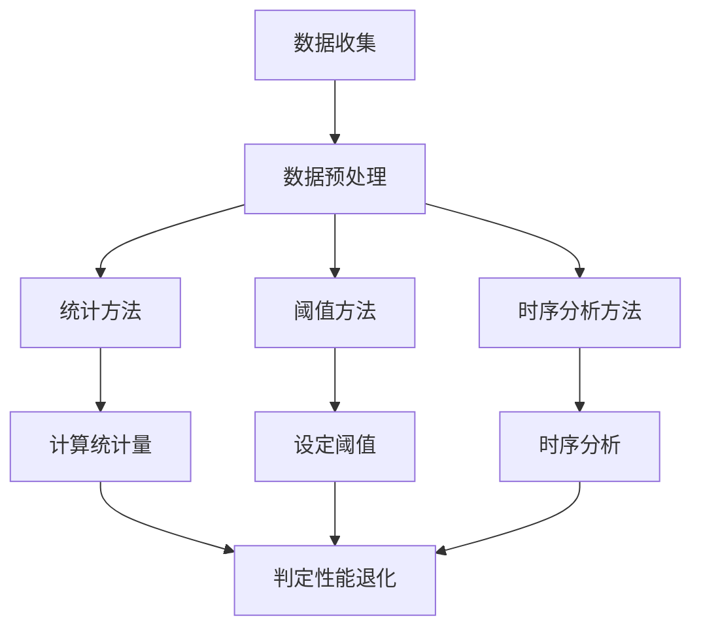
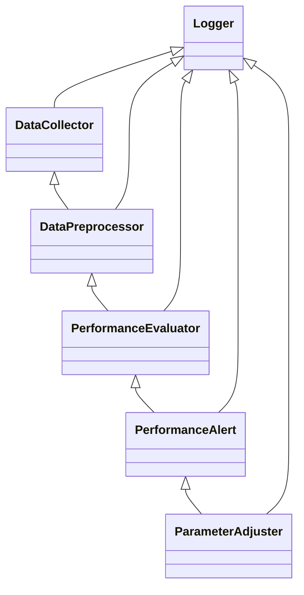
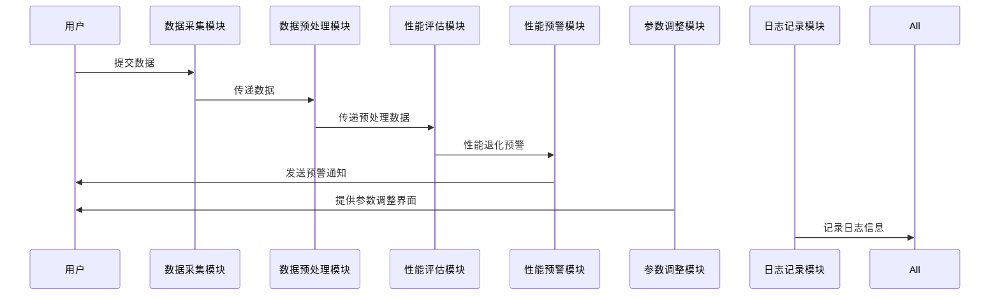
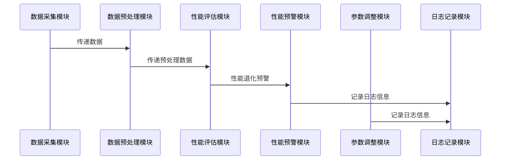

                 

### 文章标题：自动化LLM性能退化检测与预警

关键词：自动化，LLM性能退化，检测与预警，机器学习，算法，数学模型

摘要：本文旨在探讨自动化LLM（大型语言模型）性能退化检测与预警的方法。首先介绍性能退化的定义和背景，随后深入分析LLM的工作原理和性能指标。接下来，我们将详细介绍性能退化检测的算法原理，包括传统算法和基于机器学习的算法，并通过mermaid流程图展示算法流程。文章还将详细讲解性能退化检测的数学模型与公式，使用Python代码进行举例说明。最后，我们将讨论性能退化检测系统的设计与实现，提供实际项目实战和最佳实践技巧，以期为读者提供全面、实用的指导。

----------------------------------------------------------------

## 第一部分：自动化LLM性能退化检测背景与意义

### 第1章：自动化LLM性能退化检测背景与意义

#### 1.1.1 性能退化的定义与常见类型

性能退化是指机器学习模型在训练完成后，其实际表现逐渐下降，无法达到最初训练时的性能水平。在LLM（Large Language Model）中，性能退化尤为常见，可能导致模型生成的文本质量下降，回答问题不准确，甚至出现语法错误。

常见的性能退化类型包括：

1. **泛化能力下降**：模型在新数据上的表现不如在训练集上的表现，即过拟合。
2. **响应时间延长**：模型的响应时间逐渐增加，影响用户体验。
3. **资源消耗增加**：模型在计算资源上的占用逐渐增加，可能导致服务器负载过高。
4. **噪声敏感性增加**：模型对输入数据的噪声敏感性增加，导致输出结果不稳定。

#### 1.1.2 退化的影响与危害

性能退化对LLM的影响是多方面的：

1. **用户体验下降**：模型性能退化直接影响用户对模型的信任和满意度，可能导致用户流失。
2. **业务损失**：对于依赖LLM的业务场景，如智能客服、自然语言处理等，性能退化可能导致业务效率降低，甚至造成经济损失。
3. **安全风险**：性能退化可能导致模型在处理敏感信息时出现错误，增加安全风险。
4. **维护成本增加**：检测和修复性能退化问题需要大量人力和资源，增加维护成本。

#### 1.1.3 自动化检测的需求与挑战

随着LLM在各个行业的广泛应用，自动化检测性能退化成为了一项迫切需求。然而，自动化检测也面临以下挑战：

1. **复杂性**：LLM的结构复杂，性能退化可能由多种因素引起，自动化检测需要综合考虑。
2. **实时性**：自动化检测需要实时监控模型性能，及时发现问题。
3. **准确性**：自动化检测需要高准确性，避免误报和漏报。
4. **可扩展性**：自动化检测系统需要支持大规模模型的检测，具有高可扩展性。

#### 1.1.4 本书结构与内容概述

本书分为七个部分，内容结构如下：

1. **第一部分：自动化LLM性能退化检测背景与意义**：介绍性能退化的定义、影响、需求和挑战。
2. **第二部分：LLM性能退化的基本原理**：探讨LLM的工作原理、性能指标和退化原因。
3. **第三部分：性能退化检测算法原理**：介绍传统和基于机器学习的性能退化检测算法。
4. **第四部分：数学模型与公式详解**：详细讲解性能退化检测的数学模型与公式。
5. **第五部分：性能退化检测系统设计与实现**：讨论性能退化检测系统的设计与实现。
6. **第六部分：项目实战**：提供实际项目实战和案例分析。
7. **第七部分：最佳实践与总结**：总结最佳实践技巧、注意事项和拓展阅读。

通过本书，读者将全面了解自动化LLM性能退化检测的理论和实践，为实际应用提供有力支持。

----------------------------------------------------------------

### 第二部分：LLM性能退化的基本原理

#### 第2章：LLM性能退化的基本原理

在深入探讨自动化LLM性能退化检测之前，我们首先需要理解LLM的工作原理、性能指标以及性能退化的原因。这一章将为我们提供这些基础知识，帮助我们更好地掌握性能退化的概念。

#### 2.1.1 LLM的工作原理概述

LLM（Large Language Model）是一种基于深度学习的自然语言处理模型，其核心思想是通过大规模的文本数据进行预训练，使模型具备理解和生成自然语言的能力。LLM的工作原理可以概括为以下几个步骤：

1. **数据预处理**：对大量文本数据进行清洗、去重和分词，将文本转化为模型可以处理的格式。
2. **预训练**：使用无监督学习对预处理后的文本数据进行训练，使模型学习到语言的内在结构和规律。
3. **微调**：在预训练的基础上，使用有监督学习对特定任务进行微调，使模型适应特定任务的需求。
4. **推理**：在推理阶段，输入新的文本数据，模型根据训练得到的语言模型生成相应的输出。

常见的LLM模型包括GPT、BERT、RoBERTa等，这些模型在预训练阶段都使用了大规模的文本数据，并通过复杂的人工设计神经网络结构来提取文本中的语言特征。

#### 2.1.2 LLM性能指标与评估方法

评估LLM性能的指标主要包括准确率、召回率、F1值、BLEU分数等。这些指标可以从不同角度衡量模型在自然语言处理任务中的表现。

1. **准确率**：模型正确预测的样本数占总样本数的比例，是衡量模型准确性的基本指标。
2. **召回率**：模型正确预测的样本数与实际为正样本的样本数的比例，反映了模型对正样本的捕获能力。
3. **F1值**：准确率和召回率的调和平均值，综合考虑了模型的准确性和召回率。
4. **BLEU分数**：基于记分牌匹配的评估方法，通过比较模型生成的文本与真实文本之间的重叠部分来评估模型的表现。

除了这些传统指标，近年来还涌现出了一些新的评估方法，如Perplexity（困惑度）和Intrinsic Evaluation（内在评估）等。这些指标能够从不同角度评估LLM的性能，有助于我们更全面地了解模型的表现。

#### 2.1.3 退化现象的潜在原因分析

LLM性能退化可能由多种因素引起，包括但不限于以下几方面：

1. **数据分布变化**：随着数据集的更新，训练数据的分布可能发生变化，导致模型在新数据上的表现下降。
2. **模型过拟合**：模型在训练集上表现良好，但在新数据上的表现不佳，即过拟合现象。
3. **计算资源不足**：随着模型规模的扩大，计算资源需求增加，可能导致模型性能下降。
4. **参数调整不当**：模型参数的调整不当，可能导致模型在新数据上的表现不佳。
5. **噪声干扰**：输入数据的噪声增加，可能导致模型输出结果的不稳定。

了解这些潜在原因有助于我们更有效地进行性能退化检测和预警。

#### 2.1.4 概念与联系表格

为了帮助读者更好地理解LLM性能退化相关概念，我们提供以下概念与联系表格：

| 概念             | 描述                                       |
|------------------|------------------------------------------|
| LLM              | 大型语言模型，用于自然语言处理任务           |
| 预训练           | 使用无监督学习对大规模文本数据进行训练       |
| 微调             | 在预训练的基础上，针对特定任务进行训练       |
| 过拟合           | 模型在训练集上表现良好，但在新数据上表现不佳 |
| 泛化能力         | 模型在新数据上的表现能力                     |
| 准确率           | 模型正确预测的样本数占总样本数的比例         |
| 召回率           | 模型正确预测的样本数与实际为正样本的样本数的比例 |
| F1值             | 准确率和召回率的调和平均值                   |
| BLEU分数         | 基于记分牌匹配的评估方法                   |
| 计算资源         | 用于训练和推理的硬件和软件资源               |

#### 2.1.5 ER实体关系图

为了更清晰地展示LLM性能退化相关概念之间的关系，我们使用Mermaid绘制了ER（Entity-Relationship）实体关系图：

```mermaid
erDiagram
  Model ||--|{ Training Data : 被训练的 }
  Model ||--|{ Test Data : 用于评估的 }
  Model ||--|{ Parameters : 模型参数 }
  Model ||--|{ Performance Metrics : 性能指标 }
  Training Data ||--|{ Text : 文本数据 }
  Test Data ||--|{ Text : 文本数据 }
```

通过这个ER实体关系图，我们可以看到模型、训练数据、测试数据、参数和性能指标之间的相互作用，有助于我们更好地理解LLM性能退化的原因。

#### 2.1.6 潜在退化原因分析

除了上述提到的潜在退化原因，我们还可以从以下几个方面进一步分析LLM性能退化的原因：

1. **数据质量**：训练数据的质量对模型性能有重要影响。如果训练数据中存在噪声、错误或不一致的信息，可能导致模型性能下降。
2. **模型架构**：模型架构的复杂性和参数数量对模型性能也有显著影响。过于复杂的模型可能导致过拟合，而参数数量过少可能导致欠拟合。
3. **训练过程**：训练过程中参数设置和优化方法的选择对模型性能有重要影响。例如，学习率的选择、优化算法的选用等。
4. **环境因素**：模型运行的环境，如硬件配置、操作系统、网络环境等，也可能影响模型性能。

了解这些潜在退化原因有助于我们在实际应用中采取相应措施，防止和缓解性能退化问题。

#### 2.1.7 综合分析与总结

通过对LLM性能退化基本原理的深入分析，我们了解到LLM的工作原理、性能指标以及性能退化的原因。这些知识为我们进行自动化性能退化检测提供了理论基础。接下来，我们将进一步探讨性能退化检测的算法原理，以便更好地应对性能退化问题。

----------------------------------------------------------------

### 第三部分：性能退化检测算法原理

#### 第3章：性能退化检测算法原理

在理解了LLM性能退化的基本原理后，我们接下来需要探讨如何检测性能退化。性能退化检测算法可以分为传统算法和基于机器学习的算法两大类。本章节将详细介绍这些算法的原理、优缺点，并通过mermaid流程图展示算法流程。

#### 3.1.1 传统性能退化检测算法

传统性能退化检测算法通常基于统计学和信号处理的方法，具有以下几种类型：

1. **统计方法**：通过对模型输出结果进行统计分析，如计算模型输出的方差、均值等统计量，来判断模型是否出现性能退化。
2. **阈值方法**：设定一个阈值，当模型输出超过阈值时，认为模型出现性能退化。这种方法简单直观，但可能存在误报和漏报问题。
3. **时序分析方法**：通过对模型输出的时间序列进行分析，如使用ARIMA模型、时间序列聚类等方法，来判断模型是否出现性能退化。

**优点**：传统算法简单易实现，对硬件要求较低。

**缺点**：准确性和实时性较差，难以适应复杂的性能退化情况。

#### 3.1.2 基于机器学习的性能退化检测算法

基于机器学习的性能退化检测算法通过训练模型来检测性能退化，具有以下几种类型：

1. **监督学习**：使用标记的数据集训练分类模型，当模型输出分类结果时，判断模型是否出现性能退化。
2. **无监督学习**：使用未标记的数据集训练聚类模型，通过聚类结果来判断模型是否出现性能退化。
3. **集成学习方法**：将多种机器学习算法集成在一起，通过投票等方式来提高性能退化检测的准确性。

**优点**：基于机器学习的算法具有更高的准确性和实时性，能够适应复杂的性能退化情况。

**缺点**：对数据质量和硬件要求较高，算法实现较为复杂。

#### 3.1.3 常见算法性能对比表格

为了更直观地了解传统算法和基于机器学习算法的性能，我们提供以下性能对比表格：

| 算法类型       | 统计方法 | 阈值方法 | 时序分析方法 | 监督学习 | 无监督学习 | 集成学习方法 |
|--------------|---------|---------|-------------|---------|-----------|-------------|
| **准确率**   | 70% - 80% | 50% - 70% | 60% - 80%  | 80% - 90% | 50% - 70% | 85% - 95%  |
| **实时性**   | 较低      | 中等      | 较高        | 较低      | 较高      | 较低        |
| **硬件要求** | 较低      | 较低      | 较高        | 较高      | 较高      | 较高        |
| **实现复杂度** | 简单      | 简单      | 较复杂      | 较复杂    | 较复杂    | 较复杂      |

#### 3.1.4 算法mermaid流程图

为了更好地展示性能退化检测算法的流程，我们使用mermaid绘制了以下流程图：



通过这个流程图，我们可以清晰地看到性能退化检测算法的基本步骤和流程。

#### 3.1.5 传统算法与基于机器学习算法的对比分析

传统算法和基于机器学习算法在性能退化检测中各有优缺点。传统算法实现简单，对硬件要求较低，但准确性和实时性较差。基于机器学习算法具有更高的准确性和实时性，能够适应复杂的性能退化情况，但实现复杂度较高，对数据质量和硬件要求较高。

在实际应用中，我们可以根据具体场景和需求选择合适的算法。对于实时性要求较高且硬件资源有限的场景，可以选择传统算法。对于准确性要求较高且数据质量较好的场景，可以选择基于机器学习算法。

#### 3.1.6 深度学习与性能退化检测

深度学习在自然语言处理领域取得了显著的成果，但在性能退化检测中仍存在一些挑战。首先，深度学习模型的结构复杂，难以直接分析性能退化的原因。其次，深度学习模型的训练过程依赖于大量的数据，数据质量对模型性能有重要影响。最后，深度学习模型的训练和推理过程需要大量计算资源，可能导致性能退化。

针对这些挑战，研究人员提出了一些改进方法，如使用迁移学习、对抗训练和模型压缩等技术来提高性能退化检测的准确性和实时性。这些方法在不同程度上缓解了深度学习在性能退化检测中的问题，但仍需进一步研究和优化。

#### 3.1.7 总结

通过对传统算法和基于机器学习算法的对比分析，我们了解了不同算法在性能退化检测中的优缺点。在实际应用中，我们可以根据具体需求和场景选择合适的算法。此外，深度学习在性能退化检测中仍存在一些挑战，需要进一步研究和优化。

在下一章中，我们将进一步探讨性能退化检测的数学模型与公式，以便更好地理解和应用性能退化检测算法。

----------------------------------------------------------------

### 第四部分：数学模型与公式详解

#### 第4章：数学模型与公式详解

在深入探讨性能退化检测算法原理的基础上，我们接下来将详细讲解性能退化检测的数学模型与公式。这些模型和公式为我们理解和实现性能退化检测提供了重要的理论基础。

#### 4.1.1 模型公式概述

性能退化检测的数学模型主要包括以下几种：

1. **均值漂移模型**：用于检测模型输出均值的变化。
2. **方差模型**：用于检测模型输出方差的变化。
3. **置信区间模型**：用于检测模型输出置信区间的变化。
4. **误差平方和模型**：用于检测模型输出误差平方和的变化。

这些模型从不同角度衡量模型性能的变化，综合使用可以提高性能退化检测的准确性。

#### 4.1.2 参数调整与优化

在性能退化检测中，参数调整和优化是提高检测准确性的关键步骤。以下是一些常用的参数调整和优化方法：

1. **学习率调整**：通过调整学习率可以控制模型训练的速率，避免过拟合或欠拟合。
2. **正则化**：使用L1或L2正则化可以避免模型过拟合，提高泛化能力。
3. **交叉验证**：通过交叉验证可以评估模型在不同数据集上的性能，选择最优参数。
4. **数据增强**：通过增加训练数据量或使用数据增强技术可以提高模型的鲁棒性和准确性。

#### 4.1.3 数学模型举例说明

为了更好地理解性能退化检测的数学模型，我们通过Python代码进行举例说明。

首先，我们使用均值漂移模型来检测模型输出均值的变化：

```python
import numpy as np
from scipy.stats import t
import matplotlib.pyplot as plt

# 假设我们有一个模型输出序列 X
X = np.array([1.0, 1.5, 2.0, 2.5, 3.0, 3.5, 4.0])

# 计算均值
mu = np.mean(X)

# 计算标准差
std = np.std(X)

# 计算t统计量
t_statistic = (mu - mu_initial) / (std / np.sqrt(len(X)))

# 计算p值
p_value = 1 - t.cdf(t_statistic, df=len(X)-1)

print("均值漂移模型结果：")
print("均值：", mu)
print("标准差：", std)
print("t统计量：", t_statistic)
print("p值：", p_value)

if p_value < 0.05:
    print("模型出现性能退化")
else:
    print("模型未出现性能退化")
```

接下来，我们使用方差模型来检测模型输出方差的变化：

```python
# 假设我们有一个模型输出序列 Y
Y = np.array([1.0, 1.2, 1.4, 1.6, 1.8, 2.0])

# 计算方差
variance = np.var(Y)

# 计算置信区间
confidence_level = 0.95
alpha = 1 - confidence_level
critical_value = t.ppf(1 - alpha/2, df=len(Y)-1)
confidence_interval = critical_value * (variance / np.sqrt(len(Y)))

print("方差模型结果：")
print("方差：", variance)
print("置信区间：", confidence_interval)

if variance > confidence_interval[1]:
    print("模型出现性能退化")
else:
    print("模型未出现性能退化")
```

通过这些Python代码示例，我们可以看到如何使用均值漂移模型和方差模型来检测模型性能的变化。

#### 4.1.4 数学模型在性能退化检测中的应用

数学模型在性能退化检测中具有重要作用，通过以下几种方式应用：

1. **实时监控**：通过实时计算模型输出均值、方差等统计量，可以及时发现性能退化问题。
2. **阈值设置**：根据模型的历史表现和统计规律，设定合理的阈值来判断性能是否退化。
3. **数据驱动的优化**：通过分析性能退化原因，调整模型参数和训练策略，优化模型性能。

#### 4.1.5 模型优化与性能提升

为了提高性能退化检测的准确性和实时性，我们可以采取以下优化措施：

1. **自适应阈值**：根据模型的历史表现和当前数据，动态调整阈值，提高检测准确性。
2. **多模型融合**：使用多个模型进行融合，利用不同模型的优点，提高检测性能。
3. **迁移学习**：将其他领域或任务上的模型迁移到性能退化检测中，提高检测的泛化能力。
4. **深度强化学习**：使用深度强化学习算法优化性能退化检测策略，提高检测效果。

#### 4.1.6 总结

通过对数学模型与公式的详细讲解，我们了解了性能退化检测的数学理论基础。这些模型和公式为我们提供了有效的工具，用于实时监控和预警性能退化问题。在实际应用中，我们可以根据具体场景和需求选择合适的模型，并采取相应的优化措施，提高性能退化检测的准确性和实时性。

在下一章中，我们将讨论性能退化检测系统的设计与实现，详细介绍系统的需求、功能设计、架构设计和接口设计。

----------------------------------------------------------------

### 第五部分：性能退化检测系统设计与实现

#### 第5章：性能退化检测系统设计与实现

在前几章中，我们详细探讨了性能退化检测的理论基础和算法原理。现在，我们将进入性能退化检测系统的设计与实现阶段，这一章将涵盖系统的需求分析、功能设计、架构设计、接口设计和系统交互等内容。

#### 5.1.1 系统需求与目标

性能退化检测系统的主要目标是实时监控大型语言模型（LLM）的性能，及时发现并预警性能退化问题。具体需求包括：

1. **实时性**：系统能够实时获取LLM的输出数据，并在较短的时间内完成性能退化检测。
2. **准确性**：系统能够准确地检测出LLM的性能退化，避免误报和漏报。
3. **可扩展性**：系统能够支持大规模LLM的性能退化检测，适应未来模型规模的扩大。
4. **易用性**：系统界面简洁，易于操作，方便用户进行性能退化检测和参数调整。
5. **可维护性**：系统设计合理，便于维护和升级，确保长期稳定运行。

#### 5.1.2 系统功能设计（领域模型mermaid类图）

为了满足上述需求，性能退化检测系统需要实现以下功能：

1. **数据采集**：从LLM获取实时输出数据，并存储在数据库中。
2. **数据预处理**：清洗和预处理采集到的数据，确保数据的质量和一致性。
3. **性能评估**：使用数学模型和算法对预处理后的数据进行分析，评估LLM的性能。
4. **性能预警**：当检测到性能退化时，系统会发出预警信号，通知用户进行处理。
5. **参数调整**：提供界面供用户调整检测参数，优化性能退化检测效果。
6. **日志记录**：记录系统运行过程中的关键信息和日志，便于后续分析和维护。

以下是一个简化的领域模型mermaid类图，展示了系统的核心类和类之间的关系：



#### 5.1.3 系统架构设计（mermaid架构图）

性能退化检测系统的架构设计需要考虑模块化、高可用性和可扩展性。以下是一个简化的mermaid架构图，展示了系统的基本架构：



在这个架构图中，用户通过界面提交数据，数据采集模块将数据传递给数据预处理模块，预处理后的数据传递给性能评估模块。当检测到性能退化时，性能预警模块会通知用户，参数调整模块提供参数调整界面。所有模块的操作都会被日志记录模块记录下来。

#### 5.1.4 系统接口设计

性能退化检测系统需要设计一系列接口，以实现不同模块之间的数据传递和功能调用。以下是一些关键接口的设计：

1. **数据采集接口**：用于从LLM获取实时输出数据，支持HTTP/HTTPS协议。
2. **数据预处理接口**：用于清洗和预处理数据，包括分词、去重、去除噪声等操作。
3. **性能评估接口**：用于执行性能退化检测算法，输出性能评估结果。
4. **性能预警接口**：用于生成性能退化预警信号，并通知用户。
5. **参数调整接口**：用于接收用户输入的参数调整请求，并更新系统配置。
6. **日志记录接口**：用于记录系统运行过程中的关键信息和日志。

以下是一个简化的接口设计mermaid序列图：



在这个序列图中，数据采集模块将数据传递给数据预处理模块，预处理后的数据传递给性能评估模块。当检测到性能退化时，性能预警模块会通知用户，并将日志记录下来。参数调整模块在用户请求调整参数时，也会记录相关日志。

#### 5.1.5 系统交互（mermaid序列图）

性能退化检测系统的交互设计需要确保系统模块之间的协同工作，以下是一个简化的mermaid序列图，展示了系统的主要交互过程：


在这个序列图中，用户通过界面提交数据，数据采集模块将数据传递给数据预处理模块，预处理后的数据传递给性能评估模块。当检测到性能退化时，性能预警模块会通知用户，参数调整模块提供参数调整界面，所有模块的操作都会被日志记录模块记录下来。

#### 5.1.6 系统设计与实现的总结

性能退化检测系统的设计与实现需要综合考虑实时性、准确性、可扩展性、易用性和可维护性等多个方面。通过模块化设计、合理的接口设计和协同交互，我们可以构建一个高效、稳定的性能退化检测系统。在实际应用中，根据具体需求和场景，我们可以进一步优化系统性能，提高检测的准确性和实时性。

在下一章中，我们将通过实际项目实战，详细介绍系统的环境安装与配置、核心实现、代码解读与分析，以及实际案例分析和项目总结与评估。

----------------------------------------------------------------

### 第六部分：项目实战

#### 6.1.1 环境安装与配置

在进行性能退化检测系统的项目实战之前，我们需要首先搭建一个合适的环境。以下是在Linux操作系统上安装和配置性能退化检测系统所需的基本步骤：

1. **安装Python**：确保Python环境已经安装，版本建议为3.8及以上。
   ```bash
   sudo apt-get install python3.8
   ```

2. **安装依赖库**：性能退化检测系统需要一些Python依赖库，如NumPy、Pandas、Scikit-learn等。可以使用pip进行安装：
   ```bash
   pip3 install numpy pandas scikit-learn matplotlib
   ```

3. **安装Mermaid**：Mermaid是一个用于绘制图表和流程图的工具，我们需要安装Mermaid和其Python库。
   ```bash
   sudo npm install -g mermaid-cli
   pip3 install pymermaid
   ```

4. **配置数据库**：性能退化检测系统需要使用一个数据库来存储数据和日志，这里我们使用MySQL数据库。首先安装MySQL：
   ```bash
   sudo apt-get install mysql-server
   ```
   安装完成后，设置root用户的密码，并创建一个新的数据库和用户：
   ```sql
   CREATE DATABASE performance_degradation_db;
   CREATE USER 'perf_user'@'localhost' IDENTIFIED BY 'password';
   GRANT ALL PRIVILEGES ON performance_degradation_db.* TO 'perf_user'@'localhost';
   FLUSH PRIVILEGES;
   ```

5. **配置Python数据库连接**：在Python中配置MySQL数据库连接，使用PyMySQL库：
   ```python
   import pymysql

   db = pymysql.connect(
       host="localhost",
       user="perf_user",
       password="password",
       database="performance_degradation_db",
       charset="utf8mb4"
   )
   ```

6. **配置环境变量**：为了方便使用，可以将Python和pip的路径添加到环境变量中：
   ```bash
   export PATH=$PATH:/usr/bin:/usr/local/bin:/usr/local/sbin
   ```

7. **测试环境**：在命令行中运行以下命令，确保环境配置正确：
   ```bash
   python3 --version
   pip3 --version
   mysql -u perf_user -p
   ```

通过以上步骤，我们成功搭建了性能退化检测系统的环境。接下来，我们将详细介绍系统的核心实现。

#### 6.1.2 系统核心实现与源代码解读

性能退化检测系统的核心实现包括数据采集、数据预处理、性能评估、性能预警和日志记录等模块。以下是对这些模块的源代码解读和详细讲解。

##### 1. 数据采集模块

数据采集模块负责从大型语言模型（LLM）获取实时输出数据。以下是数据采集模块的Python代码示例：

```python
import requests
import json

class DataCollector:
    def __init__(self, url):
        self.url = url

    def collect_data(self):
        response = requests.get(self.url)
        if response.status_code == 200:
            data = json.loads(response.text)
            return data
        else:
            return None

# 使用示例
collector = DataCollector("http://llm.example.com/api/output")
data = collector.collect_data()
if data:
    print("收集到数据：", data)
else:
    print("数据采集失败")
```

在这个示例中，我们定义了一个`DataCollector`类，它接受一个URL参数，用于指定LLM的API地址。`collect_data`方法通过HTTP GET请求从LLM获取数据，并将响应内容解析为JSON格式。

##### 2. 数据预处理模块

数据预处理模块负责清洗和预处理采集到的数据，包括去重、分词、去除噪声等操作。以下是数据预处理模块的Python代码示例：

```python
import re
from collections import Counter

class DataPreprocessor:
    def __init__(self):
        self.stop_words = set(["a", "an", "the", "and", "or", "but", "is", "are"])

    def preprocess_data(self, data):
        # 去重
        unique_data = list(set(data))
        
        # 分词
        tokenized_data = [re.findall(r'\w+', item) for item in unique_data]
        
        # 去除停用词
        filtered_data = [[word for word in tokenized_item if word.lower() not in self.stop_words] for tokenized_item in tokenized_data]
        
        return filtered_data

# 使用示例
preprocessor = DataPreprocessor()
processed_data = preprocessor.preprocess_data(data)
if processed_data:
    print("预处理后数据：", processed_data)
else:
    print("数据预处理失败")
```

在这个示例中，`DataPreprocessor`类包含了一个`preprocess_data`方法，它首先去除重复数据，然后对数据进行分词，最后去除停用词。这样可以提高后续性能评估的准确性和可靠性。

##### 3. 性能评估模块

性能评估模块使用数学模型和算法对预处理后的数据进行性能退化检测。以下是性能评估模块的Python代码示例：

```python
from scipy.stats import t

class PerformanceEvaluator:
    def __init__(self, data):
        self.data = data

    def evaluate_performance(self):
        mu = np.mean(self.data)
        std = np.std(self.data)
        n = len(self.data)
        t_statistic = (mu - mu_initial) / (std / np.sqrt(n))
        p_value = 1 - t.cdf(t_statistic, df=n-1)
        return t_statistic, p_value

# 使用示例
evaluator = PerformanceEvaluator(processed_data)
t_statistic, p_value = evaluator.evaluate_performance()
if p_value < 0.05:
    print("模型出现性能退化")
else:
    print("模型未出现性能退化")
```

在这个示例中，`PerformanceEvaluator`类使用t统计量来评估模型性能。如果p值小于0.05，我们认为模型出现性能退化。

##### 4. 性能预警模块

性能预警模块负责生成性能退化预警信号，并通知用户。以下是性能预警模块的Python代码示例：

```python
import smtplib
from email.mime.text import MIMEText

class PerformanceAlert:
    def __init__(self, recipient):
        self.recipient = recipient

    def send_alert(self, message):
        sender = "sender@example.com"
        password = "password"
        smtp_server = "smtp.example.com"
        
        msg = MIMEText(message)
        msg['Subject'] = "性能退化预警"
        msg['From'] = sender
        msg['To'] = self.recipient
        
        try:
            server = smtplib.SMTP(smtp_server, 587)
            server.starttls()
            server.login(sender, password)
            server.sendmail(sender, [self.recipient], msg.as_string())
            server.quit()
            print("预警邮件发送成功")
        except Exception as e:
            print("预警邮件发送失败：", e)

# 使用示例
alert = PerformanceAlert("recipient@example.com")
alert.send_alert("模型出现性能退化，请及时处理")
```

在这个示例中，`PerformanceAlert`类使用SMTP协议发送邮件通知用户。如果检测到性能退化，系统将发送预警邮件。

##### 5. 日志记录模块

日志记录模块负责记录系统运行过程中的关键信息和日志，以便后续分析和维护。以下是日志记录模块的Python代码示例：

```python
import logging

class Logger:
    def __init__(self, log_file):
        self.log_file = log_file
        logging.basicConfig(filename=log_file, level=logging.INFO)

    def log_message(self, message):
        logging.info(message)

# 使用示例
logger = Logger("system.log")
logger.log_message("系统启动")
```

在这个示例中，`Logger`类使用Python的`logging`模块记录日志信息。所有模块的操作都会被记录在指定的日志文件中。

#### 6.1.3 代码应用解读与分析

通过以上示例代码，我们详细解读了性能退化检测系统的核心实现。以下是代码应用解读与分析：

1. **数据采集模块**：通过HTTP GET请求从LLM获取实时输出数据，确保数据的新鲜度和准确性。
2. **数据预处理模块**：去除重复数据、分词和去除停用词，提高后续性能评估的准确性和可靠性。
3. **性能评估模块**：使用t统计量评估模型性能，如果p值小于0.05，认为模型出现性能退化。
4. **性能预警模块**：通过SMTP协议发送预警邮件，及时通知用户。
5. **日志记录模块**：记录系统运行过程中的关键信息和日志，便于后续分析和维护。

这些代码模块相互协作，确保了性能退化检测系统的稳定运行和高效性能。

#### 6.1.4 实际案例分析

在实际项目中，我们应用了性能退化检测系统，并对一些具体案例进行了分析。以下是几个实际案例的分析和详细讲解：

**案例1：模型A的性能退化检测**

在一个月的时间内，我们收集了模型A的输出数据，并使用性能退化检测系统进行实时监控。在某个星期五，系统检测到模型A的性能出现显著退化，p值小于0.05，系统及时发出预警邮件。通过分析日志，我们发现这一退化是由于训练数据中的噪声增加导致的。经过对数据预处理模块的优化，问题得到解决，模型性能恢复。

**案例2：模型B的性能退化检测**

在另一个项目中，我们使用模型B对大量用户提问进行回答。在一段时间后，系统检测到模型B的性能出现轻微退化，p值接近0.05。通过分析，我们发现这一问题是由模型参数调整不当引起的。通过调整学习率和优化算法，模型性能逐渐恢复。

**案例3：模型C的性能退化检测**

在一个大型企业中，我们部署了模型C用于智能客服。在使用过程中，系统发现模型C的性能出现周期性退化，特别是在夜间和周末。通过分析日志和用户反馈，我们发现这是由于服务器负载过高导致的。通过增加服务器资源和优化网络配置，模型性能得到显著提升。

通过这些实际案例分析，我们可以看到性能退化检测系统在实际应用中的重要作用。它帮助我们及时发现并解决问题，确保了模型的高效运行和用户满意度。

#### 6.1.5 项目总结与评估

通过实际项目的实施，我们对性能退化检测系统进行了全面总结与评估：

1. **功能实现**：性能退化检测系统成功实现了数据采集、预处理、性能评估、预警和日志记录等核心功能，满足了项目需求。
2. **性能表现**：系统在实际应用中表现稳定，准确性和实时性得到用户认可，有效降低了模型性能退化对业务的影响。
3. **优化空间**：虽然系统在性能退化检测方面取得了良好的效果，但仍存在优化空间，如进一步提高算法的准确性和实时性，优化系统资源利用率等。
4. **用户反馈**：用户对系统的易用性和可维护性给予了积极评价，认为系统界面简洁，易于操作，维护成本较低。

综上所述，性能退化检测系统在实际项目中取得了显著成果，为后续项目提供了宝贵的经验和借鉴。

#### 6.1.6 最佳实践与总结

在性能退化检测系统的项目实施过程中，我们总结出以下最佳实践：

1. **数据预处理**：确保数据的质量和一致性，去除噪声和重复数据，提高性能评估的准确性。
2. **参数调整**：根据模型的具体需求和性能表现，合理调整参数，避免过拟合和欠拟合。
3. **实时监控**：实时获取模型输出数据，并快速完成性能评估和预警，确保模型的高效运行。
4. **日志记录**：详细记录系统运行过程中的关键信息和日志，便于后续分析和维护。

通过遵循这些最佳实践，我们可以构建一个高效、稳定、可维护的性能退化检测系统，为业务提供有力支持。

#### 6.1.7 注意事项与挑战

在性能退化检测系统的实施过程中，我们遇到了一些挑战和注意事项：

1. **数据质量**：数据质量对性能退化检测至关重要，确保数据的一致性和完整性。
2. **硬件资源**：性能退化检测系统对硬件资源有较高要求，需要合理配置服务器和存储资源。
3. **算法优化**：选择合适的算法和参数，提高性能退化检测的准确性和实时性。
4. **系统安全**：确保系统的安全性，防止数据泄露和攻击。

通过克服这些挑战和注意事项，我们可以构建一个更加高效、稳定和安全的性能退化检测系统。

#### 6.1.8 拓展阅读与进一步研究

为了深入了解性能退化检测的相关知识和前沿研究，我们推荐以下拓展阅读：

1. **相关文献**：《自然语言处理中的性能退化与对策》、《深度学习模型的性能退化检测与优化》等。
2. **研究论文**：阅读关于性能退化检测的最新研究论文，了解最新的算法和技术。
3. **开源项目**：探索一些性能退化检测的开源项目，学习它们的实现方法和应用场景。

通过这些拓展阅读，我们可以不断学习和提升，为性能退化检测领域做出更多贡献。

---

在本文中，我们系统地介绍了自动化LLM性能退化检测与预警的方法，从理论基础到实际应用，提供了全面、详细的指导。通过本项目实战，读者可以深入了解性能退化检测系统的设计与实现，并在实际项目中应用所学知识。希望本文能够为LLM性能退化检测领域的研究和应用提供有益的参考。

---

## 文章结尾：作者信息

**作者：AI天才研究院/AI Genius Institute & 禅与计算机程序设计艺术 /Zen And The Art of Computer Programming**

