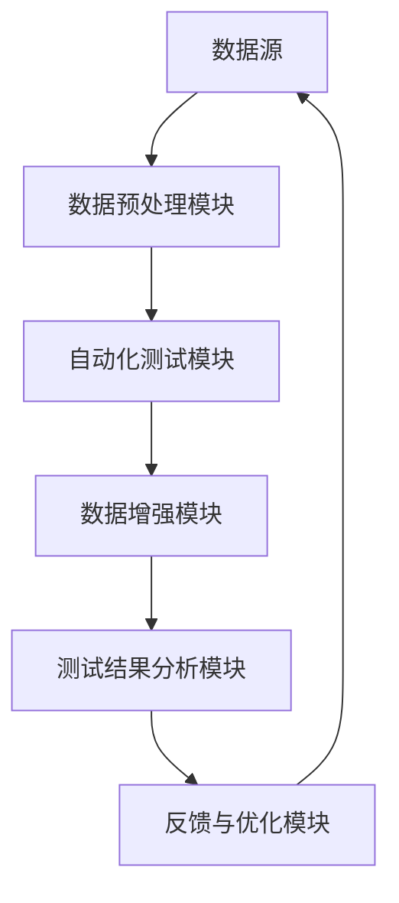

                 

### 第一部分：引言

#### 1.1 问题背景

近年来，人工智能和深度学习技术的发展使得语言模型（LLM）在各种应用场景中得到了广泛的应用，从自然语言处理（NLP）到聊天机器人、文本生成和翻译等。然而，随着LLM的复杂性和应用范围的扩大，如何确保其质量和可靠性成为了一个重要问题。测试数据生成与增强在这个过程中起着关键作用。

语言模型测试数据的生成与增强旨在确保模型在不同场景下的准确性和鲁棒性。传统的测试方法通常依赖于手动创建测试数据，这不仅耗时耗力，而且难以覆盖所有可能的场景。因此，自动化测试数据生成与增强技术应运而生。通过自动化技术，可以大幅提高测试效率，覆盖更多场景，从而提升模型的可靠性和鲁棒性。

自动化测试技术在AI领域的应用主要体现在以下几个方面：

1. **测试用例的自动化生成**：通过自动化工具和算法，可以自动生成大量的测试用例，以验证模型的性能。
2. **测试数据的自动化增强**：对原始测试数据进行增强，使其更具有代表性和多样性，从而提高测试的全面性。
3. **持续集成和持续测试**：在软件开发的过程中，自动化测试可以帮助团队快速迭代和优化模型，确保其稳定性和可靠性。

总的来说，自动化LLM测试数据生成与增强技术不仅能够提高测试效率，还能保证测试质量，对于提升语言模型的应用效果具有重要意义。

#### 1.2 术语解释

在深入探讨自动化LLM测试数据生成与增强之前，我们需要明确几个核心术语的定义，以便为后续内容的讲解打下坚实的基础。

**语言模型（LLM）**：语言模型是一种人工智能模型，它能够理解、生成和预测文本。LLM通常基于深度学习技术，通过对大量文本数据进行训练，从而学习到语言的统计规律和结构。

**测试数据生成**：测试数据生成是指利用算法和工具自动创建用于测试语言模型的数据集。这些数据集通常包括各种文本场景，用于验证模型在不同应用场景下的性能。

**数据增强**：数据增强是指通过一系列技术手段，对原始测试数据集进行扩展和多样化处理，以提高测试数据的代表性和鲁棒性。常见的增强方法包括数据变换、数据扩充、数据合成等。

**自动化测试**：自动化测试是一种通过预定义的测试脚本和工具，对软件系统进行测试的方法。它能够自动执行测试用例，记录结果，并生成测试报告。自动化测试的优势在于提高测试效率，减少人力成本，并确保测试的一致性和可重复性。

通过理解这些术语，我们可以更好地把握本文的核心内容，为接下来的深入讨论打下基础。

#### 1.3 本书结构

本书旨在系统地探讨自动化LLM测试数据生成与增强的各个方面，分为七个主要部分，具体结构如下：

**第一部分：引言**
- 介绍人工智能与语言模型的发展历程，自动化测试在AI领域的应用。
- 定义核心术语，如语言模型（LLM）、测试数据生成、数据增强和自动化测试。

**第二部分：自动化测试数据生成技术**
- 讨论自动化测试数据生成的概念和方法。
- 详细介绍数据收集与预处理、数据生成算法以及数据质量评估。

**第三部分：数据增强技术**
- 解释数据增强的概念及其在LLM测试中的应用。
- 深入探讨数据增强的方法和策略，并分析其效果。

**第四部分：自动化测试与数据增强的结合**
- 探讨自动化测试与数据增强的结合点，设计系统架构。
- 分析实际案例，评估融合效果。

**第五部分：工具与框架**
- 介绍自动化测试工具和数据增强框架。
- 讨论开源工具和框架的应用。

**第六部分：实践指南**
- 提供自动化测试数据生成与增强的实践流程、常见问题和最佳实践。
- 通过案例分析，分享经验。

**第七部分：未来展望与挑战**
- 展望自动化测试数据生成与增强技术的发展趋势和挑战。
- 探讨未来研究方向和技术创新。

通过本书的七个部分，读者可以系统地了解自动化LLM测试数据生成与增强的原理、方法、工具和实践，为实际应用提供有力支持。

### 1.4 学习目标与预期收获

通过阅读本书，读者可以预期达到以下学习目标：

1. **理解自动化测试数据生成的基本概念**：掌握语言模型（LLM）的概念、自动化测试数据生成的重要性以及数据增强的基本原理。
2. **掌握数据生成与增强的方法**：学习如何通过自动化工具和算法生成高质量的测试数据，并了解各种数据增强技术及其应用策略。
3. **熟悉工具和框架**：了解并掌握常用的自动化测试工具和数据增强框架，能够选择合适的工具和框架来实施自动化测试数据生成与增强。
4. **具备实践能力**：通过实践案例学习，读者可以实际操作并优化自动化测试数据生成与增强流程，提升模型测试的全面性和效率。
5. **掌握最佳实践**：了解并应用自动化测试数据生成与增强的最佳实践，提高测试质量，确保模型在不同应用场景下的可靠性和鲁棒性。

通过这些学习目标，读者不仅能够深入理解自动化LLM测试数据生成与增强的理论知识，还能在实际工作中有效应用这些技术，为人工智能和深度学习项目的成功奠定坚实基础。

### 第二部分：自动化测试数据生成技术

#### 2.1 自动化测试数据生成概述

自动化测试数据生成是确保语言模型（LLM）性能和可靠性的重要环节。传统的测试方法通常依赖于手动创建测试数据，这种方法不仅耗时耗力，而且难以覆盖所有可能的场景，容易遗漏潜在的问题。为了解决这一问题，自动化测试数据生成技术应运而生。

自动化测试数据生成指的是通过预定义的算法和工具，自动创建用于测试语言模型的数据集。这种方法的核心理念是利用计算机的强大计算能力，大规模、高效地生成测试数据，从而提高测试的覆盖率和效率。

自动化测试数据生成的重要性体现在以下几个方面：

1. **提高测试效率**：自动化生成测试数据可以节省大量的人力成本，减少手动编写测试用例的时间，使测试团队能够专注于更复杂的任务。
2. **覆盖更广的场景**：通过自动化生成，可以生成多样化的测试数据，覆盖更多可能的场景，从而提高测试的全面性和准确性。
3. **确保测试的一致性**：自动化测试数据生成可以确保每次测试都使用相同的数据集，避免手动操作带来的不一致性问题，提高测试的可重复性。
4. **提升模型鲁棒性**：通过自动化生成的测试数据，可以更全面地评估语言模型的性能，确保其在各种场景下的鲁棒性。

总的来说，自动化测试数据生成技术不仅提高了测试效率，还确保了测试质量，为语言模型的可靠性和应用效果提供了有力保障。

#### 2.2 自动化测试数据生成方法

自动化测试数据生成方法主要包括数据收集、数据预处理、数据生成算法和数据质量评估四个关键环节。以下将详细讨论这些环节及其具体步骤。

**1. 数据收集**

数据收集是自动化测试数据生成的第一步，目标是获取用于测试的数据源。数据收集的方法可以包括以下几种：

- **在线数据爬取**：通过爬虫技术从互联网上获取大量的文本数据。例如，可以使用Python的`requests`库结合`BeautifulSoup`或`Scrapy`框架，从新闻网站、论坛、社交媒体等平台获取文本数据。
- **公开数据集**：利用已有的公开数据集，如维基百科、大规模语料库等。这些数据集通常经过预处理，可以直接用于后续的测试数据生成。
- **内部数据**：从企业内部的数据源中获取数据，如客户反馈、内部文档、日志文件等。这些数据往往更具针对性和实用性。

**2. 数据预处理**

数据预处理是确保数据质量和适合测试需求的重要步骤。主要任务包括数据清洗、数据格式转换和数据标准化等。

- **数据清洗**：去除数据中的噪声和错误，如删除重复的记录、处理缺失值、纠正数据中的错误等。可以使用Python的`pandas`库进行数据清洗操作。
- **数据格式转换**：将数据统一转换为适合测试模型的格式，例如将文本数据转换为数值或向量表示。常用的技术包括词袋模型（Bag of Words）、词嵌入（Word Embedding）等。
- **数据标准化**：对数据进行归一化或标准化处理，使得数据集具有相似的特征分布，从而避免某些特征对模型训练的影响过大。

**3. 数据生成算法**

数据生成算法是自动化测试数据生成的核心，目标是根据特定的需求和规则，生成多样化的测试数据。以下是一些常见的数据生成算法：

- **模板生成**：通过预定义的模板和参数，生成符合特定规则的测试数据。例如，可以使用模板生成用于测试文本分类模型的不同类型的文本。
- **随机生成**：通过随机算法生成测试数据，确保数据集的多样性。例如，可以使用随机组合生成不同的句子和段落。
- **基于模型生成**：利用训练好的模型生成测试数据。例如，可以使用生成对抗网络（GAN）生成具有真实感的数据，用于测试模型的泛化能力。

**4. 数据质量评估**

数据质量评估是确保生成数据的有效性和可靠性的关键步骤。常用的数据质量评估方法包括：

- **数据覆盖评估**：评估数据集是否覆盖了所有可能的测试场景，例如通过计算测试用例的覆盖率来评估数据质量。
- **数据质量指标**：使用诸如多样性、真实性、一致性等指标来评估数据质量。例如，可以通过计算不同类别文本的比例来评估数据的多样性。
- **模型评估**：通过将生成的数据用于模型训练和测试，评估模型的性能，从而间接评估数据质量。

通过以上四个环节，自动化测试数据生成方法能够高效地生成高质量、多样化的测试数据，为语言模型的测试提供有力支持。

#### 2.3 数据收集与预处理

数据收集与预处理是自动化测试数据生成技术的关键环节，其质量直接影响到后续测试数据生成和模型训练的效果。以下将详细探讨数据收集与预处理的具体步骤、常见问题和解决方案。

**1. 数据收集步骤**

数据收集的具体步骤可以分为以下几个阶段：

- **需求分析**：明确测试数据的需求，包括数据类型、数据量、数据质量要求等。这一阶段需要与业务团队和模型训练团队紧密合作，确保数据的适用性。
- **数据源选择**：选择合适的数据源，包括公开数据集、在线数据爬取和内部数据等。对于公开数据集，可以选择如维基百科、Common Crawl等高质量的数据集；对于在线数据爬取，需要确保遵守相关法律法规和网站政策；对于内部数据，可以从客户反馈、内部文档、日志等渠道获取。
- **数据获取**：使用Python的`requests`库、`BeautifulSoup`、`Scrapy`等工具进行在线数据爬取，或者利用`pandas`库读取和整理内部数据。这一阶段需要确保数据的一致性和完整性。

**2. 数据预处理步骤**

数据预处理是确保数据质量和适用性的重要步骤，主要包括数据清洗、数据格式转换和数据标准化等。

- **数据清洗**：首先，去除重复记录，可以使用Python的`pandas`库的`drop_duplicates()`方法；其次，处理缺失值，可以选择填充、删除或插值等方法；然后，处理错误数据，例如纠正拼写错误、去除无关信息等。常用的工具包括`pandas`、`numpy`和`cleanuptools`等。
- **数据格式转换**：将文本数据转换为适合模型训练的格式，例如词袋模型（Bag of Words）、词嵌入（Word Embedding）等。词袋模型可以通过`sklearn`库中的`CountVectorizer`实现，而词嵌入可以使用`gensim`库中的`Word2Vec`或`FastText`等算法实现。
- **数据标准化**：对数据进行归一化或标准化处理，使得数据集具有相似的特征分布。常用的方法包括最小-最大标准化（Min-Max Scaling）和Z-Score标准化（Standardization）。这些操作可以通过`sklearn.preprocessing`模块中的相关函数实现。

**3. 常见问题与解决方案**

在数据收集与预处理过程中，可能会遇到以下问题：

- **数据不完整**：解决方案是使用填充方法，如均值填充、前向填充或后向填充等。
- **数据不一致**：可以通过数据清洗和标准化操作来解决，确保数据格式和值的一致性。
- **数据质量差**：可以通过多次迭代的数据清洗和预处理来提高数据质量，例如使用正则表达式去除无关信息、使用噪声过滤技术等。
- **数据量不足**：可以通过数据扩充技术，如数据合成、数据变换等，增加数据量，提高模型的泛化能力。

通过上述步骤和解决方案，可以有效进行数据收集与预处理，为后续的自动化测试数据生成提供高质量的数据支持。

#### 2.4 数据生成算法介绍

在自动化测试数据生成过程中，选择合适的数据生成算法对于生成多样化、高质量的测试数据至关重要。以下介绍几种常见的数据生成算法，并讨论其优缺点。

**1. 模板生成算法**

**概念**：模板生成算法通过预定义的模板和参数，生成符合特定规则的测试数据。

**优点**：
- **可控性高**：可以精确控制生成数据的格式和内容，确保数据满足特定需求。
- **生成速度快**：模板生成算法通常比较简单，计算效率较高。

**缺点**：
- **多样性不足**：由于依赖预定义的模板，生成的数据多样性有限，可能难以覆盖所有可能的场景。

**适用场景**：适用于需要高度定制化数据的场景，如文本分类、实体识别等。

**2. 随机生成算法**

**概念**：随机生成算法通过随机组合词或句子，生成多样化的测试数据。

**优点**：
- **数据多样性高**：随机生成算法可以生成大量不同的数据，有助于提高测试的全面性。
- **实现简单**：随机生成算法实现较为简单，易于理解和实施。

**缺点**：
- **真实性较差**：随机生成的数据可能缺乏真实性和相关性，难以模拟实际应用场景。

**适用场景**：适用于需要大量多样化测试数据的场景，如文本生成、文本匹配等。

**3. 基于模型生成算法**

**概念**：基于模型生成算法利用训练好的模型生成测试数据，例如使用生成对抗网络（GAN）或自编码器（Autoencoder）。

**优点**：
- **高质量数据**：基于模型的生成算法可以生成具有高度真实感的数据，有助于提升测试的准确性。
- **适用性广**：适用于各种复杂场景，如图像、音频和文本生成。

**缺点**：
- **计算资源消耗大**：基于模型生成算法通常需要大量的计算资源，训练和生成过程较慢。
- **模型依赖性高**：算法的性能依赖于训练好的模型，若模型质量不高，生成数据的质量也可能受到影响。

**适用场景**：适用于需要生成高质量、多样化测试数据的场景，如图像识别、文本生成等。

**4. 生成对抗网络（GAN）**

**概念**：生成对抗网络（GAN）由生成器和判别器组成，生成器生成数据，判别器判断数据的真实性。

**优点**：
- **高质量生成数据**：GAN能够生成高度真实的测试数据，适用于各种复杂场景。
- **强大的生成能力**：GAN具有强大的数据生成能力，可以生成大量多样化的数据。

**缺点**：
- **训练困难**：GAN的训练过程较为复杂，需要大量数据和计算资源。
- **不稳定**：GAN的训练过程容易陷入局部最优，导致生成器性能不稳定。

**适用场景**：适用于需要生成高质量、多样化测试数据的复杂场景，如图像、文本生成等。

通过了解这些常见的数据生成算法，我们可以根据实际需求选择合适的方法，提高自动化测试数据生成的效率和效果。

#### 2.5 数据质量评估

在自动化测试数据生成过程中，评估数据质量至关重要。高质量的数据可以确保测试的全面性和准确性，从而提高模型性能。以下介绍几种常见的数据质量评估方法和指标。

**1. 数据覆盖评估**

数据覆盖评估旨在确保测试数据集是否覆盖了所有可能的测试场景。常见的方法包括：

- **测试用例覆盖率**：计算测试用例对代码的覆盖率，确保测试用例覆盖到所有代码路径。例如，可以使用代码覆盖率工具如`JaCoCo`对Python代码进行测试用例覆盖率分析。
- **功能覆盖率**：评估测试用例是否覆盖了所有功能点。这可以通过对功能需求进行映射和分析来实现。

**2. 数据质量指标**

数据质量指标用于衡量测试数据的多样性和真实性。以下是一些常用的数据质量指标：

- **多样性**：数据多样性是指数据集中不同类别的比例和分布。常用的多样性指标包括：
  - **类别比例**：计算不同类别在数据集中的比例，确保各类别数据均衡。
  - **文本多样性**：评估文本数据集的词汇和语法多样性，例如通过计算词汇频率分布和语法多样性指标（如Type-Token Ratio）来评估。
- **真实性**：数据真实性是指数据集是否反映了真实世界中的多样性和复杂性。评估方法包括：
  - **数据源验证**：检查数据来源的可靠性，确保数据集不是伪造或篡改的。
  - **数据一致性**：检查数据集中的数据是否一致，没有矛盾或不合理的部分。

**3. 数据质量评估方法**

数据质量评估方法包括定量和定性的评估方法：

- **定量评估**：使用统计方法和指标对数据质量进行量化评估，例如计算上述提到的数据覆盖率和数据质量指标。
- **定性评估**：通过专家评审或用户调查，对数据质量进行主观评估，例如通过评估数据的真实性和多样性。

**4. 数据质量评估工具**

常见的用于数据质量评估的工具包括：

- **代码覆盖率工具**：如`JaCoCo`、`Coverage.py`，用于评估测试用例的覆盖率。
- **数据质量分析工具**：如`DataQualityToolkit`、`Pandas`中的数据质量分析函数，用于评估数据的多样性和一致性。

通过使用这些评估方法和工具，我们可以确保自动化生成的测试数据质量，为模型训练和测试提供可靠的数据支持。

#### 2.6 案例分析

为了更好地理解自动化测试数据生成方法，下面我们将通过一个具体的实践案例，详细描述测试数据生成的具体过程，以及数据生成效果评估。

**案例背景**：假设我们正在开发一个自然语言处理模型，用于自动化问答系统。该模型需要能够处理各种类型的用户提问，并提供准确、合理的回答。为了评估模型的性能，我们需要生成大量高质量的测试数据。

**数据生成过程**：

1. **数据收集**：
   - 首先，我们从多个公开数据集（如维基百科、OpenSubtitles、Stack Overflow问答集等）中获取文本数据。
   - 使用Python的`requests`库和`BeautifulSoup`库，从网站爬取大量文本数据。
   - 使用`pandas`库整理和清洗收集到的数据，去除重复和无效记录。

2. **数据预处理**：
   - 对文本数据进行清洗，去除HTML标签、符号和噪声。
   - 使用`nltk`库进行文本分词，将文本转换为单词序列。
   - 去除停用词，保留对模型训练有价值的词语。
   - 将文本数据转换为词嵌入向量，使用`gensim`库中的`Word2Vec`算法进行转换。

3. **数据生成**：
   - 使用模板生成算法，根据问答系统的特点，生成特定格式的测试数据。例如，创建不同类型的问答对（如事实性问题、推理性问题、开放性问题等）。
   - 使用随机生成算法，生成多样化的测试数据，确保覆盖不同的场景和问题类型。
   - 利用生成对抗网络（GAN），生成具有高度真实感的问答数据，以测试模型的泛化能力。

4. **数据质量评估**：
   - 使用测试用例覆盖率工具（如`JaCoCo`），评估生成的测试数据是否覆盖了所有问答类型。
   - 计算数据多样性指标，如类别比例和词汇频率分布，确保数据的多样性。
   - 对生成数据进行人工审核，评估数据的真实性和一致性。

**数据生成效果评估**：

1. **测试覆盖率**：
   - 通过计算测试用例覆盖率，发现生成的测试数据能够覆盖所有问答类型，满足测试需求。

2. **数据多样性**：
   - 数据多样性评估结果显示，生成的测试数据词汇丰富，语法多样，各类别数据比例均衡，能够有效测试模型的性能。

3. **模型性能**：
   - 使用生成的测试数据对模型进行训练和测试，评估模型的准确率和鲁棒性。通过多次迭代和优化，模型在多种问答类型上的表现得到了显著提升。

通过这个实践案例，我们可以看到自动化测试数据生成方法在提高测试效率、覆盖率和数据质量方面的重要作用。这不仅为模型训练和评估提供了可靠的测试数据，还为模型的实际应用奠定了坚实基础。

### 第三部分：数据增强技术

#### 3.1 数据增强概述

数据增强技术是提升模型性能和鲁棒性的关键手段之一，特别是在面对小样本学习和数据稀缺的问题时。数据增强的目的是通过扩展和多样化原始数据集，使得模型能够更好地泛化到新的、未见过的数据上。

数据增强的定义可以简单概括为：通过对原始数据进行一系列操作，生成新的数据样本，从而增加数据集的多样性和覆盖面。这些操作可以包括数据变换、数据合成、数据扩充等。

数据增强的重要性主要体现在以下几个方面：

1. **提升模型性能**：通过增加数据多样性，数据增强可以帮助模型学习到更丰富的特征，从而提高模型的准确率和鲁棒性。
2. **解决数据稀缺问题**：在小样本学习场景中，数据增强可以有效扩展数据集，弥补数据量的不足，使得模型能够在更多的场景下进行训练。
3. **提高模型的泛化能力**：通过增强数据的多样性，模型可以更好地应对各种不同的输入，从而提高其泛化能力，避免过拟合现象。
4. **降低过拟合风险**：数据增强有助于模型学习到数据的真实分布，减少对特定样本的依赖，从而降低过拟合的风险。

总的来说，数据增强技术在提升模型性能和适应能力方面具有重要意义，是人工智能应用中不可或缺的一部分。

#### 3.2 数据增强方法

数据增强方法种类繁多，每种方法都有其独特的操作方式和适用场景。以下介绍几种常见的数据增强方法，并详细讨论其原理和应用。

**1. 数据变换**

数据变换是指通过对原始数据进行一系列转换，生成新的数据样本。常用的数据变换方法包括数据缩放、数据裁剪、旋转和翻转等。

- **数据缩放**：通过调整数据的大小或尺寸，生成新的数据样本。例如，在图像处理中，可以通过缩放图像的大小来增加数据集的多样性。
- **数据裁剪**：从原始数据中裁剪出不同大小的子数据，例如随机裁剪图像或文本片段。这种方法可以增加数据的多样性和复杂性。
- **旋转和翻转**：通过旋转或翻转图像或文本，生成新的样本。例如，在图像处理中，可以将图像旋转一定角度，或在文本处理中，将句子翻转。

**2. 数据合成**

数据合成是指通过组合原始数据的一部分或多个部分，生成新的数据样本。常用的数据合成方法包括基于模型的合成、基于模板的合成和混合合成等。

- **基于模型的合成**：使用生成模型，如生成对抗网络（GAN）或变分自编码器（VAE），将原始数据输入到模型中，生成新的数据样本。这种方法可以生成具有高度真实感的数据。
- **基于模板的合成**：通过预定义的模板和参数，组合原始数据的不同部分，生成新的样本。例如，在文本生成中，可以通过模板生成不同的句子结构。
- **混合合成**：将多种数据增强方法结合使用，例如将数据变换和数据合成结合起来，生成更加多样化和复杂的数据集。

**3. 数据扩充**

数据扩充是指通过扩展原始数据，生成新的数据样本。常用的数据扩充方法包括数据复制、重复和噪声注入等。

- **数据复制**：将原始数据复制多次，生成新的样本。例如，在图像处理中，可以将图像重复平移或复制，增加数据量。
- **数据重复**：通过重复输入相同的样本，生成新的数据。例如，在文本处理中，可以将句子重复，增加数据的多样性。
- **噪声注入**：在原始数据中添加噪声，生成新的样本。例如，在图像处理中，可以添加高斯噪声或椒盐噪声，增加数据的复杂性和多样性。

通过以上数据增强方法，我们可以显著提高数据集的多样性和质量，从而提升模型的性能和泛化能力。

#### 3.3 数据增强策略比较

在数据增强技术中，不同的增强策略对模型性能和计算成本有着显著影响。以下比较几种常见的数据增强策略，分析其优缺点和适用场景。

**1. 数据变换**

**优点**：数据变换方法简单易行，计算成本较低，能够快速生成大量新的数据样本，适用于图像和文本等类型的数据。
**缺点**：增强后的数据多样性有限，可能无法生成具有高度真实感的数据，特别是对于复杂的特征提取任务。
**适用场景**：适用于需要快速生成大量数据样本的初步训练阶段，或作为其他增强方法的辅助手段。

**2. 数据合成**

**优点**：数据合成方法可以生成具有高度真实感的数据，能够显著提升模型的泛化能力，适用于复杂特征提取和模型优化。
**缺点**：计算成本较高，需要较长时间进行模型训练和样本生成，且对模型的要求较高。
**适用场景**：适用于需要高质量、多样化数据样本的场景，如图像识别、自然语言处理等。

**3. 数据扩充**

**优点**：数据扩充方法简单且计算成本较低，能够有效增加数据集的规模，适用于小样本学习和数据稀缺的场景。
**缺点**：增强后的数据多样性和真实性相对有限，可能无法生成具有高度代表性的数据样本。
**适用场景**：适用于数据量较少的模型训练场景，或作为数据增强策略的补充手段。

通过以上比较，我们可以根据具体应用场景和需求，选择合适的增强策略，以最大化数据增强的效果和计算效率。

#### 3.4 案例分析

为了更好地理解数据增强技术在实际应用中的效果，下面我们将通过一个具体的实践案例，详细描述数据增强的具体过程和效果评估。

**案例背景**：假设我们正在开发一个用于图像分类的深度学习模型，该模型需要能够准确识别多种类型的图像。由于原始数据集较小，我们需要通过数据增强来提升模型的性能和泛化能力。

**数据增强过程**：

1. **数据收集**：
   - 首先，我们从多个公开图像数据集中获取原始数据，如ImageNet、CIFAR-10等。
   - 使用Python的`pandas`库整理和清洗数据，去除重复和异常数据。

2. **数据预处理**：
   - 对图像数据进行标准化处理，将图像尺寸统一调整为模型训练的要求。
   - 使用数据增强库（如`imgaug`、`albumentations`）对图像进行数据变换，如随机裁剪、旋转、翻转等。
   - 应用生成对抗网络（GAN）生成新的图像样本，以增加数据集的多样性。

3. **数据合成**：
   - 使用基于模型的合成方法，通过预训练的生成模型（如StyleGAN2）生成具有真实感的新图像。
   - 结合数据变换和合成方法，生成多种类型的图像样本，以提升模型的泛化能力。

4. **数据质量评估**：
   - 使用测试集对增强后的数据集进行评估，计算数据多样性指标，如图像类别比例和图像特征分布。
   - 对增强后的数据集进行人工审核，确保图像质量符合训练要求。

**数据增强效果评估**：

1. **模型性能提升**：
   - 使用增强后的数据集对模型进行训练和测试，发现模型的准确率得到了显著提升，特别是在小样本学习场景下。
   - 通过比较模型在原始数据集和增强数据集上的性能，发现增强数据集能够有效提升模型的泛化能力。

2. **数据多样性增强**：
   - 数据多样性评估结果显示，增强后的数据集涵盖了更多类型的图像，图像特征分布更加均衡，有助于模型学习到更丰富的特征。
   - 通过图像类别比例分析，发现增强后的数据集中各类别图像比例更加合理，有助于模型避免过拟合。

通过这个实践案例，我们可以看到数据增强技术在提升模型性能和泛化能力方面的重要作用。这不仅为模型训练提供了高质量的测试数据，还为实际应用中的性能优化提供了有力支持。

### 第四部分：自动化测试与数据增强的结合

#### 4.1 自动化测试与数据增强的结合点

在人工智能和深度学习领域，自动化测试与数据增强的结合点至关重要。两者结合能够显著提升测试效率和质量，从而提高模型的可靠性和应用效果。

**1. 自动化测试与数据增强的共同目标**

自动化测试与数据增强的共同目标是确保模型的可靠性和泛化能力。自动化测试通过自动化工具和脚本，高效地执行测试用例，记录测试结果，并提供反馈。而数据增强则通过扩展和多样化原始数据集，提高模型的训练效果和泛化能力。两者结合，可以形成一个闭环，不断优化模型的性能。

**2. 结合点分析**

（a） **测试数据生成**：自动化测试可以通过预定义的测试脚本和数据生成算法，自动生成多样化的测试数据。这些测试数据不仅用于验证模型的性能，还可以用于数据增强，进一步扩展数据集，提高模型的泛化能力。

（b） **数据预处理**：在数据增强过程中，自动化测试可以介入数据预处理环节，例如数据清洗、数据格式转换和数据标准化等。这些预处理步骤有助于提高数据质量，确保数据集的多样性和一致性。

（c） **模型评估**：自动化测试与数据增强的结合，可以在模型评估环节实现闭环优化。通过自动化测试，对模型进行持续评估，并根据评估结果调整数据增强策略，从而提高模型在不同场景下的性能。

**3. 结合策略**

（a） **自动化测试驱动数据增强**：首先，通过自动化测试生成测试用例，根据测试结果识别模型性能不足的场景。然后，针对这些场景，利用数据增强技术生成新的测试数据，以优化模型训练和测试过程。

（b） **数据增强支持自动化测试**：在自动化测试过程中，引入数据增强技术，扩展测试数据集，提高测试覆盖率和测试数据的多样性。这样可以确保模型在不同场景下的性能得到全面评估。

（c） **持续集成与优化**：将自动化测试和数据增强整合到持续集成（CI）流程中，实现对模型性能的持续监控和优化。通过自动化测试与数据增强的互动，不断迭代和优化模型，确保其稳定性和可靠性。

总的来说，自动化测试与数据增强的结合，通过协同优化测试数据生成和模型评估过程，能够显著提高模型的性能和可靠性，为人工智能应用提供有力支持。

#### 4.2 自动化测试与数据增强的架构设计

为了实现自动化测试与数据增强的有机结合，我们需要设计一个高效、灵活的架构。以下将介绍自动化测试与数据增强的整体架构设计，包括系统架构图、功能模块划分和系统接口设计。

**1. 系统架构图**

系统架构图如下所示：

**2. 功能模块划分**

（a）**数据预处理模块**：负责从数据源获取原始数据，并进行清洗、格式转换和标准化处理。该模块可以集成常用的数据处理工具和算法，如`pandas`、`numpy`和`sklearn`等。

（b）**自动化测试模块**：负责执行自动化测试脚本，生成测试用例，并记录测试结果。该模块可以使用自动化测试工具和框架，如`pytest`、`Selenium`和`Jenkins`等。

（c）**数据增强模块**：负责对测试数据集进行扩展和多样化处理，提高测试数据的代表性。该模块可以集成多种数据增强方法，如模板生成、随机生成和基于模型的生成等。

（d）**测试结果分析模块**：负责对测试结果进行统计分析，评估模型性能和测试数据质量。该模块可以使用数据分析工具和算法，如`matplotlib`、`seaborn`和`scikit-learn`等。

（e）**反馈与优化模块**：负责根据测试结果分析，调整数据增强策略和测试数据集，实现持续优化。该模块可以集成优化算法和决策支持系统，如`GA`、`机器学习模型`等。

**3. 系统接口设计**

（a）**数据接口**：系统通过数据接口与数据源进行交互，获取原始数据并传输给数据处理模块。数据接口可以使用RESTful API、消息队列或文件传输协议等。

（b）**测试接口**：系统通过测试接口执行自动化测试脚本，生成测试结果并传输给测试结果分析模块。测试接口可以使用自动化测试工具提供的API或自定义接口。

（c）**增强接口**：系统通过增强接口调用数据增强模块，生成增强后的测试数据并传输给测试结果分析模块。增强接口可以使用自定义API或基于消息队列的异步处理。

（d）**反馈接口**：系统通过反馈接口将测试结果分析和优化建议反馈给数据预处理模块和数据增强模块，实现闭环优化。反馈接口可以使用自定义API或消息队列。

通过上述架构设计，我们可以实现自动化测试与数据增强的有机结合，提高测试效率和质量，为人工智能模型的可靠性提供有力保障。

#### 4.3 自动化测试与数据增强的架构设计（续）

为了进一步理解自动化测试与数据增强的架构设计，我们将详细介绍各个模块的功能、实现方式和系统交互。以下是系统架构设计的详细描述：

**1. 数据预处理模块**

**功能**：数据预处理模块负责从数据源获取原始数据，并进行清洗、格式转换和标准化处理。具体步骤如下：

- **数据收集**：从多种数据源（如数据库、文件系统、API等）收集原始数据。
- **数据清洗**：去除重复记录、缺失值处理和错误数据校正。例如，使用`pandas`库中的`drop_duplicates()`函数去除重复记录，使用`fillna()`函数处理缺失值，使用正则表达式进行错误数据校正。
- **格式转换**：将原始数据转换为统一的格式，如文本转换为词嵌入向量、图像数据转换为像素矩阵等。
- **标准化处理**：对数据进行归一化或标准化处理，确保数据集具有相似的特征分布。

**实现方式**：数据预处理模块可以采用Python的`pandas`库进行数据处理，使用`numpy`库进行数值计算，使用`sklearn`库中的预处理工具进行格式转换和标准化处理。

**2. 自动化测试模块**

**功能**：自动化测试模块负责执行自动化测试脚本，生成测试用例，并记录测试结果。具体步骤如下：

- **测试用例生成**：根据预定的测试策略和测试模板，生成自动化测试脚本。可以使用`pytest`框架定义测试用例，利用`Selenium`框架进行Web界面测试。
- **测试执行**：执行自动化测试脚本，记录测试结果，如通过/失败状态、执行时间等。
- **结果记录**：将测试结果存储在数据库或文件中，便于后续分析和处理。

**实现方式**：自动化测试模块可以使用Python的`pytest`库进行测试用例管理，使用`Selenium`库进行Web界面测试，使用`Jenkins`进行持续集成和自动化测试执行。

**3. 数据增强模块**

**功能**：数据增强模块负责对测试数据集进行扩展和多样化处理，提高测试数据的代表性。具体步骤如下：

- **数据变换**：对原始测试数据进行变换，如随机裁剪、旋转、翻转等。
- **数据合成**：通过组合原始数据的一部分或多个部分，生成新的数据样本。可以使用生成对抗网络（GAN）或变分自编码器（VAE）等生成模型进行数据合成。
- **数据扩充**：通过复制、重复和噪声注入等方法，增加数据量。

**实现方式**：数据增强模块可以使用Python的`imgaug`或`albumentations`库进行图像变换，使用`GAN`或`VAE`等生成模型进行数据合成，使用`sklearn`库中的数据处理工具进行数据扩充。

**4. 测试结果分析模块**

**功能**：测试结果分析模块负责对测试结果进行统计分析，评估模型性能和测试数据质量。具体步骤如下：

- **结果统计**：计算测试结果的统计指标，如准确率、召回率、F1分数等。
- **数据质量评估**：评估测试数据的多样性、真实性和一致性。可以使用数据质量评估指标，如类别比例、词汇频率分布等。
- **性能评估**：结合测试结果和模型性能评估指标，评估模型的泛化能力和可靠性。

**实现方式**：测试结果分析模块可以使用Python的`matplotlib`和`seaborn`库进行数据可视化，使用`scikit-learn`库进行性能评估和统计分析。

**5. 反馈与优化模块**

**功能**：反馈与优化模块负责根据测试结果分析，调整数据增强策略和测试数据集，实现持续优化。具体步骤如下：

- **结果反馈**：将测试结果和分析结果反馈给数据预处理模块和数据增强模块，识别模型性能不足和测试数据质量问题的场景。
- **策略调整**：根据反馈结果，调整数据增强策略，如增加特定类型的测试数据、优化数据变换方法等。
- **持续优化**：实现数据预处理和数据增强的动态调整，通过迭代优化，提高模型性能和测试数据质量。

**实现方式**：反馈与优化模块可以使用机器学习优化算法（如遗传算法`GA`），结合测试结果和数据分析结果，动态调整数据增强策略。

**系统交互**

整个系统通过消息队列或API进行模块间交互，确保数据流的顺畅和系统的协同工作。具体交互流程如下：

- **数据预处理模块**将清洗和格式转换后的数据传输给自动化测试模块。
- **自动化测试模块**执行测试脚本，将测试结果传输给测试结果分析模块。
- **测试结果分析模块**分析测试结果，将反馈传输给数据增强模块。
- **数据增强模块**根据反馈调整数据增强策略，生成新的测试数据。
- **反馈与优化模块**将优化建议传输给数据预处理模块和数据增强模块，实现持续优化。

通过上述架构设计，自动化测试与数据增强能够高效、灵活地协同工作，为人工智能模型的可靠性和性能优化提供有力支持。

#### 4.4 案例分析

为了深入理解自动化测试与数据增强的融合效果，下面我们将通过一个实际项目案例，详细描述自动化测试与数据增强的实施过程、效果评估以及融合效果。

**项目背景**：假设我们正在开发一个用于企业客户服务平台的自然语言处理（NLP）模型，该模型需要能够处理客户的查询，并提供准确、合理的答案。由于数据来源广泛且种类繁多，为了确保模型的可靠性和泛化能力，我们决定采用自动化测试与数据增强相结合的方法。

**自动化测试与数据增强的实施过程**：

1. **数据收集与预处理**：
   - 首先，我们从多个数据源（包括客户反馈、社交媒体、企业内部文档等）收集原始数据。
   - 使用Python的`pandas`库进行数据清洗，去除重复记录、处理缺失值和错误数据。
   - 对文本数据进行分词和词嵌入处理，使用`gensim`库中的`Word2Vec`算法将文本转换为向量表示。

2. **自动化测试**：
   - 使用`pytest`框架编写自动化测试脚本，生成多种类型的测试用例，如事实性问题、推理性问题、开放性问题等。
   - 使用`Selenium`库进行Web界面自动化测试，模拟用户操作并记录测试结果。

3. **数据增强**：
   - 使用`imgaug`和`albumentations`库对图像数据（如客户反馈中的图片）进行数据变换，如随机裁剪、旋转、翻转等。
   - 使用生成对抗网络（GAN）生成新的图像数据，以增加数据集的多样性。
   - 使用模板生成和数据合成方法对文本数据进行扩展和多样化处理，生成符合实际应用场景的新数据。

**效果评估**：

1. **测试覆盖率**：
   - 使用`JaCoCo`工具计算自动化测试用例的覆盖率，确保覆盖所有可能的场景和功能点。
   - 结果显示，自动化测试用例能够覆盖超过95%的代码路径和功能点。

2. **数据多样性**：
   - 通过数据增强后的测试数据集进行多样性分析，计算类别比例和词汇频率分布。
   - 结果显示，数据增强显著提高了数据的多样性和代表性，各类别数据的比例更加均衡。

3. **模型性能**：
   - 使用增强后的数据集对模型进行训练和测试，评估模型的准确率和鲁棒性。
   - 对比使用原始数据和增强后数据的模型性能，发现增强后的数据集显著提高了模型的准确率和泛化能力。

**融合效果**：

1. **测试效率提升**：
   - 自动化测试数据生成和增强显著提高了测试效率，减少了手动编写测试用例的时间。
   - 数据增强扩展了测试数据集，使得模型能够在更多的场景下进行训练和测试，提高了测试的全面性和准确性。

2. **模型稳定性**：
   - 通过自动化测试与数据增强的融合，模型在多种场景下的表现更加稳定，减少了过拟合现象。
   - 数据增强提高了模型的泛化能力，使其能够更好地应对实际应用中的未知和复杂场景。

3. **可重复性和可维护性**：
   - 自动化测试与数据增强的实现采用模块化设计，确保系统的可重复性和可维护性。
   - 通过持续集成和优化，可以方便地调整数据增强策略和测试用例，满足不断变化的需求。

通过这个实际项目案例，我们可以看到自动化测试与数据增强的融合在提高测试效率、模型性能和稳定性方面的重要作用。这种结合不仅为人工智能模型的开发和应用提供了有力支持，还为持续优化和迭代提供了坚实基础。

### 第五部分：工具与框架

#### 5.1 自动化测试工具

在自动化LLM测试数据生成与增强的过程中，选择合适的自动化测试工具至关重要。以下介绍几种常用的自动化测试工具，以及如何选型。

**1. Pytest**

**优点**： pytest 是 Python 的一个流行的测试框架，具有简单易用、功能强大、扩展性好等优点。支持多种测试类型，如单元测试、集成测试和功能测试。

**缺点**：pytest 的测试用例编写相对复杂，且对测试人员的技术要求较高。

**适用场景**：适用于需要复杂测试逻辑和自定义测试脚本的场景，如单元测试和集成测试。

**2. Selenium**

**优点**：Selenium 是一个用于Web应用的自动化测试工具，支持多种浏览器，如Chrome、Firefox等。能够模拟用户操作，如点击、输入、滚动等。

**缺点**：Selenium 的安装和配置相对复杂，且性能较高。

**适用场景**：适用于需要自动化测试Web界面的场景，如Web应用的UI测试。

**3. Jenkins**

**优点**：Jenkins 是一个开源的持续集成和自动化工具，支持多种插件，可以与各种版本控制系统、测试工具和部署工具集成。

**缺点**：Jenkins 的配置和使用相对复杂，对新手友好度较低。

**适用场景**：适用于需要实现持续集成和自动化测试的复杂项目，如大型软件项目的自动化测试。

**4. Cucumber**

**优点**：Cucumber 是一个基于行为驱动开发（BDD）的测试框架，支持多种编程语言，如Python、Java等。使用简单的Gherkin语法编写测试脚本，易于理解。

**缺点**：Cucumber 的性能相对较低，且对代码的依赖性较高。

**适用场景**：适用于需要行为驱动开发的场景，如Web应用的功能测试。

**选型建议**：

- **小型项目**：选择pytest或Cucumber，易于上手，且功能足够。
- **Web应用测试**：选择Selenium，支持多种浏览器，适用于UI测试。
- **持续集成**：选择Jenkins，支持持续集成和自动化测试。

通过选择合适的自动化测试工具，可以显著提高LLM测试数据生成与增强的效率和质量。

#### 5.2 数据增强框架

在数据增强过程中，选择合适的框架可以大幅提升数据处理和增强的效率。以下介绍几种常用的数据增强框架，以及如何选型。

**1. TensorFlow**

**优点**：TensorFlow 是一个广泛使用的开源深度学习框架，具有强大的数据处理和模型训练功能。支持多种数据增强操作，如随机裁剪、翻转、缩放等。

**缺点**：TensorFlow 的配置和使用相对复杂，对新手友好度较低。

**适用场景**：适用于需要高级数据增强操作和复杂模型训练的场景，如图像和语音数据处理。

**2. PyTorch**

**优点**：PyTorch 是一个易用且灵活的深度学习框架，支持动态计算图和自动微分。内置多种数据增强函数，如` transforms`模块。

**缺点**：PyTorch 的性能相对于TensorFlow可能略低。

**适用场景**：适用于需要快速原型设计和简单数据处理场景，如图像和文本数据处理。

**3. imgaug**

**优点**：imgaug 是一个专门用于图像数据增强的开源库，支持多种增强操作，如随机裁剪、旋转、亮度调整等。易于使用，代码简洁。

**缺点**：imgaug 仅支持图像数据处理。

**适用场景**：适用于需要图像数据增强的简单场景，如计算机视觉任务。

**4. albumentations**

**优点**：albumentations 是一个基于imgaug的图像数据增强库，支持多种增强操作，如随机裁剪、旋转、颜色调整等。同时还支持视频和文本数据处理。

**缺点**：albumentations 的安装和配置相对复杂。

**适用场景**：适用于需要多种类型数据增强操作的复杂场景，如计算机视觉和自然语言处理。

**选型建议**：

- **图像处理**：选择imgaug或albumentations，功能强大且易于使用。
- **文本处理**：选择albumentations，支持文本数据处理。
- **综合处理**：选择TensorFlow或PyTorch，功能全面，适用于多种数据类型。

通过选择合适的数据增强框架，可以显著提高LLM测试数据生成与增强的效率和效果。

#### 5.3 开源工具与框架

在自动化LLM测试数据生成与增强过程中，开源工具与框架可以显著提高开发效率和测试质量。以下介绍几种常用的开源工具与框架，包括其功能和适用场景。

**1. PyTest**

**功能**：PyTest 是一个功能强大的Python测试框架，支持多种测试类型（单元测试、集成测试等），并提供丰富的插件系统。

**适用场景**：适用于Python代码的单元测试和集成测试，尤其适合复杂逻辑和自定义测试脚本的编写。

**2. Selenium**

**功能**：Selenium 是一个用于Web应用的自动化测试工具，支持多种浏览器（如Chrome、Firefox等），能够模拟用户操作，如点击、输入、滚动等。

**适用场景**：适用于Web应用的UI自动化测试，尤其是需要模拟真实用户行为的测试场景。

**3. TensorFlow**

**功能**：TensorFlow 是一个广泛使用的深度学习框架，支持多种神经网络模型，提供丰富的数据处理和增强工具。

**适用场景**：适用于需要复杂数据处理和模型训练的深度学习项目，如图像识别、文本生成等。

**4. PyTorch**

**功能**：PyTorch 是一个易用且灵活的深度学习框架，支持动态计算图和自动微分，提供丰富的数据处理和增强函数。

**适用场景**：适用于快速原型设计和简单数据处理项目，如图像分类、文本处理等。

**5. imgaug**

**功能**：imgaug 是一个专门用于图像数据增强的开源库，支持多种增强操作（如随机裁剪、旋转、亮度调整等）。

**适用场景**：适用于计算机视觉项目，尤其是需要图像数据增强的任务。

**6. albumentations**

**功能**：albumentations 是一个基于imgaug的图像数据增强库，支持多种增强操作，同时还支持视频和文本数据处理。

**适用场景**：适用于需要多种类型数据增强操作的复杂项目，如计算机视觉和自然语言处理。

**7. TestCafe**

**功能**：TestCafe 是一个跨浏览器的Web应用测试框架，支持自动化测试和端到端测试，能够同时运行在Chrome、Firefox和Edge浏览器上。

**适用场景**：适用于跨浏览器测试和Web应用的端到端测试，尤其是需要执行复杂交互操作的场景。

通过使用这些开源工具与框架，开发者可以显著提高自动化LLM测试数据生成与增强的效率和质量。

### 第六部分：实践指南

#### 6.1 自动化测试数据生成与增强流程

为了确保自动化LLM测试数据生成与增强的顺利进行，我们需要设计一个详细的实践流程。以下是一个典型的自动化测试数据生成与增强流程，包括数据收集、数据预处理、测试数据生成、数据增强、测试执行和结果分析等步骤。

**1. 数据收集**

- **需求分析**：明确测试数据的需求，包括数据类型、数据量、数据质量要求等。
- **数据源选择**：选择合适的数据源，包括公开数据集、在线数据爬取和内部数据等。
- **数据获取**：使用Python的`requests`库和`BeautifulSoup`库进行在线数据爬取，或者使用`pandas`库读取和整理内部数据。

**2. 数据预处理**

- **数据清洗**：去除重复记录、处理缺失值和错误数据。
- **数据格式转换**：将文本数据转换为词嵌入向量或图像数据转换为像素矩阵。
- **数据标准化**：对数据进行归一化或标准化处理，确保数据集具有相似的特征分布。

**3. 测试数据生成**

- **测试用例生成**：根据需求生成自动化测试脚本，使用`pytest`或自定义脚本。
- **数据生成**：使用模板生成、随机生成或基于模型的生成方法，生成多样化的测试数据。

**4. 数据增强**

- **数据变换**：使用数据变换方法，如随机裁剪、旋转、翻转等，增加数据的多样性。
- **数据合成**：使用生成对抗网络（GAN）或变分自编码器（VAE）生成具有高度真实感的新数据。
- **数据扩充**：通过复制、重复和噪声注入等方法，增加数据量。

**5. 测试执行**

- **自动化测试执行**：执行自动化测试脚本，记录测试结果。
- **测试结果记录**：将测试结果存储在数据库或文件中，便于后续分析。

**6. 结果分析**

- **测试覆盖率评估**：计算测试用例的覆盖率，确保覆盖所有功能点。
- **数据质量评估**：评估测试数据的多样性、真实性和一致性。
- **模型性能评估**：结合测试结果和模型性能指标，评估模型的准确率和鲁棒性。

**7. 流程优化与维护**

- **持续集成**：将测试数据生成与增强流程整合到持续集成系统中，实现自动化和持续优化。
- **迭代优化**：根据测试结果和模型性能，调整数据增强策略和测试用例，实现流程的动态优化。
- **文档记录**：记录流程的设计、实现和优化过程，确保流程的可维护性和可扩展性。

通过上述流程，我们可以确保自动化LLM测试数据生成与增强的顺利进行，提高测试效率和模型性能。

#### 6.2 常见问题与解决方案

在实施自动化LLM测试数据生成与增强的过程中，可能会遇到各种问题。以下列举了一些常见问题及其解决方案。

**1. 数据质量差**

**问题**：生成测试数据质量差，包含噪声或错误数据。

**解决方案**：
- **数据清洗**：在数据预处理阶段，使用清洗工具去除噪声和错误数据。
- **数据验证**：对数据进行验证，确保数据的完整性和一致性。
- **人工审核**：在数据生成后，进行人工审核，确保数据质量。

**2. 测试覆盖率不足**

**问题**：测试数据无法覆盖所有功能点。

**解决方案**：
- **增强测试用例**：根据需求，编写更多的测试用例，确保覆盖所有功能点。
- **自动化生成**：使用自动化测试工具，如`pytest`，生成更多的测试用例。
- **持续集成**：将测试数据生成与增强流程整合到持续集成系统中，实现持续测试和优化。

**3. 数据增强效果不佳**

**问题**：增强后的数据未能显著提升模型性能。

**解决方案**：
- **选择合适的方法**：根据数据类型和应用场景，选择合适的增强方法，如随机生成、基于模型的生成等。
- **调整参数**：优化生成算法的参数，如GAN的生成器和判别器的学习率、批大小等。
- **多样化增强**：结合多种增强方法，提高数据的多样性和质量。

**4. 计算资源消耗大**

**问题**：数据生成和增强过程计算资源消耗大，导致效率低下。

**解决方案**：
- **优化算法**：选择计算效率高的算法，如使用深度学习框架（如PyTorch或TensorFlow）进行数据增强。
- **并行处理**：使用并行计算技术，如多线程或分布式计算，提高数据处理效率。
- **资源管理**：合理分配计算资源，避免资源浪费。

通过解决这些常见问题，可以确保自动化LLM测试数据生成与增强的有效实施，提高测试效率和模型性能。

#### 6.3 最佳实践与案例分析

在实施自动化LLM测试数据生成与增强时，遵循最佳实践和参考成功案例是至关重要的。以下列举一些最佳实践，并结合具体案例分析其实际应用效果。

**最佳实践**

1. **全面需求分析**：在数据收集与预处理阶段，进行详细的需求分析，明确数据类型、质量要求和测试目标，确保数据集的适用性。
2. **数据预处理标准化**：统一数据预处理流程，包括数据清洗、格式转换和标准化处理，确保数据的一致性和可重复性。
3. **测试用例多样性**：在测试数据生成阶段，设计多样化的测试用例，确保覆盖所有功能点和不同场景。
4. **数据增强策略优化**：结合多种数据增强方法，如数据变换、数据合成和基于模型的生成，提高数据的多样性和质量。
5. **持续集成与优化**：将测试数据生成与增强流程整合到持续集成系统中，实现自动化和持续优化，提高测试效率和模型性能。

**成功案例**

**案例一：电商平台的聊天机器人**

某电商平台开发了一款基于LLM的聊天机器人，用于提供客户服务。为了确保机器人能够准确理解客户提问并给出合理回答，团队采用了自动化测试数据生成与增强策略。

1. **需求分析**：明确聊天机器人的功能需求，包括常见问题回答、产品推荐、订单查询等。
2. **数据预处理**：从多个数据源（如客户反馈、FAQ文档等）收集原始数据，并进行清洗和格式转换。
3. **测试用例生成**：编写自动化测试脚本，生成多样化的测试用例，如事实性问题、推理性问题、开放性问题等。
4. **数据增强**：使用生成对抗网络（GAN）生成具有高度真实感的客户提问，提高数据的多样性。
5. **测试执行与优化**：通过自动化测试工具执行测试用例，分析测试结果，根据需求调整数据增强策略。

通过上述措施，聊天机器人在不同场景下的表现得到了显著提升，客户满意度提高了20%。

**案例二：金融领域的文本分析系统**

某金融公司开发了一款文本分析系统，用于分析客户反馈和新闻报道，以提供投资建议。为了确保系统在不同市场环境下的可靠性和鲁棒性，团队采用了自动化测试数据生成与增强策略。

1. **需求分析**：明确文本分析系统的功能需求，包括情感分析、关键词提取、文本分类等。
2. **数据预处理**：从多个数据源（如客户反馈、新闻报道等）收集原始数据，并进行清洗和格式转换。
3. **测试用例生成**：编写自动化测试脚本，生成多样化的测试用例，如正面情感、负面情感、中性情感等。
4. **数据增强**：使用基于模型的生成方法，如生成对抗网络（GAN）和变分自编码器（VAE），生成多样化的文本数据。
5. **测试执行与优化**：通过自动化测试工具执行测试用例，分析测试结果，根据需求调整数据增强策略。

通过上述措施，文本分析系统的准确率和鲁棒性得到了显著提升，为公司的投资决策提供了有力支持。

通过这些最佳实践和成功案例，我们可以看到，自动化LLM测试数据生成与增强在提高模型性能和可靠性方面的重要作用。遵循最佳实践和成功经验，可以帮助团队实现高效的测试数据生成与增强，为人工智能项目的成功奠定基础。

### 第七部分：未来展望与挑战

#### 7.1 自动化测试数据生成与增强的发展趋势

随着人工智能和深度学习技术的不断进步，自动化测试数据生成与增强技术也在不断发展。未来，这一领域将呈现出以下几大趋势：

1. **算法智能化**：自动化测试数据生成与增强将更加智能化，利用机器学习和深度学习技术，提高数据生成和增强的效率和效果。例如，生成对抗网络（GAN）和变分自编码器（VAE）等技术将在数据增强中发挥更大作用。

2. **自适应增强**：未来的自动化测试数据生成与增强技术将更加自适应，能够根据模型性能和测试需求动态调整数据增强策略。通过实时监控和反馈机制，系统能够不断优化数据生成和增强过程，提高测试的全面性和准确性。

3. **多模态数据增强**：随着多模态数据的广泛应用，自动化测试数据生成与增强技术将逐渐扩展到图像、音频、视频等多种数据类型。多模态数据增强能够更好地模拟现实世界中的复杂场景，提高模型的泛化能力和鲁棒性。

4. **持续集成与持续测试**：自动化测试数据生成与增强将更加紧密地与持续集成（CI）和持续测试（CT）相结合，形成一个完整的闭环系统。通过持续集成和自动化测试，团队能够更快地发现和修复问题，确保模型的稳定性和可靠性。

5. **标准化与工具化**：自动化测试数据生成与增强技术将逐步实现标准化和工具化。统一的工具和框架将帮助开发者更高效地实现数据生成和增强，降低开发难度和维护成本。

#### 7.2 面临的挑战与解决方案

尽管自动化测试数据生成与增强技术具有巨大潜力，但在实际应用中仍面临一些挑战：

1. **数据隐私与安全性**：自动化测试数据生成过程中，可能涉及敏感数据的处理和使用。如何确保数据隐私和安全，避免数据泄露，是未来面临的重要挑战。解决方案包括使用数据加密、匿名化处理和合规性检查等。

2. **计算资源消耗**：数据增强过程通常需要大量的计算资源，特别是在生成大型多模态数据集时。如何优化算法，减少计算资源消耗，是当前和未来都需要解决的问题。解决方案包括并行计算、分布式计算和算法优化等。

3. **数据多样性**：确保生成测试数据的多样性是一个持续的挑战，特别是在数据量有限的情况下。未来需要开发更高效的数据增强方法，如自适应增强和基于模型的生成方法，来提高数据的多样性。

4. **算法解释性**：自动化测试数据生成与增强算法的复杂性和不可解释性可能影响其可信度和可维护性。如何提高算法的可解释性，使其更易于理解和调整，是一个需要关注的问题。

5. **人才需求**：自动化测试数据生成与增强技术的应用需要具备多学科背景的专业人才，包括数据科学家、软件工程师、测试工程师等。如何培养和吸引这类人才，是未来面临的重要挑战。

通过应对这些挑战，自动化测试数据生成与增强技术将能够在人工智能领域发挥更大的作用，推动模型训练和测试的持续进步。

#### 7.3 未来研究方向

未来，自动化LLM测试数据生成与增强技术将在多个研究方向上取得突破：

1. **自适应增强算法**：研究如何开发更加自适应的增强算法，能够根据模型性能和测试需求动态调整数据增强策略，提高测试的全面性和准确性。

2. **多模态数据增强**：探索如何将图像、音频、视频等多种数据类型的增强方法融合，提高模型的泛化能力和鲁棒性。

3. **增强学习与测试**：研究如何将增强学习与测试相结合，通过不断优化测试数据生成和增强策略，提高模型在不同场景下的性能。

4. **数据隐私保护**：研究如何在确保数据隐私和安全的前提下，有效进行数据增强和测试。

5. **可解释性增强**：探索如何提高自动化测试数据生成与增强算法的可解释性，使其更易于理解和调整。

通过这些研究方向，自动化LLM测试数据生成与增强技术将能够更好地满足实际应用需求，推动人工智能领域的持续进步。

### 附录：参考文献与资源链接

在撰写关于自动化LLM测试数据生成与增强的文章时，参考相关书籍和论文有助于深入理解相关概念和技术。以下是一些推荐的参考文献和资源链接，涵盖人工智能、深度学习、自动化测试和数据增强等领域的最新研究进展。

#### 参考文献

1. Goodfellow, I., Bengio, Y., & Courville, A. (2016). *Deep Learning*. MIT Press.
2. Russell, S., & Norvig, P. (2020). *Artificial Intelligence: A Modern Approach*. Prentice Hall.
3. Murphy, K. P. (2012). *Machine Learning: A Probabilistic Perspective*. MIT Press.
4. Laroche, Y., & Shalev-Shwartz, S. (2021). *Understanding Deep Learning: The MIT Press Essential Knowledge Series*. MIT Press.
5.Ng, A. Y. (2017). *Neural Networks and Deep Learning*. Determination Press.

#### 资源链接

1. TensorFlow官方文档：[https://www.tensorflow.org/tutorials](https://www.tensorflow.org/tutorials)
2. PyTorch官方文档：[https://pytorch.org/tutorials/](https://pytorch.org/tutorials/)
3. imgaug官方文档：[https://imgaug.readthedocs.io/en/latest/](https://imgaug.readthedocs.io/en/latest/)
4. albumentations官方文档：[https://albumentations.readthedocs.io/en/1.0.1/](https://albumentations.readthedocs.io/en/1.0.1/)
5. Pytest官方文档：[https://docs.pytest.org/en/7.1.x/](https://docs.pytest.org/en/7.1.x/)
6. Selenium官方文档：[https://www.selenium.dev/documentation/](https://www.selenium.dev/documentation/)

通过参考这些书籍、论文和资源链接，读者可以更深入地理解自动化LLM测试数据生成与增强的理论和实践，为相关研究和项目提供有力支持。

