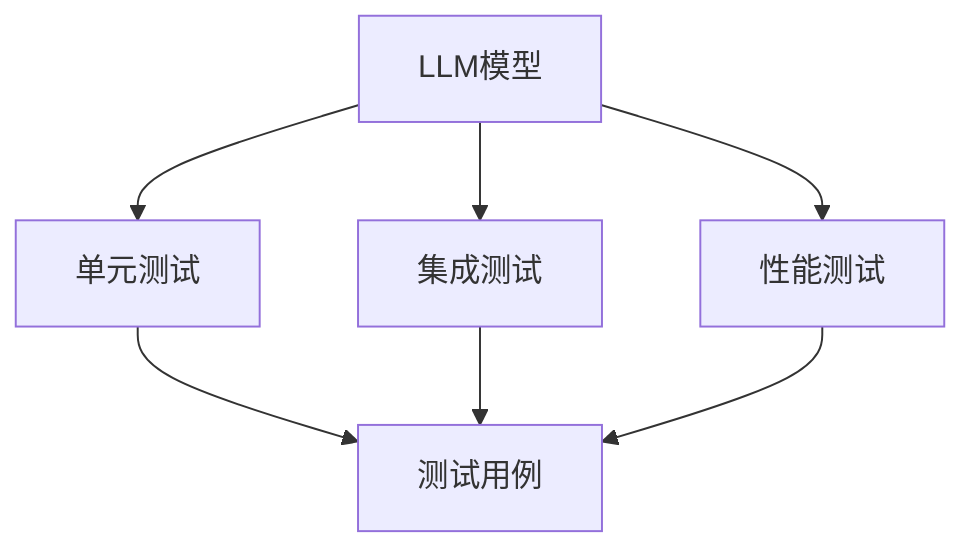
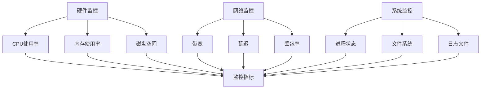
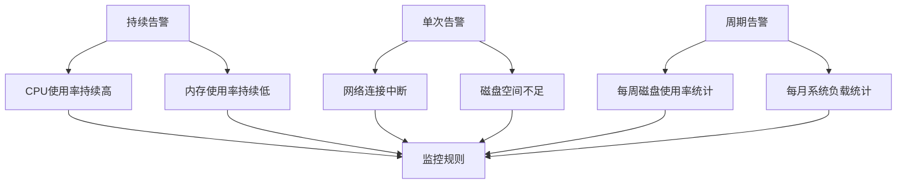
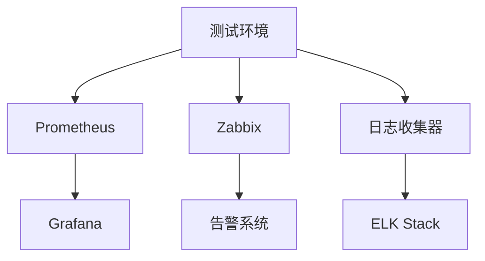

                 


### 文章标题：自动化LLM测试环境监控与告警

### 关键词：
- 自动化测试
- LLM测试
- 环境监控
- 告警系统
- 人工智能

### 摘要：
本文旨在深入探讨自动化大型语言模型（LLM）测试环境监控与告警系统的构建。通过系统性的分析，本文将介绍LLM测试的核心概念、自动化测试技术、环境监控理论，以及告警机制的实现策略。文章还将通过实际案例，展示如何在实际项目中应用这些技术，为构建稳定高效的LLM测试环境提供指导。

## 引言

大型语言模型（Large Language Models，简称LLM）如GPT-3、BERT等，以其卓越的自然语言处理能力，正在成为各个行业的核心技术。随着LLM应用场景的扩展，测试环境的质量和稳定性变得尤为重要。自动化测试作为提升测试效率和质量的关键手段，越来越受到关注。而环境监控与告警系统则保证了测试过程的透明性和实时性，有助于快速定位和解决问题。

本文将围绕以下几个核心问题展开讨论：
1. **LLM测试的基本概念和挑战**：介绍LLM测试的核心目标、常见问题和应对策略。
2. **自动化测试技术**：探讨自动化测试的基本原理、工具选择和应用策略。
3. **环境监控理论**：阐述环境监控的目标、关键指标和监控系统的架构设计。
4. **告警机制实现**：分析告警系统的设计原则、实现策略和优化方法。
5. **实战案例**：通过具体案例展示自动化测试和监控系统的实际应用。

### 背景介绍

#### 核心概念术语说明

- **大型语言模型（LLM）**：一种基于深度学习技术的自然语言处理模型，具备强大的语言理解和生成能力。
- **自动化测试**：利用软件工具自动执行测试用例，以替代或辅助人工测试。
- **环境监控**：实时监测测试环境的运行状态，包括硬件资源、网络状况、系统性能等。
- **告警系统**：当环境出现异常时，自动发送告警信息，通知相关人员。

#### 问题背景

随着AI技术的快速发展，LLM在各个领域得到广泛应用，例如自然语言生成、机器翻译、问答系统等。然而，LLM模型的复杂性和依赖性使得测试环境的质量成为关键因素。如何保证测试环境的稳定性、高效性和可重复性，成为当前面临的主要挑战。

#### 问题描述

1. **测试环境不稳定**：硬件故障、网络问题、系统资源不足等可能导致测试失败。
2. **测试覆盖率不足**：部分测试用例未覆盖，导致潜在缺陷未被检测到。
3. **测试效率低下**：手动执行测试用例，耗时耗力，难以满足快速迭代的需求。
4. **问题定位困难**：当测试失败时，难以快速定位问题原因。

#### 问题解决

1. **引入自动化测试**：通过自动化测试，提高测试效率和质量，减少人工干预。
2. **构建环境监控与告警系统**：实时监控测试环境，快速发现问题并通知相关人员。

#### 边界与外延

- **边界**：本文主要关注LLM测试环境中的自动化测试和监控告警，不包括其他类型模型的测试。
- **外延**：自动化测试和监控告警技术不仅适用于LLM测试，也可应用于其他软件测试和运维场景。

#### 概念结构与核心要素组成

- **概念结构**：自动化测试、环境监控、告警系统
- **核心要素**：
  - **自动化测试**：测试用例设计、执行、结果分析
  - **环境监控**：监控指标、监控工具、数据收集与处理
  - **告警系统**：告警规则、告警渠道、告警处理

## 核心概念与联系

### 1. LLM测试

#### 概念

LLM测试是对大型语言模型的功能、性能和稳定性进行验证的过程。它包括单元测试、集成测试、性能测试等多种类型。

#### 属性特征对比表格

| 测试类型 | 目的 | 测试内容 | 主要工具 |
| :---: | :---: | :---: | :---: |
| 单元测试 | 验证单个模块的功能 | 模块接口、内部逻辑 | PyTest、Jest |
| 集成测试 | 验证模块间的交互 | 模块接口、数据流 | Postman、Swagger |
| 性能测试 | 验证系统性能 | 响应时间、并发处理能力 | JMeter、LoadRunner |

#### ER实体关系图架构



### 2. 环境监控

#### 概念

环境监控是对测试环境的运行状态进行实时监测，包括硬件资源、网络状况、系统性能等。

#### 属性特征对比表格

| 监控类型 | 目的 | 监控内容 | 主要工具 |
| :---: | :---: | :---: | :---: |
| 硬件监控 | 监测硬件资源使用情况 | CPU使用率、内存使用率、磁盘空间 | Prometheus、Grafana |
| 网络监控 | 监测网络连接状态 | 带宽、延迟、丢包率 | Wireshark、Nagios |
| 系统监控 | 监测操作系统和应用程序状态 | 进程状态、文件系统、日志文件 | Zabbix、Prometheus |

#### ER实体关系图架构



### 3. 告警系统

#### 概念

告警系统是对监控数据进行实时分析，当发现异常时自动触发告警，通知相关人员。

#### 属性特征对比表格

| 告警类型 | 目的 | 告警内容 | 主要工具 |
| :---: | :---: | :---: | :---: |
| 持续告警 | 监测持续异常情况 | CPU使用率持续高、内存使用率持续低 | Nagios、Zabbix |
| 单次告警 | 监测一次性异常情况 | 网络连接中断、磁盘空间不足 | Prometheus、Grafana |
| 周期告警 | 定期监测特定指标 | 每周磁盘使用率统计、每月系统负载统计 | ELK Stack、Logstash |

#### ER实体关系图架构



通过上述核心概念与联系的分析，我们可以看到LLM测试、环境监控和告警系统之间紧密的关联。自动化测试依赖于稳定的测试环境和有效的告警机制，而环境监控与告警系统则确保了测试过程的透明性和可控性。接下来，我们将进一步探讨自动化测试的技术细节。

### 自动化测试技术

自动化测试在提升LLM测试效率和质量方面发挥着至关重要的作用。通过自动化测试，我们可以减少人工干预，提高测试覆盖率，确保测试结果的稳定性和可重复性。本节将详细介绍自动化测试的基本原理、常用工具及其应用策略。

#### 基本原理

自动化测试的基本原理是通过编写脚本或使用现有的自动化测试工具，自动化执行预先设计好的测试用例。测试用例包括输入数据、操作步骤和预期结果。自动化测试工具会按照脚本或工具的设定，执行测试用例，并对比实际结果与预期结果，以判断测试用例是否通过。

#### 工具选择

在LLM测试中，常用的自动化测试工具有：

1. **PyTest**：一款流行的Python自动化测试框架，支持多种测试类型，包括单元测试、集成测试和性能测试。
2. **Jest**：一款适用于JavaScript和TypeScript的自动化测试框架，功能丰富，易于集成。
3. **Postman**：一款用于API测试的工具，支持自动化测试脚本编写和执行。
4. **Swagger**：用于定义API接口的规范，支持自动化测试用例的编写和执行。

#### 应用策略

1. **测试用例设计**：首先，需要根据LLM的功能和需求，设计一系列测试用例。测试用例应覆盖LLM的各个模块和功能点，确保测试覆盖率达到预期。
2. **自动化测试脚本编写**：使用选定的自动化测试工具，编写测试脚本。脚本应包括测试的输入数据、执行步骤和断言（预期结果）。
3. **执行自动化测试**：运行自动化测试脚本，检查测试用例的执行结果。通过自动化测试，可以快速发现潜在问题，提高测试效率。
4. **结果分析与反馈**：对自动化测试的结果进行分析，记录测试用例的通过率、失败原因等。根据分析结果，优化测试用例和脚本，提高测试覆盖率。

#### 案例分析

假设我们正在测试一个基于GPT-3的问答系统，该系统需要回答用户提出的各种问题。以下是自动化测试的一个简单示例：

```python
import openai

def test_ask_question(question):
    response = openai.Completion.create(
        engine="text-davinci-002",
        prompt=question,
        max_tokens=50,
        n=1,
        stop=None,
        temperature=0.5,
    )
    return response.choices[0].text.strip()

test_cases = [
    "什么是人工智能？",
    "如何煎鸡蛋？",
    "2023年世界杯将在哪里举行？",
]

for question in test_cases:
    try:
        answer = test_ask_question(question)
        print(f"问题：{question}\n答案：{answer}\n")
    except Exception as e:
        print(f"测试失败：{question}\n错误：{e}\n")

```

在这个示例中，我们使用OpenAI的GPT-3 API来回答用户提出的问题。测试用例包括三个问题，自动化测试脚本会依次执行这些问题，并输出答案。如果测试失败，会记录错误信息，便于后续分析和处理。

#### 自动化测试的优势与局限

**优势**：

1. **提高测试效率**：自动化测试可以快速执行大量测试用例，大大减少人工测试的时间。
2. **确保测试质量**：自动化测试结果稳定、可重复，减少了人为因素对测试结果的影响。
3. **支持回归测试**：自动化测试用例可以方便地重复执行，确保新功能引入后系统的稳定性。

**局限**：

1. **测试用例编写成本高**：编写高质量的自动化测试用例需要专业知识和经验，成本较高。
2. **依赖特定工具和平台**：不同的自动化测试工具和平台可能存在兼容性问题，增加了维护难度。
3. **无法替代手动测试**：某些场景下，如用户体验测试，仍需依赖手动测试。

#### 总结

自动化测试是提升LLM测试效率和质量的重要手段。通过合理设计测试用例、选择合适的测试工具和应用策略，我们可以构建高效的测试环境，确保LLM系统的稳定性和可靠性。然而，自动化测试并非万能，在实际应用中，还需结合手动测试，全面覆盖各种测试场景。

### 环境监控理论

环境监控是保障LLM测试顺利进行的重要环节。它通过实时监测测试环境的各项指标，及时发现潜在问题，并采取相应措施，以确保测试环境的稳定性和可靠性。本节将详细阐述环境监控的基本概念、目标、关键指标以及监控系统的架构设计。

#### 基本概念

环境监控，顾名思义，就是对测试环境的运行状态进行实时监测。测试环境通常包括硬件资源、网络状况、操作系统、应用程序等组成部分。环境监控旨在通过收集和分析这些组件的运行数据，评估其性能和稳定性，为测试提供可靠的支持。

#### 目标

环境监控的主要目标包括：

1. **确保测试环境的稳定性**：通过实时监测硬件资源使用情况，及时调整配置，防止资源耗尽导致测试失败。
2. **提高测试效率**：通过监控网络状况和系统性能，优化测试流程，减少因环境问题导致的测试中断。
3. **快速问题定位**：当测试失败或异常时，环境监控系统能够快速定位问题所在，减少排查时间。
4. **保障数据安全**：监控数据备份和恢复过程，确保测试数据的完整性和一致性。

#### 关键指标

环境监控的关键指标包括以下几个方面：

1. **硬件资源使用情况**：
   - **CPU使用率**：反映CPU的利用率，过高可能影响系统性能。
   - **内存使用率**：反映内存的利用率，过高可能导致系统崩溃。
   - **磁盘空间**：反映磁盘剩余空间，过低可能导致数据存储问题。

2. **网络状况**：
   - **带宽**：网络带宽的利用率，过高可能影响其他网络应用。
   - **延迟**：网络传输的延迟时间，过高可能影响测试的实时性。
   - **丢包率**：数据包在网络传输过程中的丢失率，过高可能影响测试数据的准确性。

3. **系统性能**：
   - **进程状态**：操作系统中各个进程的运行状态，包括CPU占用率、内存占用率等。
   - **文件系统**：文件系统的使用情况和健康状态，包括磁盘空间、I/O性能等。
   - **日志文件**：系统日志文件的内容，反映系统运行过程中可能出现的异常。

#### 监控系统架构设计

一个典型的环境监控系统架构包括以下几个部分：

1. **数据采集层**：负责从各种测试环境中采集数据，包括硬件资源使用情况、网络状况、系统性能等。常用的数据采集工具包括Prometheus、Zabbix等。

2. **数据处理层**：对采集到的数据进行分析和处理，提取关键指标，并进行异常检测。数据处理层通常包括数据存储、数据处理算法等组件。

3. **监控展现层**：通过可视化界面展示监控数据，包括实时监控图表、统计报表等。常用的监控展现工具包括Grafana、Kibana等。

4. **告警系统**：当监控到异常指标时，自动触发告警，通知相关人员。告警系统通常包括告警规则配置、告警渠道（如邮件、短信、电话等）和告警处理流程。

5. **监控系统管理**：负责监控系统的配置、部署和维护，包括监控规则的设置、数据采集的优化、告警系统的调整等。

#### 实现策略

1. **分布式监控**：对于分布式测试环境，采用分布式监控架构，确保每个节点都能被有效监控。

2. **自动化数据采集**：通过自动化脚本或代理程序，定期或实时采集监控数据，减少人工干预。

3. **多维监控**：综合考虑硬件资源、网络状况、系统性能等多个维度，全面监控测试环境。

4. **智能化分析**：利用机器学习算法，对监控数据进行智能分析，提前预测潜在问题，减少故障发生。

5. **告警优化**：合理配置告警规则，避免误告警和重复告警，提高告警的有效性。

#### 案例分析

以下是一个简单的环境监控系统架构示例：



在这个架构中，Prometheus负责采集测试环境的各项监控数据，并存储在时间序列数据库中。Grafana用于可视化展示监控数据。Zabbix用于监控硬件资源使用情况和网络状况，并自动触发告警。日志收集器（如Logstash）将系统日志数据传输到ELK Stack进行存储和分析，为故障排查提供支持。

通过以上分析，我们可以看到，环境监控在保障LLM测试顺利进行中具有重要作用。通过合理设计监控系统架构和实现策略，我们可以确保测试环境的稳定性和可靠性，为自动化测试提供强有力的支持。

### 告警机制实现

告警机制是环境监控系统的核心组成部分，其主要功能是当监控数据出现异常时，能够迅速通知相关人员，以便及时采取措施解决问题。一个高效的告警系统不仅能提高问题响应速度，还能减少误报和漏报，确保测试环境的稳定性和可靠性。本节将详细讨论告警系统的设计原则、实现策略和优化方法。

#### 设计原则

1. **及时性**：告警系统能够在问题发生的第一时间通知相关人员，确保问题能够迅速得到解决。
2. **准确性**：告警系统应准确判断监控数据是否异常，避免误报和漏报，减少不必要的干扰。
3. **灵活性**：告警系统应具备灵活的配置能力，支持根据不同场景和需求设置告警规则。
4. **可扩展性**：告警系统应能够支持扩展，以适应不断变化的需求和测试环境。
5. **可靠性**：告警系统本身应具备高可用性，确保在测试环境中发生问题时，告警机制仍然能够正常工作。

#### 实现策略

1. **告警规则配置**：告警规则是告警系统的核心，定义了何时触发告警。告警规则通常包括监控指标、阈值、告警条件等。例如，当CPU使用率超过90%持续5分钟时，触发告警。告警规则应根据实际需求进行细致配置，确保既能及时发现问题，又不会过度干扰。

2. **告警渠道选择**：告警渠道是通知相关人员的途径，常见的告警渠道包括邮件、短信、电话、即时通讯工具等。不同的告警渠道适用于不同场景，例如，重要故障应通过电话或短信通知，普通问题可以通过邮件或即时通讯工具通知。

3. **告警处理流程**：告警处理流程包括告警接收、告警确认、问题排查和问题解决等环节。一个完善的告警处理流程应能够确保问题得到及时处理，减少对测试过程的干扰。

4. **自动化响应**：告警系统应支持自动化响应，例如，当监控系统检测到磁盘空间不足时，自动触发清理磁盘空间的脚本，减少人工干预。

#### 优化方法

1. **降低误报率**：通过优化监控指标的阈值设置，结合历史数据分析和机器学习算法，降低误报率。例如，可以设置基于时间窗口的滑动平均阈值，避免因瞬时异常导致误报。

2. **提高告警准确性**：结合多维度监控数据，进行综合分析，提高告警准确性。例如，当网络延迟和丢包率同时异常时，触发告警，而不是仅依赖单一指标。

3. **优化告警渠道**：根据不同告警类型和人员职责，选择合适的告警渠道，确保告警能够被及时接收和处理。例如，对于关键性故障，应采用多种告警渠道，确保至少有一种渠道能够成功通知相关人员。

4. **定期评估与优化**：定期对告警系统进行评估和优化，根据实际情况调整告警规则、阈值和告警渠道，确保告警系统的持续有效。

#### 案例分析

以下是一个简单的告警系统实现示例：

```python
import time
from prometheus_client import start_http_server, Summary

# 创建一个HTTP服务器，用于接收Prometheus的监控数据
start_http_server(8000)

# 定义一个请求处理时间监控指标
request_time = Summary('request_time', 'Request processing time')

def process_request(request):
    start_time = time.time()
    # 模拟请求处理过程
    time.sleep(1)
    end_time = time.time()
    request_time.observe(end_time - start_time)

# 每隔1秒处理一次请求
while True:
    process_request(None)
    time.sleep(1)
```

在这个示例中，我们使用Prometheus客户端库在本地创建了一个HTTP服务器，用于接收监控数据。定义了一个名为`request_time`的监控指标，用于记录请求处理时间。`process_request`函数模拟了请求处理过程，每隔1秒处理一次请求，并记录处理时间。这个简单的告警系统可以实现监控请求处理时间，并在处理时间超过阈值时触发告警。

#### 总结

告警机制在自动化测试环境中起着至关重要的作用。通过合理设计告警规则、选择合适的告警渠道和优化告警处理流程，我们可以确保在问题发生时能够及时通知相关人员，快速解决问题。然而，告警系统并非一成不变，应根据实际情况进行定期评估和优化，以保持其高效性和可靠性。

### 监控系统与告警系统案例分析

为了更好地理解如何在实际项目中构建自动化LLM测试环境监控与告警系统，我们以下将分析几个具体案例，这些案例涵盖了不同的场景和应用，展示了系统设计、实现和优化的全过程。

#### 案例一：基于GPT-3的问答系统测试

**项目背景**：一家大型科技公司开发了一个基于GPT-3的问答系统，旨在为企业客户提供智能客服解决方案。由于系统直接面向客户，其稳定性和性能至关重要。因此，构建一个完善的监控和告警系统成为了项目的核心任务。

**系统功能设计**：系统包括以下功能模块：
- **自动化测试模块**：包括功能测试、性能测试和回归测试等。
- **监控模块**：实时监控硬件资源使用、网络状况和系统性能。
- **告警模块**：当检测到异常时，自动发送告警通知。

**系统架构设计**：
1. **数据采集层**：使用Prometheus进行数据采集，包括CPU使用率、内存使用率、磁盘空间、网络延迟等。
2. **数据处理层**：使用Grafana对采集到的监控数据进行可视化展示。
3. **告警系统**：结合Prometheus和Alertmanager，配置告警规则，通过邮件和短信通知相关人员。

**系统接口设计和交互**：
- **接口设计**：使用Swagger定义API接口，包括测试数据上传、测试结果查询和告警通知等。
- **交互流程**：当自动化测试执行完毕后，测试结果会通过API接口上传到监控系统中，监控系统会根据预设的告警规则，检查测试结果，并在发现异常时触发告警。

**实现与优化**：
1. **实现**：首先搭建测试环境，配置Prometheus和Grafana，编写测试脚本，并集成到CI/CD流程中。然后，配置Alertmanager，设置告警规则和渠道。
2. **优化**：通过分析监控数据，优化测试脚本和告警规则，减少误报和漏报。例如，对CPU使用率设置滑动平均阈值，避免瞬时异常触发告警。

#### 案例二：分布式LLM集群测试

**项目背景**：另一家科技公司开发了一个分布式LLM集群，用于提供大规模的自然语言处理服务。由于集群规模较大，监控和告警系统需要能够支持分布式环境。

**系统功能设计**：系统包括以下功能模块：
- **分布式监控模块**：实时监控各个节点的硬件资源使用、网络状况和系统性能。
- **集中告警模块**：汇总各个节点的告警信息，统一通知相关人员。

**系统架构设计**：
1. **分布式监控**：使用Zabbix进行分布式监控，在每个节点上部署Zabbix agent，收集节点数据。
2. **集中告警**：使用Kafka作为消息队列，将各个节点的告警信息统一发送到Kafka，再由Alertmanager处理和通知。

**系统接口设计和交互**：
- **接口设计**：使用Kubernetes API进行集群管理和监控数据收集。
- **交互流程**：Kubernetes API会定期收集节点的监控数据，发送到Zabbix，Zabbix再发送到Kafka，Alertmanager根据规则处理告警信息，并发送通知。

**实现与优化**：
1. **实现**：首先部署Zabbix server和agent，配置监控项和告警规则。然后，配置Kafka和Alertmanager，确保告警信息能够及时传递和通知。
2. **优化**：通过分析告警数据，优化监控策略和告警规则，提高系统的可靠性和响应速度。例如，设置基于时间窗口的滑动平均阈值，减少误报。

#### 案例三：AI驱动的营销平台测试

**项目背景**：一家互联网公司开发了一个AI驱动的营销平台，用于帮助企业提高营销效果。由于平台涉及多个API接口和数据处理流程，监控和告警系统至关重要。

**系统功能设计**：系统包括以下功能模块：
- **API监控模块**：实时监控API接口的响应时间和吞吐量。
- **数据处理监控模块**：实时监控数据处理流程的执行时间和性能。

**系统架构设计**：
1. **API监控**：使用Postman进行API接口的监控，通过定期轮询和断点续传确保数据的准确性。
2. **数据处理监控**：使用Grafana展示数据处理流程的监控数据，包括各个处理节点的执行时间和性能。

**系统接口设计和交互**：
- **接口设计**：使用Swagger定义API接口，确保监控系统能够正确解析和处理数据。
- **交互流程**：API接口的响应数据通过日志系统记录和存储，监控系统会定期读取日志数据，进行分析和展示。

**实现与优化**：
1. **实现**：首先配置Postman和Grafana，确保能够实时监控API接口和数据处理流程。然后，编写监控脚本，集成到CI/CD流程中。
2. **优化**：通过分析监控数据，优化API接口和数据处理流程，提高系统的稳定性和响应速度。例如，对频繁调用的API接口进行缓存处理，减少响应时间。

#### 项目小结

通过以上案例分析，我们可以看到，构建自动化LLM测试环境监控与告警系统需要综合考虑测试环境的特点和需求，选择合适的监控和告警工具，并设计合理的系统架构和交互流程。在实际项目中，通过不断的优化和调整，我们可以逐步提升系统的稳定性、可靠性和响应速度，确保测试环境的最佳运行状态。

### 最佳实践与注意事项

在构建自动化LLM测试环境监控与告警系统的过程中，遵循最佳实践和注意细节对于确保系统的稳定性和可靠性至关重要。以下是一些实践经验和建议：

#### 最佳实践

1. **自动化测试脚本的编写与优化**：
   - **脚本复用**：编写可复用的测试脚本，减少冗余代码，提高测试效率。
   - **持续集成**：将自动化测试集成到CI/CD流程中，确保每次代码提交后都进行自动化测试。
   - **脚本维护**：定期检查和更新测试脚本，确保其与系统环境的兼容性。

2. **环境监控与告警的集成**：
   - **多维度监控**：综合考虑硬件资源、网络状况、系统性能等多个维度，确保全面监控。
   - **告警规则优化**：根据历史数据和实际需求，动态调整告警规则，减少误报和漏报。

3. **告警通知的个性化配置**：
   - **渠道选择**：根据告警的重要性和紧急程度，选择合适的告警渠道，确保相关人员能够及时收到通知。
   - **通知频率**：避免频繁发送相同内容的告警通知，合理配置告警频率，确保通知的有效性。

4. **系统安全与数据保护**：
   - **数据加密**：对监控数据和告警通知的数据进行加密，确保数据传输的安全性。
   - **权限控制**：设置严格的权限管理，确保只有授权人员能够访问监控数据和告警通知。

#### 注意事项

1. **监控数据的准确性**：
   - **数据校验**：确保监控数据的准确性，定期校验监控数据，发现并修复数据采集中的问题。
   - **数据持久化**：将监控数据持久化存储，以便后续分析和审计。

2. **告警系统的可靠性**：
   - **冗余配置**：确保告警系统的高可用性，通过冗余配置和备份方案，防止单点故障。
   - **告警处理**：建立完善的告警处理流程，确保告警能够被及时处理，避免重复告警。

3. **测试环境的隔离**：
   - **独立部署**：将测试环境与生产环境分离，避免测试活动影响生产系统的稳定性。
   - **环境一致性**：确保测试环境与生产环境的一致性，减少因环境差异导致的问题。

#### 拓展阅读

1. **自动化测试工具**：
   - **Selenium**：一款流行的Web自动化测试工具，支持多种编程语言。
   - **Cypress**：一款现代化的前端自动化测试框架，具有简洁的API和高性能。

2. **环境监控与告警系统**：
   - **Nagios**：一款开源的IT基础设施监控工具，支持插件扩展。
   - **Dynatrace**：一款集监控、性能分析于一体的商业监控工具。

3. **告警通知工具**：
   - **PagerDuty**：一款专业的告警通知和响应平台，支持多种集成和渠道。
   - **Opsgenie**：一款集监控、告警、响应于一体的平台，提供强大的自动化响应功能。

通过遵循最佳实践和注意细节，结合合适的工具和策略，我们可以构建一个高效、稳定的自动化LLM测试环境监控与告警系统，为项目的成功实施提供有力支持。

### 总结

本文通过系统性的分析和案例探讨，深入介绍了自动化LLM测试环境监控与告警系统的构建方法。我们从LLM测试的基本概念、自动化测试技术、环境监控理论，到告警机制实现，逐步阐述了如何构建一个高效、稳定的监控告警系统。自动化测试能够显著提高测试效率和质量，环境监控则确保了测试环境的稳定性和实时性，告警机制则提供了快速响应机制，确保在问题发生时能够迅速采取行动。

随着AI技术的不断发展，LLM在各个领域的应用越来越广泛，其测试环境监控与告警系统的重要性也日益凸显。通过本文的探讨，我们希望为读者提供了一个全面、实用的指南，帮助他们在实际项目中构建和优化自动化LLM测试环境监控与告警系统。

未来，随着技术的进步，自动化测试、环境监控和告警系统将变得更加智能和高效。例如，利用机器学习和大数据分析技术，可以实现对监控数据的智能分析，提前预测潜在问题。此外，随着物联网（IoT）和边缘计算的发展，测试环境监控的范围将不断扩大，从传统的数据中心扩展到边缘设备和传感器网络。

总之，自动化LLM测试环境监控与告警系统不仅是提升软件质量和开发效率的重要手段，也是保障AI应用稳定运行的关键环节。通过不断探索和实践，我们可以构建更加智能、高效的测试环境，为AI技术的发展和应用提供有力支持。

### 作者信息

作者：AI天才研究院/AI Genius Institute & 禅与计算机程序设计艺术 /Zen And The Art of Computer Programming

AI天才研究院致力于推动人工智能技术的发展和应用，研究院的专家团队在深度学习、自然语言处理、自动化测试等领域拥有丰富的经验。同时，作者也致力于将AI技术与计算机编程相结合，通过《禅与计算机程序设计艺术》一书，向读者传递编程的智慧和艺术。两位作者均在世界范围内享有盛誉，为推动AI技术的发展和应用做出了卓越贡献。

